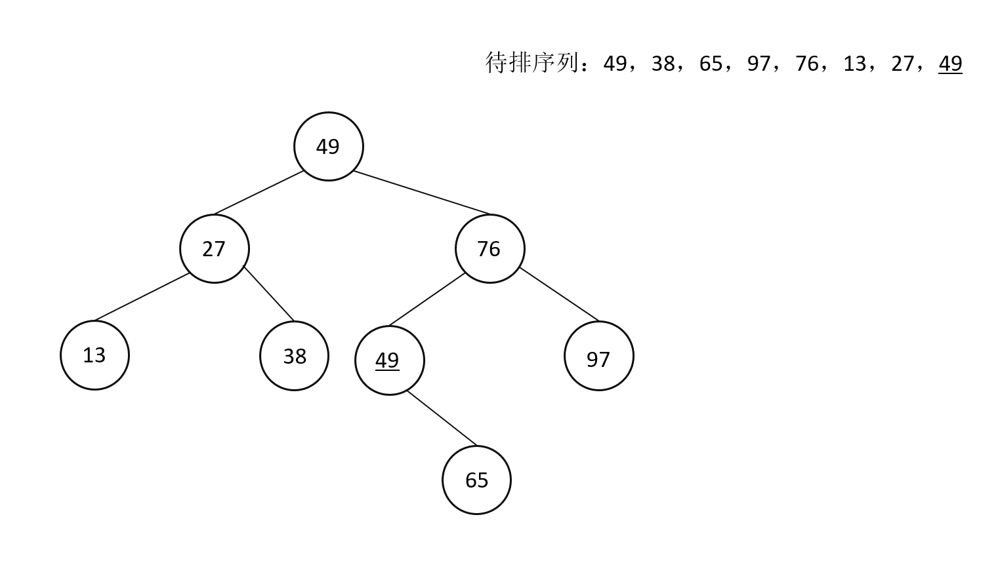

# 数据结构

[TOC]

## 第八章 排序

* 排序概念
  排序，即将原本无序的序列重新排列成有序序列的过程。这个序列中的每一项可能是单独的数据元素，也可能是一条记录(记录是由多个数据元素组成的，如一个学生的记录就是由学号，年龄，姓名，专业等数据元素组成)。对于记录，既可以按照记录的主关键字排序(主关键字可以唯一标识一条记录，比如学号，不能重复，可以用来唯一标识某个学生)，也可以按照记录的次关键字进行排序

* **稳定性**
  稳定性，即当待排序的序列中有两个或两个以上相同的关键字时，排序前和排序后这些关键字在序列中的相对位置没有发生变化，这就是稳定的排序算法，否则就是不稳定的。比如，某个待排的序列中有两个关键字都是50，这两个关键字前后分别可以标记为50(a)、50(b)来区分，使用排序算法进行排序后，50(a)仍然在50(b)的前面，则此算法是稳定的；反之，只要能找出一种情况，使得50(a)排在了50(b)之后，就说明此算法是不稳定的

  >1. 这里提及的算法的稳定性，前提是待排的序列关键字是有重复的，如果关键字不重复，那么排序算法是否稳定无关紧要
  >2. 这里说的稳定性，不是说这个算法在一次排序中，相同关键字的相对位置是否变化，而是说这个排序算法不论运用于哪个待排序列，相同关键字的相对位置都不会发生变化。也就是说，算法的稳定性，与待排序列是无关的，只不过待排序列的关键字相同时可以体现出来这个算法的稳定性

### 8.1 内部排序

#### 8.1.1 内部排序分类

* 根据排序算法采用的不同排序思想，可以将排序算法进行分类
  1. 插入类的排序
     在一个已经有序的序列中，插入一个新的关键字，比如一个学生队列按照个子高低从低到高站队，已经排好的队列中，新来了一个学生，于是这个学生依次从第一个人开始找，找出一个同学，该同学满足：他比自己矮的，但是他后面那位同学比自己高。于是在他后面插队进入队列
     从上面可以看出，对于插入类的排序，关键在于找到数据元素正确的插入位置，所以根据查找算法，可以将插入类排序分为：**`直接插入排序`**、**`折半插入排序`**,另外还有 **`希尔排序`**，它是先对数据元素进行分组，然后再进行插入类的排序，所以本质还是插入类排序

  2. 选择类的排序
     选择类排序的核心就是“选择”,即排序过程中的每一趟都选出一个最小(或最大)的关键字，然后把它和序列中的第一个(或者最后一个)进行交换,这样序列中的第一个(或最后一个)的关键字就到位了(也就是说它找到了最终的位置,其他趟次的排序过程它不会参与也不会改变位置)，剩下的乱序序列继续这个过程排序。这类的排序有 **`简单选择排序`**,**`堆排序`**

  3. 交换类的排序
     交换类排序的核心就是“交换”,即每一趟排序，都通过一系列的交换，让关键字排到最终的位置，这里的交换，是指与周围(相邻)的元素交换，所以每趟排序确定一个元素的最终位置，这趟会发生多次交换，该元素会与周围元素进行交换，最终到达正确的位置。交换类排序的有 **`冒泡排序`**,**`快速排序`**
  4. 归并类排序
     归并就是将两个或两个以上的有序序列合并成一个新的有序序列，首先两两分组，两个人内部先排好顺序，然后再四四分组，四个人内部先排好顺序，以此类推，直至整个序列排好了顺序。两个有序序列在合并的时候进行排序，所消耗的时间并不多，与完全乱序的序列不同，归并排序就是将有序序列进行合并的排序，只是合并过程中，序列会越来越大，直到整个序列被排好了顺序。归并类排序的有 **`二路归并排序`**

  5. 基数类排序
     基数类排序是与其他排序的操作完全不同的思想(前面的排序虽然思想不同，但是都会有“比较”和“移动”),基数类的排序是基于多关键字排序的思想，把一个关键字拆分为多个关键字，先分堆，然后每个堆里有关键字，每个堆里各自排序，然后再进行整体排序。例如，有52张扑克牌进行基数排序，可以按照花色进行排序分组，这样就分成了四组，然后每组里面从A~K以此排序

#### 8.1.2 插入类排序

##### 1.直接插入排序

* 算法介绍
  直接插入排序，面对一个待排序列，可以先拎出第一个元素，它当然是有序的，然后第二个元素，要和已排好顺序的元素依次比较大小，也就是刚刚排好的一个元素，然后找到第二个元素的插入位置，使得数组依然有序；类似的，第三个元素要和已排好顺序的两个元素依次进行比较，找到插入的位置使得三个元素仍然有序。剩下的待排的元素全部都是这样的过程

* 执行流程(排序结果是从小到大)
  通过一个实际的例子来体会直接插入排序的执行流程，比如待排序列为{ 49, 38, 65, 97, 76, 13, 27, <u>49</u> } ,这里面有两个49,第二个相同的数字加上下划线以区分
  原始序列：49, 38, 65, 97, 76, 13, 27, <u>49</u>
  (1) 一开始只看49，一个数当然是有序的
    <span style="color:white;background:black">49</span>&nbsp;&nbsp;&nbsp;&nbsp;&nbsp;&nbsp;&nbsp;&nbsp;38 &nbsp;&nbsp;65 &nbsp;&nbsp;97 &nbsp;&nbsp;76 &nbsp;&nbsp;13 &nbsp;&nbsp;27 &nbsp;&nbsp;<u>49</u>
  (2) 插入38。49>38,所以49向后移动一个位置，38插入到49原来的位置，这趟排序后的结果为：
  <span style="color:white;background:black">38</span> &nbsp;&nbsp;<span style="color:white;background:black">49</span> &nbsp;&nbsp;&nbsp;&nbsp;&nbsp;&nbsp;&nbsp;&nbsp;65 &nbsp;&nbsp;97 &nbsp;&nbsp;76 &nbsp;&nbsp;13 &nbsp;&nbsp;27 &nbsp;&nbsp;<u>49</u>
  (3) 插入65。65>49,所以不需要移动，65就在49之后，这趟排序结果为：
    <span style="color:white;background:black">38</span> &nbsp;&nbsp;<span style="color:white;background:black">49</span> &nbsp;&nbsp;<span style="color:white;background:black">65</span> &nbsp;&nbsp;&nbsp;&nbsp;&nbsp;&nbsp;&nbsp;&nbsp;97 &nbsp;&nbsp;76 &nbsp;&nbsp;13 &nbsp;&nbsp;27 &nbsp;&nbsp;<u>49</u>
  (4) 插入97。97>65,所以不需要移动，97就在65之后，这趟排序结果为：
    <span style="color:white;background:black">38</span> &nbsp;&nbsp;<span style="color:white;background:black">49</span> &nbsp;&nbsp;<span style="color:white;background:black">65</span> &nbsp;&nbsp;<span style="color:white;background:black">97</span> &nbsp;&nbsp;&nbsp;&nbsp;&nbsp;&nbsp;&nbsp;&nbsp;76 &nbsp;&nbsp;13 &nbsp;&nbsp;27 &nbsp;&nbsp;<u>49</u>
  (5) 插入76。97>76,所以97向后移动一个位置，继续比较，65<76,65不需要移动，那么76应该放在65之后，97之前，这趟排序结果为：
    <span style="color:white;background:black">38</span> &nbsp;&nbsp;<span style="color:white;background:black">49</span> &nbsp;&nbsp;<span style="color:white;background:black">65</span> &nbsp;&nbsp;<span style="color:white;background:black">76</span> &nbsp;&nbsp;<span style="color:white;background:black">97</span> &nbsp;&nbsp;&nbsp;&nbsp;&nbsp;&nbsp;&nbsp;&nbsp;13 &nbsp;&nbsp;27 &nbsp;&nbsp;<u>49</u>
  (6) 插入13。13<97,所以97向后移动一个位置，继续比较，76>13,76向后移动一个位置，以此类推找到13应该放在最前面，这样以来，已经排好的数全部都向后移动了一位，这趟排序结果为：
    <span style="color:white;background:black">13</span> &nbsp;&nbsp;<span style="color:white;background:black">38</span> &nbsp;&nbsp;<span style="color:white;background:black">49</span> &nbsp;&nbsp;<span style="color:white;background:black">65</span> &nbsp;&nbsp;<span style="color:white;background:black">76</span> &nbsp;&nbsp;<span style="color:white;background:black">97</span> &nbsp;&nbsp;&nbsp;&nbsp;&nbsp;&nbsp;&nbsp;&nbsp;27 &nbsp;&nbsp;<u>49</u>
  (7) 插入27。27<97,所以97向后移动一个位置，继续比较，76>27,65向后移动一位，以此类推，找到27应该放在13的后面，也就是第二个位置，那么从第二个位置开始，已经排好的数字全部都向后移动了一位，这趟排序结果为：
    <span style="color:white;background:black">13</span> &nbsp;&nbsp;<span style="color:white;background:black">27</span> &nbsp;&nbsp;<span style="color:white;background:black">38</span> &nbsp;&nbsp;<span style="color:white;background:black">49</span> &nbsp;&nbsp;<span style="color:white;background:black">65</span> &nbsp;&nbsp;<span style="color:white;background:black">76</span> &nbsp;&nbsp;<span style="color:white;background:black">97</span> &nbsp;&nbsp;&nbsp;&nbsp;&nbsp;&nbsp;&nbsp;&nbsp;<u>49</u>
  (8) 插入<u>49</u>。<u>49</u><97,所以97向后移动一个位置，继续比较，直到49不大于<u>49</u>，此时49不需要移动，<u>49</u>直接放在49后面即可，这趟排序结果为：
    <span style="color:white;background:black">13</span> &nbsp;&nbsp;<span style="color:white;background:black">27</span> &nbsp;&nbsp;<span style="color:white;background:black">38</span> &nbsp;&nbsp;<span style="color:white;background:black">49</span> &nbsp;&nbsp;<span style="color:white;background:black"><u>49</u></span>&nbsp;&nbsp;<span style="color:white;background:black">65</span> &nbsp;&nbsp;<span style="color:white;background:black">76</span> &nbsp;&nbsp;<span style="color:white;background:black">97</span> &nbsp;&nbsp;&nbsp;&nbsp;&nbsp;&nbsp;

* 算法实现(Java代码)

```java
/**
 * 直接插入排序算法：从小到大
 */
public class DirectInsertSortTest {
    public static void main(String[] args) {
        int[] a = { 49, 38, 65, 97, 76, 13, 27, 49 };
        directInsertSort(a);
        printArrByDirectInsertSort(a);
    }

    /**
     * 直接插入排序算法
     * 思路：第一个数默认是有序的，然后第二个数与第一个数进行比较，第二个数比第一个数小的话，
     * 那就把第一个数移动到后面，然后第二个数放在第一个数原先的位置；如果第二个数比第一个数大的话，第二个数位置不需要移动
     * 以此类推，第三个数，就需要和前两个已经排好顺序的数字进行对比，来查找出第三个数字应该插入的位置...
     */
    public static void directInsertSort(int a[]) {
        int j, temp;
        for (int i = 1; i < a.length; i++) {
            temp = a[i];
            j = i - 1;
            //下面这个循环完成了从待排关键字之前的关键字开始扫描，如果大于待排关键字，则后移一位
            while (j >= 0 && temp < a[j]) {// 如果需要排序结果为从大到小，该行修改为temp>a[j]
                a[j + 1] = a[j];
                --j;
            }
            a[j + 1] = temp;
        }
    }

    /**
     * 打印数组经过直接插入排序后结果
     */
    public static void printArrByDirectInsertSort(int a[]) {
        for (int i = 0; i < a.length; i++) {
            System.out.print(a[i] + " ");
        }
    }
}
```

* 算法性能分析
  **时间复杂度分析**
  从上面的代码可以看出，最内层循环中的`a[j + 1] = a[j];`这一句可作为基本操作。
  1. 考虑最坏的情况，即整个序列是逆序的(序列是从大到小)，则最内层循环的判断条件`temp<a[j]`，此时每一次外层循环执行一次，最内层循环的执行次数都是达到最大值，即i次，而i取值为[1,n-1]，由此可得基本操作的执行次数应为1+2+...+(n-2)+(n-1)=n*(n-1)/2,那么时间复杂度为O(n<sup>2</sup>)
  2. 考虑最好的情况，即整个序列已经有序(从小到大)，则对于内层循环的判断条件`temp<a[j]`这个条件是始终不成立的，此时内层循环始终不执行，双层循环就变成了单层循环，循环内的操作皆为常量级，显然时间复杂度为O(n)
   综上，**直接插入排序的平均时间复杂度为O(n<sup>2</sup>)**

  **空间复杂度**
  算法所需的辅助存储空间不随着待排序列的规模而变化，是个常量，因此**直接插入排序空间复杂度为O(1)**

> 直接插入排序，在每一趟排序中，前面趟次排序已移动过的数字的位置并不是最终位置，在接下来的趟次中它也可能还会被移动，也就是说，不到最后一趟排序，每个数据元素都还不是自己的最终位置，还有可能会被移动，直到最后一趟的排序结束
> 从上面的排序流程可以看出，**直接插入排序是稳定的**，两个相同的数据元素，在排序前后，它们的相对位置不会发生变化

##### 2.折半插入排序

* 算法介绍
  折半插入排序基本思想和直接插入排序类似，区别是查找插入位置的方法不同。折半插入排序是采用折半查找法来查找插入的位置，而直接插入排序是从尾部到头遍历已有的有序序列来查找插入位置

* 算法流程
  原始序列：49&nbsp;&nbsp;38&nbsp;&nbsp;65&nbsp;&nbsp;97&nbsp;&nbsp;76&nbsp;&nbsp;13&nbsp;&nbsp;27&nbsp;&nbsp;<u>49</u>
  具体流程如下：
   1. 刚开始，有序的序列为空，此时选择第一个元素49插入，因为有序序列为空，不需要查找插入位置，直接插入
   2. 考虑38的插入位置，因为有序序列中只有一个元素，将49拿来比较，在49后面插入元素
   3. ....(经过一系列排序后)假如现在有序序列是这样的
      <table style="text-align:center">
      <tr>
          <td></td><td colspan="6">已经排序</td><td colspan="2">未排序</td>
      </tr>
      <tr>
          <td>关键字</td><td>13</td><td>38</td><td>49</td><td>65</td><td>76</td><td>97</td><td>27</td><td>49</td>
      </tr>
      <tr>
          <td>数组下标</td><td>0</td><td>1</td><td>2</td><td>3</td><td>4</td><td>5</td><td>6</td><td>7</td>
      </tr>
      </table>
   4. $low=0$,$high=5$,$m=\lfloor (0+5)/2\rfloor=2$,下标为2的关键字是49,27<49,所以27应该插入到49的低半区，改变$high=m-1=1$,$low=0$不变
   5. $low=0$,$high=1$,$m=\lfloor (0+1)/2\rfloor=0$,下标为0的关键字是13,27>13,所以27应该插入到13的高半区，改变$low=m+1=1$,$high=1$不变
   6. $low=1$,$high=1$,$m=\lfloor (1+1)/2\rfloor=1$,下标为1的关键字是38,27<38,所以27应该插入到38的低半区，改变$high=m-1=0$,$low=1$不变
   7. 此时$low=1$,$high=0$,low>high，位置查找停止，将元素27插入到high+1的位置
* 算法实现(Java代码)

```java
public class BinaryInsertSortTest {
    public static void main(String[] args) {
        int[] arr = { 49, 38, 65, 97, 76, 13, 27, 49 };
        binaryInsertSort(arr);
        printBinaryInsertSort(arr);
    }

    public static void binaryInsertSort(int[] arr) {
        for (int i = 0; i < arr.length; i++) {
            int low = 0;
            int high = i - 1;
            while (low <= high) {
                int mid = (low + high) / 2;
                if (arr[mid] > arr[i]) {
                    high = mid - 1;
                } else {
                    low = mid + 1;
                }
            }
            int j = i - 1;// [high+1,i-1]之间的元素全部后移
            int temp = arr[i];
            while (j > high) {
                arr[j + 1] = arr[j];
                j--;
            }
            arr[high + 1] = temp;
        }
    }

    public static void printBinaryInsertSort(int[] arr) {
        for (int i = 0; i < arr.length; i++) {
            System.out.print(arr[i] + " ");
        }
    }
}
```

* 算法性能分析
  **时间复杂度分析**
  折半查找排序适合关键字比较多的场景，与直接插入排序相比，折半插入排序在查找插入位置上面所花的时间大大减少。但是折半查找排序在关键字移动的次数和直接插入排序是一样的，所以时间复杂度仍和直接插入排序一样。
  最好的情况下，待排序列是正序的，不需要移动元素，但是查找所花时间复杂度为$o(n\log_2{n})$
  最差的情况下，待排序列是逆序的，每趟都需要移动已有有序序列的所有元素，时间复杂度为$o(n^2)$
  平均时间复杂度为$o(n^2)$
  **空间复杂度分析**
  和直接插入排序一样,为$o(1)$

##### 3.希尔排序

* 算法介绍
  希尔排序又称为缩小增量排序，其本质还是插入排序，只不过是将待排序列按照某种规则分成几个子序列，分别对这几个子序列进行直接插入排序。这个规则的体现就是**增量的选取**，如果增量为1，就是直接插入排序。例如：先按照增量5来分割序列，即将下标为0,5,10,15,...的关键字看成一组子序列，将下标为1,6,11,16,...的关键字看成一组子序列，依次这样分组，然后分别对这些子序列进行直接插入排序，这就是一趟希尔排序。第二趟，以增量为2进行分割序列，即将下标为0,2,4,6,...的关键字看成一组子序列，将下标为1,3,5,7,...的关键字看成一组子序列，依次这样分组，然后再次分别对这些子序列进行直接插入排序。最后以增量1为分割，其实就是对整个序列进行直接插入排序，从而完成整个希尔排序
  增量的选取是逐渐缩小的，直接插入排序适用于序列基本有序的情况，而希尔排序的每趟排序都会使得整个序列变得趋向有序，最后再进行一趟直接插入排序，这样会使排序效率更高，这就是希尔排序的思想。
* 算法流程
  原始序列：49&nbsp;&nbsp;38&nbsp;&nbsp;65&nbsp;&nbsp;97&nbsp;&nbsp;76&nbsp;&nbsp;13&nbsp;&nbsp;27&nbsp;&nbsp;<u>49</u>&nbsp;&nbsp;55&nbsp;&nbsp;04
  1. 以增量5分割序列，得到以下子序列：
     子序列1：49&nbsp;&nbsp;&nbsp;&nbsp;&nbsp;&nbsp;&nbsp;&nbsp;&nbsp;&nbsp;&nbsp;&nbsp;&nbsp;&nbsp;&nbsp;&nbsp;&nbsp;&nbsp;&nbsp;&nbsp;&nbsp;&nbsp;&nbsp;&nbsp;&nbsp;13
     子序列2：&nbsp;&nbsp;&nbsp;&nbsp;&nbsp;&nbsp;38&nbsp;&nbsp;&nbsp;&nbsp;&nbsp;&nbsp;&nbsp;&nbsp;&nbsp;&nbsp;&nbsp;&nbsp;&nbsp;&nbsp;&nbsp;&nbsp;&nbsp;&nbsp;&nbsp;&nbsp;&nbsp;&nbsp;&nbsp;&nbsp;&nbsp;27
     子序列3：&nbsp;&nbsp;&nbsp;&nbsp;&nbsp;&nbsp;&nbsp;&nbsp;&nbsp;&nbsp;&nbsp;&nbsp;65&nbsp;&nbsp;&nbsp;&nbsp;&nbsp;&nbsp;&nbsp;&nbsp;&nbsp;&nbsp;&nbsp;&nbsp;&nbsp;&nbsp;&nbsp;&nbsp;&nbsp;&nbsp;&nbsp;&nbsp;&nbsp;&nbsp;&nbsp;&nbsp;&nbsp;<u>49</u>
     子序列4：&nbsp;&nbsp;&nbsp;&nbsp;&nbsp;&nbsp;&nbsp;&nbsp;&nbsp;&nbsp;&nbsp;&nbsp;&nbsp;&nbsp;&nbsp;&nbsp;&nbsp;&nbsp;97&nbsp;&nbsp;&nbsp;&nbsp;&nbsp;&nbsp;&nbsp;&nbsp;&nbsp;&nbsp;&nbsp;&nbsp;&nbsp;&nbsp;&nbsp;&nbsp;&nbsp;&nbsp;&nbsp;&nbsp;&nbsp;&nbsp;&nbsp;&nbsp;&nbsp;55
     子序列5：&nbsp;&nbsp;&nbsp;&nbsp;&nbsp;&nbsp;&nbsp;&nbsp;&nbsp;&nbsp;&nbsp;&nbsp;&nbsp;&nbsp;&nbsp;&nbsp;&nbsp;&nbsp;&nbsp;&nbsp;&nbsp;&nbsp;&nbsp;&nbsp;76&nbsp;&nbsp;&nbsp;&nbsp;&nbsp;&nbsp;&nbsp;&nbsp;&nbsp;&nbsp;&nbsp;&nbsp;&nbsp;&nbsp;&nbsp;&nbsp;&nbsp;&nbsp;&nbsp;&nbsp;&nbsp;&nbsp;&nbsp;&nbsp;&nbsp;04
     分别对这5个子序列进行直接插入排序，得到：
     子序列1：13&nbsp;&nbsp;&nbsp;&nbsp;&nbsp;&nbsp;&nbsp;&nbsp;&nbsp;&nbsp;&nbsp;&nbsp;&nbsp;&nbsp;&nbsp;&nbsp;&nbsp;&nbsp;&nbsp;&nbsp;&nbsp;&nbsp;&nbsp;&nbsp;&nbsp;49
     子序列2：&nbsp;&nbsp;&nbsp;&nbsp;&nbsp;&nbsp;27&nbsp;&nbsp;&nbsp;&nbsp;&nbsp;&nbsp;&nbsp;&nbsp;&nbsp;&nbsp;&nbsp;&nbsp;&nbsp;&nbsp;&nbsp;&nbsp;&nbsp;&nbsp;&nbsp;&nbsp;&nbsp;&nbsp;&nbsp;&nbsp;&nbsp;38
     子序列3：&nbsp;&nbsp;&nbsp;&nbsp;&nbsp;&nbsp;&nbsp;&nbsp;&nbsp;&nbsp;&nbsp;&nbsp;<u>49</u>&nbsp;&nbsp;&nbsp;&nbsp;&nbsp;&nbsp;&nbsp;&nbsp;&nbsp;&nbsp;&nbsp;&nbsp;&nbsp;&nbsp;&nbsp;&nbsp;&nbsp;&nbsp;&nbsp;&nbsp;&nbsp;&nbsp;&nbsp;&nbsp;&nbsp;65
     子序列4：&nbsp;&nbsp;&nbsp;&nbsp;&nbsp;&nbsp;&nbsp;&nbsp;&nbsp;&nbsp;&nbsp;&nbsp;&nbsp;&nbsp;&nbsp;&nbsp;&nbsp;&nbsp;55&nbsp;&nbsp;&nbsp;&nbsp;&nbsp;&nbsp;&nbsp;&nbsp;&nbsp;&nbsp;&nbsp;&nbsp;&nbsp;&nbsp;&nbsp;&nbsp;&nbsp;&nbsp;&nbsp;&nbsp;&nbsp;&nbsp;&nbsp;&nbsp;&nbsp;97
     子序列5：&nbsp;&nbsp;&nbsp;&nbsp;&nbsp;&nbsp;&nbsp;&nbsp;&nbsp;&nbsp;&nbsp;&nbsp;&nbsp;&nbsp;&nbsp;&nbsp;&nbsp;&nbsp;&nbsp;&nbsp;&nbsp;&nbsp;&nbsp;&nbsp;04&nbsp;&nbsp;&nbsp;&nbsp;&nbsp;&nbsp;&nbsp;&nbsp;&nbsp;&nbsp;&nbsp;&nbsp;&nbsp;&nbsp;&nbsp;&nbsp;&nbsp;&nbsp;&nbsp;&nbsp;&nbsp;&nbsp;&nbsp;&nbsp;&nbsp;76
     一趟希尔排序后：13&nbsp;&nbsp;27&nbsp;&nbsp;<u>49</u>&nbsp;&nbsp;55&nbsp;&nbsp;04&nbsp;&nbsp;49&nbsp;&nbsp;38&nbsp;&nbsp;65&nbsp;&nbsp;97&nbsp;&nbsp;76
  2. 以增量3为分割序列，得到以下子序列：
     子序列1：13&nbsp;&nbsp;&nbsp;&nbsp;&nbsp;&nbsp;&nbsp;&nbsp;&nbsp;&nbsp;&nbsp;&nbsp;&nbsp;&nbsp;&nbsp;55&nbsp;&nbsp;&nbsp;&nbsp;&nbsp;&nbsp;&nbsp;&nbsp;&nbsp;&nbsp;&nbsp;&nbsp;&nbsp;38&nbsp;&nbsp;&nbsp;&nbsp;&nbsp;&nbsp;&nbsp;&nbsp;&nbsp;&nbsp;&nbsp;&nbsp;&nbsp;76
     子序列2：&nbsp;&nbsp;&nbsp;&nbsp;&nbsp;&nbsp;27&nbsp;&nbsp;&nbsp;&nbsp;&nbsp;&nbsp;&nbsp;&nbsp;&nbsp;&nbsp;&nbsp;&nbsp;&nbsp;04&nbsp;&nbsp;&nbsp;&nbsp;&nbsp;&nbsp;&nbsp;&nbsp;&nbsp;&nbsp;&nbsp;&nbsp;&nbsp;65
     子序列3：&nbsp;&nbsp;&nbsp;&nbsp;&nbsp;&nbsp;&nbsp;&nbsp;&nbsp;&nbsp;&nbsp;&nbsp;<u>49</u>&nbsp;&nbsp;&nbsp;&nbsp;&nbsp;&nbsp;&nbsp;&nbsp;&nbsp;&nbsp;&nbsp;&nbsp;&nbsp;49&nbsp;&nbsp;&nbsp;&nbsp;&nbsp;&nbsp;&nbsp;&nbsp;&nbsp;&nbsp;&nbsp;&nbsp;&nbsp;97
     分别对这3个子序列进行直接插入排序，得到：
     子序列1：13&nbsp;&nbsp;&nbsp;&nbsp;&nbsp;&nbsp;&nbsp;&nbsp;&nbsp;&nbsp;&nbsp;&nbsp;&nbsp;&nbsp;&nbsp;38&nbsp;&nbsp;&nbsp;&nbsp;&nbsp;&nbsp;&nbsp;&nbsp;&nbsp;&nbsp;&nbsp;&nbsp;&nbsp;55&nbsp;&nbsp;&nbsp;&nbsp;&nbsp;&nbsp;&nbsp;&nbsp;&nbsp;&nbsp;&nbsp;&nbsp;&nbsp;76
     子序列2：&nbsp;&nbsp;&nbsp;&nbsp;&nbsp;&nbsp;04&nbsp;&nbsp;&nbsp;&nbsp;&nbsp;&nbsp;&nbsp;&nbsp;&nbsp;&nbsp;&nbsp;&nbsp;&nbsp;27&nbsp;&nbsp;&nbsp;&nbsp;&nbsp;&nbsp;&nbsp;&nbsp;&nbsp;&nbsp;&nbsp;&nbsp;&nbsp;65
     子序列3：&nbsp;&nbsp;&nbsp;&nbsp;&nbsp;&nbsp;&nbsp;&nbsp;&nbsp;&nbsp;&nbsp;&nbsp;<u>49</u>&nbsp;&nbsp;&nbsp;&nbsp;&nbsp;&nbsp;&nbsp;&nbsp;&nbsp;&nbsp;&nbsp;&nbsp;&nbsp;49&nbsp;&nbsp;&nbsp;&nbsp;&nbsp;&nbsp;&nbsp;&nbsp;&nbsp;&nbsp;&nbsp;&nbsp;&nbsp;97
     又一趟希尔排序后：13&nbsp;&nbsp;04&nbsp;&nbsp;<u>49</u>&nbsp;&nbsp;38&nbsp;&nbsp;27&nbsp;&nbsp;49&nbsp;&nbsp;55&nbsp;&nbsp;65&nbsp;&nbsp;97&nbsp;&nbsp;76
  3. 最后以增量1分割，即进行直接插入排序，从而整个序列有序
* 算法实现(Java代码)

```java
public class ShellSortTest {
    public static void main(String[] args) {
        int[] arr = { 55, 12, 7, 3, 12, 6, 9, 4, 1, 3, 5 };
        shellSort(arr);
        printShellSort(arr);
    }

    public static void shellSort(int[] arr) {
        for (int step = arr.length / 2; step > 0; step /= 2) {// 增量step
            for (int i = step; i < arr.length; i++) {// 对每个子序列进行直接插入排序
                int value = arr[i];
                int j;
                for (j = i - step; j >= 0 && arr[j] > value; j -= step) {
                    arr[j + step] = arr[j];
                }
                arr[j + step] = value;
            }
        }
    }

    public static void printShellSort(int[] arr) {
        for (int i : arr) {
            System.out.print(i + " ");
        }
    }
}
```

* 算法性能分析
  **时间复杂度**
  希尔排序的时间复杂度和增量选取有关，常见的增量选取规则有两种：
  1. 希尔(Shell)提出的:
     $\lfloor n/2 \rfloor$、$\lfloor n/4 \rfloor$、...、$\lfloor n/2^k \rfloor$、···、2、1
     即每次都将增量除以2并向下取整，其中n为序列长度，此时时间复杂度为$o(n^2)$
  2. 帕佩尔诺夫和斯塔舍维奇(Papernov & Stasevich)提出的：
     $2^k+1$、···、65、33、17、9、5、3、1
     其中k为自然数，$2^k+1$小于待排序列的长度，此时时间复杂度为$o(n^{1.5})$
  **空间复杂度**
  希尔排序的空间复杂度和直接插入排序相同，为$o(1)$

  > 增量序列的最后一个值一定是1
  > 增量序列中的值应尽量没有除1之外的公因子

#### 8.1.3选择类排序

##### 1.简单选择排序

* 算法介绍
  选择类排序的主要动作是“选择”,简单选择排序采用最简单的选择方式，从头至尾顺序扫描序列，找出最小的关键字(把最小关键字的index放在一个临时变量中)，和第一个关键字交换(整个扫描过程结束后再交换，所以一趟选择排序，只交换了一次元素)，接着从剩下的关键字中继续这种选择和交换，最终使序列有序

* 算法流程
  原始序列：49&nbsp;&nbsp;38&nbsp;&nbsp;65&nbsp;&nbsp;97&nbsp;&nbsp;76&nbsp;&nbsp;13&nbsp;&nbsp;27&nbsp;&nbsp;<u>49</u>
  具体流程如下：
   1. 在进行选择排序过程中，将整个序列分成有序部分和无序部分。开始时，整个序列是无序的，如下：
      <table style="text-align:center"><tr><td colspan="8">无序</td></tr><tr><td>49</td><td>38</td><td>65</td><td>97</td><td>76</td><td>13</td><td>27</td><td><u>49</u></td></tr></table>
   2. 在经过一趟排序之后，从无序序列中选取一个最小的关键字13，使得原本无序的序列的第一个元素与第一趟找到的最小元素进行交换，此时无序序列分成了有序序列(第一个元素组成的)，和无序序列(从第二个元素开始剩下的元素组成的):
      <table style="text-align:center"><tr><td>有序</td><td colspan="7">无序</td></tr><tr><td>13</td><td>38</td><td>65</td><td>97</td><td>76</td><td>49</td><td>27</td><td><u>49</u></td></tr></table>
   3. 对序列中的无序序列重复上述步骤，直到无序序列中的关键字变为0为止

* 算法实现(Java代码)

```java
public class SimpleSelectionSortTest {
    public static void main(String[] args) {
        int[] arr = { 49, 38, 65, 97, 76, 13, 27, 49 };
        simpleSelectionSort(arr);
        printSimpleSelectionSort(arr);
    }

    /**
     * 简单选择排序
     * 思路：
     * 选择类排序的主要动作是“选择”,简单选择排序采用最简单的选择方式，
     * 从头至尾顺序扫描序列，找出最小的关键字(把最小关键字的数组下标index放在一个临时变量中)，
     * 然后最小的元素和第一个元素交换(整个扫描过程结束后再交换，所以一趟选择排序，只交换了一次元素)，
     * 接着从剩下的关键字中继续这种选择和交换，最终使序列有序
     */
    public static void simpleSelectionSort(int arr[]) {
        for (int i = 0; i < arr.length; i++) {
            int k = i;
            for (int j = i + 1; j < arr.length; j++) {
                if (arr[k] > arr[j]) {
                    k = j;
                }
            }
            if (i != k) {
                int temp = arr[i];
                arr[i] = arr[k];
                arr[k] = temp;
            }
        }
    }

    /**
     * 打印数组经过简单选择排序后结果
     */
    public static void printSimpleSelectionSort(int[] arr) {
        for (int i = 0; i < arr.length; i++) {
            System.out.print(arr[i] + " ");
        }
    }
}
```

* 算法性能分析
  **时间复杂度分析**
  从上面的代码可以看出，最内层循环中的判断`arr[k] > arr[j]`作为基本操作。
  通过代码可以看出，两层循环的执行次数和初始序列没有关系，外层执行n次，内层循环执行次数依次为n-1,n-2,n-3,...，2,1,0,所以执行总数为$\sum_{i=1}^n{(n-i)}=\frac{ n(n-1) }{ 2 }$
  因此**简单选择排序时间复杂度为$o(n^2)$**
  **空间复杂度**
  算法所需的辅助存储空间不随着待排序列的规模而变化，是个常量，因此**简单选择排序空间复杂度为O(1)**

> 简单选择排序看似和冒泡排序或者简单插入排序相似，好像都有进行把一个元素和其他元素比较大小，但是之后的操作不同。简单插入排序是进行不断插入，序列渐渐有序，最后实现整个序列有序，排序过程中序列不会到达最终位置。冒泡排序是通过不断的和相邻元素进行比较和交换，每次都会确定一个元素的最终位置
> 从上面的排序流程可以看出，**简单选择排序是稳定的**，两个相同的数据元素，在排序前后，它们的相对位置不会发生变化

##### 2.堆排序

* 算法介绍
  
* 算法流程
* 算法实现
* 算法性能分析
17543069168
#### 8.1.4 交换类排序

##### 1.冒泡排序

* 算法介绍
  冒泡排序又称为起泡排序，它是通过一系列的“交换”动作完成的。首先第一个关键字和第二个关键字进行比较，如果第一个关键字大，则交换这两个元素，否则不交换；然后第二个关键字和第三个关键字进行比较大小，如果第二个关键字大，则又交换位置，否则不交换；...一直按照这样的顺序进行下去，最终最大的那个关键字会被交换到最后，第一趟冒泡排序就完成了。第二趟冒泡排序，是拿第二个关键字到第n-1个关键字进行相邻的依次进行“比较”和“交换”，这样一趟冒泡排序之后，第二大的元素就被找到了，它放在了数组倒数第二的位置。以后每趟冒泡排序都会确定一个元素的最终位置，直到每个元素都找到了最终位置。整个冒泡排序过程中，大的关键字就像“石头”一样“沉底”，小的关键字渐渐的像气泡一样向上“浮动”，冒泡排序的名字由此而来。

* 算法流程
  原始序列：49&nbsp;&nbsp;38&nbsp;&nbsp;65&nbsp;&nbsp;97&nbsp;&nbsp;76&nbsp;&nbsp;13&nbsp;&nbsp;27&nbsp;&nbsp;<u>49</u>
  下面进行**第一趟**冒泡排序
   1. 1号元素和2号元素比较，49>38,交换。
      38&nbsp;&nbsp;<span style="color:white;background:black">49</span>&nbsp;&nbsp;65&nbsp;&nbsp;97&nbsp;&nbsp;76&nbsp;&nbsp;13&nbsp;&nbsp;27&nbsp;&nbsp;<u>49</u>
   2. 2号元素和3号元素比较，49<65,不用交换。
      38&nbsp;&nbsp;49&nbsp;&nbsp;<span style="color:white;background:black">65</span>&nbsp;&nbsp;97&nbsp;&nbsp;76&nbsp;&nbsp;13&nbsp;&nbsp;27&nbsp;&nbsp;<u>49</u>
   3. 3号元素和4号元素比较，65<97,不用交换。
      38&nbsp;&nbsp;49&nbsp;&nbsp;65&nbsp;&nbsp;<span style="color:white;background:black">97</span>&nbsp;&nbsp;76&nbsp;&nbsp;13&nbsp;&nbsp;27&nbsp;&nbsp;<u>49</u>
   4. 4号元素和5号元素比较，97>76,交换。
      38&nbsp;&nbsp;49&nbsp;&nbsp;65&nbsp;&nbsp;76&nbsp;&nbsp;<span style="color:white;background:black">97</span>&nbsp;&nbsp;13&nbsp;&nbsp;27&nbsp;&nbsp;<u>49</u>
   5. 5号元素和6号元素比较，97>13,交换。
      38&nbsp;&nbsp;49&nbsp;&nbsp;65&nbsp;&nbsp;76&nbsp;&nbsp;13&nbsp;&nbsp;<span style="color:white;background:black">97</span>&nbsp;&nbsp;27&nbsp;&nbsp;<u>49</u>
   6. 6号元素和7号元素比较，97>27,交换。
      38&nbsp;&nbsp;49&nbsp;&nbsp;65&nbsp;&nbsp;76&nbsp;&nbsp;13&nbsp;&nbsp;27&nbsp;&nbsp;<span style="color:white;background:black">97</span>&nbsp;&nbsp;<u>49</u>
   7. 7号元素和8号元素比较，97><u>49</u>,交换。
      38&nbsp;&nbsp;49&nbsp;&nbsp;65&nbsp;&nbsp;76&nbsp;&nbsp;13&nbsp;&nbsp;27&nbsp;&nbsp;<u>49</u>&nbsp;&nbsp;<span style="color:white;background:black">97</span>

   至此一趟冒泡排序结束，最大的97被交换到最后，97到达了它的最终位置。接下来对序列的前7个数字也进行上面的步骤执行第二趟冒泡排序。经过若干趟次后，最终序列有序。

* 算法实现(Java代码)

```java
public class bubbleSortTest {
    public static void main(String[] args) {
        int[] a = { 49, 38, 65, 97, 76, 13, 27, 49 };
        bubbleSort(a);
        printArrByBubbleSort(a);
    }

    /**
     * 冒泡排序算法
     * 思路：外层的循环次数和数组长度相同，多少个关键字就是要循环多少次，也就是执行多少趟次的冒泡排序
     * 第一趟，i=length;内层循环，都是从j=[1,i-1],然后依次拿a[j]和a[j-1]进行比较和交换:a[1]和a[0]....a[length-1]和a[length-2]。第一趟后最大的数沉到了a[length-1]
     * 第二趟（上一趟找到的最大数字不再参与排序了），i=length-1；内层循环：a[1]和a[0]...a[i-1]和a[i-2]。。。
     * 注意：isOrder可以获取到，某次的冒泡排序，没有进行数字交换，也就是说，这趟的序列已经是从小到大排序了，那外层循环也不需要继续进行了
     */
    public static void bubbleSort(int[] a) {
        int temp;
        for (int i = a.length; i > 0; i--) {
          boolean isOrder = true;
            for (int j = 1; j < i; j++) {
                if (a[j - 1] > a[j]) {//如果需要从大到小，这里改成a[j - 1] < a[j]
                    temp = a[j - 1];
                    a[j - 1] = a[j];
                    a[j] = temp;
                    isOrder = false;
                }
            }
            if (isOrder) {
                return;
            }
        }
    }

    /**
     * 打印数组经过冒泡排序后结果
     */
    public static void printArrByBubbleSort(int[] a) {
        for (int i = 0; i < a.length; i++) {
            System.out.print(a[i] + " ");
        }
    }
}
```

  >**从上面的代码可以看出，冒泡排序算法结束的条件是：在一趟排序过程中没有发生关键字的交换**

* 算法性能分析
  **时间复杂度分析**
  由冒泡排序算法可知，可选取最内层循环中的关键字交换操作作为基本操作
  1. 最坏的情况，待排序列是逆序的，此时对于外层循环的每次执行，内层循环中的条件`a[j-1]>a[j]`始终成立，即基本操作执行的次数为n-i。可知i的取值为[1,n-1]，那么基本操作总的执行次数为1+2+...+(n-1)=n(n-1)/2,时间复杂度为O(n<sup>2</sup>)
  2. 最好的情况，待排序列有序，此时内层循环中的条件始终不成立，交换不发生，且内层循环执行n-1次后整个算法结束，时间复杂度为O(n)
   综上，**直接插入排序的平均时间复杂度为O(n<sup>2</sup>)**

  **空间复杂度**
  算法所需的辅助存储空间不随着待排序列的规模而变化，是个常量，因此**直接插入排序空间复杂度为O(1)**

> 冒泡排序每趟就会确定一个元素的最终位置,待排序列中的最大数会被沉入数组中的后面
> 从上面的排序流程可以看出，**冒泡排序是稳定的**，两个相同的数据元素，在排序前后，它们的相对位置不会发生变化

##### 2.快速排序

* 算法介绍
  快速排序也是“交换”类的排序，但是它通过多次划分操作实现排序。以升序为例，其执行流程可以概括为：每一趟选择当前所有子序列中的一个关键字(通常是第一个)作为枢纽，将子序列中比枢纽小的移到枢纽前边，比枢纽大的移到枢纽后边；那本趟所有子序列都被枢纽以上述规则划分完毕后会得到新的一组更短的子序列，它们成为下一趟划分的初始序列集。
  换一句话说，刚开始是一个初始待排序列，然后挑出一个数(往往是第一个数)，以此为划分，将比它大于或者等于的数放在后面，将比它小于或者等于的数放在前面，然后一趟下去后，第一个数就找到了它在数组中的最终位置，然后现在产生了两个子序列，这两个子序列继续上面的步骤，最终会成为有序序的序列，只不过这个交换用到了两个指针来移动，具体步骤如下算法流程。

* 算法流程
  原始序列：49&nbsp;&nbsp;38&nbsp;&nbsp;65&nbsp;&nbsp;97&nbsp;&nbsp;76&nbsp;&nbsp;13&nbsp;&nbsp;27&nbsp;&nbsp;<u>49</u>
  &nbsp;&nbsp;&nbsp;&nbsp;&nbsp;&nbsp;&nbsp;&nbsp;&nbsp;&nbsp;&nbsp;&nbsp;&nbsp;&nbsp;&nbsp;&nbsp;&nbsp;&nbsp;&nbsp;&nbsp;i&nbsp;&nbsp;&nbsp;&nbsp;&nbsp;&nbsp;&nbsp;&nbsp;&nbsp;&nbsp;&nbsp;&nbsp;&nbsp;&nbsp;&nbsp;&nbsp;&nbsp;&nbsp;&nbsp;&nbsp;&nbsp;&nbsp;&nbsp;&nbsp;&nbsp;&nbsp;&nbsp;&nbsp;&nbsp;&nbsp;&nbsp;&nbsp;&nbsp;&nbsp;&nbsp;&nbsp;&nbsp;&nbsp;&nbsp;&nbsp;&nbsp;j&nbsp;&nbsp;&nbsp;( i 和 j 开始时分别指向头、尾关键字)
  进行第一趟快速排序，以第一个数49作为枢纽，整个过程是一个交替扫描和交换的过程
  1. 使用 j，从j的位置开始向前扫描，直到遇到第一个比49小的数，为27<49,则j停在此处
    49&nbsp;&nbsp;38&nbsp;&nbsp;65&nbsp;&nbsp;97&nbsp;&nbsp;76&nbsp;&nbsp;13&nbsp;&nbsp;27&nbsp;&nbsp;<u>49</u>
  &nbsp;&nbsp;i&nbsp;&nbsp;&nbsp;&nbsp;&nbsp;&nbsp;&nbsp;&nbsp;&nbsp;&nbsp;&nbsp;&nbsp;&nbsp;&nbsp;&nbsp;&nbsp;&nbsp;&nbsp;&nbsp;&nbsp;&nbsp;&nbsp;&nbsp;&nbsp;&nbsp;&nbsp;&nbsp;&nbsp;&nbsp;&nbsp;&nbsp;&nbsp;&nbsp;&nbsp;&nbsp;j
  2. 因为枢纽的值已经存到了临时变量temp里面，则将位置j的元素赋给数组中i的位置
   27&nbsp;&nbsp;38&nbsp;&nbsp;65&nbsp;&nbsp;97&nbsp;&nbsp;76&nbsp;&nbsp;13&nbsp;&nbsp;&nbsp;&nbsp;&nbsp;&nbsp;&nbsp;&nbsp;<u>49</u>
  &nbsp;&nbsp;i&nbsp;&nbsp;&nbsp;&nbsp;&nbsp;&nbsp;&nbsp;&nbsp;&nbsp;&nbsp;&nbsp;&nbsp;&nbsp;&nbsp;&nbsp;&nbsp;&nbsp;&nbsp;&nbsp;&nbsp;&nbsp;&nbsp;&nbsp;&nbsp;&nbsp;&nbsp;&nbsp;&nbsp;&nbsp;&nbsp;&nbsp;&nbsp;&nbsp;&nbsp;&nbsp;j
  3. 使用 i ,变换扫描方向，从前向后扫描，直到遇到比枢纽49大的数65，i停在这里
   27&nbsp;&nbsp;38&nbsp;&nbsp;65&nbsp;&nbsp;97&nbsp;&nbsp;76&nbsp;&nbsp;13&nbsp;&nbsp;&nbsp;&nbsp;&nbsp;&nbsp;&nbsp;&nbsp;<u>49</u>
  &nbsp;&nbsp;&nbsp;&nbsp;&nbsp;&nbsp;&nbsp;&nbsp;&nbsp;&nbsp;&nbsp;&nbsp;&nbsp;&nbsp;i&nbsp;&nbsp;&nbsp;&nbsp;&nbsp;&nbsp;&nbsp;&nbsp;&nbsp;&nbsp;&nbsp;&nbsp;&nbsp;&nbsp;&nbsp;&nbsp;&nbsp;&nbsp;&nbsp;&nbsp;&nbsp;&nbsp;&nbsp;&nbsp;j
  4. 将65交换到序列后端 j 的位置
  27&nbsp;&nbsp;38&nbsp;&nbsp;&nbsp;&nbsp;&nbsp;&nbsp;&nbsp;&nbsp;97&nbsp;&nbsp;76&nbsp;&nbsp;13&nbsp;&nbsp;65&nbsp;&nbsp;<u>49</u>
  &nbsp;&nbsp;&nbsp;&nbsp;&nbsp;&nbsp;&nbsp;&nbsp;&nbsp;&nbsp;&nbsp;&nbsp;&nbsp;&nbsp;i&nbsp;&nbsp;&nbsp;&nbsp;&nbsp;&nbsp;&nbsp;&nbsp;&nbsp;&nbsp;&nbsp;&nbsp;&nbsp;&nbsp;&nbsp;&nbsp;&nbsp;&nbsp;&nbsp;&nbsp;&nbsp;&nbsp;&nbsp;&nbsp;j
  5. 使用j,变换扫描方向,从后向前扫描，直到遇到比枢纽49小的数13，j停在这里
  27&nbsp;&nbsp;38&nbsp;&nbsp;&nbsp;&nbsp;&nbsp;&nbsp;&nbsp;&nbsp;97&nbsp;&nbsp;76&nbsp;&nbsp;13&nbsp;&nbsp;65&nbsp;&nbsp;<u>49</u>
  &nbsp;&nbsp;&nbsp;&nbsp;&nbsp;&nbsp;&nbsp;&nbsp;&nbsp;&nbsp;&nbsp;&nbsp;&nbsp;&nbsp;i&nbsp;&nbsp;&nbsp;&nbsp;&nbsp;&nbsp;&nbsp;&nbsp;&nbsp;&nbsp;&nbsp;&nbsp;&nbsp;&nbsp;&nbsp;&nbsp;&nbsp;j
  6. 将13交换到序列 i 所在的位置
  27&nbsp;&nbsp;38&nbsp;&nbsp;13&nbsp;&nbsp;97&nbsp;&nbsp;76&nbsp;&nbsp;&nbsp;&nbsp;&nbsp;&nbsp;&nbsp;&nbsp;65&nbsp;&nbsp;<u>49</u>
  &nbsp;&nbsp;&nbsp;&nbsp;&nbsp;&nbsp;&nbsp;&nbsp;&nbsp;&nbsp;&nbsp;&nbsp;&nbsp;&nbsp;i&nbsp;&nbsp;&nbsp;&nbsp;&nbsp;&nbsp;&nbsp;&nbsp;&nbsp;&nbsp;&nbsp;&nbsp;&nbsp;&nbsp;&nbsp;&nbsp;&nbsp;j
  7. 使用 i,变化扫描方向，从前往后扫描，直到遇到比49大的数字97，i 停在这里
  27&nbsp;&nbsp;38&nbsp;&nbsp;13&nbsp;&nbsp;97&nbsp;&nbsp;76&nbsp;&nbsp;&nbsp;&nbsp;&nbsp;&nbsp;&nbsp;&nbsp;65&nbsp;&nbsp;<u>49</u>
  &nbsp;&nbsp;&nbsp;&nbsp;&nbsp;&nbsp;&nbsp;&nbsp;&nbsp;&nbsp;&nbsp;&nbsp;&nbsp;&nbsp;&nbsp;&nbsp;&nbsp;&nbsp;&nbsp;&nbsp;i&nbsp;&nbsp;&nbsp;&nbsp;&nbsp;&nbsp;&nbsp;&nbsp;&nbsp;&nbsp;&nbsp;&nbsp;j
  8. 将97交换到j的位置
  27&nbsp;&nbsp;38&nbsp;&nbsp;13&nbsp;&nbsp;&nbsp;&nbsp;&nbsp;&nbsp;&nbsp;&nbsp;76&nbsp;&nbsp;97&nbsp;&nbsp;65&nbsp;&nbsp;<u>49</u>
  &nbsp;&nbsp;&nbsp;&nbsp;&nbsp;&nbsp;&nbsp;&nbsp;&nbsp;&nbsp;&nbsp;&nbsp;&nbsp;&nbsp;&nbsp;&nbsp;&nbsp;&nbsp;&nbsp;&nbsp;i&nbsp;&nbsp;&nbsp;&nbsp;&nbsp;&nbsp;&nbsp;&nbsp;&nbsp;&nbsp;&nbsp;&nbsp;j
  9. 使用j,变化扫描方向，从后向前扫描，直到遇到比枢纽49还小的数，但是一直没有遇到，且i和j指向了同一个位置，说明此趟扫描结束
  27&nbsp;&nbsp;38&nbsp;&nbsp;13&nbsp;&nbsp;&nbsp;&nbsp;&nbsp;&nbsp;&nbsp;&nbsp;76&nbsp;&nbsp;97&nbsp;&nbsp;65&nbsp;&nbsp;<u>49</u>
  &nbsp;&nbsp;&nbsp;&nbsp;&nbsp;&nbsp;&nbsp;&nbsp;&nbsp;&nbsp;&nbsp;&nbsp;&nbsp;&nbsp;&nbsp;&nbsp;&nbsp;&nbsp;&nbsp;&nbsp;ij
  10. 此时i等于j的这个位置就是枢纽49的最终位置，将49放在此处，第一趟快速排序结束。
  27&nbsp;&nbsp;38&nbsp;&nbsp;13&nbsp;&nbsp;49&nbsp;&nbsp;76&nbsp;&nbsp;97&nbsp;&nbsp;65&nbsp;&nbsp;<u>49</u>
  &nbsp;&nbsp;&nbsp;&nbsp;&nbsp;&nbsp;&nbsp;&nbsp;&nbsp;&nbsp;&nbsp;&nbsp;&nbsp;&nbsp;&nbsp;&nbsp;&nbsp;&nbsp;&nbsp;&nbsp;ij

  由上可看出经过一趟划分后，以原来的枢纽49划分出了两个部分，前面的都是小于等于49的数字，后面都是大于等于49的数字，它们分别是{27,38,13}和{76,97,65,<u>49</u>},然后这两个子序列也是按照上面的流程进行扫描、交换，最终会得到一个有序的序列

* 算法实现(Java代码)

```java
public class QuickSortTest {
    public static void main(String[] args) {
        int[] a = { 49, 38, 65, 97, 76, 13, 27, 49 };
        quickSort(a, 0, a.length - 1);
        printArrByQuickSort(a);
    }

    /**
     * 快速排序算法
     * 思路：
     * 1.这里用到了两个标记指针，分别在序列的首位和末尾，然后选一个元素作为枢纽(选第一个元素)
     * 2.向前移动标记j，直到遇到a[j]<temp时停止，并将该a[j]值赋给a[i++]
     * 3.现在向后移动标记i，直到遇到a[i]>temp时停止，并将该a[i]的值赋给a[j++]
     * 4.重复第二步
     * 直到遇到i==j时停止移动标记指针，并将temp赋给a[i]
     * 现在整个序列以枢纽为分割，被分成两个子序列，将这两个序列再次执行此算法步骤
     */
    public static void quickSort(int[] a, int left, int right) {
        int i = left, j = right;
        if (i < j) {
            int temp = a[i];
            while (i < j) {
                while (i < j && a[j] >= temp) {//想要从大到小的话，这里改成a[j] <= temp
                    --j;
                }
                if (i < j) {//这里必须判断i，j大小，因为有可能中途i和j相遇
                    a[i] = a[j];
                    ++i;
                }
                while (i < j && a[i] <= temp) {//想要从大到小的话，这里改成a[i] >= temp
                    ++i;
                }
                if (i < j) {//这里必须判断i，j大小，因为有可能中途i和j相遇
                    a[j] = a[i];
                    --j;
                }
            }
            a[i] = temp;
            quickSort(a, left, i - 1);
            quickSort(a, i + 1, right);
        }
    }

    /**
     * 打印数组经过快速排序后结果
     */
    public static void printArrByQuickSort(int[] a) {
        for (int i = 0; i < a.length; i++) {
            System.out.print(a[i] + " ");
        }
    }
}

```

* 算法性能分析
  **时间复杂度分析**
  快速排序的时间取决于快速排序递归的深度，可以用递归树来描述递归算法的执行情况，比如上面算法流程种的序列{ 49, 38, 65, 97, 76, 13, 27, <u>49</u> }在快速排序种的递归树如下：
  
  如上图可以看出这个二叉排序树也正好是平衡二叉树,这样的话，树的深度最小，排序所需时间也是最小的。但是该算法不是每次排序生成的递归树都是这样高效。当待排序列是有序序列时，递归树成了一条线性的链，排序算法的效率降低，所以该算法在待排序列越接近无序则效率越高。
  > **证明快速排序算法时间复杂度是$O(nlog_2 n)$**
  从上图可看出递归树的深度为$\lfloor log_2 n \rfloor$+1,即最多需递归$\lfloor log_2 n \rfloor$+1次，每层递归都需要对数组扫描一遍，做n次比较。枢纽将数组分成了两部分，那么各自还需要T(n/2)的时间(最好的情况，如果不均分，那么有可能不是平衡二叉树，花的时间只会更多)，不断划分下去，可以有下面的推断：
  第一趟：$T(n)\leq 2T(n/2) +n,T(1)=0$
  第二趟：$T(n)\leq 2(2T(n/4) +n/2) +n=4T(n/4) +2n$
  第三趟：$T(n)\leq 4(2T(n/8)+n/4) +2n=8T(n/8) +3n$
  ......
  第k趟：$T(n)\leq 2^k *T(n/2^k) +kn$
  现在，我们来令$k=log_2 n$,带入到第k趟中，则有:
  $T(n)\leq n*T(1) +nlog_2 n$
  又因为$T(1)=0$,则可以得出$T(log_2 n)\leq nlog_2 n$
  也就是说，最优的情况下，快速排序算法的时间复杂度为$O(nlogn)$
  在最坏的情况下，待排序的序列为正序或者逆序，每次划分只得到一个比上一次划分少一个记录的子序列，递归树可以想象，它是一棵斜树。此时需要执行n-1次递归调用，且第i次关键字的比较才能找到第i个记录，也就是枢纽的位置。因此比较次数为
  $\sum_{i=1}^{n-1} (n-i)=(n-1)+(n-2+)···+1=\frac{ n(n-1) }{ 2 }$
  最坏情况下，快速排序算法的时间复杂度为$O(n^2)$
  平均的情况，设枢纽的关键字应该在第k的位置($1\leq k\leq n$)，那么：
  $T(n)=\frac{1}{n}\sum_{k=1}^{n}[T(k-1)+T(n-k)]+n=\frac{2}{n}\sum_{k=1}^{n-1}T(k)+n$
  接下来就是纯数学的运算了
  令$S(n)=\sum_{k=1}^{n}T(n)$,
  所以上面的式子可以写成：
  $T(n)=n+\frac{2}{n}S(n-1)$
  $S(n)-S(n-1)=T(n)=\frac{(n+1)[T(n+1)-(n+1)]}{2}-\frac{n[T(n)-n]}{2}$
  以上是得到了T(n+1)和T(n)关系的式子，迭代求解可得$T(n)=$//todo

  **空间复杂度**

#### 8.1.5 归并类排序

##### 1.二路归并排序

#### 8.1.6 基数类排序

##### 1.基数排序

### 8.2 外部排序

//todo，暂时不说明

### 8.3 时间复杂度分析

## 第九章 查找

## 附录

### 参考文档

1. 严蔚敏版《数据结构(C语言版)》
2. 马克·艾伦·维斯[美]《数据结构与算法分析》
3. Java源代码中实现的数据结构算法
