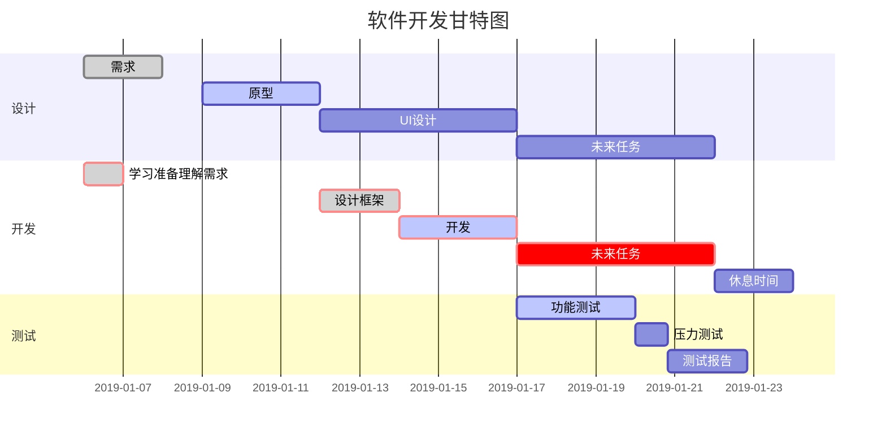
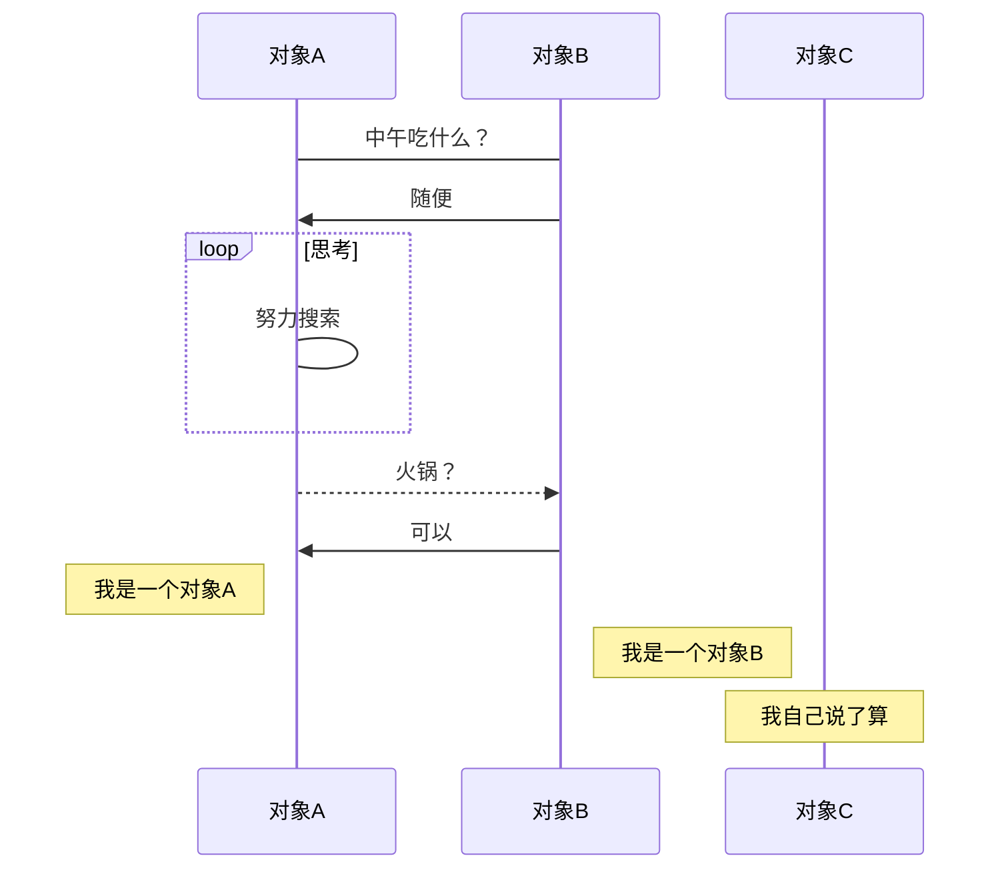
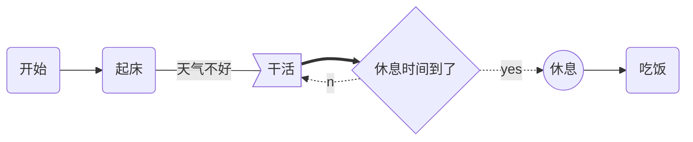
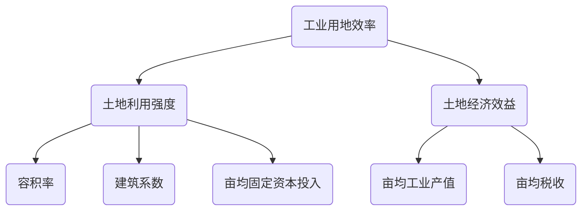
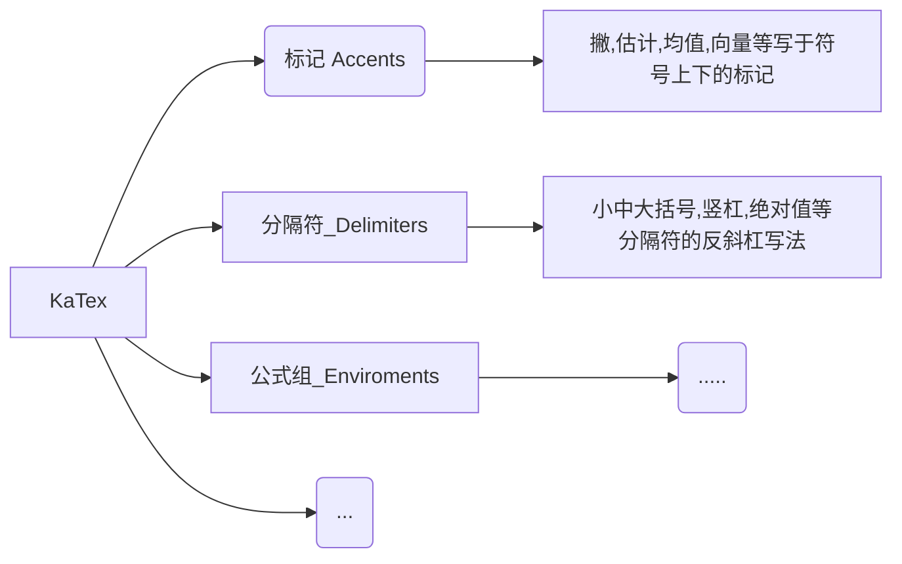
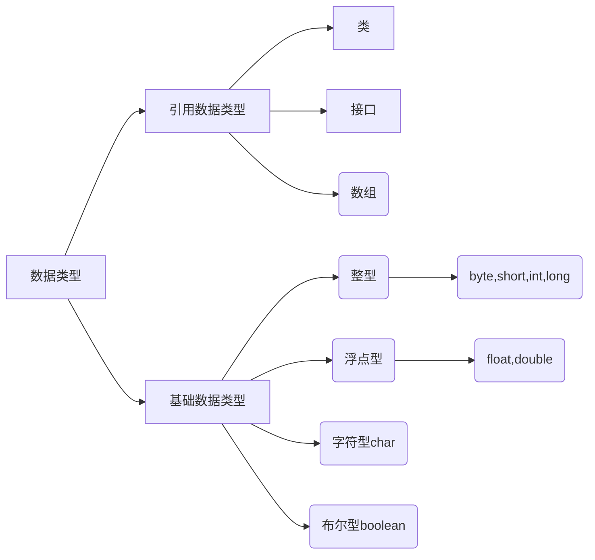

# 一级标题

## 二级标题

### 三级标题

*斜体文本*  
**粗体文本**  
***粗斜体文本***  
***
* 第一项  
  第一项具体内容
* 第二项  
  第二项具体内容
* 第三项  
  第三项具体内容

1. 第一项
2. 第二项
3. 第三项

* > 第一项  
  > 第一项具体内容
* > 第二项  
  > 第二项具体内容
* > 第三项  
  > 第三项具体内容

单行代码`console.log(typeof(Array));`
```javascript
$(document).ready(function () {
    alert('这里是一个代码块');
});
```
这是一个链接 [菜鸟教程](https://www.runoob.com)

这个链接用 1 作为网址变量 [Google][1]
这个链接用 runoob 作为网址变量 [Runoob][runoob]
然后在文档的结尾为变量赋值（网址）

~~这是一条删除线~~  

<u>下划线</u>  

创建脚注格式类似这样 [^RUNOOB]。
[^RUNOOB]: 菜鸟教程 -- 学的不仅是技术，更是梦想！！！ 

  
  
 
| 左对齐 | 右对齐 | 居中对齐 |
| :----- | -----: | :------: |
| 单元格 | 单元格 |  单元格  |
| 单元格 | 单元格 |  单元格  |

使用 <kbd>Ctrl</kbd>+<kbd>Alt</kbd>+<kbd>Del</kbd> 重启电脑

\\   反斜线  
\`   反引号  
\*   星号  
\_   下划线  
\{\}  花括号  
\[\]  方括号  
\(\)  小括号  
\#   井字号  
\+   加号  
\-   减号  
\.   英文句点  
\!   感叹号  

[1]: http://www.google.com/  
[runoob]: http://www.runoob.com/

* 轻轻的我走了， 正如我轻轻的来； 我轻轻的招手， 作别西天的云彩。
那河畔的金柳， 是夕阳中的新娘； 波光里的艳影， 在我的心头荡漾。 
软泥上的青荇， 油油的在水底招摇； 在康河的柔波里， 我甘心做一条水草！ 
* 那榆荫下的一潭， 不是清泉， 是天上虹； 揉碎在浮藻间， 沉淀着彩虹似的梦。 
寻梦？撑一支长篙， 向青草更青处漫溯； 满载一船星辉， 在星辉斑斓里放歌。 
但我不能放歌， 悄悄是别离的笙箫； 夏虫也为我沉默， 沉默是今晚的康桥！ 
悄悄的我走了， 正如我悄悄的来； 我挥一挥衣袖， 不带走一片云彩。

> 第一层
>>第二层
>>>第三层

Markdown [^1]

[^1]:ddd

```flow
st=>start: 开始
io=>inputoutput: 验证
op=>operation: 选项
cond=>condition: 是 或 否？
sub=>subroutine: 子程序
e=>end: 结束

st->io->op->cond
cond(yes)->e
cond(no)->sub->io
```













[TOC]


## 数学公式

向下取整：
$\lfloor x \rfloor$

向上取整：
$\lceil x \rceil$

$\color{red}{注意}$

$
\begin{array}{|rrrrrrrr|}
\hline
\verb+#000+ & \color{#000}{text} & \verb+#005+ & \color{#005}{text} & \verb+#00A+ & \color{#00A}{text} & \verb+#00F+ & \color{#00F}{text}  \\
\verb+#500+ & \color{#500}{text} & \verb+#505+ & \color{#505}{text} & \verb+#50A+ & \color{#50A}{text} & \verb+#50F+ & \color{#50F}{text}  \\
\verb+#A00+ & \color{#A00}{text} & \verb+#A05+ & \color{#A05}{text} & \verb+#A0A+ & \color{#A0A}{text} & \verb+#A0F+ & \color{#A0F}{text}  \\
\verb+#F00+ & \color{#F00}{text} & \verb+#F05+ & \color{#F05}{text} & \verb+#F0A+ & \color{#F0A}{text} & \verb+#F0F+ & \color{#F0F}{text}  \\
\hline
\verb+#080+ & \color{#080}{text} & \verb+#085+ & \color{#085}{text} & \verb+#08A+ & \color{#08A}{text} & \verb+#08F+ & \color{#08F}{text}  \\
\verb+#580+ & \color{#580}{text} & \verb+#585+ & \color{#585}{text} & \verb+#58A+ & \color{#58A}{text} & \verb+#58F+ & \color{#58F}{text}  \\
\verb+#A80+ & \color{#A80}{text} & \verb+#A85+ & \color{#A85}{text} & \verb+#A8A+ & \color{#A8A}{text} & \verb+#A8F+ & \color{#A8F}{text}  \\
\verb+#F80+ & \color{#F80}{text} & \verb+#F85+ & \color{#F85}{text} & \verb+#F8A+ & \color{#F8A}{text} & \verb+#F8F+ & \color{#F8F}{text}  \\
\hline
\verb+#0F0+ & \color{#0F0}{text} & \verb+#0F5+ & \color{#0F5}{text} & \verb+#0FA+ & \color{#0FA}{text} & \verb+#0FF+ & \color{#0FF}{text}  \\
\verb+#5F0+ & \color{#5F0}{text} & \verb+#5F5+ & \color{#5F5}{text} & \verb+#5FA+ & \color{#5FA}{text} & \verb+#5FF+ & \color{#5FF}{text}  \\
\verb+#AF0+ & \color{#AF0}{text} & \verb+#AF5+ & \color{#AF5}{text} & \verb+#AFA+ & \color{#AFA}{text} & \verb+#AFF+ & \color{#AFF}{text}  \\
\verb+#FF0+ & \color{#FF0}{text} & \verb+#FF5+ & \color{#FF5}{text} & \verb+#FFA+ & \color{#FFA}{text} & \verb+#FFF+ & \color{#FFF}{text}  \\
\hline
\end{array}$

$\color{red} 红色字$