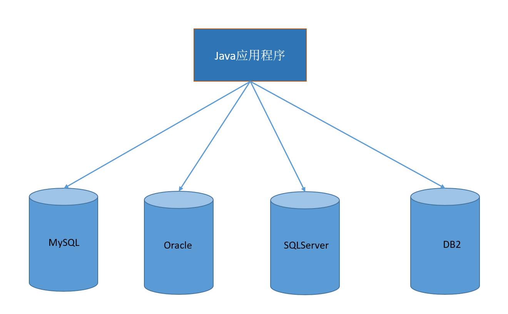
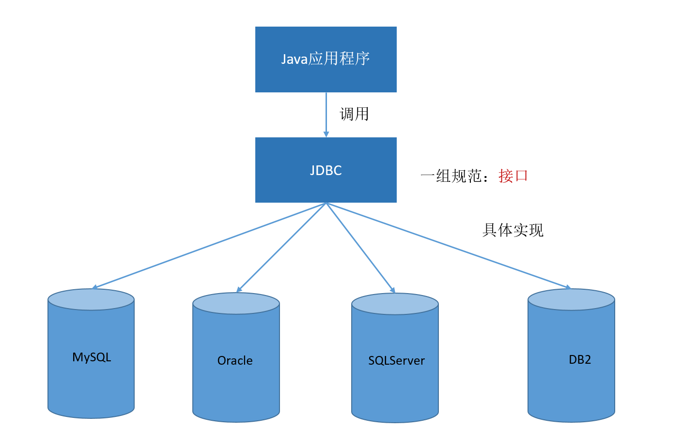

# 第一章 JDBC核心技术

[TOC]

## JDBC概述

### 数据的持久化

* 数据的持久化：把数据保存到可掉电式存储设备中以供之后使用。大多数情况，，特别是企业级应用，数据持久化意味着将内存中的数据保存到硬盘上，而持久化的实现过程大多是通过各种关系型数据库来完成
* 持久化的主要应用是将内存中的数据存储在关系型数据库中，当然也可以存储在磁盘文件、XML数据文件中

### Java中的数据存储技术

* 在Java中，数据库存取技术可分为如下几类：
  1. JDBC(Java Database Connectivity)直接访问数据库
  2. JDO(Java Data Object)技术
* JDBC是java访问数据库的基石，JDO、Hibernate、MyBatis等只是更好的封装了JDBC

### JDBC介绍

* JDBC(Java Database Connectivity)是一个**独立于特定数据库管理系统、通用的SQL数据库存取和操作的公共接口**（一组API），定义了用来访问数据库的标准Java类库，（**java.sql,javax.sql**）使用这些类库可以以一种**标准**的方法、方便地访问数据库资源。
* JDBC为访问不同的数据库提供了一种**统一的途径**，为开发者屏蔽了一些细节问题。
* JDBC的目标是使Java程序员使用JDBC可以连接任何**提供了JDBC驱动程序**的数据库系统，这样就使得程序员无需对特定的数据库系统的特点有过多的了解，从而大大简化和加快了开发过程。
* 如果没有JDBC，那么Java程序访问数据库时是这样的：



* 有了JDBC，Java程序访问数据库时是这样的：



### JDBC体系结构

* JDBC接口(API)包括两个层次：
  1. 面向应用的API:Java API,抽象接口，供应用程序开发人员使用(连接数据库，执行SQL语句，获取结果)
  2. 面向数据库的API:Java Driver API,供开发商开发数据库驱动程序用


> ODBC(**Open Database Connectivity**，开放式数据库连接)，是微软在Windows平台下推出的。使用者在程序中只需要调用ODBC API，由 ODBC 驱动程序将调用转换成为对特定的数据库的调用请求。**基本上不使用这种方式连接数据库**

## Java连接数据库

### 连接数据库的要素

#### Driver接口实现类

##### JDBC接口

* java.sql.Driver接口是所有JDBC驱动程序需要实现的接口。这个接口是提供数据库厂商使用的，不同数据库厂商提供不同的实现。
* 在程序中不需要直接去访问实现了Driver接口的类，而是由驱动程序员管理类java.sql.DriverManager去调用这些Driver实现
  Oracle的驱动：**oracle.jdbc.driver.OracleDriver**
  mySql的驱动： **com.mysql.jdbc.Driver**

  > 这里驱动的实现类由数据库厂商来提供，在编写项目时需要去导入数据库驱动实现类，因为这些类不是Java内置的类

##### 加载与注册JDBC驱动

* 加载驱动：加载JDBC驱动需要调用Class类的静态方法forName(String className),向其传递要加载的JDBC驱动的类名
  `Class.forName("com.mysql.jdbc.Driver");`
* 注册驱动：DriverManager类时驱动程序管理器类，负责管理驱动程序，通过使用DriverManager.registerDriver(Driver driver)来注册驱动，这里需要传入的参数是Driver接口的实现类对象
* 通常不用显式调用DriverManager类的registerDriver()方法来注册驱动程序类的实例，因为Driver接口的驱动程序类都包含了静态代码块，在这个静态代码块中，会调用DriverManager.registerDriver(Driver driver)方法来注册自身的一个实例，如下是com.mysql.cj.jdbc.Driver的源码(mysql在mysql-connector-java-6以后将驱动类的包名修改了)：

```java
/*
  Copyright (c) 2002, 2015, Oracle and/or its affiliates. All rights reserved.

  The MySQL Connector/J is licensed under the terms of the GPLv2
  <http://www.gnu.org/licenses/old-licenses/gpl-2.0.html>, like most MySQL Connectors.
  There are special exceptions to the terms and conditions of the GPLv2 as it is applied to
  this software, see the FOSS License Exception
  <http://www.mysql.com/about/legal/licensing/foss-exception.html>.

  This program is free software; you can redistribute it and/or modify it under the terms
  of the GNU General Public License as published by the Free Software Foundation; version 2
  of the License.

  This program is distributed in the hope that it will be useful, but WITHOUT ANY WARRANTY;
  without even the implied warranty of MERCHANTABILITY or FITNESS FOR A PARTICULAR PURPOSE.
  See the GNU General Public License for more details.

  You should have received a copy of the GNU General Public License along with this
  program; if not, write to the Free Software Foundation, Inc., 51 Franklin St, Fifth
  Floor, Boston, MA 02110-1301  USA

 */

package com.mysql.cj.jdbc;

import java.sql.SQLException;

/**
 * The Java SQL framework allows for multiple database drivers. Each driver should supply a class that implements the Driver interface
 *
 * <p>
 * The DriverManager will try to load as many drivers as it can find and then for any given connection request, it will ask each driver in turn to try to
 * connect to the target URL.
 *
 * <p>
 * It is strongly recommended that each Driver class should be small and standalone so that the Driver class can be loaded and queried without bringing in vast
 * quantities of supporting code.
 *
 * <p>
 * When a Driver class is loaded, it should create an instance of itself and register it with the DriverManager. This means that a user can load and register a
 * driver by doing Class.forName("foo.bah.Driver")
 */
public class Driver extends NonRegisteringDriver implements java.sql.Driver {
    //
    // Register ourselves with the DriverManager
    //
    static {
        try {
            java.sql.DriverManager.registerDriver(new Driver());
        } catch (SQLException E) {
            throw new RuntimeException("Can't register driver!");
        }
    }

    /**
     * Construct a new driver and register it with DriverManager
     *
     * @throws SQLException
     *             if a database error occurs.
     */
    public Driver() throws SQLException {
        // Required for Class.forName().newInstance()
    }
}
```

> 可以看到Driver类的静态代码块中确实有去做驱动注册的事情
> **DriverManager 类是 JDBC 的管理层，作用于用户和驱动程序之间**。它跟踪可用的驱动程序，并在数据库和相应驱动程序之间建立连接。另外，DriverManager 类也处理诸如驱动程序登录时间限制及登录和跟踪消息的显示等事务。对于简单的应用程序，一般需要在此类中直接使用的唯一方法是 DriverManager.getConnection

#### JDBC URL

* JDBC URL用于标识一个被注册的驱动程序，驱动程序管理器通过这个URL选择正确的驱动程序，从而建立到数据库的连接
* JDBC URL的标准由三部分组成，各部分间用冒号间隔，格式为：`jdbc:子协议:子名称`
  1. 协议：JDBC URL 中的协议总是jdbc
  2. 子协议：子协议用于标识一个数据库驱动程序
  3. 子名称：一种标识数据的方法。子名称可以依不同的子协议而变化。用子名称的目的是为了定位数据库提供足够的信息。包含主机名(对应服务器端的ip地址)，端口号，数据库名
* 几种常用的数据库的JDBC URL：
  1. MySQL的连接URL编写方式
     格式：`jdbc:myql://主机名:mysql服务端口号/数据库名称?参数1=值1&参数2=值2`
     参数解释：参数可能涉及到编码的指定，以及时区
     举例：`jdbc:mysql://localhost:3306/booksys?characterEncoding=utf8&useSSL=false&allowPublicKeyRetrieval=true&serverTimezone=Asia/Shanghai`
  2. Oracle 9的连接URL编写方式
     格式：`jdbc:oracle:thin:@主机名:oracle服务端口号:数据库名`
     举例：`jdbc:oracle:thin:@localhost:1521:booksys`
  3. SQLServer的连接URL编写方式
     格式：`jdbc:sqlserver://主机名:sqlserver服务端口号:DatabaseName=数据库名`
     举例：`jdbc:sqlserver://localhost:sqlserver1433:DatabaseName=booksys`

#### 用户名和密码

* 这里指的是当前客户端ip有权限连接到数据库的用户所提供的用户名和密码
* user和password可以通过在URL中拼接的方式传递
* 可以通过调用`DriverManager.getConnection(String url,String user,Stirng password)`方法建立数据库连接

### JDBC连接数据库

* 连接数据的写法多种多样，可以从中总结出在项目中使用最多的、最优的一种写法

* 连接写法一：

```sql
import org.junit.Test;

import java.sql.Connection;
import java.sql.Driver;
import java.sql.SQLException;
import java.util.Properties;

public class JDBCTest {

    @Test
    public void test1() {
        try {
            Driver driver = null;
            driver = new com.mysql.cj.jdbc.Driver();
            String url = "jdbc:mysql://localhost:3306/booksys?serverTimezone=Asia/Shanghai";
            Properties pros = new Properties();
            pros.setProperty("user", "root");
            pros.setProperty("password", "booksys123");
            Connection conn = driver.connect(url, pros);
            System.out.println(conn);//com.mysql.cj.jdbc.ConnectionImpl@1832929
            conn.close();
        } catch (SQLException e) {
            e.printStackTrace();
        }
    }
}
```

>说明：上述代码中显式出现了第三方数据库的API

* 连接方式二：

```java
import org.junit.Test;

import java.io.FileInputStream;
import java.sql.Connection;
import java.sql.Driver;
import java.sql.DriverManager;
import java.sql.SQLException;
import java.util.Properties;

public class JDBCTest {
    @Test
    public void test2() throws Exception {
        //提供Driver接口实现类
        String className = "com.mysql.cj.jdbc.Driver";
        Class clazz = Class.forName(className);
        Driver driver = (Driver) clazz.newInstance();

        //提供url
        String url = "jdbc:mysql://localhost:3306/booksys?serverTimezone=Asia/Shanghai";

        //提供用户名和密码
        Properties pros = new Properties();
        pros.setProperty("user", "root");
        pros.setProperty("password", "booksys123");

        //连接数据库
        Connection conn = driver.connect(url, pros);
        System.out.println(conn);//com.mysql.cj.jdbc.ConnectionImpl@1832929
        conn.close();
    }
}
```

>说明：相较于方式一，这里使用反射实例化Driver，不在代码中体现第三方数据库的API。体现了面向接口编程思想

* 连接写法三：

```java
import org.junit.Test;

import java.io.FileInputStream;
import java.sql.Connection;
import java.sql.Driver;
import java.sql.DriverManager;
import java.sql.SQLException;
import java.util.Properties;

public class JDBCTest {

    @Test
    public void test3() throws Exception {
        //数据库连接的4个要素
        String url = "jdbc:mysql://localhost:3306/booksys?serverTimezone=Asia/Shanghai";
        String user = "root";
        String password = "booksys";
        String driverName = "com.mysql.cj.jdbc.Driver";

        //提供Driver接口实现类
        Class clazz = Class.forName(driverName);
        Driver driver = (Driver) clazz.newInstance();
        //注册驱动
        DriverManager.registerDriver(driver);

        //获取连接
        Connection conn = DriverManager.getConnection(url, user, password);

        System.out.println(conn);//com.mysql.cj.jdbc.ConnectionImpl@1832929
        conn.close();
    }
}
```

>说明：使用DriverManager实现数据库的连接。体会获取连接必要的4个基本要素

* 连接写法四：

```java
import org.junit.Test;

import java.io.FileInputStream;
import java.sql.Connection;
import java.sql.Driver;
import java.sql.DriverManager;
import java.sql.SQLException;
import java.util.Properties;

public class JDBCTest {

    @Test
    public void test4() throws Exception {
        //数据库连接的4个要素
        String url = "jdbc:mysql://localhost:3306/booksys?serverTimezone=Asia/Shanghai";
        String user = "root";
        String password = "booksys";
        String driverName = "com.mysql.cj.jdbc.Driver";

        //加载驱动并注册驱动
        Class clazz = Class.forName(driverName);

        //获取连接
        Connection conn = DriverManager.getConnection(url, user, password);

        System.out.println(conn);//com.mysql.cj.jdbc.ConnectionImpl@1832929
        conn.close();
    }
}
```

> 说明：不必显式的注册驱动了。因为在DriverManager的源码中已经存在静态代码块，实现了驱动的注册

* 连接写法五：

```java
import org.junit.Test;

import java.io.FileInputStream;
import java.sql.Connection;
import java.sql.Driver;
import java.sql.DriverManager;
import java.sql.SQLException;
import java.util.Properties;

public class JDBCTest {

    @Test
    public void test5() throws Exception {
        //加载配置文件
        FileInputStream fis = new FileInputStream("jdbc.properties");
        Properties pros = new Properties();
        pros.load(fis);
        String url = pros.getProperty("db_url");
        String user = pros.getProperty("user");
        String password = pros.getProperty("password");
        String driverName = pros.getProperty("jdbc_driver");

        //提供Driver接口实现类，注册驱动
        Class clazz = Class.forName(driverName);

        //获取连接
        Connection conn = DriverManager.getConnection(url, user, password);

        System.out.println(conn);//com.mysql.cj.jdbc.ConnectionImpl@1774679
        conn.close();
    }
}
```

> 第五种写法是最精炼的，通过加载实现类只初始化了一次驱动，且通过驱动管理器来获取连接，使用了配置文件的方式，这种方式的好处是：
>
> 1. 实现了数据与代码的分离，实现了解耦
> 2. 如果需要修改配置文件信息，可以避免程序重新打包

## 使用PrepareStatement实现CRUD操作

### 操作和访问数据库

* 数据库连接被用来向数据库服务器发送命令和SQL语句，并接受数据库服务器返回的结果。**其实一个数据库连接就是一个Socket连接**

* 在 java.sql 包中有 3 个接口分别定义了对数据库的调用的不同方式：
  * Statement：用于执行静态 SQL 语句并返回它所生成结果的对象。
  * PrepatedStatement：SQL 语句被预编译并存储在此对象中，可以使用此对象多次高效地执行该语句。
  * CallableStatement：用于执行 SQL 存储过程

### 使用Statement操作数据表的弊端

* 通过调用 Connection 对象的 createStatement() 方法创建该对象。该对象用于执行静态的 SQL 语句，并且返回执行结果。

* Statement 接口中定义了下列方法用于执行 SQL 语句：

  ```java
  int executeUpdate(String sql)：执行更新操作INSERT、UPDATE、DELETE
  ResultSet executeQuery(String sql)：执行查询操作SELECT
  ```

  >从Statement提供的方法和传参可以看出，当sql中需要筛选条件时，需从前端用户输入来作为筛选条件，比如用户登录时验证用户名和密码，此时用户输入的用户名或者密码的字符串是可以通过sql来注入非法的操作或者修改了用户的查询逻辑

* 但是使用Statement操作数据表存在弊端：
  * 问题一：存在拼串操作，繁琐
  * 问题二：存在SQL注入问题
* SQL 注入是利用某些系统没有对用户输入的数据进行充分的检查，而在用户输入数据中注入非法的 SQL 语句段或命令(如：SELECT user, password FROM user_table WHERE user='a' OR 1 = ' AND password = ' OR '1' = '1') ，从而利用系统的 SQL 引擎完成恶意行为的做法。

* 对于 Java 而言，要防范 SQL 注入，只要用 PreparedStatement(从Statement扩展而来) 取代 Statement。

### PreparedStatement的使用

#### 认识PreparedStatement

* 可以通过调用 Connection 对象的 preparedStatement(String sql) 方法获取 PreparedStatement 对象

* PreparedStatement 接口是 Statement 的子接口，它表示一条预编译过的 SQL 语句

* PreparedStatement 对象所代表的 SQL 语句中的参数用问号(?)来表示，调用 PreparedStatement 对象的 setXxx() 方法来设置这些参数. setXxx() 方法有两个参数，第一个参数是要设置的 SQL 语句中的参数的索引(从 1 开始)，第二个是设置的 SQL 语句中的参数的值

#### PreparedStatement 与 Statement的比较

* 代码的可读性和可维护性。

* PreparedStatement 能最大可能提高性能：

  * DBServer会对预编译语句提供性能优化。因为预编译语句有可能被重复调用，所以语句在被DBServer的编译器编译后的执行代码被缓存下来，那么下次调用时只要是相同的预编译语句就不需要编译，只要将参数直接传入编译过的语句执行代码中就会得到执行。
  * 在statement语句中,即使是相同操作但因为数据内容不一样,所以整个语句本身不能匹配,没有缓存语句的意义.事实是没有数据库会对普通语句编译后的执行代码缓存。这样每执行一次都要对传入的语句编译一次。
  * (语法检查，语义检查，翻译成二进制命令，缓存)
  * PreparedStatement 可以防止 SQL 注入

   > 之所以PreparedStatement能防止注入，是因为它把单引号转义了，变成了`\'`，这样一来，就无法截断SQL语句，进而无法拼接SQL语句，基本上没有办法注入了。
    所以，如果不用PreparedStatement，又想防止注入，最简单粗暴的办法就是过滤单引号，过滤之后，单纯从SQL的角度，无法进行任何注入。
     这种针对的是String参数类型的注入，大多数注入，还是发生在数值类型上，而PreparedStatement提供了pst.setInt();这种数值参数赋值API，基本就避免了注入，因为如果用户输入的不是数值类型，类型转换的时候就会报错

#### Java与SQL 对应数据类型转换表

| Java类型| SQL类型|
| :----| :----|
| boolean|BIT|
| byte|TINYINT|
| short|SMALLINT|
| **int**| **INTEGER**|
| long| BIGINT|
| **String**| **CHAR**,**VARCHAR**,LONGVARCHAR|
| byte   array       | BINARY,VAR BINARY|
| **java.sql.Date**| **DATE**|
| **java.sql.Time**| **TIME**|
| **java.sql.Timestamp** | **TIMESTAMP**|

#### 使用PreparedStatement实现增删改查操作

```java
import org.junit.Test;

import java.io.FileInputStream;
import java.io.IOException;
import java.lang.reflect.Field;
import java.sql.*;
import java.util.ArrayList;
import java.util.List;
import java.util.Properties;

public class PreparedStatementTest {

    public Connection getConnection() throws Exception {
        FileInputStream fis = null;
        Connection conn = null;
        //加载配置文件
        fis = new FileInputStream("jdbc.properties");
        Properties pros = new Properties();
        pros.load(fis);
        String url = pros.getProperty("db_url");
        String user = pros.getProperty("user");
        String password = pros.getProperty("password");
        String driverName = pros.getProperty("jdbc_driver");

        //提供Driver接口实现类
        Class clazz = Class.forName(driverName);
        Driver driver = (Driver) clazz.newInstance();
        //注册驱动
        DriverManager.registerDriver(driver);

        //获取连接
        conn = DriverManager.getConnection(url, user, password);

        if (fis != null) {
            fis.close();
        }
        return conn;
    }

    public void update(String sql, Object... args) {
        Connection conn = null;
        PreparedStatement pst = null;
        try {
            conn = getConnection();
            pst = conn.prepareStatement(sql);
            for (int i = 0; i < args.length; i++) {
                pst.setObject(i + 1, args[i]);
            }
            pst.executeUpdate();
        } catch (Exception e) {
            e.printStackTrace();
        } finally {
            if (conn != null) {
                try {
                    conn.close();
                } catch (SQLException ex) {
                    ex.printStackTrace();
                }
            }
            if (pst != null) {
                try {
                    pst.close();
                } catch (SQLException ex) {
                    ex.printStackTrace();
                }
            }
        }
    }

    //将数据库表查询出来的每条记录通过反射映射到javabean对象中，然后将多个对象放在List集合中返回
    public <T> List<T> query(Class<T> clazz, String sql, Object... args) {
        Connection conn = null;
        PreparedStatement pst = null;
        ResultSet rs = null;
        List<T> list = new ArrayList();
        try {
            conn = getConnection();
            pst = conn.prepareStatement(sql);
            for (int i = 0; i < args.length; i++) {
                pst.setObject(i + 1, args[i]);
            }
            rs = pst.executeQuery();
            ResultSetMetaData rsmd = rs.getMetaData();
            int columnCount = rsmd.getColumnCount();
            while (rs.next()) {
                T t = clazz.newInstance();
                for (int i = 0; i < columnCount; i++) {
                    Object columnVal = rs.getObject(i + 1);
                    String columnLabel = rsmd.getColumnLabel(i + 1);

                    Field field = clazz.getDeclaredField(columnLabel);
                    field.setAccessible(true);
                    field.set(t, columnVal);
                }
                list.add(t);
            }
            return list;
        } catch (Exception e) {
            e.printStackTrace();
        } finally {
            try {
                if (rs != null) {
                    rs.close();
                }
            } catch (SQLException e) {
                e.printStackTrace();
            }
            if (conn != null) {
                try {
                    conn.close();
                } catch (SQLException ex) {
                    ex.printStackTrace();
                }
            }
            if (pst != null) {
                try {
                    pst.close();
                } catch (SQLException ex) {
                    ex.printStackTrace();
                }
            }
        }
        return null;
    }

    @Test
    public void updateTest() {
        update("insert into user(uid,age,firstName,lastName) values(?,?,?,?)", 1524, 11, "tom", "tom");
    }

    @Test
    public void queryTest() {
        System.out.println(query(User.class, "select * from user"));
    }
}

class User {
    public Integer uid;
    public Integer age;
    public String firstName;
    public String lastName;
    public String nation;
    public Integer grade;

    public User() {
    }

    public Integer getUid() {
        return uid;
    }

    public void setUid(Integer uid) {
        this.uid = uid;
    }

    public Integer getAge() {
        return age;
    }

    public void setAge(Integer age) {
        this.age = age;
    }

    public String getFirstName() {
        return firstName;
    }

    public void setFirstName(String firstName) {
        this.firstName = firstName;
    }

    public String getLastName() {
        return lastName;
    }

    public void setLastName(String lastName) {
        this.lastName = lastName;
    }

    public String getNation() {
        return nation;
    }

    public void setNation(String nation) {
        this.nation = nation;
    }

    public Integer getGrade() {
        return grade;
    }

    public void setGrade(Integer grade) {
        this.grade = grade;
    }

    @Override
    public String toString() {
        return "User{" +
                "uid=" + uid +
                ", age=" + age +
                ", firstName='" + firstName + '\'' +
                ", lastName='" + lastName + '\'' +
                ", nation='" + nation + '\'' +
                ", grade=" + grade +
                '}';
    }
}
```

### 认识ResultSet和ResultSetMetaData

#### ResultSet

* 查询需要调用PreparedStatement 的 executeQuery() 方法，查询结果是一个ResultSet 对象
* ResultSet 对象以逻辑表格的形式封装了执行数据库操作的结果集，ResultSet 接口由数据库厂商提供实现
* ResultSet 返回的实际上就是一张数据表。有一个指针指向数据表的第一条记录的前面。
* ResultSet 对象维护了一个指向当前数据行的游标，初始的时候，游标在第一行之前，可以通过 ResultSet 对象的 next() 方法移动到下一行。调用 next()方法检测下一行是否有效。若有效，该方法返回 true，且指针下移。相当于Iterator对象的 hasNext() 和 next() 方法的结合体。
* 当指针指向一行时, 可以通过调用 getXxx(int index) 或 getXxx(int columnName) 获取每一列的值。
  * 例如: getInt(1), getString("name")
  * 注意：Java与数据库交互涉及到的相关Java API中的索引都从1开始。
* ResultSet 接口的常用方法：
  * `boolean next()`
  * `getString()`
  * `getObject()`
  >通过查看java中的ResultSet接口源码可以查看具体的方法

#### ResultSetMetaData

* 可用于获取关于 ResultSet 对象中列的类型和属性信息的对象
* 获取方式：`ResultSetMetaData meta = rs.getMetaData();`
* ResultSetMetaData的常用方法：
  * getColumnName(int column)：获取指定**列的名称**
  * getColumnLabel(int column)：获取指定**列的别名**,一般使用这个方法获取列名
  * getColumnCount()：返回当前 ResultSet 对象中的列数
  * getColumnTypeName(int column)：检索指定列的数据库特定的类型名称
  * getColumnDisplaySize(int column)：指示指定列的最大标准宽度，以字符为单位
  * isNullable(int column)：指示指定列中的值是否可以为 null
  * isAutoIncrement(int column)：指示是否自动为指定列进行编号，这样这些列仍然是只读的

### 资源的释放

* 释放ResultSet, Statement,Connection。
* 数据库连接（Connection）是非常稀有的资源，用完后必须马上释放，如果Connection不能及时正确的关闭将导致系统宕机。Connection的使用原则是尽量晚创建，尽量早的释放。
* 可以在finally中关闭，保证及时其他代码出现异常，资源也一定能被关闭

### JDBC API小结

* 两种思想
  * 面向接口编程的思想
  * ORM思想(object relational mapping)
    * 一个数据表对应一个java类
    * 表中的一条记录对应java类的一个对象
    * 表中的一个字段对应java类的一个属性

  >sql是需要结合列名和表的属性名来写。注意起别名。

* 两种技术
  * JDBC结果集的元数据：ResultSetMetaData
    * 获取列数：getColumnCount()
    * 获取列的别名：getColumnLabel()
  * 通过反射，创建指定类的对象，获取指定的属性并赋值

### 操作BLOB类型字段

#### BLOB类型

* MySQL中，BLOB是一个二进制大型对象，是一个可以存储大量数据的容器，它能容纳不同大小的数据
* 插入BLOB类型的数据必须使用PreparedStatement，因为BLOB类型的数据无法使用字符串拼接写的
* MySQL的四种BLOB类型(除了在存储的最大信息量上不同外，他们是等同的)

  |类型|大小(单位：字节)|
  |:----|:----|
  |TinyBlob|最大255|
  |Blob|最大65K|
  |MediumBlob|最大16M|
  |LongBlob|4G|

* 注意点：
  * 实际使用中根据需要存入的数据大小定义不同的BLOB类型。
  * 如果存储的文件过大，数据库的性能会下降。
  * 如果在指定了相关的Blob类型以后，还报错：xxx too large，那么在mysql的安装目录下，找my.ini文件加上如下的配置参数： max_allowed_packet=16M。同时注意：修改了my.ini文件之后，需要重新启动mysql服务

* 插入或者更新表记录中的Blob大数据类型
  使用`PreparedStatement`类的`void setBlob(int parameterIndex, InputStream inputStream)`方法，这里需要传入一个输入流对象

* 从数据表中读取大数据类型
  使用ResultSet类的`Blob getBlob(int columnIndex) throws SQLException`方法，这里就获取了Blob类型的对象，还需要通过Blob类的`InputStream getBinaryStream(long pos, long length) throws SQLException`来返回InpuStrem类型的输入流对象

### 批量插入

#### 批量执行SQL语句

* 当需要成批插入或者更新记录时，可以采用Java的批量更新机制，这一机制允许多条语句一次性提交给数据库批量处理。通常情况下比单独提交处理更有效率
* JDBC的批量处理语句包括下面三个方法：
  * addBatch(String)：添加需要批量处理的SQL语句或是参数；
  * executeBatch()：执行批量处理语句；
  * clearBatch():清空缓存的数据
* 通常我们会遇到两种批量执行SQL语句的情况：
  * 多条SQL语句的批量处理
  * 一个SQL语句的批量传参

> mysql服务器默认是关闭批处理的，我们需要通过一个参数，让mysql开启批处理的支持。rewriteBatchedStatements=true 写在配置文件的url后面

```java
import org.junit.Test;

import java.io.FileInputStream;
import java.io.IOException;
import java.lang.reflect.Field;
import java.sql.*;
import java.util.ArrayList;
import java.util.List;
import java.util.Properties;

public class PreparedStatementTest {

    public Connection getConnection() throws Exception {//直接上抛异常到调用的地方处理
        FileInputStream fis = null;
        Connection conn = null;
        //加载配置文件
        fis = new FileInputStream("jdbc.properties");
        Properties pros = new Properties();
        pros.load(fis);
        String url = pros.getProperty("db_url");
        String user = pros.getProperty("user");
        String password = pros.getProperty("password");
        String driverName = pros.getProperty("jdbc_driver");

        //提供Driver接口实现类
        Class clazz = Class.forName(driverName);
        Driver driver = (Driver) clazz.newInstance();
        //注册驱动
        DriverManager.registerDriver(driver);

        //获取连接
        conn = DriverManager.getConnection(url, user, password);

        if (fis != null) {
            fis.close();
        }
        return conn;
    }

    @Test
    public void batchInsert(){
        Connection conn=null;
        PreparedStatement pst=null;
        try{
            conn=getConnection();
            conn.setAutoCommit(false);
            String sql="insert into user(uid,age,lastName,firstName) values(?,?,?,?)";
            pst=conn.prepareStatement(sql);
            for(int i=0;i<=1000;i++){
                pst.setString(1,i+"");
                pst.setInt(2,i);
                pst.setString(3,"tom"+i);
                pst.setString(4,"tom"+i);
                pst.addBatch();
                if(i%500==0){
                    pst.executeBatch();
                    pst.clearBatch();
                }
            }
            conn.commit();
        }catch(Exception e){
            e.printStackTrace();
        }finally {
            try {
                if(pst!=null)
                    pst.close();
            } catch (SQLException ex) {
                ex.printStackTrace();
            }
            try {
                if(conn!=null)
                    conn.close();
            } catch (SQLException ex) {
                ex.printStackTrace();
            }
        }

    }
}
```

## JDBC事务处理

* 数据一旦提交，就不可回滚。

* 数据什么时候意味着提交？
  * 当一个连接对象被创建时，默认情况下是自动提交事务：每次执行一个 SQL 语句时，如果执行成功，就会向数据库自动提交，而不能回滚。
  * **关闭数据库连接，数据就会自动的提交**，如果多个操作，每个操作使用的是自己单独的连接，则无法保证事务。即同一个事务的多个操作必须在同一个连接下。
* JDBC程序中为了让多个 SQL 语句作为一个事务执行：
  * 调用 Connection 对象的 setAutoCommit(false); 以取消自动提交事务
  * 在所有的 SQL 语句都成功执行后，调用 commit(); 方法提交事务
  * 在出现异常时，调用 rollback(); 方法回滚事务

>若此时 Connection 没有被关闭，还可能被重复使用，则需要恢复其自动提交状态 setAutoCommit(true)。尤其是在使用数据库连接池技术时，执行close()方法前，建议恢复自动提交状态。

```java
Connection conn=null;
try{
    conn=getConnection();
    //设置手动提交事务
    conn.setAutoCommit(false);

    //数据操作代码


    //没有异常则提交事务
    conn.commit();
}catch(Exception e){
    //异常则回滚
    conn.rollback();
}finally{
    //关闭资源
    try{
        if(conn!=null)
            conn.close();
    }catch(Exception ex){
        ex.printStackTrace();
    }
}
```

## 数据库连接池

### JDBC数据库连接池的必要性

* 在使用开发基于数据库的web程序时，传统的模式基本是按以下步骤：　　
  * **在主程序（如servlet、beans）中建立数据库连接**
  * **进行sql操作**
  * **断开数据库连接**

* 这种模式开发，存在的问题:
  * 普通的JDBC数据库连接使用 DriverManager 来获取，每次向数据库建立连接的时候都要将 Connection 加载到内存中，再验证用户名和密码(得花费0.05s～1s的时间)。需要数据库连接的时候，就向数据库要求一个，执行完成后再断开连接。这样的方式将会消耗大量的资源和时间。**数据库的连接资源并没有得到很好的重复利用。**若同时有几百人甚至几千人在线，频繁的进行数据库连接操作将占用很多的系统资源，严重的甚至会造成服务器的崩溃。
  * **对于每一次数据库连接，使用完后都得断开。**否则，如果程序出现异常而未能关闭，将会导致数据库系统中的内存泄漏，最终将导致重启数据库。
  * **这种开发不能控制被创建的连接对象数**，系统资源会被毫无顾及的分配出去，如连接过多，也可能导致内存泄漏，服务器崩溃。

### 数据库连接池技术

* 为解决传统开发中的数据库连接问题，可以采用数据库连接池技术。
* **数据库连接池的基本思想**：就是为数据库连接建立一个“缓冲池”。预先在缓冲池中放入一定数量的连接，当需要建立数据库连接时，只需从“缓冲池”中取出一个，使用完毕之后再放回去。

* **数据库连接池**负责分配、管理和释放数据库连接，它**允许应用程序重复使用一个现有的数据库连接，而不是重新建立一个**。
* 数据库连接池在初始化时将创建一定数量的数据库连接放到连接池中，这些数据库连接的数量是由**最小数据库连接数来设定**的。无论这些数据库连接是否被使用，连接池都将一直保证至少拥有这么多的连接数量。连接池的**最大数据库连接数量**限定了这个连接池能占有的最大连接数，当应用程序向连接池请求的连接数超过最大连接数量时，这些请求将被加入到等待队列中。

* **数据库连接池技术的优点**

  **1. 资源重用**

  由于数据库连接得以重用，避免了频繁创建，释放连接引起的大量性能开销。在减少系统消耗的基础上，另一方面也增加了系统运行环境的平稳性。

  **2. 更快的系统反应速度**

  数据库连接池在初始化过程中，往往已经创建了若干数据库连接置于连接池中备用。此时连接的初始化工作均已完成。对于业务请求处理而言，直接利用现有可用连接，避免了数据库连接初始化和释放过程的时间开销，从而减少了系统的响应时间

  **3. 新的资源分配手段**

  对于多应用共享同一数据库的系统而言，可在应用层通过数据库连接池的配置，实现某一应用最大可用数据库连接数的限制，避免某一应用独占所有的数据库资源

  **4. 统一的连接管理，避免数据库连接泄漏**

  在较为完善的数据库连接池实现中，可根据预先的占用超时设定，强制回收被占用连接，从而避免了常规数据库连接操作中可能出现的资源泄露

### 多种开源的数据库连接池

* JDBC 的数据库连接池使用 javax.sql.DataSource 来表示，DataSource 只是一个接口，该接口通常由服务器(Weblogic, WebSphere, Tomcat)提供实现，也有一些开源组织提供实现：
  * **DBCP** 是Apache提供的数据库连接池。tomcat 服务器自带dbcp数据库连接池。**速度相对c3p0较快**，但因自身存在BUG，Hibernate3已不再提供支持。
  * **C3P0** 是一个开源组织提供的一个数据库连接池，**速度相对较慢，稳定性还行**，hibernate官方推荐使用
  * **Proxool** 是sourceforge下的一个开源项目数据库连接池，有监控连接池状态的功能，**稳定性较c3p0差一点**
  * **BoneCP** 是一个开源组织提供的数据库连接池，速度快
  * **Druid** 是阿里提供的数据库连接池，据说是集DBCP 、C3P0 、Proxool 优点于一身的数据库连接池，但是速度不确定是否有BoneCP快
* DataSource 通常被称为数据源，它包含连接池和连接池管理两个部分，习惯上也经常把 DataSource 称为连接池
* **DataSource用来取代DriverManager来获取Connection，获取速度快，同时可以大幅度提高数据库访问速度。**
* 特别注意：
  * 数据源和数据库连接不同，数据源无需创建多个，它是产生数据库连接的工厂，因此**整个应用只需要一个数据源即可。**
  * 当数据库访问结束后，程序还是像以前一样关闭数据库连接：`conn.close();` 但`conn.close()`**并没有关闭数据库的物理连接，它仅仅把数据库连接释放，归还给了数据库连接池**。

#### C3P0数据库连接池

```java
import com.mchange.v2.c3p0.ComboPooledDataSource;

import javax.sql.DataSource;
import java.sql.Connection;
import java.sql.SQLException;

public class MyConnection {

    //C3P0数据库连接池：直接在连接池对象中设置数据库信息，不推荐此方式
    public static Connection _getConnectionByC3P0() throws Exception{
        ComboPooledDataSource _cpds=new ComboPooledDataSource();
        _cpds.setDriverClass("com.mysql.cj.jdbc.Driver");
        _cpds.setJdbcUrl("jdbc:mysql://localhost:3306/booksys?characterEncoding=utf8&useSSL=false&allowPublicKeyRetrieval=true&serverTimezone=Asia/Shanghai");
        _cpds.setUser("root");
        _cpds.setPassword("booksys123");
        return _cpds.getConnection();
    }

    //C3PO数据库连接池:通过c3p0-config.xml配置文件，推荐此方式
    private static DataSource cpds=new ComboPooledDataSource("test_conn");
    public static Connection getConnectionByC3P0() throws SQLException {
        Connection conn=cpds.getConnection();
        return conn;
    }
}
```

其中配置文件`c3p0-config.xml`如下：

```xml
<?xml version="1.0" encoding="UTF-8"?>
<c3p0-config>
    <named-config name="test_conn">
        <!-- 获取连接的4个基本信息 -->
        <property name="user">root</property>
        <property name="password">booksys123</property>
        <property name="jdbcUrl">jdbc:mysql://localhost:3306/booksys?characterEncoding=utf8&amp;useSSL=false&amp;allowPublicKeyRetrieval=true&amp;serverTimezone=Asia/Shanghai</property>
        <property name="driverClass">com.mysql.cj.jdbc.Driver</property>

        <!-- 涉及到数据库连接池的管理的相关属性的设置 -->
        <!-- 若数据库中连接数不足时, 一次向数据库服务器申请多少个连接 -->
        <property name="acquireIncrement">5</property>
        <!-- 初始化数据库连接池时连接的数量 -->
        <property name="initialPoolSize">5</property>
        <!-- 数据库连接池中的最小的数据库连接数 -->
        <property name="minPoolSize">5</property>
        <!-- 数据库连接池中的最大的数据库连接数 -->
        <property name="maxPoolSize">10</property>
        <!-- C3P0 数据库连接池可以维护的 Statement 的个数 -->
        <property name="maxStatements">20</property>
        <!-- 每个连接同时可以使用的 Statement 对象的个数 -->
        <property name="maxStatementsPerConnection">5</property>

    </named-config>
</c3p0-config>
```

> 这里需要注意的是配置jdbcUrl属性的时候，带上参数时，连接符`&`需要转义，使用字符串`&amp;`来表示

#### DBCP数据库连接池

* DBCP 是 Apache 软件基金组织下的开源连接池实现，该连接池依赖该组织下的另一个开源系统：Common-pool。如需使用该连接池实现，应在系统中增加如下两个 jar 文件：
  * Commons-dbcp.jar：连接池的实现
  * Commons-pool.jar：连接池实现的依赖库
* **Tomcat 的连接池正是采用该连接池来实现的**，该数据库连接池既可以与应用服务器整合使用，也可由应用程序独立使用。
* 数据源和数据库连接不同，数据源无需创建多个，它是产生数据库连接的工厂，因此整个应用只需要一个数据源即可。
* 当数据库访问结束后，程序还是像以前一样关闭数据库连接：conn.close(); 但上面的代码并没有关闭数据库的物理连接，它仅仅把数据库连接释放，归还给了数据库连接池。
* 配置属性说明

|属性|默认值|说明|
|:----|:----|:----|
|initialSize                | 0      | 连接池启动时创建的初始化连接数量|
|maxActive                  | 8      | 连接池中可同时连接的最大的连接数|
|maxIdle                    | 8      | 连接池中最大的空闲的连接数，超过的空闲连接将被释放，如果设置为负数表示不限制|
|minIdle                    | 0      | 连接池中最小的空闲的连接数，低于这个数量会被创建新的连接。该参数越接近maxIdle，性能越好，因为连接的创建和销毁，都是需要消耗资源的；但是不能太大|
|maxWait                    | 无限制 | 最大等待时间，当没有可用连接时，连接池等待连接释放的最大时间，超过该时间限制会抛出异常，如果设置-1表示无限等待 |
|poolPreparedStatements     | false  | 开启池的Statement是否prepared |
|maxOpenPreparedStatements  | 无限制 | 开启池的prepared 后的同时最大连接数|
|minEvictableIdleTimeMillis |        | 连接池中连接，在时间段内一直空闲，被逐出连接池的时间|
|removeAbandonedTimeout     | 300    | 超过时间限制，回收没有用(废弃)的连接|
|removeAbandoned            | false  | 超过removeAbandonedTimeout时间后，是否进 行没用连接（废弃）的回收|

* 连接示例：

```java
import org.apache.commons.dbcp2.BasicDataSource;
import org.apache.commons.dbcp2.BasicDataSourceFactory;

import javax.sql.DataSource;
import java.io.InputStream;
import java.sql.Connection;
import java.sql.SQLException;
import java.util.Properties;

public class MyConnection {

    //DBCP数据库连接池：直接在连接池对象中设置数据库信息，不推荐此方式
    public static Connection _getConnectionByDBCP() throws Exception{
        BasicDataSource source=new BasicDataSource();
        source.setDriverClassName("com.mysql.cj.jdbc.Driver");
        source.setUrl("jdbc:mysql://localhost:3306/booksys?characterEncoding=utf8&useSSL=false&allowPublicKeyRetrieval=true&serverTimezone=Asia/Shanghai");
        source.setUsername("root");
        source.setPassword("booksys123");
        source.setInitialSize(10);
        return source.getConnection();
    }

    //DBCP数据库连接池：通过dbcp.properties配置文件,推荐此方式
    private static DataSource source=null;
    static{
        try{
            Properties pros=new Properties();
            InputStream is=MyConnection.class.getClassLoader().getResourceAsStream("dbcp.properties");
            pros.load(is);
            source= BasicDataSourceFactory.createDataSource(pros);
        }catch(Exception e){
            e.printStackTrace();
        }
    }
    public static Connection getConnectionByDBCP() throws SQLException{
        Connection conn=source.getConnection();
        return conn;
    }
}
```

其中配置文件`dbcp.properties`内容如下：

```properties
driverClassName=com.mysql.cj.jdbc.Driver
url=jdbc:mysql://localhost:3306/booksys?characterEncoding=utf8&useSSL=false&allowPublicKeyRetrieval=true&serverTimezone=Asia/Shanghai
username=root
password=booksys123
initialSize=10
```

#### Druid数据库连接池

* Druid是阿里巴巴开源平台上一个数据库连接池实现，它结合了C3P0、DBCP、Proxool等DB池的优点，同时加入了日志监控，可以很好的监控DB池连接和SQL的执行情况，可以认为是针对监控而生的DB连接池，目前最好的连接池之一。

* 连接示例：

```java
import com.alibaba.druid.pool.DruidDataSourceFactory;

import javax.sql.DataSource;
import java.sql.Connection;
import java.sql.SQLException;
import java.util.Properties;

public class MyConnection {

    //Druid数据库连接池
    private static DataSource druidDataSource=null;
    static{
        try {
            Properties pros = new Properties();
            pros.load(MyConnection.class.getClassLoader().getResourceAsStream("druid.properties"));
            druidDataSource= DruidDataSourceFactory.createDataSource(pros);
        }catch(Exception e){
            e.printStackTrace();
        }
    }
    public static Connection getConnectionByDruid() throws SQLException {
        Connection conn=druidDataSource.getConnection();
        return conn;
    }
}
```

其中配置文件`druid.properties`内容如下：

```properties
url=jdbc:mysql://localhost:3306/booksys?characterEncoding=utf8&useSSL=false&allowPublicKeyRetrieval=true&serverTimezone=Asia/Shanghai
username=root
password=booksys123
driverClassName=com.mysql.cj.jdbc.Driver

initialSize=10
maxActive=20
maxWait=1000
filters=wall
```

* 详细配置参数如下表：

- 详细配置参数：

| **配置**                      | **缺省** | **说明**                                                     |
| :---- | :---- | :---- |
| name                          |          | 配置这个属性的意义在于，如果存在多个数据源，监控的时候可以通过名字来区分开来。   如果没有配置，将会生成一个名字，格式是：”DataSource-” +   System.identityHashCode(this) |
| url                           |          | 连接数据库的url，不同数据库不一样。例如：mysql :   jdbc:mysql://10.20.153.104:3306/druid2      oracle :   jdbc:oracle:thin:@10.20.149.85:1521:ocnauto |
| username                      |          | 连接数据库的用户名                                           |
| password                      |          | 连接数据库的密码。如果你不希望密码直接写在配置文件中，可以使用ConfigFilter。详细看这里：<https://github.com/alibaba/druid/wiki/%E4%BD%BF%E7%94%A8ConfigFilter> |
| driverClassName               |          | 根据url自动识别   这一项可配可不配，如果不配置druid会根据url自动识别dbType，然后选择相应的driverClassName(建议配置下) |
| initialSize                   | 0        | 初始化时建立物理连接的个数。初始化发生在显示调用init方法，或者第一次getConnection时 |
| maxActive                     | 8        | 最大连接池数量                                               |
| maxIdle                       | 8        | 已经不再使用，配置了也没效果                                 |
| minIdle                       |          | 最小连接池数量                                               |
| maxWait                       |          | 获取连接时最大等待时间，单位毫秒。配置了maxWait之后，缺省启用公平锁，并发效率会有所下降，如果需要可以通过配置useUnfairLock属性为true使用非公平锁。 |
| poolPreparedStatements        | false    | 是否缓存preparedStatement，也就是PSCache。PSCache对支持游标的数据库性能提升巨大，比如说oracle。在mysql下建议关闭。 |
| maxOpenPreparedStatements     | -1       | 要启用PSCache，必须配置大于0，当大于0时，poolPreparedStatements自动触发修改为true。在Druid中，不会存在Oracle下PSCache占用内存过多的问题，可以把这个数值配置大一些，比如说100 |
| validationQuery               |          | 用来检测连接是否有效的sql，要求是一个查询语句。如果validationQuery为null，testOnBorrow、testOnReturn、testWhileIdle都不会其作用。 |
| testOnBorrow                  | true     | 申请连接时执行validationQuery检测连接是否有效，做了这个配置会降低性能。 |
| testOnReturn                  | false    | 归还连接时执行validationQuery检测连接是否有效，做了这个配置会降低性能 |
| testWhileIdle                 | false    | 建议配置为true，不影响性能，并且保证安全性。申请连接的时候检测，如果空闲时间大于timeBetweenEvictionRunsMillis，执行validationQuery检测连接是否有效。 |
| timeBetweenEvictionRunsMillis |          | 有两个含义： 1)Destroy线程会检测连接的间隔时间2)testWhileIdle的判断依据，详细看testWhileIdle属性的说明 |
| numTestsPerEvictionRun        |          | 不再使用，一个DruidDataSource只支持一个EvictionRun           |
| minEvictableIdleTimeMillis    |          |                                                              |
| connectionInitSqls            |          | 物理连接初始化的时候执行的sql                                |
| exceptionSorter               |          | 根据dbType自动识别   当数据库抛出一些不可恢复的异常时，抛弃连接 |
| filters                       |          | 属性类型是字符串，通过别名的方式配置扩展插件，常用的插件有：   监控统计用的filter:stat日志用的filter:log4j防御sql注入的filter:wall |
| proxyFilters                  |          | 类型是List，如果同时配置了filters和proxyFilters，是组合关系，并非替换关系 |

### 测试数据库连接

```java
package com.suftz.db.junit;

import com.suftz.db.MyConnection;
import org.junit.Test;

import java.sql.Connection;
import java.sql.SQLException;

public class MyConnectionTest {

    @Test
    public void _getConnectionByC3P0Test() {
        Connection conn=null;
        try {
            conn=MyConnection._getConnectionByC3P0();
            System.out.println(conn);
            //com.mchange.v2.c3p0.impl.NewProxyConnection@6e276e [wrapping: com.mysql.cj.jdbc.ConnectionImpl@1a5f194]
        } catch (Exception e) {
            e.printStackTrace();
        }finally{
            try {
                if(conn!=null){
                    conn.close();
                }
            } catch (SQLException e) {
                e.printStackTrace();
            }
        }
    }

    @Test
    public void getConnectionByC3P0Test() {
        Connection conn=null;
        try {
            conn=MyConnection.getConnectionByC3P0();
            System.out.println(conn);
            //com.mchange.v2.c3p0.impl.NewProxyConnection@6e276e [wrapping: com.mysql.cj.jdbc.ConnectionImpl@1a5f194]
            conn.close();
        } catch (SQLException e) {
            e.printStackTrace();
        }finally{
            try {
                if(conn!=null){
                    conn.close();
                }
            } catch (SQLException e) {
                e.printStackTrace();
            }
        }
    }

    @Test
    public void _getConnectionByDBCP(){
        Connection conn=null;
        try{
            conn=MyConnection._getConnectionByDBCP();
            System.out.println(conn);
            //26205593, URL=jdbc:mysql://localhost:3306/booksys?characterEncoding=utf8&useSSL=false&allowPublicKeyRetrieval=true&serverTimezone=Asia/Shanghai, MySQL Connector Java
        }catch(Exception e){
            e.printStackTrace();
        }finally {
            try {
                if(conn!=null){
                    conn.close();
                }
            } catch (SQLException e) {
                e.printStackTrace();
            }
        }
    }

    @Test
    public void getConnectionByDBCPTest(){
        Connection conn=null;
        try{
            conn=MyConnection.getConnectionByDBCP();
            System.out.println(conn);
            //26205593, URL=jdbc:mysql://localhost:3306/booksys?characterEncoding=utf8&useSSL=false&allowPublicKeyRetrieval=true&serverTimezone=Asia/Shanghai, MySQL Connector Java
        }catch(SQLException e){
            e.printStackTrace();
        }finally {
            try {
                if(conn!=null){
                    conn.close();
                }
            } catch (SQLException e) {
                e.printStackTrace();
            }
        }
    }

    @Test
    public void getConnectionByDruid(){
        Connection conn=null;
        try{
            conn=MyConnection.getConnectionByDruid();
            System.out.println(conn);
            //com.alibaba.druid.proxy.jdbc.ConnectionProxyImpl@15e586c
        }catch(SQLException e){
            e.printStackTrace();
        }finally{
            try {
                if(conn!=null){
                    conn.close();
                }
            } catch (SQLException e) {
                e.printStackTrace();
            }
        }
    }
}
```

> 数据库连接池使用后，一定要关闭。在不关闭已申请使用的资源前提下，再去请求获取连接池资源时，当超出连接数后，则会报错抛异常
> 可以测试，循环取出100个(大于设置的连接数即可)数据库连接：1.反复取出，但是每次都关闭连接(等同于放回)；2.每次取出，且不关闭连接(等同于一直持有连接)。这两种方式产生效果不同，后者会抛异常

## Apache-DBUtils实现CRUD操作

### Apache-DBUtils简介

* commons-dbutils 是 Apache 组织提供的一个开源 JDBC工具类库，它是对JDBC的简单封装，学习成本极低，并且使用dbutils能极大简化jdbc编码的工作量，同时也不会影响程序的性能。

* API介绍：
  * org.apache.commons.dbutils.QueryRunner
  * org.apache.commons.dbutils.ResultSetHandler
  * 工具类：org.apache.commons.dbutils.DbUtils

### 主要API的使用

#### DbUtils

* DbUtils ：提供如关闭连接、装载JDBC驱动程序等常规工作的工具类，里面的所有方法都是静态的。主要方法如下：
  * **public static void close(…) throws java.sql.SQLException**：　DbUtils类提供了三个重载的关闭方法。这些方法检查所提供的参数是不是NULL，如果不是的话，它们就关闭Connection、Statement和ResultSet。
  * `public static void closeQuietly(…)`: 这一类方法不仅能在Connection、Statement和ResultSet为NULL情况下避免关闭，还能隐藏一些在程序中抛出的SQLEeception。
  * `public static void commitAndClose(Connection conn)throws SQLException`： 用来提交连接的事务，然后关闭连接
  * `public static void commitAndCloseQuietly(Connection conn)`： 用来提交连接，然后关闭连接，并且在关闭连接时不抛出SQL异常。
  * `public static void rollback(Connection conn)throws SQLException`：允许conn为null，因为方法内部做了判断
  * `public static void rollbackAndClose(Connection conn)throws SQLException`
  * `rollbackAndCloseQuietly(Connection)`
  * `public static boolean loadDriver(java.lang.String driverClassName)`：这一方装载并注册JDBC驱动程序，如果成功就返回true。使用该方法，你不需要捕捉这个异常`ClassNotFoundException`。

#### QueryRunner类

* **该类简单化了SQL查询，它与ResultSetHandler组合在一起使用可以完成大部分的数据库操作，能够大大减少编码量。**

* QueryRunner类提供了两个构造器：
  * 默认的构造器
  * 需要一个 javax.sql.DataSource 来作参数的构造器

* QueryRunner类的主要方法：
  * **更新**
    * public int update(Connection conn, String sql, Object... params) throws SQLException:用来执行一个更新（插入、更新或删除）操作。
  * **插入**
    * public <T> T insert(Connection conn,String sql,ResultSetHandler<T> rsh, Object... params) throws SQLException：只支持INSERT语句，其中 rsh - The handler used to create the result object from the ResultSet of auto-generated keys.  返回值: An object generated by the handler.即自动生成的键值
  * **批处理**
    * public int[] batch(Connection conn,String sql,Object[][] params)throws SQLException： INSERT, UPDATE, or DELETE语句
    * public <T> T insertBatch(Connection conn,String sql,ResultSetHandler<T> rsh,Object[][] params)throws SQLException：只支持INSERT语句
  * **查询**
    * public Object query(Connection conn, String sql, ResultSetHandler rsh,Object... params) throws SQLException：执行一个查询操作，在这个查询中，对象数组中的每个元素值被用来作为查询语句的置换参数。该方法会自行处理 PreparedStatement 和 ResultSet 的创建和关闭。

#### ResultSetHandler接口及实现类

* 该接口用于处理 java.sql.ResultSet，将数据按要求转换为另一种形式。

* ResultSetHandler 接口提供了一个单独的方法：Object handle (java.sql.ResultSet .rs)。

* 接口的主要实现类：

  * ArrayHandler：把结果集中的第一行数据转成对象数组。
  * ArrayListHandler：把结果集中的每一行数据都转成一个数组，再存放到List中。
  * **BeanHandler**：将结果集中的第一行数据封装到一个对应的JavaBean实例中。
  * **BeanListHandler**：将结果集中的每一行数据都封装到一个对应的JavaBean实例中，存放到List里。
  * ColumnListHandler：将结果集中某一列的数据存放到List中。
  * KeyedHandler(name)：将结果集中的每一行数据都封装到一个Map里，再把这些map再存到一个map里，其key为指定的key。
  * **MapHandler**：将结果集中的第一行数据封装到一个Map里，key是列名，value就是对应的值。
  * **MapListHandler**：将结果集中的每一行数据都封装到一个Map里，然后再存放到List
  * **ScalarHandler**：查询单个值对象

* API使用示例：

  ```java
  import org.apache.commons.dbutils.QueryRunner;
  import org.apache.commons.dbutils.handlers.BeanHandler;
  import org.apache.commons.dbutils.handlers.BeanListHandler;
  import org.apache.commons.dbutils.handlers.ScalarHandler;

  import java.lang.reflect.ParameterizedType;
  import java.lang.reflect.Type;
  import java.sql.Connection;
  import java.sql.SQLException;
  import java.util.List;

  public class BaseDao<T> {
      private QueryRunner queryRunner=new QueryRunner();
      private Class<T> type;

      public BaseDao(){
          Class clazz=this.getClass();

          ParameterizedType parameterizedType= (ParameterizedType) clazz.getGenericSuperclass();
          Type[] types=parameterizedType.getActualTypeArguments();
          this.type=(Class<T>)types[0];
      }

      public int update(Connection conn, String sql, Object ... params){
          int count=0;
          try{
              count=queryRunner.update(conn,sql,params);
          }catch(SQLException e){
              e.printStackTrace();
          }
          return count;
      }

      public T getBean(Connection conn,String sql,Object ... params){
          T t=null;
          try{
              t=queryRunner.query(conn,sql,new BeanHandler<T>(type),params);
          }catch(SQLException e){
              e.printStackTrace();
          }
          return t;
      }

      public List<T> getBeanList(Connection conn,String sql,Object ... params){
          List<T> list=null;
          try{
              list=queryRunner.query(conn,sql,new BeanListHandler<T>(type),params);
          }catch(SQLException e){
              e.printStackTrace();
          }
          return list;
      }

      public Object getValue(Connection conn,String sql,Object ... params){
          Object value=null;
          try{
              value=queryRunner.query(conn,sql,new ScalarHandler<>(),params);
          }catch(SQLException e){
              e.printStackTrace();
          }
          return value;
      }
  }
  ```

## DAO与相关实现类

* DAO：Data Access Object访问数据信息的类和接口，包括了对数据的CRUD（Create、Retrival、Update、Delete），而不包含任何业务相关的信息。有时也称作：BaseDAO
* 作用：为了实现功能的模块化，更有利于代码的维护和升级

### DAO 示例

* 通过对数据库表user的CRUD操作示例来说明：
* `UserDao.java`文件

  ```java
  package com.suftz.dao;

  import com.suftz.beans.Page;
  import com.suftz.beans.User;

  import java.sql.Connection;
  import java.util.List;

  public interface UserDao {
      List<User> getUsers(Connection conn);
      void addUser(Connection conn,User user);
      void deleteUserById(Connection conn,int uid);
      User getUserById(Connection conn,int uid);
      void updateUser(Connection conn,User user);
      Page<User> getPageUsers(Connection conn, Page<User> page);
  }
  ```

* `UserDaoImpl.java`文件

  ```java
  package com.suftz.dao.impl;

  import com.suftz.beans.Page;
  import com.suftz.beans.User;
  import com.suftz.dao.BaseDao;
  import com.suftz.dao.UserDao;

  import java.sql.Connection;
  import java.util.List;

  public class UserDaoImpl extends BaseDao<User> implements UserDao {

      @Override
      public List<User> getUsers(Connection conn) {
          List<User> beanList=null;
          String sql="select * from user";
          beanList=getBeanList(conn,sql);
          return beanList;
      }

      @Override
      public void addUser(Connection conn, User user) {
          String sql="insert into User(uid,username,password,age,birth,nation) values(?,?,?,?,?,?)";
          update(conn,sql,user.getUid(),user.getUserName(),user.getPassword(),user.getAge(),user.getBirth(),user.getNation());
      }

      @Override
      public void deleteUserById(Connection conn, int uid) {
          String sql="delete from user where uid=?";
          update(conn,sql,uid);
      }

      @Override
      public User getUserById(Connection conn, int uid) {
          User user=null;
          String sql="select * from user where uid=?";
          user=getBean(conn,sql,uid);
          return user;
      }

      @Override
      public void updateUser(Connection conn, User user) {
          String sql="update user set userName=?,password=?,age=?,nation=?,birth=? where uid=?";
          update(conn,sql,user.getUserName(),user.getPassword(),user.getAge(),user.getNation(),user.getBirth(),user.getUid());
      }

      @Override
      public Page<User> getPageUsers(Connection conn, Page<User> page) {
          String sql="select count(*) from user order by uid asc";
          int totalRows=((Long) getValue(conn,sql)).intValue();
          page.setTotalRows(totalRows);
          page.setTotalPage((int)Math.ceil(Double.valueOf(totalRows)/page.getPageRows()));
          String sql2="select * from user limit ?,?";
          List<User> beanList=getBeanList(conn,sql2,(page.getCurrentPage()-1)* page.getPageRows(),page.getPageRows());
          page.setList(beanList);
          return page;
      }
  }
  ```

* User.java文件

  ```java
  package com.suftz.beans;

  import java.sql.Date;

  public class User {
      public Integer uid;
      public String userName;
      public String password;
      public Integer age;
      public Date birth;
      public String nation;

      public User() {
      }

      public User(Integer uid, String userName, String password, Integer age, Date birth, String nation) {
          this.uid = uid;
          this.userName = userName;
          this.password = password;
          this.age = age;
          this.birth = birth;
          this.nation = nation;
      }

      public Integer getUid() {
          return uid;
      }

      public void setUid(Integer uid) {
          this.uid = uid;
      }

      public String getUserName() {
          return userName;
      }

      public void setUserName(String userName) {
          this.userName = userName;
      }

      public String getPassword() {
          return password;
      }

      public void setPassword(String password) {
          this.password = password;
      }

      public Integer getAge() {
          return age;
      }

      public void setAge(Integer age) {
          this.age = age;
      }

      public Date getBirth() {
          return birth;
      }

      public void setBirth(Date birth) {
          this.birth = birth;
      }

      public String getNation() {
          return nation;
      }

      public void setNation(String nation) {
          this.nation = nation;
      }

      @Override
      public String toString() {
          return "User{" +
                  "uid=" + uid +
                  ", userName='" + userName + '\'' +
                  ", password='" + password + '\'' +
                  ", age=" + age +
                  ", birth=" + birth +
                  ", nation='" + nation + '\'' +
                  '}';
      }
  }
  ```

* Page.java文件：分页查找数据的封装类

  ```java
  package com.suftz.beans;

  import java.util.List;

  public class Page<T> {
      //当前页
      private int currentPage;
      //每页的行数
      private int pageRows;
      //总行数
      private int totalRows;
      //总页数
      private int totalPage;
      //当前页的记录集合
      private List<T> list;

      public Page() {
      }

      public int getCurrentPage() {
          return currentPage;
      }

      public void setCurrentPage(int currentPage) {
          this.currentPage = currentPage;
      }

      public int getPageRows() {
          return pageRows;
      }

      public void setPageRows(int pageRows) {
          this.pageRows = pageRows;
      }

      public int getTotalRows() {
          return totalRows;
      }

      public void setTotalRows(int totalRows) {
          this.totalRows = totalRows;
      }

      public int getTotalPage() {
          return totalPage;
      }

      public void setTotalPage(int totalPage) {
          this.totalPage = totalPage;
      }

      public List<T> getList() {
          return list;
      }

      public void setList(List<T> list) {
          this.list = list;
      }

      @Override
      public String toString() {
          return "Page{" +
                  "currentPage=" + currentPage +
                  ", pageRows=" + pageRows +
                  ", totalRows=" + totalRows +
                  ", totalPage=" + totalPage +
                  ", list=" + list +
                  '}';
      }
  }
  ```

  > 整个DAO实现类使用了DbUtils类和数据库连接池获取连接

* 测试代码如下：

  ```java
  package com.suftz.dao.impl.junit;

  import com.suftz.beans.Page;
  import com.suftz.beans.User;
  import com.suftz.dao.UserDao;
  import com.suftz.dao.impl.UserDaoImpl;
  import com.suftz.db.MyConnection;
  import org.junit.Test;

  import java.sql.Connection;
  import java.sql.Date;
  import java.sql.SQLException;
  import java.text.SimpleDateFormat;

  public class UserDaoImplTest {
      UserDao userDao=new UserDaoImpl();
      @Test
      public void getUsersTest() {
          Connection conn= null;
          try {
              conn = MyConnection.getConnectionByDruid();
              userDao.getUsers(conn).forEach(System.out::println);
          } catch (SQLException e) {
              e.printStackTrace();
          }finally {
              try {
                  if(conn!=null){
                      conn.close();
                  }
              } catch (SQLException e) {
                  e.printStackTrace();
              }
          }
      }

      @Test
      public void addUserTest() {
          Connection conn=null;
          try{
              conn=MyConnection.getConnectionByDruid();
              User user=new User(200,"陆小凤","123321",25,new Date(11111111L),"China");
              userDao.addUser(conn,user);
          }catch(SQLException e){
              e.printStackTrace();
          }finally {
              try {
                  if(conn!=null){
                      conn.close();
                  }
              } catch (SQLException e) {
                  e.printStackTrace();
              }
          }
      }

      @Test
      public void deleteUserByIdTest() {
          Connection conn=null;
          try{
              conn=MyConnection.getConnectionByDruid();
              userDao.deleteUserById(conn,200);
          }catch(SQLException e){
              e.printStackTrace();
          }finally {
              try {
                  if(conn!=null){
                      conn.close();
                  }
              } catch (SQLException e) {
                  e.printStackTrace();
              }
          }
      }

      @Test
      public void getUserByIdTest() {
          Connection conn=null;
          try{
              conn=MyConnection.getConnectionByDruid();
              System.out.println(userDao.getUserById(conn, 111111));
          }catch(SQLException e){
              e.printStackTrace();
          }finally {
              if(conn!=null){
                  try {
                      conn.close();
                  } catch (SQLException e) {
                      e.printStackTrace();
                  }
              }
          }
      }

      @Test
      public void updateUser() {
          Connection conn=null;
          try{
              conn=MyConnection.getConnectionByDruid();
              SimpleDateFormat sdf=new SimpleDateFormat("yyyy-MM-dd");
              java.util.Date date=sdf.parse("1544-12-12");
              User user=new User(112,"萧峰","13141314",27,new Date(date.getTime()),"China");
              userDao.updateUser(conn,user);
          }catch(Exception e){
              e.printStackTrace();
          }finally {
              try {
                  if(conn!=null){
                      conn.close();
                  }
              } catch (SQLException e) {
                  e.printStackTrace();
              }
          }
      }

      @Test
      public void getPageUsers() {
          Connection conn= null;
          try {
              conn = MyConnection.getConnectionByDruid();
              Page page=new Page();
              page.setCurrentPage(2);
              page.setPageRows(3);
              System.out.println(userDao.getPageUsers(conn, page));
          } catch (SQLException e) {
              e.printStackTrace();
          }finally {
              try {
                  if(conn!=null){
                      conn.close();
                  }
              } catch (SQLException e) {
                  e.printStackTrace();
              }
          }
      }
  }
  ```