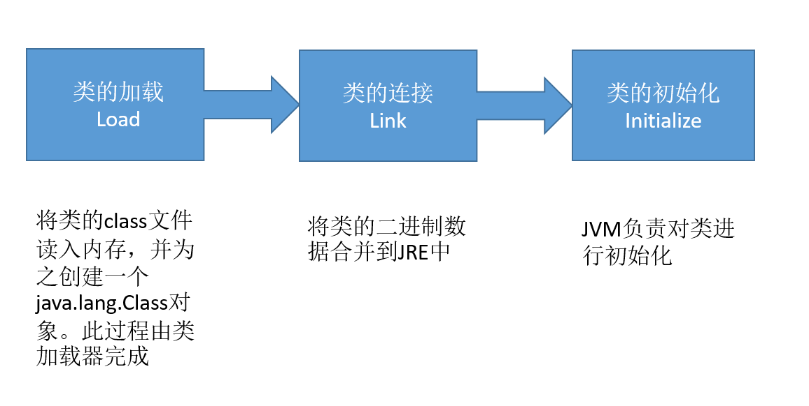
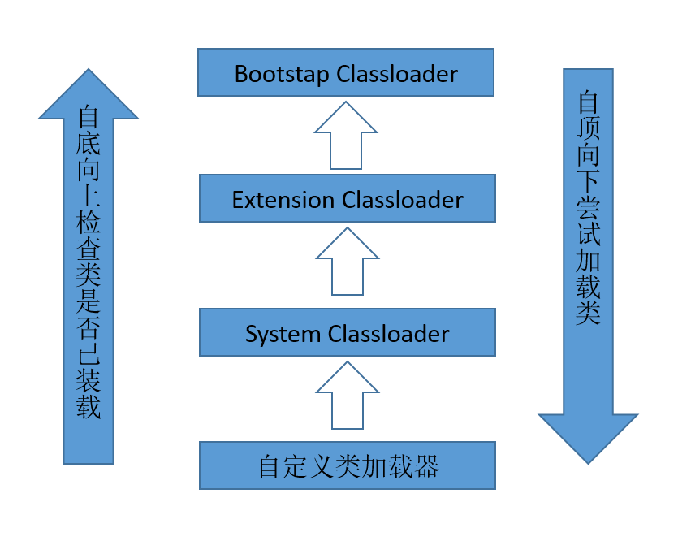

# 第十二章 Java反射机制

[TOC]

## Java反射机制概述

* Reflection(反射)是被视为动态语言的关键，反射机制允许程序在执行期借助于Reflection API取得任何类的内部信息，并能直接操作任意对象的内部属性和方法
* 加载完类之后，在堆内存的方法区中就产生了一个Class类型的对象(一个类只有一个Class对象)，这个对象就包含了完整的类的结构信息。我们可以通过这个对象看到类的结构。这个对象就像一面镜子，透过这个镜子看到类的结构，所以形象的称之为**反射**

* Java反射机制提供的功能
  1. 在运行时判断任意一个对象所属的类
  2. 在运行时构造任意一个类的对象
  3. 在运行时判断任意一个类所具有的成员变量和方法
  4. 在运行时获取泛型信息
  5. 在运行时调用任意一个对象的成员变量和方法
  6. 在运行时处理注解
  7. 生成动态代理

* 反射相关的主要API
  java.lang.Class:代表一个类
  java.lang.reflect.Method:代表类的方法
  java.lang.reflect.Field:代表类的成员变量
  java.lang.reflect.Constructor:代表类的构造器

## Class类和获取Class实例

```java
public class ReflectTest {
    @Test
    public void method() throws Exception {
        Class clazz = Person.class;
        Constructor cons = clazz.getConstructor(String.class, int.class);
        Object obj = cons.newInstance("Tom", 12);
        System.out.println(obj.toString());
        Person p = (Person) obj;
        Field age = clazz.getDeclaredField("age");
        age.setAccessible(true);//私有属性设置值不成功
        age.set(p, 10);

        //Method setAge=clazz.getDeclaredMethod("setAge", int.class);
        //setAge.invoke(p,99);
        System.out.println(p.toString());

        Method show = clazz.getDeclaredMethod("show");
        show.setAccessible(true);//私有的方法
        show.invoke(p);
    }
}

class Person {
    private String name;
    private int age;

    private Person() {

    }

    public Person(String name, int age) {
        this.name = name;
        this.age = age;
    }

    public String getName() {
        return name;
    }

    public void setName(String name) {
        this.name = name;
    }

    public int getAge() {
        return age;
    }

    public void setAge(int age) {
        this.age = age;
    }

    private void show() {
        System.out.println("person的私有方法");
    }

    @Override
    public String toString() {
        return "Person{" +
                "name='" + name + '\'' +
                ", age=" + age +
                '}';
    }
}
```

* 反射的特征：动态性
* 反射与封装的矛盾？
  反射可以调用对象的私有属性和私有方法，那封装性是否被破坏？一个类的属性或者方法既然被封装起来了，说明它不想被外部使用者调用，要么这个私有属性和方法外部用不着，要么就是类里面已提供了获取属性的方法，以及类中提供了更好的方法来替代私有成员方法，所以不建议使用者去调用，即使是反射的方式创建的对象，也最好不要这样

* 类的加载过程：
  程序经过javac.exe命令之后，会生成一个或多个字节码文件(.class结尾)
  接着使用java.exe命令对某个字节码文件进行解释运行，相当于将某个字节码文件加载到内存中，此过程就称为类的加载。而加载到内存中的类，称为运行时类，此运行时类就作为Class的一个实例

* 也就是说Class的一个实例就对应着一个运行时类

* 加载到内存中的运行时类，会缓存一定时间，在此时间内，通过不同的方式来获取此运行时类。

```java
public class ReflectTest {
    @Test
    public void method2 (){
        //方式一：调用运行时类的属性
        Class clazz1=Person.class;
        System.out.println(clazz1);//class com.suftz.study.Person

        //方式二：通过运行时类的对象，调用getClass()
        Person p=new Person("Tom",20);
        Class clazz2=p.getClass();
        System.out.println(clazz2);//class com.suftz.study.Person

        //调用Class类的静态方法forName("类的全名称")
        Class clazz3=null;
        try {
            clazz3=Class.forName("com.suftz.study.Person");
            System.out.println(clazz3);//class com.suftz.study.Person
        } catch (ClassNotFoundException e) {
            e.printStackTrace();
        }

        //使用类的加载器：ClassLoader
        Class clazz4=null;
        ClassLoader classLoader=ReflectTest.class.getClassLoader();
        try {
            clazz4=classLoader.loadClass("com.suftz.study.day18.Person");
            System.out.println(clazz4);//class com.suftz.study.Person
        } catch (ClassNotFoundException e) {
            e.printStackTrace();
        }

        System.out.println(clazz1==clazz2);//true
        System.out.println(clazz2==clazz3);//true
        System.out.println(clazz3==clazz4);//true
    }
}
```

* 哪些类型可以有Class对象
  1. class:外部类，成员(成员内部类，静态内部类)，局部内部类，匿名内部类
  2. interface：接口
  3. []：数组
  4. enum：枚举
  5. annotation：注解@interface
  6. primitive type：基本数据类型
  7. void

```java
public class ReflectTest{
    @Test
    public void method3() {
        Class c1 = Object.class;
        Class c2 = Comparable.class;
        Class c3 = String[].class;
        Class c4 = int[][].class;
        Class c5 = ElementType.class;
        Class c6 = Override.class;
        Class c7 = int.class;
        Class c8 = void.class;
        Class c9 = Class.class;

        int[] a = new int[10];
        int[] b = new int[100];
        Class c10 = a.getClass();
        Class c11 = b.getClass();
        //只要数组的元素类型与维度一样，就是同一个Class
        System.out.println(c10 == c11);//true
    }
}
```

## 类的加载与ClassLoader的理解

### 类的加载

* 当程序主动使用某个类时，如果该类还未被加载到内存中，则系统会通过如下三个步骤来对该类进行初始化


* 加载：将class文件字节码内容加载到内存中，并将这些静态数据转换成方法区的运行时数据结构，然后生成一个代表这个的java.lang.Class对象，作为方法区中类数据的访问入口(即引用地址)，所有需要访问和数据类数据只能通过这个Class对象，这个加载的过程需要类加载器参与
* 链接：将Java类的二进制代码合并到JVM的运行状态之中的过程
  1. 验证：确保加载的类信息符合JVM规范，如二进制文件要以cafe开头
  2. 准备：正式为类变量(static)分配内存并设置类变量的默认初始化值，这些内存也是在方法区中进行分配
  3. 解析：虚拟机常量池内的符号引用(常量名)替换为直接引用(地址)的过程
* 初始化：
  1. 执行类构造器`<clinit>()`方法的过程。类构造器`<clinit>()`方法是由编译期自动收集类中所有类变量的赋值动作和静态代码块中的语句合并产生的。(类构造器是构造类信息的，不是构造该类对象的构造器)
  2. 当初始化一个类的时候，如果发现其父类还没有进行初始化，则需要先触发其父类的初始化
  3. 虚拟机会保证一个类的`<clinit>()`方法在多线程环境中被正确加锁和同步

```java
public class ClassLoaderTest{
    static {
        m = 300;
    }

    static int m = 100;
}
```

以上按照类加载步骤：

1. 第一步：链接结束后m=0
2. 初始化后，m的值由`<clinit>()`方法执行决定，这个类构造器方法由类变量的赋值和静态代码块中的语句按照顺序合并产生，类似于：

  ```java
  <clinit>(){
     m=300;
     m=100;
   }
  ```

* 导致类的初始化的操作
  1. 调用类的main方法
  2. 第一次new此类
  3. 调用类的静态成员(类变量和类方法)，如果没有初始化则会进行初始化
  4. 子类初始化时，如果父类没有初始化，会先初始化父类
  5. 通过反射操作某个类时，如果此类没有初始化，也会进行初始化

* 不会导致类的初始化的操作
  1. 使用类的静态常量
  2. 通过子类调用父类的静态变量，静态方法，不会导致子类初始化，只有父类初始化
  3. 用某个类声明并创建数组对象
  4. 用某个类型声明变量

### ClassLoader的理解

类加载器的作用：

* 类加载器的作用：将class文件字节码内容加载到内存中，并将这些静态数据转换为方法区的运行时数据结构，然后在堆中生成一个代表这个类的java.lang.Class对象，作为方法区中类数据的访问入口
* 类缓存：标准的JavaSE类加载器可以按照要求查找类，但一旦某个类被加载到类加载器中，它将维持加载一段时间，不过JVM垃圾回收机制可以回收这些Class对象

类加载器的类型：



在jvm虚拟机中，如果一个类加载器收到类加载的请求，它首先不会去加载，而是去询问父类，父类如果加载过此类，就不再加载了，这就是双亲委派模式
这样可以避免重复加载，还可以防止恶意代码的安全问题(比如自己编写了系统类，修改了逻辑)

1. 引导类加载器(Bootstap Classloader)：用C++编写的，是JVM自带的类加载器，负责Java平台核心库，用来装载核心类库，该加载器无法直接获取，它是c++写的，也不是ClassLoader的子类
2. 扩展类加载器(Extension Classloader)：负责jre/lib/ext目录下的jar包或-D java.ext.dirs指定目录下的jar包装入工作库，它是ClassLoader的子类
3. 应用(系统)类加载器(AppClassLoader)：负责java -classpath 或 -D java.class.path 所指的目录下的类与jar包装入工作，是最常用的加载器，它是ClassLoader的子类
4. 自定义类加载器：可以自定义类加载器，但是必须继承java.lang.ClassLoader类，当需要对字节码文件进行加密，防止反编译时，可以这样处理。tomcat中使用了自定义类加载器

```java
public class ReflectTest{
    @Test
    public void printClassLoader(){
        //对于自定义类，使用系统类加载器进行加载
        ClassLoader classLoader=ReflectTest.class.getClassLoader();
        System.out.println(classLoader);//sun.misc.Launcher$AppClassLoader@b4aac2
        ClassLoader classLoader2=ClassLoader.getSystemClassLoader();
        ClassLoader classLoader3=Thread.currentThread().getContextClassLoader();//都是系统类加载器

        //调用系统类加载器的getParent()：获取扩展类加载器
        ClassLoader classLoader1=classLoader.getParent();
        System.out.println(classLoader1);//sun.misc.Launcher$ExtClassLoader@bedef2

        //调用扩展类加载器的getParent():无法获取引导类加载器
        //引导类加载器主要负责加载java的核心类库，无法用它去加载自己写的类
        ClassLoader classLoader2=classLoader1.getParent();
        System.out.println(classLoader2);//null
    }
}
```

类加载器可以用来加载配置文件：

```java
public class ReflectTest{
    @Test
    public void testClassLoader() {
        Properties pros = new Properties();

        //通过IO来读取配置
//        InputStreamReader fis = null;
//        try {
//            fis = new InputStreamReader(new FileInputStream("jdbc.properties"), "UTF-8");
//            pros.load(fis);
//        } catch (IOException e) {
//            e.printStackTrace();
//        }

        //系统类加载器进行加载
        ClassLoader classLoader = ReflectTest.class.getClassLoader();
        InputStreamReader is = null;
        try {
            is = new InputStreamReader(classLoader.getResourceAsStream("jdbc.properties"), "utf-8");
            pros.load(is);
        } catch (IOException e) {
            e.printStackTrace();
        }
        String user = pros.getProperty("user");
        String password = pros.getProperty("password");
        System.out.println("user=" + user + ",password=" + password);
    }
}
```

> 此时配置文件的位置不是项目工程的根目录，而是在src源代码文件夹下,即projectName/src/jdbc.properties

## 创建运行时类的对象

```java
public class InstanceTest{
    @Test
    public void method5() throws IllegalAccessException, InstantiationException {
        Class<Person> clazz=Person.class;
        Person p=clazz.newInstance();//此方法成功的要求：运行时类必须提供空参的构造器，构造器的访问权限得允许
        System.out.println(p);//Person{name='null', age=0}
    }
}
```

* javabean中要求提供一个public的空参构造器，原因：
  1. 便于通过反射，创建运行时类的对象
  2. 便于子类继承此运行时类时，默认调用super()时，保证父类有此构造器

> 此方式创建对象更常用，通过空参来创建对象

* 反射的动态性
  根据类名的全名称来创建一个类的对象，而且返回的对象编译时还是不确定的，即反射动态性

  ```java
    public Object getInstance(String classPath) throws Exception {
        Class clazz = Class.forName(classPath);
        return clazz.newInstance();
    }
  ```

## 获取运行时类的完整结构

* 获取属性结构
  1. getFields():获取当前运行时类及其父类中声明为public访问权限的属性
  2. getDeclaredFields():获取当前运行时类中声明的所有属性(不包含父类中声明的属性)

```java
public class ReflectTest{
    @Test
    public void getAllField(){
        Class clazz =Student.class;
        Field[] fields=clazz.getFields();
        for(Field f: fields){
            System.out.println(f);
            //public double com.suftz.study.day18.Student.score
            //public java.lang.String com.suftz.study.day18.Student.major
            //public int com.suftz.study.day18.Person.age
        }

        Field[] declaredField =clazz.getDeclaredFields();
        for(Field f:declaredField){
            System.out.println(f);
            //public double com.suftz.study.day18.Student.score
            //public java.lang.String com.suftz.study.day18.Student.major
        }
    }
}

class Student extends Person {
    public double score;
    public String major;
}

class Person {
    private String name;
    public int age;

    public Person() {

    }

    public Person(String name, int age) {
        this.name = name;
        this.age = age;
    }

    public String getName() {
        return name;
    }

    public void setName(String name) {
        this.name = name;
    }

    public int getAge() {
        return age;
    }

    public void setAge(int age) {
        this.age = age;
    }

    private void show() {
        System.out.println("person的私有方法");
    }

    @Override
    public String toString() {
        return "Person{" +
                "name='" + name + '\'' +
                ", age=" + age +
                '}';
    }
}
```

* 获取属性的详细信息：权限修饰符，数据类型，变量名

```java
public class ReflectTest{
    @Test
    public void getAllFieldsInfo(){
        Class clazz=Student.class;
        Field[] declaredField =clazz.getDeclaredFields();
        for(Field f:declaredField){
            //权限修饰符
            int modifier=f.getModifiers();
            System.out.print(Modifier.toString(modifier)+"\t");
            //数据类型
            Class type=f.getType();
            System.out.print(type.getName()+"\t");
            //变量名
            String fieldName=f.getName();
            System.out.println(fieldName);

        }
        //public	double	score
        //public	java.lang.String	major
    }
}
```

* 获取运行时类的方法的内部结构
  1. getMethods():获取当前运行时类以及所有父类中声明为public权限的方法
  2. getDeclareMethods():获取当前运行时类中声明的所有方法(不包含父类中声明的方法)


```java
    @Test
    public void getAllMethod(){
        Class clazz =Student.class;
        Method[] methods=clazz.getMethods();
        for(Method m: methods){
            System.out.println(m);
            //public java.lang.String com.suftz.study.Person.toString()
            //public java.lang.String com.suftz.study.Person.getName()
            //public void com.suftz.study.Person.setName(java.lang.String)
            //public void com.suftz.study.Person.setAge(int)
            //public int com.suftz.study.Person.getAge()
            //public final void java.lang.Object.wait() throws java.lang.InterruptedException
            //public final void java.lang.Object.wait(long,int) throws java.lang.InterruptedException
            //public final native void java.lang.Object.wait(long) throws java.lang.InterruptedException
            //public boolean java.lang.Object.equals(java.lang.Object)
            //public native int java.lang.Object.hashCode()
            //public final native java.lang.Class java.lang.Object.getClass()
            //public final native void java.lang.Object.notify()
            //public final native void java.lang.Object.notifyAll()
        }
        System.out.println();
        Method[] declaredMethod =clazz.getDeclaredMethods();
        for(Method m:declaredMethod){
            System.out.println(m);//无
        }
    }
```

* 获取运行时类的方法的详细信息
   `权限修饰符 返回值类型 方法名(形参类型1 形参名1,...) throws XxxException{}`

```java
public class ReflectTest {

    @Test
    public void test1(){

        Class clazz = Person.class;

        //getMethods():获取当前运行时类及其所有父类中声明为public权限的方法
        Method[] methods = clazz.getMethods();
        for(Method m : methods){
            System.out.println(m);
        }
        System.out.println();
        //getDeclaredMethods():获取当前运行时类中声明的所有方法。（不包含父类中声明的方法）
        Method[] declaredMethods = clazz.getDeclaredMethods();
        for(Method m : declaredMethods){
            System.out.println(m);
        }
    }

    /*
    @Xxxx
    权限修饰符  返回值类型  方法名(参数类型1 形参名1,...) throws XxxException{}
     */
    @Test
    public void test2(){
        Class clazz = Person.class;
        Method[] declaredMethods = clazz.getDeclaredMethods();
        for(Method m : declaredMethods){
            //1.获取方法声明的注解
            Annotation[] annos = m.getAnnotations();
            for(Annotation a : annos){
                System.out.println(a);
            }

            //2.权限修饰符
            System.out.print(Modifier.toString(m.getModifiers()) + "\t");

            //3.返回值类型
            System.out.print(m.getReturnType().getName() + "\t");

            //4.方法名
            System.out.print(m.getName());
            System.out.print("(");
            //5.形参列表
            Class[] parameterTypes = m.getParameterTypes();
            if(!(parameterTypes == null && parameterTypes.length == 0)){
                for(int i = 0;i < parameterTypes.length;i++){

                    if(i == parameterTypes.length - 1){
                        System.out.print(parameterTypes[i].getName() + " args_" + i);
                        break;
                    }

                    System.out.print(parameterTypes[i].getName() + " args_" + i + ",");
                }
            }

            System.out.print(")");

            //6.抛出的异常
            Class[] exceptionTypes = m.getExceptionTypes();
            if(exceptionTypes.length > 0){
                System.out.print("throws ");
                for(int i = 0;i < exceptionTypes.length;i++){
                    if(i == exceptionTypes.length - 1){
                        System.out.print(exceptionTypes[i].getName());
                        break;
                    }

                    System.out.print(exceptionTypes[i].getName() + ",");
                }
            }


            System.out.println();
        }


    }
}

@MyAnnotation(value="hi")
class Person extends Creature<String> implements Comparable<String>,MyInterface{

    private String name;
    int age;
    public int id;

    public Person(){}

    @MyAnnotation(value="abc")
    private Person(String name){
        this.name = name;
    }

    Person(String name,int age){
        this.name = name;
        this.age = age;
    }
    @MyAnnotation
    private String show(String nation){
        System.out.println("我的国籍是：" + nation);
        return nation;
    }

    public String display(String interests,int age) throws NullPointerException,ClassCastException{
        return interests + age;
    }


    @Override
    public void info() {
        System.out.println("我是一个人");
    }

    @Override
    public int compareTo(String o) {
        return 0;
    }

    private static void showDesc(){
        System.out.println("我是一个可爱的人");
    }

    @Override
    public String toString() {
        return "Person{" +
                "name='" + name + '\'' +
                ", age=" + age +
                ", id=" + id +
                '}';
    }
}

class Creature<T> implements Serializable {
    private char gender;
    public double weight;

    private void breath() {
        System.out.println("生物呼吸");
    }

    public void eat() {
        System.out.println("生物吃东西");
    }

}

@Target({TYPE, FIELD, METHOD, PARAMETER, CONSTRUCTOR, LOCAL_VARIABLE})
@Retention(RetentionPolicy.RUNTIME)
@interface MyAnnotation {
    String value() default "hello";

}

interface MyInterface {
    void info();
}
```

* 获取运行时类的构造器结构
  1. getConstructors():获取当前运行时中声明为public构造器
  2. getDeclaredConstructors():获取当前运行时类中声明的所有的构造器

```java
public class ReflectTest{
    @Test
    public void getAllConstructorInfos(){
        Class clazz=Student.class;
        //getConstructors():获取当前运行时中声明为public构造器
        Constructor[] constructors=clazz.getConstructors();
        for(Constructor c:constructors){
            System.out.println(c);
        }

        System.out.println();
        //getDeclaredConstructors():获取当前运行时类中声明的所有的构造器
        Constructor[] declaredConstructors=clazz.getDeclaredConstructors();
        for(Constructor c:declaredConstructors){
            System.out.println(c);
        }
    }
}
```

## 调用运行时类的指定结构

* 获取运行时类的父类以及泛型

```java
public class ReflectTest{
    @Test
    public void test3(){
        Class clazz=Person.class;
        Type genericSuperclass=clazz.getGenericSuperclass();
        System.out.println(genericSuperclass);//com.suftz.learn.reflect.test.Creature<java.lang.String>
        ParameterizedType paramType=(ParameterizedType)genericSuperclass;
        Type[] actualTypeArguments=paramType.getActualTypeArguments();
        System.out.println(((Class)actualTypeArguments[0]).getName());//java.lang.String
    }
}
```

* 获取运行时类的接口，所在包，注释

```java
public class ReflectTest{
    @Test
    public void test5(){
        Class clazz=Person.class;
        //获取运行时类的包
        Package pack=clazz.getPackage();
        System.out.println(pack);//package com.suftz.learn.reflect.test

        //获取运行时类声明的注释
        Annotation[] annotations=clazz.getAnnotations();
        for(Annotation annos:annotations){
            System.out.println(annos);//@com.suftz.learn.reflect.test.MyAnnotation(value=hi)
        }

        //获取运行时类的接口
        Class[] interfaces=clazz.getInterfaces();
        for(Class c:interfaces){
            System.out.println(c);
            //interface java.lang.Comparable
            //interface com.suftz.learn.reflect.test.MyInterface
        }
        System.out.println();

        //获取运行时类的父类的接口
        Class[] interfaces1=clazz.getSuperclass().getInterfaces();
        for(Class c:interfaces1){
            System.out.println(c);//interface java.io.Serializable
        }
    }
}
```

## 反射的应用：动态代理

* 静态代理只能为每个需要被代理的类来编写特定的代理类，这样并不方便，如果能为每个需要代理的类都使用同一个方式来动态的创建被代理类，只需要提供被代理类和被代理类的接口

```java
import org.junit.Test;

import java.lang.reflect.InvocationHandler;
import java.lang.reflect.Method;
import java.lang.reflect.Proxy;

public class ProxyTest {
    @Test
    /**静态代理测试*/
    public void staticProxyTest(){
        Student student=new Student();
        ProxyStudent proxyStudent=new ProxyStudent(student);
        System.out.println(proxyStudent.work());
        //开始，上课！
        //好好学习天天向上
        //结束，下课！
        //充实的一天
    }

    @Test
    /**动态代理测试*/
    public void dynamicProxyTest(){
        Student student=new Student();
        Person personInstance=(Person)ProxyFactory.getProxyInstance(student);
        System.out.println(personInstance.work());
        //开始，上课！
        //好好学习天天向上
        //结束，下课！
        //充实的一天
    }
}

/**被代理类的父接口*/
interface Person {
    String work();
}

/**被代理的类*/
class Student implements Person {
    @Override
    public String work() {
        return "好好学习天天向上";
    }
}

/**静态代理类*/
class ProxyStudent implements Person{
    private Person person;

    public ProxyStudent(Person person){
        this.person=person;
    }
    @Override
    public String work(){
        System.out.println("开始，上课！");
        System.out.println(person.work());
        System.out.println("结束，下课！");
        return "充实的一天";
    }
}

/************************下列是动态代理示例**************************/

/**其他附加事务*/
class PersonUtil{
    public void start(){
        System.out.println("开始，上课！");
    }

    public void end(){
        System.out.println("结束，下课！");
    }
}

/**实例工厂*/
class ProxyFactory{
    public static Object getProxyInstance(Object obj){
        MyInvocationHandler handler=new MyInvocationHandler(obj);
        return Proxy.newProxyInstance(obj.getClass().getClassLoader(),obj.getClass().getInterfaces(),handler);
    }
}

/**调用处理器*/
class MyInvocationHandler implements InvocationHandler {

    private Object obj;
    public MyInvocationHandler(Object obj){
        this.obj=obj;
    }

    @Override
    public Object invoke(Object proxy, Method method, Object[] args) throws Throwable {
        PersonUtil personUtil=new PersonUtil();

        personUtil.start();

        Object returnValue=method.invoke(obj,args);
        System.out.println(returnValue);
        personUtil.end();

        return "充实的一天";
    }
}
```
