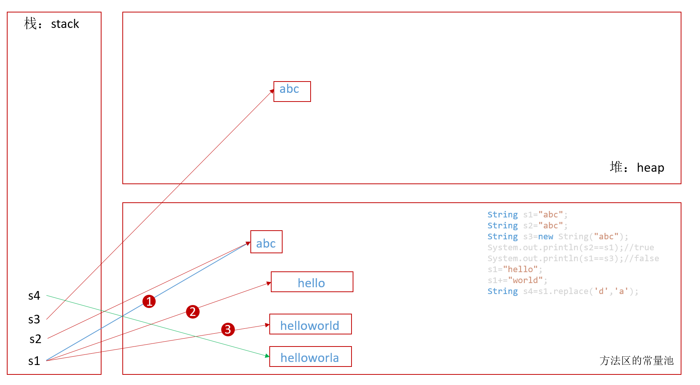

# 第七章 Java常用类

## 7.1 字符串相关类

### 7.1.1 String

#### String特性

* String类：字符串，Java程序中所有字符串字面值(如"abc")都作为此类的实例实现。
* String是一个final类，代表不可变的字符序列
* 字符串是常量，用双引号引起来表示。它的值在创建之后不能更改。
  * 当对字符串重新赋值时，需要重新指定内存区域赋值，不能使用原有的avlue进行赋值
  * 当对现有的字符串进行连接操作时，也需要重新指定内存区域赋值，不是在原有位置附加
  * 当调用String的replace()方法修改指定字符或子字符串时，也需要重新指定内存区域赋值，不是在原有位置修改
* String对象的字符内容是存储在一个常量字符数组`private final char value[]`内，且String类里面不提供方法去修改私有的常量数组
* String实现了Serializable接口，表示字符串是支持序列化的
* String实现了Comparable接口，表示字符串是可以比较大小的
* 通过字面量的方式(区别于new String("字符串"))给一个字符串赋值，此时的字符串值声明在字符串常量池中
* 字符串常量池中是不会存储相同内容的字符串的

> JDK1.9之前是char value[],jdk1.9后改成了byte value[]

```java
public class StringTest {
    public static void main(String[] args) {
        String s1="abc";
        String s2="abc";
        String s3=new String("abc");
        System.out.println(s2==s1);//true，说明s1和s2共用了一个内存空间
        System.out.println(s1==s3);//false
        s1="hello";
        s1+="world";//s1=helloworld
        String s4=s1.replace('d','a');s4=helloworla
    }
}
```



#### String的实例化方式

  1. 通过字面量定义的方式
  2. 通过new+ 构造器的方式

```java
String str1="Java";
String str2="Java";
String str3=new String("Java");
String str4=new String("Java");
System.out.println(str1==str2);//true
System.out.println(str3==str4);//false
```

* 字符串相互拼接的结果分析：

```java
String s0="helloworld";
String s1="hello";
String s2="world";
String s3="hello"+"world";
String s4=s1+"world";
String s5="hello"+s2;
String s6=s1+s2;
String s7=(s1+s2).intern();
System.out.println(s0==s3);//true
System.out.println(s3==s4);//false
System.out.println(s3==s5);//false
System.out.println(s4==s5);//false
System.out.println(s3==s6);//false
System.out.println(s4==s6);//false
System.out.println(s3==s7);//true

final String s8="world";
String s9="hello"+s8;//因为s8是常量，所以存储在常量池，s9也就是两个常量相拼接，则结果s9在常量池
System.out.println(s0==s9);//true
```

```java
public class StringTest {
    public static void main(String[] args) {
        String s1 = "hello";
        String s2 = new String("he") + new String("llo");

        String s = s2.intern();//s==s1,true
        System.out.println(s2 == s);//false
    }
}
```

```java
public class StringTest {
    public static void main(String[] args) {
        String s2 = new String("he") + new String("llo");

        String s = s2.intern();
        System.out.println(s2 == s);//true
    }
}
```

* **常量与常量的拼接结果在常量池**，且常量池中不会存相同内容的常量
* **只要拼接中有一个是变量，结果就在堆中**
* 如果拼接的结果调用`intern()`方法,返回值就在常量池中

#### String类的常用方法

 > 通过查看String源码可知String类的所有常用方法

* 获取
  1. `int length()`获取长度
  2. `char charAt(int index)`:根据位置index来获取位置上的某个字符，index范围[0,length-1]
  3. 根据字符(串)获取该字符(串)在字符串中的位置(存在则返回index,不存在则是-1):
      * `int indexOf(int ch)`:返回的是ch在字符串中从左到右第一次出现的位置
      * `int indexOf(int ch,int fromIndex)`:获取ch在字符串中，从fromIndex位置开始，从左到右第一次出现的位置
      * `int indexOf(String str)`:返回的是str在字符串中第一次出现的位置
      * `int indexOf(String str,int fromIndex)`:从fromIndex指定位置开始，从左到右，获取str在字符串中出现的位置
      * `int lastIndexOf(int ch)`:从右到左，返回ch在字符串中第一次出现的位置
      * `int lastIndexOf(int ch,int fromIndex)`:从fromIndex开始，从右到左，返回ch在字符串中第一次出现的位置
      * `int lastIndexOf(String str)`:从右到左，返回ch在字符串中第一次出现的位置
      * `int lastIndexOf(String str,int fromIndex)`:从fromIndex开始，从右到左，返回ch在字符串中第一次出现的位置

* 判断
  1. `boolean contains(String str)`:字符串中是否包含某一个子串
  2. `boolean isEmpty()`:字符串中是否有内容
  3. `boolean startsWith(String str)`:字符串是否是以指定内容开头
  4. `boolean endsWith(String str)`:字符串是否是以指定内容结尾
  5. `boolean equals(String str)`:判断字符串内容是否相同。重写了Object类中的equals()方法
  6. `boolean equalsIgnoreCase(String str)`:忽略大小写时，判断字符串内容是否相同

* 替换
  1. `String replace(char oldChar,char newChar)`:将字符串中的字符oldChar全部替换成newChar
* 切割
  1. `String[] split(String regex)`:按照正则或者字符(串)来分割整个字符串，如`"abcdabca".split("a")`结果是`["bcd","bc"]`
* 子串
  1. `String substring(int beginIndex)`:从位置beginIndex开始，一直到字符串结束，获取这个范围的字符子串，子串下标的范围是[beginIndex,length-1]
  2. `String substring(int beginIndex,int endIndex)`:从位置beginIndex开始，一直到位置endIndex结束(但不包括位置endIndex)，获取这个范围的字符子串，子串下标的范围是[beginIndex,endIndex-1]
* 转换
  1. `String toUpperCase()`:将字符串中的字母全部转成大写
  2. `String toLowerCase()`:将字符串中的字母全部转成小写
* 去除空格
  1. `String trim()`:去除字符串两端的空格，返回新串
* 自然排序（String类实现了Comparable接口）
  1. `int compareTo(String str)`:对两个字符串进行自然排序的比较

#### Java正则表达式

#### String与包装类的转换

#### `String`与`char[]`之间的转换

  1. `String`-->`char[]`:调用String的`toCharArray()`
  2. `char[]`-->`String`:调用String的构造器

```java
char[] chars=str.toCharArray();
String str=new String(chars);
```

#### `String`与`byte[]`之间的转换

  1. 编码，String-->byte[]：调用String的getBytes()
  2. 解码，byte[]-->String：调用String的构造器

```java
String str="abc";
byte[] bytes=str.getBytes();
System.out.println(Arrays.toString(bytes));
String str2="abc你好";
try {
    byte[] bytes2=str2.getBytes("UTF-8");//编码，String-->byte[]
     System.out.println(Arrays.toString(bytes2));

    String str3=new String(bytes2,"UTF-8");//解码，byte[]-->String
    System.out.println(str3);
} catch (UnsupportedEncodingException e) {
    e.printStackTrace();
}
```

### 7.1.2 StringBuffer与StringBuilder

* String:不可变的字符序列，底层使用char[]存储
* StringBuffer:可变的字符序列；线程安全的(类方法里有synchronized修饰);效率低；底层使用char[]存储
* StringBuilder:可变的字符序列;JDK5.0新增的，线程不安全的，效率高；底层使用char[]存储
* StringBuffer的扩容：如果要添加的数据底层数组装不下了，就需要扩容底层数组，默认情况下，扩容为原来的容量*2倍+2，同时将原有数组中的元素复制到新的数组中

```java
StringBuffer strBuffer=new StringBuffer();//会预先开辟16个字符的数组元素
StringBuffer strBuffer2=new StringBuffer("abc");//会开辟16+3=19个字符的数组元素
```

* 效率对比：从高到低，`StringBuilder`>`StringBuffer`>`String`

* StringBuffer的常用方法：
  1. `append(String/char str)`:字符串附加连接
  2. `toString()`:返回字符串内容相同的String类型对象
  3. `setCharAt(int index,char ch)`:将下标为index的位置字符替换为新的字符ch
  4. `insert(int offset,String/char str)`:在指定位置之前插入字符(串)
  5. `delete(int startIndex,int endIndex)`:删除起始位置(包含)到结尾位置(不包含)之间的字符串

## 7.2 时间日期类

* System类中获取时间戳

`System.currentTimeMillis()`:返回当前时间与1970年1月1日0时0分0秒之间以毫秒为单位的时间差(时间戳)

* `java.util.Date`

  * `new Date()`:创建一个对应当前时间的Date对象
  * `new Date(long millis)`:创建指定毫秒数的Date对象
  * `toString()`:显示当前的年、月、日、时、分、秒
  * `getTime()`:获取当前Date对象的对应的毫秒数(时间戳)

* `java.sql.Date`
  * `new Date(long millis)`:创建指定毫秒数的Date对象

* sql.Date(子类)转util.Date(父类):直接赋值，向上转型是自动的

  ```java
  java.sql.Date date1=new java.sql.Date(11111111111L);
  java.util.Date date2=date1;
  ```

* util.Date(父类)转sql.Date(子类):通过时间戳作为转换

  ```java
  java.util.Date date1=new java.util.Date();
  long currentTime=date1.getTime();
  java.sql.Date date2=new java.sql.Date(currentTime);
  ```

* `SimpleDateFormat`
  1. 格式化：日期--->字符串
  2. 解析：字符串--->日期

```java
public class FormatTest {
    public static void main(String[] args) throws ParseException {//format()方法可能会报错抛异常
        SimpleDateFormat sdf=new SimpleDateFormat();
        Date date=new Date();
        System.out.println(date);//Fri Dec 04 19:45:46 CST 2018

        String dateStr=sdf.format(date);
        System.out.println(dateStr);//18-12-4 下午7:45

        String str="18-02-14 上午 11:30";
        Date date1=sdf.parse(str);
        System.out.println(date1);//Wed Feb 14 11:30:00 CST 2018

        SimpleDateFormat sdf2=new SimpleDateFormat("yyyy MM dd HH:mm:ss");
        String dateStr2=sdf2.format(date1);
        System.out.println(dateStr2);//2018 02 14 11:30:00

        Date date2=sdf2.parse("2018 03 14 12:12:34");
        System.out.println(date2);//Wed Mar 14 12:12:34 CST 2018
    }
}
```

```java
SimpleDateFormat s=new SimpleDateFormat("yyyy-MM-dd");
Date d1=s.parse("2018-12-31");//时间点是2018-12-31 00:00:00
Date d2=s.parse("2018-01-01");//时间点是2018-01-01 00:00:00
System.out.println((d1.getTime() - d2.getTime()) / (1000 * 60 * 60 * 24));//两个日期的间隔天数
```

* Calendar日历类的使用

  * 是一个抽象类，不能直接new一个对象
  * 创建实例的方式：
   1. 创建其子类GregorianCalendar的对象
   2. 调用Calendar的静态方法getInstance()

  * `public void get(int field)`
  * `public void set(int field,int value)`
  * `public void add(int field,int amount)`
  * `public final Date getTime()`
  * `public final void setTime(Date date)`

```java
//今天是2018-12-04
Calendar calendar=Calendar.getInstance();
//get
int daysOfMonth= calendar.get(Calendar.DAY_OF_MONTH);
System.out.println(daysOfMonth);//4
int daysOfYear=calendar.get(Calendar.DAY_OF_YEAR);
System.out.println(daysOfYear);//338

//set
calendar.set(Calendar.DAY_OF_MONTH,22);
daysOfMonth=calendar.get(Calendar.DAY_OF_MONTH);
System.out.println(daysOfMonth);//22
//add
calendar.add(Calendar.DAY_OF_MONTH,3);//负数表示减多少天
daysOfMonth=calendar.get(Calendar.DAY_OF_MONTH);
System.out.println(daysOfMonth);//25
//getTime
Date date=calendar.getTime();//根据日历时间获取到一个Date对象
//setTime
calendar.setTime(new Date());//把日历设置成当前时间
```

### JDK8中日期时间的API

* JDK8以前的`Date` `SimpleDateFormat` `Calendar`有缺陷，`Date`类里面的方法基本上已经废弃，建议使用`Calendar`类，但是日期格式化的类`SimpleDateFormat`进行日期格式化的操作是基于Date类型的，于是为了更好的使用日期以及进行各种操作，需要在这三个类的对象之间转换，很麻烦。而且，Date类型的年份是从1900年开始计数，月份从0开始计数；Calendar类的月份也是从0开始计数，与人们的实际生活不符，另外还有如下问题：
  1. 可变性：日期和时间这样的类应该是不可变的
  2. 格式化只对Date有用，Calendar则不行
  3. 线程不安全，不能闰秒

* `LocalDate`、`LocalTime`、`LocalDateTime`

```java
public class LocalDateTimeTest {
    public static void main(String[] args) {
        //now():获取当前的日期，时间，日期+时间
        LocalDate localDate = LocalDate.now();
        LocalTime localTime = LocalTime.now();
        LocalDateTime localDateTime = LocalDateTime.now();
        System.out.println(localDate);
        System.out.println(localTime);
        System.out.println(localDateTime);

        //of():设置指定的年、月、日、时、分、秒
        LocalDateTime localDateTime1 = LocalDateTime.of(2020, 10, 15, 10, 14, 15);
        System.out.println(localDateTime1);

        //get():获取相关属性
        System.out.println(localDateTime1.getDayOfMonth());
        System.out.println(localDateTime1.getDayOfWeek());
        System.out.println(localDateTime1.getMonth());//月份英文,枚举
        System.out.println(localDateTime1.getMonthValue());//月份数值

        //withXxx():设置相关属性
        LocalDate localDate1 = localDate.withDayOfMonth(25);
        System.out.println(localDate);//仍然没有改变
        System.out.println(localDate1);//

        //加
        LocalDateTime localDateTime2 = localDateTime1.plusMonths(3);
        System.out.println(localDateTime2);

        //减
        LocalDateTime localDateTime3 = localDateTime1.minusDays(4);
        System.out.println(localDateTime3);
    }
}
```

* 瞬时Instant
  * Instant:时间线上的一个瞬时点，时间线时连续的，时间线中的一个点表示为一个很大的数，有利于计算机处理。
  * 在UNIX中，瞬时这个数从1970年开始，以秒为单位。在Java中，也是从1970年开始，但以毫秒为单位。
  * java.time包通过值类型Instant提供机器试图，不提供处理人类意义上的时间单位。Instant表示时间线上的一个点，而不需要任何上下文信息，比如时区。它只是简单的表示自1970年1月1日0时0分0秒(UTC)开始的毫秒数。因为java.time包是基于纳秒计算的，所有精度可以达到纳秒
  * 1秒=1000毫秒=$10^6$微秒=$10^9$纳秒

```java
Instant instant=Instant.now();//获取当前时间线上的一点
System.out.println(instant);//2020-12-04T14:28:41.114Z

OffsetDateTime offsetDateTime=instant.atOffset(ZoneOffset.ofHours(8));//中国在东八区
System.out.println(offsetDateTime);//2020-12-04T22:28:41.114+08:00

long milli=instant.toEpochMilli();//获取时间线此时该点的时间戳(毫秒数)
System.out.println(milli);//1607092121114

Instant instant1=Instant.ofEpochMilli(1607088324767L);//根据毫秒数得到瞬时对象
System.out.println(instant1);//2020-12-04T13:25:24.767Z
```

* `DateTimeFormatter`

```java
public class DateTimeFormatterTest {
    public static void main(String[] args) {
        DateTimeFormatter formatter = DateTimeFormatter.ISO_LOCAL_DATE_TIME;
        LocalDateTime localDateTime = LocalDateTime.now();
        String str1 = formatter.format(localDateTime);
        System.out.println(localDateTime);//2020-12-04T22:43:56.283
        System.out.println(str1);//2020-12-04T22:43:56.283

        //解析：字符串-->日期
        TemporalAccessor temporalAccessor = formatter.parse("2020-12-04T22:41:06.863");
        System.out.println(temporalAccessor);//{},ISO resolved to 2020-12-04T22:41:06.863

        //本地格式化
        DateTimeFormatter formatter1 = DateTimeFormatter.ofLocalizedDateTime(FormatStyle.LONG);
        String str2 = formatter1.format(localDateTime);
        System.out.println(str2);//2020年12月4日 下午10时43分56秒

        LocalDate localDate = LocalDate.now();
        DateTimeFormatter formatter2 = DateTimeFormatter.ofLocalizedDate(FormatStyle.FULL);
        String str3 = formatter2.format(localDate);
        System.out.println(str3);//2020年12月4日 星期五

        //自定义格式化
        DateTimeFormatter formatter3 = DateTimeFormatter.ofPattern("yyyy-MM-dd hh:mm:ss");
        String str4 = formatter3.format(LocalDateTime.now());
        System.out.println(str4);//2020-12-04 10:50:21
    }
}
```

### System类

* System类代表系统，系统级的很多属性和控制方法都放置在该类内部
* 由于它的构造器是私有的，即无法创建该类的对象。其内部的成员变量和成员方法都是static的，也很方便使用。
* 该类是final修饰的，即无法被继承
* 成员变量：
  1. in:标准输入流
  2. out：标准输出流
  3. err：标准错误输出流

* 成员方法：
  1. native long currentTimeMillis():获取当前时间距离1970年月1日0时0分0秒所差的毫秒数
  2. void exit(int status):传入参数0代表正常退出，非0表示异常退出
  3. void gc():请求系统进行垃圾回收，但至于是否回收，取决于系统
  4. String getProperty(String key):获取系统中属性为Key的属性对应的值

### 数学计算

BigInteger不可变的任意大小的整数

BigDecimal更大范围的且精度更高的浮点数，支持任意精度