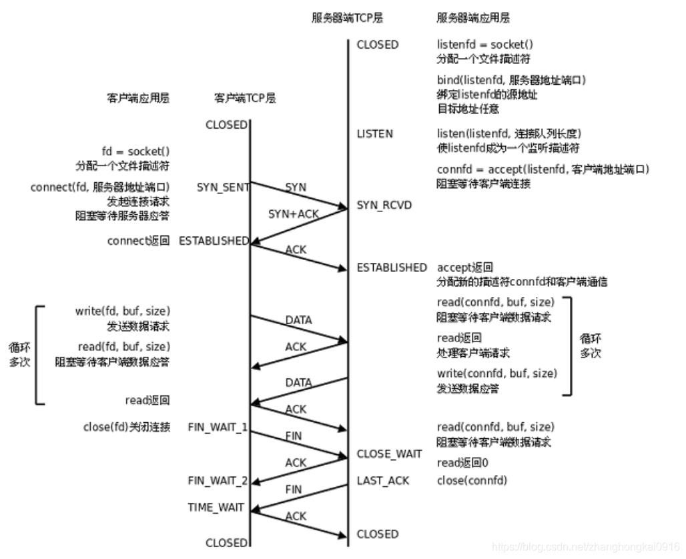

# 第十一章 Java网络编程

[TOC]

## 网络通信要素概述

### IP和端口号

### 网络通信协议

* OSI参考模型，过于理想化，未能在因特网上推广
* TCP/IP参考模型(TCP/IP协议)，事实上的国际标准

<table>
<tr align="center">
    <td>OSI七层网络模型</td>
    <td>TCP/IP四层概念模型</td>
    <td>对应网络协议</td>
</tr>
<tr>
    <td>应用层(Application)</td>
    <td rowspan="3" align="center">应用层</td>
    <td>HTTP,TFTP,FTP,NFS,WAIS,SMTP</td>
</tr>
<tr>
    <td>表示层(Presentation)</td>
    <td>Telnet,Rlogin,SNMP,Gopher</td>
</tr>
<tr>
    <td>会话层(Session)</td>
    <td>SMTP,DNS</td>
</tr>
<tr>
    <td>传输层(Transport)</td>
    <td align="center">传输层</td>
    <td>TCP,UDP</td>
</tr>
<tr>
    <td>网络层(Network)</td>
    <td align="center">网络层</td>
    <td>IP,ICMP,ARP,RARP,AKP,UUCP</td>
</tr>
<tr>
    <td >数据链路层(Data Link)</td>
    <td rowspan="2" align="center">数据链路层</td>
    <td>FDDI,Ethernet,Arpanet,PDN,SLIP,PPP</td>
</tr>
<tr>
    <td>物理层(Physical)</td>
    <td>IEEE 802.1A,IEEE 802.2到IEEE 802.11</td>
</tr>
</table>

## 通信要素1：IP和端口号

```java
public class NetTest {
    @Test
    public void method1() {
        try {
            InetAddress inet1 = InetAddress.getByName("www.baidu.com");
            System.out.println(inet1);//www.baidu.com/182.61.200.6

            InetAddress inet2 = InetAddress.getByName("www.suftz.com");
            System.out.println(inet2);//www.suftz.com/106.55.153.38

            InetAddress inet3 = InetAddress.getByName("blog.suftz.com");
            System.out.println(inet3);//blog.suftz.com/185.199.110.153
            //以上三个进行域名解析需要发请求到DNS服务器，在没有网络连接的时候会抛异常

            InetAddress inet4 = InetAddress.getByName("127.0.0.1");
            System.out.println(inet4);//  /127.0.0.1

            InetAddress inet5 = InetAddress.getByName("192.168.17.35");
            System.out.println(inet5);//   /192.168.17.35
            InetAddress inet6 = InetAddress.getLocalHost();
            System.out.println(inet6);
            //   agile/10.10.17.70        这个地址仍是一个局域网ip
            //   agile/192.168.17.35
            //   agile/127.0.0.1
            //   有公网的时候打印分配的ip;只有局域网的时候打印局域网;没有连接任何网络则打印巡回地址127.0.0.1
        } catch (UnknownHostException e) {
            e.printStackTrace();
        }
    }
}
```

* 端口号标识正在计算机上允许的进程(程序)
* 不同的进程有不同的端口号
* 端口号被规定为一个16位的整数0~65535
* 端口分类：
  1. 公认端口：0~1023,被预先定义为服务通信占用(如：HTTP占用端口80，FTP占用端口21,Telnet占用端口23)
  2. 注册端口：1024~49151，分配给用户进程或应用程序。（如：Tomcat占用端口8080，MySQL占用端口3306，Oracle占用端口1521等，这些应用的端口可以修改）
  3. 动态/私有端口：49152~65535
* 端口号与IP地址的组合得出一个网络套接字：Socket

## 通信要素2：网络协议

### OSI七层模型

1. **物理层**：比特
主要定义物理设备标准，如网线的接口类型、光纤的接口类型、各种传输介质的传输速率等。它的主要作用是传输比特流（就是由1、0转化为电流强弱来进行传输,到达目的地后在转化为1、0，也就是我们常说的数模转换与模数转换）。这一层的数据叫做比特。

2. **数据链路层**：帧
定义了如何让格式化数据以进行传输，以及如何让控制对物理介质的访问。这一层通常还提供错误检测和纠正，以确保数据的可靠传输。

3. **网络层**：数据报
在位于不同地理位置的网络中的两个主机系统之间提供连接和路径选择。Internet的发展使得从世界各站点访问信息的用户数大大增加，而网络层正是管理这种连接的层。

4. **运输层**：报文段/用户数据报
定义了一些传输数据的协议和端口号（WWW端口80等），如：
TCP（transmission control protocol –传输控制协议，传输效率低，可靠性强，用于传输可靠性要求高，数据量大的数据）
UDP（user datagram protocol–用户数据报协议，与TCP特性恰恰相反，用于传输可靠性要求不高，数据量小的数据，如QQ聊天数据就是通过这种方式传输的）。 主要是将从下层接收的数据进行分段和传输，到达目的地址后再进行重组。常常把这一层数据叫做段。

5. **会话层**：
通过运输层（端口号：传输端口与接收端口）建立数据传输的通路。主要在你的系统之间发起会话或者接受会话请求（设备之间需要互相认识可以是IP也可以是MAC或者是主机名）

6. **表示层**：
可确保一个系统的应用层所发送的信息可以被另一个系统的应用层读取。例如，PC程序与另一台计算机进行通信，其中一台计算机使用扩展二一十进制交换码（EBCDIC），而另一台则使用美国信息交换标准码（ASCII）来表示相同的字符。如有必要，表示层会通过使用一种通格式来实现多种数据格式之间的转换。

7. **应用层**：报文

### TCP/IP四层模型

1. **物理层**(physical layer)
物理层(physical layer)：在物理层上所传数据的单位是比特。物理层的任务就是透明地传送比特流。

2. **数据链路层**(data link layer)
数据链路层(data link layer)：常简称为链路层，我们知道，两个主机之间的数据传输，总是在一段一段的链路上传送的，也就是说，在两个相邻结点之间传送数据是直接传送的(点对点)，这时就需要使用专门的链路层的协议。
在两个相邻结点之间传送数据时，数据链路层将网络层交下来的IP数据报组装成帧(framing)，在两个相邻结点之间的链路上“透明”地传送帧中的数据。
每一帧包括数据和必要的控制信息(如同步信息、地址信息、差错控制等)。典型的帧长是几百字节到一千多字节。
注：”透明”是一个很重要的术语。它表示，某一个实际存在的事物看起来却好像不存在一样。”在数据链路层透明传送数据”表示无力什么样的比特组合的数据都能够通过这个数据链路层。因此，对所传送的数据来说，这些数据就“看不见”数据链路层。或者说，数据链路层对这些数据来说是透明的。
(1)在接收数据时，控制信息使接收端能知道一个帧从哪个比特开始和到哪个比特结束。这样，数据链路层在收到一个帧后，就可从中提取出数据部分，上交给网络层。
(2)控制信息还使接收端能检测到所收到的帧中有无差错。如发现有差错，数据链路层就简单地丢弃这个出了差错的帧，以免继续传送下去白白浪费网络资源。如需改正错误，就由运输层的TCP协议来完成。
3. **网络层**(network layer)
网络层(network layer)主要包括以下两个任务：
(1) 负责为分组交换网上的不同主机提供通信服务。在发送数据时，网络层把运输层产生的报文段或用户数据报封装成分组或包进行传送。在TCP/IP体系中，由于网络层使用IP协议，因此分组也叫做IP数据报，或简称为数据报。
(2) 选中合适的路由，使源主机运输层所传下来的分组，能够通过网络中的路由器找到目的主机。
协议：IP,ICMP,IGMP,ARP,RARP
4. **运输层**(transport layer)
运输层(transport layer)：负责向两个主机中进程之间的通信提供服务。由于一个主机可同时运行多个进程，因此运输层有复用和分用的功能
复用，就是多个应用层进程可同时使用下面运输层的服务。
分用，就是把收到的信息分别交付给上面应用层中相应的进程。
运输层主要使用以下两种协议：
(1) 传输控制协议TCP(Transmission Control Protocol)：面向连接的，数据传输的单位是报文段，能够提供可靠的交付。
(2) 用户数据包协议UDP(User Datagram Protocol)：无连接的，数据传输的单位是用户数据报，不保证提供可靠的交付，只能提供“尽最大努力交付”。

5. **应用层**(application layer)
应用层(application layer)：是体系结构中的最高。直接为用户的应用进程（例如电子邮件、文件传输和终端仿真）提供服务。
在因特网中的应用层协议很多，如支持万维网应用的HTTP协议，支持电子邮件的SMTP协议，支持文件传送的FTP协议，DNS，POP3，SNMP，Telnet等等。


//具体的各层使用的协议todo

## TCP网络编程

### TCP协议

  1. 使用TCP协议前，须先建立TCP连接，形成传输数据通道
  2. 传输前，采用“三次握手”方式，点对点通信，**是可靠的**
  3. TCP协议进行通信的两个应用进程：客户端、服务端
  4. 在连接中可**进行大数据量的传输**
  5. 传输完毕，需释放已建立的连接，效率低

### 三次握手

* 三次握手与四次挥手是TCP协议中的一个连接管理机制，在正常情况下, TCP要经过三次握手建立连接, 四次挥手断开连接


* ISN：初始化序列号
* ACK:TCP报头的控制位之一,对数据进行确认.确认由目的端发出,用它来告诉发送端这个序列号之前的数据段
都收到了.比如,确认号为X,则表示前X-1个数据段都收到了,只有当ACK=1时,确认号才有效,当ACK=0时,确认号无效,这时会要求重传数据,保证数据的完整性.
SYN：请求建立连接; 我们把携带SYN标识的称为同步报文段

* 第一次握手：客户端给服务器发送一个SYN。客户端发送网络包，服务端收到了。服务器得出结论：客户端的发送能力，服务端的接收能力正常。
* 第二次握手：服务端收到SYN报文之后，会应答一个SYN+ACK报文。服务端发包，客户端收到了。客户端得出结论：服务端的接收和发送能力，客户端的接收和发送能力正常。但是此时服务端不能确认客户端的接收能力是否正常。
* 第三次握手;客户端收到SYN+ACK报文之后，回应一个ACK报文。客户端发包，服务端收到了。服务器得出结论：客户端的接收和发送能力，自己的接收发送能力都正常。
通过三次握手，双方都确认对方的接收以及发送能力正常。

具体过程图解：


* 刚开始客户端处于 closed 的状态，服务端处于 listen 状态。然后
  * 第一次握手：客户端给服务端发一个 SYN 报文，并指明客户端的初始化序列号 ISN©。此时客户端处于 SYN_Send 状态。
  * 第二次握手：服务器收到客户端的 SYN 报文之后，会以自己的 SYN 报文作为应答，并且也是指定了自己的初始化序列号 ISN(s)，同时会把客户端的 ISN + 1 作为 ACK 的值，表示自己已经收到了客户端的 SYN，此时服务器处于 SYN_REVD 的状态。
  * 第三次握手：客户端收到 SYN 报文之后，会发送一个 ACK 报文，当然，也是一样把服务器的 ISN + 1 作为 ACK 的值，表示已经收到了服务端的 SYN 报文，此时客户端处于 establised 状态。
  * 服务器收到 ACK 报文之后，也处于 establised 状态，此时，双方以建立起了链接。
* 三次握手的作用：
  1. 确认双方的接受能力、发送能力是否正常。
  2. 指定自己的初始化序列号，为后面的可靠传送做准备。

> 注意ISN不是固定的：三次握手的一个重要功能是客户端和服务端交换ISN(Initial Sequence Number), 以便让对方知道接下来接收数据的时候如何按序列号组装数据。如果ISN是固定的，攻击者很容易猜出后续的确认号，因此 ISN 是动态生成的。

### 四次挥手


* 过程描述：
1、第一次挥手：客户端发送一个 FIN 报文，报文中会指定一个序列号。此时客户端处于FIN_WAIT1状态。

2、第二次握手：服务端收到 FIN 之后，会发送 ACK 报文，且把客户端的序列号值 + 1 作为 ACK 报文的序列号值，表明已经收到客户端的报文了，此时服务端处于 CLOSE_WAIT状态。

3、第三次挥手：如果服务端也想断开连接了，和客户端的第一次挥手一样，发给 FIN 报文，且指定一个序列号。此时服务端处于 LAST_ACK 的状态。

4、第四次挥手：客户端收到 FIN 之后，一样发送一个 ACK 报文作为应答，且把服务端的序列号值 + 1 作为自己 ACK 报文的序列号值，此时客户端处于 TIME_WAIT 状态。需要过一阵子以确保服务端收到自己的 ACK 报文之后才会进入 CLOSED 状态

5、服务端收到 ACK 报文之后，就处于关闭连接了，处于 CLOSED 状态。
这里特别需要主要的就是TIME_WAIT这个状态，要理解，为什么客户端发送 ACK 之后不直接关闭，而是要等一阵子才关闭。这其中的原因就是，要确保服务器是否已经收到了我们的 ACK 报文，如果没有收到的话，服务器会重新发 FIN 报文给客户端，客户端再次收到 ACK 报文之后，就知道之前的 ACK 报文丢失了，然后再次发送 ACK 报文。

至于 TIME_WAIT 持续的时间至少是一个报文的来回时间。一般会设置一个计时，如果过了这个计时没有再次收到 FIN 报文，则代表对方成功就是 ACK 报文，此时处于 CLOSED 状态。为什么是TIME_WAIT的时间是2MSL?
MSL是TCP报文的最大生存时间, 因此TIME_WAIT持续存在2MSL的话
就能保证在两个传输方向上的尚未被接收或迟到的报文段都已经消失(否则服务器立刻重启, 可能会收到来
自上一个进程的迟到的数据, 但是这种数据很可能是错误的);
同时也是在理论上保证最后一个报文可靠到达(假设最后一个ACK丢失, 那么服务器会再重发一个FIN. 这时
虽然客户端的进程不在了, 但是TCP连接还在, 仍然可以重发LAST_ACK);

//todo,用抓包工具来分析握手和挥手

### java TCP网络编程

* 网络传输文字

```java
public class NetTest{
    @Test
    public void client() {
        Socket socket = null;
        OutputStream os = null;
        try {
            InetAddress inet = InetAddress.getByName("127.0.0.1");
            socket = new Socket(inet, 8899);
            os = socket.getOutputStream();
            os.write("你好，我是客户端".getBytes());
        } catch (IOException e) {
            e.printStackTrace();
        } finally {
            try {
                if (os != null)
                    os.close();
            } catch (IOException e) {
                e.printStackTrace();
            }
            try {
                if (socket != null)
                    socket.close();
            } catch (IOException e) {
                e.printStackTrace();
            }
        }
    }

    @Test
    public void server() {
        ServerSocket ss = null;
        Socket socket = null;
        InputStream is = null;
        ByteArrayOutputStream baos = null;
        try {
            ss = new ServerSocket(8899);
            socket = ss.accept();//这里的代码，服务端启动后是在这里等待客户端连接，一旦有一个客户端连接后，就会执行后面的代码，执行完毕后服务端程序就停止了
            //想多个客户端能够连上服务端，那需要将之后的处理放到多线程中，然后对每个连接分别进行处理
            is = socket.getInputStream();

            baos = new ByteArrayOutputStream();
            byte[] buffer = new byte[1024];
            int len;
            while ((len = is.read(buffer)) != -1) {
                baos.write(buffer, 0, len);
            }
            System.out.println(baos.toString());
        } catch (IOException e) {
            e.printStackTrace();
        } finally {
            try {
                if (baos != null)
                    baos.close();
            } catch (IOException e) {
                e.printStackTrace();
            }
            try {
                if (is != null)
                    is.close();
            } catch (IOException e) {
                e.printStackTrace();
            }
            try {
                if (socket != null)
                    socket.close();
            } catch (IOException e) {
                e.printStackTrace();
            }
            try {
                if (ss != null)
                    ss.close();
            } catch (IOException e) {
                e.printStackTrace();
            }
        }
    }
}
```

* 网络传输图片

```java
public class NetTest{
    @Test
    public void client() {
        Socket socket = null;
        OutputStream os = null;
        File file=new File("原图.png");
        BufferedInputStream bis=null;
        try {
            InetAddress inet = InetAddress.getByName("127.0.0.1");
            socket = new Socket(inet, 8899);
            os = socket.getOutputStream();
            bis=new BufferedInputStream(new FileInputStream(file));
            int len;
            byte[] bytes=new byte[1024];
            while((len=bis.read(bytes))!=-1){
                os.write(bytes,0,len);
            }
        } catch (IOException e) {
            e.printStackTrace();
        } finally {
            try {
                if(bis!=null)
                    bis.close();
            } catch (IOException e) {
                e.printStackTrace();
            }
            try {
                if (os != null)
                    os.close();
            } catch (IOException e) {
                e.printStackTrace();
            }
            try {
                if (socket != null)
                    socket.close();
            } catch (IOException e) {
                e.printStackTrace();
            }
        }
    }

    @Test
    public void server() {
        ServerSocket ss = null;
        Socket socket = null;
        InputStream is = null;
        BufferedOutputStream bos = null;
        File file=new File("保存.png");
        try {
            ss = new ServerSocket(8899);
            socket = ss.accept();
            is = socket.getInputStream();

            bos = new BufferedOutputStream(new FileOutputStream(file));
            byte[] buffer = new byte[1024];
            int len;
            while ((len = is.read(buffer)) != -1) {
                bos.write(buffer, 0, len);
            }
        } catch (IOException e) {
            e.printStackTrace();
        } finally {
            try {
                if (bos != null)
                    bos.close();
            } catch (IOException e) {
                e.printStackTrace();
            }
            try {
                if (is != null)
                    is.close();
            } catch (IOException e) {
                e.printStackTrace();
            }
            try {
                if (socket != null)
                    socket.close();
            } catch (IOException e) {
                e.printStackTrace();
            }
            try {
                if (ss != null)
                    ss.close();
            } catch (IOException e) {
                e.printStackTrace();
            }
        }
    }
}
```

* 客户端网络传输文件到服务端，服务端返回信息给客户端

```java
public class NetTest{
    @Test
    public void client() {
        Socket socket = null;
        OutputStream os = null;
        File file = new File("原图.png");
        BufferedInputStream bis = null;
        InputStream is = null;
        ByteArrayOutputStream baos = null;
        try {
            InetAddress inet = InetAddress.getByName("127.0.0.1");
            socket = new Socket(inet, 8899);
            os = socket.getOutputStream();

            bis = new BufferedInputStream(new FileInputStream(file));
            int len;
            byte[] bytes = new byte[1024];
            while ((len = bis.read(bytes)) != -1) {
                os.write(bytes, 0, len);
            }
            baos = new ByteArrayOutputStream();
            socket.shutdownOutput();//IO是阻塞的，需要关闭，不然服务端会一直在读，不关闭，此时客户端也不会关闭
            is = socket.getInputStream();
            while ((len = is.read(bytes)) != -1) {
                baos.write(bytes, 0, len);
            }
            System.out.println("打印来自服务端的消息：\n"+baos.toString());
        } catch (IOException e) {
            e.printStackTrace();
        } finally {
            try {
                if (baos != null)
                    baos.close();
            } catch (IOException e) {
                e.printStackTrace();
            }
            try {
                if (bis != null)
                    bis.close();
            } catch (IOException e) {
                e.printStackTrace();
            }
            try {
                if (os != null)
                    os.close();
            } catch (IOException e) {
                e.printStackTrace();
            }
            try {
                if (socket != null)
                    socket.close();
            } catch (IOException e) {
                e.printStackTrace();
            }
        }
    }

    @Test
    public void server() {
        ServerSocket ss = null;
        Socket socket = null;
        InputStream is = null;
        OutputStream os = null;
        BufferedOutputStream bos = null;
        File file = new File("保存1.png");
        try {
            ss = new ServerSocket(8899);
            socket = ss.accept();
            is = socket.getInputStream();
            os = socket.getOutputStream();
            bos = new BufferedOutputStream(new FileOutputStream(file));
            byte[] buffer = new byte[1024];
            int len;
            while ((len = is.read(buffer)) != -1) {
                bos.write(buffer, 0, len);
            }

            os.write("客户端你好，服务端已收到图片".getBytes());
        } catch (IOException e) {
            e.printStackTrace();
        } finally {
            try {
                if (bos != null)
                    bos.close();
            } catch (IOException e) {
                e.printStackTrace();
            }
            try {
                if (is != null)
                    is.close();
            } catch (IOException e) {
                e.printStackTrace();
            }
            try {
                if (os != null)
                    os.close();
            } catch (IOException e) {
                e.printStackTrace();
            }
            try {
                if (socket != null)
                    socket.close();
            } catch (IOException e) {
                e.printStackTrace();
            }
            try {
                if (ss != null)
                    ss.close();
            } catch (IOException e) {
                e.printStackTrace();
            }
        }
    }
}
```

## UDP网络编程

* UDP协议
  1. 将数据、源、目的封装成数据包，**不需要建立连接**
  2. 每个数据报的大小限制在64K内
  3. 发送不管对方是否准备好，接收方收到也不确定，故是不可靠的
  4. 可以广播发送
  5. 发送数据结束时无需释放资源，开销小，速度快

* 类DatagramSocket和DatagramPacket实现了基于UDP协议网络程序
* UDP数据通过数据报套接字DatagramSocket发送和接收，系统不保证UDP数据报一定能够安全送到目的地，也不能确定什么时候可以抵达
* DatagramPacket对象封装了UDP数据报，在数据报中包含了发送端的IP地址和端口号以及接收端的IP地址和端口号
* UDP协议中每个数据报都给出了完整的地址信息，因此无须建立发送方和接收方的连接。如同发快递包裹一样

```java
public class NetTest{
    @Test
    public void sender() {
        DatagramSocket socket = null;
        try {
            socket = new DatagramSocket();
            String str = "这是一条UDP方式发送的消息";
            byte[] data = str.getBytes();
            InetAddress inet = InetAddress.getLocalHost();
            DatagramPacket packet = new DatagramPacket(data, 0, data.length, inet, 8899);
            socket.send(packet);
        } catch (IOException e) {
            if (socket != null)
                socket.close();
        }
    }

    @Test
    public void receiver() {
        DatagramSocket socket = null;
        try {
            socket = new DatagramSocket(8899);
            byte[] buffer = new byte[1024];//这是缓冲区，用于保存传入数据报的缓冲区
            DatagramPacket packet = new DatagramPacket(buffer, 0, buffer.length);
            socket.receive(packet);
            System.out.println(new String(packet.getData(), 0, packet.getLength()));
            socket.close();
        } catch (Exception e) {
            e.printStackTrace();
        } finally {
            if (socket != null)
                socket.close();
        }
    }
}
```

## URL编程

* URL(Uniform Resource Locator):统一资源定位符，它表示Internet上某一个资源的地址
* 通过URL可以访问Internet上的各种网络资源，比如www,ftp站点，浏览器通过解析给定的URL可以在网络上查找相应的文件或其他资源
* URL的基本结构由5部分组成：
   `<传输协议>://<主机名><端口号>/<资源地址>#片段名?参数列表`
   >#片段名:即瞄点，用于定位到页面中的唯一标识元素的位置
   >参数列表格式：参数名1=参数值2&参数名2=参数值2

* URL类的常用方法

```java

```