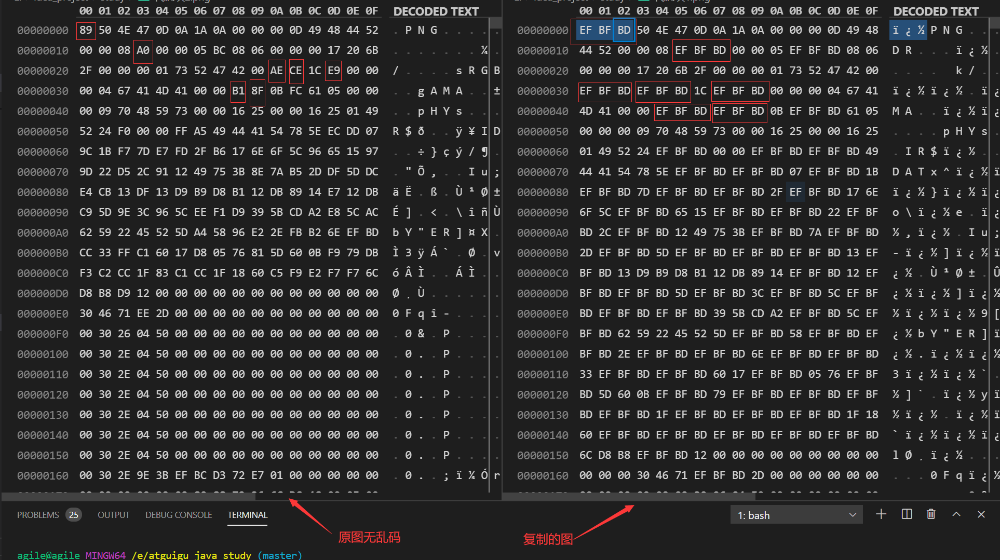

# 第十章 IO流

[TOC]

## 10.1 File类

* java.io.File类：文件和文件目录路径的抽象表示形式，与平台无关
* File能新建、删除、重命名文件和目录，但File不能访问文件内容本身，如果需要访问文件内容本身，需要使用输入/输出流
* **想要在Java程序中表示一个真实存在的文件或目录，那么必须有一个File对象，但是Java程序中的一个File对象，可能没有一个真实存在的文件或目录**
* File对象可以作为参数传递给流的构造器

### File的构造器

1. `public File(String pathname)`:以pathname为路径创建File对象，可以是绝对路径或者相对路径，如果pathname是相对路径，则是相对于当前路径而言
   > 绝对路径：是一个固定的路径，从盘符开始
   > 相对路径，是相对于某个位置开始
2. `public File(String parent,String child)`:以parent为父路径，child为子路径创建File对象
3. `public File(File parent,String child)`:根据一个父File对象和子文件路径创建File对象

### File类的创建功能

1. `public boolean createNewFile()`:创建文件。若文件存在，则不创建，返回false
2. `public boolean mkdir()`:创建文件目录。如果此文件目录存在，就不再创建了，返回false。如果此文件目录的上层目录不存在，也不创建，返回false。
3. `public boolean mkdirs()`:创建文件目录。如果上层文件目录不存在，一并创建
   > 如果创建文件或者文件目录时没有写盘符路径，那么默认在项目路径下

### File类的删除功能

1. public boolean delete():删除文件或者文件夹

> Java的删除不经过回收站
> 要删除一个文件目录，须是该文件目录内不能包含文件或者文件目录

### 路径分隔符

* 路径中的每级目录之间用一个路径分隔符隔开
* 路径分隔符和系统有关：
  1. windows和DOS系统默认使用`\`来表示
  2. UNIX和URL使用`/`来表示
* Java程序支持跨平台运行，因此路径分隔符要慎用
* 为了解决这个隐患，File类提供了一个常量：`public static final String separator`,可以根据操作系统，动态的提供分隔符

### File类的常用方法

1. `public String getAbsolutePath()`:获取绝对路径(无论构造该File对象时用的是相对还是绝对路径)
2. `public String getPath()`:获取路径,绝对路径就返回绝对的，相对路径就返回相对的
3. `public String getName()`：获取文件名称
4. `public String getParent()`:获取上层文件目录路径。若无，返回null。绝对的路径就返回绝对的上层，相对的路径就返回相对的上层(相对的上层没有则返回null)
5. `public long length()`:获取文件长度,即大小(单位：B),目录的长度为0
6. `public long lastModified()`:获取最后一次的修改时间，毫秒值(从1970起的毫秒值)
7. `public String[] list()`:获取指定目录下的所有文件或者文件目录的名称数组。如果对象是文件，而不是目录，则会返回null
8. `public File[] listFiles()`:来获取指定目录下的所有文件或者文件目录的File数组。如果对象是文件，而不是目录，则会返回null

>Java中把一个文件或者文件夹都作为File对象

* File类的重命名功能
  * `public boolean renameTo(File dest)`:把文件重命名为指定的文件路径
  * 此方法可以将一个文件(目录)从一个文件夹移动到另一个文件夹
  * 此方法可以将一个文件(目录)从一个文件夹移动到另一个文件夹，同时给目的文件夹下的文件重命名
  * 此方法可以给一个文件(目录)在本目录下重命名

> 如果这个方法不好用，建议与文件相关的操作使用java.nio.file.Files工具类或者其他外部jar包

```java
File file1=new File("E:/a/hello.txt");
file1.renameTo(new File("E:/b/a.txt"));//将a/hello.txt移动到了b/a.txt,这是移动加重命名，成功的前提是目的文件夹已存在
File file2=new File("E:/a");
file2.renameTo(new File("E:/b/a");//将文件夹a移动到文件夹b下面，
```

### File类的判断功能

1. `public boolean isDirectory()`:判断是否是文件目录
2. `public boolean isFile()`:判断是否是文件
3. `public boolean exists()`:判断是否存在
4. `public boolean canRead()`:判断是否可读
5. `public boolean canWrite()`:判断是否可写
6. `public boolean isHidden()`:判断是否隐藏

## 10.2 IO流原理及流的分类

### Java IO原理

* I/O是Input/Output的缩写，I/O技术是非常实用的技术，用于处理设备之间的数据传输。如读写文件，网络通讯等
* Java程序中，对于数据的输入/输出操作以“流(stream)”的方式进行
* java.io包下提供了各种“流”类和接口，用以获取不同种类的数据，并通过标准的方法输入或输出数据

> 计算机中的输入输出是相对内存来说的，是站在内存的角度来看的
> 输入input:读取外部数据(磁盘、光盘等存储设备的数据)到程序(内存)中
> 输出output:将程序(内存)数据输出到磁盘、光盘等存储设备中

### 流的分类

* 按操作数据单位不同分为：字节流(8bit)、字符流(16bit，不一定，可以按照编码)
* 按照数据流的流向不同分为：输入流、输出流
* 按照流的角色不同分为：节点流、处理流

> 处理流作用在节点流之上

|抽象基类|字节流|字符流|
|:-----:|:-----:|:-----:|
|输入流|InputStream|Reader|
|输出流|OutputStream|Writer|

* Java的IO流共涉及40多个类，实际上非常规则，都是从如下4个抽象基类派生的
* 由这四个类派生出来的子类名称都是以其父类名作为子类名后缀

IO流体系

|分类|字节输入流|字节输出流|字符输入流|字符输出流|
|:-----|:-----|:-----|:-----|:-----|
|抽象基类|InputStream|OutputStream|Reader|Writer|
|访问文件|FileInputStream|FileOutputStream|FileReader|FileWriter|
|访问数组|ByteArrayInputStream|ByteArrayOutputStream|CharArrayReader|CharArrayWriter|
|访问管道|PipeInputStream|PipeOutputStream|PipeReader|PipeWriter|
|访问字符串|||StringReader|StringWriter|
|缓冲流|BufferedInputStream|BufferedOutputStream|BufferedReader|BufferedWriter|
|转换流|||InputStreamReader|OutputStreamWriter|
|对象流|ObjectInputStream|ObjectOutputStream|||
||FilterInputStream|FilterOutputStream|FilterReader|FilterWriter|
|打印流||PrintStream||PrinterWriter|
|推回输入流|PushbackInputStream||PushbackReader||
|特殊流|DataInputStream|DataOutputStream|||

其中：
|抽象基类|节点流(或文件流)|缓冲流(处理流的一种)|
|:----|:----|:----|
|InputStream|FileInputStream|BufferedInputStream|
|OutputStream|FileOutputStream|BufferedOutputStream|
|Reader|FileReader|BufferedReader|
|Writer|FileWriter|BufferedWriter|

## 10.3 节点流(或文件流)

### FileReader与FileWriter

* 这两个字符节点流是用来读取文件中的字符(FileReader)和向文件中写入字符(FileWriter)
* 也就是说这两个流在对数据进行读或者写的单位是字符
* FileWriter的构造器可传入boolean值表示是否追加还是直接覆盖写入

```java
public class FileTest{
    @Test
    public void fileWriterTest() {
        File file = new File("测试.txt");
        FileWriter fileWriter = null;
        try {
            file.createNewFile();//此行可以删除
            fileWriter = new FileWriter(file);//FileWriter会创建file对象里的文件，所以即使文件不存在也会被创建
            fileWriter.write("hello world!");
            fileWriter.write("hello 你好。");//这两次写入不会自动换行，而是紧接着写入数据,想换行可以写入'\n'
        } catch (IOException e) {
            e.printStackTrace();
        } finally {
            try {
                if (fileWriter != null)
                    fileWriter.close();
            } catch (IOException e) {
                e.printStackTrace();
            }
        }
    }

    @Test
    public void fileReaderTest() {
        File file = new File("测试.txt");
        FileReader fileReader = null;
        try {
            file.createNewFile();
            fileReader = new FileReader(file);
            int len;
            char[] chs = new char[5];//为了方便测试和演示异常，设置数组长度为5，一般正常情况长度是1024
            while ((len = fileReader.read(chs)) != -1) {
                //这里读取的字符不一定刚好放满了chs数组
                System.out.print(Arrays.copyOf(chs,len));//hello world!hello 你好。
                //System.out.print(chs);//如果这样写，会输入：hello world!hello 你好。o 你好
            }
        } catch (IOException e) {
            e.printStackTrace();
        } finally {
            try {
                if (fileReader != null)
                    fileReader.close();
            } catch (IOException e) {
                e.printStackTrace();
            }
        }
    }
}
```

* 同时进行读写操作

```java
public class FileTest {
    public static void main(String[] args) {
        File readFromFile = new File("in.txt");
        File writeToFile = new File("out.txt");
        FileReader fileReader = null;
        FileWriter fileWriter = null;
        try {
            readFromFile.createNewFile();
            writeToFile.createNewFile();
            fileReader = new FileReader(readFromFile);
            fileWriter = new FileWriter(writeToFile);
            char[] chs = new char[1024];//一次性多读些字符
            int len;
            while ((len = fileReader.read(chs)) != -1) {
                fileWriter.write(chs,0,len);//一定不能读chs数组的所有元素，因为最后一次可能不会刚刚好读满这个数组
            }
        } catch (IOException e) {
            e.printStackTrace();
        } finally {

            try {
                if (fileWriter != null) {//关闭之前要判断，可能文件本身就不存在，流无法创建
                    fileWriter.close();//写入流要关闭
                }
            } catch (IOException e) {
                e.printStackTrace();
            }
            try {
                if (fileReader != null) {//关闭之前要判断，可能文件本身就不存在，流无法创建
                    fileReader.close();//读入流要关闭
                }
            } catch (IOException e) {
                e.printStackTrace();
            }
        }
    }
}
```

* 在`FileWriter`写入过程中，如果文件不存在，会创建文件；`FileReader`在读文件时，如果文件不存在会报异常
* 如果文件存在，`new FileWriter(file)`或者`new FileWriter(file,false)`会直接覆盖文件；`new FileWriter(file,true)`才是去在原有文件内容后面追加内容
* 文件在本地磁盘上存储的编码格式可能是有多种的，比如UTF-8,或者ANSI(即与系统编码一致)，中文环境是GBK，当开发环境设置了编程的编码统一为UTF-8,而读取的文件保存编码为ANSI，即GBK时，会造成乱码，因为字符的不同编码读取的字节不同。而这两个字符节点流没有提供指定编码的构造器，这种情况，可以借助转换流InputStreamReader和OutputStreamReader,转换流是先让字节流FileInputStream和FileOutputStream对象直接去读写文件，将这两个对象传入InputStreamReader和OutputStreamReader构造器中，此时可以指定编码格式来从字节流中正确地获取字符流

* 如下代码中，`he.txt`文件编码是`GBK`,需要使用字符流读取所有字符，并写入到另一个新文件`he2.txt`中

```java
public class FileTest {
    public static void main(String[] args) {
        File file = new File("he.txt");
        File file1 = new File("he2.txt");
        InputStreamReader inputStreamReader = null;
        OutputStreamWriter outputStreamWriter = null;
        try {
            file1.createNewFile();
            inputStreamReader = new InputStreamReader(new FileInputStream(file), "GBK");

            outputStreamWriter = new OutputStreamWriter(new FileOutputStream(file1), "GBK");
            //这里outputStreamWriter编码也可以是UTF-8，指定何种编码，就按照编码规则写入字符(因为字符最终还是要以二进制流写入文件磁盘中，不同编码的二进制流组成规则不同)，写入的文件不存在乱码问题
            int len;
            char[] chs = new char[1024];
            while ((len = inputStreamReader.read(chs)) != -1) {
                outputStreamWriter.write(chs,0,len);////一定不能读chs数组的所有元素，因为最后一次可能不会刚刚好读满这个数组
            }
        } catch (Exception e) {
            e.printStackTrace();
        } finally {

            try {
                if (outputStreamWriter != null) {
                }
                outputStreamWriter.close();
            } catch (IOException e) {
                e.printStackTrace();
            }
            try {
                if (inputStreamReader != null) {
                }
                inputStreamReader.close();
            } catch (IOException e) {
                e.printStackTrace();
            }
        }
    }
}
```

### 为什么字符流不能读取非文本文件

* 如果像如下代码对非文本文件进行读取和写入新文件的操作：

```java
public class FileTest{
    @Test
    public void read1() {
        File readFromFile = new File("原图.png");
        File writeToFile = new File("复制.png");
        FileReader fileReader = null;
        FileWriter fileWriter=null;
        try {
            fileReader = new FileReader(readFromFile);
            fileWriter=new FileWriter(writeToFile);
            char[] chs = new char[1024];
            int len;
            while ((len = fileReader.read(chs)) != -1) {
                fileWriter.write(chs,0,len);
            }
        } catch (IOException e) {
            e.printStackTrace();
        } finally {

            try {
                if (fileWriter != null) {
                    fileWriter.close();
                }
            } catch (IOException e) {
                e.printStackTrace();
            }
            try {
                if (fileReader != null) {
                    fileReader.close();
                }
            } catch (IOException e) {
                e.printStackTrace();
            }
        }
    }
}
```

执行上面代码后，去文件资源管理器中查看复制后的新图片文件，发现图片无法打开：


然后对比原图和复制的图片，这两个文件的大小，如下：


原因解释如下：

* 不管是文本文件，还是非文本文件，如图片，它们在计算机的硬盘上都是按照二进制流存储
* 当使用InputStream流去读文件时，会去获取文件的二进制流，但是它的子类FileReader在读取了字节流后，还要再将字节流进行编码，为什么它又要进行编码，因为它是FileReader啊！FileReader显示它读取文件内容的形式就是按照字符，那么它怎么去编码呢，这个和IDE的设置相关，设置编码为UTF-8编码文件，也就是说如果字符流去读取文本文件(可能是非文本文件，但是使用FileReader读，它就认为是文本，按照文件来读)，也是采用UTF-8去读文件，编码文件
* 如果此时读取的文件确实是文本文件，那么此时按照UTF-8来读文件，不会出问题，因为如果是按照UTF-8编码保存的文本文件，它在硬盘上保存的二进制流是按照UTF-8的标准去编排组成二进制数据(不同的编码组成二进制流不同，比如GBK是两个字节即16个bit位表示一个字符，而UTF-8是三个字节即18个bit位表示一个字符，而且有编码的其他要求，因为UTF-8是可变长度的)，那么读取的时候也按照UTF-8来读取，这样是没有问题的
* 如果此时读取的文件是非文本文件，那么此时按照UTF-8来读取文件，但是这个文件它在组成二进制数据保存的时候并不是按照这个规则来保存，现在按照UTF-8来读取这个二进制数据会出现不按照UTF-8要求编码的二进制字节，因为UTF-8也不是说把一个字节里的从00000000至11111111所有的bit位排列组合都要用到，此时就会出现无效的码点，无效码点就是说在UTF-8的编码里找不到对应的字符
* 出现无效的码点，没有对应的字符，但是又需要转成字符流，所以会在解码的时候对无效的码点使用`EF BF BD`来替换,也就是说图片文件在经过使用FileReader字符流读取后，其中有一部分二进制数据被修改了，所以再写入到文件就不是源文件了，出现异常
* 如下的图片可以看到，有一部分无法被解码的二进制串被替换成了`EF BF BD`


  >为什么还是有很多二进制串是相似的呢？
  因为UTF-8编码能够表示的字符很多(俗称万国码)，也就是说需要很多二进制串来表示其编码，所以这个图片文件的二进制流中有很多二进制串可以在UTF-8中找到匹配的编码字符。但遇到没有匹配的二进制串，即无效的码点，则会被EF BF BD来替换掉

### FileInputStream与FileOutputStream

* 字节流FileInputStream与FileOutputStream是在字节层面对文件进行读取和写入，但是不关心文件内容
* 如果获取字节流后需要继续获取文件内容(文本文件)，可以使用转换流包装字节流
* FileOutputStream的构造器可传入boolean值表示是否追加还是直接覆盖写入

```java
public class FileTest{
    @Test
    public void read() {
        File readFromFile = new File("原图.png");
        File writeToFile = new File("复制.png");
        FileInputStream fis = null;
        FileOutputStream fos=null;
        try {
            fis = new FileInputStream(readFromFile);
            fos=new FileOutputStream(writeToFile);
            byte[] chs = new byte[1024];
            int len;
            while ((len = fis.read(chs)) != -1) {
                    fos.write(chs,0,len);
            }
        } catch (IOException e) {
            e.printStackTrace();
        } finally {
            try {
                if (fos != null) {
                    fos.close();
                }
            } catch (IOException e) {
                e.printStackTrace();
            }
            try {
                if (fis != null) {
                    fis.close();
                }
            } catch (IOException e) {
                e.printStackTrace();
            }
        }
    }
}
```

## 10.4 缓冲流

* 缓冲流实现高效的原因：有一个缓冲的变量，8KB大小

* 字符缓冲流

```java
public class FileTest{
    @Test
    public void method() {
        File readFromFile = new File("in.txt");
        File writeToFile = new File("out1.txt");
        BufferedWriter bufferedWriter=null;
        BufferedReader bufferedReader=null;
        FileReader fileReader = null;
        FileWriter fileWriter = null;
        try {
            readFromFile.createNewFile();
            writeToFile.createNewFile();
            fileReader = new FileReader(readFromFile);
            fileWriter = new FileWriter(writeToFile);
            bufferedReader=new BufferedReader(fileReader);
            bufferedWriter=new BufferedWriter(fileWriter);
            char[] chs = new char[1024];
            int len;
            while ((len = bufferedReader.read(chs)) != -1) {
                bufferedWriter.write(chs,0,len);
            }
        } catch (IOException e) {
            e.printStackTrace();
        } finally {

            try {
                if (bufferedWriter != null) {
                    bufferedWriter.close();//不需要关闭节点流了
                }
            } catch (IOException e) {
                e.printStackTrace();
            }
            try {
                if (bufferedReader != null) {
                    bufferedReader.close();//不需要关闭节点流了
                }
            } catch (IOException e) {
                e.printStackTrace();
            }
        }
    }
}
```

* 字节缓冲流

```java
public class FileTest{
    @Test
    public void method(){
        File readFromFile = new File("原图.png");
        File writeToFile = new File("复制1.png");
        FileInputStream fis = null;
        FileOutputStream fos=null;
        BufferedInputStream bufferedInputStream=null;
        BufferedOutputStream bufferedOutputStream=null;
        try {
            fis = new FileInputStream(readFromFile);
            fos=new FileOutputStream(writeToFile);
            bufferedInputStream=new BufferedInputStream(fis);
            bufferedOutputStream=new BufferedOutputStream(fos);
            byte[] chs = new byte[1024];
            int len;
            while ((len = bufferedInputStream.read(chs)) != -1) {
                bufferedOutputStream.write(chs,0,len);
            }
        } catch (IOException e) {
            e.printStackTrace();
        } finally {
            try {
                if (bufferedOutputStream != null) {
                    bufferedOutputStream.close();
                }
            } catch (IOException e) {
                e.printStackTrace();
            }
            try {
                if (bufferedInputStream != null) {
                    bufferedInputStream.close();
                }
            } catch (IOException e) {
                e.printStackTrace();
            }
        }
    }
}
```

## 10.5 转换流

* Java API提供了两个转换流：
  1. InputStreamReader:将InputStream转换为Reader
  2. OutputStreamWriter:将Writer转换为OutputStream

* 作用：提供字节流与字符流之间的转换

* 字节流中的数据都是字符时，转成字符流操作更高效

* 使用转换流来处理文件乱码问题：实现编码和解码的功能


* 解码：字节、字节数组----> 字符数组、字符串
* 编码：字符数组、字符串---> 字节、字节数组

> 转换流的使用和示例代码在上面已有介绍

## 10.6 标准输入、输出流

## 10.7 打印流

* 实现将基本数据类型的数据格式转化为字符串输出

* 打印流：PrintStream和PrintWriter
  1. 提供了一系列重载的print()和println()方法，用于多种数据类型的输出
  2. PrintStream和PrintWriter的输出不会抛出IOException异常
  3. PrintStream和PrintWriter有自动flush功能
  4. PrintStream打印的所有字符都使用平台的默认字符编码转换为字节。在需要写入字符而不是写入字节的情况下，应该使用PrintWriter类
  5. System.out返回的是PrintStream的实例

* 打印流默认是向控制台输出，也可以改写PrintStream,让输出的终点不是控制台，而是其他写入的流，可以在实例化PrintStream对象时在构造器中传入OutputStream对象，如下示例将输出写入到一个文件中

```java
public class FileTest{
    @Test
    public void printTest() {
        File file = new File("print.txt");
        FileOutputStream fos = null;
        PrintStream printStream = null;
        try {
            file.createNewFile();
            fos = new FileOutputStream(file);
            printStream = new PrintStream(fos, true);
            System.setOut(printStream);//把ASCII码表的字符全部写入到print.txt文件中

            for (int i = 0; i < 256; i++)
                System.out.print((char) i);
        } catch (IOException e) {
            e.printStackTrace();
        } finally {
            if (printStream != null)
                printStream.close();//1.打印流关闭操作不需要被try-catch。2.不用关闭fos
        }
    }
}
```

## 10.8 数据流

* 写入数据流(DataOutputStream)可以向文件写入一些不同或者相同数据类型的数据,读入数据流(DataInputStream)可以从文件中读出一些不同或者相同数据类型的数据
* 数据流可以向文件中写入一些基本数据类型的值，放入文件中。但是读取也需要使用数据流才可正确的取到写入的值
* 写入和读取的顺序要保持一致，否则报异常

```java
public class IOTest{
    @Test
    public void dataStreamTest() {
        DataInputStream dis = null;
        DataOutputStream dos = null;
        FileInputStream fis = null;
        FileOutputStream fos = null;
        File file = new File("data.dat");//这个文件不是用来打开查看的，写入和读取都要使用数据流对象
        try {
            file.createNewFile();
            fis = new FileInputStream(file);
            fos = new FileOutputStream(file);
            dis = new DataInputStream(fis);
            dos = new DataOutputStream(fos);

            dos.writeUTF("你好hello!。");
            dos.writeDouble(1.1);
            dos.writeBoolean(false);
            System.out.println(dis.readUTF());//你好hello!。
            System.out.println(dis.readDouble());//1.1
            System.out.println(dis.readBoolean());//false
        } catch (IOException e) {
            e.printStackTrace();
        } finally {
            try {
                if (dis != null) {
                    dis.close();
                }
            } catch (IOException e) {
                e.printStackTrace();
            }
            try {
                if (dos != null) {
                    dos.close();
                }
            } catch (IOException e) {
                e.printStackTrace();
            }
        }
    }
}
```

## 10.9 对象流

### ObjectInputStream和ObjectOutputStream

* 对象流用于存储和读取基本数据类型数据或对象的处理流，它的强大之处就是可以把Java中的对象写入到数据源中，也能把对象从数据源中还原回来
* 序列话：用ObjectOutputStream类报错基本数据类型数据或对象的机制
* 反序列化：用ObjectInputStream类读取基本数据类型数据或对象的机制
* ObjectOutputStream和ObjectInputStream不能序列化static和transient修饰的成员变量

* 对象的序列化机制
  1. 对象序列化机制允许把内存中的Java对象转换成平台无关的二进制流，从而允许把这种二进制流持久地保存在磁盘上，或通过网络将这种二进制流输入到另一个网路节点。当其它程序获取了这种二进制流，就可以恢复成原来的Java对象
  2. 序列化的好处在于可将任何实现了Serializable接口的对象转化为字节数据，使其在保存和传输时可被还原
  3. 序列化是RMI(远程方法调用)过程的参数和返回值都必须实现的机制，而RMI是JavaEE的基础。因此序列化机制是JavaEE平台的基础
  4. 如果需要让某个对象支持序列化机制，则必须让对象所属的类及其属性是可序列化的，为了让某个类是可序列化的，该类必须实现Serializable、Externalizable两个接口之一。否则，会抛出NoSerializableException

### 对象流序列化和反序列化

* String类型的对象进行序列化和反序列化

```java
public class IOTest{
    @Test
    public void SerializedTest() {
        File file = new File("存入序列化数据.dat");
        ObjectOutputStream oos = null;
        ObjectInputStream ois = null;
        try {
            file.createNewFile();
            oos = new ObjectOutputStream(new FileOutputStream(file));
            ois = new ObjectInputStream(new FileInputStream(file));
            String str = new String("你好hello!。");
            oos.writeObject(str);
            String str2 = (String) ois.readObject();
            System.out.println(str2);//你好hello!。
        } catch (Exception e) {
            e.printStackTrace();
        } finally {
            try {
                if (ois != null)
                    ois.close();
            } catch (IOException e) {
                e.printStackTrace();
            }
            try {
                if (oos != null)
                    oos.close();
            } catch (IOException e) {
                e.printStackTrace();
            }
        }
    }
}
```

* 自定义类型类的对象进行序列化和反序列化

1. 自定义类的对象需要满足如下要求，方可序列化：
   * 需要实现接口：`Serializable`
   * 当前类提供一个全局常量：`public static final long serialVersionUID`
   * 必须保证其内部所有属性是可序列化的（默认情况下，基本数据类型的成员可序列化）

2. 对象序列化的serialVersionUID用来表明类的不同版本，其目的是以序列化对象进行版本控制，有关各版本反序列化时是否兼容
3. 如果一个类没有显式定义这个静态变量，它的值是Java运行时环境根据类的内部细节自动生成的。若类的示例变量做了修改，serialVersionUID可能发生变化
4. 在进行反序列化时，JVM会把传来的字节流中的serialVersionUID与本地相应实体类的serialVersionUID进行比较，如果相同就认为是一致的，可以进行反序列化，否则就会出现序列化版本不一致的异常InvalidCastException

```java
public class IOTest{
    @Test
    public void SerializedTest1() {
        File file = new File("存入序列化数据.dat");
        ObjectOutputStream oos = null;
        ObjectInputStream ois = null;
        try {
            file.createNewFile();
            oos = new ObjectOutputStream(new FileOutputStream(file));
            ois = new ObjectInputStream(new FileInputStream(file));
            String str = new String("你好hello!。");
            oos.writeObject(str);
            oos.writeObject(new Person("Tom",20,'男'));

            String str2 = (String) ois.readObject();
            System.out.println(str2);//你好hello!。
            Person p=(Person)ois.readObject();
            System.out.println(p);
        } catch (Exception e) {
            e.printStackTrace();
        } finally {
            try {
                if (ois != null)
                    ois.close();
            } catch (IOException e) {
                e.printStackTrace();
            }
            try {
                if (oos != null)
                    oos.close();
            } catch (IOException e) {
                e.printStackTrace();
            }
        }
    }
}

class Person implements Serializable{
    private String name;
    private int age;
    private char gender;

    public static final long serialVersionUID = 435235235235L;

    public Person() {
    }

    public Person(String name, int age, char gender) {
        this.name = name;
        this.age = age;
        this.gender = gender;
    }

    public String getName() {
        return name;
    }

    public void setName(String name) {
        this.name = name;
    }

    public int getAge() {
        return age;
    }

    public void setAge(int age) {
        this.age = age;
    }

    public char getGender() {
        return gender;
    }

    public void setGender(char gender) {
        this.gender = gender;
    }

    @Override
    public String toString() {
        return "Person{" +
                "name='" + name + '\'' +
                ", age=" + age +
                ", gender=" + gender +
                '}';
    }
}
```

## 10.10 RandomAccessFile类

* 也称随机存取文件流
* RandomAccessFile直接继承于java.lang.Object类，实现了DataInput和DataOutput接口
* RandomAccessFile既可以作为一个输入流，又可以作为衣蛾输出流
* 如果RandomAccessFile作为输出流，写出到的文件如果不存在，则在执行过程中自动创建；如果写出到的文件存在，则会对原有文件内容进行覆盖(默认情况下，从头覆盖)
* 可以通过相关的操作，实现RandomAccessFile“插入”数据的效果

* RandomAccessFile类支持“随机访问”的方式，程序可以直接跳到文件的任意地方来读写文件
  1. 支持只访问文件的部分内容
  2. 可以向已存在的文件后追加内容
* RandomAccessFile对象包含一个记录指针，用以标示当前读写处的位置
* RandomAccessFile类对象可以自由移动记录指针：
  1. `long getFilePointer()`:获取文件记录指针的当前位置
  2. `void seek(long pos)`:将文件记录指针定位到pos位置

* 构造器
  1. `public RandomAccessFile(File file,String mode)`
  2. `public RandomAccessFile(String name,String mode)`

* 创建RandomAccessFile类实例需要指定一个mode参数，该参数指定RandomAccessFile的访问模式：
  1. `r`:以只读方式打开
  2. `rw`:打开以便读取和写入
  3. `rwd`:打开以便读取和写入；同步文件内容的更新
  4. `rws`:打开以便读取和写入；同步文件内容和元数据的更新

* 如果模式为只读r,则不会创建文件，而是去读取一个已经存在的文件，如果读取的文件不存在则会出现异常。如果模式为rw读写，如果文件不存在则会去创建文件，如果存在则不会创建

```java
public class IOTest{
    @Test
    public void accessTest() {
        File file = new File("access.txt");
        RandomAccessFile raf = null;
        try {
            raf = new RandomAccessFile(file, "rw");
            raf.write("abcdefghijklmn".getBytes());//向文件中写入字符串abcdefghijklmn

            //下列代码将会在文本文件中第3个字符开始插入xyz
            //思路，先让指针指向第三个字符位置，然后将所有的后续字符暂存读到变量中；然后指针回到第三个字符位置，写入插入的字符串，然后再将暂存的字符串在后面补上
            raf.seek(3);
            StringBuilder sb=new StringBuilder((int)(file.length()));
            int len;
            byte[] chs=new byte[1024];
            while((len=raf.read(chs))!=-1){
                sb.append(new String(chs,0,len));
            }
            raf.seek(3);
            raf.write("xyz".getBytes());
            raf.write(sb.toString().getBytes());
        } catch (IOException e) {
            e.printStackTrace();
        } finally {
            try {
                if (raf != null)
                    raf.close();
            } catch (IOException e) {
                e.printStackTrace();
            }
        }
    }
}
```

* 随机存取文件流的其他作用
  可以使用RandomAccessFile类来实现一个多线程断点下载的功能，下载前都会建立两个临时文件，一个是与被下载文件大小相同的空文件，另一个是记录文件指针的位置文件，每次暂停的时候，都会保存上一次的指针，然后断点下载的时候，会继续从上一次的地方下载，从而实现断点下载或上传的功能

## NIO

//todo:1.类的常用方法；2.输入输出NIO
//todo:三方框架commons.io框架的使用

## 新特性

* JDK7.0之后推出了NIO，支持面向缓冲区的(IO是面向流的)，它是基于通道的IO操作，提供了更加便利的操作IO的类和方法，比如`java.nio.file.Path`,`java.nio.file.Paths`,`java.nio.file.Files`
* Java API中提供了两套NIO，一套是针对标准输入输出NIO，另一套就是网路编程NIO