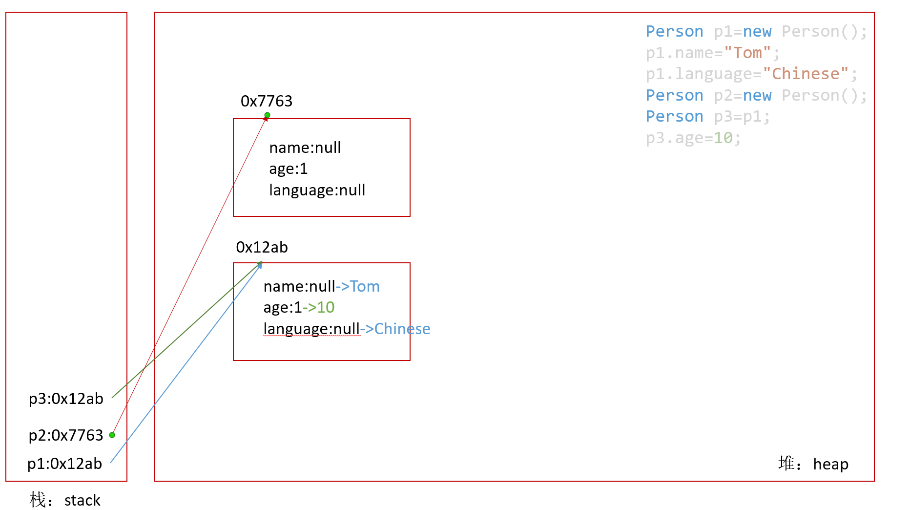
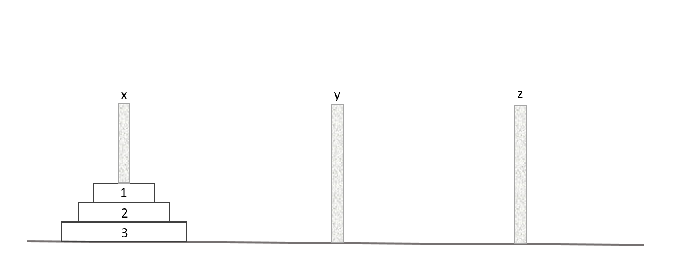
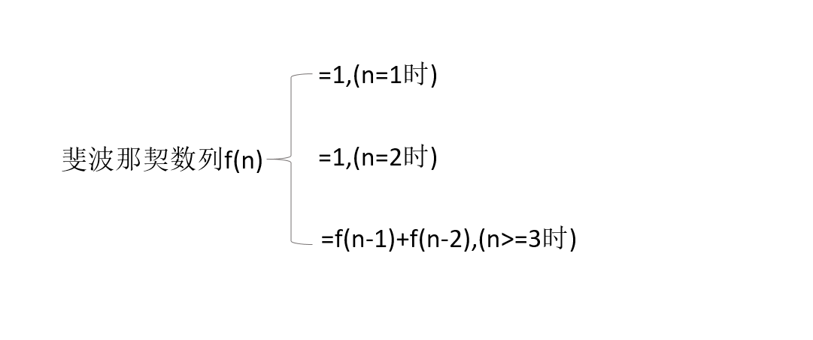
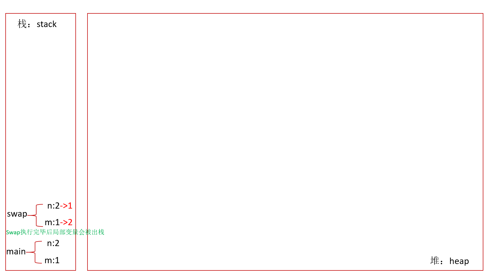
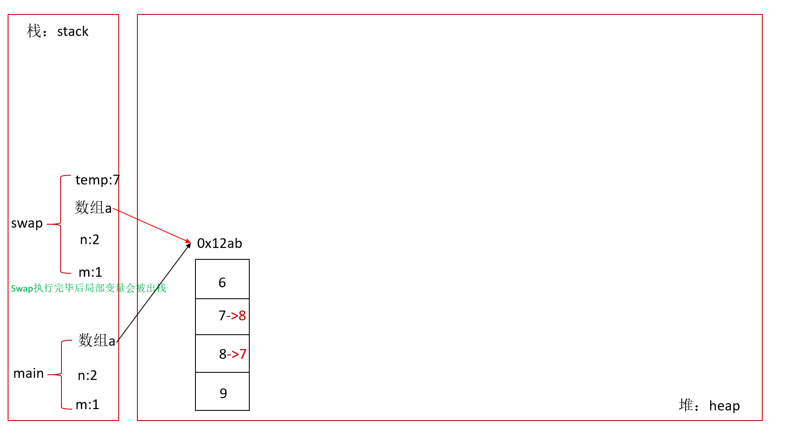
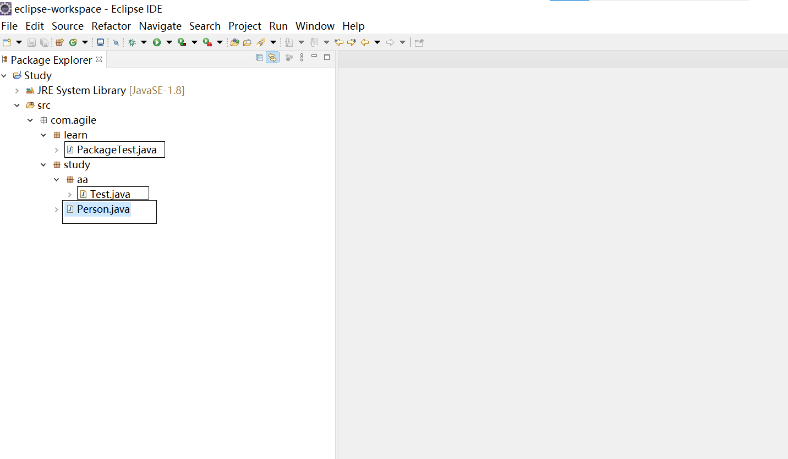

# 第四章 Java面向对象编程

[TOC]

## 4.1 认识面向对象

* 面向过程(POP)和面向对象(OOP)的区别
  1. 面向过程(Procedure Oriented Programming)，强调的是功能行为，以函数为最小的单位，考虑怎么做。
  2. 面向对象(Object Oriented Programming)，将功能封装进对象，强调具备了功能的对象，以类/对象为最小单位，考虑谁来做

  > 思考“人把大象装进冰箱”
    1.面向过程，强调的是功能行为，以函数为最小单位，考虑怎么做
        ①把冰箱门打开
        ②抬起大象，塞进冰箱
        ③把冰箱门关闭
    2.面向对象，强调具备了功能的对象，以类/对象为最小单位，考虑谁来做,可以如下考虑

```java
    人{
        打开(冰箱){
            冰箱.开门();
        }

        抬起(大象){
            大象.进入(冰箱);
        }

        关闭(冰箱){
            冰箱.闭合();
        }
    }

    冰箱{
        开门(){

        }

        闭合(){

        }
    }

    大象{
        进入(冰箱){

        }
    }
```

> 可以比喻一个公司在做一件事情，当参与的人并不多时，几个人凑一起解决即可，也不需要特别细致的安排和规划，或者任务分担。但是当事情特别庞大，参与的人达到几百上千，如果不进行安排和划分职责，想必事情进行的一定会比较混乱，效率也低，出问题了也不好追溯问责。
> 同样的，在计算机中，如果需要处理一个事务，当事情并不复杂时，面向过程编程即可，无需面向对象的思维，几个步骤就处理完毕了，但是假如是一个错综复杂，纷繁交错的事务，如果不进行细致的划分，是很难维护代码的，面向对象编程，可以更加清晰明确到底谁解决这个步骤

* 面向对象更符合人类在日常你的思维逻辑中采用的思想方法和原则，如：抽象、分类、继承、聚合、多态等

* 面向对象的两个要素：
  1. 类：对一类事物的描述，是抽象的、概念上的定义
  2. 对象：是实际存在的该类事物的每个个体，因而也称为实例(instance)

* 拿人来说，可以理解为：类=抽象概念的人；对象=实实在在的某个人

* 面向对象程序设计的重点是**类的设计**

* 类的设计，其实就是类的**成员**的设计

* 面向对象的三大特征(后面会针对这些特征一一说明)：

  1. 封装(Encapsulation)
  2. 继承(Inheritance)
  3. 多态(Polymorphism)

## 4.2 类的属性和方法

### 4.2.1 Java类及类的成员

* 属性：对应类中的成员变量
* 行为：对应类中的成员方法

* Field=属性=成员变量，Method=(成员)方法=函数

* 创建类的对象=类的实例化=实例化类
* 类及类的成员：属性、方法、构造器、代码块、内部类

### 4.2.2 类和对象的使用

1. 创建类,设计类的成员
2. 创建类的对象
3. 通过`对象.属性`或者`对象.方法()`调用对象的结构

```java
class Person {

    public String name;

    public int age=1;

    public String language;

    public void eat(){
        System.out.println("正在吃饭...");
    }

    public void sleep(){
        System.out.println("正在睡觉...");
    }

    public void speak(){
        System.out.println("会讲的语言是:"+this.language);
    }

    public void hello(){
        System.out.println("hello");
    }
}

public class PersonTest {
    public static void main(String[] args){
        Person person1=new Person();
        person1.name="Tom";
        person1.age=20;
        person1.language="Chinese";
        System.out.println("姓名:"+person1.name+"；年龄:"+person1.age+"；语言:"+person1.language);
        person1.eat();
        person1.sleep();
        person1.speak();
    }
}

```

* 如果创建了一个类的多个对象，则每个对象都独立的拥有一套类的属性。(非static的)
  表明当修改一个类的对象的属性值时，另一个该类的对象的同名属性，其值并不会受影响

```java
public class PersonTest {
    public static void main(String[] args){
        Person person1=new Person();
        person1.name="Tom";
        person1.age=20;
        person1.language="Chinese";
        System.out.println("姓名:"+person1.name+"；年龄:"+person1.age+"；语言:"+person1.language);
        person1.eat();
        person1.sleep();
        person1.speak();

        Person person2=new Person();
        System.out.println("person2.name:"+person2.name);//person2.name:null   说明：未赋值状态，初始化为null；person2与person1互不影响，在堆中不是同一个地址

        Person person3=person1;
        System.out.println("person3.name:"+person3.name);//person3.name:Tom
        /**
         * 因为person1,person3都是引用数据类型Person的实例化对象，栈中这两个变量都记录了指向的地址空间，
         * 也就是说person1指向的是地址空间,当把person1赋值给person3时，也就是说person3也指向了同一个地址空间，
         * 所以person1和person3的属性值是相同的，且修改其中一个，另一个也会受影响
         */


        person1.name="Jack";
        System.out.println("person3.name:"+person3.name);//person3.name:Jack
    }
}
```

* static修饰的变量为静态变量或者类变量，它的值是该类所有的实例对象共享的，值存储到方法区

* static 修饰的变量如果在类中没有初始化，随后在一个实例化对象A中进行了初始化赋值，那么这个类的其他实例化对象的该static属性的值也和对象A中的该属性的值相同，也就是说一个对象改变了static属性的值，那么其他对象的该属性值也会被改变

```java
public static String order="desc";

//使用该变量，不需要实例化，直接:类.静态变量
```

## 4.3 对象的内存解析

Java中的JVM虚拟机在执行Java程序过程中会把它所管理的内存划分为若干个不同的数据区域。各区域都有各自的用途，以及创建和销毁的时间，有的区域随着虚拟机进程的启动而存在，有些区域则是用来用户线程的启动和结束而建立和销毁。Java虚拟机所管理的内存将会包括以下几个运行区域：


这里只介绍里面其中的几个区域和简要用途：

1. **堆(Heap)**,此内存区域的唯一目的就是**存放对象实例**，几乎所有的对象实例都在这里分配的内存。Java虚拟机的规范中描述是：所有的对象实例以及数组都要在堆上分配(含成员变量)
2. **栈(Stack)**，是指虚拟机栈，用于存储局部变量等。局部变量表存放了编译期可知长度的各种基本数据类型(boolean、byte、char、short、int、float、long、double)、对象引用(reference类型，它不等同于对象本身，存的是对象在堆内存的首地址)。方法执行完毕后，自动释放
3. **方法区(Method Area)**,用于存储已被虚拟机加载的**类信息、常量、静态变量、即时编译器编译后的代码**等

```java
Person p1=new Person();
p1.name="Tom";
p1.language="Chinese";
Person p2=new Person();
Person p3=p1;
p3.age=10;
```

以上代码运行时各变量在内存中开辟的空间图解如下：



## 4.4 属性与局部变量

* 相同点：
  1. 定义变量的格式：数据类型 变量名 = 变量值;
  2. 先声明，后使用
  3. 变量都有其对应的作用域

* 不同点：
  1. 在类中声明的位置的不同
     * 属性：直接定义在类的一对`{}`内
     * 局部变量：声明在方法内、方法形参、代码块内、构造器形参、构造器内部的变量
  2. 关于权限修饰符的不同
     * 属性：可以在声明属性时，指明其权限，使用权限修饰符，常用权限修饰符(作用于类的封装)：`private`,`public`,`缺省default(不写)`,`protected`
     * 局部变量：不可以使用权限修饰符
  3. 默认初始化值的情况：
     * 属性：类的属性，根据其类型，都有默认初始化值
        * 整型(byte,short,int,long)：`0`
        * 浮点型(float,double)：`0.0`
        * 字符型(char)：`'\0'`或`'\u0000'`
        * 布尔型(boolean)：`false`
        * 引用数据类型(类，数组，接口)：`null`
     * 局部变量：没有默认初始化值
     说明，在调用局部变量之前，一定要显式赋值（方法形参在方法被调用时就传参赋值了）
  4. 在内存中加载的位置：
     * 属性：加载到堆空间中(非static的属性)
     * 局部变量：加载到栈空间

## 4.5 类的方法

* 方法：描述类应该具有的功能
* 比如：Match类中的random();Arrays类的sort(),binarySearch()...

* 举例

```java
public void eat(){}
public void sleep(int hour){}
public String getName(){}
public String getNation(String nation){}
```

* 方法声明的格式

```java
权限修饰符 (特殊修饰符) 返回值类型 方法名(形参列表){
    方法体
}
```

> 特殊修饰符static,final,abstract来修饰的方法，暂时不讨论，等有开始了解到这块知识再说明

* 说明：
   1. 权限修饰符：private,public,缺省default(不写),protected--->在封装特性的体现时会用到
   2. 返回值的类型：有返回值 or 没有返回值
      如果有返回值，则必须在方法声明时，指定返回值的类型。同时，方法中也需要使用rentun关键字来返回指定类型的变量或常量: `return 数据`
      如果方法没有返回值，则方法声明时，使用`void`来表示。通常，没有返回值的方法中，不需要使用`return`,但是使用的话，只能`return;`来表示结束此方法
   3. 方法名：属于标识符，遵循标识符的命名规则和规范
   4. 形参列表：方法可以有0个，1个，或者多个形参
      格式：`数据类型1 形参1,数据类型2 形参2,...`

* return关键字的使用
  1. 使用范围：使用在方法体中
  2. 作用：①结束方法；②针对有返回值类型的方法，使用`return 数据`的方式返回所要的数据
  3. 注意点：return关键字后面不可以声明执行语句

* 方法的使用注意：
  1. 方法中可以调用当前类的属性和其他方法
  2. 特殊的：方法A中又调用了方法A：递归方法
  3. 方法中不能定义方法
  4. 类的静态方法中不能直接使用类的其他非静态方法
  5. 类的静态方法中能直接使用类的其他静态方法
  6. 类的非静态方法中能直接调用类的其他静态方法

## 4.6 对象数组

```java
Person[] persons=new Person[5];//这里只是在栈里申请了一个变量，变量指向了5个内存空间在堆中的首地址，但是这五个地址空间里全部是null
persons[0]=new Person();//数组的第一个空间指向了一个对象在内存的首地址
persons[0].name="Jack";
persons[0].age=16;
```

* 引用类型的变量，只可能存储两个值：null或地址值(含变量的类型)

* 对象数组的内存解析,如下图：


## 4.7 匿名对象

* 理解：创建对象，即实例化一个类时，没有显式的赋给一个变量名，即为匿名对象
* 特征：匿名对象只能调用一次
* 使用，如下代码：

  ```java


  public class Company{
      public static void main(String[] args){
          new Person().hello();//这里匿名对象就只能用一次
          new Person().age=18;//这里匿名对象就只能用一次
          getPerson(new Person());//一般可以将匿名对象整个作为参数传给一个方法，然后在方法里面就可以调用这个匿名对象的各自属性和方法
      }

      public static void getPerson(Person person){
          person.age=20;
          person.language="Chinese";
          person.hello();
          person.speak();
      }
  }
  ```

## 4.8 再谈方法

### 4.8.1 方法的重载

* 方法重载(overload)定义：在同一个类中，允许存在一个以上的同名方法，只要它们的参数个数或者参数类型不同即可
  >两同一不同：①同一个类、相同方法名；②参数列表不同：参数个数不同，参数类型不同

  >子类可以重载父类的方法：子类拥有同名方法，但是参数列表不同，算作方法的重载，因为子类继承了父类，也就是相当于拥有了父类的成员方法，现在又定义了同名不同参的方法，自然就是重载

```java

class Arrays{
    //这两个就是方法重载，只要形参不是位置和类型一一对应且完全一致就可以重载
    public static void sort(int a[],int length){}
    public static void sort(int length,int a[]){}
    //以下也是重载
    public static void sort(int a[]){}
    public static void sort(String a[],int length){}

    //以下是错误的
    public static void sort(int b[],int len){}
    public static int[] sort(int a[],int length){}
    public void sort(int a[],int length){}
    protected static void sort(int a[],int length){}
}
```

* 判断是否是重载：
  跟方法的权限修饰符、返回值类型、形参变量名、方法体都没有关系
  > 判断的核心就是，假如该方法被调用的时候根据方法名或者加上参数，不会产生歧义，能够明确是在使用哪个方法

```java
class Arrays{
    public static void showNum(int a,int b){}
    public static void showNum(double a,double b){}
    //如果第一个函数没有被注释掉，调用的时候Arrays.showNum(1,2)会调用第一个函数
    //但是如果第一个函数被注释了，则会自动变量提升参数类型成了double类型，则会调用第二个函数
}
```

* 在通过对象调用方法时，如果确定某一个指定的方法：
  方法名---->参数列表

### 4.8.2 可变个数的形参

* jdk5.0新增的特性
* 格式：`数据类型 ... 变量名`
* 当调用可变个数形参的方法时，传入的参数个数可以是:0个、1个、2个...
* 可变个数形参的方法与本类中的方法名相同、形参不同的方法，会构成方法重载
* 可变个数形参的方法与本类中的方法名相同、形参类型也相同的数组，不会构成方法重载，编译器会认为是同名方法，编译无法通过
  >也就是说，其实可变个数的形参在方法中仍然是当作数组来使用

```java
public static void show(int a,int b){}
public static void show(int a,int ... nums){}//构成重载
public static void show(int ... nums){}


public static void show(int[] nums){}//编译无法通过，会显示已定义了相同的方法，这个不算成方法重载
public static void show(int a,int[] nums){}//编译无法通过，会显示已定义了相同的方法，这个不算成方法重载
```

* 可变个数形参在方法的形参中，必须声明在参数列表的末尾
* 方法的形参列表中只能由一个可变个数的形参

  ```java
  public static void show(int a,int ... nums){}//正确
  public static void show(int ... nums){}//正确
  public static void show(int ... nums,int a){}//错误,可变个数的形参必须在末尾
  public static void show(int ... nums1,int ... nums2){}//错误，可变个数的形参必须在末尾且只能有一个
  ```

* 问题：

```java
class Arrays{
    //public static void sort(int a,int length){}
    public static void sort(int length,int ... a){}
    public static void sort(int ... a){}//但是这两个函数定义的时候可以共存
    public static void main(String[] args){
        Arrays.sort(1,2)//会报错，无法编译，但是取消第一个函数的注释后，就不会报错
        Arrays.sort(new int[]{1,2});//编译通过
        Arrays.sort(1,new int[]{2,3});//编译通过
    }
}
```

### 4.8.3 递归方法

* 递归方法：一个方法体内调用了它本身
* 方法递归包含了一种隐式的循环，它会重复执行某段代码，但这种重复执行无须循环控制
* 递归一定要向已知方向递归，否则这种递归就变成了无穷递归，类似于死循环
* 递归的函数内部，一定要有能够使得函数停下来的条件

* 注意事项：
  * 递归一定要有条件限定，保证递归能够停止下来，否则会发生栈内存溢出。
  * 在递归中虽然有限定条件，但是递归次数不能太多。否则也会发生栈内存溢出。
* 思考：
  > 已知有一个数列，$f(0)=1;f(1)=4;f(n+2)=2*f(n+1)+f(n)$,其中n是自然数,求$f(10)$的值

  ```java
  public static void main(String[] args){
      System.out.println(f(10));
  }
  public static int f(int n){
      if(n==0){
          return 1;
      }else if(n==1){
          return 4;
      }else{
          return 2*f(n-1)+f(n-2);
      }
  }
  ```

* 汉诺塔问题：
  描述：n个圆环从大到小依次叠放串在x柱子上，现在需要从x柱子上将圆环移到z柱子上，可以用y柱子作为辅助。要求：移动过程中，**不管是哪个柱子上，小圆环一定不能在大圆环下面**



```java
public class RecursionTest {
    public static int count = 1;

    public static void main(String[] args) {
        hanoi(5, 'x', 'y', 'z');
    }

    /**
     * 汉诺塔问题：n个圆环从大到小依次叠放串在x柱子上，现在需要从x柱子上将圆环移到z柱子上，可以用y柱子作为辅助。
     * 要求：移动过程中，不管是哪个柱子上，小圆环一定不能在大圆环下面
     *
     * 思路：先把上面n-1个圆环移动到y柱子上 然后移动第n个圆环到z柱子上 最后把y柱子上的n-1个圆环移动到z柱子上
     *
     * @param n              表示需要移动的圆环个数。另外圆环是编号的，排序是按照从上到下，从小到大排的，最上面的圆环编号为1，最下面的圆环编号为n
     * @param origination    表示目前待移动的n个圆环所在的柱子名称
     * @param intermediation 表示移动过程中辅助的柱子名称
     * @param destination    表示目前待移动的n个圆环需要移动到的柱子名称
     */
    public static void hanoi(int n, char origination, char intermediation, char destination) {
        if (n == 1) {
            move(origination, 1, destination);
        } else {
            hanoi(n - 1, origination, destination, intermediation);
            move(origination, n, destination);
            hanoi(n - 1, intermediation, origination, destination);
        }
    }

    /**
     * 汉诺塔问题中，提供移动的函数
     *
     * @param origination  表示需要移动的圆环现在所在的柱子名称
     * @param serialNumber 表示待移动的圆环的编号
     * @param destination  表示圆环需要移动到的柱子名称
     */
    public static void move(char origination, int serialNumber, char destination) {
        System.out.printf("第%d步：将编号为%d的圆环从柱子%c移动到柱子%c\n", count++, serialNumber, origination, destination);
    }
}
```

 >move被执行的次数为$2^n-1$

* 求第n项斐波那契数列
  描述：数列为 1,1,2,3,5,8,13,21,34,55...f(n)=f(n-1)+f(n-2)
  所以可以看出它的通项公式：

代码实现如下：

```java
public class RecursionTest {

    public static void main(String[] args) {
        System.out.println(getFibonacciSequence(10));
    }

    /**
     * 求斐波那契数列的第n项
     * @param n 数列的第n项
     */
    public static int getFibonacciSequence(int n){
        if(n==1||n==2){
            return 1;
        }else if(n>=3){
            return getFibonacciSequence(n-1)+getFibonacciSequence(n-2);
        }else{
            return 0;
        }
    }
}
```

## 4.9 值传递机制

* **Java方法的形参的传递机制：值传递**

* 形参：方法定义时，声明的小括号内的参数
  实参：方法调用时，实际传递给形参的数据

* 值传递机制：
  1. 如果参数是基本数据类型，此时实参赋给形参的是实参真实存储的数据值
  2. 如果参数是引用数据类型，此时实参赋给形参的是实参存储数据的地址值

### 4.9.1 基本数据类型做形参

基本数据类型做形参时，传递实参如下代码的结果：

```java
public static void main(String[] args){
    int m=1;
    int n=2;
    System.out.printf("m=%d;n=%d",m,n);//m=1;n=2
    swap(m,n);
    System.out.printf("m=%d;n=%d",m,n);//m=1;n=2,并没有改变m,n的值
}
public void swap(int m,int n){
    int temp=m;
    m=n;
    n=temp;
}
```

图解如下：


### 4.9.2 引用型数据类型变量做形参

引用型数据类型变量做形参时，传递实参如下代码的结果：

```java
public static void main(String[] args){
    int[] a=new int[]{6,7,8,9};
    int m=1,n=2;
    System.out.printf("a[m]=%d;a[n]=%d",a[m],a[n]);//a[m]=7;a[n]=8
    swap(a,m,n);
    System.out.printf("a[m]=%d;a[n]=%d",a[m],a[n]);//a[m]=8;a[n]=7,数组的值发生了变化
}
public static void swap(int a[],int m,int n){
    int temp=a[m];
    a[m]=a[n];
    a[n]=temp;
}
```

图解如下：


* 引用数据类型包括数组和类(当然也有接口),所以当以类作为形参变量，实例化对象作为实参的时候，传递的也是值，也就是对象在堆中的首地址值，当方法内对实参数据进行了改变，此时该对象的数据真正发生了改变，因为这就是在原本对象的数据上进行的修改，如下代码示例可知：

```java
public ValueTransferTest{
    public static void main(String[] args){
        Number number=new Number();
        number.m=1;
        number.n=2;
        System.out.printf("number.m=%d;number.n=%d",a[m],a[n]);//number.m=1;number.n=2
        swap(number);
        System.out.printf("number.m=%d;number.n=%d",a[m],a[n]);//number.m=2;number.n=1,对象number的成员属性值发生了变化
    }

    public static void swap(Number number){
        int temp=Number.m;
        number.m=number.n;
        number.n=temp;
    }
}
class Number{
    int m;
    int n;
}
```

* 思考题：

  ```java
  public class Test{
      public static void main(String[] args){
          int a=10;
          int b=10;
          method(a,b);//需要在method方法被调用之后，仅打印出a=100,b=200,请写出method方法的代码
          System.out.println("a="+a);
          System.out.println("b="+b);
      }
      //代码编写处
      public static void method(){int a,int b){

      }
  }
  ```

  分析与解答：乍一看，好像是在考察形参传值的知识，其实从这个知识点考虑，无论如何都是无法在method方法中改变main方法中变量a,b的值，只能从其他方法中去思考解决办法：要么在method方法中按照要求输出，然后中止程序的执行；要么就是重写(override)类PrintStream中的println方法，按照要求输出

  ```java
  public static void method(){int a,int b){
      a=a*10;
      b=b*20;
      System.out.println("a="+a);
      System.out.println("b="+b);
      System.exit(0);
  }
  ```

  ```java
  public static void method(){int a,int b){
      PrintStream ps=new PrintStream(System.out){
          @Override
          public void println(String s){
              if("a=10".equals(s)){
                  x="a=100";
              }else if("b=10".equals(s)){
                  s="b=200";
              }
              super.println(s);
          }
      };
      System.setOut(ps);
  }
  ```

* 陷阱

```java
/*
陷阱：在方法中，形参 = 新new对象，那么就和实参无关了
*/
class Test{
    public static void change(MyData my){
        my = new MyData();//形参指向了新对象，变量指向堆中的地址已不再是之前的地址
        my.num *= 2;
    }

    public static void main(String[] args){
        MyData m = new MyData();
        m.num = 1;

        change(m);//调用完之后，m对象的num属性值仍然为1
    }
}

class MyData{
    int num;
}
```

* String类型的特殊性

```java
public class StringTest {
    public static void main(String[] args){
        String str="Hello";
        changeStr(str);
        System.out.println(str);//输出：Hello
    }

    public static void changeStr(String str){
        str="hi";
    }
}
```

根据上面的知识点，引用数据类型的变量存的是地址值，那么传参时应该会改变地址空间里的值，这里是特殊情况，字符串常量放在了常量池中，当形参赋值新值时，会指向另一个常量池中的地址，所以main方法中的字符串变量的地址指向没有改变，不受影响。

## 4.10 封装

* 封装的由来
  当我们创建一个类的对象以后，我们可以通过`对象.属性`的方式，对对象的属性进行赋值，赋值操作只受到了数据类型和数据范围的限制，除此之外，没有其他制约条件。但是，在实际问题中，我们往往需要给属性赋值时加入额外的限制条件。这个条件就能在属性声明时体现，我们只能通过方法进行限制条件的添加(set方法),同时需要避免用户再使用`对象.属性`方式对属性进行赋值，可以通过在属性上添加权限修饰符private

* 封装性的体现（之一）
  将类的属性私有化(private)，然后提供公共方法(public)来获取(getXxx)和设置(setXxx)属性
  > 拓展：封装性的其他体现：1.不对外暴露的私有方法；2.单例模式；...

* 封装性的思想：把该隐藏的隐藏，该暴露的暴露出来

* 封装性的体现，需要权限修饰符来配合：
  1. java规定的4钟权限(从小到大)：private、缺省(default)、protected、public
  2. 4种权限可以用来修饰类以及类的内部结构：属性、方法、构造器、内部类
  3. 具体的，4种权限都可以修饰类的内部结构：属性、方法、构造器、内部类
     修饰类的只能是：缺省、public
* 权限修饰符的权限范围表
  |修饰符|类内部|同一个包|不同包的子类|同一个工程|
  |:-----:|:-----:|:-----:|:-----:|:-----:|
  |private|Yes||||
  |(缺省)|Yes|Yes|||
  |protected|Yes|Yes|Yes||
  |public|Yes|Yes|Yes|Yes|

## 4.11 构造器

* 构造器的特征：
  * 它具有与类相同的名称
  * 它不声明返回值的类型。(与声明为void不同)
  * 不能被static,final,synchronized,abstract,native修饰，不能又return语句返回值
* 构造器(构造方法、constructor)的使用
  * 创建对象,同时可能会有给对象进行初始化(对象的成员属性)
* 说明：
  * 如果没有显式的定义类的构造器，则系统默认提供一个空参的构造器
  * 定义构造器的格式：`权限修饰符 类名(形参列表){}`
  * 一个类中定义多个构造器，相互构成重载
  * 一旦显式定义了类的构造器之后，系统就不再提供默认的空参构造器
  * 一个类中，至少会有一个构造器
  * 多个构造器可以互相调用，但是调用必须在另一个构造器方法的第一行；另外，构造器不能在成员方法中被调用

```java
class Person{
    private String name;
    private int age;

    public Person(){

    }
    public Person(String name,int age) {
        this();
        this.age=age;
        this.name=name;
        this();//此处错误，调用其他构造器必须在本构造器内的第一行
    }
    public String getName(){
        this();//此处错误,成员方法无法调用构造器
        return name;
    }
    public void setName(String name){
        this.name=name;
    }
    public int getAge(){
        return age;
    }
    public void setAge(int age){
        this.age=age;
    }
}
```

* 属性赋值的先后顺序
  ①默认初始化
  ②显式初始化
  ③构造器中赋值
  ④通过`对象.属性`或`对象.setXxx`赋值
  操作的先后顺序：①->②->③>④

## 4.12 JavaBean

* JavaBean是一种Java语言写成的可重用组件
* JavaBean是指符合如下标准的Java类：
  * 类是公共的
  * 有一个无参的公共的构造器(因为往往使用这个JavaBean的方式是用反射，常调用无参构造器)
  * 有属性，且有对应的set、get方法

## 4.13 this的使用

```java
class Person{
    private String name;
    private int age;

    public Person(){

    }
    public String getName(){
        return name;
    }
    public void setName(String name){
        this.name=name;
    }
    public int getAge(){
        return age;
    }
    public void setAge(int age){
        this.age=age;
    }
}
```

* this关键字的使用：
  * this可以用来修饰：属性、方法、构造器
  * this修饰属性和方法，this理解为当前对象
* 在类的方法中，我们可以使用`this.属性`或`this.方法`的方式，调用当前对象属性或方法，但是通常情况下，我们都选择省略this。特殊情况下，如果方法的形参和类的属性同名时，就必须显式使用`this.变量`的方式,表明此变量是属性，而非形参
* 在类的构造器中，同样的，调用当前正在创建的对象属性或者方法，我们可以省略this，但是如果构造器的形参与属性名相同，此时必须显式使用`this.变量`的方式，表明此变量是属性，而非形参
* this调用构造器
  * 在类的构造器中，可以显式使用`this(参数列表)`方式，调用本类中指定的其他构造器
  * 构造器中不能通过`this(参数列表)`方式调用自己
  * 如果一个类中有n个构造器，则最多有n-1个构造器中使用了`this(参数列表)`,也就是说不能构造器之间互相调用，形成了死循环
  * 规定：`this(参数列表)`必须写在当前构造器的首行
  * 构造器内部，最多只能调用一个其他的构造器

## 4.13 import与package

### package

* 为了更好的实现项目中类的管理，提供包的概念
* 使用package声明类或接口所属的包，声明在源文件的首行
* 包名，属于标识符，遵循标识符的命名规则、规范(xxx.yyy.zzz)
* 每`.`一次，就代表一层文件目录。
* 同一个包下，不能命名同名的接口、类。
* 不同的包下，可以命名同名的接口、类。
* 当类有了包名后，使用这个类需要带全名称，即`包名.类名`

### import

* 在源文件中显式的使用import结构导入指定包下的类、接口
* 声明位置在包的声明和类的声明之间
* 如果需要导入多个结构，则并列写出即可
* 可以使用`xxx.*`的方式，表示可以导入xxx包下的所有结构
* 如果使用的类或者接口是java.lang包下定义的，则可以省略import
* 如果使用的类或接口是本包下定义的，则可以省略import结构
* `xxx.*`只是导入xxx包当前文件夹下的所有结构，但是如果想使用的是xxx包下的子包，那么需要再导入子包，
  >所谓的同一个包，就是指包名一致，完全一致，而不是说包之间是父子关系

* `import static`：导入指定类或接口中的静态结构：属性或方法

  ```java
  import static java.lang.Math.*;
      public class Test {
      public static void main(String[] args) {
          double pi=PI;//import static已经把Math里所有的成员方法或者属性都导入进来了
      }
  }
  ```


从图上所示，上面的三个类`PackageTest`,`Test`,`Person`之间是无法在各自的类中去使用其他类的，必须要使用import导入，因为它们的包名不同
PackageTest包名：`com.agile.learn`
Person包名：`com.agile.study`
Test包名：`com.agile.study.aa`

## 4.14 继承

* 继承的好处：
  * 减少了代码的冗余，提高了代码的复用性
  * 使得功能的扩展
  * 为之后多态性的使用，提供了前提

* 继承性的格式：`class A extends B{}`
  A:派生类、subclass
  B:父类、超类、基类、superclass

* 继承性的体现：
  * 一旦子类A继承父类B之后，子类A中就获取了父类B中声明的所有的属性和方法。
  * 特别的，父类中声明为private的属性或者方法，子类继承父类之后，仍然认为是获取了父类中的私有结构，只是因为封装性的影响，使得子类不能直接调用父类的私有属性
  * 子类继承父类之后，还可以声明自己特有的属性或者方法，实现功能的扩展

* Java中继承的规定：
  * 一个子类只能有一个父类
  * 一个父类可以派生出多个子类
  * 子父类是相对的概念，一个子类也可以被其他类继承
  * 子类直接继承的父类，称为：直接父类。间接继承的父类称为：间接父类
  * 子类继承父类之后，就获取了直接父类以及所有间接父类中声明的属性和方法

* 如果没有显式的声明一个类的父类，则此类继承于`java.lang.Object`
  所有的类都直接或间接继承于`java.lang.Object`类
  意味着，所有的java类都具有`java.lang.Object`类的属性和方法

## 4.15 方法的重写

* 方法的重写是在子类继承父类之后，可以对父类中同名同参数的方法，进行覆盖操作
* 应用：重写之后，当创建了子类对象后，通过子类对象调用父类中的同名同参数方法时，实际执行的时子类重写父类方法后的方法
* 重写的规定：
    方法的声明：权限修饰符 返回值类型 方法名(形参列表) throws 异常的类型{方法体}
    约定俗称：子类中的叫重写的方法，父类中的叫做被重写的方法
    1. 子类重写的方法的方法名和形参列表与父类被重写的方法的方法名和形参列表要相同
    2. 子类重写的方法的权限修饰符不小于父类被重写的方法的权限修饰符
    3. 子类不能重写父类中声明为private权限的方法
    4. 返回值类型：
       * 父类被重写的方法的返回值类型是void,则子类重写的方法的返回值类型只能是void
       * 父类被重写的方法的返回值类型是A类型，则子类重写的方法的返回值类型可以是A类或者A类的子类
       * 父类被重写的方法的返回值类型是基本数据类型(比如double),则子类重写的方法的返回值类型必须是相同的
    5. 子类重写的方法抛出的异常类型不大于父类被重写的方法抛出的异常类型(也就是说，被重写的方法抛出的异常类应该是父类异常，重写的方法抛出异常的类应该是相同或者是它的子类)
    6. 子类和父类中的同名同参数的方法，要么都声明为非static的(考虑重写)，要么都声明为static的(这不是重写)

父类：

```java
public class Person {
    public String name;
    public int age;

    public void hello(){
        System.out.println("hello");
        walk();
    }
    private void walk(){
        System.out.println("walk person");
    }
}
```

子类：

```java
class Student extends Person{
        String id;
        public void study(){
            System.out.println("study");
        }

        public void walk(){
            System.out.println("student walk");
        }

}

public class StudentTest{
    public static void main(String[] args) {
        Person person=new Student();
        person.hello();//打印hello，walk person而不是student walk
    }
}
```

## 4.16 super关键字

* super的理解：父类的
* super可以用来调用：属性、方法、构造器
* 使用super来调用父类的属性或者方法，因为方法会被子类重写，但是想调用父类的方法就可以使用`super.方法()`
* 类的属性没有覆盖(重写)的说法，**子类可以定义与父类完全相同的属性，此时子类就有了两个同名的属性**，想要指定调用父类的同名属性，就必须使用`super.属性`
* 在子类的方法或构造器中，通过使用super关键字调用父类中声明的属性或者方法，但是通常情况下(当没有重写方法或者属性不重名)，可以省略

* super调用构造器
  * 格式：`super(参数列表);`,调用父类中声明的指定构造器
  * `super(参数列表);`只能写在子类构造器中，且必须是首行
  * 也就是说，在子类的一个构造器中，`this(参数列表)`与`super(参数列表);`至多只能出现一个
  * 在子类构造器的首行，没有显式的声明`this(参数列表)`和`super(参数列表);`则默认调用的是父类中空参的构造器：super()
  * 在类的多个构造器中，至少有一个构造器调用了父类的构造器`super(参数列表)`
父类

```java
public class Person {
    public String name="person";
    public int age;
    public Person(){
        age=1;
    }
    public void hello(){
        System.out.println("hello");
    }
    public void walk(){
        System.out.println("person walk");
    }
}
```

子类

```java
class Student extends Person{
        String id;
        public String name="student";

        public Student(){
            id="1001";
        }
        public void study(){
            System.out.println("study");
        }
        public void walk(){
            System.out.println("student walk");
        }

}

public class StudentTest{
    public static void main(String[] args) {
        Person student=new Student();
        System.out.println(student.age);//1,子类并没有对age进行初始化为1，说明子类的创建的过程中，曾经调用了父类的构造器
    }
}
```

> 也可在子类创建的那一行代码打断点，调式进入到调用构造器的过程中，就可以看到子类在创建对象时，在调用自己的构造器，然后又因为自己的构造器隐式的调用了`super()`,进入了父类的构造器，又因为所有的类都是Object类的子类，此时刚刚的父类又进入到了Object类中

### 子类对象实例化的过程

1. 从结果上来看：
   * 子类继承父类之后，就获取了父类中声明的属性或者方法
   * 创建子类的对象，在堆空间中，就会加载所有父类中声明的成员
2. 从过程上来看
   * 当我们通过子类的构造器创建子类对象时，我们一定会直接或间接的调用其父类的构造器，进而调用父类的构造器......直到调用了java.lang.Object类中空参构造器为止

> 虽然创建子类对象时调用了多个类的构造器，但是整个过程中只创建了一个对象

## 4.17 多态

1. 多态性，可以理解为一个事物的多种形态
2. 对象的多态性：父类的引用指向子类的对象（子类的对象赋给父类的引用）

   ```java
   //对象的多态性：父类的引用指向子类的对象
   Person person=new Student();
   //多态的使用：当调用子父类同名同参的方法时，实际执行的是子类重写父类的方法--虚拟方法调用
   person.walk();//student walk
   ```

3. 多态的使用：虚拟方法调用
   有了对象的多态性之后，在编译期，只能调用父类中声明的方法，但是在运行期，实际执行的是子类重写父类的方法。
   总结：编译，看左边；运行，看右边

4. 多态性使用的前提：
   * 类的继承关系
   * 方法的重写

5. 应用场景：
   有一个方法处理一个事物，需要传入一个形参，这个形参可能是涉及很多子类，如果写成父类形参类型，然后在方法体内调用该参数具体子类的各自的方法

   ```java
   public void daData(Connection conn){//conn可能是mysql，oracle，mssql...
        conn.method();//子类都重写过父类的某个函数，然后这里运行时执行子类各自的实现
   }
   ```

6. 对象的多态性，只适用于方法，不适用于属性，即子类和父类都有同名属性时，使用多态性创建对象后，对象调用同名属性时，还是调用的是父类的属性，而不是子类

```java
   Person person=new Student();
   System.out.println(person.name);//person
```

### 虚拟方法调用

* 正常的方法调用
  没有继承关系；或者虽然有继承，但是子类调用的方法是子类自己新定义的,特有的
* 虚拟方法调用(多态情况)
  子类中定义了与父类同名同参数的方法，在多态的情况下，将此时父类的方法称为虚拟方法，父类根据赋给它的不同子类对象，动态调用属于子类的该方法。**这样的方法调用在编译期是无法确定的**
* 编译时类型和运行时类型

  ```java
  Person p=new Student();
  p.getInfo();//调用的是Student类中的getInfo()，但是Person类中也必须有该方法
  ````

  编译时引用类变量p为Person类型，而方法的调用是在运行时确定的，所有调用的是Student类的getInfo()方法-------动态绑定

* 多态是运行时行为

### 向下转型

* 动态特性使得父类的引用指向了子类的对象，而且引用调用的方法要实现多态性的话，就需要调用子类重写过的父类方法，而且只能调用父类已有的方法或者子类重写过，而不能调用子类特有的属性和方法
* 向下转型，使用强制类型转换符，才能调用子类特有的属性和方法

  ```java
  Person p=new Student();
  p.walk();//student walk
  Student stu=(Student)p;
  stu.study();//study
  ```

* 向下转型是需要判断的，不然可能会出现异常，如果又有一个子类继承了Person，而且Person类型的变量引用指向了这个类的对象，当这个引用强制转换成Student类型则会出现问题

* 引用行数据类型的变量进行强转，只能是它们有继承关系，将父类引用强转成子类引用

  ```java
  class Worker extends Person{
      String job;
      public void doWork(){
          System.out.println("dowork");
      }
  }

  public class WorkerTest{
      public static void main(String[] args){
          Person p=new Worker();
          p.doWork();//dowork
          Student stu=(Student)p;//报错异常ClassCastException

          if(p instanceof Student){//false
              Student stu=(Student)p;//此行不会执行
          }
      }
  }
  ```

* 如果`a instanceof A`返回`true`,`a instanceof B`也返回`true`,那么A和B一定存在着继承关系(可能是直接继承，有可能间接继承)

## 4.17 Object类

* 认识java.lang.Object类：
  * Object类是所有Java类的根父类
  * 如果在类的声明中未使用extends关键字指明其父类，则默认父类为java.lang.Object类
  * Object类中的功能(属性、方法)就具有通用性
  * Object类只声明了一个空参的构造器

* Object类中的方法：
  * `protected Object clone()`

    ```java
    Person p=new Person();
    p.age=12;
    Person p2=(Person)p.clone();//因为clone返回的类型是Object，这里需要强转
    p2.age=18;
    System.out.println(p.age);//12
    System.out.println(p2.age);//18
    //说明clone是在内存中重新开辟了一个空间来存对象的信息
    ```

  * `protected void finalize()`
    垃圾回收器gc在内存中回收某对象之前就会让对象去执行该方法

    ```java
        class Student extends Person {

        @Override
        protected void finalize() {
            System.out.println("student被回收");
        }
    }

    public class StudentTest {
        public static void main(String[] args) {
            Student p = new Student();
            p = null;//引用类型变量设置为null，暗示垃圾回收机制可以回收该对象
            System.gc();//通知系统进行垃圾回收，会有一些效果，但是系统是否进行垃圾回收依然不确定
            //运行后控制台会输出：student被回收
        }
    }
    ```

    * `class<?> getClass()`
    用来获取该变量的数据类型，反射功能会用到

    > `int hashCode()`得学习到集合时再了解
    > `void notify()`,`void notifyAll()`,`void wait()`,`wait(long timeout)`,`wait(long timeout,int nanos)`这些得学习多线程之后再了解

    * `equals()`
     问：`==`和`equals()`区别
     ==，是一个运算符
     1. 可以使用在基本数据类型变量和引用数据类型变量中
     2. 如果比较的是基本数据类型变量，比较两个变量保存得数据是否相等(数据类型不一定要相同)

    ```java
    int i=10;
    int j=10;
    double d=10.0;
    System.out.println(i==j);//true
    System.out.println(i==j);//true

    boolean b=true;
    System.out.println(b==b);//无法编译通过

    char c=10;
    System.out.println(i==c);//true

    Person p1=new Person("Tom",18);
    Person p2=new Person("Tom",18);
    System.out.println(p1==p2);//false,因为这两个变量存的是对象在堆中的首地址值

    String s1=new String("abc");
    String s2=new String("abc");
    System.out.println(s1==s2);//false,同理

    String s3="abcd";
    String s4="abcd";
    System.out.println(s3==s4);//true,这个是比较特殊的，这种写法，虽然也是存的地址值，但不是堆中的，而是方法区中的某地址，因为"abcd"这是字符串常量，常量放在了常量池中
    ```

    `equals`
    1. 是一个方法，不是运算符
    2. 只能适用于引用数据类型
    3. `Object`类中`equals()`的定义：

       ```java
       public boolean equals(Object obj){
           return (this == obj);
       }
       ```

       > 可以看出，Object类中定义的equals()和==的作用是相同的，比较两个对象的地址值是否相同，即两个引用是否指向同一个地址空间
    4. 像`String`、`Date`、`File`、一些基本数据类型的包装类都重写了Object类中的`equals()`方法，比较的不是两个引用地址是否相同，而是比较对象的“实体内容”是否相同

     ```java
     Person p1=new Person("Tom",20);
     Person p2=new Person("Tom",20);
     System.out.println(p1.equals(p2));//false,这里与运用==的效果是相同的

     String s1=new String("abc");
     String s2=new String("abc");
     System.out.println(s1.equals(s2));//true,因为String类重写了equals方法，比较的是对象的内容
     ```

     所以也可以在自己定义的类中重写`equals()`,如下代码：

     ```java
     class Person{
         public int age;
         public String name;
         //....

         @Override
         public boolean equals(Object){
             if(this==obj){
                 return true;
             }
             if(obj instanceof Person){
                 Person person=(Person)obj;
                 return this.age==person.age&&this.name.equals(person.name);
             }
             return false;
         }
     }
     ```

     > 一般不用在自己的自定义类中亲自重写`equals()`，IDE里面可以生成，就像setXxx,getXxx那样
    * 重写equals方法的原则：
      * 对称性：如果`x.equals(y)`返回的是`true`,那么`y.equals(x)`也应该返回的是`true`
      * 自反性：`x.equals(x)`必须返回的是`true`
      * 传递性：如果`x.equals(y)`返回的是`true`，且`y.equals(z)`返回的是`true`,那么`x.equals(z)`也应该返回的是`true`
      * 一致性：如果`x.equals(y)`返回的是`true`，只要x和y内容一直不变，那么不管重复多少次`x.equals(y)`，返回的都是`true`
      * 任何情况下，`x.equals(null)`,总是返回`false`
      * `x.equals(和x不同类型的对象)`总是返回`false`

    `toString()`
    1. 当输出一个对象的引用时，实际上就是调用当前对象的`toString()`

        ```java
        Person person=new Person();
        System.out.println(person);//输出的时类名和hashcode拼起来的字符串
        System.out.println(person.toString());//两个输出相同
        ```

    2. Object类中toString()的定义

        ```java
        public String toString(){
            return getClass().getName()+"@"+Integer.toHexString(hashCode());
        }
        ```

    3. 像Sting,Date,File,包装类都重写了Object类中的toString()方法,使得在调用对象的toString()时，返回的是“实体内容”信息
    > `toString()`可以使用IDE生成，一般情况下不手写

## 4.18 单元测试

### Junit单元测试

//todo ,idea怎么写单元测试

## 4.19 包装类的使用

* 针对8种基本数据类型定义相应的引用类型---包装类(封装类)
* 可以使用包装类对原本的基本数据类型的数据功能扩展，进行更多便利的操作

|基本数据类型|包装类|
|:-----:|:-----:|
|`byte`|`Byte` |
|`short`|`Short`|
|`int`|`Integer`|
|`long`|`Long`|
|`float`|`Float`|
|`double`|`Double`|
|`boolean`|`Boolean`|
|`char`|`Character`|
> 其中上面前6种表示数字的包装类，它们都有一个父类`Number`

### 基本数据类型和包装类，String互相转换

1. 基本转包装
   `包装类名 变量名=new 包装类名(参数)`
   这里传参的值可以是基本数据类型的变量，也可以是常量;也可以是字符串，但字面一定要符合该类型

   ```java
   Float f=new Float(1.2);
   Float f2=new Float(1.2f);
   Float f3=new Float("1.2f");//以上都正确
   Integer n=new Integer(1);
   Integer n2=new Integer("1");
   Integer n3=new Integer("1.2");//这里字符串的字面上一定要是符合int型的数字

    Boolean b=new Boolean("true");//传"true"或者"TRUE","TRue"不区分大小的情况下，一直就是true.反之其他的都是false,比如"true121"
   ```

2. 包装转基本
   `包装型变量.xxxValue()`,这里的`xxx`指的是包装类对应的基本数据类型,如下：

   ```java
   int n=20;
   Integer in=new Integer(n);
   n=in.intValue();

   Boolean boolObj=new Boolean("true");
   boolean bool=boolObj.booleanValue();
   ```

3. 基本转Sting
   `String.valueOf(参数)`，这里的参数必须得是基本数据类型的变量或者常量，同时变量也可以是char型数组

   ```java
   String s=String.valueOf(1.1f);//s="1.1"
   String s2=String.valueOf(true);//s2="true"

   char[] ch={'a','b','c'};
   String s3=String.valueOf(ch);//s3="abc"
   ```

4. String转基本
   `要转的基本类型对应的包装类.parseXxx(str)`,如下举例：

   ```java
   String str="12.3";//str="12.3f";也可
   float f=Float.parseFloat(str);//f=12.3

   String s2="true12";//主要传的值不是"true"不区分大小写的值，就一定返回false;s2为"TRue"则会转为true
   boolean b=Boolean.parseBoolean(s2);//b=false
   ```

5. 包装转String
   `包装类.toString()`即可转成String类型

6. String转包装
   `包装类名 变量名=new 包装类名(str)`

### 自动装箱与自动拆箱

* JDK5.0新特性

```java
public static void main(String[] args){
    int num=10;
    Integer in=num;//这里直接将基本数据类型转成了包装类，自动装箱
    //...
    method(20);//编译通过，不会出错，自动装箱


    //自动拆箱
    int num2=in;
}
public static void method(Object obj){
    //...
}
```

* 代码分析，如下：

  ```java
  Integer i=new Integer(1);
  Integer j=new Integer(1);
  System.out.println(i==j);//false
  //引用数据类型，变量存的是堆种的地址，这两次new都会在内存开辟新空间

  Integer m=1;
  Integer n=1;
  System.out.println(m==n);//true，这种写法，有点类似String s="abc"; Integer类中有个缓存数组来放[-128-127]之间的数字，所以地址会相同

  Integer x=128;
  Integer y=128;
  System.out.println(x==y);//false，超出了Integer类中缓存的数组范围，所以还是得new，在堆中开辟地址空间
  //
  ```

## 4.20 static关键字

* static:静态的
* static可以用来修饰：属性，方法，代码块，内部类
* 使用static修饰属性：静态变量(类变量)
  * 属性，按是否使用static修饰，分为：静态变量和非静态变量(实例变量)
    实例变量，创建多个对象，每个对象都独立的拥有一套类中的非静态属性，当修改一个对象中的非静态变量属性时，不会导致其他对象的同名属性值被修改
    静态变量，创建多个对象，多个对象共享共享一个静态变量。当通过某一个对象修改静态变量时，会导致其他对象调用此静态变量时，是刚刚修改过了的值
  * 静态变量随着类的加载而加载。可以通过`类.静态变量`的方式调用
  * 静态变量的加载要早于对象的创建
  * 由于类只会加载一次，则静态变量在内存中也只会存一份，在方法区的静态域中
* 使用static修饰方法：
  * 随着类的加载而加载，可以通过`类.静态方法`的方式进行调用
  * 静态方法内不能调用非静态的成员属性和成员方法
  * 静态方法中，只能调用静态的方法或属性
  * 非静态方法中，既可以调用非静态的方法和属性，也可以调用静态的方法和属性
  * 静态的方法内，不能使用this关键字，super关键字
  * 关于静态属性和静态方法的使用，可以从生命周期角度区理解：静态的成员是在类的加载时就有的，但是实例成员都还不存在，无法调用

### 单例设计模式

单例设计模式：就是采取一定的方法保证在整个软件系统中，对某个类只能存在一个对象实例

* 饿汉式:还没使用前就已经创建了，要使用的时候就之间拿来用

```java
public class BankTest {
    public static void main(String[] args) {
        Bank b1=Bank.getInstance();
        Bank b2=Bank.getInstance();
        System.out.println(b1==b2);//true
    }
}
class Bank{
    private Bank(){

    }
    private static Bank instance=new Bank();
    public static Bank getInstance(){
        return instance;
    }
}
```

* 懒汉式：在函数被调用的时候才创建该对象

```java
public class BankTest {
    public static void main(String[] args) {
        Bank b1=Bank.getInstance();
        Bank b2=Bank.getInstance();
        System.out.println(b1==b2);//true
    }
}
class Bank{
    private Bank(){

    }
    private static Bank instance=null;
    public static Bank getInstance(){
        if(instance == null)//此行现在的写法是线程不安全的
            instance=new Bank();
        return instance;
    }
}
```

* 饿汉式和懒汉式的区分：
  懒汉式：
  好处：延迟对象的创建；
  饿汉式：
  坏处：对象加载时间过长；好处：是线程安全的

* 单例模式的优点：
  由于单例模式只生成一个实例，减少了系统性能开销，当一个对象的产生需要比较多的资源时，如读取配置、产生其他依赖对象时，则可通过在应用启动时直接产生一个单例对象，然后永久驻留内存的方式来解决
  > 举例：java.lang.Runtime类就是单例模式(饿汉式)创建的

* 单例模式的应用场景
  1. 网站的计数器：确保同步
  2. 应用程序的日志应用：由于共享日志文件一直处于打开状态，只有一个实例区操作，否则内容不好追加
  3. 数据库连接池：因为数据库连接是一种数据库资源
  4. 读取配置文件的类：没有必要每次使用配置文件数据，都生成一个对象去读取

## 4.21 代码块

* 代码块，又称初始化块
* 代码块的作用：用来初始化类、对象
* 代码块如果有修饰的话，只能使用static
* 分类：静态代码块、非静态代码块
* 静态代码块
  * 随着类的加载而执行，而且只执行一次
  * 初始化类的信息
  * 一个类中有多个静态代码块，则按照声明的先后顺序执行
  * 静态代码块的执行先于非静态代码块
* 非静态代码块
  * 随着对象的创建而执行，每创建一个对象，就执行一次非静态代码块;
  * 可以在创建对象时，对对象的属性等进行初始化
  * 一个类中有多个非静态代码块，则按照声明的先后顺序执行
* 非静态代码块可以调用静态的成员，也可调用非静态的成员
* 静态代码块不能调用非静态的成员，只能调用静态的成员

```java
class Person{
    {
        //非静态代码块
    }
    static{
        //静态代码块
    }
}
```
//代码块执行先后顺序，还有示例，todo