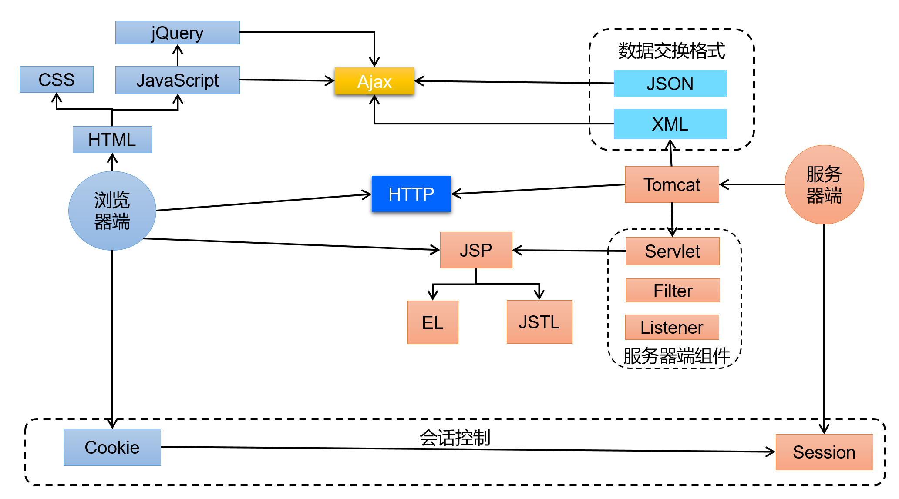

# 第一章 HTML基础

[TOC]

## 1.1 认识网页

### 1.1.1 B/S和C/S

* 现在软件开发的整体架构主要分为B/S和C/S架构
* b/s:浏览器browser/服务器server
* c/s:客户端client/服务器server

* 客户端：需要安装在系统里，才可使用
* 浏览器：浏览网页，浏览器读取网页资源html+css+js资源后解析，按照一定规则解析后显示到浏览页

* b/s的特点：
  1. 优点：无需占用本地存储空间
  2. 不足：需要占用大量网络带宽
* c/s的特点：
  1. 优点：无需占用大量网络带宽
  2. 不足：需要占用本地存储空间

* JavaWeb技术体系


### 1.1.2 网页的构成

* 组成部分：结构html,表现css,行为js

* 浏览器中显示的内容，浏览器是网页的展示器。编写好的网页，放在浏览器中即可运行。编写网页使用的就是HTML语言。

### 1.2 网页的构成

| 摘要| 说明|
| :---- | :---- |
| 结构(HTML)                | **HTML是网页内容的载体**。内容就是网页制作者放在页面上**想要让用户浏览的信息**，可以包含文字、图片、视频等。 |
| 表现(CSS)                 | **CSS样式是表现**。就像网页的外衣。比如，**标题字体、颜色变化**，或为标题加入**背景图片、边框**等。所有这些用来改变内容外观的东西称之为表现。 |
| 行为(JavaScript) | **JavaScript是用来实现网页上的特效效果**。如：**鼠标滑过弹出下拉菜单**。或鼠标滑过表格的背景颜色改变。还有购物网站中**图片的轮换**。可以这么理解，有**动画**的，有交互的一般都是用JavaScript来实现的 |

## 1.2 HTML简介

* HTML是用来描述网页的一种语言
* HTML指的是超文本标记语言(Typer Text Markup Language)
* 超文本就是指页面内可以包含图片，连接，甚至音乐，程序等非文本元素
* HTML不是一种编程语言，而是一种**标记语言**
* 标记语言是一套标记标签(markup tag),由一组`<>`包围的关键字
* HTML网页的后缀名一般为.html（服务器返回网页的是内容，其实与网页的文件没有关系，它是去读取文件内容）
* HTML使用标记标签来描述网页

```html
<!DOCTYPE html><!--网页版本-->
<html lang="zh-CN"><!--根标签--><!--页面语言-->
<head><!--头部-->
    <meta charset="UTF-8"><!--页面字符编码，仅仅这里写还不行，该页面文件保存的格式须与此处设置一致，页面才不会乱码-->
    <title>第一个网页</title><!--页面标题名称-->
    <script src="/js/ajax.js"></script><!--加载js文件-->
    <link href="/css/style.css" rel="stylesheet" type="text/css" /><!--加载css样式文件-->
</head>
<body><!--页面主体内容-->
</body>
</html>
```

### 1.2.1 HTML语法

* 标签分类：html标签大体分为两类，一类有开始结束的**成对标签**,另一类叫**自结束标签**
* 标签不区分大小写
* 标签可以嵌套但不能交叉嵌套。浏览器一般会自动纠正补齐，不会报错，但是不同浏览器可能处理不同
* 标签必须正确关闭。浏览器一般也会自动纠正补齐，不会报错，但是不同浏览器可能处理不同
* 元素阶段中的属性：必须有值，且用`""`括起来
* 关于注释：注释不能嵌套
* html注释：`<!--注释内容-->`

### 1.2.2 HTML常用标签

1. 标题标签
   语法：`<h1></h1>`至`<h6></h6>`,**没有`<h7></h7>`标签**
   作用：设置标题标签
   特点：标题标签是块级元素

     ```html
     <h1></h1>
     <h2></h2>
     <h3></h3>
     <h4></h4>
     <h5></h5>
     <h6></h6>
     ```

2. 换行标签：
   语法：`<br>`
   作用：使得页面的元素出现在下一行
3. 分区布局标签
   * div标签
   语法：`<div></div>`
   作用：div本身无实际语义，主要作用是分区布局
   特点：自带换行效果（块级元素）
   * span标签
   语法：`<span></span>`
   作用：span本身无实际语义，主要作用是分区布局
   特点：行内元素(可以使用css来改变)
4. 段落标签
   语法：`<p></p>`
   作用：拆分段落
   特点：自带换行的效果(标签的上下空间都会换行)
5. 分割线标签
   语法：`<hr>`
   作用：在页面的当前行画出一条水平分割线
6. 超链接标签
   语法：`<a href="页面链接地址" target="打开方式">标签内容</a>`
   作用：点击标签内容后跳转到其他页面
   特点：
   1. href属性设置连接的地址
   2. target属性设置目标页面的打开方式：_self表示在当前窗口打开，_blank表示在新窗口打开

7. 列表标签
   语法：

   ```html
   <!--无序列表-->
   <ul>
       <li>HTML</li>
       <li>CSS</li>
       <li>Javascript</li>
   </ul>

   <!--有序列表-->
   <ol>
       <li>HTML</li>
       <li>CSS</li>
       <li>Javascript</li>
   </ol>
   ```

   显示效果：
   <ul>
       <li>HTML</li>
       <li>CSS</li>
       <li>Javascript</li>
   </ul>

   <ol>
       <li>HTML</li>
       <li>CSS</li>
       <li>Javascript</li>
   </ol>

   > 无序列表的元素前面显示的列表符号，不同浏览器显示样式不一定相同，比如是空心圆点，也可能是实心圆点，或者是实心的小方块(可以通过css样式来改变列表符号，甚至隐藏)

8. img标签
   语法：``
   作用：在页面上显示图片
   特点：
   1. src可以写图片的资源地址，也可以写base64编码后的图片编码字符串
   2. alt是当图片资源根据资源地址没有找到时，显示的文字来提示
   3. 可以通过设置宽width和高height来设置图片的显示大小
   4. img标签是行内元素
   >**web中的绝对路径和相对路径**
   >
   > * 在JavaSE中路径也分为相对路径和绝对路径
   >   * 相对路径：从工程名开始算
   >   * 绝对路径：盘符:/目录/文件名
   > * 在web中路径分为相对路径和绝对路径两种
   >   * 相对路径：
         `.`     表示当前文件所在目录
         `..`    表示当前文件所在的上一级目录(也就是当前文件所在的目录a，这个目录a所在的目录)
         `文件名`  表示当前文件所在目录的文件，相当于`./文件名`，其中`./`可以省略
   >   * 绝对路径：
         格式是：`http://ip:port/工程名/资源路径`
         注意：如果在页面元素中需要填地址的属性上直接写`/a/b.html`等于是`http://ip:port/a/b.html`，也就是说前面省略了协议+主机地址+端口号，发请求时会自动添加上去，但是工程名contextPath则不会自动添加上

9. table标签
   语法：

   ```html
   <table border="1px solid #eeeeee" cellspacing="0" width="300px" height="200px" align="center" cellpadding="10px">
       <thead>
       <tr>
           <th>姓名</th>
           <th>籍贯</th>
           <th>年龄</th>
       </tr>
       </thead>
       <tbody>
       <tr><td>赵云</td><td>常山</td><td>24</td></tr>
       <tr><td>马超</td><td>西凉</td><td>22</td></tr>
       <tr><td>关羽</td><td>运城</td><td>30</td></tr>
       <tr><td>刘备</td><td>长安</td><td>45</td></tr>
       </tbody>
   </table>
   ```

   解释：`<table>`标签只是定义了一个表格元素，但是内容是空的，需要使用行元素`<tr>`来创建一行，以及使用列元素`<td>`，最终每行每列的内容是放在各行中的`<td>`里面。标签`<th>`表示表头列元素。`<thead>`是表示整个表格的头部，而`<tbody>`是表示表格内容的主体，他们两个是用来区别开表头信息和表格的主体信息
   作用：
   1. 在页面上显示一个表格
   2. 作为布局(但是这是过时的做法)

   > cellpadding用来设置`<td>`和`<th>`它们单元格的边沿与其内容之间的空白
   > cellspacing用来设置`<td>`和`<th>`它们单元格之间的空白
   >
   > **补充：**
   > **跨行rowspan和跨列colspan**
   >
   > 1. 想让一个单元格水平横跨两列，占用两个单元格的位置，则应该在该单元格的属性上添加`colspan="2"`，当然此时改行应该减少一个列元素，因为当前列元素已经占用了两个列元素位置
   > 2. 想让一个单元格垂直竖跨两行的列元素，占用两个单元格的位置，则应该在该元旦个的属性上添加`rowspan="2"`，当然此时下一行应该减少一个列元素，因为当前列元素已经占用了两个列元素位置

10. iframe标签
  语法：`<iframe src="页面路径" name="标签名" width="" height="">`
  作用：在当前页面中的iframe标签区域内显示一个单独的页面
  特点：当前页面加载的js和css文件不会在iframe标签的页面中起作用

      > 在`<a>`标签中打开链接页面，让链接页面在当前页面的`<iframe>`标签中显示出来：
       1.在iframe标签中使用name属性，并给属性赋值
       2.在a标签的target属性上设置值为：iframe标签的name属性值
         这样可以使得链接页面在当前页面的iframe标签中显示出来

11. form表单
    作用：用来在前端页面上收集用户输入的信息，然后发送给服务器端处理
    语法：

    ```html
    <form action="/user/register" method="post" enctype="application/x-www-form-urlencoded"><br>
        <label>用户名：</label><input type="text" name="username" placeholder="请输入用户名" value=""><br>
        <label>密码：</label><input type="password" name="password" placeholder="请输入密码"><br>
        <label>地址：</label><input type="text" name="address" placeholder="请输入地址" value=""><br>
        <label>性别：</label><input type="radio" name="sex" value="man" checked>男<input type="radio" name="sex" value="woman">女<br>
        <label>生日：</label><input type="date" name="birth"><br>
        <label>购物时间：</label><input type="datetime-local" name="buytime"><br>
        <label>兴趣爱好：</label><input type="checkbox" name="hobby" value="java">Java<input type="checkbox" name="hobby" value="html">HTML<input type="checkbox" name="hobby" value="javascript">Javascript<br>
        <label>国籍：</label><select name="nation">
            <option value="">请选择国籍</option>
            <option selected value="China">中国</option>
            <option value="Russia">俄罗斯</option>
            <option value="America">美国</option>
        </select><br>
        <textarea name="selfinfo" placeholder="自我介绍"></textarea><br>
        <input type="button" value="自定义按钮" name="userButton"><br>
        <input type="file" name="avtor"><br>
        <input type="hidden" value="隐藏的值" name="hiddenValue">
        <input type="reset" value="重置">
        <input type="submit" value="提交">
    </form>
    ```

    说明：
    1. action:表单提交的请求地址，发给服务器端的哪个请求来处理
    2. method:可选get或者post，get是通过拼接值的方式将参数以键值对方式附加到url上，有长度限制；post是隐式的在报文中特定位置放传递的参数，适合较大的数据量传输，详见http协议
    3. enctype:当 method 属性值为 post 时，enctype 就是将表单的内容提交给服务器的 MIME 类型 。可能的取值有：
       * application/x-www-form-urlencoded：默认。在发送前对所有字符进行编码（将空格转换为 "+" 符号，特殊字符转换为 ASCII HEX 值）,将数据以键值对`(key1=value1&key2=value2)`的形式拼接并附加到url后面，用`?`连接
       * multipart/form-data：不对字符编码。当使用有文件上传控件的表单时，该值是必需的
       * text/plain：将空格转换为 "+" 符号，但不编码特殊字符
      form上的enctype属性值可被 `<button>`、`<input type="submit">` 或 `<input type="image">` 元素上的 `formaction` 属性覆盖。
    4. `input type="hidden"`的输入框，form表单在提交时，也会收集该元素上的值，只是页面上看不到该元素而已
    5. `input type="button"`时，该标签的值不会被form表单收集提交
    6. input标签的数据被form收集并提交的前提是：
       * input有name属性，且该属性有值
       * input有value属性
    >使用form标签来提交表单会使得当前页面跳转到action属性中设置的请求地址页面，一般情况下不会使用这种方式提交数据，而是使用ajax来异步提交数据(在没有ajax的时期，一种方式是使用iframe来提交请求)，这样不用跳转页面


> 1.HTML中直接手动输入空格和回车是没有效果的，页面被解析时，页面内容中，无论多少空格和回车，都会当做只输入了一个空格
> 2.在标签`<pre>`中会保持此标签内容的原格式显示，会保留空格和回车效果

### 1.2.3 特殊字符

* 特殊字符需要转义才能显示出来，原因有两个：
  1. 某些字符在HTML中有其他作用，比如`<>`，如果想显示字符本身，就需要使用转义字符
  2. 某些字符无法通过直接输入来表示它的作用，比如回车符和制表符，后退符，需要通过转义字符来替代表示

  |字符|十进制|转义字符|
  |:----:|:----:|:----:|
  |"|`&#34;`|`&quot;`|
  |&|`&#38;`|`&amp;`|
  |<|`&#60;`|`&lt;`|
  |>|`&#62;`|`&gt;`|
  |不断开空格(non-breaking space)|`&#160;`|`&nbsp;`|
  |￥|`&#165;`|`&yen;`|
  |\||`&#166;`|`&brvbar;`|
  |©|`&#169;`|`&copy;`|
  |±|`&#177;`|`&plusmn;`|

## 1.3 CSS语法

### 1.3.1 认识CSS

* css是层叠样式表单(Cascading Style Sheets)，用于增强或者控制网页元素的样式并允许将样式信息与网页内容分离的一种标记性语言
* css语法规则:

  ```css
  选择器{
     属性1:值1;
     属性2:值2;
     ...
  }
  ```

  例如：

  ```css
  div{
     color:red;
     border:1px solid black;
     background-color:green;
  }
  ```

* 选择器：浏览器根据“选择器”来决定受CSS样式影响的HTML元素(标签)

* 属性：也就是要改变的样式的名字，比如元素内的文字颜色样式color、元素的边框样式border、元素的背景颜色样式background-color。同时每个属性应该都有一个值，属性和值被冒号分开，并由花括号`{}`来包围，这就组成了一个完整的样式声明,例如p{color:red;}

* 多个声明：如果要定义不止一个样式声明，则需要使用分号`;`将每个声明分开，最后一个声明可以不加分号(尽量在每个声明后面都加上分号)

* CSS注释：
  语法：

  ```css
  /*css样式注释内容*/
  ```

### 1.3.2 HTML与CSS结合的方式

* 第一种方式：
  直接在HTNL页面的元素上编写css样式

  ```html
  <p style="color:red;font-size:24px;">第一个段落</p>
  ```

  缺点：
  1. 如果标签很多，且样式很多，则代码量很大
  2. 可读性非常差，因为html和css混在一起
  3. 编写的css代码无法复用

* 第二种方式：
  在HTML页面中的标签`<head>`内添加`<style>`标签，然后在`<style>`标签内编写css样式:

  ```html
  <!DOCTYPE html>
  <html lang="zh-CN">
     <head>
        <meta charset="utf-8">
        <title>Title</title>
        <style type="text/css">
           p{
              color:red;
              font-size:24px;
           }
        </style>
     </head>
     <body>
        <p>这是第一个段落</p>
     </body>
  </html>
  ```

  缺点：
  1. 只能在同一个页面内复用代码，不能在多个页面中复用css代码
  2. 维护起来不方便，实际的项目中会有成千上万的页面，要到每个页面中去修改，工作量太大

* 第三种方式：
  在一个css样式文件里面编写，然后在<head>标签中引入这个css样式文件

  ```html
  <!DOCTYPE html>
  <html lang="zh-CN">
     <head>
        <meta charset="utf-8">
        <title>Title</title>
        <link rel="stylesheet" href="/css/style.css" type="text/css">
     </head>
     <body>
        <p>这是第一个段落</p>
     </body>
  </html>
  ```

  其中style.css内容如下：

   ```css
   p{
      color:red;
      font-size:24px;
   }
   ```

### 1.3.3 css选择器种类

#### 标签名选择器

* 直接使用标签名作为选择器，这样的一组样式声明则会作用在页面中名为此标签的所有元素上

```css
/*页面上的所有p标签元素都会有下列样式*/
p{
   color:red;
   font-size:24px;
}

/*页面上的所有div标签元素都会有下列样式*/
div{
   background-color:green;
   border:1px solid black;
}

```

#### id选择器

* 可以为元素设置id属性，然后在css样式中将选择器写成该元素的id属性，这样就可以让该元素使用这一组样式

  `<div id="leftContent">这个页面左部</div>`

  ```css
  #leftContent{
     width:600px;
     height:100%;
     color:red;
     font-size:24px;
  }
  ```

* 但是原则上来说，每个元素的id应该是唯一的，这一组样式声明无法被其他不同id的元素来使用(当然也可以不同id使用相同一组样式声明，选择器是可以并列多个选择的)

#### class类选择器

* class类型选择器，可以通过给元素设置class属性来有效的选择css样式声明

  `<div class="left-bar">这个页面左部</div>`

  ```css
  .left-bar{
     width:600px;
     height:100%;
     color:red;
     font-size:24px;
  }
  ```

#### 组合选择器

* 组合选择器可以使得多个选择器使用同一组样式声明

  ```css
  选择器1,选择器2,选择器3,...选择器n{

  }
  ```

#### 元素筛选选择器

* 通过标签名，id属性，class属性来匹配一个或者一些元素，当满足该匹配模式则会使用此样式

  ```css
  .main div.left-bar>table #first-tr td{
     font-size:24px;
     color:red;
  }
  ```

> 更多前端的css选择器写法，须系统地学习前端知识