# JavaWeb

[TOC]

## 1. 认识XML

### 1.1 XML的作用

* 什么是可扩展标记性语言
  XML文档里面的标签是可以自己定义的，这与HTML不同，HTML文档里面的标签是不能自定义的，只能使用HTML语言提供的标签

  ```xml
  <students>
      <student>
          <id>111</id>
          <name>张三</name>
      </student>
      <student>
          <id>222</id>
          <name>李四</name>
      </student>
  </students>
  ```

  如上所示，标签`<students>`、`<student>`、`<id>`、`<name>`都是用户自定义的

* XML 的作用：
  1. 用来保存数据，而且这些数据具有自我描述性
  2. 它还可以作为项目或者模块的配置文件
  3. 还可以作为网络传输数据的格式(现在以JSON为主)

### 1.2 XML的格式

* XML 文件的格式：

  ```xml
  <?xml version="1.0" encoding="utf-8" ?>
  <!--以上内容是xml文件的声明，version是xml版本，encoding是xml文件本身的编码信息-->
  <books><!--表示多个图书信息-->
      <book sn="SN11111"><!--book表示一个图书信息，自定义的sn属性是唯一标识一个图书的主键，标识图书的序列号-->
          <name>时间简史</name><!--name标签表示书名-->
          <author>霍金</author><!--author标签表示作者-->
          <price>74.00</price><!--price标签表示图书价格-->
      </book>
      <book sn="SN22222">
          <name>物种起源</name>
          <author>达尔文</author>
          <price>33.90</price>
      </book>
  </books>
  ```

* XML的标签属性必须使用引号括起来，否则会报错
* XML 标签对大小写敏感
* XML文档必须有根元素
  根元素就是顶级元素
  没有父标签的元素，叫顶级元素
  根元素是没有父标签的顶级元素，而且是唯一一个才行
* XML 中的特殊字符需要转义
  `>`:`&gt;`
  `<`:`&lt;`
  也可以使用CDATA语法告诉xml解析器，这是文本内容，不需要xml语法解析
  CDATA格式：
  `<![CDATA[这里可以把输入的字符原样显示]]>`
* xml中的元素也分为单标签和双标签：
  1. 单标签，格式：`<标签名 属性="值" ... />`
  2. 双标签，格式：`<标签名 属性="值" ... >文本数据或子标签</标签名>`
* 所有XML元素都须闭合

### 1.3 XML 命名规则

* XML 元素必须遵循以下命名规则：

  * 名称可以含字母、数字以及其他的字符
  * 名称不能以数字或者标点符号开始
  * 名称不能以字符 “xml”（或者 XML、Xml）开始
  * 名称不能包含空格
* 可使用任何名称，没有保留的字词。

### 1.4 解析XML

* JDK提供了两种解析技术DOM和SAX，但是这两者是有区别的。

#### 1.4.1 DOM解析

* 原理： 一次性加载xml文档，不适合大容量的文件读取
* dom 解析技术是 W3C 组织制定的，而所有的编程语言都对这个解析技术使用了自己语言的特点进行实现。Java 对 dom 技术解析标记也做了实现
* 特点：
  1. DOM解析可以任意进行增删改成
  2. DOM解析任意读取任何位置的数据，甚至往回读
  3. DOM解析面向对象的编程方法（Node，Element，Attribute）
  4. Java开发者编码比较简单

//todo，dom解析实例和源码分析

#### 1.4.2 SAX解析

* SAX(simple api for xml)
* 原理： 加载一点，读取一点，处理一点。适合大容量文件的读取
* SAX 解析，它跟 W3C 制定的解析不太一样。它是以类似事件机制通过回调告诉用户当前正在解析的内容。它是一行一行的读取 xml 文件进行解析的。不会创建大量的 dom 对象。
* 特点：
  1. SAX解析只能读取
  2. SAX解析只能从上往下，按顺序读取，不能往回读
  3. SAX解析基于事件的编程方法。java开发编码相对复杂。

//todo，dom解析实例和源码分析

#### 1.4.3 第三方解析

* DOM和SAX解析这两个都不是常用的解析XML工具，而第三方提供的解析则更常用：
  1. jdom：在dom基础上进行了封装
  2. dom4j：又对jdom进行了封装
  3. pull：主要用在Android手机开发，是在跟sax非常类似都是事件机制解析xml文件

##### jdom解析

//todo,jdom解析实例和源码分析

##### dom4j解析

* 使用dom4j解析XML之前需要对导入这个第三方包，使用maven导入(也可去相关网站下载)

```xml
<dependency>
    <groupId>dom4j</groupId>
    <artifactId>dom4j</artifactId>
    <version>1.6.1</version>
</dependency>
```

* dom4j解析xml文件示例：

  ```java
  import org.dom4j.Attribute;
  import org.dom4j.Document;
  import org.dom4j.DocumentException;
  import org.dom4j.Element;
  import org.dom4j.io.SAXReader;
  import org.junit.Test;

  import java.util.List;

  public class XMLTest {

      @Test
      public void test1(){
          SAXReader reader=new SAXReader();
          try {
              //第一步：通过创建SAXReader对象，来读取xml文件，获取Document对象
              Document document=reader.read("books.xml");
              //第二步：通过Document对象，获取XML的根元素对象
              Element root=document.getRootElement();
              //第三步：通过根元素对象，获取到所有book标签对象
              List<Element> books=root.elements("book");
              //遍历每个book对象，然后获取到book标签对象内的每一个元素
              for(Element book: books){
                  //获取book标签上的属性
                  Attribute attribute=book.attribute("sn");
                  String sn=attribute.getText();
                  //获取book标签下面的name标签对象
                  Element nameElement=book.element("name");
                  //获取book标签下面的author标签对象
                  Element authorElement=book.element("author");
                  //获取book标签下面的price标签对象
                  Element priceElement=book.element("price");
                  System.out.println("sn:"+sn+", name:"+nameElement.getText()+" ,author:"+authorElement.getText()+" ,price:"+priceElement.getText());
              }
          } catch (DocumentException e) {
              e.printStackTrace();
          }
      }
  }
  ```

* dom4j源码分析,todo

## 2. JavaWeb概念

* 什么是JavaWeb
  JavaWeb是指，所有通过Java语言编写，可以通过浏览器访问的程序的总称，叫JavaWeb
* JavaWeb是基于请求和响应来开发的

* 什么是请求
  请求是指客户端给服务器发送数据，叫做请求Request
* 什么是响应
  响应是指服务器给客户端回传数据，叫做响应Response

* 请求和响应的关系
  请求和响应是成对出现的，有请求就有响应

  

  >请求和响应在客户端和服务器端之间是通过报文来传递内容的，其报文的协议为HTTP协议

* Web资源的分类
  web 资源按实现的技术和呈现的效果的不同，又分为静态资源和动态资源两种。
  静态资源： html、css、js、txt、mp4 视频 , jpg 图片
  动态资源： jsp 页面、Servlet 程序

* 常用的Web服务器(容器)
  1. Tomcat：由 Apache 组织提供的一种 Web 服务器，提供对 jsp 和 Servlet 的支持。它是一种轻量级的 javaWeb 容器（服务器），也是当前应用最广的 JavaWeb 服务器（免费）。
  2. Jboss：是一个遵从 JavaEE 规范的、开放源代码的、纯 Java 的 EJB 服务器，它支持所有的 JavaEE 规范（免费）。
  3. GlassFish： 由 Oracle 公司开发的一款 JavaWeb 服务器，是一款强健的商业服务器，达到产品级质量（应用很少）。
  4. Resin：是 CAUCHO 公司的产品，是一个非常流行的服务器，对 servlet 和 JSP 提供了良好的支持，性能也比较优良，resin 自身采用 JAVA 语言开发（收费，应用比较多）。
  5. WebLogic：是 Oracle 公司的产品，是目前应用最广泛的 Web 服务器，支持 JavaEE 规范，而且不断的完善以适应新的开发要求，适合大型项目（收费，用的不多，适合大公司）。

  > 用的最广泛的是Tomcat，收费容器中最广泛使用的是WebLogic

* JavaEE三层架构图解：
  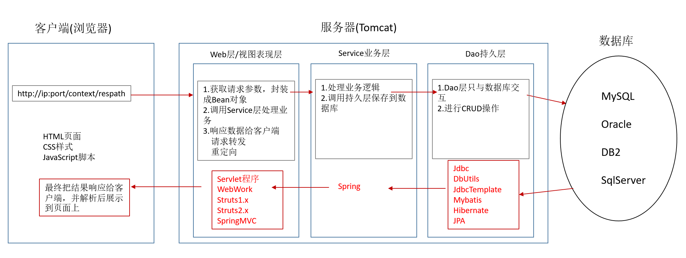

## 3. Tomcat的使用

* Tomcat服务器和Servlet版本的对应关系

|Servlet Spec|JSP Spec|EL Spec|WebSocket Spec|JASPIC Spec|Apache Tomcat version|Actual release revision|Supported Java Versions|
|:----|:----|:----|:----|:----|:----|:----|:----|
|4.0|TBD (2.4?)|TBD (3.1?)|TBD (1.2?)|1.1|9.0.x|9.0.0.M4(alpha)|8 and later|
|3.1|2.3|3.0|1.1|1.1|8.5.x|8.5.0 (beta)|7 and later|
|3.1|2.3|3.0|1.1|N/A|8.0.x|8.0.33|7 and later|
|3.0|2.2|2.2|1.1|N/A|7.0.x|7.0.69|6 and later(7 and later for WebSocket)|
|2.5|2.1|2.1|N/A|N/A|6.0.x|6.0.45|5 and later|
|2.4|2.0|N/A|N/A|N/A|5.5.x (archived)|5.5.36 (archived)|1.4 and later|
|2.3|1.2|N/A|N/A|N/A|4.1.x (archived)|4.1.40 (archived)|1.3 and later|
|2.2|1.1|N/A|N/A|N/A|3.3.x (archived)|3.3.2 (archived)|1.1 and later|

> Servlet 3.0版本是区别较大的，对应着的是Tomcat7版本
> 常用版本是Tomcat7,Tomcat8
> Servlet程序从2.5版本是现在世面上使用最多的版本(xml配置)
> Servlet3.0之后，就是注解版本的Servlet使用

* 安装Tomcat
  只需要下载Tomcat服务器的压缩包，然后解压即可，这个解压后的文件夹就是Tomcat服务器文件夹，解压后的文件夹名字一般是apache-tomcat-7.0.107,版本不同则名字不同，里面会有子文件夹`bin`,`conf`,`lib`,`logs`,`temp`,`webapps`,`work`
  > Tomcat安装，在官网上会提供32位和64位的包，这里需要注意的是，如果jdk安装的是32位的，那么tomcat也需要下载使用32位的；如果jdk安装的是64位的，那么tomcat下载32位和64位都可以

* Tomcat下各目录的作用
  1. bin：专门用来存放Tomcat服务器的可执行程序
  2. conf：专门用来存放Tomcat服务器的配置文件
  3. lib：专门用来存放Tomcat服务器的jar包
  4. log：专门用来存放Tomcat服务器运行时输出的日志信息
  5. temp：专门用来存放Tomcat服务器运行时产生的临时数据
  6. webapps：专门用来存放Tomcat服务器的Web工程
  7. work：：专门用来存放Tomcat服务器工作时的目录，用来存放Tomcat运行时jsp翻译为Servlet的源码，和Session钝化的目录

* 如何启动Tomcat服务器
  找到Tomcat目录下的bin目录下的startup.bat文件，双击运行，就可以启动Tomcat服务器

* 验证Tomcat服务器启动成功：在浏览器地址栏输入：`http://localhost:8080`
  或者输入：`http://127.0.0.1:8080`

* 常见的启动失败的情况：
  1. 双击startup.bat文件，就会出现一个小黑窗口一闪而过，因为没有配置好JAVA_HOME这一环境变量
     比如变量名：`JAVA_HOME`变量值为：`D:\Programs\java\jdk1.8.0_271`,根据自己本机安装的jdk目录设置
     > 环境变量名`JAVA_HOME`必须是这几个单词，环境变量名必须全部大写

* 另一种启动tomcat服务器的方式:
  1. 打开命令行
  2. 进入到Tomcat的bin目录下
  3. 输入命令行语句：`catalina run`
   > 该方式启动tomcat，如果出现问题Tomcat无法启动，则会有信息提示，而不是像上面第一种方式启动，出现错误无法启动不会有任何提示

* Tomcat的停止方式：
  1. 第一种：点击Tomcat服务器窗口的关闭按钮
  2. 第二种：进入Tomcat的bin目录，点击shutdown.bat

* 修改Tomcat默认端口号
  1. 打开conf目录下的server.xml文件
  2. 找到<Connector>标签，修改其port属性，port端口范围1-65535，
     `<Connector port="8080" protocol="HTTP/1.1" connectionTimeout="20000" redirectPort="8443" URIEncoding="UTF-8"/>`
  3. tomcat默认端口号是8080，在网页上访问时需要输入端口号，但是如果端口号是80，则可以省略不写。所以凡是省略不写的网站，其实端口号使用的是80端口

* 如何部署web工程到tomcat中：
  1. 第一种方法(不支持热部署)：
     只需要把web工程的目录整个拷贝到Tomcat的webapps目录下即可

* 访问tomcat下的web工程
  输入地址：`http://ip:port/工程名/目录下/文件名`

* 第二种部署web工程方式：
  1. 找到tomcat目录下的`conf/Catalina/localhost`文件夹
  2. 新建一个xml文件，名字最好以工程名命名，内容为：
     `<Context path="/工程名" docBase="整个工程实际在硬盘所在目录位置" />`
  3. 保存该配置文件时使用utf-8编码保存

* 浏览器通过`file://访问文件`和`http://访问文件`的区别
  file协议用于访问本地计算机中的文件，好比通过资源管理器中打开文件一样，需要主要的是它是针对本地的，即file协议是访问本机的文件资源。
  http访问本地的html文件，相当于将本机作为了一台http服务器，然后通过localhost访问的是自己电脑上的本地服务器，再通过http服务器去访问你本机的文件资源。
  file只是简单请求了本地文件，将其作为一个服务器未解析的静态文件打开。而http是在本地搭建了一个服务器再通过服务器去动态解析拿到文件。
  其他区别：
  1. file协议只能在本地访问
  2. 本地搭建http服务器开放端口后他人也可以通过http访问到你电脑中的文件，但是file协议做不到
  3. file协议对应有一个类似http的远程访问，就是ftp协议，即文件传输协议。
  4. file协议无法实现跨域

* Tomcat默认访问的工程和默认访问的资源
  在没有输入工程名的时候，访问的是默认的ROOT工程下的资源；
  在没有输入工程名下的文件资源时，默认访问的是名为`index.html`的资源(默认访问资源可以另外设置)
  设置访问工程时，默认的访问文件，在工程下的WEB-INF里的web.xml文件中配置：

  ```xml
  <welcome-file-list>
      <welcome-file>index.html</welcome-file>
      <welcome-file>index.htm</welcome-file>
      <welcome-file>index.jsp</welcome-file>
  </welcome-file-list>
  ```

  > 以上三个文件配置，说明在没有输入资源文件名时，优先访问者三个文件，这三个文件同时存在时，会以这个配置文件的上下顺序去查找匹配

* IDEA整合tomcat服务器
  1. 步骤一：在点击工具栏中的`File`,在下拉功能列表中点击`settings`，操作如下图：
  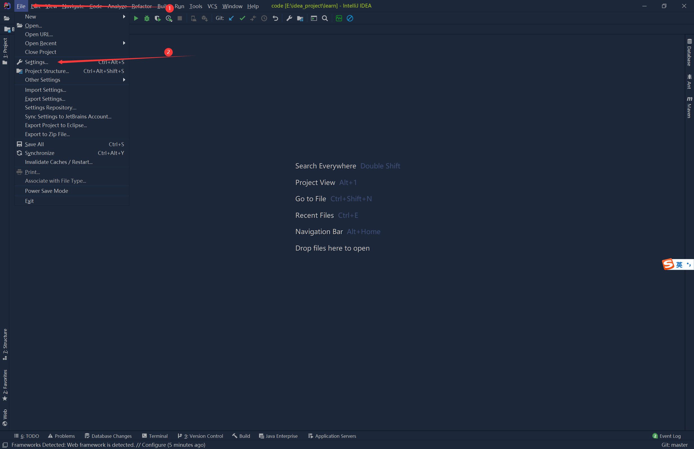
  2. 步骤二：在Application Servers中新建Tomcat服务器，选择安装的Tomcat服务器文件夹目录，如下图：
  
  
  3. 步骤三：选择Tomcat安装的文件夹后，可以看到如下图所示，然后点击`apply`保存，再点击`ok`即可
  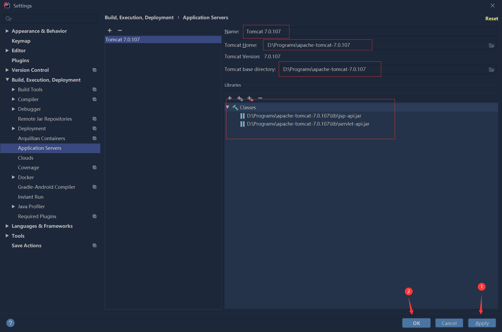
> 在idea里配置tomcat服务器的作用是：当在idea里新建动态web工程，需要指定Application Server。而此步骤就是配置了应用服务器

* Tomcat创建动态工程
  在idea里新建一个模块moudle，然后这里需要选择Java Enterprise，这就是创建Java Web工程，如下图所示操作：
  

* 动态web工程的目录介绍
  创建成功后的动态web工程目录如下所示：
  
  > WEB-INF 目录是一个受服务器保护的目录，浏览器地址栏通过地址是无法直接访问此目录的内容，但是可以经过servlet请求转发到该目录下的资源文件，servlet重定向无法到达此目录下的资源文件
  > web.xml是整个web工程的配置文件，可以配置很多web工程的组件，包括servlet程序，Filter过滤器，Listener监听器等
  >lib目录是用来存放第三方的jar包(idea在源代码编辑阶段还需要导入才能识别使用，并不是放在此处就能识别了，所以并不推荐手动在web/WEB-INF下新建lib目录，存放jar包，因为idea有导入依赖的管理方式，真正部署工程时会自动在工程部署的文件夹下的WEB-INF下创建lib文件夹，然后将jar包放在里面)

* 给Tomcat添加第三方包
  1. 给动态web工程添加第三方包的方式与javaSE工程应用是一样的，在点击工具栏上的`File`，然后点击下拉列表的`Project Structure`，进入到模块管理
  2. 给模块添加依赖并不能让idea部署时将第三方包部署到lib下，需要在artifacts下设置，如下图所示：
   
   > 如果缺包，`Apply`按钮上面会出现一个`Fix`按钮，点击后即可将第三方包添加到部署的工程中去

* tomcat在idea中启动部署
  点击工具栏上的`Run`,然后再点击下拉列表里的`Edit Configurations`后，弹出框如下，配置如下步骤：
  
  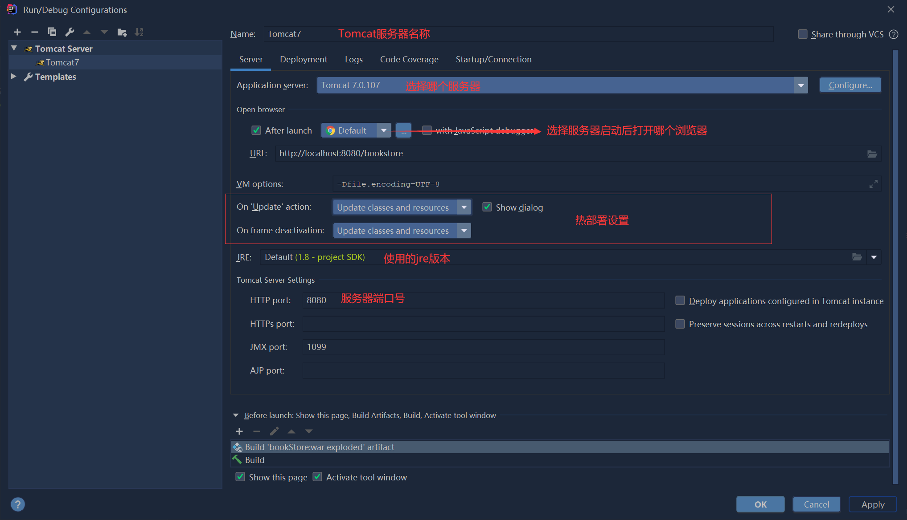
  

* tomcat实例使用的其他细节
  1. 修改工程访问路径
     

## 4. Servlet

### 4.1 认识Servlet

* 什么是Servlet
  1. Servlet是JavaEE规范之一，规范就是接口
  2. Servlet就是JavaWeb三大组件之一，三大组件分别是Servlet程序，Filter过滤器，Listener监听器
  3. Servlet是运行在服务器上的一个java程序，它可以接收客户端发送过来的请求，并响应数据给客户端
  4. Servlet通常通过HTTP协议来接收和响应来自Web客户端的请求

* 手动实现一个Servlet程序
  1. 编写一个类去实现Servlet接口
  2. 实现service方法，处理请求，并响应数据
  3. 到web.xml中去配置servlet程序的访问地址(servlet3.0之后可以通过注解配置)

  ```java
  package com.suftz.book.servlet;

  import javax.servlet.*;
  import java.io.IOException;

  public class HelloServlet implements Servlet {

      @Override
      public void init(ServletConfig config) throws ServletException {
      }

      @Override
      public ServletConfig getServletConfig() {
          return null;
      }

      @Override
      public void service(ServletRequest req, ServletResponse res) throws ServletException, IOException {
          System.out.println("访问了helloServlet");
      }

      @Override
      public String getServletInfo() {
          return null;
      }

      @Override
      public void destroy() {

      }
  }
  ```

  web.xml配置文件如下：

  ```xml
  <?xml version="1.0" encoding="UTF-8"?>
  <web-app xmlns="http://xmlns.jcp.org/xml/ns/javaee"
           xmlns:xsi="http://www.w3.org/2001/XMLSchema-instance"
           xsi:schemaLocation="http://xmlns.jcp.org/xml/ns/javaee http://xmlns.jcp.org/xml/ns/javaee/web-app_4_0.xsd"
           version="4.0">
      <!--配置一个Servlet程序-->
      <servlet>
          <!--servlet-name标签用来给Servlet程序取别名，一般是Servlet程序的类名-->
          <servlet-name>HelloServlet</servlet-name>
          <!--servlet-class标签表示Servlet程序的全类名-->
          <servlet-class>com.suftz.book.servlet.HelloServlet</servlet-class>
      </servlet>
      <!--servlet-mapping标签给servlet程序配置访问地址-->
      <servlet-mapping>
          <!--servlet-name作用是告诉服务器，当前配置的地址请求用这个servlet程序来处理-->
          <servlet-name>HelloServlet</servlet-name>
          <!--url-pattern用来表示地址的请求-->
          <url-pattern>/hello</url-pattern>
      </servlet-mapping>
  </web-app>
  ```

  > `/` 表示服务器解析的时候，表示的地址为 `http://ip:port/工程名contextPath`
  > `/hello` 表示地址为  `http://ip:port/工程名contextPath/hello`

  在浏览器上输入：`http://localhost:8080/bookstore/book`
  此时在控制台会输出:`访问了helloServlet`

* Servlet程序常见错误
  1. 配置文件web.xml中的`url-pattern`一定要以`/`开头，不然会报错
  2. 配置文件web.xml中的`<servlet-mapping>`中的`<servlet-name>`填入的servlet不存在,这个servlet程序一定要在`<servlet>`标签中已声明配置
  3. `<servlet>`标签中的`<sverlet-class>`标签中的值填写错误，部署时不会报错，但是通过地址栏访问serlvet程序时会报错

* url地址栏如何定位到Servlet程序访问
  格式：`http://localhost:8080/bookstore/hello`
  `http` 表示协议
  `localhost` 表示主机地址，使用ip地址
  `:8080` 表示端口号
  `/bookstore` 表示工程路径
  `/hello` 表示资源路径 ，资源路径可以是一个确定的文件名，比如`/hello/index.html`

### 4.2 Servlet的生命周期

1. 执行Servlet构造器方法
2. 执行init初始化方法
3. 执行service方法
4. 执行destroy方法

* 说明：
  1. 部署工程时，不会去创建该Servlet
  2. 直到在浏览器上输入地址访问时，会执行1，2，3步：创建该Servlet，并执行一些初始化操作，最后执行service方法
  3. 之后，每次重复访问该Servlet程序，请求时，只会执行第3步，执行service方法
  4. 当该工程停止时，则会执行第四步，执行destroy方法

* 用于测试的类：

  ```java
  import javax.servlet.*;
  import javax.servlet.http.HttpServletRequest;
  import javax.servlet.http.HttpServletResponse;
  import java.io.IOException;

  public class HelloServlet implements Servlet {

      public HelloServlet() {
          System.out.println("构造器");
      }

      @Override
      public void init(ServletConfig config) throws ServletException {
          System.out.println("init方法");
      }

      @Override
      public ServletConfig getServletConfig() {
          return null;
      }

      @Override
      public void service(ServletRequest req, ServletResponse res) throws ServletException, IOException {
          System.out.println("service方法,访问了helloServlet");
      }

      @Override
      public String getServletInfo() {
          return null;
      }

      @Override
      public void destroy() {
          System.out.println("destroy");
      }
  }
  ```

### 4.3 Servlet请求分发处理

* 从代码可以看出，无论浏览器发的是get请求还是post请求，都是由service方法来处理，这样不太合适，需要将请求根据不同的method来进行分发，如下是分发的示例代码：

  ```java
  import javax.servlet.*;
  import javax.servlet.http.HttpServletRequest;
  import javax.servlet.http.HttpServletResponse;
  import java.io.IOException;

  public class HelloServlet implements Servlet {

      public HelloServlet() {
          System.out.println("构造器");
      }

      @Override
      public void init(ServletConfig config) throws ServletException {
          System.out.println("init方法");
      }

      @Override
      public ServletConfig getServletConfig() {
          return null;
      }

      @Override
      public void service(ServletRequest req, ServletResponse res) throws ServletException, IOException {
          System.out.println("service方法,访问了helloServlet");
          //ServletRequest这个父类没有getMethod方法，需要向下转型为HttpServletRequest
          HttpServletRequest request= (HttpServletRequest) req;
          String method=request.getMethod();
          HttpServletResponse response=(HttpServletResponse) res;
          if ("GET".equals(method)) {
              doGet(request, response);
          } else {
              doPost(request, response);
          }
      }

      public void doGet(HttpServletRequest request, HttpServletResponse response){
          System.out.println("这是get请求");
      }

      public void doPost(HttpServletRequest request, HttpServletResponse response){
          System.out.println("这是post请求");
      }

      @Override
      public String getServletInfo() {
          return null;
      }

      @Override
      public void destroy() {
          System.out.println("destroy");
      }
  }
  ```

## 5. HttpServlet

* 一般在编写Servlet程序时，不是去直接实现Servlet接口，而是去继承HttpServlet，因为HttpServlet是继承自GenericServlet，而GenericServlet又是继承来自Servlet, ServletConfig这两个接口，而在HttpServlet类中定义实现了许多方法，这些方法与获取Servlet程序信息、Servlet程序上下文相关，所以真正编写Servlet程序继承HttpServlet则可以直接使用这些工具方法，十分便捷

* 继承HttpServlet来编写Servlet程序示例：

  ```java
  package com.suftz.book.servlet;

  import javax.servlet.*;
  import javax.servlet.http.HttpServlet;
  import javax.servlet.http.HttpServletRequest;
  import javax.servlet.http.HttpServletResponse;
  import java.io.IOException;

  public class HelloHttpServlet extends HttpServlet {
      public HelloHttpServlet() {
          super();
      }

      @Override
      protected void doGet(HttpServletRequest req, HttpServletResponse resp) throws ServletException, IOException {
          super.doGet(req, resp);
      }

      @Override
      protected void doPost(HttpServletRequest req, HttpServletResponse resp) throws ServletException, IOException {
          super.doPost(req, resp);
      }

      @Override
      public void destroy() {
          super.destroy();
      }

      @Override
      public ServletConfig getServletConfig() {
          return super.getServletConfig();
      }

      @Override
      public ServletContext getServletContext() {
          return super.getServletContext();
      }

      @Override
      public String getServletInfo() {
          return super.getServletInfo();
      }

      @Override
      public void init(ServletConfig config) throws ServletException {
          super.init(config);
      }

      @Override
      public String getServletName() {
          return super.getServletName();
      }
  }
  ```

* 可以看到，`HttpServlet` 已经提供了`doGet`、`doPost`这两个方法，当web浏览器发送不同请求时，服务器端会将请求分发到对应的方法中处理

### 5.1 Servlet类的继承体系

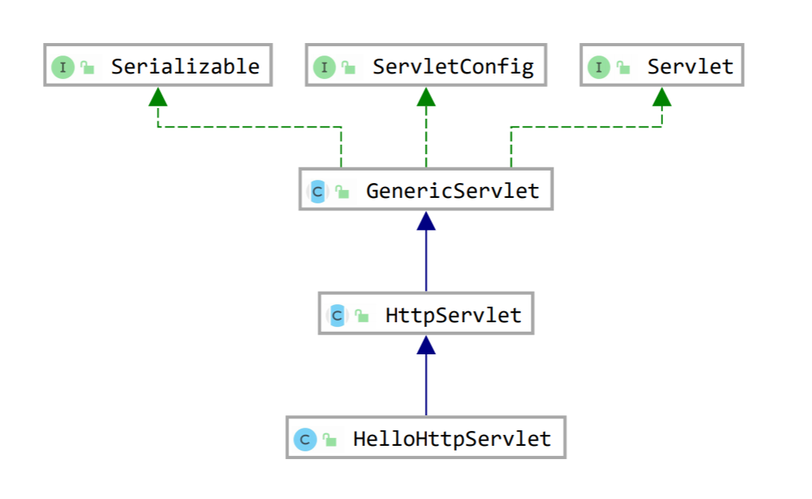

* Servlet接口，只是负责定义Servlet程序的访问规范
* GenericServlet类实现了Servlet接口，ServletConfig接口，以及Serializable接口，GenericServlet类做了很多空实现，并(作为类的示例属性)持有一个ServletConfig类的引用，并对ServletConfig的使用做了一些方法
* HttpServlet类抽取实现了service()方法，并实现了请求分发处理
* HelloHttpServlet类只需要根据需要去重写一些方法，比如init方法，doGet方法，doPost方法，destroy方法(如果此类不去重写doGet,doPost方法，则会执行父类的方法，即HttpServlet类中的doGet,doPost方法，从源码看出，这两个方法其实是在抛异常(设置状态码为405)给web浏览器)

### 5.2 HttpServlet类的service方法

```java
//这是HttpServlet类的service方法
protected void service(HttpServletRequest req, HttpServletResponse resp)
    throws ServletException, IOException {

    String method = req.getMethod();

    if (method.equals(METHOD_GET)) {
        long lastModified = getLastModified(req);
        if (lastModified == -1) {
            // servlet doesn't support if-modified-since, no reason
            // to go through further expensive logic
            doGet(req, resp);
        } else {
            long ifModifiedSince;
            try {
                ifModifiedSince = req.getDateHeader(HEADER_IFMODSINCE);
            } catch (IllegalArgumentException iae) {
                // Invalid date header - proceed as if none was set
                ifModifiedSince = -1;
            }
            if (ifModifiedSince < (lastModified / 1000 * 1000)) {
                // If the servlet mod time is later, call doGet()
                // Round down to the nearest second for a proper compare
                // A ifModifiedSince of -1 will always be less
                maybeSetLastModified(resp, lastModified);
                doGet(req, resp);
            } else {
                resp.setStatus(HttpServletResponse.SC_NOT_MODIFIED);
            }
        }

    } else if (method.equals(METHOD_HEAD)) {
        long lastModified = getLastModified(req);
        maybeSetLastModified(resp, lastModified);
        doHead(req, resp);

    } else if (method.equals(METHOD_POST)) {
        doPost(req, resp);

    } else if (method.equals(METHOD_PUT)) {
        doPut(req, resp);

    } else if (method.equals(METHOD_DELETE)) {
        doDelete(req, resp);

    } else if (method.equals(METHOD_OPTIONS)) {
        doOptions(req,resp);

    } else if (method.equals(METHOD_TRACE)) {
        doTrace(req,resp);

    } else {
        //
        // Note that this means NO servlet supports whatever
        // method was requested, anywhere on this server.
        //

        String errMsg = lStrings.getString("http.method_not_implemented");
        Object[] errArgs = new Object[1];
        errArgs[0] = method;
        errMsg = MessageFormat.format(errMsg, errArgs);

        resp.sendError(HttpServletResponse.SC_NOT_IMPLEMENTED, errMsg);
    }
}
```

* 可以看出，HttpServlet 类已经替开发者做了请求分发的实现
* 另外getLastModified与缓存相关

  
  当request中存储的服务器上次告诉它的最后修改时间比服务器端request的修改时间晚时，服务器会响应304状态码，浏览器解析该状态码，明白请求并未改变，启用浏览器中缓存的数据。

### 5.3 ServletConfig类

* ServletConfig 接口中定义了一系列获取配置信息的方法，如下表所示：

|方法说明|功能描述|
|:----|:----|
|String getInitParameter(String name)|根据初始化参数名返回对应的初始化参数值|
|Enumeration getInitParameterNames()|返回一个 Enumeration 对象，其中包含了所有的初始化参数名|
|ServletContext getServletContext()|返回一个代表当前 Web 应用的 ServletContext 对象|
|String getServletName()|返回 Servlet 的名字，即 web.xml 中 `<servlet-name>`元素的值|

* ServletConfig使用举例：

  ```java
  package com.suftz.book.servlet;

  import javax.servlet.*;
  import javax.servlet.http.HttpServlet;
  import javax.servlet.http.HttpServletRequest;
  import javax.servlet.http.HttpServletResponse;
  import java.io.IOException;
  import java.util.Enumeration;

  public class HelloHttpServlet extends HttpServlet {
      public HelloHttpServlet() {
          super();
      }

      @Override
      protected void doGet(HttpServletRequest req, HttpServletResponse resp) throws ServletException, IOException {
          //获取ServletConfig对象
          ServletConfig servletConfig=getServletConfig();

          Enumeration<String> initParamsName=servletConfig.getInitParameterNames();
          while(initParamsName.hasMoreElements()){
              String paramName=initParamsName.nextElement();
              System.out.println(paramName+"："+servletConfig.getInitParameter(paramName));
          }
          ServletContext servletContext=servletConfig.getServletContext();
          String servletName=servletConfig.getServletName();
          System.out.println(servletName);
      }

      @Override
      protected void doPost(HttpServletRequest req, HttpServletResponse resp) throws ServletException, IOException {
          doGet(req, resp);
      }

      @Override
      public void destroy() {
          super.destroy();
      }

      @Override
      public ServletConfig getServletConfig() {
          return super.getServletConfig();
      }

      @Override
      public ServletContext getServletContext() {
          return super.getServletContext();
      }

      @Override
      public String getServletInfo() {
          return super.getServletInfo();
      }

      @Override
      public void init(ServletConfig config) throws ServletException {
          super.init(config);//如果要使用ServletConfig，则此行一定不能删掉
      }

      @Override
      public String getServletName() {
          return super.getServletName();
      }
  }
  ```

  配置文件web.xml如下：

  ```xml
  <?xml version="1.0" encoding="UTF-8"?>
  <web-app xmlns="http://xmlns.jcp.org/xml/ns/javaee"
           xmlns:xsi="http://www.w3.org/2001/XMLSchema-instance"
           xsi:schemaLocation="http://xmlns.jcp.org/xml/ns/javaee http://xmlns.jcp.org/xml/ns/javaee/web-app_4_0.xsd"
           version="4.0">

      <servlet>
          <servlet-name>HelloServlet</servlet-name>
          <servlet-class>com.suftz.book.servlet.HelloServlet</servlet-class>
      </servlet>
      <servlet-mapping>
          <servlet-name>HelloServlet</servlet-name>
          <url-pattern>/hello</url-pattern>
      </servlet-mapping>

      <servlet>
          <servlet-name>HelloHttpServlet</servlet-name>
          <servlet-class>com.suftz.book.servlet.HelloHttpServlet</servlet-class>
          <init-param>
              <param-name>username</param-name>
              <param-value>张三</param-value>
          </init-param>
          <init-param>
              <param-name>age</param-name>
              <param-value>11</param-value>
          </init-param>
      </servlet>
      <servlet-mapping>
          <servlet-name>HelloHttpServlet</servlet-name>
          <url-pattern>/he</url-pattern>
      </servlet-mapping>
  </web-app>
  ```

* ServletConfig对象由tomcat负责创建，开发者直接使用
* Servlet程序默认是第一次访问的时候创建，ServletConfig是每个Servlet程序创建时就创建一个对应的ServletConfig对象
* ServletConfig对象的作用：
  1. 可以获取Servlet程序的别名，即servlet-name的值
  2. 获取初始化参数init-param
  3. 获取ServletContext对象
* ServletConfig对象是依附于各Servlet对象，即每个在Servlet程序中使用的ServletConfig只能获取对应Servlet的配置信息
* 如果想在Servlet程序中使用ServletConfig对象，则在重写`init(ServeltConfig config)`方法时，方法体内的第一行应为`super.init(config);`

### 5.4 ServletContext类

* 当 Tomcat 启动时，Tomcat 会为每个 Web 应用创建一个唯一 ServletContext 对象代表当前的 Web 应用，该对象封装了当前 Web 应用的所有信息。可以利用该对象获取 Web 应用程序的初始化信息、读取资源文件等
* ServletContext是一个接口，它表示Servlet上下文对象
* 一个web工程，只有一个ServletContext对象实例
* ServletContext对象是一个域对象
* ServletContext对象是在web工程部署启动的时候创建，在web工程停止的时候销毁

* 什么是域对象？
  1. 域对象，是可以像Map一样存取数据的对象，叫域对象
  2. 这里的域指的是存取数据的操作范围

     ||存数据|取数据|删除数据|
     |:----|:----|:----|:----|
     |Map|put()|get()|remove()|
     |域对象|setAttribute()|getAttribute()|removeAttribute()|

* ServletContext类的四个作用：
  1. 获取web.xml中配置的上下文参数context-param
  2. 获取当前的工程路径，即工程名contextPath,格式是：`/工程名`
  3. 获取工程部署后再服务器硬盘上的绝对路径
  4. 像Map一样存取数据

* 获取ServletContext对象的方式：
  1. 第一种：直接在Servlet对象里调用`getServletContext()`方法即可
  2. 第二种：通过获取 ServletConfig 对象，然后使用 ServletConfig 对象的`getServletContext()`方法
  > 这两种方式是做的同一件事情，执行的代码是一样的

* ServletContext 对象获取web.xml中的整个web应用的初始化信息

  ```java
  package com.suftz.book.servlet;

  import javax.servlet.*;
  import javax.servlet.http.HttpServlet;
  import javax.servlet.http.HttpServletRequest;
  import javax.servlet.http.HttpServletResponse;
  import java.io.IOException;
  import java.util.Enumeration;

  public class HelloHttpServlet extends HttpServlet {
      public HelloHttpServlet() {
          super();
      }

      @Override
      protected void doGet(HttpServletRequest req, HttpServletResponse resp) throws ServletException, IOException {
          ServletConfig servletConfig=getServletConfig();

          Enumeration<String> initParamsName=servletConfig.getInitParameterNames();
          while(initParamsName.hasMoreElements()){
              String paramName=initParamsName.nextElement();
              System.out.println(paramName+"："+servletConfig.getInitParameter(paramName));
          }
          ServletContext servletContext=servletConfig.getServletContext();
          String servletName=servletConfig.getServletName();
          System.out.println(servletName);
      }

      @Override
      protected void doPost(HttpServletRequest req, HttpServletResponse resp) throws ServletException, IOException {
          doGet(req, resp);
      }

      @Override
      public void destroy() {
          super.destroy();
      }

      @Override
      public ServletConfig getServletConfig() {
          return super.getServletConfig();
      }

      @Override
      public ServletContext getServletContext() {
          return super.getServletContext();
      }

      @Override
      public String getServletInfo() {
          return super.getServletInfo();
      }

      @Override
      public void init(ServletConfig config) throws ServletException {
          super.init(config);
          ServletContext servletContext=getServletContext();
          Enumeration<String> initParamNames= servletContext.getInitParameterNames();
          while(initParamNames.hasMoreElements()){
              String paramName=initParamNames.nextElement();
              String paramValue=servletContext.getInitParameter(paramName);
              System.out.println(paramName+"："+paramValue);
          }

        System.out.println("工程名:"+servletContext.getContextPath());
        System.out.println("部署项目的真正位置："+servletContext.getRealPath("/"));
        //工程名:/bookstore
        //部署项目在硬盘的位置：E:\idea_project\bookStore\bin\artifacts\bookStore_war_exploded\
      }

      @Override
      public String getServletName() {
          return super.getServletName();
      }
  }
  ```

  其中配置文件的内容如下：

  ```xml
  <?xml version="1.0" encoding="UTF-8"?>
  <web-app xmlns="http://xmlns.jcp.org/xml/ns/javaee"
           xmlns:xsi="http://www.w3.org/2001/XMLSchema-instance"
           xsi:schemaLocation="http://xmlns.jcp.org/xml/ns/javaee http://xmlns.jcp.org/xml/ns/javaee/web-app_4_0.xsd"
           version="4.0">
      <!--这个参数是属于整个web工程的，任何一个servlet程序里的ServletContext对象都能获取到上下文参数-->
      <context-param>
          <param-name>user_name</param-name>
          <param-value>李四</param-value>
      </context-param>
      <context-param>
          <param-name>password</param-name>
          <param-value>112233</param-value>
      </context-param>
      <servlet>
          <servlet-name>HelloServlet</servlet-name>
          <servlet-class>com.suftz.book.servlet.HelloServlet</servlet-class>
      </servlet>
      <servlet-mapping>
          <servlet-name>HelloServlet</servlet-name>
          <url-pattern>/hello</url-pattern>
      </servlet-mapping>

      <servlet>
          <servlet-name>HelloHttpServlet</servlet-name>
          <servlet-class>com.suftz.book.servlet.HelloHttpServlet</servlet-class>
          <init-param>
              <param-name>username</param-name>
              <param-value>张三</param-value>
          </init-param>
          <init-param>
              <param-name>age</param-name>
              <param-value>11</param-value>
          </init-param>
      </servlet>
      <servlet-mapping>
          <servlet-name>HelloHttpServlet</servlet-name>
          <url-pattern>/he</url-pattern>
      </servlet-mapping>
  </web-app>
  ```

> ServletContext对象和ServletConfig对象都能获取web.xml文件中的配置信息，但是他们两个互不通用，即servlet里面的配置信息只能通过ServletConfig对象获取，整个工程的上下文配置信息只能通过ServletContext对象来获取

* ServletContext 对象读取Web应用下的资源文件
  在实际开发中，有时会需要读取 Web 应用中的一些资源文件，如配置文件和日志文件等。为此，在 ServletContext 接口中定义了一些读取 Web 资源的方法，这些方法是依靠 Servlet 容器实现的。Servlet 容器根据资源文件相对于 Web 应用的路径，返回关联资源文件的 I/O 流或资源文件在系统的绝对路径等

  |方法说明|功能描述|
  |:----|:----|
  |Set getResourcePaths(String path)|返回一个 Set 集合，集合中包含资源目录中子目录和文件的路径名 称。参数 path 必须以正斜线（/）开始，指定匹配资源的部分路径|
  |String getRealPath(String path) |返回资源文件在服务器文件系统上的真实路径（文件的绝对路径）。参数 path 代表资源文件的虚拟路径，它应该以正斜线（/）开始，/ 表示当前 Web 应用的根目录，如果 Servlet 容器不能将虚拟路径转换为文件系统的真实路径，则返回 null|
  |URL getResource(String path)|返回映射到某个资源文件的 URL 对象。参数 path 必须以正斜线（/）开始，/ 表示当前 Web 应用的根目录|
  |InputStream getResourceAsStream(String path)|返回映射到某个资源文件的 InputStream 输入流对象。参数 path 的传递规则和 getResource() 方法完全一致|

  ```java
  package com.suftz.book.servlet;

  import org.dom4j.Attribute;
  import org.dom4j.Document;
  import org.dom4j.DocumentException;
  import org.dom4j.Element;
  import org.dom4j.io.SAXReader;

  import javax.servlet.ServletContext;
  import javax.servlet.ServletException;
  import javax.servlet.annotation.WebServlet;
  import javax.servlet.http.HttpServlet;
  import javax.servlet.http.HttpServletRequest;
  import javax.servlet.http.HttpServletResponse;
  import java.io.IOException;
  import java.io.InputStream;
  import java.net.URL;
  import java.util.Iterator;
  import java.util.List;
  import java.util.Set;

  @WebServlet(name="BookServlet",urlPatterns = "/book/*")
  public class BookServlet extends HttpServlet {
      @Override
      protected void doGet(HttpServletRequest req, HttpServletResponse resp) throws ServletException, IOException {
          SAXReader reader=new SAXReader();
          ServletContext servletContext=getServletContext();
          try {
              //getRealPath(path):获取资源在文件系统上的真实路径：这个路径是工程部署后资源在硬盘上的路径
              Document document=reader.read(servletContext.getRealPath("/books.xml"));
              Element root=document.getRootElement();
              List<Element> books=root.elements("book");
              for(Element book: books){
                  Attribute attribute=book.attribute("sn");
                  String sn=attribute.getText();
                  Element nameElement=book.element("name");
                  Element authorElement=book.element("author");
                  Element priceElement=book.element("price");
                  System.out.println("sn:"+sn+", name:"+nameElement.getText()+" ,author:"+authorElement.getText()+" ,price:"+priceElement.getText());
              }
          } catch (DocumentException e) {
              e.printStackTrace();
          }

          //getResourcePaths(path):返回一个set集合，集合包含了资源目录下的子目录和文件名称
          Set<String> resPaths= servletContext.getResourcePaths("/");
          Iterator<String> iterator=resPaths.iterator();
          while(iterator.hasNext()){
              System.out.println(iterator.next());
          }

          //getResource()：获取资源文件的URL对象
          URL resURL=servletContext.getResource("/books.xml");
          System.out.println(resURL.toString());

          //getResourceAsStream()：获取资源文件的InputStream输入流对象
          InputStream is=servletContext.getResourceAsStream("/books.xml");
          StringBuilder sb=new StringBuilder();
          byte[] bytes=new byte[1024];
          int len;
          while((len=is.read(bytes))!=-1){
              sb.append(new String(bytes,0,len,"utf-8"));
          }
          System.out.println(sb);
      }

      @Override
      protected void doPost(HttpServletRequest req, HttpServletResponse resp) throws ServletException, IOException {
          super.doPost(req, resp);
      }

      @Override
      public void init() throws ServletException {
          super.init();
      }
  }
  ```

  资源文件和输出如下图所示：
  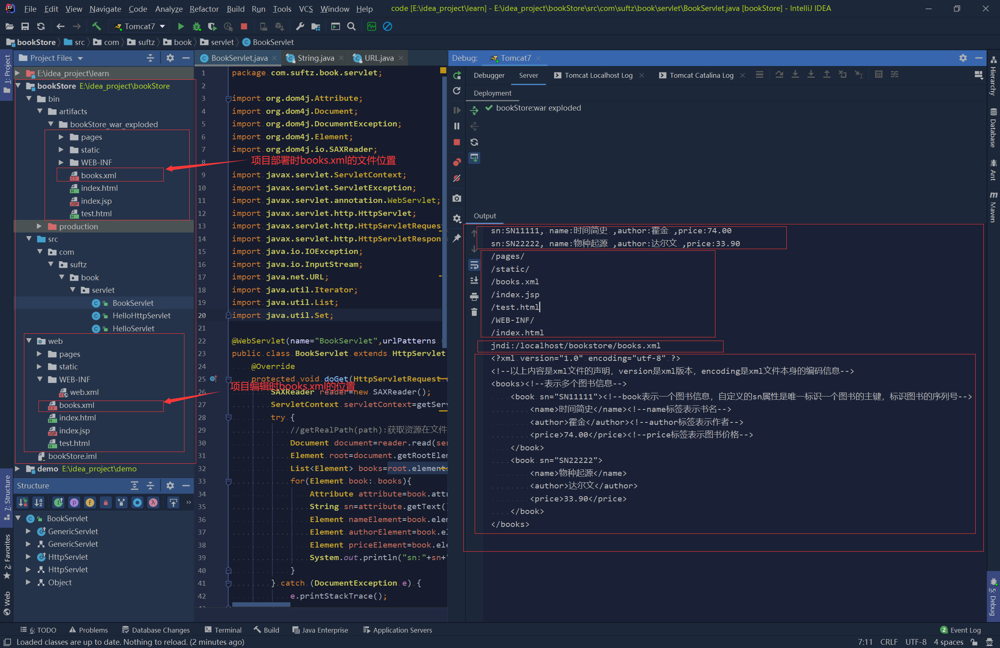

* ServletContext可以像Map一样存取数据，而且因为ServletContext对象是作用于整个工程，所以这些存的数据，在不同的Servlet对象中，使用ServletContext都能取出这些数据

  ```java
  ServletContext servletContext=getServletContext();
  servletContext.setAttribute("user","张三");
  servletContext.setAttribute("password","112233");
  System.out.println(servletContext.getAttribute("user"));
  ```

* ServletContext中的其他方法：
  1. getContextPath()：获取工程名

## 6. Http协议

### 6.1 Http简介

* 什么是协议？
  协议是双方，或多方，相互约定好，都需要遵守的规则，叫协议

* Http协议，就是指，客户端和服务器之间通信时，发送的数据需要遵守的规则，也就是发送数据的格式要求，是有一个规则的，这就是Http协议

* HTTP协议中的数据又称为报文

* HTTP协议（HyperText Transfer Protocol，超文本传输协议）是因特网上应用最为广泛的一种网络传输协议，所有的WWW文件都必须遵守这个标准。

* HTTP是一个基于TCP/IP通信协议来传递数据（HTML 文件, 图片文件, 查询结果等）。

### 6.2 Http工作原理

* HTTP协议工作于客户端-服务端架构上。浏览器作为HTTP客户端通过URL向HTTP服务端即WEB服务器发送所有请求。

* Web服务器有：Apache服务器，IIS服务器（Internet Information Services）等。

* Web服务器根据接收到的请求后，向客户端发送响应信息。

* HTTP默认端口号为80，但是你也可以改为8080或者其他端口。

* HTTP三点注意事项：
  * HTTP是无连接：无连接的含义是限制每次连接只处理一个请求。服务器处理完客户的请求，并收到客户的应答后，即断开连接。采用这种方式可以节省传输时间。
  * HTTP是媒体独立的：这意味着，只要客户端和服务器知道如何处理的数据内容，任何类型的数据都可以通过HTTP发送。客户端以及服务器指定使用适合的MIME-type内容类型。
  * HTTP是无状态：HTTP协议是无状态协议。无状态是指协议对于事务处理没有记忆能力。缺少状态意味着如果后续处理需要前面的信息，则它必须重传，这样可能导致每次连接传送的数据量增大。另一方面，在服务器不需要先前信息时它的应答就较快。

  

* CGI(Common Gateway Interface) 是 HTTP 服务器与你的或其它机器上的程序进行“交谈”的一种工具，其程序须运行在网络服务器上。

  绝大多数的 CGI 程序被用来解释处理来自表单的输入信息，并在服务器产生相应的处理，或将相应的信息反馈给浏览器。CGI 程序使网页具有交互功能。

* 浏览器显示的内容都有 HTML、XML、GIF、Flash 等，浏览器是通过 MIME Type 区分它们，决定用什么内容什么形式来显示。

  注释：MIME Type 是该资源的媒体类型，MIME Type 不是个人指定的，是经过互联网（IETF）组织协商，以 RFC（是一系列以编号排定的文件，几乎所有的互联网标准都有收录在其中） 的形式作为建议的标准发布在网上的，大多数的 Web 服务器和用户代理都会支持这个规范 (顺便说一句，Email 附件的类型也是通过 MIME Type 指定的)。

  媒体类型通常通过 HTTP 协议，由 Web 服务器告知浏览器的，更准确地说，是通过 Content-Type 来表示的。例如：Content-Type：text/HTML。

  通常只有一些互联网上获得广泛应用的格式才会获得一个 MIME Type，如果是某个客户端自己定义的格式，一般只能以 application/x- 开头。

### 6.3 消息结构

* HTTP是基于客户端/服务端（C/S）的架构模型，通过一个可靠的链接来交换信息，是一个无状态的请求/响应协议。

* 一个HTTP"客户端"是一个应用程序（Web浏览器或其他任何客户端），通过连接到服务器达到向服务器发送一个或多个HTTP的请求的目的。

* 一个HTTP"服务器"同样也是一个应用程序（通常是一个Web服务，如Apache Web服务器或IIS服务器等），通过接收客户端的请求并向客户端发送HTTP响应数据。

* HTTP使用统一资源标识符（Uniform Resource Identifiers, URI）来传输数据和建立连接。

* 一旦建立连接后，数据消息就通过类似Internet邮件所使用的格式[RFC5322]和多用途Internet邮件扩展（MIME）[RFC2045]来传送。

* 客户端发送一个HTTP请求到服务器的请求消息包括以下格式：请求行（request line）、请求头部（header）、空行和请求数据四个部分组成，
  
   >如果浏览器发送的是get请求，则请求数据是直接以键值对方式，使用`?`拼接在URL中，如：
   `http://localhost:8080/bookstore/book?username=tom&password=122`
   这种方式表明get请求发送的数据长度是有限的
   而如果是post请求，则发送的请求数据是专门放在报文的最后，如上报文图所示，可以传输很大量的数据
* 请求和响应示例报文：
  请求报文：

  ```text
  GET http://localhost:8080/bookstore/book?username=tom&password=122 HTTP/1.1
  Host: localhost:8080
  Connection: keep-alive
  sec-ch-ua: "Google Chrome";v="87", " Not;A Brand";v="99", "Chromium";v="87"
  sec-ch-ua-mobile: ?0
  Upgrade-Insecure-Requests: 1
  User-Agent: Mozilla/5.0 (Windows NT 10.0; Win64; x64) AppleWebKit/537.36 (KHTML, like Gecko) Chrome/87.0.4280.88 Safari/537.36
  Accept: text/html,application/xhtml+xml,application/xml;q=0.9,image/avif,image/webp,image/apng,*/*;q=0.8,application/signed-exchange;v=b3;q=0.9
  Sec-Fetch-Site: none
  Sec-Fetch-Mode: navigate
  Sec-Fetch-User: ?1
  Sec-Fetch-Dest: document
  Accept-Encoding: gzip, deflate, br
  Accept-Language: zh-CN,zh;q=0.9
  Cookie: Idea-20606f57=726393d0-ed7e-4b12-b21d-c99e728715dc; JSESSIONID=335CABE4245A2F632196D41C2282B47A
  ```

  响应报文:

  ```text
  HTTP/1.1 200 OK
  Server: Apache-Coyote/1.1
  Content-Type: text/html;charset=UTF-8
  Content-Length: 20
  Date: Thu, 07 Jan 2021 02:18:11 GMT

  {'result':'success'}
  ```

  > 响应的http协议格式：
  > 一、响应行
  > 1.响应的协议和版本号：HTTP/1.1
  > 2.响应的状态码：200
  > 3.响应状态描述符：OK
  > 二、响应头
  > 三、响应体：响应体会与响应头单独隔开一空行后再显示

### 6.4 请求方法

* 根据 HTTP 标准，HTTP 请求可以使用多种请求方法。

* HTTP1.0 定义了三种请求方法： GET, POST 和 HEAD方法。

* HTTP1.1 新增了六种请求方法：OPTIONS、PUT、PATCH、DELETE、TRACE 和 CONNECT 方法。

  |序号|方法|描述|
  |:----|:----|:----|
  |1|GET|请求指定的页面信息，并返回实体主体。|
  |2|HEAD|类似于 GET 请求，只不过返回的响应中没有具体的内容，用于获取报头|
  |3|POST|向指定资源提交数据进行处理请求（例如提交表单或者上传文件）。数据被包含在请求体中。POST 请求可能会导致新的资源的建立和/或已有资源的修改。|
  |4|PUT|从客户端向服务器传送的数据取代指定的文档的内容。|
  |5|DELETE|请求服务器删除指定的页面。|
  |6|CONNECT|HTTP/1.1 协议中预留给能够将连接改为管道方式的代理服务器。|
  |7|OPTIONS|允许客户端查看服务器的性能。|
  |8|TRACE|回显服务器收到的请求，主要用于测试或诊断。|
  |9|PATCH|是对 PUT 方法的补充，用来对已知资源进行局部更新 。|

### 6.5 响应头信息

|应答头|说明|
|:----|:----|
|Allow|服务器支持哪些请求方法（如GET、POST等）。|
|Content-Encoding|文档的编码（Encode）方法。只有在解码之后才可以得到Content-Type头指定的内容类型。利用gzip压缩文档能够显著地减少HTML文档的下载时间。Java的GZIPOutputStream可以很方便地进行gzip压缩，但只有Unix上的Netscape和Windows上的IE 4、IE 5才支持它。因此，Servlet应该通过查看Accept-Encoding头（即request.getHeader("Accept-Encoding")）检查浏览器是否支持gzip，为支持gzip的浏览器返回经gzip压缩的HTML页面，为其他浏览器返回普通页面。|
|Content-Length|表示内容长度。只有当浏览器使用持久HTTP连接时才需要这个数据。如果你想要利用持久连接的优势，可以把输出文档写入 ByteArrayOutputStream，完成后查看其大小，然后把该值放入Content-Length头，最后通过byteArrayStream.writeTo(response.getOutputStream()发送内容。|
|**Content-Type**|表示后面的文档属于什么MIME类型。Servlet默认为text/plain，但通常需要显式地指定为text/html。由于经常要设置Content-Type，因此HttpServletResponse提供了一个专用的方法setContentType。|
|Date|当前的GMT时间。你可以用setDateHeader来设置这个头以避免转换时间格式的麻烦。|
|Expires|应该在什么时候认为文档已经过期，从而不再缓存它？|
|Last-Modified|文档的最后改动时间。客户可以通过If-Modified-Since请求头提供一个日期，该请求将被视为一个条件GET，只有改动时间迟于指定时间的文档才会返回，否则返回一个304（Not Modified）状态。Last-Modified也可用setDateHeader方法来设置。|
|Location|表示客户应当到哪里去提取文档。Location通常不是直接设置的，而是通过HttpServletResponse的sendRedirect方法，该方法同时设置状态代码为302。|
|Refresh|表示浏览器应该在多少时间之后刷新文档，以秒计。除了刷新当前文档之外，你还可以通过setHeader("Refresh", "5; URL=http://host/path")让浏览器读取指定的页面。<br>注意这种功能通常是通过设置HTML页面HEAD区的＜META HTTP-EQUIV="Refresh" CONTENT="5;URL=http://host/path"＞实现，这是因为，自动刷新或重定向对于那些不能使用CGI或Servlet的HTML编写者十分重要。但是，对于Servlet来说，直接设置Refresh头更加方便。<br>注意Refresh的意义是"N秒之后刷新本页面或访问指定页面"，而不是"每隔N秒刷新本页面或访问指定页面"。因此，连续刷新要求每次都发送一个Refresh头，而发送204状态代码则可以阻止浏览器继续刷新，不管是使用Refresh头还是＜META HTTP-EQUIV="Refresh" ...＞。<br>注意Refresh头不属于HTTP 1.1正式规范的一部分，而是一个扩展，但Netscape和IE都支持它。|
|Server|服务器名字。Servlet一般不设置这个值，而是由Web服务器自己设置。|
|Set-Cookie|设置和页面关联的Cookie。Servlet不应使用response.setHeader("Set-Cookie", ...)，而是应使用HttpServletResponse提供的专用方法addCookie。参见下文有关Cookie设置的讨论。|
|WWW-Authenticate|客户应该在Authorization头中提供什么类型的授权信息？在包含401（Unauthorized）状态行的应答中这个头是必需的。例如，response.setHeader("WWW-Authenticate", "BASIC realm=＼"executives＼"")。<br>注意Servlet一般不进行这方面的处理，而是让Web服务器的专门机制来控制受密码保护页面的访问（例如.htaccess）。|

### 6.6 状态码

* HTTP状态码
  当浏览者访问一个网页时，浏览者的浏览器会向网页所在服务器发出请求。当浏览器接收并显示网页前，此网页所在的服务器会返回一个包含HTTP状态码的信息头（server header）用以响应浏览器的请求。
  HTTP状态码的英文为HTTP Status Code。

* 下面是常见的HTTP状态码：
  * 200 - 请求成功
  * 301 - 资源（网页等）被永久转移到其它URL
  * 404 - 请求的资源（网页等）不存在
  * 500 - 内部服务器错误

* HTTP状态码分类
  HTTP状态码由三个十进制数字组成，第一个十进制数字定义了状态码的类型，后两个数字没有分类的作用。HTTP状态码共分为5种类型：
  |分类|分类描述|
  |:----|:----|
  |1**|信息，服务器收到请求，需要请求者继续执行操作|
  |2**|成功，操作被成功接收并处理|
  |3**|重定向，需要进一步的操作以完成请求|
  |4**|客户端错误，请求包含语法错误或无法完成请求|
  |5**|服务器错误，服务器在处理请求的过程中发生了错误|

* HTTP状态码列表

  |状态码|状态码英文名称|中文描述|
  |:----|:----|:----|
  |100|Continue|继续。客户端应继续其请求|
  |101|Switching Protocols|切换协议。服务器根据客户端的请求切换协议。只能切换到更高级的协议，例如，切换到HTTP的新版本协议|
  |200|OK|请求成功。一般用于GET与POST请求|
  |201|Created|已创建。成功请求并创建了新的资源|
  |202|Accepted|已接受。已经接受请求，但未处理完成|
  |203|Non-Authoritative Information|非授权信息。请求成功。但返回的meta信息不在原始的服务器，而是一个副本|
  |204|No Content|无内容。服务器成功处理，但未返回内容。在未更新网页的情况下，可确保浏览器继续显示当前文档|
  |205|Reset Content|重置内容。服务器处理成功，用户终端（例如：浏览器）应重置文档视图。可通过此返回码清除浏览器的表单域|
  |206|Partial Content|部分内容。服务器成功处理了部分GET请求|
  |300|Multiple Choices|多种选择。请求的资源可包括多个位置，相应可返回一个资源特征与地址的列表用于用户终端（例如：浏览器）选择|
  |301|Moved Permanently|永久移动。请求的资源已被永久的移动到新URI，返回信息会包括新的URI，浏览器会自动定向到新URI。今后任何新的请求都应使用新的URI代替|
  |302|Found|临时移动。与301类似。但资源只是临时被移动。客户端应继续使用原有URI|
  |303|See Other|查看其它地址。与301类似。使用GET和POST请求查看|
  |304|Not Modified|未修改。所请求的资源未修改，服务器返回此状态码时，不会返回任何资源。客户端通常会缓存访问过的资源，通过提供一个头信息指出客户端希望只返回在指定日期之后修改的资源|
  |305|Use Proxy|使用代理。所请求的资源必须通过代理访问|
  |306|Unused|已经被废弃的HTTP状态码|
  |307|Temporary Redirect|临时重定向。与302类似。使用GET请求重定向|
  |400|Bad Request|客户端请求的语法错误，服务器无法理解|
  |401|Unauthorized|请求要求用户的身份认证|
  |402|Payment Required|保留，将来使用|
  |403|Forbidden|服务器理解请求客户端的请求，但是拒绝执行此请求|
  |404|Not Found|服务器无法根据客户端的请求找到资源（网页）。通过此代码，网站设计人员可设置"您所请求的资源无法找到"的个性页面|
  |405|Method Not Allowed|客户端请求中的方法被禁止|
  |406|Not Acceptable|服务器无法根据客户端请求的内容特性完成请求|
  |407|Proxy Authentication Required|请求要求代理的身份认证，与401类似，但请求者应当使用代理进行授权|
  |408|Request Time-out|服务器等待客户端发送的请求时间过长，超时|
  |409|Conflict|服务器完成客户端的 PUT 请求时可能返回此代码，服务器处理请求时发生了冲突|
  |410|Gone|客户端请求的资源已经不存在。410不同于404，如果资源以前有现在被永久删除了可使用410代码，网站设计人员可通过301代码指定资源的新位置|
  |411|Length Required|服务器无法处理客户端发送的不带Content-Length的请求信息|
  |412|Precondition Failed|客户端请求信息的先决条件错误|
  |413|Request Entity Too Large|由于请求的实体过大，服务器无法处理，因此拒绝请求。为防止客户端的连续请求，服务器可能会关闭连接。如果只是服务器暂时无法处理，则会包含一个Retry-After的响应信息|
  |414|Request-URI Too Large|请求的URI过长（URI通常为网址），服务器无法处理|
  |415|Unsupported Media Type|服务器无法处理请求附带的媒体格式|
  |416|Requested range not satisfiable|客户端请求的范围无效|
  |417|Expectation Failed|服务器无法满足Expect的请求头信息|
  |500|Internal Server Error|服务器内部错误，无法完成请求|
  |501|Not Implemented|服务器不支持请求的功能，无法完成请求|
  |502|Bad Gateway|作为网关或者代理工作的服务器尝试执行请求时，从远程服务器接收到了一个无效的响应|
  |503|Service Unavailable|由于超载或系统维护，服务器暂时的无法处理客户端的请求。延时的长度可包含在服务器的Retry-After头信息中|
  |504|Gateway Time-out|充当网关或代理的服务器，未及时从远端服务器获取请求|
  |505|HTTP Version not supported|服务器不支持请求的HTTP协议的版本，无法完成处理|

### 6.7 Content-Type

* Content-Type（内容类型），一般是指网页中存在的 Content-Type，用于定义网络文件的类型和网页的编码，决定浏览器将以什么形式、什么编码读取这个文件，这就是经常看到一些网页上点击一个地方是下载一个文件或一张图片，而有些地方点击是打开一个网页或者显示一个图片或者文件的原因。
* Content-Type 告诉客户端实际返回的内容的内容类型，然后浏览器就会根据这个信息来采取不同的方式表现(展示)返回的数据

* MIME是HTTP协议中的数据类型
* MIME的英文全称是Multipurpose Internet Mail Extensions，多功能的Internet邮件扩充服务，MIME类型的格式是“大类型/小类型”,并与某一种文件的扩展名相对应

```text
Content-Type: text/html; charset=utf-8
Content-Type: multipart/form-data; boundary=something
```

* 常见的媒体格式类型如下：
  text/html ： HTML格式
  text/plain ：纯文本格式
  text/xml ： XML格式
  image/gif ：gif图片格式
  image/jpeg ：jpg图片格式
  image/png：png图片格式

* 以application开头的媒体格式类型：
  application/xhtml+xml ：XHTML格式
  application/xml： XML数据格式
  application/atom+xml ：Atom XML聚合格式
  application/json： JSON数据格式
  application/pdf：pdf格式
  application/msword ： Word文档格式
  application/octet-stream ： 二进制流数据（如常见的文件下载）
  application/x-www-form-urlencoded ： `<form encType="">`标签中默认的encType，form表单数据被编码为key/value格式发送到服务器（表单默认的提交数据的格式）
* 另外一种常见的媒体格式是上传文件之时使用的：
  multipart/form-data ： 需要在表单中进行文件上传时，就需要使用该格式

### 6.8 Servlet中的请求

* get请求有哪些：
  1. form标签中method=get
  2. a标签
  3. link标签引入css
  4. script标签引入js文件
  5. img标签引入图片
  6. iframe标签引入html页面
  7. 在浏览器地址栏直接输入地址后访问
  8. ajax异步请求中method=get
* post请求有哪些：
  1. form标签中method=post
  2. ajax异步请求中method=post

## 7. HttpServletRequest类

* 每次只要有请求进入Tomcat服务器，它就会把请求过来的HTTP协议信息解析封装到ServletRequest,然后传递到service方法中给开发者使用，在HttpServlet类中service方法进行了请求分发，也会把ServletRequest类的子类HttpServletRequest对象传递到请求处理的方法中，此时开发者就可以获取到所有的请求信息

### 7.1 获取客户机信息

|方法|描述|
|:----|:----|
|getRequestURL()|返回客户端发出请求时的完整URL。|
|getRequestURI()|返回请求行中的参数部分。|
|getServletPath()|返回映射到工程部分的url|
|getQueryString()|方法返回请求行中的参数部分（参数名+值）|
|getRemoteUser()|返回远程用户信息，可以被用来作为权限管理|
|getRemoteHost()|返回发出请求的客户机的完整主机名。|
|getRemoteAddr()|返回发出请求的客户机的IP地址。|
|getPathInfo()|返回请求URL中的额外路径信息。额外路径信息是请求URL中的位于Servlet的路径之后和查询参数之前的内容，它以"/"开头。|
|getRemotePort()|返回客户机所使用的网络端口号。|
|getLocalAddr()|返回WEB服务器的IP地址。|
|getLocalName()|返回WEB服务器的主机名。|
|getLocale()|返回客户端所在的语言区域，便于使用国际化|
|getLocalPort()|返回WEB服务器的服务端口号|
|getContextPath()|获取服务器工程名,格式为`/工程名`|

```java
System.out.println("getRequestURL():"+req.getRequestURL());//    http://localhost:8080/bookstore/book
System.out.println("getRequestURI():"+req.getRequestURI());//    /bookstore/book
System.out.println("getServletPath():"+req.getRequestURI());//    /book
System.out.println("getQueryString():"+req.getQueryString());//  username=tom&password=122
System.out.println(req.getRemoteUser());//null
System.out.println(req.getRemoteAddr());//127.0.0.1
System.out.println(req.getRemoteHost());//127.0.0.1
System.out.println(req.getRemotePort());//57950
System.out.println(req.getPathInfo());//null
System.out.println(req.getLocalAddr());//127.0.0.1
System.out.println(req.getLocalName());//agile
System.out.println(req.getLocale());//zh_CN
System.out.println(req.getLocalPort());//8080
```

### 7.2 获取客户机请求头

|方法|描述|
|:----|:----|
|getHeader(string name)|以 String 的形式返回指定请求头的值。如果该请求不包含指定名称的头，则此方法返回 null。如果有多个具有相同名称的头，则此方法返回请求中的第一个头。头名称是不区分大小写的。可以将此方法与任何请求头一起使用|
|getHeaders(String name)|以 String 对象的 Enumeration 的形式返回指定请求头的所有值|
|getHeaderNames()|返回此请求包含的所有头名称的枚举。如果该请求没有头，则此方法返回一个空枚举|

```java
Enumeration<String> headerNames= req.getHeaderNames();
while(headerNames.hasMoreElements()){
    String headerName=headerNames.nextElement();
    System.out.println(headerName+"："+req.getHeader(headerName));
}
```

打印结果如下：

```console
host：localhost:8080
connection：keep-alive
cache-control：max-age=0
sec-ch-ua："Google Chrome";v="87", " Not;A Brand";v="99", "Chromium";v="87"
sec-ch-ua-mobile：?0
upgrade-insecure-requests：1
user-agent：Mozilla/5.0 (Windows NT 10.0; Win64; x64) AppleWebKit/537.36 (KHTML, like Gecko) Chrome/87.0.4280.88 Safari/537.36
accept：text/html,application/xhtml+xml,application/xml;q=0.9,image/avif,image/webp,image/apng,*/*;q=0.8,application/signed-exchange;v=b3;q=0.9
sec-fetch-site：none
sec-fetch-mode：navigate
sec-fetch-user：?1
sec-fetch-dest：document
accept-encoding：gzip, deflate, br
accept-language：zh-CN,zh;q=0.9
```

### 7.3 获取客户机请求参数

|方法|描述|
|:----|:----|
|getParameter(String name)|根据name获取请求参数(常用)|
|getParameterValues(String name)|根据name获取请求参数列表(常用)|
|getParameterMap()|返回的是一个Map类型的值，该返回值记录着前端（如jsp页面）所提交请求中的请求参数和请求参数值的映射关系。(编写框架时常用)|

地址栏输入如下：
`http://localhost:8080/bookstore/book?username=tom&username=jack&password=122`

```java
System.out.println(req.getParameter("password"));//122
String[] values=req.getParameterValues("username");
System.out.println(Arrays.toString(values));//[tom, jack]

Map<String,String[]> map=req.getParameterMap();
Set<Map.Entry<String,String[]>> entrySet=map.entrySet();
Iterator<Map.Entry<String,String[]>> iter=entrySet.iterator();
while(iter.hasNext()){
    Map.Entry<String,String[]> entry=iter.next();
    String key=entry.getKey();
    String[] value=entry.getValue();
    System.out.println(key+"："+Arrays.toString(value));
    //password：[122]
    //username：[tom, jack]
}
```

### 7.4 请求参数乱码

* 在获取数据之前使用`req.setCharacterEncoding("utf-8");`
* Tomcat容器自动会对HTTP请求中参数进行URLDecode处理，所以在Servlet程序中不需要使用 URLEncode 和 URLDecode 来进行转换特殊字符

### 7.5 request存取数据

* request对象同时也是一个域对象(Map容器)，开发人员通过request对象在实现转发时，把数据通过request对象带给其它web资源处理。

```java
String resData="success";
request.setAttribute("resData", resData);
request.getRequestDispatcher("/test.jsp").forward(request, response);
```

* request对象作为一个域对象(Map容器)使用时，主要是通过以下的四个方法来操作
  1. setAttribute(String name,Object o)方法，将数据作为request对象的一个属性存放到request对象中
  2. getAttribute(String name)方法，获取request对象的name属性的属性值
  3. removeAttribute(String name)方法，移除request对象的name属性
  4. getAttributeNames方法，获取request对象的所有属性名，返回的是一个Enumeration

### 7.6 请求转发

* 请求的转发
  服务器收到请求后，从一次资源跳转到另一个自由的操作叫做请求转发

1. 转发，也是服务器跳转，相当于方法调用，在执行当前文件的过程中转向执行目标文件，两个文件(当前文件和目标文件)属于同一次请求，前后共用一个request，可以通过此来传递一些数据或者session信息，request.setAttribute()和request.getAttribute()。

2. 在前后两次执行后，地址栏不变，仍是当前文件的地址。

3. 不能转向到本web应用之外的页面和网站，所以转向的速度快。

4. URL中所包含的“/”表示应用程序(项目)的路径。

* 请求转发的使用示例：

  ```java
  RequestDispatcher requestDispatcher=req.getRequestDispatcher("/servlet2");
  requestDispatcher.forward(req,resp);
  ```

  >这里的`/`相当于表示的是`http://ip:port/工程名`,所以不需要写工程名

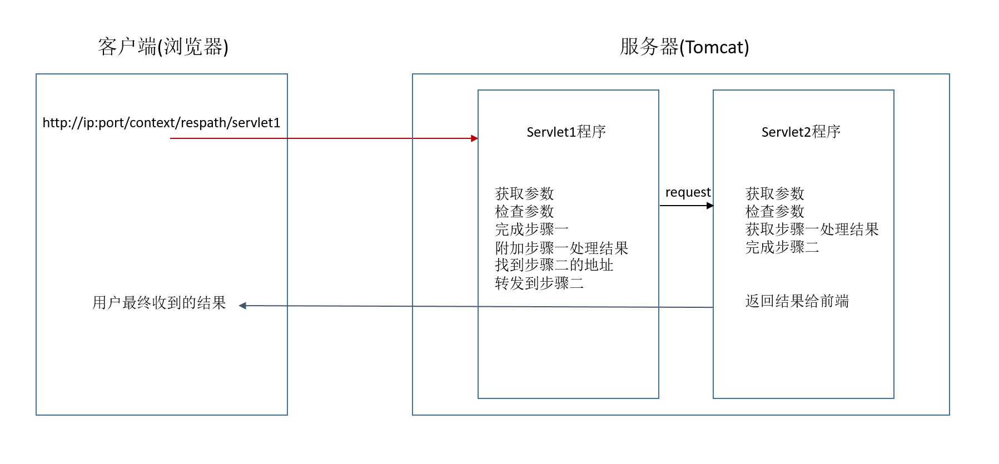

* 请求转发的使用场景：
  使用一个Servlet来处理请求，然后将结果使用request存储结果信息，然后再转发请求到一个jsp页面，在jsp页面使用jsp的模板语言将数据显示出来，最后jsp页面被Tomcat解析后返回给客户端浏览器(jsp页面本质也是一个Servlet程序)
  > 现在很少这样来显示数据，而是前端和后端分开，它们之间使用json来传递数据，显示数据也是完全由前端来完成：前端发送ajax请求到后端，前端拿到后端返回的数据后，使用js的DOM操作加载数据到浏览器页面上

* 请求转发的特点：
  1. 浏览器地址栏没有变化
  2. 它们是一个请求
  3. 它们共享Request域中的数据
  4. 可以转发到WEB-INF目录下，以此来访问没有权限的资源(这种资源直接通过地址栏输入无法访问)
  5. 无法访问工程以外的资源（如果转发的地址传参为`http://www.baidu.com`,只会认为是在工程下找这个字符串的资源，即`http://ip:port/工程名/http://www.baidu.com`）

* base标签的作用
  页面中的相对地址都是基于当前资源文件的地址的，但是由于如果这个页面是被请求转发而来的，也就是说如果当前展示的页面，它在地址栏上的地址和它在工程资源中的位置并不一致，那此时这个文件中所有相对地址的资源引用都会出问题，因为此时这些相对地址的参照地址已经不是文件在工程的资源地址了，而是地址栏上的地址，那就会使得页面上的相对地址的引用会失效
  如果有一个处理，可以让页面上的所有相对地址引用，不随着页面在地址栏的地址信息而变化，而是使用一个指定的地址作为参照

* base标签是在head标签里面，设置页面相对路径工作时参照的地址，其href属性就是参数的地址值
`<base href="/contextPath/resPath/">`
**href属性值最后的`/`不能省略,页面上的相对地址引用都会以base标签里的href属性值来作为参考地址**
如果页面上的地址引用是以`/`开头，此时就是绝对地址的引用，不受base标签影响

* web中`/`的不同意义：
  * `/`如果被浏览器解析，得到的地址为 `http://ip:port/`
    如，`<a href="/">斜杠的地址指向</a>`

  * `/`如果被服务器解析，得到的地址是 `http://ip:port/工程访问名`
    1. `<url-pattern>/servlet1</url-pattern>`
    2. `servletContent.getRealPath("/");`
    3. `request.getRequestDispatcher("/");`

    特殊情况：`response.sendRedirect("/");`这是得到`http://ip:port`,因为这是重定向，重定向是两个请求，这个地址`/`会返回给前端,然后前端去重新请求这个地址，这个地址前端解析出来，就是`http://ip:port`

## 8. HttpServletResponse类

### 8.1 响应数据

* HttpServletResponse类和HttpServletRequest类一样，每次请求进来，Tomcat服务器都会创建一个Response对象传递给Servlet程序使用。HttpServletRequest表示请求过来的信息，HttpServletResponse表示所有响应的信息
* 当需要返回信息给客户端浏览器，可以通过HttpServletResponse对象来完成

* 两个输出流的说明：
  1. 字节流getOutputStream()：常用于下载(传递二进制数据)
  2. 字符流getWriter()：常用于回传字符串数据(常用)
  3. 输出流使用后需要关闭
  > 在一次请求中，为了响应数据信息，这两个流只能同时使用一个，只能选择一个来使用

* 给客户端回传字符串数据
  1. 获取到Writer对象
  2. 向Writer对象中写字符串内容
  3. 关闭Writer流对象

### 8.2 设置响应数据的编码

```java
//第一种方式：
//设置服务器字符集为UTF-8
resp.setCharacterEncoding("utf-8");
//通过响应头，设置浏览器也使用utf-8字符集也解析响应数据
resp.setHeader("Content-Type","text/html;charset=UTF-8");

//第二种方式：
//会同时设置服务器和客户端都使用UTF-8字符集编码，还设置了响应头
resp.setContentType("text/html;charset=utf-8");

OutputStream os=resp.getOutputStream();
```

> 设置编码必须在获取流对象之前才能有效

### 8.3 请求重定向

* 请求重定向，是指客户端给服务器发请求，然后服务器告诉客户端，去新地址访问(旧地址可能被废弃)

1. 重定向，也是客户端跳转，相当于客户端向服务端发送请求之后，服务器返回一个响应，客户端接收到响应之后又向服务端发送一次请求，一共是2次请求，前后页不共用一个request，不能读取转向前通过request.setAttribute()设置的属性值。
2. 在前后两次执行后，地址栏发生改变，是目标文件的地址。
3. 可以转向到本web应用之外的页面和网站，所以转向的速度相对要慢。
4. URL种所包含的"/"表示根目录的路径。

* 请求重定向的示例：

  ```java
  //第一种方式：
  //设置响应状态码为302
  resp.setStatus(302);
  //设置响应头，告知新的地址
  resp.setHeader("Location",req.getContentPath()+"/servlet2");

  //第二种方式：
  resp.sendRedirect(req.getContentPath()+"/servlet2");
  ```

> 因为重定向里地址中的`/`表示的是`http://ip:port/`，所以如果只写了"/servlet2"那就会漏掉工程名,因此需要加上req.getContextPath()

1. 使用相对路径在重定向和转发中没有区别。在重定向中，如果返回的Location地址是相对地址，则会根据当前页面地址栏上地址作为参考，即使当前页面有base标签，base标签不起作用
   测试过程：
   (1).在地址栏输入地址  `http://localhost:8080/bookstore/book/haha`
   (2).有一个Servlet1,处理请求地址为`/book/haha`的请求，这个Servlet1处理就是请求转发到一个html页面资源test.html中，请求转发核心代码为`req.getRequestDispatcher("/test.html").forward(req,resp);`,该test.html资源在工程根目录下,即位置是`http://localhost:8080/bookstore/test.html`
   (3).从下面的tset.html源码可知，使用了base标签，点击按钮"发送get请求"，可知，这个请求的地址是`http://localhost:8080/bookstore/book/hello`，因为以base标签作为相对路径的参照了

   ```html
   <html>
     <head>
       <meta charset="UTF-8">
       <title>$Title$</title>
       <base href="/bookstore/">
     </head>
     <body>
     <form method="get" action="book/hello">
       <input type="submit" value="发送get请求">
     </form>
     </body>
   </html>
   ```

   (4).又有一个servlet2,处理请求地址为`/book/hello`的请求，这个Servlet2处理就是将请求重定向到一个html资源中,重定向核心代码为`resp.sendRedirect("page/user/login.html");`,该资源在工程中的位置是`http://localhost:8080/bookstore/page/user/login.html`。
   (5).重定向后，浏览器自动更改请求地址为：`http://localhost:8080/bookstore/book/page/user/login.html`,而不是在以base标签作为相对地址的参考为`http://localhost:8080/bookstore/page/user/login.html`
   >这说明使用相对地址是不靠谱的，最好使用绝对地址，工程名可以使用getContextPath()来获取

2. 重定向和请求转发使用绝对路径时，根/路径代表了不同含义：请求转发时/代表工程根目录，重定向时/代表服务器的根目录
3. 重定向的绝对地址可以是完整的地址，如 `http://www.baidu.com`

* 特殊的应用：对数据进行修改、删除、添加操作的时候，应该用response.sendRedirect()。如果是采用了request.getRequestDispatcher().forward(request,response)，那么操作前后的地址栏都不会发生改变，仍然是修改的控制器，如果此时再对当前页面刷新的话，就会重新发送一次请求对数据进行修改，这也就是有的人在刷新一次页面就增加一条数据的原因。

* 如何采用第二种方式传递数据：
  1. 可以选择session，但要在第二个文件中删除；
  2. 可以在请求重定向的url中带上参数，如"add.htm?username=tom&password=1122"

* 请求重定向的特点：
  1. 浏览器地址栏会发生变化
  2. 两次请求
  3. 不共享Request域中的数据
  4. 不能访问WEB-INF下的资源
  5. 可以访问工程外的资源

* 请求重定向应用场景：
  提交表单，处理成功后 redirect 到另一个 jsp，防止表单重复提交，浏览器里 URL 变了

> ajax请求是不支持重定向的，只有用form表单提交的请求才能重定向

## 9. jsp

### 9.1 认识jsp

#### 9.1.1 什么是JSP

* JSP全称Java Server Pages，是一种动态网页开发技术。它使用JSP标签在HTML网页中插入Java代码。标签通常以<%开头以%>结束。

* JSP是一种Java servlet，主要用于实现Java web应用程序的用户界面部分。网页开发者们通过结合HTML代码、XHTML代码、XML元素以及嵌入JSP操作和命令来编写JSP。

* JSP通过网页表单获取用户输入数据、访问数据库及其他数据源，然后动态地创建网页。

* JSP标签有多种功能，比如访问数据库、记录用户选择信息、访问JavaBeans组件等，还可以在不同的网页中传递控制信息和共享信息。

* 为什么使用JSP？
  JSP程序与CGI程序有着相似的功能，但和CGI程序相比，JSP程序有如下优势：
  * 性能更加优越，因为JSP可以直接在HTML网页中动态嵌入元素而不需要单独引用CGI文件。
  * 服务器调用的是已经编译好的JSP文件，而不像CGI/Perl那样必须先载入解释器和目标脚本。
  * JSP 基于Java Servlet API，因此，JSP拥有各种强大的企业级Java API，包括JDBC，JNDI，EJB，JAXP等等。
  * JSP页面可以与处理业务逻辑的 Servlet 一起使用，这种模式被Java servlet 模板引擎所支持。
  * 最后，JSP是Java EE不可或缺的一部分，是一个完整的企业级应用平台。这意味着JSP可以用最简单的方式来实现最复杂的应用。

* JSP的优势
  * 与ASP相比：JSP有两大优势。首先，动态部分用Java编写，而不是VB或其他MS专用语言，所以更加强大与易用。第二点就是JSP易于移植到非MS平台上。
  * 与纯 Servlet 相比：JSP可以很方便的编写或者修改HTML网页而不用去面对大量的println语句。
  * 与SSI相比：SSI无法使用表单数据、无法进行数据库链接。
  * 与JavaScript相比：虽然JavaScript可以在客户端动态生成HTML，但是很难与服务器交互，因此不能提供复杂的服务，比如访问数据库和图像处理等等。
  * 与静态HTML相比：静态HTML不包含动态信息。

#### 9.1.2 JSP原理

* JSP 处理过程：
  1. 就像其他普通的网页一样，在浏览器地址栏输入jsp页面地址，发送一个 HTTP 请求给服务器。
  2. Web 服务器识别出这是一个对 JSP 网页的请求，并且将该请求传递给 JSP 引擎。通过使用 URL或者 .jsp 文件来完成。
  3. JSP 引擎从磁盘中载入 JSP 文件，然后将它们转化为 Servlet。这种转化只是简单地将所有模板文本改用 println() 语句，并且将所有的 JSP 元素转化成 Java 代码。
  4. JSP 引擎将 Servlet 编译成可执行类，并且将原始请求传递给 Servlet 引擎。
  5. Web 服务器的某组件将会调用 Servlet 引擎，然后载入并执行 Servlet 类。在执行过程中，Servlet 产生 HTML 格式的输出并将其内嵌于 HTTP response 中上交给 Web 服务器。
  6. Web 服务器以静态 HTML 网页的形式将 HTTP response 返回到您的浏览器中。
  7. 最终，Web 浏览器处理 HTTP response 中动态产生的HTML网页，就好像在处理静态网页一样。

* 一般情况下，JSP 引擎会检查 JSP 文件对应的 Servlet 是否已经存在，并且检查 JSP 文件的修改日期是否早于 Servlet。如果 JSP 文件的修改日期早于对应的 Servlet，那么容器就可以确定 JSP 文件没有被修改过并且 Servlet 有效。这使得整个流程与其他脚本语言（比如 PHP）相比要高效快捷一些。
* 总的来说，JSP 网页就是用另一种方式来编写 Servlet 而不用成为 Java 编程高手。除了解释阶段外，JSP 网页几乎可以被当成一个普通的 Servlet 来对待。

> 可以知道，JSP的本质就是一个Servlet类：访问JSP页面时，将JSP页面中的HTML页面元素等静态内容直接写入到流中，如果有遇到Java代码则运行，产生结果后也随着静态内容写入到流中
>在Tomcat下的work/Catalina/localhost下，Tomcat会创建由jsp页面转换的Servlet程序，并编译。

* 示例index.jsp页面转换过来的index_jsp.java文件

```java
/*
 * Generated by the Jasper component of Apache Tomcat
 * Version: Apache Tomcat/7.0.107
 * Generated at: 2021-01-08 09:25:27 UTC
 * Note: The last modified time of this file was set to
 *       the last modified time of the source file after
 *       generation to assist with modification tracking.
 */
package org.apache.jsp;

import javax.servlet.*;
import javax.servlet.http.*;
import javax.servlet.jsp.*;

public final class index_jsp extends org.apache.jasper.runtime.HttpJspBase
        implements org.apache.jasper.runtime.JspSourceDependent {

    private static final javax.servlet.jsp.JspFactory _jspxFactory =
            javax.servlet.jsp.JspFactory.getDefaultFactory();

    private static java.util.Map<java.lang.String,java.lang.Long> _jspx_dependants;

    private volatile javax.el.ExpressionFactory _el_expressionfactory;
    private volatile org.apache.tomcat.InstanceManager _jsp_instancemanager;

    public java.util.Map<java.lang.String,java.lang.Long> getDependants() {
        return _jspx_dependants;
    }

    public javax.el.ExpressionFactory _jsp_getExpressionFactory() {
        if (_el_expressionfactory == null) {
            synchronized (this) {
                if (_el_expressionfactory == null) {
                    _el_expressionfactory = _jspxFactory.getJspApplicationContext(getServletConfig().getServletContext()).getExpressionFactory();
                }
            }
        }
        return _el_expressionfactory;
    }

    public org.apache.tomcat.InstanceManager _jsp_getInstanceManager() {
        if (_jsp_instancemanager == null) {
            synchronized (this) {
                if (_jsp_instancemanager == null) {
                    _jsp_instancemanager = org.apache.jasper.runtime.InstanceManagerFactory.getInstanceManager(getServletConfig());
                }
            }
        }
        return _jsp_instancemanager;
    }

    public void _jspInit() {
    }

    public void _jspDestroy() {
    }

    public void _jspService(final javax.servlet.http.HttpServletRequest request, final javax.servlet.http.HttpServletResponse response)
            throws java.io.IOException, javax.servlet.ServletException {

        final javax.servlet.jsp.PageContext pageContext;
        javax.servlet.http.HttpSession session = null;
        final javax.servlet.ServletContext application;
        final javax.servlet.ServletConfig config;
        javax.servlet.jsp.JspWriter out = null;
        final java.lang.Object page = this;
        javax.servlet.jsp.JspWriter _jspx_out = null;
        javax.servlet.jsp.PageContext _jspx_page_context = null;


        try {
            response.setContentType("text/html;charset=UTF-8");
            pageContext = _jspxFactory.getPageContext(this, request, response,
                    null, true, 8192, true);
            _jspx_page_context = pageContext;
            application = pageContext.getServletContext();
            config = pageContext.getServletConfig();
            session = pageContext.getSession();
            out = pageContext.getOut();
            _jspx_out = out;

            out.write("\n");
            out.write("\n");
            out.write("<html>\n");
            out.write("  <head>\n");
            out.write("    <title>$Title$</title>\n");
            out.write("  </head>\n");
            out.write("  <body>\n");
            out.write("  <form method=\"post\" action=\"hello\">\n");
            out.write("    <input type=\"submit\" value=\"发送post请求\">\n");
            out.write("  </form>\n");
            out.write("  </body>\n");
            out.write("</html>\n");
        } catch (java.lang.Throwable t) {
            if (!(t instanceof javax.servlet.jsp.SkipPageException)){
                out = _jspx_out;
                if (out != null && out.getBufferSize() != 0)
                    try {
                        if (response.isCommitted()) {
                            out.flush();
                        } else {
                            out.clearBuffer();
                        }
                    } catch (java.io.IOException e) {}
                if (_jspx_page_context != null) _jspx_page_context.handlePageException(t);
                else throw new ServletException(t);
            }
        } finally {
            _jspxFactory.releasePageContext(_jspx_page_context);
        }
    }
}
```

>这里面用到的类是Tomcat给自己的服务器容器使用的，容器在处理jsp页面时使用，而不是给开发者使用的
>org.apache.jasper.runtime.HttpJspBase类是HttpServlet的子类，也说明了由jsp转换而来的Java类本质上还是一个Servlet程序(可以从Tomcat的源码中查看)

* jsp头部的page指令
  jsp的page指令可以修改jsp页面中的一些重要的属性或者行为。
  `<%@ page contentType="text/html;charset=UTF-8" language="java" %>`

  1. language属性：表示jsp翻译后是什么语言文件，暂时只支持java
  2. contentType属性：表示jsp返回的数据类型是什么，对应源码中的response.setContentType()参数的值
  3. pageEncoding属性：表示当前jsp页面文件本身的字符集
  4. import属性：跟java源代码中一样，用于导包，导类
  5. autoFlush属性：设置out输出流缓冲区满，是否自动刷新缓冲区，默认是true，这个值不要修改，否则缓冲区满后容器溢出
  6. buffer属性：设置out缓冲区的大小，默认是8kb
  7. errorPage属性：设置当jsp页面运行时出错，自动跳转去的错误页面路径(路径以`/`开头,`/`表示`http://ip:port/工程名`)
  8. isErrorPage属性：设置当前jsp页面是否是错误信息页面，默认是false,如果是true,可以获取异常信息(当设置为true是，jsp的对应servlet类的处理函数中会有一个异常类对象局部变量)
  9. session属性：设置访问当前jsp页面，是否会创建HttpSession对象，默认是true
  10. extends属性：设置jsp页面对应的servlet类默认继承的类。一般不去修改，jsp默认配置即可

  ```java
  <%@ page import="java.util.HashMap" %>
  <%@ page contentType="text/html;charset=UTF-8" language="java"
           autoFlush="true"
           buffer="8kb"
           errorPage="/index.jsp"
           pageEncoding="utf-8"
           isErrorPage="false"
           session="true"
  %>
  <html>
  <head>
      <title>$Title$</title>
  </head>
  <body>
  <form method="post" action="hello">
      <input type="submit" value="发送post请求">
  </form>
  </body>
  </html>
  ```

#### 9.1.3 声明脚本

```java
<%@ page import="java.util.Map" %>
<%@ page import="java.util.HashMap" %>
<%@ page contentType="text/html;charset=UTF-8" language="java"%>

<%--1.声明类属性--%>
<%!
    private Integer id;
    private String name="Tom";
    private static Map<String,Object> map;
%>

<%--2.声明static静态代码块--%>
<%!
    {
        map=new HashMap<String,Object>();
        map.put("key1","value1");
        map.put("key2","value2");
    }
%>

<%--3.声明类方法--%>
<%!
    public String getName(){
        return this.name;
    }
%>
<%--4.声明内部类--%>
<%!
    public static class HelloWorld{
        public String words="Hi";
        public void sayHi(){
            System.out.println(this.words);
        }
    }
%>
<html>
<head>
    <title>$Title$</title>
</head>
<body>
<form method="post" action="hello">
    <input type="submit" value="发送post请求">
</form>
<%=getName()%>
</body>
</html>
```

以上代码被Tomcat解析成Servlet程序，源代码为：

```java
package org.apache.jsp;

import javax.servlet.*;
import javax.servlet.http.*;
import javax.servlet.jsp.*;
import java.util.Map;
import java.util.HashMap;

public final class index_jsp extends org.apache.jasper.runtime.HttpJspBase
    implements org.apache.jasper.runtime.JspSourceDependent {


    private Integer id;
    private String name="Tom";
    private static Map<String,Object> map;


    {
        map=new HashMap<String,Object>();
        map.put("key1","value1");
        map.put("key2","value2");
    }


    public String getName(){
        return this.name;
    }


    public static class HelloWorld{
        public String words="Hi";
        public void sayHi(){
            System.out.println(this.words);
        }
    }

  private static final javax.servlet.jsp.JspFactory _jspxFactory =
          javax.servlet.jsp.JspFactory.getDefaultFactory();

  private static java.util.Map<java.lang.String,java.lang.Long> _jspx_dependants;

  private volatile javax.el.ExpressionFactory _el_expressionfactory;
  private volatile org.apache.tomcat.InstanceManager _jsp_instancemanager;

  public java.util.Map<java.lang.String,java.lang.Long> getDependants() {
    return _jspx_dependants;
  }

  public javax.el.ExpressionFactory _jsp_getExpressionFactory() {
    if (_el_expressionfactory == null) {
      synchronized (this) {
        if (_el_expressionfactory == null) {
          _el_expressionfactory = _jspxFactory.getJspApplicationContext(getServletConfig().getServletContext()).getExpressionFactory();
        }
      }
    }
    return _el_expressionfactory;
  }

  public org.apache.tomcat.InstanceManager _jsp_getInstanceManager() {
    if (_jsp_instancemanager == null) {
      synchronized (this) {
        if (_jsp_instancemanager == null) {
          _jsp_instancemanager = org.apache.jasper.runtime.InstanceManagerFactory.getInstanceManager(getServletConfig());
        }
      }
    }
    return _jsp_instancemanager;
  }

  public void _jspInit() {
  }

  public void _jspDestroy() {
  }

  public void _jspService(final javax.servlet.http.HttpServletRequest request, final javax.servlet.http.HttpServletResponse response)
        throws java.io.IOException, javax.servlet.ServletException {

    final javax.servlet.jsp.PageContext pageContext;
    javax.servlet.http.HttpSession session = null;
    final javax.servlet.ServletContext application;
    final javax.servlet.ServletConfig config;
    javax.servlet.jsp.JspWriter out = null;
    final java.lang.Object page = this;
    javax.servlet.jsp.JspWriter _jspx_out = null;
    javax.servlet.jsp.PageContext _jspx_page_context = null;


    try {
      response.setContentType("text/html;charset=UTF-8");
      pageContext = _jspxFactory.getPageContext(this, request, response,
      			"/index.jsp", true, 8192, true);
      _jspx_page_context = pageContext;
      application = pageContext.getServletContext();
      config = pageContext.getServletConfig();
      session = pageContext.getSession();
      out = pageContext.getOut();
      _jspx_out = out;

      out.write("\n");
      out.write("\n");
      out.write("\n");
      out.write("\n");
      out.write('\n');
      out.write('\n');
      out.write('\n');
      out.write('\n');
      out.write('\n');
      out.write('\n');
      out.write('\n');
      out.write('\n');
      out.write('\n');
      out.write("\n");
      out.write("<html>\n");
      out.write("<head>\n");
      out.write("    <title>$Title$</title>\n");
      out.write("</head>\n");
      out.write("<body>\n");
      out.write("<form method=\"post\" action=\"hello\">\n");
      out.write("    <input type=\"submit\" value=\"发送post请求\">\n");
      out.write("</form>\n");
      out.print(getName());
      out.write("\n");
      out.write("</body>\n");
      out.write("</html>\n");
    } catch (java.lang.Throwable t) {
      if (!(t instanceof javax.servlet.jsp.SkipPageException)){
        out = _jspx_out;
        if (out != null && out.getBufferSize() != 0)
          try {
            if (response.isCommitted()) {
              out.flush();
            } else {
              out.clearBuffer();
            }
          } catch (java.io.IOException e) {}
        if (_jspx_page_context != null) _jspx_page_context.handlePageException(t);
        else throw new ServletException(t);
      }
    } finally {
      _jspxFactory.releasePageContext(_jspx_page_context);
    }
  }
}

```

#### 9.1.4 代码脚本

* 代码脚本的格式是：

  ```java
  <%
      //java语句
  %>
  ```

* 代码脚本的作用是：可以在jsp页面中，直接使用Java语句编写需要的功能

* 代码脚本的特点：
  1. 代码脚本翻译之后都在_jspService()方法中
  2. 代码脚本由于翻译到_jspService()中，所以在_jspService()方法中可以使用的对象，都可以直接在jsp页面上使用
  3. 多个代码脚本可以是单独不完整的，但是拼接到一起是完整正确的语句后，也可以执行

```java
<%@ page import="java.util.Map" %>
<%@ page import="java.util.HashMap" %>
<%@ page contentType="text/html;charset=UTF-8" language="java"
%>

<%--1.声明类属性--%>
<%!
    private Integer id;
    private String name="Tom";
    private static Map<String,Object> map;
%>

<%--2.声明static静态代码块--%>
<%!
    {
        map=new HashMap<String,Object>();
        map.put("key1","value1");
        map.put("key2","value2");
    }
%>

<%--3.声明类方法--%>
<%!
    public String getName(){
        return this.name;
    }
%>
<%--4.声明内部类--%>
<%!
    public static class HelloWorld{
        public String words="Hi";
        public void sayHi(){
            System.out.println(this.words);
        }
    }
%>
<html>
<head>
    <title>$Title$</title>
</head>
<body>
<form method="post" action="hello">
    <input type="submit" value="发送post请求">
</form>
<div>
<%
    boolean weather=true;
    if(weather){
        System.out.println("今天好天气");
        out.write("今天好天气<br>");
    }else{
        System.out.println("今天坏天气");
        out.write("今天坏天气<br>");
    }
%>

<%
    int sum=0;
    for(int i=1;i<=100;i++){
        sum+=i;
    }
    System.out.println("1-100求和为："+sum+"");
    out.write("1-100求和为："+sum+"<br>");
%>

<%--request对象是service方法中已存在的对象，可以直接使用--%>
<%--out对象也是service方法中已存在的对象，可以直接使用--%>
<%
    String username=request.getParameter("username");
    out.write("username："+username+"<br>");
%>

<%--代码脚本是可以被拆分的，只要他们被解析后在Servlet类的_jspService方法中可以组成完整正确的语句--%>
<%
    for(int i=0;i<50;i++){
%>
    <span>序号:
<%
        out.write(i+"<br>");
%>
    </span>
<%
    }
%>
</div>
</body>
</html>
```

该jsp文件被转换成Servlet后为：

```java
/*
 * Generated by the Jasper component of Apache Tomcat
 * Version: Apache Tomcat/7.0.107
 * Generated at: 2021-01-08 13:55:52 UTC
 * Note: The last modified time of this file was set to
 *       the last modified time of the source file after
 *       generation to assist with modification tracking.
 */
package org.apache.jsp;

import javax.servlet.*;
import javax.servlet.http.*;
import javax.servlet.jsp.*;
import java.util.Map;
import java.util.HashMap;

public final class index_jsp extends org.apache.jasper.runtime.HttpJspBase
    implements org.apache.jasper.runtime.JspSourceDependent {


    private Integer id;
    private String name="Tom";
    private static Map<String,Object> map;


    {
        map=new HashMap<String,Object>();
        map.put("key1","value1");
        map.put("key2","value2");
    }


    public String getName(){
        return this.name;
    }


    public static class HelloWorld{
        public String words="Hi";
        public void sayHi(){
            System.out.println(this.words);
        }
    }

  private static final javax.servlet.jsp.JspFactory _jspxFactory =
          javax.servlet.jsp.JspFactory.getDefaultFactory();

  private static java.util.Map<java.lang.String,java.lang.Long> _jspx_dependants;

  private volatile javax.el.ExpressionFactory _el_expressionfactory;
  private volatile org.apache.tomcat.InstanceManager _jsp_instancemanager;

  public java.util.Map<java.lang.String,java.lang.Long> getDependants() {
    return _jspx_dependants;
  }

  public javax.el.ExpressionFactory _jsp_getExpressionFactory() {
    if (_el_expressionfactory == null) {
      synchronized (this) {
        if (_el_expressionfactory == null) {
          _el_expressionfactory = _jspxFactory.getJspApplicationContext(getServletConfig().getServletContext()).getExpressionFactory();
        }
      }
    }
    return _el_expressionfactory;
  }

  public org.apache.tomcat.InstanceManager _jsp_getInstanceManager() {
    if (_jsp_instancemanager == null) {
      synchronized (this) {
        if (_jsp_instancemanager == null) {
          _jsp_instancemanager = org.apache.jasper.runtime.InstanceManagerFactory.getInstanceManager(getServletConfig());
        }
      }
    }
    return _jsp_instancemanager;
  }

  public void _jspInit() {
  }

  public void _jspDestroy() {
  }

  public void _jspService(final javax.servlet.http.HttpServletRequest request, final javax.servlet.http.HttpServletResponse response)
        throws java.io.IOException, javax.servlet.ServletException {

    final javax.servlet.jsp.PageContext pageContext;
    javax.servlet.http.HttpSession session = null;
    final javax.servlet.ServletContext application;
    final javax.servlet.ServletConfig config;
    javax.servlet.jsp.JspWriter out = null;
    final java.lang.Object page = this;
    javax.servlet.jsp.JspWriter _jspx_out = null;
    javax.servlet.jsp.PageContext _jspx_page_context = null;


    try {
      response.setContentType("text/html;charset=UTF-8");
      pageContext = _jspxFactory.getPageContext(this, request, response,
      			null, true, 8192, true);
      _jspx_page_context = pageContext;
      application = pageContext.getServletContext();
      config = pageContext.getServletConfig();
      session = pageContext.getSession();
      out = pageContext.getOut();
      _jspx_out = out;

      out.write("\n");
      out.write("\n");
      out.write("\n");
      out.write("\n");
      out.write('\n');
      out.write('\n');
      out.write('\n');
      out.write('\n');
      out.write('\n');
      out.write('\n');
      out.write('\n');
      out.write('\n');
      out.write('\n');
      out.write("\n");
      out.write("<html>\n");
      out.write("<head>\n");
      out.write("    <title>$Title$</title>\n");
      out.write("</head>\n");
      out.write("<body>\n");
      out.write("<form method=\"post\" action=\"hello\">\n");
      out.write("    <input type=\"submit\" value=\"发送post请求\">\n");
      out.write("</form>\n");
      out.write("<div>\n");

    boolean weather=true;
    if(weather){
        System.out.println("今天好天气");
        out.write("今天好天气<br>");
    }else{
        System.out.println("今天坏天气");
        out.write("今天坏天气<br>");
    }

      out.write('\n');
      out.write('\n');

    int sum=0;
    for(int i=1;i<=100;i++){
        sum+=i;
    }
    System.out.println("1-100求和为："+sum+"");
    out.write("1-100求和为："+sum+"<br>");

      out.write('\n');
      out.write('\n');
      out.write('\n');
      out.write('\n');

    String username=request.getParameter("username");
    out.write("username："+username+"<br>");

      out.write('\n');
      out.write('\n');
      out.write('\n');

    for(int i=0;i<50;i++){

      out.write("\n");
      out.write("    <span>序号:\n");

        out.write(i+"<br>");

      out.write("\n");
      out.write("    </span>\n");

    }

      out.write("\n");
      out.write("</div>\n");
      out.write("</body>\n");
      out.write("</html>\n");
    } catch (java.lang.Throwable t) {
      if (!(t instanceof javax.servlet.jsp.SkipPageException)){
        out = _jspx_out;
        if (out != null && out.getBufferSize() != 0)
          try {
            if (response.isCommitted()) {
              out.flush();
            } else {
              out.clearBuffer();
            }
          } catch (java.io.IOException e) {}
        if (_jspx_page_context != null) _jspx_page_context.handlePageException(t);
        else throw new ServletException(t);
      }
    } finally {
      _jspxFactory.releasePageContext(_jspx_page_context);
    }
  }
}
```

这个jsp页面的前端效果如下：


* 总结:

  ```java
  <%!
      //类成员声明语句，jsp被解析后成为Servlet类成员
  %>
  ```

  ```java
  <%
     //语句代码,jsp被解析后成为Servlet类中的_jspService方法里的代码
  %>
  ```

  ```java
  <%=表达式1%>//这会被解析到_jspService方法中，代码为out.print(表达式1);
  ```

  ```html
  <div><!---普通的HTML页面元素内容，jsp被解析后，它们会在_jspService方法中，通过流输出，代码是out.write("<div>\n");->
  ```

### 9.2 jsp九大内置对象

#### 9.2.1 内置对象介绍

* JSP九个内置对象，也称为隐含对象。JSP支持这九个自动定义的变量，它们的简介见下表：

  |对象|描述|
  |:----|:----|
  |request|HttpServletRequest类的实例|
  |response|HttpServletResponse类的实例|
  |out|PrintWriter类的实例，用于把结果输出至网页上|
  |session|HttpSession类的实例|
  |application|ServletContext类的实例，与应用上下文有关|
  |config|ServletConfig类的实例|
  |pageContext|PageContext类的实例，提供对JSP页面所有对象以及命名空间的访问|
  |page|类似于Java类中的this关键字|
  |exception|exception 类的对象，代表发生错误的 JSP 页面中对应的异常对象|

* 九个内置对象里面，有四个域对象，分别是`pageContext`,`request`,`session`,`application`

* 四个域对象的取值范围：
  |对象|类|描述|
  |:----|:----|:----|
  |pageContext|PageContextImpl|当前jsp页面范围内有效|
  |request|HttpServletRequest|一次请求内有效|
  |session|HttpSession|一次会话范围内有效(打开浏览器访问服务器，直到关闭浏览器)|
  |application|ServletContext|整个web工程范围内都有效(只要web工程不停止，数据都在；重新部署Redeploy则数据会被清除)|

* 四个域对象都可以存取数据，但是使用它们的时候有优先顺序，因为它们的值存在于对象中的范围不同，在使用上优先按照从小到大的顺序去使用即：
  `pageContext`->`request`->`session`->`application`
  这样可以减少内存消耗，因为越小范围的对象保存值，当数据不被使用时，能最快时间内被收回内存空间

#### 9.2.2 测试四个域对象的取值

1. 准备：两个jsp页面：`scope1.jsp`、`scope2.jsp`
   scope1.jsp文件内容为：

   ```java
   <%@ page contentType="text/html;charset=UTF-8" language="java" %>
   <html>
   <head>
       <title>scope1页面</title>
   </head>
   <body>
   <h1>scope1.jsp页面</h1>
   <%
       pageContext.setAttribute("key","pageContext");
       request.setAttribute("key","request");
       session.setAttribute("key","session");
       application.setAttribute("key","application");
   %>
   pageContext域是否有值：<%=pageContext.getAttribute("key")%><br>
   request域是否有值：<%=request.getAttribute("key")%><br>
   session域是否有值：<%=session.getAttribute("key")%><br>
   application域是否有值：<%=application.getAttribute("key")%><br>
   <%
       request.getRequestDispatcher("/scope2.jsp").forward(request,response);
   %>
   </body>
   </html>
   ```

   scope2.jsp文件内容为：

   ```java
   <%@ page contentType="text/html;charset=UTF-8" language="java" %>
   <html>
   <head>
       <title>scope2页面</title>
   </head>
   <body>
   <h1>scope2.jsp页面</h1>
   pageContext域是否有值：<%=pageContext.getAttribute("key")%><br>
   request域是否有值：<%=request.getAttribute("key")%><br>
   session域是否有值：<%=session.getAttribute("key")%><br>
   application域是否有值：<%=application.getAttribute("key")%><br>
   </body>
   </html>
   ```

2. 验证pageContext域的取值：
   当scope1.jsp不进行请求转发时(将上面scope1.jsp最后的请求转发代码注释掉即可测试)，输入地址：`http://localhost:8080/book/scope1.jsp`则浏览器页面如下：
   
   当scope1.jsp有进行请求转发时(执行scope1.jsp最后的请求转发，不要加注释即可测试)，输入地址：`http://localhost:8080/book/scope1.jsp`则浏览器页面如下：
   
   分析：对比这个结果的不同，pageContext域的值是在scope1.jsp页面上设置的，然后将请求转发到了scope2.jsp页面，虽然请求是同一个，但是这已经不是一个页面了，所以pageContext域对象的值在scope1.jsp页面能够取到，而到了scope2.jsp页面就没有值了
3. 验证request域的取值：
   当scope1.jsp有进行请求转发时，输入地址：`http://localhost:8080/book/scope1.jsp`则浏览器页面如下：
   
   当直接在浏览器地址栏输入地址：`http://localhost:8080/book/scope2.jsp`则浏览器页面如下：
   
   分析：从scope1.jsp请求转发到scope2.jsp，虽然这是两个页面，但却是同一个请求，所以scope2.jsp页面能拿到在scope1.jsp页面上设置的值；但是如果直接在地址栏输入scope2.jsp的地址去访问，没有经过scope1.jsp页面的转发请求，那就不会是同一个请求，自然就取不到scope1.jsp设置的request域对象的值
4. 验证session域的取值：
   如上面的验证可以看出，当直接在浏览器访问`http://localhost:8080/book/scope1.jsp`或者访问scope1.jsp之后再到浏览器地址输入`http://localhost:8080/book/scope2.jsp`时，session都能取到值，现在关闭浏览器(不是关闭标签页)，然后重新打开浏览器，输入地址访问`http://localhost:8080/book/scope2.jsp`，此时session值为null,如下图：
   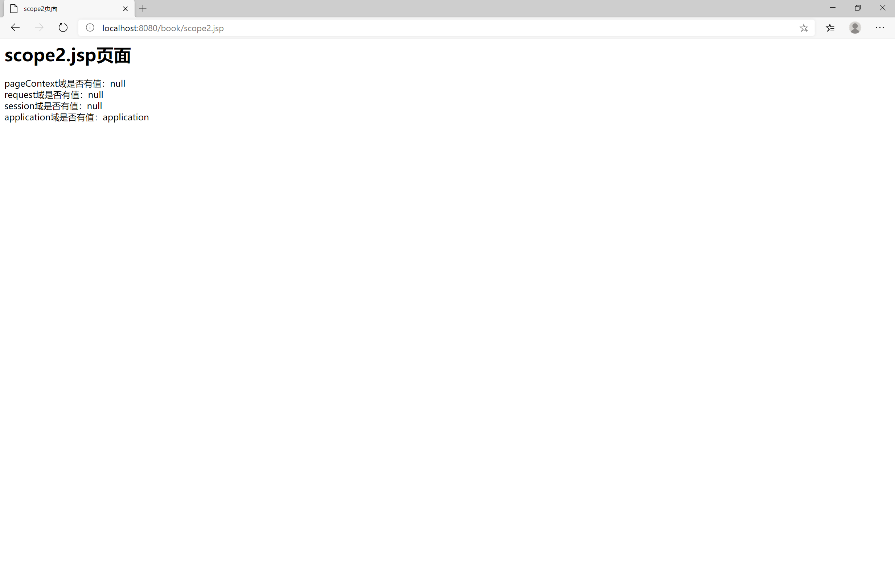
   分析：打开浏览器访问某工程下的资源页面，这就是一个会话，当关闭浏览器(如果只是关闭标签页，则会话不会断开),会话才会断开，所以只要先访问了scope1.jsp页面，此时就会在session域设置值，然后无论访问哪个页面session域的值都会存在(前提是没有执行服务器端的清除)；关闭浏览器后，再直接打开scope2.jsp页面，是访问不到之前scope1.jsp页面上设置的值，因为上次会话关闭时session域的值已被清除
5. 验证application域的取值：
   从上面的各种验证中可以看出，无论其他的域怎么变化，application域的取值一直保持着。但是当重新部署项目时，值会被释放
   
   分析：application域对象的存取数据范围是整个工程，只要工程还在服务器中部署运行，则application域对象中存的值会一直存在，直到工程不在服务器

#### 9.2.3 out对象和response对象输出的区别

1. 当代码如下时：

   ```java
   <%@ page contentType="text/html;charset=UTF-8" language="java" %>
   <html>
   <head>
       <title>输出测试</title>
   </head>
   <body>
   <%
       response.getWriter().write("response1<br>");
       response.getWriter().write("response2<br>");
       out.write("out1<br>");
       out.write("out2<br>");
   %>
   </body>
   </html>
   ```

   页面效果如下：
   

2. 当代码如下时：

   ```java
   <%@ page contentType="text/html;charset=UTF-8" language="java" %>
   <html>
   <head>
       <title>输出测试</title>
   </head>
   <body>
   <%
       out.write("out1<br>");
       out.write("out2<br>");
       response.getWriter().write("response1<br>");
       response.getWriter().write("response2<br>");

   %>
   </body>
   </html>
   ```

   页面效果如下：
   

3. 当代码如下时：

   ```java
   <%@ page contentType="text/html;charset=UTF-8" language="java" %>
   <html>
   <head>
       <title>输出测试</title>
   </head>
   <body>
   <%
       out.write("out1<br>");
       out.flush();
       response.getWriter().write("response1<br>");
       response.getWriter().write("response2<br>");

       out.write("out2<br>");
   %>
   </body>
   </html>
   ```

   页面效果如下：
   

* 说明：
  当jsp页面中所有代码执行完成后会做以下操作：
  1. 执行`out.flush()`操作，会把out缓冲区中的数据追加到response缓冲区末尾
  2. 会执行response()刷新操作，把全部数据写给客户端
   >如果手动执行out.flush()操作，则会将已缓存的out缓冲区数据追加到response缓冲区内

* 选择哪种作为jsp代码脚本的输出？
  从Tomcat将jsp翻译成Servlet程序中可以看出，它使用的是out输出，所以应使用out输出稳妥

* out输出有`out.write()`和`out.print()`这两个方法
  它们都能用于输出，但是有区别：
  1. out.write()：它只能输出字符串，或者字符数组，也可输出int数字，但是数字会被转换成ASCII字符码输出。无法输出其他类型比如Object类型，boolean类型，数字的类型。总结：输出字符(串)没有问题
  2. out.print()：输出任意数据都没有问题(都会转换成对应类型的字面上的字符串后调用write输出)
   >可以查看JspWriterImpl类的源码查看其实现，这个类的源代码在Tomcat的源代码中，是为Tomcat服务的，不是给开发者使用的，想看源代码，可以去官网下载Tomcat对应版本的源码
   >在开发的jsp页面中，使用`out.print()`输出比较稳妥。jsp在翻译`<%=表达式语句%>`也是使用`out.print(表达式语句)`的方式来输出结果

### 9.3 常用标签

* 静态包含
  格式语法：`<%@ include file="" %>`
  file属性指定要包含的jsp页面的路径
  地址中第一个斜杠`/`表示为：`http://ip:port/工程名`   即映射到代码的web目录

* 静态包含的特点：
  1. 静态包含不会翻译被包含的jsp页面
  2. 静态包含其实是把被包含的jsp页面的代码直接复制到包含的位置，即复制到引用的jsp页面中，然后这个jsp页面转换成Servlet程序

* 动态包含
  格式语法：`<jsp:include page="" ></jsp:include>`
  page属性是指定你要包含的jsp页面的路径
  动态包含也可以像静态包含一样，把被包含的内容执行输出到包含位置

* 动态包含的特点：
  1. 动态包含会把包含的jsp页面也翻译称为java代码
  2. 动态包含底层代码使用如下代码去调用被包含的jsp页面执行输出：
     `org.apache.jasper.runtime.JspRuntimeLibrary.include(request,response,"地址",out,false);`

* 动态包含传递参数：
  格式语法：

  ```java
  <jsp:include page="">
      <jsp:param name="username" value="jack" />
      <jsp:param name="password" value="112233" />
  </jsp:include>
  ```

  被包含的页面可以通过`request.getParameter(paramName)`来获取到参数值

  >一般常使用静态包含

* 请求转发
  `<jsp:forward page=""></jsp:forward>`

### 9.4 练习

* 使用jsp输出一个乘法表到前端页面

```java
<%@ page contentType="text/html;charset=UTF-8" language="java" %>
<html>
<head>
    <title>乘法表</title>
</head>
<body>
<table cellspacing="4">
<%
for(int i=1;i<10;i++){
    %><tr><%
    for(int j=1;j<=i;j++){%>
        <td><%=j+"*"+i+" ="+j*i%></td><%
    }
    %></tr><%
}
%>
</table>

</body>
</html>
```

* 输出一个用户信息表格到前端页面(User类有属性：id,username,password,email)

```java
<%@ page contentType="text/html;charset=UTF-8" language="java" %>
<%@ page import="com.suftz.bean.User" %>
<%@ page import="java.util.ArrayList" %>
<html>
<head>
    <title>输出测试</title>
</head>
<body>
<%
    ArrayList<User> users=new ArrayList();
    users.add(new User(111,"Tom","112233","sky1@qq.com"));
    users.add(new User(122,"Smith","122233","sky2@qq.com"));
    users.add(new User(133,"Jack","132233","sky3@qq.com"));
    users.add(new User(144,"Jerry","142233","sky4@qq.com"));
%>

<table border="1px solid #eeeeee" cellspacing="0" cellpadding="4">
    <tr><td>Id</td><td>用户名</td><td>密码</td><td>邮箱</td></tr>
    <%
        for (int i = 0; i < users.size(); i++) {
    %>
    <tr><%
        User user = users.get(i);
    %>
        <td><%=user.getId()%>
        </td>
        <td><%=user.getUsername()%>
        </td>
        <td><%=user.getPassword()%>
        </td>
        <td><%=user.getEmail()%>
        </td>
    </tr>
    <%
        }
    %>
</table>
</body>
</html>
```

* 这两个题目放在一个jsp页面输出，效果如下：
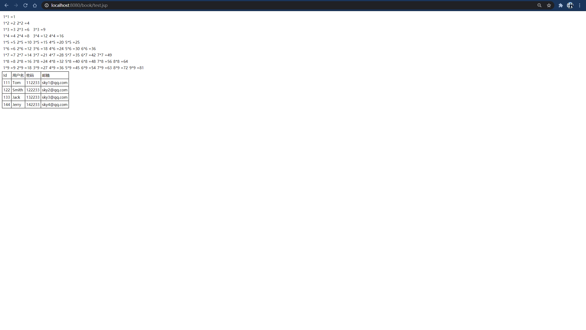

### 9.5 EL表达式

#### 9.5.1 认识EL表达式

* 表达式全称是：Expression Language，即表达式语言
* EL的作用：EL表达式主要是代替jsp页面中的表达式脚本在jsp页面中进行数据的输出，因为EL表达式在输出数据的时候，要比jsp的表达式脚本要简洁很多

* 比如：

  ```java
  <%@ page contentType="text/html;charset=UTF-8" language="java" %>
  <html>
  <head>
      <title>EL表达式测试</title>
  </head>
  <body>

  <%
      request.setAttribute("oneName","张三");
  %>
  表达式脚本输出oneName：<%=request.getAttribute("oneName")%><br>
  EL表达式输出oneName：${oneName}
  </body>
  </html>
  ```

* EL表达式的格式是：${表达式}
* EL表达式在输出null值的时候，在前端页面上输出的是空串(空白什么也没有)，而jsp表达式脚本输出值为null时，在前端页面上输出的是字符串`"null"`

#### 9.5.2 EL表达式的使用

* EL表达式主要是在jsp页面中输出数据
  主要是输出域对象中的数据

* 当域对象中都有相同的key的数据时，EL表达式会按照四个域的从小到大的取值范围来进行搜索，在较小范围的域对象中取到值时，则不再查找：
  `pageContext`->`request`->`session`->`application`

* 取值测试代码如下：

  ```java
  <%
      pageContext.setAttribute("key","pageContext");
      request.setAttribute("key","request");
      session.setAttribute("key","session");
      application.setAttribute("key","application");
  %>
  ${key}
  ```

  >可以通过依次注释小范围取值的域对象设置属性key的代码，来测试EL表达式搜索数据的顺序

* 如果域对象中取出来的值，其对象并不是简单的数据类型，可能是如下复杂的数据类型：
  1. Bean对象
  2. 数组
  3. List集合
  4. Map集合
   此时如果想取出这些对象里的属性(元素)的值，EL表达式的写法也十分简洁

* 如下示例：

  ```java
  <%@ page import="com.suftz.bean.User" %>
  <%@ page import="java.util.*" %>
  <%@ page contentType="text/html;charset=UTF-8" language="java" %>
  <html>
  <head>
      <title>EL表达式测试</title>
  </head>
  <body>

  <%!

      public class Student{
          String name;
          int age;
          String[] hobbies;
          List<String> cities;
          Map<String,Object> map;

          public Student(String name, int age, String[] hobbies, List<String> cities, Map<String, Object> map) {
              this.name = name;
              this.age = age;
              this.hobbies = hobbies;
              this.cities = cities;
              this.map = map;
          }

          public String getName() {
              return name;
          }

          public void setName(String name) {
              this.name = name;
          }

          public int getAge() {
              return age;
          }

          public void setAge(int age) {
              this.age = age;
          }

          public String[] getHobbies() {
              return hobbies;
          }

          public void setHobbies(String[] hobbies) {
              this.hobbies = hobbies;
          }

          public List<String> getCities() {
              return cities;
          }

          public void setCities(List<String> cities) {
              this.cities = cities;
          }

          public Map<String, Object> getMap() {
              return map;
          }

          public void setMap(Map<String, Object> map) {
              this.map = map;
          }

          @Override
          public String toString() {
              return "Student{" +
                      "name='" + name + '\'' +
                      ", age=" + age +
                      ", hobbies=" + Arrays.toString(hobbies) +
                      ", cities=" + cities +
                      ", map=" + map +
                      '}';
          }
      }
  %>

  <%
      List<String> list=new ArrayList();
      list.add("beijing");
      list.add("shanghai");
      list.add("hongkong");
      list.add("wuhan");
      Map<String,Object> map=new HashMap();
      map.put("key1","value1");
      map.put("key2",new int[]{20,11,99});
      map.put("key3",new User(111,"Tom","1122qq33","sky@qq.com"));
      Student student=new Student("Jack",22,new String[]{"read","play","sports"},list,map);
      pageContext.setAttribute("stu",student);
  %>

  输出Student：${stu}<br>
  输出Student的name属性：${stu.name}<br>
  输出Student的hobbies属性：${stu.hobbies}<br>
  输出Student的hobbies属性中的一个：${stu.hobbies[1]}<br>
  输出Student的cities属性(List类型)：${stu.cities}<br>
  输出Student的cities属性(List类型)的一个：${stu.cities[2]}<br>
  输出Students的map属性：${stu.map}<br>
  输出Students的map属性中一个键值对key3：${stu.map.key3}<br>

  </body>
  </html>
  ```

* 浏览器页面输出如图所示：
  

 >可以看出通过EL表达式取出域对象中的值很便捷，即使取出的值是复杂的对象，其属性也很容易取到，其本质是调用了复杂类的getXxx方法，来获取其属性，而其中的List类型数据直接以数组下标的形式取出，Map类型的数据通过`.key名`的方式取值

#### 9.5.3 EL表达式的语法

* 从示例中去感受语法的使用

```java
<%@ page import="java.util.*" %>
<%@ page contentType="text/html;charset=UTF-8" language="java" %>
<html>
<head>
    <title>EL表达式测试</title>
</head>
<body>

<%--关系运算--%>
--------关系运算结果----------<br>
${12==12}<br>
${13!=13}<br>
${12<13}<br>
${12<=12}<br>
${13>=12}<br>

<%--逻辑运算--%>
--------逻辑运算结果----------<br>
${12==12&&13!=13}<br>
${12==12||13!=13}<br>
${!(12==12)}<br>
${!true}<br>

<%--算术运算--%>
--------算术运算结果----------<br>
${12+12}<br>
${12-12}<br>
${12*12}<br>
${12/12}<br>
${13%12}<br>

<%--empty运算--%>
<%--
empty运算可以判断一个数据是否为空，如果为空，则输出true,不为空则输出false
判断规则：
1.值为null值的时候，为空
2.值为空串的时候，为空
3.值是Object类型数组，长度为0的时候，此时数组为空
4.List类型集合，元素个数为0，此时List集合对象为空
5.Set类型集合，元素个数为0，此时Set集合对象为空
6.Map类型集合，元素个数为0，此时Map集合对象为空
--%>
<%
    pageContext.setAttribute("emptyNull",null);
    pageContext.setAttribute("emptyStr","");
    pageContext.setAttribute("emptyArr",new Object[]{});
    pageContext.setAttribute("emptyArr2",new Object[4]);
    pageContext.setAttribute("emptyList",new ArrayList());
    pageContext.setAttribute("emptySet",new HashSet());
    pageContext.setAttribute("emptyMap",new HashMap());
%>

--------判空运算结果----------<br>
${empty emptyNull}<br>
${empty emptyStr}<br>
${empty emptyArr}<br>
${empty emptyArr2}<br>
${empty emptyList}<br>
${empty emptySet}<br>
${empty emptyMap}<br>

</body>
</html>
```

* 结果如下所示：
  

* 三元运算
  语法格式和Java本身的三元运算语法一致
  示例：`${81>=60? "及格了，哈哈哈":"没及格，嘤嘤嘤"}`

* `.`运算和`[]`运算
  `.`点运算，可以输出Bean对象中某个属性的值
  `[]`中括号运算，可以输出有序集合中某个元素的值
  并且`[]`中括号运算，还可以输出map集合中key里含有特殊字符的key的值

  ```java
  <%
      HashMap map=new HashMap();
      map.put("a.a","a.aValue");
      map.put("b+b","b.bValue");
      pageContext.setAttribute("map",map);
  %>
  ${map.a.a}<%--会去找map里的key为a的值，然后再取值。这样会引起歧义，最后什么也没有输出--%>
  ${map["a.a"]}<br>
  ${map.b+b}<br><%--会去找map里的key为b的值，找不到则为0，然后找变量b，也找不到，也为0。两个0相加，输出0--%>
  ${map['b+b']}<br>
  ```

#### 9.5.4 EL表达式中的内置对象使用

EL表达式中有11个隐含对象，这些对象是EL表达式自己定义的，可以直接使用

|变量|类型|描述|
|:----|:----|:----|
|pageContext|PageContextImpl|它可以获取jsp中的九大内置对象|
|pageScope|Map<String,Object>|它可以获取pageContext域中的数据|
|requestScope|Map<String,Object>|它可以获取Request域中的数据|
|sessionScope|Map<String,Object>|它可以获取Session域中的数据|
|applicationScope|Map<String,Object>|它可以获取ServletContext域中的数据|
|param|Map<String,String>|它可以获取请求参数的值|
|paramValues|Map<String,String[]>|它也可以获取请求参数的值，获取多个值的时候使用|
|header|Map<String,String>|它可以获取请求头的信息|
|headerValues|Map<String,String[]>|它可以获取请求头的信息，它可以获取多个值的情况|
|cookie|Map<String,Cookie>|它可以获取当前请求的Cookie信息|
|initParams|Map<String,String>|它可以获取在web.xml中配置的`<context-param>`上下文参数|

* 之前是直接输入key,即`${key}`,它会按照四个域对象的取值范围从小到大来查找，但那是不确定的，不知道会从哪个域对象中查找出来。也可以直接使用域对象，EL表达式定义了这四个域对象，直接使用即可
* pageContext因为可以获取到jsp中九大内置对象，也就request对象可以直接通过`.`来获取，那么request对象里的getXxx方法也可以直接通过`.xxx`的方式来取值

* 使用示例：

  ```java
  <%@ page import="java.util.*" %>
  <%@ page contentType="text/html;charset=UTF-8" language="java" %>
  <html>
  <head>
      <title>EL表达式测试</title>
  </head>
  username：${param.username}<br>
  password：${param.password}<br>
  hobby：[${paramValues.hobby[0]},${paramValues.hobby[1]}]<br>
  User-Agent：${header["User-Agent"]}<br>
  Connection：${headerValues["Connection"][0]}<br>
  Cookie：${cookie}<br>
  JSESSIONID[name]：${cookie.JSESSIONID.name}<br>
  JSESSIONID[value]：${cookie.JSESSIONID.value}<br>

  </body>
  </html>
  ```

  地址栏输入：`http://localhost:8080/book/el.jsp?username=jack&password=22&hobby=play&hobby=read`
  浏览器页面上显示如下：
  

### 9.6 JSTL标签库

#### 9.6.1 认识JSTL标签库

* JSTL标签库全称是JSP Standard Tag Library,即JSP标准标签库，是一个不断完善的开发源代码的JSP标签库

* EL表达式主要是为了替换jsp中的表达式脚本，而标签库则是为了替换代码脚本，这样使得整个jsp页面变得更加简洁

* JSTL由五个不同功能的标签库组成

  |功能范围|URI|前缀prefix|
  |:----|:----|:----|
  |核心标签库(重点)|`http://java.sun.com/jsp/jstl/core`|c|
  |格式化|`http://java.sun.com/jsp/jstl/fmt`|fmt|
  |函数|`http://java.sun.com/jsp/jstl/functions`|fn|
  |数据库(不使用)|`http://java.sun.com/jsp/jstl/sql`|sql|
  |XML(不使用)|`http://java.sun.com/jsp/jstl/xml`|x|

* 在jsp中使用JSTL标签库的前提步骤
  1. 导入JSTL标签库的jar包，分别是:

     ```xml
     <dependency>
         <groupId>org.apache.taglibs</groupId>
         <artifactId>taglibs-standard-spec</artifactId>
         <version>1.2.1</version>
     </dependency>
     <dependency>
         <groupId>org.apache.taglibs</groupId>
         <artifactId>taglibs-standard-impl</artifactId>
         <version>1.2.1</version>
     </dependency>
     ```

  2. 在jsp标签库中使用taglib指令引入标签库
     CORE标签库：`<%@ taglib= prefix="c" uri="http://java.sun.com/jsp/jstl/core" %>`
     FMT标签库：`<%@ taglib= prefix="fmt" uri="http://java.sun.com/jsp/jstl/fmt" %>`
     FUNCTIONS标签库：`<%@ taglib= prefix="fn" uri="http://java.sun.com/jsp/jstl/functions" %>`
     SQL标签库：`<%@ taglib= prefix="sql" uri="http://java.sun.com/jsp/jstl/sql" %>`
     XML标签库：`<%@ taglib= prefix="c" uri="http://java.sun.com/jsp/jstl/xml" %>`

#### 9.6.2 JSTL标签库语法

* set标签
  * 作用：set标签可以往域中保存数据，即相当于`域对象.setAttribute(key,value);`
  * 语法：`<c:set scope="page" var="属性名" value="属性值"></c:set>`
  * 格式解释：
    scope设置保存到哪个域对象中，取值有四个：`page`(表示PageConext域,默认是此域),`request`(表示Request域),`session`(表示Session域),`application`(表示ServletContext域)
  * 使用举例：

    ```java
    <%@ taglib prefix="c" uri="http://java.sun.com/jsp/jstl/core" %>
    <%@ page contentType="text/html;charset=UTF-8" language="java" %>
    <html>
    <head>
        <title>JSTL标签库测试</title>
    </head>
    <body>

    <c:set scope="page" var="username" value="jack"></c:set>
    ${pageScope.username}

    </body>
    </html>
    ```

* if标签
  * 作用：if标签可以改变语句执行顺序，类似Java中的if，控制代码执行流程
  * 语法：

    ```java
    <c:if test="${EL表达式语句}">
        <%--someWork--%>
    </c:if>
    ```

  * 格式解释：test就是写判断条件的语句的，写在test属性里面，是一个EL表达式，返回boolean类型数据
  * 使用举例：

    ```java
    <%@ taglib prefix="c" uri="http://java.sun.com/jsp/jstl/core" %>
    <%@ page contentType="text/html;charset=UTF-8" language="java" %>
    <html>
    <head>
        <title>JSTL标签库测试</title>
    </head>
    <body>

    <c:set scope="page" var="score" value="39"></c:set>
    <c:if test="${pageScope.score<60}">
        分数为${pageScope.score}：不及格，嘤嘤嘤<br>
    </c:if>

    <c:set scope="page" var="score" value="91"></c:set>
    <c:if test="${pageScope.score>60}">
        分数为${pageScope.score}：及格了，哈哈哈<br>
    </c:if>

    </body>
    </html>
    ```

* choose标签，when标签，otherwise标签
  * 作用：有点类似Java中的switch...case...default的作用，但是jstl标签库里，这三个标签不需要手动break,匹配上之后就会停止判断，这就更有点类似Java中的if...else if...else的语法作用
  * 语法：

    ```java
    <c:choose>
        <c:when test="${EL表达式1}">
            <%--doSomething--%>
        </c:when>
        <c:when test="${EL表达式2}">
            <%--doSomething--%>
        </c:when>
        <c:when test="${EL表达式3}">
            <%--doSomething--%>
        </c:when>
        <c:otherwise>
            <c:choose>
                <c:when test="${EL表达式4}">
                    <%--doSomething--%>
                </c:when>
                <c:when test="${EL表达式5}">
                    <%--doSomething--%>
                </c:when>
                <c:otherwise>
                    <%--doSomething或者继续嵌套--%>
                </c:otherwise>
            </c:choose>
        </c:otherwise>
    </c:choose>
    ```

* 格式解释：嵌套的时候需要带上`<c:choose>`标签
* 使用示例：

  ```java
  <%@ taglib prefix="c" uri="http://java.sun.com/jsp/jstl/core" %>
  <%@ page contentType="text/html;charset=UTF-8" language="java" %>
  <html>
  <head>
      <title>JSTL标签库测试</title>
  </head>
  <body>

  <c:set scope="page" var="score" value="12"></c:set>
  <c:choose>
      <c:when test="${pageScope.score>=90&&pageScope.score<=100}">
          分数为${pageScope.score}:优秀,你已十分优秀<br>
      </c:when>

      <c:when test="${pageScope.score>=80&&pageScope.score<90}">
          分数为${pageScope.score}:优良，请你继续优秀<br>
      </c:when>

      <c:when test="${pageScope.score>=70&&pageScope.score<80}">
          分数为${pageScope.score}:良好，请你加油变得优秀<br>
      </c:when>

      <c:when test="${pageScope.score>=60&&pageScope.score<70}">
          分数为${pageScope.score}:合格，你才刚及格，努力<br>
      </c:when>

      <c:otherwise>

          <c:choose>
              <c:when test="${pageScope.score>=50&&pageScope.score<60}">
                  分数为${pageScope.score}:不及格，但是努力一点点就及格<br>
              </c:when>

              <c:when test="${pageScope.score>=80&&pageScope.score<90}">
                  分数为${pageScope.score}:不及格，需要好好努力啊<br>
              </c:when>

              <c:otherwise>
                  分数为${pageScope.score}：不及格，你完全没有学习！<br>
              </c:otherwise>

          </c:choose>

      </c:otherwise>

  </c:choose>

  </body>
  </html>
  ```

* forEach标签
  * 作用：遍历集合或者数组，取出集合或者数组中的每个元素
  * 语法：

    ```java
    <c:forEach begin="" end="" step="" varStatus="status" items="${表达式}" var="">
        <%--doSomething--%>
    </c:forEach>
    ```

  * 格式解释：
    items:表示遍历的集合或者数组
    var:表示遍历到的(当前)数据
    begin:表示遍历的开始索引值,从0计数
    end:表示结束的索引值
    step:属性表示遍历的步长值，如果步长是2，则相当于for(int i=1;i<10;i+=2),即每隔一个数据元素遍历
    varStatus:表示当前遍历到的数据的状态,这是一个类对象，提供了许多方法来获取当前循环的细节，通过打印可知该类(接口)为LoopTagStatus,定义了以下对象：
    1. public Object getCurrent()：获取当前遍历到的对象
    2. public int getIndex()：获取当前遍历的索引index，从0计数
    3. public int getCount()：表示这个当前遍历到了几个元素，从1计数
    4. public boolean isFirst()：返回boolean类型，是否是遍历到的第一个元素
    5. public boolean isLast()：返回boolean类型，是否是遍历到的最后元素
    6. public Integer getBegin()：获取forEach标签上的begin属性值
    7. public Integer getEnd()：获取forEach标签上的end属性值
    8. public Integer getStep()：获取forEach标签上的step属性值
  * 使用示例：

    ```java
    <%@ page import="com.suftz.bean.User" %>
    <%@ page import="java.util.HashMap" %>
    <%@ page import="java.util.Map" %>
    <%@ page import="java.util.List" %>
    <%@ page import="java.util.ArrayList" %>
    <%@ taglib prefix="c" uri="http://java.sun.com/jsp/jstl/core" %>
    <%@ page contentType="text/html;charset=UTF-8" language="java" %>
    <html>
    <head>
        <title>JSTL标签库测试</title>
    </head>
    <body>

    <%--遍历1到10--%>

    <%--遍历1-10--%>
    -----------遍历1-10----------------<br>
    <c:forEach begin="1" end="10" var="i">
        ${i}<br>
    </c:forEach>

    <%--遍历Object数组--%>
    <br>-----------遍历Object数组----------------<br>
    <%
        request.setAttribute("users",new User[]{new User(111,"Tom","1qaz","sky1qq.com"),new User(222,"Jack","1qaz","sky2qq.com"),new User(333,"Make","1qaz","sky3qq.com"),new User(444,"张三","1qaz","sky4qq.com")});
    %>
    <c:forEach items="${requestScope.users}" var="item">
        ${item}<br>
    </c:forEach>


    <table cellspacing="0" cellpadding="4" border="1px solid #eeeeee">
        <tr><td>id</td><td>用户名</td><td>密码</td><td>邮箱</td></tr>
    <c:forEach items="${requestScope.users}" var="user">
        <tr>
            <td>${user.id}</td>
            <td>${user.username}</td>
            <td>${user.password}</td>
            <td>${user.email}</td>
        </tr>
    </c:forEach>
    </table>


    <%--遍历Map集合--%>
    <br>-----------遍历Map集合----------------<br>
    <%
        Map map=new HashMap();
        map.put("key1","value1");
        map.put("key2","value2");
        map.put("key3","value3");
        request.setAttribute("map",map);
    %>
    <c:forEach items="${requestScope.map}" var="entry">
        ${entry.key}：${entry.value}<br>
    </c:forEach>


    <br>-----------遍历List集合----------------<br>
    <%
        List<User> usersList=new ArrayList();
        usersList.add(new User(1111,"Tom","1qaz","sky1qq.com"));
        usersList.add(new User(2222,"Jack","1qaz","sky2qq.com"));
        usersList.add(new User(3333,"Make","1qaz","sky3qq.com"));
        usersList.add(new User(4444,"张三","1qaz","sky4qq.com"));
        request.setAttribute("list",usersList);
    %>

    <table cellspacing="0" cellpadding="4" border="1px solid #eeeeee">
        <tr><td>id</td><td>用户名</td><td>密码</td><td>邮箱</td></tr>
        <c:forEach items="${requestScope.list}" var="user">
            <tr>
                <td>${user.id}</td>
                <td>${user.username}</td>
                <td>${user.password}</td>
                <td>${user.email}</td>
            </tr>
        </c:forEach>
    </table>


    <%--综合测试遍历--%>
    <br>-----------综合测试遍历----------------<br>
    <%
        usersList.add(new User(5555,"李四","1qaz","sky5qq.com"));
        usersList.add(new User(6666,"王五","1qaz","sky6qq.com"));
        usersList.add(new User(7777,"赵六","1qaz","sky7qq.com"));
        usersList.add(new User(8888,"宋七","1qaz","sky8qq.com"));
        request.setAttribute("list",usersList);
    %>
    <table cellspacing="0" cellpadding="4" border="1px solid #eeeeee">
        <tr><td>id</td><td>用户名</td><td>密码</td><td>邮箱</td><td>status</td>
            <td>status.current</td><td>status.index</td><td>status.count</td><td>status.first</td>
            <td>status.last</td><td>status.begin</td><td>status.end</td><td>status.step</td>
        </tr>
    <c:forEach begin="2" end="5" step="2" varStatus="status" items="${requestScope.list}" var="user">
        <tr>
            <td>${user.id}</td>
            <td>${user.username}</td>
            <td>${user.password}</td>
            <td>${user.email}</td>
            <td>${status}</td>
            <td>${status.current}</td>
            <td>${status.index}</td>
            <td>${status.count}</td>
            <td>${status.first}</td>
            <td>${status.last}</td>
            <td>${status.begin}</td>
            <td>${status.end}</td>
            <td>${status.step}</td>
        </tr>
    </c:forEach>

    </body>
    </html>
    ```

* 示例输出到浏览器如下：
  

## 10. Cookie和session

### Cookie

* 什么是Cookie?
  1. Cookie翻译过来的英语是饼干
  2. Cookie是服务器通知客户端保存键值对的一种技术
  3. 客户端有了Cookie后，每次请求都会发送给服务器
  4. 每个Cookie大小不能超过4kb

* 服务器端Servlet给response添加Cookie

  ```java
  package com.suftz.web.servlet;

  import javax.servlet.ServletException;
  import javax.servlet.annotation.WebServlet;
  import javax.servlet.http.Cookie;
  import javax.servlet.http.HttpServlet;
  import javax.servlet.http.HttpServletRequest;
  import javax.servlet.http.HttpServletResponse;
  import java.io.IOException;

  @WebServlet(name = "CookieServlet",urlPatterns = "/cookieServlet")
  public class CookieServlet extends HttpServlet {

      protected void doGet(HttpServletRequest request, HttpServletResponse response) throws ServletException, IOException {
          Cookie cookie=new Cookie("cookie_key","cookie_value");
          response.addCookie(cookie);
          response.setContentType("text/html;charset=utf-8");
          response.getWriter().write("建立cookie成功");
      }
  }
  ```

* 浏览器客户端收到的报文如下：
  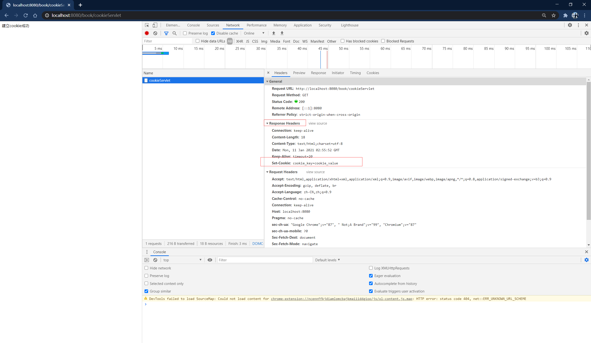
  可以看到响应头，有Set-Cookie的属性，浏览器会根据这个属性和值，在本地浏览器建立Cookie，存储到浏览器缓存起来，查看Cookie如下图：
  

* 建立Cookie流程图：
  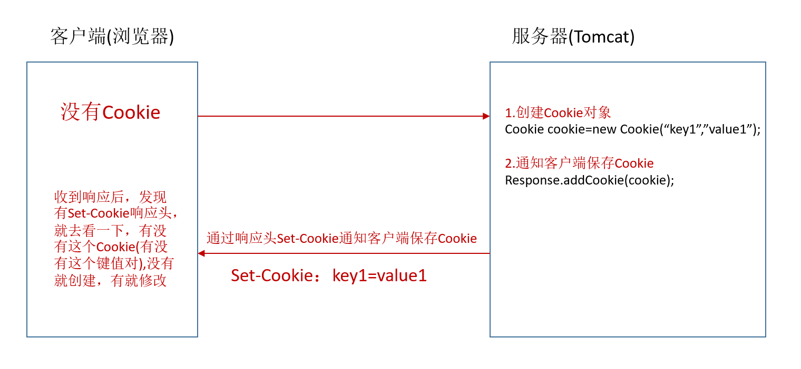

* 服务器端可以一次创建多个Cookie给客户端浏览器保存，浏览器则会分别保存多个Cookie键值对(浏览器收到的响应头会有多个Set-Cookie属性)

* Cookie的获取
  浏览器如果保存有某个服务器主机所发送到浏览器上的Cookie，则会在发送给该主机上的请求时，附带在请求头里通过Cookie属性，带上Cookie，如果有多个Cookie，则都会被随着请求发送给服务器

* 服务器端接收Cookie示例：

  ```java
  Cookie[] cookies=request.getCookies();
  for (Cookie cookie : cookies) {
      cookie.getName();
      cookie.getValue();
  }
  ```

* Cookie值的修改
  * 方案一：
    1. 先创建一个要修改的同名的Cookie对象
    2. 在构造器，同时赋予新的Cookie值
    3. 调用response.addCookie(Cookie);
  * 方案二：
    1. 先查找到修改的Cookie对象
    2. 调用Cookie对象中的setValue()方法赋予新的Cookie值
    3. 调用response.addCookie()通知客户端保存修改

* Cookie的值不能是特殊字符，比如空格，中文也不支持，如果想保存特殊字符，可以先使用base64编码

* 浏览器可以清除本地存储的Cookie，也可以在浏览器本地添加新的Cookie键值对
  也可以删除或者修改某个Cookie值

* Cookie的生命控制
  Cookie的生命控制指的是如何管理Cookie的被销毁(删除)时间
  通过在服务器端给被添加的Cookie对象设置存活时间,调用方法是setMaxAge(int expiry)
  expiry为正数，表示在指定的秒数后过期
  expiry为负数，表示浏览器一关，Cookie就会被删除
  expiry为零，表示马上删除浏览器保存的Cookie,浏览器收到响应报文时就会去删除此Cookie

* Cookie设置有效路径ath
  Cookie的path属性可以有效的过滤哪些Cookie可以发送给服务器，哪些不发。path属性是通过请求的地址来进行有效的过滤

* 举例：
  浏览器有两个Cookie
  |Cookie名|path|
  |:----|:----|
  |CookieA|   path=/工程路径|
  |CookieB|   path=/工程路径/abc|

  请求地址如下：
  |请求地址|Cookie发送情况|
  |:----|:----|
  |`http://ip:port/工程路径/a.html`      |CookieA发送，CookieB不发送|
  |`http://ip:port/工程路径/abc/a.html`  |CookieA发送，CookieB发送|
  >前提必须得同一个主机地址才会有发送Cookie,跨域不发送Cookie

* 设置path属性
  格式：`cookie.setPath(request.getContextPath()+"/abc");`

* 如果当前地址栏的url和cookie设置的path不匹配，则看不到该cookie，想看到则需要修改地址栏地址即可
  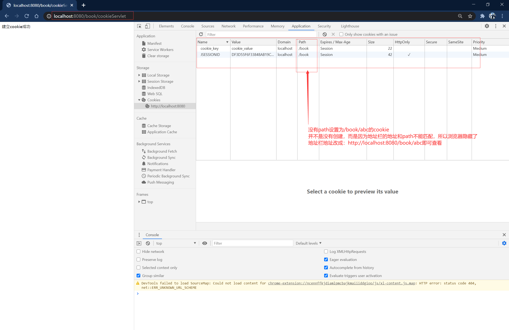
  

//顶级域名和子域名之间的cookie共享问题

### session

* Seesion就是一个接口，在Tomcat中接口名是HttpSession
* Session就是会话，它是用来维护一个客户端和服务器之间关联的一种技术
* 每个客户端都有自己的一个Session会话
* Session会话中，经常用来保存用户登录之后的信息

* 如何创建Session和获取id
  创建和获取的API是相同的：request.getSession()
  第一次调用是：创建Seesion会话
  之后调用是：获取前面创建好的Session会话对象

  session.isNew():判断是否是刚创建出来的Session对象
  true:表示刚创建
  false:标签获取之前创建

* 每个会话都有一个id值，而且id是唯一的，用来标记这个会话，通过getId()得到当前Session对象的会话id值

* Seesion生命周期控制
  1. public void setMaxInactiveInterval(int interval):设置Session的超时时间(秒为单位)，超过指定的时长，Session就会被销毁。参数是正数时是超时时间，负数则代表永不超时(这是极少使用的)
  2. public void getMaxInactiveInterval()：获取Session的超过时间，默认的超时时长是30分钟，即1800秒
     配置文件web.xml中设置了默认的超时时长(修改此配置的值即可修改默认的超时时长，重启服务器后有效)：

     ```xml
     <session-config>
         <session-timeout>30</session-timeout>
     </session-config>
     ```

  3. 如果想修改个别Session的超时时长，可以单独给Session对象设置超时时长，通过调用setMaxInactiveInterval(int interval)即可

  4. session.invalidate()：调用此方法时，此session立即失效

* **session的超时指的是，客户端两次请求的最大间隔时长**

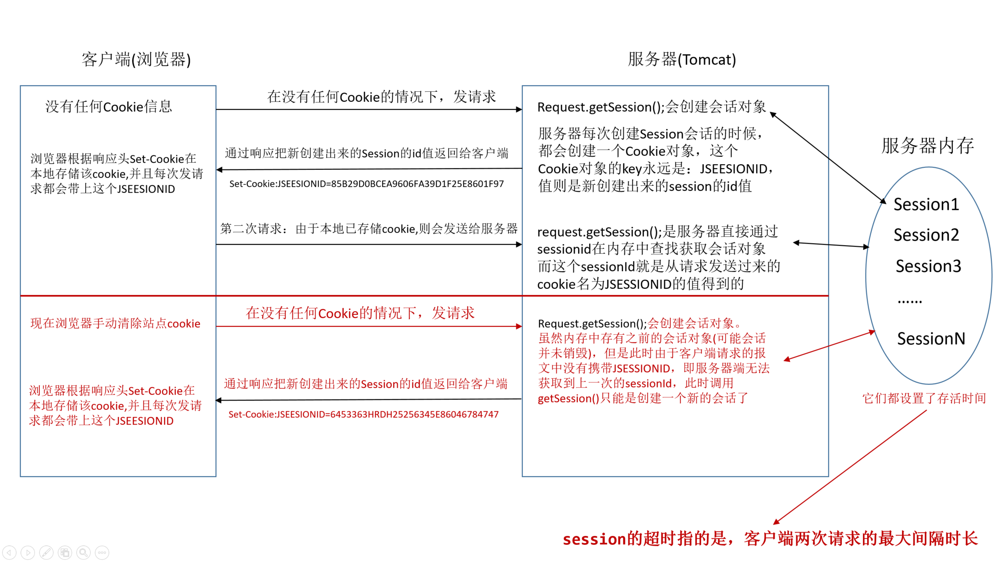

//浏览器禁用cookie怎么办，一般url上会带上jsessionid
//浏览器关闭后cookie中的jsessionid被清，那么那些网站如何做到的，之前登录过，然后关闭浏览器，再打开后，不需要登录
解决方案：cookie默认是会话级别并可以存储到客户端中，可以将获取到的jsessionID存入当前cookie中并把cookie的生存时间设置久一些。重新打开浏览器后自动查找之前cookie内的jsessionID键并查找到对应的

## 11. Filter过滤器

* Filter过滤器是JavaWeb的三大组件之一
* Filter过滤器它是JavaEE的规范，即接口
* Filter过滤器的作用：拦截请求，过滤响应

* Filter拦截请求常用场景：
  1. 权限检查
  2. 日记操作
  3. 事务管理
  4. ...

* Filter过滤器拦截的示例：
  1. 编写一个类，实现Filter接口，在方法doFilter()中编写拦截的逻辑
  2. 通过配置文件web.xml或者注解方法，配置这个拦截器，其中的urlPattern则是标明哪些请求会被此过滤器拦截
     
      ```xml
      <filter>
          <filter-name>TestFilter</filter-name>
          <filter-class>com.suftz.filter.TestFilter</filter-class>
          <init-param>
              <param-name>username</param-name>
              <param-value>tom</param-value>
          </init-param>
      </filter>
      <filter-mapping>
          <filter-name>TestFilter</filter-name>
          <url-pattern>/*</url-pattern>
      </filter-mapping>
      ```

      或者注解方式：
    
      ```java
      package com.suftz.filter;

      import javax.servlet.*;
      import javax.servlet.annotation.WebFilter;
      import javax.servlet.http.HttpServletRequest;
      import java.io.IOException;
      @WebFilter(filterName = "TestFilter",urlPatterns = "/*")
      public class TestFilter implements Filter {
          
          @Override
          public void init(FilterConfig config) throws ServletException {

          }

          @Override
          public void doFilter(ServletRequest req, ServletResponse resp, FilterChain chain) throws ServletException, IOException {
              HttpServletRequest request=(HttpServletRequest)req;
              String servletPath =request.getServletPath();
              StringBuffer url=request.getRequestURL();
              String uri=request.getRequestURI();
              chain.doFilter(req, resp);
          }

          @Override
          public void destroy() {
          }

      }
      ```

* Filter的生命周期
  1. 构造器方法
  2. init初始化方法
     在工程启动的时候执行第一、二步
  3. doFilter过滤方法
     当有请求执行匹配到Filter时
  4. destroy方法
     停止工程时执行

* FilterConfig类
  有四个方法来获取相关信息：
  1. public String getFilterName()：获取配置的此拦截器的name
  2. public ServletContext getServletContext()：获取ServletContext对象
  3. public String getInitParameter(String name)：获取拦截器中配置的初始化参数的值，即配置到`<filter>`标签内的初始化参数中的值
  4. public Enumeration<String> getInitParameterNames()：获取拦截器中所有初始化参数中的参数名

* 多个Filter执行的顺序
  在配置文件web.xml中，如果一个请求可以匹配到多个Filter，则按照配置的先后顺序来进行拦截，每个Filter中会根据FilterChain.doFilter(servletRequest,servletResponse)来进行放行，让请求继续进入到下一个Filter拦截器或者直接进入到Servlet中处理

* FilterChain.doFilter()方法的作用：
  1. 执行下一个Filter过滤器(如果有)
  2. 执行目标资源(没有Filter)

* 多个Filter执行的特点：
  1. 所有filter和目标资源默认都在同一个线程中
  2. 多个filter共同执行的时候，共用同一个request对象

* Filter的拦截路径
  1. 精确匹配
     `<url-pattern>/a/b/c/target.jsp</url-pattern>`
  2. 目录匹配
     `<url-pattern>/a/b/*</url-pattern>`
  3. 后缀名匹配
     `<url-pattern>/a/b/*.html</url-pattern>`
     `<url-pattern>*.action</url-pattern>`

## 12. Listener监听器

### 12.1 认识Listener

* Listener监听器是JavaWeb三大组件之一，JavaWeb三大组件分别是：Servlet程序、Filter过滤器、Listener监听器
* Listener它是JavaEE的规范，即接口
* 监听器的作用是，监听某种事物的变化，然后通过毁掉函数，反馈给客户(程序)去做一些响应的处理

### 12.2 ServletContextListener监听器

* ServletContextListener可以监听ServletContext对象的创建和销毁
* ServletContext对象在web工程启动的时候创建，在web工程停止的时候销毁
* 监听到创建和销毁之后都会分别调用ServletContextListener监听器的方法反馈

* ServletContextListener监听器源码：

  ```java
  package javax.servlet;

  import java.util.EventListener;

  public interface ServletContextListener extends EventListener {

      /**
       * 在ServletContext对象创建时调用，即工程启动时调用
       */
      public void contextInitialized(ServletContextEvent sce);

      /**
       * 在ServletContext销毁时调用，即工程停止前会调用
       */
      public void contextDestroyed(ServletContextEvent sce);
  }
  ```

* 如何监听ServletContext对象
  1. 编写一个类实现ServletContextListener接口
  2. 实现其两个回调方法
  3. 到web.xml中去配置监听器

## 13. 国际化

* 什么是国际化？
  指的是同一个网站可用支持多种不同的语言，以方便不同国家，不同语种的用户访问
  其实实际上这种需求并不是很强烈，一般真有国际化需求的公司，也可能采取做不同的网站来应对

### 国际化三要素

* Locale对象
  Locale表示不同的时区，位置，语言
  zh_CN:中国，中文
  en_US:英文，美国

* Properties属性配置文件
  国际化配置文件命名规则：
  baseName_locale.properties
  比如：baseName是i18n
  中文配置文件名是：i18n_zh_CN.properties
  英文配置文件名是：i18n_en_US.properties

* ResourceBundle资源包
  ResourceBundle.getBundle():ResourceBundle类
  根据给定的baseName和Locale读取相应的配置文件，得到文件信息：
  ResourceBundle对象的getString(key)

* 示例代码：

  ```java
  package com.suftz.test.junit;

  import org.junit.Test;

  import java.io.UnsupportedEncodingException;
  import java.util.Locale;
  import java.util.ResourceBundle;

  public class Test1 {

      @Test
      public void test() {
          System.out.println(Locale.getDefault());
          System.out.println(Locale.getAvailableLocales().length);
          System.out.println(Locale.CHINA);
          System.out.println(Locale.US);
          ResourceBundle resourceBundle=ResourceBundle.getBundle("i18n",Locale.CHINA);
          try {
              System.out.println(new String(resourceBundle.getString("username").getBytes("ISO-8859-1"),"utf-8"));
              System.out.println(new String(resourceBundle.getString("password").getBytes("ISO-8859-1"), "utf-8"));

              resourceBundle=ResourceBundle.getBundle("i18n",Locale.US);
              System.out.println(resourceBundle.getString("username"));
              System.out.println(resourceBundle.getString("password"));
          } catch (UnsupportedEncodingException e) {
              e.printStackTrace();
          }
      }
  }
  ```

* jsp页面中使用i18n

  ```java
  <%
  Locale locale=request.getLocale();
  ResourceBundle bundle=ResourceBundle.get("i18n",locale);
  %>
  <a href="pages/user/login.html?locale=zh_CN">中文</a>
  <a href="pages/user/login.html?locale=en_US">英文</a>
  <%=bundle.getString("username")%>:<input name="username" type="text">
  ```

* 使用jstl来实现国际化
  先要导入jstl中国际化的标签库

  ```java
  <%@ taglib prefix="fmt" uri="http://java.sun.com/jsp/jstl/fmt" %>
  <%@ page pageEncoding="utf-8" contentType="text/html;charset=UTF-8" language="java" %>
  <html>
  <head>
      <title>Title</title>
      <meta charset="UTF-8">
  </head>
  <body>
      <fmt:setLocale value="${param.locale}"/>
      <fmt:setBundle basename="i18n"/>
      <a href="login.jsp?locale=zh_CN">中文</a><br>
      <a href="login.jsp?locale=en_US">英文</a><br>
      <fmt:message key="username"/>:<input name="username" type="text"><br>
      <fmt:message key="password"/>:<input name="password" type="password"><br>
      <fmt:message key="age"/>:<input name="age" type="text">
  </body>
  </html>
  ```

> 中文进行国际化时，会出现乱码，原因是国际化的有关类在读取国际化文件时按照ISO-8859-1编码方式，ISO-8859-1编码是不包含中文编码方案的，不管国际化文件怎样存储都解决不了问题，要么修改这些类对象在读取文件时的编码方式(未找到读取)，另一种方案是将国际化文件里的中文转成unicode编码保存，如下(i18n_zh_CN.properties)：

```text
username=\u7528\u6237\u540d
password=\u5bc6\u7801
age=\u5e74\u9f84
```

## 14. Ajax请求

* AJAX即异步JavaScript和XML(Asynchoronous Javasript and XML),是一种创建交互式网页应用的网页开发技术
* AJAX是一种浏览器通过js异步发送请求，局部更新页面的技术

* JavaScript发送AJAX请求的步骤
  1. 创建XMLHttpRequest
  2. 使用open方法设置请求的参数：请求类型，url，参数
  4. 在send方法前绑定onreadstatechange事件，处理请求完成后的操作，即回调函数
  3. 使用send方法发送请求

* 封装一个简单的AJAX请求函数：

  ```javascript
  function ajax(options){
      var xhr = null;
      var params = formsParams(options.data);
      options.async=options.async|true;
      if(window.XMLHttpRequest){ //创建对象
          xhr = new XMLHttpRequest()
      } else {
          xhr = new ActiveXObject("Microsoft.XMLHTTP");
      }
      // 连接
      if(options.type == "GET"){
          xhr.open(options.type,options.url + "?"+ params,options.async);
          xhr.send(null);
      } else if(options.type == "POST"){
          xhr.open(options.type,options.url,options.async);
          xhr.setRequestHeader("Content-type","application/x-www-form-urlencoded;charset=UTF-8");
          xhr.send(params);//post请求时，参数写在send里面
      }
      xhr.onreadystatechange = function(){
          if(xhr.readyState == 4 && xhr.status == 200){
              options.success(xhr.responseText);
          }
      }
      //将参数以key1=value1&key2=value2形式连接
      function formsParams(data){
          var arr = [];
          for(var prop in data){
              arr.push(prop + "=" + data[prop]);
          }
          return arr.join("&");//将数组所有元素放入一个字符串中，并制定分隔符进行分隔
      }
  }
  ```

* 上面的示例中，发送给服务器端的请求数据是以application/x-www-form-urlencoded形式来编码，其实也可以使用application/json格式编码

* **注意：**
  1. 在Javascript中，单引号和双引号的作用是一样的，都可以引起来字符串或字符，只要一一对应起来就可以，但是不能互相混用，嵌套正确即可，比如：
    
      ```javascript
      var str="abc";
      var str1='abc';
      var str2="'a'";
      var str3='"b"';
      ```

  2. 在javascript中，对象Object类型，属性名也可以不用引号括起来，比如：

      ```javascript
      var obj1={"username":"tom","password":"123abc"};
      var obj2={'username':"tom",'password':"123abc"};
      var obj3={username:"tom",password:"123abc"};
      ```

  3. **但是在json的字符串转成JSON对象中，json字符串要严格按照标准的写法，即：**
     1. 字符串使用双引号包围,不能使用单引号
     2. 对象的属性名也要使用双引号包围
     否则JSON.parse(str)会报错

     ```javascript
     var jsonStr="{'username':'tom'}";
     var jsonStr2="{'username':'tom'}";
     var jsonStr3="{username:'tom'}";
     JSON.parse(jsonStr);
     JSON.parse(jsonStr2);
     JSON.parse(jsonStr3);
     //以上都会报错
     ```

* 使用jQuery中ajax发送post请求

  ```html
  <!DOCTYPE html>
  <html lang="en">
  <head>
      <meta charset="UTF-8">
      <title>Title</title>
      <base href="/book/">
      <script src="static/script/jquery-1.7.2.js" type="text/javascript"></script>
      <script>

          $(function () {
              $.ajax({
                  "url": "hello",//即请求地址
                  "type":"POST",//请求的类型，post,get
                  "data":{//请求数据，这里直接写出js对象即可，真正发请求时，jquery会根据指定的contentType=application/x-www-form-urlencoded数据格式来发送,即拼接字符串
                      "username":"tom",
                      "password":"123abc"
                  },
                  "success":function(result,status,xhr){//成功的回调，result参数的类型，经过了指定的dataType的转换
                      console.log(result);
                  },
                  "error": function (xhr,status,error) {//错误的回调
                      console.log(xhr);
                  },
                  "dataType":"json",//指定响应报文的数据类型，jquery会按照这个类型来解析相应数据，默认是text，如果转换失败会报错
                  "contentType":"application/x-www-form-urlencoded"//发送给服务器端的参数内容格式，默认是application/x-www-form-urlencoded，即键值对使用&拼接
              });
          });
      </script>
  </head>
  <body>

  </body>
  </html>
  ```

  这种方式的contentType，服务器端直接使用request.getParameter("参数名")来获取参数值

* 如果contentType=application/json，那么data也需要转换成json的字符串

  ```html
  <!DOCTYPE html>
  <html lang="en">
  <head>
      <meta charset="UTF-8">
      <title>Title</title>
      <base href="/book/">
      <script src="static/script/jquery-1.7.2.js" type="text/javascript"></script>
      <script>

          $(function () {
              $.ajax({
                  "url": "hello",//即请求地址
                  "type":"POST",//请求的类型，post,get
                  "data":JSON.stringify({{//请求数据，这里直接写出js对象即可，真正发请求时，jquery会根据指定的contentType=application/x-www-form-urlencoded数据格式来发送,即拼接字符串
                      "username":"tom",
                      "password":"123abc"
                  }),
                  "success":function(result,status,xhr){//成功的回调，result参数的类型，经过了指定的dataType的转换
                      console.log(result);
                  },
                  "error": function (xhr,status,error) {//错误的回调
                      console.log(xhr);
                  },
                  "dataType":"json",//指定响应报文的数据类型，jquery会按照这个类型来解析相应数据，默认是text，如果转换失败会报错
                  "contentType":"application/json"//发送给服务器端的参数内容格式，默认是application/x-www-form-urlencoded，即键值对使用&拼接
              });
          });
      </script>
  </head>
  <body>

  </body>
  </html>
  ```

  因为contentType为json格式，无法通过getParameter()方式来获取参数值，服务器端的接收的请求数据是json的字符串形式(实质上是一个二进制流)，需要使用转换流将字节流转换成字符，然后读取成json字符串,然后转成对象(array，map，或者其他bean)

  ```java
  package com.suftz.web.servlet;

  import com.alibaba.fastjson.JSONObject;

  import javax.servlet.ServletException;
  import javax.servlet.http.HttpServlet;
  import javax.servlet.http.HttpServletRequest;
  import javax.servlet.http.HttpServletResponse;
  import java.io.IOException;
  import java.io.InputStream;
  import java.io.InputStreamReader;


  public class HelloServlet extends HttpServlet {

      @Override
      protected void doPost(HttpServletRequest req, HttpServletResponse resp) throws ServletException, IOException {
          InputStream is=req.getInputStream();
          InputStreamReader inputStreamReader=new InputStreamReader(is,"utf-8");
          char[] chars=new char[1024];
          StringBuilder sb=new StringBuilder();
          int len=-1;
          while((len=inputStreamReader.read(chars))!=-1){
              sb.append(chars,0,len);
          }
          JSONObject jsonObject=JSONObject.parseObject(sb.toString());
          System.out.println(jsonObject.get("username"));
          System.out.println(jsonObject.get("password"));
          resp.setContentType("application/json;charset=utf-8");
          resp.getWriter().write("{\"result\":\"success\"}");
      }
  }
  ```


## 15. JSON

* 什么是JSON?
  JSON(JavaScript Objcet Notation)是一种轻量级的数据交换格式。易于人阅读和编写，同时也易于机器解析和生成。JSON采用完全独立于语言的文本格式，而且很多语言都提供了对json的支持，使得JSON成为了理想的数据交换格式

* json是轻量级的数据交换格式：
  轻量级对比xml而言，数据交换指的是服务器端和客户端

### 客户端使用JSON

* JSON在JavaScript中的使用
  1. json的定义：json是由键值对组成，并且由大括号包围，每个键由引号引起来
     
      ```javascript
      var jsonObj={
        "key1":12,
        "key2":"abc",
        "key3":true,
        "key4":[11,"str",false],
        "key5":{
            "username":"tom",
            "password":"12343"
        },
        "key6":[{
            "username":"tom",
            "password":"12343"
        },{
            "username":"jack",
            "password":"12321"
        }]
      };
      ```

  2. json其实就是javascript中的一个对象，即Object类型，所以获取json对象的某些属性的值，直接通过`.属性名`访问

* JSON的两个常用方法
  json的存在有两种形式：
  1. 对象的形式存在，即JSON对象
  2. 字符串的形式存在，即json字符串
  当要操作json中的数据的时候，需要json对象的格式
  当需要在客户端和服务器端之间进行数据交换的时候，使用json字符串

  JSON.stringify(jsonObj)：把json对象转换成json字符串
  JSON.parse(jsonStr)：把json字符串转换成json对象

  ```javascript
  var jsonObj={
    "key1":12,
    "key2":"abc",
    "key3":true,
    "key4":[11,"str",false],
    "key5":{
        "username":"tom",
        "password":"12343"
    },
    "key6":[{
        "username":"tom",
        "password":"12343"
    },{
        "username":"jack",
        "password":"12321"
    }]
  };
  var jsonStr=JSON.stringify(jsonObj);
  var json=JSON.parse(jsonStr);
  ```

### 服务器端使用JSON

* 一般使用下列四个方案来使用JSON
  1. JSON官方，对类没有要求
  2. GSON
  3. FastJSON，最快
  4. jackson，SpringMVC内置的解析器
  > 除了JSON官方以外，另外三种都需要类是标准的JavaBean

* javaBean和json的互转

* List和json的互转

* map和json的互转


* 服务器端可以通过设置`resp.setContentType("application/json;charset=utf-8");`来告诉浏览器按照何种格式来解析响应数据，但是这只是一个参考，因为数据在传输的时候还是按照字符串的二进制流形式来传输，用户收到的最原始的数据仍是字符串，然后可以根据返回的数据尝试来解析数据，只是响应头的contentType数据类型会优先考虑

## 16. 上传文件

### 上传文件前需要了解的知识

* 使用form表单上传文件
  如果是使用HTML的form标签上传文件，需要另外进行一些设置：
  1. form标签添加属性enctype="multipart/form-data"
  2. form标签的属性method的属性值必须是post，否则无法传送input中type="file"的数据
  3. 最后，既然是使用form表单传送文件，其中一个input标签的type属性值应为"file"
     如下就是上传文件的表单示例：

      ```html
      <!DOCTYPE html>
      <html lang="en">
      <head>
          <base href="/book/">
          <meta charset="UTF-8">
          <title>上传文件测试</title>
      </head>
      <body>

      <form action="uploadServlet" method="post" enctype="multipart/form-data">
          文件名：<input type="text" name="fileName" id="fileName"><br>
          <input type="file" name="fileContent" id="fileContent"><br>
          <input type="submit" id="submit" value="提交上传"><br>
      </form>

      </body>
      </html>
      ```

* 前面已经说明http报文的格式，但是在上传文件时，报文在这里有些不同之处：
  
   上图还不是完整的报文，因为文件的二进制流很长，转义成字符串会很长(虽然这些流明明不是表示字符的，但是Fiddler工具栏[Raw]现在报文是按照字符来解析，自然表示文件的部分全部乱码)。**其实在文件二进制流的后面还有一个分隔符字符串**，但是由于文件流的影响，后面全部的内容都会乱码，报文的末尾如下：
   
   但是可以通过切换到工具栏的[HexView]功能，可以看到报文末尾是真的有分隔符的，HexView是直接查看报文的二进制流(当然是以16进制的方式显示出来，因为没有必要看数字0和1的一长片串)
   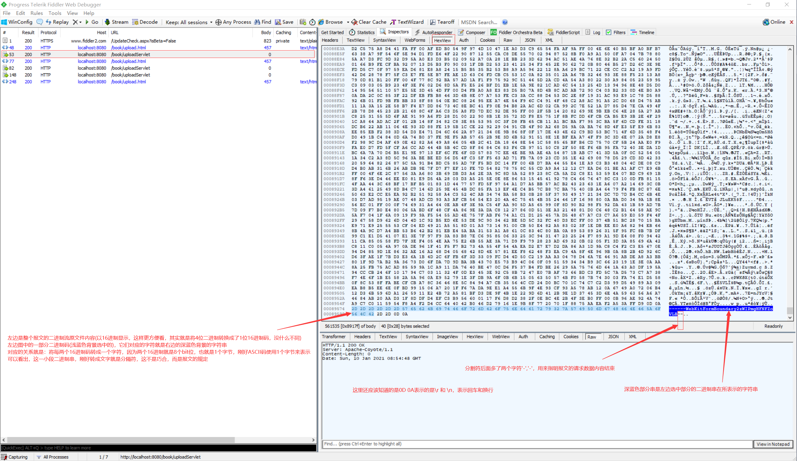
  1. 从上面的报文可以看出，上传文件的报文中请求头的Content-Type属性，会有一个字符串说明请求数据的分隔符，如`----WebKitFormBoundary2zWIPmgHFNFZoVLB`,传递给服务器端后，服务器端开发者可以通过这个字符来分割请求数据。而且，在请求数据的最后，也会使用分隔符，但是这个分隔符后面会多添加字符'--',用来表示请求数据的结束
  2. 请求数据的主体部分，也和普通的表单不一样，普通的表单，要么是以键值对的方式拼接字符串，要么就是json对象的字符串形式，上传文件时，参数名和参数的值会空一行后显示出来，如：

     ```http
     ------WebKitFormBoundary2zWIPmgHFNFZoVLB
     Content-Disposition: form-data; name="fileName"

     月光屋.jpg
     ------WebKitFormBoundary2zWIPmgHFNFZoVLB
     Content-Disposition: form-data; name="fileContent"; filename="Lighthouse.jpg"
     Content-Type: image/jpeg

     此处就是文件的二进制流...

     ------WebKitFormBoundary2zWIPmgHFNFZoVLB--

     ```

> 上传文件的分隔符，不同的浏览器生成规则并不相同，比如火狐浏览器可能就是这样子的：
> boundary=---------------------------224266601838723852002090396657
> 分隔符的长度和生成的规则都完全不一样了
> 但是这并不影响分割，而且在请求数据的末尾，也会多添加这两个字符'--'来表示请求的数据部分结束

* 了解清楚了上传文件时的报文格式后，就能够在服务器端针对报文进行解析。Servlet3.0之前并没有提供上传文件时，服务器端request对象如何获取请求参数的方法，使用传统的getParameter("参数名")方式无法获取参数值。也就是说需要自己去获取请求数据的输入流InputStream对象后，通过报文中请求头提供的分隔符来分割请求数据

> 自己去获取请求数据的输入流InputStream对象后，通过报文中请求头提供的分隔符来分割请求数据，这是比较麻烦的操作，因为提供给开发者的分隔符是一个字符串(当然也能认为是byte数组，可以转成byte数组),而需要进行分割的数据是一个二进制流，无法直接把请求数据转成字符串后，进行分割，因为请求数据里的文件部分本身就不是表示字符串的，然后转换成文字，那后面所有的内容都会乱码，即使文件流后面可能还有其他参数，是可以转成字符串表示，但是都会受到影响而乱码，从而影响分割。也就是说，分割操作，从字符串方式来分割是不可行的，那就需要以byte数组的方式进行分割，分隔符本身也是一个byte数组，拿到请求数据后，将数据的流以分隔符的byte数组作为分割标记，进行分割，从而获取表示文件内容的那部分二进制数据

### 16.1 使用form表单上传文件(Servlet3.0之前)

* Servlet3.0之前，需要开发者自己去获取请求数据的输入流InputStream对象后，通过报文中请求头提供的分隔符来分割请求数据，从而获取表示文件内容的那部分二进制数据
* 思路：就是上面提到的，以byte数组的方式进行分割，分隔符本身也是一个byte数组，拿到请求数据后，将数据的流以分隔符的byte数组作为分割标记，进行分割，从而获取表示文件内容的那部分二进制数据

> (国内)网上能找到的上传文件，全部都是使用Struts框架或者Srping框架，或者commons-upload包，或者其他的jar包来实现的，别人已经封装好的方法，直接使用，自己写三五行代码就实现了上传，这些都不是所谓的"纯手写实现上传"。当然了，已经实现好了的方案，拿来用，不重复造轮子是个好事，但是作为学习开发的人来说，重要的是如何自己去实现，然后从中了解这里面遇到的问题。许多开发者只知道(或者听说)上传文件很难搞，但是不知道为什么,反正有实现好的东西，拿来就用，也不思考，这是不可取的
> 因为在网上就这个问题搜了些帖子博客，至今没有发现哪个人自己去手写的，或者说手写实现很合适的，因为有些人是这样处理的，明显是不合理的做法：上传文件的表单只有上传图片这一个input,然后请求报文就十分简单，去除前面三行和然后最后44个byte，为什么要少读44个byte，因为上传文件内容结束处有一个\r\n，表示两个字符，然后谷歌浏览器分割符是长度为38的字符串，也就是38个byte,然后最后的分隔符会有"--"，表示两个字符，另外还会有两个字符，表示空行,即\r\n，这样一算，从上传文件的二进制内容结束，到整个报文结束，会有44个byte
> 这样处理明显是不合适且不合理，可以说是错误的，完全没有去分析上传文件时的HTTP报文格式，比如：
>1.火狐浏览器的分隔符就不是长度为38的字符串
>2.表单如果有其他的input标签里的数据怎么办？实际使用中难不成上传文件时就只能上传文件，其他的参数内容就不能上传了？实际中当然不是这样的，一个表单可以同时上传文件和其他参数
>3.如果上传文件的input后面，还有其他传递普通参数的input，那么报文中，表示文件内容的二进制数据后面，还会有其他的参数需要解析。仅仅在处理时少读44个byte的做法肯定是错误的

#### 16.1.1 手动自己实现文件上传

* 示例代码如下：

```java
```

#### 16.1.2 使用apache的commons-upload.jar包实现

* apache的相关工具类对上传文件进行了封装，使得开发者很容易就能获取到上传文件的数据流，以及表单提交的其他参数
* 首先需要导入相关的工具包(可以去官网下载，也可以使用maven获取)

  ```xml
  <dependency>
      <groupId>commons-fileupload</groupId>
      <artifactId>commons-fileupload</artifactId>
      <version>1.4</version>
  </dependency>
  <dependency>
      <groupId>commons-io</groupId>
      <artifactId>commons-io</artifactId>
      <version>2.2</version>
  </dependency>
  ```

* 主要是使用ServletFileUpload类来加工请求的输入流，然后返回了一个List集合，集合里的元素是FileItem类的实例对象，也就是每个表单数据都封装成了FileItem，这个FileItem类提供了些方法来获取数据的一些信息，比如：是否是表单元素还是上传文件，获取表单项的name属性值，获取表单项的值，还有提供方法将上传文件的内容写入服务器本地硬盘文件中

* 详细会使用到的类和方法如下：
  1. ServletFileUpload类，用于解析上传的数据：
  2. FileItem类，表示每一个表单项
  3. boolean ServletFileUpload.isMultipartContent(HttpServletRequest request);
     判断当前上传的数据格式是否是多段的格式
  4. public List<FileItem> parseRequest(HttpServletRequest request)
     解析上传的数据
  5. boolean FileItem.isFormField()
     判断当前这个表单项，是否是普通的表单项，还是上传的文件类型
     true表示是普通类型的表单项，false表示上传的文件类型
  6. String FileItem.getFieldName()
     获取表单项的name属性值
  7. String FileItem.getString()
     获取当前表单项的值
  8. void FileItem.write(File file);
     将上传的文件写到参数file所指向硬盘位置

* 示例代码如下(只是简单的获取文件内容，并存储到硬盘，并没有回显数据到前端或者出现异常进行反馈)：

  ```java
  package com.suftz.web.servlet;

  import org.apache.commons.fileupload.FileItem;
  import org.apache.commons.fileupload.FileItemFactory;
  import org.apache.commons.fileupload.FileUploadException;
  import org.apache.commons.fileupload.disk.DiskFileItemFactory;
  import org.apache.commons.fileupload.servlet.ServletFileUpload;

  import javax.servlet.ServletException;
  import javax.servlet.ServletInputStream;
  import javax.servlet.http.HttpServlet;
  import javax.servlet.http.HttpServletRequest;
  import javax.servlet.http.HttpServletResponse;
  import java.io.File;
  import java.io.FileOutputStream;
  import java.io.IOException;
  import java.io.UnsupportedEncodingException;
  import java.util.List;

  public class UploadServlet extends HttpServlet {

      @Override
      protected void doPost(HttpServletRequest request, HttpServletResponse response) throws ServletException {
          if(ServletFileUpload.isMultipartContent(request)){
              FileItemFactory fileItemFactory=new DiskFileItemFactory();
              ServletFileUpload servletFileUpload=new ServletFileUpload(fileItemFactory);
              try {
                  List<FileItem> fileItemList=servletFileUpload.parseRequest(request);
                  for (FileItem fileItem : fileItemList) {
                      if(fileItem.isFormField()){
                          //普通表单项
                          System.out.println("表单项的name属性值："+fileItem.getFieldName());
                          System.out.println("表单项的value属性值："+fileItem.getString("utf-8"));
                      }else{
                          //上传文件
                          System.out.println("上传的文件name属性"+fileItem.getFieldName());
                          System.out.println("上传的文件名："+fileItem.getName());
                          File file=new File(getServletContext().getRealPath("/static/myupload/"+fileItem.getName()));
                          try {
                              if(!file.exists()){
                                  fileItem.write(file);
                              }
                          } catch (Exception e) {
                              e.printStackTrace();
                          }
                      }
                  };
              } catch (FileUploadException | UnsupportedEncodingException e) {
                  e.printStackTrace();
              }
          }
      }
  }
  ```

### 16.2 使用form表单上传文件(Servlet3.0之后)

* Servlet3.0之后对form表单上传文件进行了处理，但是需要在web.xml相应的Servlet程序配置处添加一个标签`<multipart-config></multipart-config>`表示这个servlet是用于处理文件上传的，这个标签里面还有四个子标签用于进行更细致的配置，但是基本不会去使用这个配置，因为一旦使用配置，当上传超过这个配置的限制，则会报错500，不太友好，应该由Servlet写业务代码去判断，然后友好的显示提示信息到前端

* 配置上传文件文件的servlet在web.xml配置示例如下：

  ```xml
  <servlet>
      <servlet-name>UploadServlet</servlet-name>
      <servlet-class>com.suftz.web.servlet.UploadServlet</servlet-class>
      <!--也可：<multipart-config />-->
      <multipart-config>
          <file-size-threshold>20</file-size-threshold>
          <location>D:\\temp\\</location>
          <max-file-size>10240000</max-file-size>
          <max-request-size>20240000</max-request-size>
      </multipart-config>
      <!--一般不做细致的配置，直接使用标签<multipart-config/>即可-->
  </servlet>
  <servlet-mapping>
      <servlet-name>UploadServlet</servlet-name>
      <url-pattern>/uploadServlet</url-pattern>
  </servlet-mapping>
  ```

  另外，因为Servlet3.0之后支持注解的方式配置Servlet中的urlPatterns和name,以及使用注解来说明这个类是处理文件上传的

  ```java
  @WebServlet(name="UploadServlet",urlPatterns = "/uploadServlet")
  @MultipartConfig(maxFileSize = 1,maxRequestSize = 1,location = "D:\\temp\\",fileSizeThreshold = 1)
  //一般不在这里配置这四个参数，只仅仅使用这个注解标明是处理文件上传即可
  //@MultipartConfig
  public class UploadServlet extends HttpServlet {
    @override
    protected void doPost(HttpServletRequest req, HttpServletResponse resp) throws ServletException, IOException {
        //doSomething
    }
  }
  ```

* 示例代码如下(只是简单的获取文件内容，并存储到硬盘，并没有回显数据到前端或者出现异常进行反馈)：

  ```java
  package com.suftz.web.servlet;

  import org.apache.catalina.core.ApplicationPart;
  import org.apache.tomcat.util.http.fileupload.FileItem;
  import javax.servlet.ServletException;
  import javax.servlet.annotation.MultipartConfig;
  import javax.servlet.annotation.WebServlet;
  import javax.servlet.http.HttpServlet;
  import javax.servlet.http.HttpServletRequest;
  import javax.servlet.http.HttpServletResponse;
  import javax.servlet.http.Part;
  import java.io.IOException;
  import java.io.UnsupportedEncodingException;
  import java.lang.reflect.Field;
  import java.util.Collection;
  import java.util.Iterator;

  @WebServlet(name="UploadServlet",urlPatterns = "/uploadServlet")
  @MultipartConfig
  public class UploadServlet extends HttpServlet {

      @Override
      protected void doPost(HttpServletRequest req, HttpServletResponse resp) throws ServletException, IOException {
          Collection<Part> partCollection=req.getParts();
          Iterator<Part> iterator=partCollection.iterator();
          while (iterator.hasNext()){
              Part part=iterator.next();
              if(part instanceof ApplicationPart){
                  ApplicationPart applicationPart=(ApplicationPart) part;
                  Class clazz=ApplicationPart.class;
                  Field fileItemField = null;
                  try {
                      fileItemField = clazz.getDeclaredField("fileItem");
                  } catch (NoSuchFieldException e) {
                      e.printStackTrace();
                  }
                  fileItemField.setAccessible(true);
                  FileItem fileItem= null;
                  try {
                      Object obj=fileItemField.get(applicationPart);
                      if(obj instanceof FileItem){
                          fileItem=(FileItem)obj;
                          if(fileItem.isFormField()){
                              //表单项
                              String name=applicationPart.getName();
                              try {
                                  String value = applicationPart.getString("UTF-8");
                                  System.out.println(name+"："+value);
                              }catch(UnsupportedEncodingException e){
                                  e.printStackTrace();
                              }
                          }else{
                              //上传文件
                              String fileName=applicationPart.getSubmittedFileName();
                              applicationPart.write(getServletContext().getRealPath("/static/myupload/"+fileName));
                              System.out.println("上传的文件名："+fileName);
                          }
                      }
                  } catch (IllegalAccessException e) {
                      e.printStackTrace();
                  }
              }
          }
      }
  }
  ```

* 这里针对上面的示例代码需要进行说明：
  1. Servlet3.0处理上传文件，用到了一个类Part,获取Part对象的方式有`request.getPart()`,或者调用方法`request.getParts()`获取集合`Collection<Part>`
  2. Part对象里面其实提供的方法并不多，常用的方法有：
     * Part.write(fileName)：将内容保存到一个文件中，但是在不知道这个part是否是上传文件还是表单项，没有一个方法来判断(当然如果前后端约定好那个name值是表单项或者上传文件也行的通)，
     * Part.getName()：获取input标签中的name属性值
     * Part.getInputStream()：获取上传文件时的文件内容数据流
  3. 缺少两个重要的方法：1.获取上传文件本身的文件名；2.判断当前Part对象是普通表单项还是上传文件
  4. Part对象的子类ApplicationPart，有获取上传文件本身的文件名的方法getSubmittedFileName()，可是在Tomcat7中，并没有在Part类中定义，即使运行时对象确实是ApplicationPart对象，但是由于是父类引用，只能调用父类里已有的方法，所以这个子类方法并不能使用。需要通过向下转型的方式，即可使用ApplicationPart里的方法。需要注意的是ApplicationPart类并不是Tomcat服务器容器中jsp-api.jar和servlet-api.jar中的包，而是catalina.jar包中定义的类，因为eclipse和idea两个ide在导入包时默认的情况不一样，eclipse默认javaee项目可以使用tomcat中lib目录下的所有jar包，相当于编辑源代码时已导入进去所有的包，而idea的tomcat配置时默认只导入了jsp-api.jar和servlet-api.jar这两个包(普通的项目确实就只有这两个包会用得到)，所以在idea中开发需要在项目依赖中再引用catalina.jar和tomcat-coyote.jar这两个包，tomcat-coyote.jar中有FileItem类
  5. 即使是ApplicationPart类，其实也没有丰富的函数，比如判断当前数据是否是普通表单项还是上传文件，而FileItem类中有许多方法可供使用，但是在ApplicationPart类中，FileItem对象是作为私有属性存在，外部无法调用
  6. 综上情况，编写代码时对Part对象进行了向下转型，另外，为了获取FiileItem属性对象，使用反射获取了ApplicationPart对象的私有属性fileItem
  7. 如果是tomcat8(Servlet3.1)以上，Part对象可以直接使用getSubmittedFileName()获取上传文件本身的文件名，因为Part接口中有定义此方法

* 实际的开发中，前端和后端是有约定的，前端发出的请求，有哪些请求参数，以及参数的作用，name属性指明的参数代表哪些数据，这是一个确定的事情。因此，一个表单中，哪些是普通表单项，哪些个是上传文件，是可以 确定的。所以，代码也可以这样写：

  ```java
  package com.suftz.web.servlet;

  import javax.servlet.ServletException;
  import javax.servlet.annotation.MultipartConfig;
  import javax.servlet.annotation.WebServlet;
  import javax.servlet.http.HttpServlet;
  import javax.servlet.http.HttpServletRequest;
  import javax.servlet.http.HttpServletResponse;
  import javax.servlet.http.Part;
  import java.io.File;
  import java.io.IOException;

  @WebServlet(name="UploadServlet",urlPatterns = "/uploadServlet")
  @MultipartConfig
  public class UploadServlet extends HttpServlet {

      @Override
      protected void doPost(HttpServletRequest req, HttpServletResponse resp) throws ServletException, IOException {
          req.setCharacterEncoding("utf-8");
          //因为form表单中有哪些name是知道的，可以直接对应去取值
          //普通表单项直接还是使用getParameter("表单name属性值")
          String userDefinedFileName=req.getParameter("fileName");//这是表单中的一个input type="text" name="fileName"的项，不是获取上传文件本身的原本的文件名,tomcat8才有此方法，tomcat7需要向下转型
          Part part=req.getPart("fileContent");
          String fileName=part.getSubmittedFileName();//这是上传的文件本身在用户本地硬盘上的文件名
          String savePath=getServletContext().getRealPath("/static/myupload/"+userDefinedFileName);
          File file=new File(savePath);
          System.out.println(savePath);
          if(!file.exists()){
              part.write(savePath);//将上传的文件流保存到服务器硬盘上，文件命名为表单项传过来的值(名字随便取，当然也可以使用文件本身的名字)
          }

      }
  }
  ```

### 16.3 Ajax方式上传文件

* ajax上传需要在前端页面上编写异步发送请求的js脚本，异步的原理是使用XMLHttpRequest对象进行浏览器客户端和服务器端的数据交换，XMLHttpRequest对象由open方法和send方法

* 前端代码：

  ```html
  <!DOCTYPE html>
  <html lang="en">
  <head>
      <base href="/book/">
      <meta charset="UTF-8">
      <title>上传文件测试</title>
      <script type="text/javascript" src="static/script/jquery-1.7.2.js"></script>
      <script type="text/javascript">
          $(function(){
              $("#submit").click(function () {
                  const file = document.querySelector('input[type=file]').files[0];
                  const reader = new FileReader();
                  reader.readAsDataURL(file); // input.files[0]为第一个文件
                  reader.onload = function () {
                      var fileContent = reader.result;
                      var fileName=file.name;
                      $.ajax({
                          type: "POST",
                          url: "uploadServlet3",
                          data: {
                              "fileContent": fileContent,
                              "fileName": fileName
                          },
                          dataType: "text",
                          success: function (data) {
                              $("#showFile").attr("src", fileContent);
                          },
                          error: function (jqXHR) {
                              alert("发生错误：" + jqXHR.status);
                          }
                      });
                  };
                  return false;
              });
          });
      </script>
  </head>
  <body>

  <div>
      文件名：<input type="text" name="fileName" id="fileName"><br>
      <input type="file" name="fileContent" id="fileContent"><br>
      <input type="submit" id="submit" value="提交上传"><br>
      
  <div>

  </body>
  </html>
  ```

* 服务器端代码：

```java
package com.suftz.web.servlet;

import javax.servlet.ServletException;
import javax.servlet.annotation.WebServlet;
import javax.servlet.http.HttpServlet;
import javax.servlet.http.HttpServletRequest;
import javax.servlet.http.HttpServletResponse;
import java.io.*;
import java.util.Base64;

@WebServlet(name = "UploadServlet",urlPatterns = "/uploadServlet")
public class UploadServlet extends HttpServlet {

    @Override
    protected void doPost(HttpServletRequest request, HttpServletResponse response) throws ServletException, IOException {
        String fileName=request.getParameter("fileName");
        String dirPath=getServletContext().getRealPath("/static/myupload/");
        String bs=request.getParameter("fileContent");
        System.out.println(bs);
        bs=bs.substring(bs.indexOf(',')+1);
        final Base64.Decoder decoder = Base64.getDecoder();
        byte[] bss=decoder.decode(bs);
        File file = new File(dirPath + fileName);
        if (!file.exists()) {
            try {
                OutputStream out = new FileOutputStream(file);
                out.write(bss);
                out.close();
            }catch(IOException e){
                e.printStackTrace();
            }
        }
        response.setContentType("text/html;charset=utf-8");
        PrintWriter out = response.getWriter();
        out.print("{'msg':'success'}");
        out.flush();
        out.close();
    }
}
```

* 这里获取到的base64编码串，并不都是上传文件内容的数据编码而来，打印编码串可知为：
  `data:image/jpeg;base64,/9j/4AAQSkZJRgABAgEAYABgAAD/7gAOQWRvYmUAZAAAAAAB/+ESCEV4aWYAAE1NACoAAAAIAAcBMgACAAAAFAAAAGIBOwACAAAABwAAAHZHRgADAAAAAQAEAABHSQAD...`
  可以看到，前面有字符串`data:image/jpeg;base64,` 这些不属于文件内容的部分

* 这里使用了Base64的编码和解码方案，因为前端javascript中的FileReader对象读取文件会将其编码为base64的格式，所以服务器端收到的其实是文件内容的base64编码串

* Base64编码和解码一定要对应起来，因为目前不同的语言或者支持的包，对Base64编码解码的规则略有不同

## 17 ThreadLocal

* 用于解决线程数据安全问题
* ThreadLocal可以给当前线程关联一个数据(普通变量，对象，数组，集合都可)
* ThreadLocal叫做线程变量，意思是ThreadLocal中填充的变量属于当前线程，该变量对其他线程而言是隔离的。ThreadLocal为变量在每个线程中都创建了一个副本，那么每个线程可以访问自己内部的副本变量。

* ThreadLocal作用：
  1. 在进行对象跨层传递的时候，使用ThreadLocal可以避免多次传递，打破层次间的约束。
  2. 线程间数据隔离
  3. 进行事务操作，用于存储线程事务信息。
  4. 数据库连接，Session会话管理。

* ThreadLocal的特点：
  1. ThreadLocal可以为当前线程关联一个数据。（它可以像Map一样存取数据，key为当前线程）
  2. 每个ThreadLocal对象，只能为当前线程关联一个数据，如果要为当前线程关联多个数据，就需要使用多个ThreadLocal对象实例(可以把多个数据放在Map中，然后把Map对象放在ThreadLocal对象里，就不用创建多个实例)
  3. 每个ThreadLocal对象实例定义的时候，一般都是static类型
  4. ThreadLocal中保存数据，在线程销毁后，会由JVM虚拟机自动释放

* ThreadLocal的三个重要方法
  1. set()：设置关联数据
  2. get()：获取关联的数据，如果没有调用set()就直接获取，会报空指针异常
  3. remove()：**线程结束之前一定要调用remove()方法销毁关联的数据**
> 在一次请求中进行业务处理时，可能需要获取数据库连接池的连接，而拿到连接后就放在ThreadLocal对象中去关联，使得此次请求处理的事务具有一致性(手动开启事务，在请求完成之前关闭连接，并销毁当前线程的关联)

## 18 表单重复提交

* 表单重复提交有三种常见的情况：
  1. 提交完表单，服务器使用请求转发进行页面跳转。这个时候，用户按下功能键F5，就会发起最后一次的请求，造成表单重复提交问题。**解决办法：服务器端使用重定向而不是请求转发来进行跳转**
  2. 用户正常提交请求到服务器，但是由于网络延迟等原因，迟迟未收到服务器的响应，这个时候，用户以为提交失败，就会可能多点了几次提交操作，也会造成表单重复提交（可以使用Thread.sleep()来模拟延迟处理）
  3. 用户正常提交请求到服务器，服务器也没有延迟，但是提交完成后，用户回退，重新提交，也会造成表单重复提交

* 针对后面两种可能出现的重复提交，可以在提交的表单中添加验证码的项，让验证码和其他表单项一起提交，因为验证码每次都会改变，这样就避免了反复提交旧数据到服务器端后，处理请求

如果在地址栏上输入： 
`http://localhost:8080/book/pages/`
会请求到自定义拦截器Filter对象中，然后它最终其实是又会请求一次重定向给客户端，让去请求`http://localhost:8080/book/pages/`

比如`http://localhost:8080/book`
也会去最终再重定向到`http://localhost:8080/book/`
这种的原因：book其实是个工程名，项目设置了欢迎页面，就会去找其根目录下的欢迎页面


另外，如果请求是有对应的servlet处理，则不会是这样，比如
`http://localhost:8080/book/helloServlet`
后端有一个对应的HelloServlet类来处理请求，就不会再被重定向

doFilter中拦截时，拦截/book/类似这种比较合理