# Git基础

[TOC]

## 版本控制工具应该具备的功能

* 协同修改
  * 多人并行不悖的修改服务器端的同一个文件。
* 数据备份
  * 不仅保存目录和文件的当前状态， 还能够保存每一个提交过的历史状态。
* 版本管理
  * 在保存每一个版本的文件信息的时候要做到不保存重复数据， 以节约存储空间， 提高运行效率。 这方面 SVN 采用的是增量式管理的方式， 而 Git 采取了文件系统快照的方式。
* 权限控制
  * 对团队中参与开发的人员进行权限控制。
  * 对团队外开发者贡献的代码进行审核——Git 独有。
* 历史记录
  * 查看修改人、 修改时间、 修改内容、 日志信息。
  * 将本地文件恢复到某一个历史状态。
* 分支管理
  * 允许开发团队在工作过程中多条生产线同时推进任务， 进一步提高效率。

## 版本控制简介

* 版本控制
  工程设计领域中使用版本控制管理工程蓝图的设计过程。 在 IT 开发过程中也可以使用版本控制思想管理代码的版本迭代。
* 版本控制工具
  * 思想： 版本控制
  * 实现： 版本控制工具

  * 集中式版本控制工具：
    CVS、 SVN、 VSS……

  * 分布式版本控制工具：
    Git、 Mercurial、 Bazaar、 Darcs……

## Git简介

  

* Git 的优势
  * 大部分操作在本地完成， 不需要联网
  * 完整性保证
  * 尽可能添加数据而不是删除或修改数据
  * 分支操作非常快捷流畅
  * 与 Linux 命令全面兼容

### Git结构

git使用中有四个区域要分清楚，即

Workspace：工作区
Index/Stage：暂存区
Repository：仓库区（本地仓库）
Remote：远程仓库


### Git 和代码托管中心

代码托管中心的任务： 维护远程库

* 局域网环境下
  * GitLab 服务器
* 外网环境下
  * GitHub
  * 码云

### 本地库和远程库

* 团队内部协作
  

* 跨团队协作
  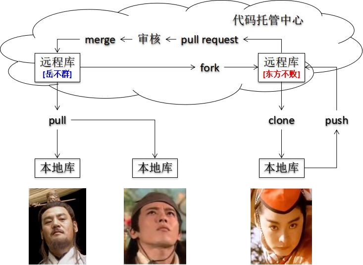

## git 命令行操作

###本地库初始化

* 命令：
  `git init`
* 效果：
  
* 注意：.git 目录中存放的是本地库相关的子目录和文件， 不要删除， 也不要胡乱修改。
* 作用：这个命令操作后，当前文件夹`E:/gittest`里面的文件都会被git所管理

> 此时会发现如上图，路径上有`（master）`，表示在将该文件夹变成一个git可以管理的仓库的同时，也新建了一个master分支（先不要考虑分支是什么概念，先简单理解为版本库的一个副本，一个仓库新建的时候就有一个默认的主副本master）。
> 当文件夹执行`git init`后发现该文件夹下，有一个.git子文件夹，这个文件夹目录用来跟踪管理版本的，以后这个本地仓库gittest所有的跟踪记录都将放在.git里面(.git里面有文件专门存放一些记录和参数)，只要该文件夹gittest下的文件有任何改动，都将有所记录。
> 值得注意的是，git管理的文件变化是指txt文本文件，xml文本文件，即一切文本文件，和源代码文件，比如js文件，java源代码，网页文件，php文件,c,c++等等，这些文件发生变化，git都会记录具体的变化位置和变化的内容；但对于二进制文件，比如图片文件,视频文件，git只能知道文件的大小发生了变化，但无法通知其变化的位置。

### 设置签名

* 形式
  用户名：agilehi
  Email：agilehi@aliyun.com
* 作用：区分不同开发人员的身份
* 注意：这里设置的签名和登录远程库(代码托管中心)的账号，密码没有任何关系
* 命令：
  1. 项目级别/仓库级别：仅在当前本地库范围内有效
     * 信息保存位置：当前本地仓库文件夹/.git/config文件
     
     * 命令格式：

        ```bash
        git config user.name agilehi
        git config user.email agilehi@aliyun.com
        ```

  2. 系统用户级别：登录当前操作系统的用户范围
     * 信息保存位置：在电脑的登录用户所在文件夹下
       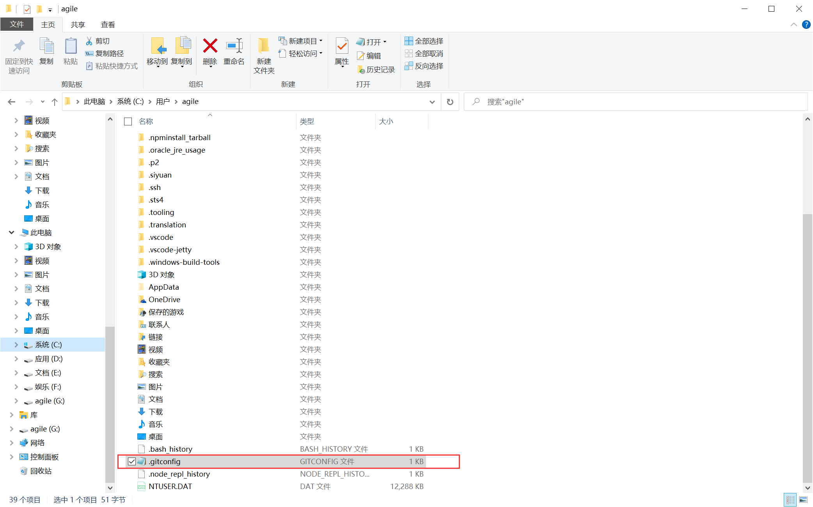
     * 命令格式：

        ```bash
        git config --global user.name agilehi
        git config --global user.email agilehi@aliyun.com
        ```

* 优先级别：
  1. 就近原则：项目级别优先于系统用户级别，二者都有，则采用项目级别的签名
  2. 如果只有系统用户级别的签名，就以系统用户级别的签名为准
  3. 二者都没有的情况下，是无法使用 Git 的

### 状态查看

* 命令格式：`git status`
* 作用：查看工作区、暂存区状态
* 操作示例：
  1. 当前本地仓库只是进行了初始化时，使用`git status`：
  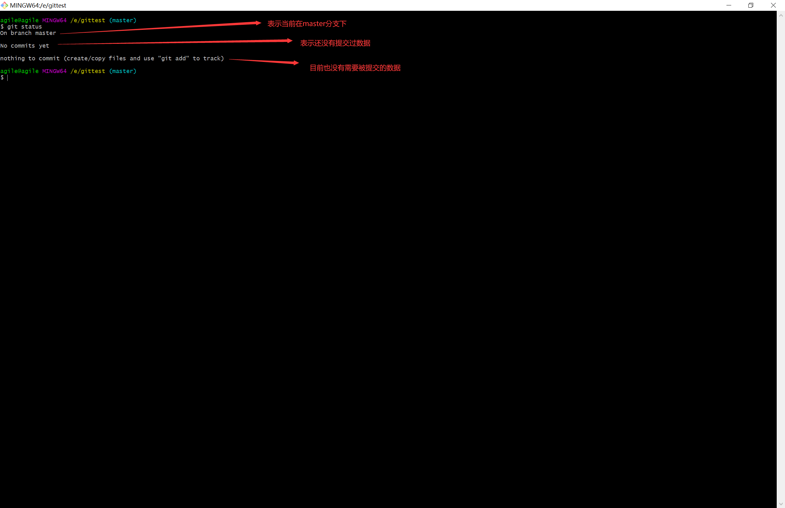
  2. 本地仓库添加了一个文件
  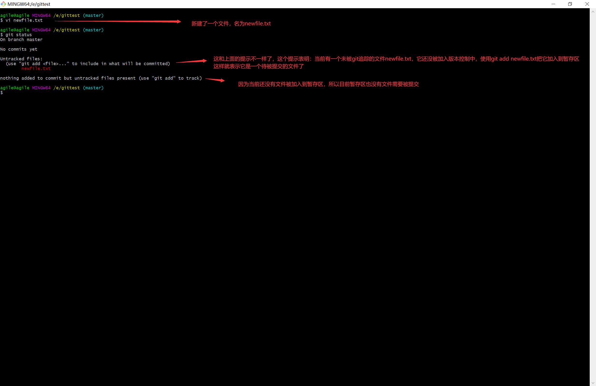
  3. 将上面步骤的文件使用`git add newfile.txt`，把工作区的文件加入到暂存区后，再使用`git status`:
  
  4. 使用`git rm --cached newfile.txt`后，再次使用`git status`查看当前工作区状态：
  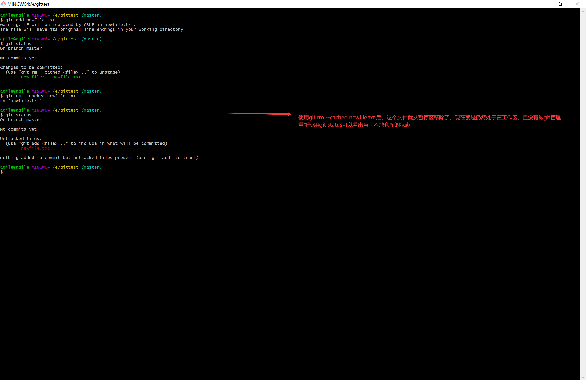
  5. 提交该文件后再查看：
  

### 添加

* 命令格式：git add [file name]
* 将对工作区文件的"新建文件或者修改删除"添加到暂存区
* 需要注意的是，可以使用`git add .`将当前修改的所有文件都添加到暂存区

### 提交

* 命令格式：`git commit -m "commit message" [file name]`
* 作用：将暂存区的内容提交到本地仓库
* 说明：如果该命令后面不指定暂存区的文件名，则会将所有放入到暂存区的文件，整体作为一次提交
* 补充：如果对当前的修改不满意，但是已经把该本地仓库的提交推送到了远程仓库，又不想远程被abandon，然后再进行本地修改后继续push,因为这会产生两个提交记录。如果只是解决一个bug，一般不需要两个提交记录，当成一个提交记录，即在已提交的记录上，修改代码，然后提交后，仍然是上一个提交记录，而不产生新的提交记录。此时可以使用：`git commit --amend`。当然在使用该命令前根据自己的需要修改工作区内容，修改后，使用 `git add filename`来添加到暂存区，最后使用该命令追加提交

### 查看提交记录

* 命令格式：`git log`
* 作用：查看提交记录
* 注意：如果想让信息一行行显示可以使用`git log --pretty=oneline`或者`git log --oneline`
* 可以使用`git reflog`查看完整的提交信息
  
* 多屏显示控制方式(如果提交记录太多的情况下)：
  空格向下翻页
  b 向上翻页
  q 退出
* 从上面的截图可以看到`git reflog`中有HEAD@{n},这表示HEAD@{移动到当前版本需要多少步}

### 前进后退

本质：就是将HEAD指针进行移动

* 基于索引值的操作(推荐)
  * `git reset --hard [局部索引值]`
  * 举例：`git reset --hard a6ace91`
* 使用`^`符号，只能后退，每一个`^`表示后退一个版本，这个后退是基于之前真实的提交记录顺序而言的
  * `git reset --hard HEAD^`:表示后退一个版本
  * `git reset --hard HEAD^^^^`:表示后退四个版本
* 使用`~`符号，只能后退
  * `git reset --hard HEAD~n`
  * 注意：表示后退n步

* 如果有使用了`git commit --amend`,它会产生一个不同于上一个提交的索引值，但是仍然是归于一次提交，所以使用`HEAD^`是无法让提交回退到追加前的提交记录状态，但是可以使用基于索引值的操作来回退到追加前的记录状态

* 对比reset三个命令的三个参数对比：
  1. --soft 参数
     * 仅仅在本地库移动HEAD指针
      

  2. --mixed 参数
     * 在本地库移动HEAD指针
     * 重置暂存区
      
  3. --hard 参数
     * 在本地库移动HEAD指针
     * 重置暂存区
     * 重置工作区
      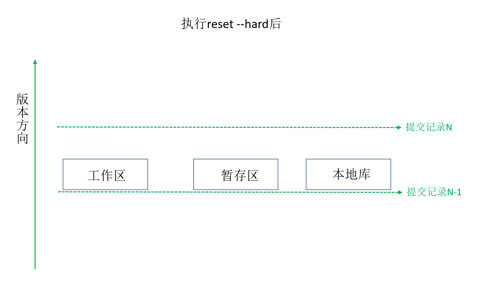

* 该操作可以用于找回被删除的文件，前提是该文件之前有被提交到本地仓库

### 合并多个commit

假如有1个提交，后来又有两次提交，commit的信息分别为：“第一次提交”，“第二次提交”，“第三次提交”；rebase可以使后来的两次提交都与第一次合并起来，作为一个提交，即作为“第一次提交”。

`git rebase -i 版本号` ，即该版本号之后提交的commit与此版本的提交合并，此时，这里的版号应该是“第一次提交”的版号。或者git rebase -i HEAD~n 表示把最近的n次提交合并成一个，即此时n=3

输入指令后进入vim编辑。应该会出现这样：

```shell
pick 第一次提交的版号
pick 第二次提交的版号
pick 第三次提交的版号
```

按insert键位，即可输入，然后将第二个，第三个的pick改成squash，即：

```shell
pick 第一次提交的版号
squash 第二次提交的版号
squash 第三次提交的版号
```

然后按esc，此时最下方出现了vi命令输入，输入`:wq`，即可实现保存退出，然后跳回git操作界面，然后进行rebase，中途会跳到vi界面，进行commit message，即合并后的“第一次提交”的新的提交信息。

git rebase --abort  撤销rebase操作

此命令适用于一个问题，一个解决提交，一个合并，但是当合并后发现提交的代码还需要在这次基础上修改，重新弄，可以继续在提交的基础上修改代码，然后commit，然后将新的提交合并到上一次的提交中，再合并到远程仓库。

此命令作用于多个commit，最终的结果是：代码的样子还是最后一次提交的样子，只不过rebase后提交的版号是之前的版号。

### 比较文件差异

* 命令格式：`git diff [文件名]`
  将工作区中的文件和暂存区进行比较
* `git diff [本地库中历史版本] [文件名]`
  将工作区中的文件和本地库历史记录比较
* 不带文件名将比较多个文件
  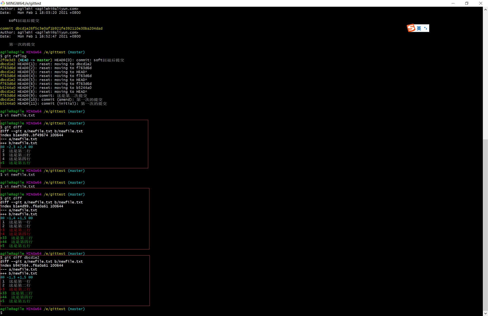

## 分支管理

### 认识分支

什么是分支？
在版本控制过程中， 使用多条线同时推进多个任务


分支的好处？

* 同时并行推进多个功能开发， 提高开发效率
* 各个分支在开发过程中， 如果某一个分支开发失败， 不会对其他分支有任何影响。 失败的分支删除重新开始即可。

### 分支操作

1.**创建分支**

* 命令格式：`git branch [新建的分支名]`
  解释：以当前的分支来作为母本，新建分支。所以想新建分支，要首先切换到要被作为母本的分支上
* 如果根据远程分支来新建一个本地分支，可以使用命令:
  `git checkout -b [新建的分支名 [远程名]/[远程分支名]`

2.**查看分支**

* 命令格式：`git branch -v`
  该命令只能查看本地仓库的分支
* 使用命令`git branch -r`可以查看远程的分支
* 使用命令`git branch -a`可以查看本地+远程的所有分支

3.**切换分支**

* 命令格式：`git checkout [分支名]`
  可用来切换到本地仓库的其他分支
* 新建+切换：`git checkout -b [新建的分支名]`

4.**合并分支**

* 第一步： 切换到接受修改的分支（被合并， 增加新内容） 上
  `git checkout [被合并分支名]`
* 第二步： 执行 merge 命令
  `git merge [有新内容分支名]`

> 即当要使分支B拥有分支A的改动，则应该先切换到分支B中，然后使用`git merge 分支A`，以此来更新分支B的内容。

5.**解决冲突**

当合并分支的时候，如果这两个分支都对同一个文件进行了修改，此时git管理工具无法决定该作何处理，只能交给人来取舍

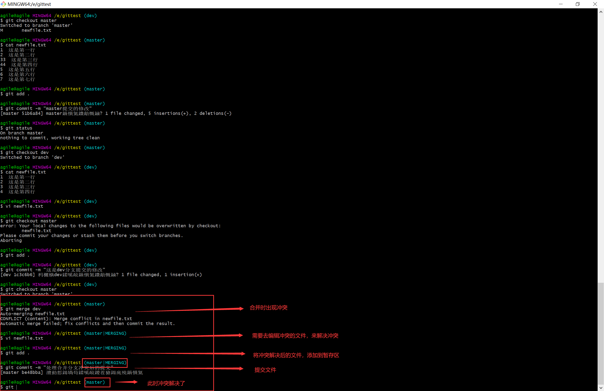
vi编辑文件的界面：


* 解决冲突的步骤：
  * 第一步： 编辑文件， 删除特殊符号
  * 第二步： 把文件修改到满意的程度， 保存退出
  * 第三步： `git add [文件名]`
  * 第四步： `git commit -m "日志信息"`
  * 注意： 此时 commit 一定不能带具体文件名

## Git基本原理

### 哈希

```flow
op1=>operation: 明文
op2=>operation: 加密算法
op3=>operation: 密文
op1(right)->op2(right)->op3(right)
```

哈希是一个系列的加密算法， 各个不同的哈希算法虽然加密强度不同， 但是有以下几个共同点：

  1. 不管输入数据的数据量有多大， 输入同一个哈希算法， 得到的加密结果长度固定。
  2. 哈希算法确定， 输入数据确定， 输出数据能够保证不变
  3. 哈希算法确定， 输入数据有变化， 输出数据一定有变化， 而且通常变化很大
  4. 哈希算法不可逆

Git 底层采用的是 SHA-1 算法。
哈希算法可以被用来验证文件。 原理如下图所示：
  
Git 就是靠这种机制来从根本上保证数据完整性的。

### 保存版本的机制

* 集中式版本控制工具的文件管理机制
  以文件变更列表的方式存储信息。 这类系统将它们保存的信息看作是一组基本文件和每个文件随时间逐步累积的差异。
  
* Git 的文件管理机制
  Git 把数据看作是小型文件系统的一组快照。 每次提交更新时 Git 都会对当前的全部文件制作一个快照并保存这个快照的索引。 为了高效， 如果文件没有修改，Git 不再重新存储该文件， 而是只保留一个链接指向之前存储的文件。 所以 Git 的工作方式可以称之为快照流
  

### Git 文件管理机制细节

* Git 的“提交对象”
  
  

### Git 分支管理机制

* 分支的创建
  
* 分支的切换
  
  
    ****
  
    ****
  

## 远程仓库

首先得需要去github官网使用已有的邮箱注册一个git账号，新建完毕后，这个git账号的远程仓库项目是空的，因为还没有创建过项目


1.**创建远程库地址**

```bash
git remote -v 查看当前所有远程地址别名
git remote add [远程库别名] [远程地址]
```

2.**推送**

* 命令格式：`git push [远程库别名] [分支名]`

  

3.**克隆**

* 命令格式：`git clone 远程仓库地址`


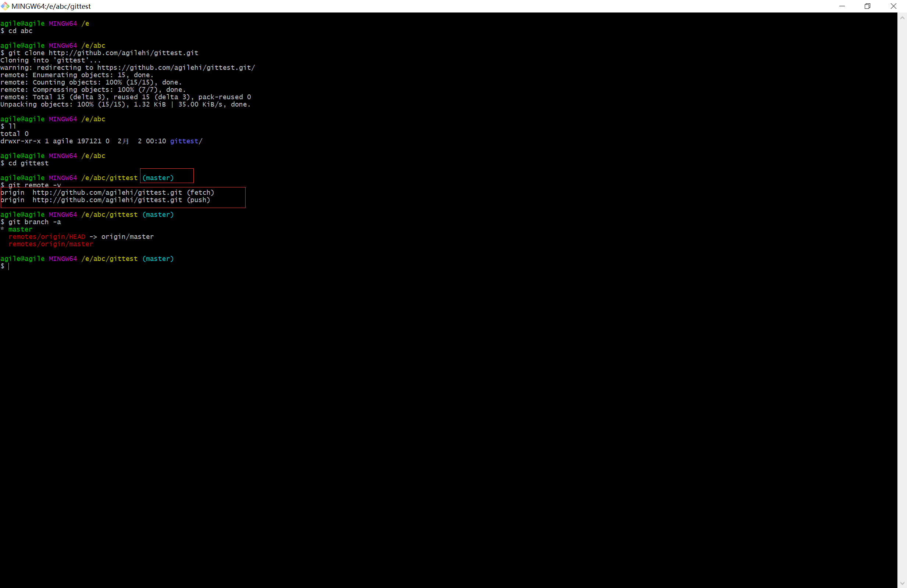

### 团队协作

假设有一个远程仓库是用户A创建的，如果此时想让非仓库的所有者也能参与提交代码，协作。此时可以在github上，在此仓库设置上，添加collaborator，即参与者。
此时被添加到参与的用户都能直接向该远程仓库进行push

当远程库的提交记录比自己本地仓库的记录还要多，则需要从远程库拉取代码到本地仓库，以达到更新本地仓库代码的目的

* 可以进行的操作：
  1. pull=fetch+merge
  `git fetch [远程库地址别名] [远程分支名]`
  `git merge [远程库地址别名]/[远程分支名]`
  `git pull [远程库地址别名] [远程分支名]`
需要注意的是，一般情况下不会直接进行pull，而是先fetch，然后看看有没有冲突，再合并，解决冲突的方式和本地分支间出现冲突解决办法一致

### 跨团队协作

* 需要先fork其他人的远程仓库，然后此时自己的远程仓库就会产生一个远程仓库，属于自己的远程仓库，而且内容和被fork的仓库内容一致。此时自己就可以使用自己的远程仓库，提交本地仓库代码到自己的远程仓库。如果完成了任务，可以在github页面上，发起pull Request，请求将自己的远程仓库和之前的别人的远程仓库进行代码合并。
* 这样做的好处就是，自己完成整个开发过程中，提交的代码都是在自己的本地仓库和自己的远程仓库进行，不会去污染原本的远程仓库，保证了版本控制的安全性，有效管理

## SSH登录

* 进入当前用户的家目录
    `$ cd ~`
* 删除.ssh 目录
    `$ rm -rvf .ssh`
* 运行命令生成.ssh 密钥目录
    `$ ssh-keygen -t rsa -C agilehi@aliyun.com`
    [注意： 这里-C 这个参数是大写的 C]
* 进入.ssh 目录查看文件列表
    `$ cd .ssh`
    `$ ls -lF`
* 查看 id_rsa.pub 文件内容
    `$ cat id_rsa.pub`
* 复制 id_rsa.pub 文件内容， 登录 GitHub， 点击用户头像→Settings→SSH and GPGkeys
* New SSH Key
* 输入复制的密钥信息
* 回到 Git bash 创建远程地址别名
    `git remote add origin_ssh git@github.com:agilehi/gittest.git`
* 推送文件进行测试

## idea使用git

### idea 操作git

1. idea配置git
   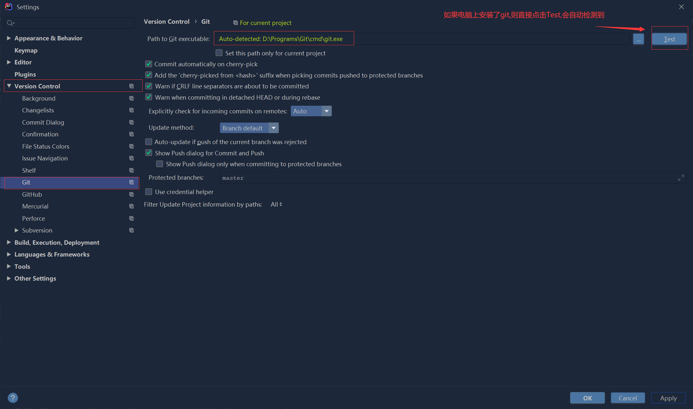
2. 让模块成为一个git所管理的本地仓库
   
   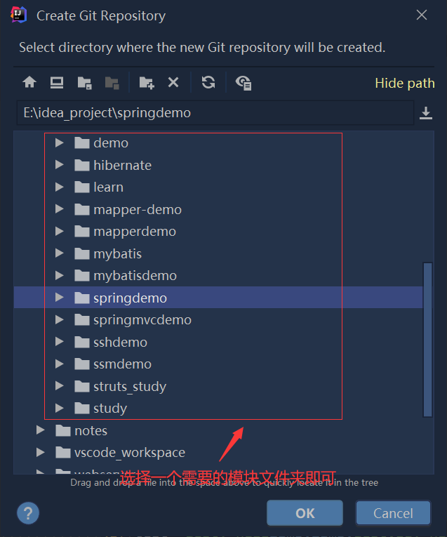
3. 提交到本地仓库
   
4. 添加远程仓库，并推送提交
    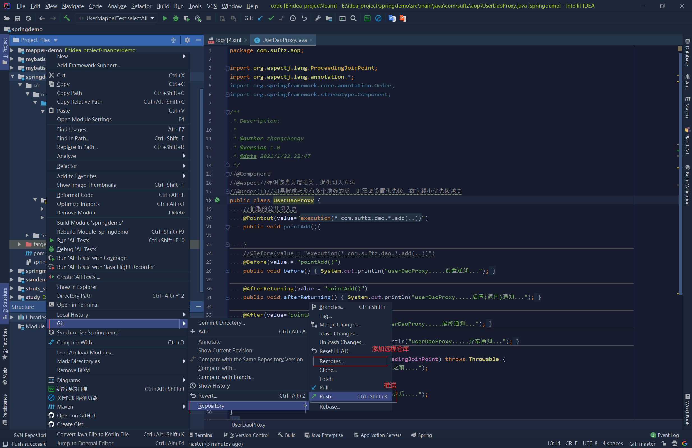

### 忽略文件

将代码编译后的文件排除在git管理之外，另外，还需要将与ide相关的特定文件排除，因为这与项目无关，而且不同的人可能使用不同的ide，或者同一ide的不同版本，而ide的配置文件可能会有所不同，所以需要排除

1. 在项目即本地仓库下新建一个文件`.gitignore`,内容格式如下：

   ```text
   target/
   *.iml
   .idea/
   ```

   上面设置表明要忽略target文件夹，以iml结尾的配置文件，以及`idea`的文件夹

2. 将新建的`.gitignore`文件添加到暂存区，并提交

3. 让Git识别该配置文件
   使用命令git config配置忽略配置文件`.gitignore`
    `git config core. excludesfile .gitignore`

4. 提交代码，推送到远程仓库，发现之前的要被忽略的文件仍然存在，那是因为这是之前在没有配置忽略文件时，就已经把这些文件加入了track中(被追踪),最开始使用了`git add .`,把文件夹下的所有文件纳入了git管理追踪之下，解决办法就是先把本地缓存删除（改变成未track状态），然后再提交:

   ```bash
   git rm -r --cached .
   git add .
   git commit -m "update .gitignore"
   git push origin master
   ```

## 工作流

在项目开发过程中使用 Git 的方式

### 工作流分类

#### 集中式工作流

像 SVN 一样， 集中式工作流以中央仓库作为项目所有修改的单点实体。 所有修改都提交到 Master 这个分支上。
这种方式与 SVN 的主要区别就是开发人员有本地库。Git 很多特性并没有用到。

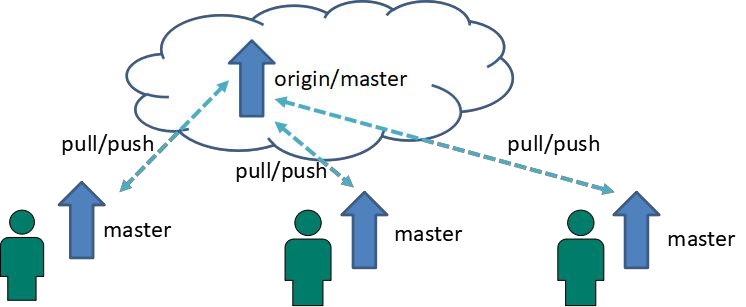

#### GitFlow 工作流

Gitflow 工作流通过为功能开发、 发布准备和维护设立了独立的分支， 让发布
迭代过程更流畅。 严格的分支模型也为大型项目提供了一些非常必要的结构


#### forking工作流

Forking 工作流是在 GitFlow 基础上， 充分利用了 Git 的 Fork 和 pull request 的功能以达到代码审核的目的。 更适合安全可靠地管理大团队的开发者， 而且能接受不信任贡献者的提交。

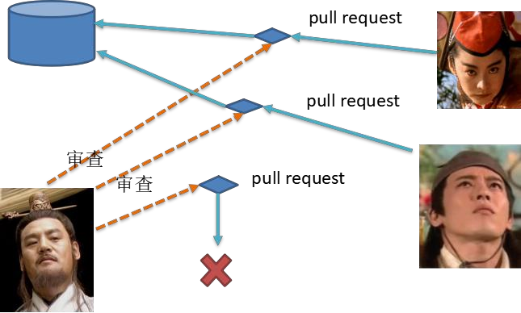

#### GitFlow 工作流详解

* 主干分支 master
主要负责管理正在运行的生产环境代码。 永远保持与正在运行的生产环境
完全一致。
* 开发分支 develop
主要负责管理正在开发过程中的代码。 一般情况下应该是最新的代码。
* bug 修理分支 hotfix
主要负责管理生产环境下出现的紧急修复的代码。 从主干分支分出， 修
理完毕并测试上线后， 并回主干分支。 并回后， 视情况可以删除该分支。
* 准生产分支（预发布分支） release
较大的版本上线前， 会从开发分支中分出准生产分支， 进行最后阶段的集
成测试。 该版本上线后， 会合并到主干分支。 生产环境运行一段阶段较稳定后
可以视情况删除。
* 功能分支 feature
为了不影响较短周期的开发工作， 一般把中长期开发模块， 会从开发分支
中独立出来。 开发完成后会合并到开发分支。

## gitlab服务器搭建过程

官网地址
首页： https://about.gitlab.com/
安装说明： https://about.gitlab.com/installation/

安装命令摘录

```shell
sudo yum install -y curl policycoreutils-python openssh-server cronie
sudo lokkit -s http -s ssh
sudo yum install postfix
sudo service postfix start
sudo chkconfig postfix on
curl https://packages.gitlab.com/install/repositories/gitlab/gitlab-ee/script.rpm.sh | sudo bash
sudo EXTERNAL_URL="http://gitlab.example.com" yum -y install gitlab-ee
```

实际问题： yum 安装 gitlab-ee(或 ce)时， 需要联网下载几百 M 的安装文件， 非常耗时， 所以应提前把所需 RPM 包下载并安装好。
下载地址为：
https://packages.gitlab.com/gitlab/gitlab-ce/packages/el/7/gitlab-ce-10.8.2-ce.0.el7.x86_64.rpm

调整后的安装过程
```shell
sudo rpm -ivh /opt/gitlab-ce-10.8.2-ce.0.el7.x86_64.rpm
sudo yum install -y curl policycoreutils-python openssh-server cronie
sudo lokkit -s http -s ssh
sudo yum install postfix
sudo service postfix start
sudo chkconfig postfix on
curl https://packages.gitlab.com/install/repositories/gitlab/gitlab-ce/script.rpm.sh | sudo bash
sudo EXTERNAL_URL="http://gitlab.example.com" yum -y install gitlab-ce
```

当前步骤完成后重启。

gitlab 服务操作

* 初始化配置 gitlab
gitlab-ctl reconfigure
* 启动 gitlab 服务
gitlab-ctl start
* 停止 gitlab 服务
gitlab-ctl stop

浏览器访问
访问 Linux 服务器 IP 地址即可， 如果想访问 EXTERNAL_URL 指定的域名还需要配置
域名服务器或本地 hosts 文件。
初次登录时需要为 gitlab 的 root 用户设置密码。

>如果安装成功后无法访问，应该会需要停止防火墙服务，或者打开该gitlab服务的端口号才能正常使用

### centos7安装gitlab

注意：不同的gitlab版本可能对应不同centos版本，因为gitlab安装包依赖的其他包，不同centos不一定存在

下列安装的版本信息如下：
CentOS Linux release 7.9.2009 (Core)

需要先安装openssh-server、policycoreutils-python

```bash
install -y curl policycoreutils-python openssh-server
systemctl enable sshd
systemctl start sshd

firewall-cmd --permanent --add-service=http
firewall-cmd --permanent --add-service=https
systemctl reload firewalld
systemctl start firewalld

yum install postfix
systemctl enable postfix
systemctl start postfix
```

如果报这样一条信息：Job for postfix.service failed because the control process exited with error code. See “systemctl status postfix.service” and “journalctl -xe” for details.
解决方法：修改 /etc/postfix/main.cf的配置并保存
inet_interfaces = all
inet_protocols = ipv4

安装之前需要去设置/etc/gitlab/gitlab.rb，修改external_url参数

执行`gitlab-ctl reconfigure`使配置生效

如果上述命令执行过程中报错：ruby_block[authorize Grafana with GitLab] action run
卡很长时间，然后报错
There was an error running gitlab-ctl reconfigure: ruby_block[authorize Grafana with GitLab] (gitlab::grafana line 92) had an error: Mixlib::ShellOut::CommandTimeout: Command timed out after 600s

重新修改gitlab.rb文件，修改配置grafana['enable'] = false

然后重新执行`gitlab-ctl reconfigure`
`gitlab-ctl start`
`gitlab-ctl stop`

> 如果gitlab的访问端口没有打开，可以使用命令打开防火墙的端口访问

使用命令下载安装包
`wget --content-disposition https://packages.gitlab.com/gitlab/gitlab-ce/packages/el/7/gitlab-ce-12.0.0-ce.0.el7.x86_64.rpm/download.rpm`

也可以去官网下载：
<https://packages.gitlab.com/gitlab/gitlab-ce/packages/el/7/gitlab-ce-12.0.0-ce.0.el7.x86_64.rpm>

## 常见问题处理

1. 问题：
Failed to connect to github.com port 443: Timed out
解决：在git终端输入：`git config --global http.sslVerify "false"`
