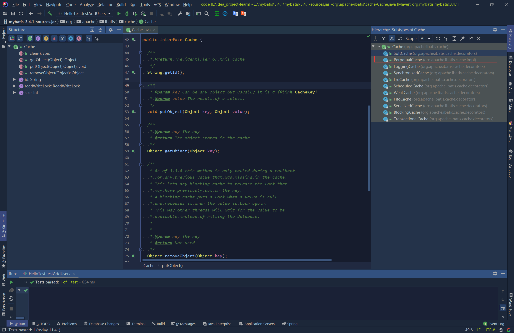
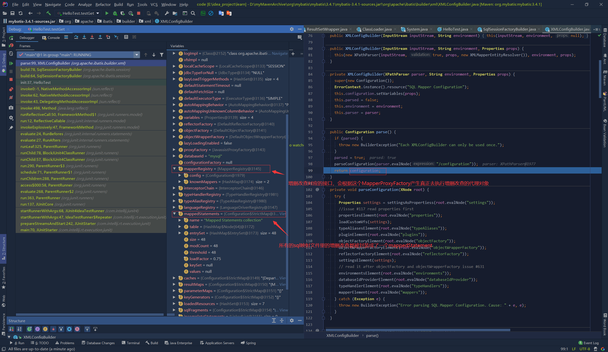
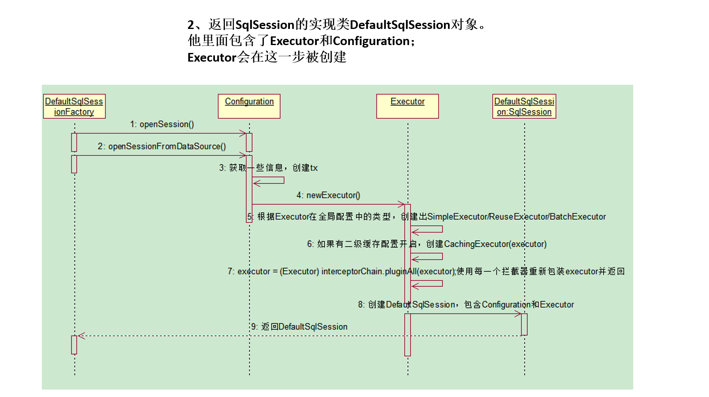
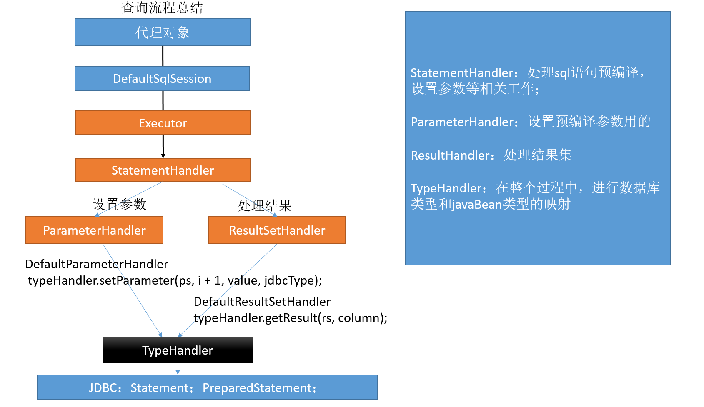
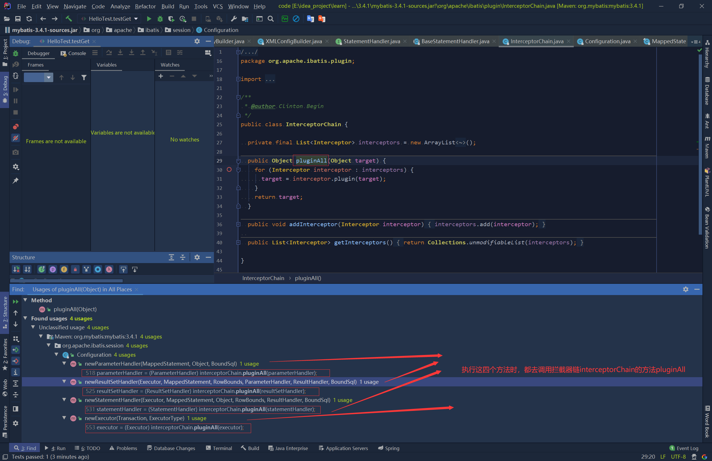

# MyBatis基础

[TOC]

## MyBatis概述

### MyBatis简介

* MyBatis 是一款优秀的持久层框架，它支持自定义 SQL、存储过程以及高级映射。MyBatis 免除了几乎所有的 JDBC 代码以及设置参数和获取结果集的工作。MyBatis 可以通过简单的 XML 或注解来配置和映射原始类型、接口和 Java POJO（Plain Old Java Objects，普通老式 Java 对象）为数据库中的记录
* MyBatis 本是apache的一个开源项目iBatis, 2010年这个项目由apache software foundation 迁移到了google code，并且改名为MyBatis 。2013年11月迁移到Github。
* iBATIS一词来源于“internet”和“abatis”的组合，是一个基于Java的持久层框架。iBATIS提供的持久层框架包括SQL Maps和Data Access Objects（DAOs）

* MyBatis特点
  * MyBatis 是支持定制化 SQL、存储过程以及高级映射的优秀的持久层框架。
  * MyBatis 避免了几乎所有的 JDBC 代码和手动设置参数以及获取结果集。
  * MyBatis可以使用简单的XML或注解用于配置和原始映射，将接口和Java的POJO（ Plain Old JavaObjects，普通的Java对象）映射成数据库中的记录.

* 为什么要用MyBatis
  1. MyBatis是一个半自动化的持久化层框架。
  2. JDBC
     * SQL夹在Java代码块里，耦合度高导致硬编码内伤
     * 维护不易且实际开发需求中sql是有变化，频繁修改的情况多见
  3. Hibernate和JPA
     * 长难复杂SQL，对于Hibernate而言处理也不容易
     * 内部自动生产的SQL，不容易做特殊优化。
     * 基于全映射的全自动框架，大量字段的POJO进行部分映射时比较困难,导致数据库性能下降。
  4. 对开发人员而言，核心sql还是需要自己优化
  5. sql和java编码分开，功能边界清晰，一个专注业务、一个专注数据。
  >1.Hibernate是让开发者完全去操作持久化对象来完成对数据库的操作，数据库对开发者是不透明的，而生成的sql无法优化，因为hibernate自动去根据开发者对持久化对象数据的修改来生成sql。除非是学习了更多的原理，以及它框架的内部深入的特性，来进行优化，这是很麻烦的。而且如果直接使用HQL来操作数据库，又要学习HQL
  >2.从JDBC-->DbUtils-->JdbcTemplate这些工具，慢慢的在对数据库进行封装，但是将sql语句写在java代码里面，硬编码高耦合的方式不是合理的开发模式。而hibernate又全自动的映射ORM，旨在清除sql，对javaBean-->编写sql-->预编译-->设置参数-->执行sql-->封装结果，这一过程全部都是hibernate自动完成。如果能将sql语句交给开发者去编写，而中间的操作仍由框架完成，则可以达到既能使sql语句和java代码分开，又能使得sql不失去灵活性的效果

### MyBatis下载

* 可以去官网查看官网文档：https://mybatis.org/mybatis-3/
* 也可以去github上去查看源码以及发布的包：https://github.com/mybatis/mybatis-3
* 版本发布地址：https://github.com/mybatis/mybatis-3/releases

* 也可以通过maven来引入依赖

### 第一个MyBatis程序

1. 通过Maven来引入所需要的依赖

   ```xml
   <?xml version="1.0" encoding="UTF-8"?>
   <project xmlns="http://maven.apache.org/POM/4.0.0"
            xmlns:xsi="http://www.w3.org/2001/XMLSchema-instance"
            xsi:schemaLocation="http://maven.apache.org/POM/4.0.0 http://maven.apache.org/xsd/maven-4.0.0.xsd">
       <modelVersion>4.0.0</modelVersion>

       <groupId>com.suftz.demo.mybatis</groupId>
       <artifactId>mybatis-demo</artifactId>
       <version>1.0-SNAPSHOT</version>

       <dependencies>
           <!--MyBatis本身需要的依赖，有这个就能够使用MyBatis了-->
           <dependency>
               <groupId>org.mybatis</groupId>
               <artifactId>mybatis</artifactId>
               <version>3.4.1</version>
           </dependency>
           <!--Java与mysql数据库连接的JDBC驱动-->
           <dependency>
               <groupId>mysql</groupId>
               <artifactId>mysql-connector-java</artifactId>
               <version>6.0.6</version>
           </dependency>

           <!--日志，可以不使用，如果使用了，还需要在项目根目录，新建一个log4j.xml-->
           <dependency>
               <groupId>org.apache.logging.log4j</groupId>
               <artifactId>log4j</artifactId>
               <version>2.8.2</version>
           </dependency>

           <!--单元测试JUnit4-->
           <dependency>
               <groupId>junit</groupId>
               <artifactId>junit</artifactId>
               <version>4.12</version>
               <scope>test</scope>
           </dependency>
       </dependencies>
   </project>
   ```

2. 根目录下新建一个log4j.xml(具体log4j怎么配置不是该文章的讲解内容)

   ```xml
   <?xml version="1.0" encoding="UTF-8" ?>
   <!DOCTYPE log4j:configuration SYSTEM "log4j.dtd">

   <log4j:configuration xmlns:log4j="http://jakarta.apache.org/log4j/">

       <appender name="STDOUT" class="org.apache.log4j.ConsoleAppender">
           <param name="Encoding" value="UTF-8" />
           <layout class="org.apache.log4j.PatternLayout">
               <param name="ConversionPattern" value="%-5p %d{MM-dd HH:mm:ss,SSS} %m  (%F:%L) \n" />
           </layout>
       </appender>
       <logger name="java.sql">
           <level value="debug" />
       </logger>
       <logger name="org.apache.ibatis">
           <level value="info" />
       </logger>
       <root>
           <level value="debug" />
           <appender-ref ref="STDOUT" />
       </root>
   </log4j:configuration>
   ```

3. 数据库连接的配置信息文件jdbc.properties

   ```properties
   props.driver=com.mysql.cj.jdbc.Driver
   props.url=jdbc:mysql://localhost:3306/mybatis?characterEncoding=utf8&useSSL=false&allowPublicKeyRetrieval=true&serverTimezone=Asia/Shanghai
   props.username=root
   props.password=booksys123
   ```

4. 在本地mysql数据库中，新建一个schema/数据库，名为mybatis,然后在该mybatis数据库中新建一个表user,具体细节如下sql语句：

   ```sql
   DROP TABLE IF EXISTS `user`;
   CREATE TABLE `user` (
     `uid` int(11) NOT NULL AUTO_INCREMENT,
     `name` varchar(255) DEFAULT NULL,
     `password` varchar(255) DEFAULT NULL,
     `age` varchar(255) DEFAULT NULL,
     `email` varchar(255) DEFAULT NULL,
     `address` varchar(255) DEFAULT NULL,
     PRIMARY KEY (`uid`)
   ) ENGINE=InnoDB AUTO_INCREMENT=102 DEFAULT CHARSET=utf8;
   ```

5. 新建一个User类，作为与数据库表字段进行映射的Java类

   ```java
   package com.suftz.demo.mybatis.bean;

   public class User {
       private Integer uid;
       private String name;
       private String password;
       private Integer age;
       private String email;
       private String address;

       public User() {
       }

       public User(String name, String password, Integer age, String email, String address) {
           this.name = name;
           this.password = password;
           this.age = age;
           this.email = email;
           this.address = address;
       }

       public User(Integer uid, String name, String password, Integer age, String email, String address) {
           this.uid = uid;
           this.name = name;
           this.password = password;
           this.age = age;
           this.email = email;
           this.address = address;
       }

       public Integer getUid() {
           return uid;
       }

       public void setUid(Integer uid) {
           this.uid = uid;
       }

       public String getName() {
           return name;
       }

       public void setName(String name) {
           this.name = name;
       }

       public String getPassword() {
           return password;
       }

       public void setPassword(String password) {
           this.password = password;
       }

       public Integer getAge() {
           return age;
       }

       public void setAge(Integer age) {
           this.age = age;
       }

       public String getEmail() {
           return email;
       }

       public void setEmail(String email) {
           this.email = email;
       }

       public String getAddress() {
           return address;
       }

       public void setAddress(String address) {
           this.address = address;
       }

       @Override
       public String toString() {
           return "User{" +
                   "uid=" + uid +
                   ", name='" + name + '\'' +
                   ", password='" + password + '\'' +
                   ", age=" + age +
                   ", email='" + email + '\'' +
                   ", address='" + address + '\'' +
                   '}';
       }
   }
   ```

6. 设置sql映射文件UserMapper.xml

   ```xml
   <?xml version="1.0" encoding="UTF-8" ?>
   <!DOCTYPE mapper
           PUBLIC "-//mybatis.org//DTD Mapper 3.0//EN"
           "http://mybatis.org/dtd/mybatis-3-mapper.dtd">
   <!--
       namespace:名称空间
       id:sql语句唯一标识
       resultType:返回值类型
       #{uid}:占位符,从传参中获取参数值放入到sql中
   -->
   <mapper namespace="com.suftz.demo.mybatis.dao.UserMapper">
       <select id="selectUser" resultType="com.suftz.demo.mybatis.bean.User">
       select * from user where uid = #{uid}
     </select>
   </mapper>
   ```

7. 在src目录下（如果是maven，则是在resources目录下）新建一个文件，作为MyBatis全局配置文件

   ```xml
   <?xml version="1.0" encoding="UTF-8" ?>
   <!DOCTYPE configuration
           PUBLIC "-//mybatis.org//DTD Config 3.0//EN"
           "http://mybatis.org/dtd/mybatis-3-config.dtd">
   <configuration>
       <!--引用上面配置的jdbc连接的配置信息-->
       <properties resource="jdbc.properties"/>

       <environments default="development">
           <environment id="development">
               <transactionManager type="JDBC"/>
               <dataSource type="POOLED">
                   <property name="driver" value="${props.driver}"/>
                   <property name="url" value="${props.url}"/>
                   <property name="username" value="${props.username}"/>
                   <property name="password" value="${props.password}"/>
               </dataSource>
           </environment>
       </environments>
       <!--将sql映射文件引用到全局配置文件中-->
       <mappers>
           <mapper resource="UserMapper.xml"/>
       </mappers>
   </configuration>
   ```

8. 最后来编写测试方法：

   ```java
   import com.suftz.demo.mybatis.bean.User;
   import org.apache.ibatis.io.Resources;
   import org.apache.ibatis.session.SqlSession;
   import org.apache.ibatis.session.SqlSessionFactory;
   import org.apache.ibatis.session.SqlSessionFactoryBuilder;
   import org.junit.Test;

   import java.io.IOException;
   import java.io.InputStream;
   import java.sql.SQLException;

   public class HelloTest {

       @Test
       public void test1() throws IOException {
           String resource = "mybatis-config.xml";
           InputStream inputStream = null;
           inputStream = Resources.getResourceAsStream(resource);
           SqlSessionFactory sqlSessionFactory = new SqlSessionFactoryBuilder().build(inputStream);
           try (SqlSession session = sqlSessionFactory.openSession()) {
               User user = (User) session.selectOne("com.suftz.demo.mybatis.dao.UserMapper.selectUser", 101);
               System.out.println(user);
           }
       }
   }
   ```

* 总结：
  1. 根据xml配置文件(全局配置文件)创建一个SqlSessionFactory对象
  2. 使用sqlSessionFactory工厂获取到sqlSession对象来执行增删改查操作
  3. sqlSession对象使用完毕后需要关闭资源

### 接口式编程

* 从上面的查询可以看出，传递的值依赖于字符串的字面值，这不安全，如果能按照接口来编程，事先进行规范，就能很好的约束传递参数，指明需要传递哪些数据类型的参数

1. 需要创建一个接口UserMapper.java

   ```java
   package com.suftz.demo.mybatis.dao;

   import com.suftz.demo.mybatis.bean.User;

   public interface UserMapper {
       public User getUserByUid(Integer uid);
   }
   ```

2. 需要在UserMapper.xml文件中指明sql映射

   ```xml
   <?xml version="1.0" encoding="UTF-8" ?>
   <!DOCTYPE mapper
           PUBLIC "-//mybatis.org//DTD Mapper 3.0//EN"
           "http://mybatis.org/dtd/mybatis-3-mapper.dtd">
   <!--
       namespace:名称空间
       id:sql语句唯一标识
       resultType:返回值类型
       #{uid}:占位符,从传参中获取参数值放入到sql中
   -->
   <mapper namespace="com.suftz.demo.mybatis.dao.UserMapper">
       <select id="selecttUser" resultType="com.suftz.demo.mybatis.bean.User">
       select * from user where uid = #{uid}
     </select>
       <select id="getUserByUid" resultType="com.suftz.demo.mybatis.bean.User">
       select * from user where uid = #{uid}
     </select>
   </mapper>
   ```

3. 编写测试方法

   ```java
   import com.suftz.demo.mybatis.bean.User;
   import com.suftz.demo.mybatis.dao.UserMapper;
   import org.apache.ibatis.io.Resources;
   import org.apache.ibatis.session.SqlSession;
   import org.apache.ibatis.session.SqlSessionFactory;
   import org.apache.ibatis.session.SqlSessionFactoryBuilder;
   import org.junit.Test;

   import java.io.IOException;
   import java.io.InputStream;
   import java.sql.SQLException;

   public class HelloTest {

       @Test
       public void test1() throws IOException {
           String resource = "mybatis-config.xml";
           InputStream inputStream = null;
           inputStream = Resources.getResourceAsStream(resource);
           SqlSessionFactory sqlSessionFactory = new SqlSessionFactoryBuilder().build(inputStream);
           try (SqlSession session = sqlSessionFactory.openSession()) {
               User user = (User) session.selectOne("com.suftz.demo.mybatis.dao.UserMapper.selectUser", 101);
               System.out.println(user);
           }
       }

       @Test
       public void test2() throws IOException {
           String resource = "mybatis-config.xml";
           InputStream inputStream = null;
           inputStream = Resources.getResourceAsStream(resource);
           SqlSessionFactory sqlSessionFactory = new SqlSessionFactoryBuilder().build(inputStream);
           try (SqlSession session = sqlSessionFactory.openSession()) {
               UserMapper userMapper = session.getMapper(UserMapper.class);
               User user=userMapper.getUserByUid(101);
               System.out.println(user);
           }
       }
   }
   ```

* 小结
  1. SqlSession代表和数据库的一次会话，用完必须关闭
  2. SqlSeesion和Connection一样都是非线程安全的，每次使用都应该去获取新的对象
  3. mapper接口没有实现类，但是MyBatis会为这个接口生成一个代理对象。（将接口和sql映射绑定）
  4. 两个重要的文件：
     * 全局mybatis的配置文件：包含数据库连接信息，事务管理器信息...系统运行环境等
     * sql映射文件：保存了每一个sql语句的映射信息

## 全局配置文件

### 属性（properties）

这些属性可以在外部进行配置，并可以进行动态替换。既可以在典型的 Java 属性文件中配置这些属性，也可以在 properties 元素的子元素中设置

```xml
<properties resource="org/mybatis/example/config.properties">
  <property name="username" value="dev_user"/>
  <property name="password" value="F2Fa3!33TYyg"/>
</properties>
```

设置好的属性可以在整个配置文件中用来替换需要动态配置的属性值。比如:

```xml
<dataSource type="POOLED">
  <property name="driver" value="${driver}"/>
  <property name="url" value="${url}"/>
  <property name="username" value="${username}"/>
  <property name="password" value="${password}"/>
</dataSource>
```

也可以在 SqlSessionFactoryBuilder.build() 方法中传入属性值。例如：

```java
SqlSessionFactory factory = new SqlSessionFactoryBuilder().build(reader, props);

// ... 或者 ...

SqlSessionFactory factory = new SqlSessionFactoryBuilder().build(reader, environment, props);
```


如果一个属性在不只一个地方进行了配置，那么，MyBatis 将按照下面的顺序来加载：

* 首先读取在 properties 元素体内指定的属性。
* 然后根据 properties 元素中的 resource 属性读取类路径下属性文件，或根据 url 属性指定的路径读取属性文件，并覆盖之前读取过的同名属性。
* 最后读取作为方法参数传递的属性，并覆盖之前读取过的同名属性。

因此，通过方法参数传递的属性具有最高优先级，resource/url 属性中指定的配置文件次之，最低优先级的则是 properties 元素中指定的属性。

从 MyBatis 3.4.2 开始可以为占位符指定一个默认值。例如：

```xml
<dataSource type="POOLED">
  <!-- ... -->
  <property name="username" value="${username:ut_user}"/> <!-- 如果属性 'username' 没有被配置，'username' 属性的值将为 'ut_user' -->
</dataSource>
```

这个特性默认是关闭的。要启用这个特性，需要添加一个特定的属性来开启这个特性。例如：

```xml
<properties resource="org/mybatis/example/config.properties">
  <!-- ... -->
  <property name="org.apache.ibatis.parsing.PropertyParser.enable-default-value" value="true"/> <!-- 启用默认值特性 -->
</properties>
```

但是上面的`:`可能会在使用其他表达式的时候产生影响，比如:
在属性名中使用了 `":"` 字符（如：`db:username`），或者在 SQL 映射中使用了 OGNL 表达式的三元运算符（如： `${tableName != null ? tableName : 'global_constants'}`），就需要设置特定的属性来修改分隔属性名和默认值的字符。例如：

```xml
<properties resource="org/mybatis/example/config.properties">
  <!-- ... -->
  <property name="org.apache.ibatis.parsing.PropertyParser.default-value-separator" value="?:"/> <!-- 修改默认值的分隔符 -->
</properties>
```

此时为占位符指定默认值时，中间的分隔符变成了`?:`

```xml
<dataSource type="POOLED">
  <!-- ... -->
  <property name="username" value="${db:username?:ut_user}"/>
</dataSource>
```

### 设置（settings）

这是 MyBatis 中极为重要的调整设置，它们会改变 MyBatis 的运行时行为。 下表描述了设置中各项设置的含义、默认值等。

|设置名|描述|有效值|默认值|
|:----|:----|:----|:----|
|cacheEnabled|全局性地开启或关闭所有映射器配置文件中已配置的任何缓存。|true \| false|true|
|lazyLoadingEnabled|延迟加载的全局开关。当开启时，所有关联对象都会延迟加载。 特定关联关系中可通过设置 fetchType 属性来覆盖该项的开关状态。|true \| false|false|
|aggressiveLazyLoading|开启时，任一方法的调用都会加载该对象的所有延迟加载属性。 否则，每个延迟加载属性会按需加载（参考 lazyLoadTriggerMethods)。|true \| false|	false （在 3.4.1 及之前的版本中默认为 true）|
|multipleResultSetsEnabled|是否允许单个语句返回多结果集（需要数据库驱动支持）。|true \| false|true|
useColumnLabel|使用列标签代替列名。实际表现依赖于数据库驱动，具体可参考数据库驱动的相关文档，或通过对比测试来观察。|true \| false|true|
|useGeneratedKeys|允许 JDBC 支持自动生成主键，需要数据库驱动支持。如果设置为 true，将强制使用自动生成主键。尽管一些数据库驱动不支持此特性，但仍可正常工作（如 Derby）。|true \| false|False|
|autoMappingBehavior|指定 MyBatis 应如何自动映射列到字段或属性。 NONE 表示关闭自动映射；PARTIAL 只会自动映射没有定义嵌套结果映射的字段。 FULL 会自动映射任何复杂的结果集（无论是否嵌套）。|NONE, PARTIAL, FULL|PARTIAL|
|autoMappingUnknownColumnBehavior|指定发现自动映射目标未知列（或未知属性类型）的行为。<br>NONE: 不做任何反应<br>WARNING: 输出警告日志（'org.apache.ibatis.session.AutoMappingUnknownColumnBehavior' 的日志等级必须设置为 WARN）<br>FAILING: 映射失败 (抛出 SqlSessionException)|NONE, WARNING, FAILING|NONE|
|defaultExecutorType|配置默认的执行器。SIMPLE 就是普通的执行器；REUSE 执行器会重用预处理语句（PreparedStatement）； BATCH 执行器不仅重用语句还会执行批量更新。|SIMPLE REUSE BATCH|SIMPLE|
|defaultStatementTimeout|设置超时时间，它决定数据库驱动等待数据库响应的秒数。|任意正整数|未设置 (null)|
|defaultFetchSize|为驱动的结果集获取数量（fetchSize）设置一个建议值。此参数只可以在查询设置中被覆盖。|任意正整数|未设置 (null)|
|defaultResultSetType|指定语句默认的滚动策略。（新增于 3.5.2）|FORWARD_ONLY \| SCROLL_SENSITIVE \| SCROLL_INSENSITIVE \| DEFAULT（等同于未设置）|未设置 (null)|
|safeRowBoundsEnabled|是否允许在嵌套语句中使用分页（RowBounds）。如果允许使用则设置为 false。|true \| false|False|
|safeResultHandlerEnabled|是否允许在嵌套语句中使用结果处理器（ResultHandler）。如果允许使用则设置为 false。|true \| false|True|
|mapUnderscoreToCamelCase|是否开启驼峰命名自动映射，即从经典数据库列名 A_COLUMN 映射到经典 Java 属性名 aColumn。|true \| false|False|
|localCacheScope|MyBatis 利用本地缓存机制（Local Cache）防止循环引用和加速重复的嵌套查询。 默认值为 SESSION，会缓存一个会话中执行的所有查询。 若设置值为 STATEMENT，本地缓存将仅用于执行语句，对相同 SqlSession 的不同查询将不会进行缓存。|SESSION \| STATEMENT|SESSION|
|jdbcTypeForNull|当没有为参数指定特定的 JDBC 类型时，空值的默认 JDBC 类型。 某些数据库驱动需要指定列的 JDBC 类型，多数情况直接用一般类型即可，比如 NULL、VARCHAR 或 OTHER。|JdbcType 常量，常用值：NULL、VARCHAR 或 OTHER。|OTHER|
|lazyLoadTriggerMethods|指定对象的哪些方法触发一次延迟加载。|用逗号分隔的方法列表。|equals,clone,hashCode,toString|
|defaultScriptingLanguage|指定动态 SQL 生成使用的默认脚本语言。|一个类型别名或全限定类名。|org.apache.ibatis.scripting.xmltags.XMLLanguageDriver|
|defaultEnumTypeHandler|指定 Enum 使用的默认 TypeHandler 。（新增于 3.4.5）|一个类型别名或全限定类名。|org.apache.ibatis.type.EnumTypeHandler|
|callSettersOnNulls|指定当结果集中值为 null 的时候是否调用映射对象的 setter（map 对象时为 put）方法，这在依赖于 Map.keySet() 或 null 值进行初始化时比较有用。注意基本类型（int、boolean 等）是不能设置成 null 的。|true \| false|false|
|returnInstanceForEmptyRow|当返回行的所有列都是空时，MyBatis默认返回 null。 当开启这个设置时，MyBatis会返回一个空实例。 请注意，它也适用于嵌套的结果集（如集合或关联）。（新增于 3.4.2）|true \| false|false|
|logPrefix|指定 MyBatis 增加到日志名称的前缀。|任何字符串|未设置|
|logImpl|指定 MyBatis 所用日志的具体实现，未指定时将自动查找。|SLF4J \| LOG4J \| LOG4J2 \| JDK_LOGGING \| COMMONS_LOGGING \| STDOUT_LOGGING \| NO_LOGGING|未设置|
|proxyFactory|指定 Mybatis 创建可延迟加载对象所用到的代理工具。|CGLIB \| JAVASSIST|JAVASSIST （MyBatis 3.3 以上）|
|vfsImpl|指定 VFS 的实现|自定义 VFS 的实现的类全限定名，以逗号分隔。|未设置|
|useActualParamName|允许使用方法签名中的名称作为语句参数名称。 为了使用该特性，你的项目必须采用 Java 8 编译，并且加上 -parameters 选项。（新增于 3.4.1）|true \| false|true|
|configurationFactory|指定一个提供 Configuration 实例的类。 这个被返回的 Configuration 实例用来加载被反序列化对象的延迟加载属性值。 这个类必须包含一个签名为static Configuration getConfiguration() 的方法。（新增于 3.2.3）|一个类型别名或完全限定类名。|未设置|
|shrinkWhitespacesInSql|从SQL中删除多余的空格字符。请注意，这也会影响SQL中的文字字符串。 (新增于 3.5.5)|true \| false|false|
|defaultSqlProviderType|指定一个保存提供程序方法的SQL提供程序类（自3.5.6开始）。当省略了这些属性时，此类适用于sql provider注释（例如@SelectProvider）上的type（或value）属性。|类型别名或完全限定的类名|Not set|

一个配置完整的settings元素的示例如下:

```xml
<settings>
  <setting name="cacheEnabled" value="true"/>
  <setting name="lazyLoadingEnabled" value="true"/>
  <setting name="multipleResultSetsEnabled" value="true"/>
  <setting name="useColumnLabel" value="true"/>
  <setting name="useGeneratedKeys" value="false"/>
  <setting name="autoMappingBehavior" value="PARTIAL"/>
  <setting name="autoMappingUnknownColumnBehavior" value="WARNING"/>
  <setting name="defaultExecutorType" value="SIMPLE"/>
  <setting name="defaultStatementTimeout" value="25"/>
  <setting name="defaultFetchSize" value="100"/>
  <setting name="safeRowBoundsEnabled" value="false"/>
  <setting name="mapUnderscoreToCamelCase" value="false"/>
  <setting name="localCacheScope" value="SESSION"/>
  <setting name="jdbcTypeForNull" value="OTHER"/>
  <setting name="lazyLoadTriggerMethods" value="equals,clone,hashCode,toString"/>
</settings>
```

### 类型别名（typeAliases）

* MyBatis已经为Java自己内置定义的一些Java类取了别名
* 全类名的方式其实更方便在配置文件中查看，这个resultType是哪个Java类型

类型别名可为 Java 类型设置一个缩写名字。 它仅用于 XML 配置，意在降低冗余的全限定类名书写。例如：

```xml
<typeAliases>
  <typeAlias alias="Author" type="domain.blog.Author"/>
  <typeAlias alias="Blog" type="domain.blog.Blog"/>
  <typeAlias alias="Comment" type="domain.blog.Comment"/>
  <typeAlias alias="Post" type="domain.blog.Post"/>
  <typeAlias alias="Section" type="domain.blog.Section"/>
  <typeAlias alias="Tag" type="domain.blog.Tag"/>
</typeAliases>
```

当这样配置时，Blog 可以用在任何使用 domain.blog.Blog 的地方。
也可以指定一个包名，MyBatis 会在包名下面搜索需要的 Java Bean，比如：

```xml
<typeAliases>
  <package name="domain.blog"/>
</typeAliases>
```

每一个在包 domain.blog 中的 Java Bean，在没有注解的情况下，会使用 Bean 的首字母小写的非限定类名来作为它的别名。 比如 domain.blog.Author 的别名为 author；若有注解，则别名为其注解值。见下面的例子：

```java
@Alias("author")
public class Author {
    ...
}
```

* 示例配置文件中的使用：

```xml
<!--typeAliases:别名处理器：可以为java类型起别名，这样就可以在sql映射文件中的select标签的resultType属性中直接使用别名了，不用写全类名-->
<!--别名不区分大小写-->
<typeAliases>
    <typeAlias type="com.suftz.demo.mybatis.bean.User" alias="user" />

    <!--
        package:为某个包下的所有类批量起别名
        name:指定包名（为当前包以及下面所有的后代包的每一个类都起一个默认别名(类名小写)）
        批量起别名的情况下，使用@Alias注解为某个类型指定新的别名
    -->
    <package name="com.suftz.demo.mybatis.bean" />

</typeAliases>
```

下面是一些为常见的 Java 类型内建的类型别名。它们都是不区分大小写的，注意，为了应对原始类型的命名重复，采取了特殊的命名风格。

|别名|映射的类型|
|:----|:----|
|_byte|byte|
|_long|long|
|_short|short|
|_int|int|
|_integer|int|
|_double|double|
|_float|float|
|_boolean|boolean|
|string|String|
|byte|Byte|
|long|Long|
|short|Short|
|int|Integer|
|integer|Integer|
|double|Double|
|float|Float|
|boolean|Boolean|
|date|Date|
|decimal|BigDecimal|
|bigdecimal|BigDecimal|
|object|Object|
|map|Map|
|hashmap|HashMap|
|list|List|
|arraylist|ArrayList|
|collection|Collection|
|iterator|Iterator|

### 类型处理器（typeHandlers）

|类型处理器|Java 类型|JDBC 类型|
|:----|:----|:----|
|BooleanTypeHandler|java.lang.Boolean, boolean|数据库兼容的 BOOLEAN|
|ByteTypeHandler|java.lang.Byte, byte|数据库兼容的 NUMERIC 或 BYTE|
|ShortTypeHandler|java.lang.Short, short|数据库兼容的 NUMERIC 或 SMALLINT|
|IntegerTypeHandler|java.lang.Integer, int|数据库兼容的 NUMERIC 或 INTEGER|
|LongTypeHandler|java.lang.Long, long|数据库兼容的 NUMERIC 或 BIGINT|
|FloatTypeHandler|java.lang.Float, float|数据库兼容的 NUMERIC 或 FLOAT|
|DoubleTypeHandler|java.lang.Double, double|数据库兼容的 NUMERIC 或 DOUBLE|
|BigDecimalTypeHandler|java.math.BigDecimal|数据库兼容的 NUMERIC 或 DECIMAL|
|StringTypeHandler|java.lang.String|CHAR, VARCHAR|
|ClobReaderTypeHandler|java.io.Reader|-|
|ClobTypeHandler|java.lang.String|CLOB, LONGVARCHAR|
|NStringTypeHandler|java.lang.String|NVARCHAR, NCHAR|
|NClobTypeHandler|java.lang.String|NCLOB|
|BlobInputStreamTypeHandler|java.io.InputStream	-|
|ByteArrayTypeHandler|byte[]|数据库兼容的字节流类型|
|BlobTypeHandler|byte[]|BLOB, LONGVARBINARY|
|DateTypeHandler|java.util.Date|TIMESTAMP|
|DateOnlyTypeHandler|java.util.Date|DATE|
|TimeOnlyTypeHandler|java.util.Date|TIME|
|SqlTimestampTypeHandler|java.sql.Timestamp|TIMESTAMP|
|SqlDateTypeHandler|java.sql.Date|DATE|
|SqlTimeTypeHandler|java.sql.Time|TIME|
|ObjectTypeHandler|Any|OTHER 或未指定类型|
|EnumTypeHandler|Enumeration Type|VARCHAR 或任何兼容的字符串类型，用来存储枚举的名称（而不是索引序数值）|
|EnumOrdinalTypeHandler|Enumeration Type|任何兼容的 NUMERIC 或 DOUBLE 类型，用来存储枚举的序数值（而不是名称）。|
|SqlxmlTypeHandler|java.lang.String|SQLXML|
|InstantTypeHandler|java.time.Instant|TIMESTAMP|
|LocalDateTimeTypeHandler|java.time.LocalDateTime|TIMESTAMP|
|LocalDateTypeHandler|java.time.LocalDate|DATE|
|LocalTimeTypeHandler|java.time.LocalTime|TIME|
|OffsetDateTimeTypeHandler|java.time.OffsetDateTime|TIMESTAMP|
|OffsetTimeTypeHandler|java.time.OffsetTime|TIME|
|ZonedDateTimeTypeHandler|java.time.ZonedDateTime|TIMESTAMP|
|YearTypeHandler|java.time.Year|INTEGER|
|MonthTypeHandler|java.time.Month|INTEGER|
|YearMonthTypeHandler|java.time.YearMonth|VARCHAR 或 LONGVARCHAR|
|JapaneseDateTypeHandler|java.time.chrono.JapaneseDate|DATE|

可以重写已有的类型处理器或创建自己的类型处理器来处理不支持的或非标准的类型。 具体做法为：实现 org.apache.ibatis.type.TypeHandler 接口， 或继承一个很便利的类 org.apache.ibatis.type.BaseTypeHandler， 并且可以（可选地）将它映射到一个 JDBC 类型。比如：

```java
// ExampleTypeHandler.java
@MappedJdbcTypes(JdbcType.VARCHAR)
public class ExampleTypeHandler extends BaseTypeHandler<String> {

  @Override
  public void setNonNullParameter(PreparedStatement ps, int i, String parameter, JdbcType jdbcType) throws SQLException {
    ps.setString(i, parameter);
  }

  @Override
  public String getNullableResult(ResultSet rs, String columnName) throws SQLException {
    return rs.getString(columnName);
  }

  @Override
  public String getNullableResult(ResultSet rs, int columnIndex) throws SQLException {
    return rs.getString(columnIndex);
  }

  @Override
  public String getNullableResult(CallableStatement cs, int columnIndex) throws SQLException {
    return cs.getString(columnIndex);
  }
}
```

```xml
<!-- mybatis-config.xml -->
<typeHandlers>
  <typeHandler handler="org.mybatis.example.ExampleTypeHandler"/>
</typeHandlers>
```

使用上述的类型处理器将会覆盖已有的处理 Java String 类型的属性以及 VARCHAR 类型的参数和结果的类型处理器。 要注意 MyBatis 不会通过检测数据库元信息来决定使用哪种类型，所以你必须在参数和结果映射中指明字段是 VARCHAR 类型， 以使其能够绑定到正确的类型处理器上。这是因为 MyBatis 直到语句被执行时才清楚数据类型。

通过类型处理器的泛型，MyBatis 可以得知该类型处理器处理的 Java 类型，不过这种行为可以通过两种方法改变：

* 在类型处理器的配置元素（typeHandler 元素）上增加一个 `javaType` 属性（比如：`javaType="String"`）；
* 在类型处理器的类上增加一个 `@MappedTypes` 注解指定与其关联的 Java 类型列表。 如果在 javaType` 属性中也同时指定，则注解上的配置将被忽略。

可以通过两种方式来指定关联的 JDBC 类型：

* 在类型处理器的配置元素上增加一个 `jdbcType` 属性（比如：`jdbcType="VARCHAR"`）；
* 在类型处理器的类上增加一个 `@MappedJdbcTypes` 注解指定与其关联的 JDBC 类型列表。 如果在 jdbcType 属性中也同时指定，则注解上的配置将被忽略。
当在 `ResultMap` 中决定使用哪种类型处理器时，此时 Java 类型是已知的（从结果类型中获得），但是 JDBC 类型是未知的。 因此 Mybatis 使用 `javaType=[Java 类型], jdbcType=null` 的组合来选择一个类型处理器。 这意味着使用 `@MappedJdbcTypes` 注解可以限制类型处理器的作用范围，并且可以确保，除非显式地设置，否则类型处理器在 `ResultMap` 中将不会生效。 如果希望能在 `ResultMap` 中隐式地使用类型处理器，那么设置 `@MappedJdbcTypes` 注解的 `includeNullJdbcType=true` 即可。 然而从 Mybatis 3.4.0 开始，如果某个 Java 类型只有一个注册的类型处理器，即使没有设置 `includeNullJdbcType=true`，那么这个类型处理器也会是 `ResultMap` 使用 Java 类型时的默认处理器。

最后，可以让 MyBatis 帮助查找类型处理器：

```xml
<!-- mybatis-config.xml -->
<typeHandlers>
  <package name="org.mybatis.example"/>
</typeHandlers>
```

注意在使用自动发现功能的时候，只能通过注解方式来指定 JDBC 的类型。

可以创建能够处理多个类的泛型类型处理器。为了使用泛型类型处理器， 需要增加一个接受该类的 class 作为参数的构造器，这样 MyBatis 会在构造一个类型处理器实例的时候传入一个具体的类。

```java
//GenericTypeHandler.java
public class GenericTypeHandler<E extends MyObject> extends BaseTypeHandler<E> {

  private Class<E> type;

  public GenericTypeHandler(Class<E> type) {
    if (type == null) throw new IllegalArgumentException("Type argument cannot be null");
    this.type = type;
  }
  ...
```

### 处理枚举类型

若想映射枚举类型 Enum，则需要从 EnumTypeHandler 或者 EnumOrdinalTypeHandler 中选择一个来使用。

比如说我们想存储取近似值时用到的舍入模式。默认情况下，MyBatis 会利用 EnumTypeHandler 来把 Enum 值转换成对应的名字。

注意 EnumTypeHandler 在某种意义上来说是比较特别的，其它的处理器只针对某个特定的类，而它不同，它会处理任意继承了 Enum 的类。
不过，我们可能不想存储名字，相反我们的 DBA 会坚持使用整形值代码。那也一样简单：在配置文件中把 EnumOrdinalTypeHandler 加到 typeHandlers 中即可， 这样每个 RoundingMode 将通过他们的序数值来映射成对应的整形数值。

```xml
<!-- mybatis-config.xml -->
<typeHandlers>
  <typeHandler handler="org.apache.ibatis.type.EnumOrdinalTypeHandler" javaType="java.math.RoundingMode"/>
</typeHandlers>
```

但要是你想在一个地方将 Enum 映射成字符串，在另外一个地方映射成整形值呢？

自动映射器（auto-mapper）会自动地选用 EnumOrdinalTypeHandler 来处理枚举类型， 所以如果我们想用普通的 EnumTypeHandler，就必须要显式地为那些 SQL 语句设置要使用的类型处理器。

（下一节才开始介绍映射器文件，如果你是首次阅读该文档，你可能需要先跳过这里，过会再来看。）

```xml
<!DOCTYPE mapper
    PUBLIC "-//mybatis.org//DTD Mapper 3.0//EN"
    "http://mybatis.org/dtd/mybatis-3-mapper.dtd">

<mapper namespace="org.apache.ibatis.submitted.rounding.Mapper">
    <resultMap type="org.apache.ibatis.submitted.rounding.User" id="usermap">
        <id column="id" property="id"/>
        <result column="name" property="name"/>
        <result column="funkyNumber" property="funkyNumber"/>
        <result column="roundingMode" property="roundingMode"/>
    </resultMap>

    <select id="getUser" resultMap="usermap">
        select * from users
    </select>
    <insert id="insert">
        insert into users (id, name, funkyNumber, roundingMode) values (
            #{id}, #{name}, #{funkyNumber}, #{roundingMode}
        )
    </insert>

    <resultMap type="org.apache.ibatis.submitted.rounding.User" id="usermap2">
        <id column="id" property="id"/>
        <result column="name" property="name"/>
        <result column="funkyNumber" property="funkyNumber"/>
        <result column="roundingMode" property="roundingMode" typeHandler="org.apache.ibatis.type.EnumTypeHandler"/>
    </resultMap>
    <select id="getUser2" resultMap="usermap2">
        select * from users2
    </select>
    <insert id="insert2">
        insert into users2 (id, name, funkyNumber, roundingMode) values (
            #{id}, #{name}, #{funkyNumber}, #{roundingMode, typeHandler=org.apache.ibatis.type.EnumTypeHandler}
        )
    </insert>

</mapper>
```

注意，这里的 select 语句必须指定 resultMap 而不是 resultType。

### 对象工厂（objectFactory）

每次 MyBatis 创建结果对象的新实例时，它都会使用一个对象工厂（ObjectFactory）实例来完成实例化工作。 默认的对象工厂需要做的仅仅是实例化目标类，要么通过默认无参构造方法，要么通过存在的参数映射来调用带有参数的构造方法。 如果想覆盖对象工厂的默认行为，可以通过创建自己的对象工厂来实现。比如：

```java
// ExampleObjectFactory.java
public class ExampleObjectFactory extends DefaultObjectFactory {
  public Object create(Class type) {
    return super.create(type);
  }
  public Object create(Class type, List<Class> constructorArgTypes, List<Object> constructorArgs) {
    return super.create(type, constructorArgTypes, constructorArgs);
  }
  public void setProperties(Properties properties) {
    super.setProperties(properties);
  }
  public <T> boolean isCollection(Class<T> type) {
    return Collection.class.isAssignableFrom(type);
  }
}
```

```xml
<!-- mybatis-config.xml -->
<objectFactory type="org.mybatis.example.ExampleObjectFactory">
  <property name="someProperty" value="100"/>
</objectFactory>
```

ObjectFactory 接口很简单，它包含两个创建实例用的方法，一个是处理默认无参构造方法的，另外一个是处理带参数的构造方法的。 另外，setProperties 方法可以被用来配置 ObjectFactory，在初始化你的 ObjectFactory 实例后， objectFactory 元素体中定义的属性会被传递给 setProperties 方法。

### 插件（plugins）

MyBatis 允许你在映射语句执行过程中的某一点进行拦截调用。默认情况下，MyBatis 允许使用插件来拦截的方法调用包括：

* Executor (update, query, flushStatements, commit, rollback, getTransaction, close, isClosed)
* ParameterHandler (getParameterObject, setParameters)
* ResultSetHandler (handleResultSets, handleOutputParameters)
* StatementHandler (prepare, parameterize, batch, update, query)

这些类中方法的细节可以通过查看每个方法的签名来发现，或者直接查看 MyBatis 发行包中的源代码。 如果想做的不仅仅是监控方法的调用，那么最好相当了解要重写的方法的行为。 因为在试图修改或重写已有方法的行为时，很可能会破坏 MyBatis 的核心模块。 这些都是更底层的类和方法，所以使用插件的时候要特别当心。

通过 MyBatis 提供的强大机制，使用插件是非常简单的，只需实现 Interceptor 接口，并指定想要拦截的方法签名即可。

```java
// ExamplePlugin.java
@Intercepts({@Signature(
  type= Executor.class,
  method = "update",
  args = {MappedStatement.class,Object.class})})
public class ExamplePlugin implements Interceptor {
  private Properties properties = new Properties();
  public Object intercept(Invocation invocation) throws Throwable {
    // implement pre processing if need
    Object returnObject = invocation.proceed();
    // implement post processing if need
    return returnObject;
  }
  public void setProperties(Properties properties) {
    this.properties = properties;
  }
}
```

```xml
<!-- mybatis-config.xml -->
<plugins>
  <plugin interceptor="org.mybatis.example.ExamplePlugin">
    <property name="someProperty" value="100"/>
  </plugin>
</plugins>
```

上面的插件将会拦截在 Executor 实例中所有的 “update” 方法调用， 这里的 Executor 是负责执行底层映射语句的内部对象。

**提示 覆盖配置类**
除了用插件来修改 MyBatis 核心行为以外，还可以通过完全覆盖配置类来达到目的。只需继承配置类后覆盖其中的某个方法，再把它传递到 SqlSessionFactoryBuilder.build(myConfig) 方法即可。再次重申，这可能会极大影响 MyBatis 的行为，务请慎之又慎。

### 环境配置（environments）

MyBatis 可以配置成适应多种环境，这种机制有助于将 SQL 映射应用于多种数据库之中， 现实情况下有多种理由需要这么做。例如，开发、测试和生产环境需要有不同的配置；或者想在具有相同 Schema 的多个生产数据库中使用相同的 SQL 映射。还有许多类似的使用场景。

**不过要记住：尽管可以配置多个环境，但每个 SqlSessionFactory 实例只能选择一种环境。**

所以，如果想连接两个数据库，就需要创建两个 SqlSessionFactory 实例，每个数据库对应一个。而如果是三个数据库，就需要三个实例，依此类推，记起来很简单：

* **每个数据库对应一个 SqlSessionFactory 实例**

为了指定创建哪种环境，只要将它作为可选的参数传递给 SqlSessionFactoryBuilder 即可。可以接受环境配置的两个方法签名是：

```java
SqlSessionFactory factory = new SqlSessionFactoryBuilder().build(reader, environment);
SqlSessionFactory factory = new SqlSessionFactoryBuilder().build(reader, environment, properties);
```

如果忽略了环境参数，那么将会加载默认环境，如下所示：

```java
SqlSessionFactory factory = new SqlSessionFactoryBuilder().build(reader);
SqlSessionFactory factory = new SqlSessionFactoryBuilder().build(reader, properties);
```

environments 元素定义了如何配置环境。

```xml
<environments default="development">
  <environment id="development">
    <transactionManager type="JDBC">
      <property name="..." value="..."/>
    </transactionManager>
    <dataSource type="POOLED">
      <property name="driver" value="${driver}"/>
      <property name="url" value="${url}"/>
      <property name="username" value="${username}"/>
      <property name="password" value="${password}"/>
    </dataSource>
  </environment>
</environments>
```

注意一些关键点:

* 默认使用的环境 ID（比如：default="development"）。
* 每个 environment 元素定义的环境 ID（比如：id="development"）。
* 事务管理器的配置（比如：type="JDBC"）。
* 数据源的配置（比如：type="POOLED"）。

默认环境和环境 ID 顾名思义。 环境可以随意命名，但务必保证默认的环境 ID 要匹配其中一个环境 ID。

### 事务管理器（transactionManager）

在 MyBatis 中有两种类型的事务管理器（也就是 type="[JDBC|MANAGED]"）：

* JDBC – 这个配置直接使用了 JDBC 的提交和回滚设施，它依赖从数据源获得的连接来管理事务作用域。
* MANAGED – 这个配置几乎没做什么。它从不提交或回滚一个连接，而是让容器来管理事务的整个生命周期（比如 JEE 应用服务器的上下文）。 默认情况下它会关闭连接。然而一些容器并不希望连接被关闭，因此需要将 closeConnection 属性设置为 false 来阻止默认的关闭行为。例如:

```xml
<transactionManager type="MANAGED">
  <property name="closeConnection" value="false"/>
</transactionManager>
```

**提示** 如果你正在使用 Spring + MyBatis，则没有必要配置事务管理器，因为 Spring 模块会使用自带的管理器来覆盖前面的配置。

这两种事务管理器类型都不需要设置任何属性。它们其实是类型别名，换句话说，可以用 TransactionFactory 接口实现类的全限定名或类型别名代替它们。

```java
public interface TransactionFactory {
  default void setProperties(Properties props) { // 从 3.5.2 开始，该方法为默认方法
    // 空实现
  }
  Transaction newTransaction(Connection conn);
  Transaction newTransaction(DataSource dataSource, TransactionIsolationLevel level, boolean autoCommit);
}
```

在事务管理器实例化后，所有在 XML 中配置的属性将会被传递给 setProperties() 方法。你的实现还需要创建一个 Transaction 接口的实现类，这个接口也很简单：

```java
public interface Transaction {
  Connection getConnection() throws SQLException;
  void commit() throws SQLException;
  void rollback() throws SQLException;
  void close() throws SQLException;
  Integer getTimeout() throws SQLException;
}
```

使用这两个接口，你可以完全自定义 MyBatis 对事务的处理。

### 数据源（dataSource）

dataSource 元素使用标准的 JDBC 数据源接口来配置 JDBC 连接对象的资源。

* 大多数 MyBatis 应用程序会按示例中的例子来配置数据源。虽然数据源配置是可选的，但如果要启用延迟加载特性，就必须配置数据源。
有三种内建的数据源类型（也就是 type="[UNPOOLED|POOLED|JNDI]"）：

**UNPOOLED**– 这个数据源的实现会每次请求时打开和关闭连接。虽然有点慢，但对那些数据库连接可用性要求不高的简单应用程序来说，是一个很好的选择。 性能表现则依赖于使用的数据库，对某些数据库来说，使用连接池并不重要，这个配置就很适合这种情形。UNPOOLED 类型的数据源仅仅需要配置以下 5 种属性：

* driver – 这是 JDBC 驱动的 Java 类全限定名（并不是 JDBC 驱动中可能包含的数据源类）。
* url – 这是数据库的 JDBC URL 地址。
* username – 登录数据库的用户名。
* password – 登录数据库的密码。
* defaultTransactionIsolationLevel – 默认的连接事务隔离级别。
* defaultNetworkTimeout – 等待数据库操作完成的默认网络超时时间（单位：毫秒）。查看 java.sql.Connection#setNetworkTimeout() 的 API 文档以获取更多信息。

作为可选项，也可以传递属性给数据库驱动。只需在属性名加上“driver.”前缀即可，例如：

* driver.encoding=UTF8

这将通过 DriverManager.getConnection(url, driverProperties) 方法传递值为 UTF8 的 encoding 属性给数据库驱动。

**POOLED**– 这种数据源的实现利用“池”的概念将 JDBC 连接对象组织起来，避免了创建新的连接实例时所必需的初始化和认证时间。 这种处理方式很流行，能使并发 Web 应用快速响应请求。

除了上述提到 UNPOOLED 下的属性外，还有更多属性用来配置 POOLED 的数据源：

* poolMaximumActiveConnections – 在任意时间可存在的活动（正在使用）连接数量，默认值：10
* poolMaximumIdleConnections – 任意时间可能存在的空闲连接数。
* poolMaximumCheckoutTime – 在被强制返回之前，池中连接被检出（checked out）时间，默认值：20000 毫秒（即 20 秒）
* poolTimeToWait – 这是一个底层设置，如果获取连接花费了相当长的时间，连接池会打印状态日志并重新尝试获取一个连接（避免在误配置的情况下一直失败且不打印日志），默认值：20000 毫秒（即 20 秒）。
* poolMaximumLocalBadConnectionTolerance – 这是一个关于坏连接容忍度的底层设置， 作用于每一个尝试从缓存池获取连接的线程。 如果这个线程获取到的是一个坏的连接，那么这个数据源允许这个线程尝试重新获取一个新的连接，但是这个重新尝试的次数不应该超过 poolMaximumIdleConnections 与 poolMaximumLocalBadConnectionTolerance 之和。 默认值：3（新增于 3.4.5）
* poolPingQuery – 发送到数据库的侦测查询，用来检验连接是否正常工作并准备接受请求。默认是“NO PING QUERY SET”，这会导致多数数据库驱动出错时返回恰当的错误消息。
* poolPingEnabled – 是否启用侦测查询。若开启，需要设置 poolPingQuery 属性为一个可执行的 SQL 语句（最好是一个速度非常快的 SQL 语句），默认值：false。
* poolPingConnectionsNotUsedFor – 配置 poolPingQuery 的频率。可以被设置为和数据库连接超时时间一样，来避免不必要的侦测，默认值：0（即所有连接每一时刻都被侦测 — 当然仅当 poolPingEnabled 为 true 时适用）。

**JNDI** – 这个数据源实现是为了能在如 EJB 或应用服务器这类容器中使用，容器可以集中或在外部配置数据源，然后放置一个 JNDI 上下文的数据源引用。这种数据源配置只需要两个属性：

* initial_context – 这个属性用来在 InitialContext 中寻找上下文（即，initialContext.lookup(initial_context)）。这是个可选属性，如果忽略，那么将会直接从 InitialContext 中寻找 data_source 属性。
* data_source – 这是引用数据源实例位置的上下文路径。提供了 initial_context 配置时会在其返回的上下文中进行查找，没有提供时则直接在 InitialContext 中查找。

和其他数据源配置类似，可以通过添加前缀“env.”直接把属性传递给 InitialContext。比如：

* env.encoding=UTF8
这就会在 InitialContext 实例化时往它的构造方法传递值为 UTF8 的 encoding 属性。

可以通过实现接口 org.apache.ibatis.datasource.DataSourceFactory 来使用第三方数据源实现：

```java
public interface DataSourceFactory {
  void setProperties(Properties props);
  DataSource getDataSource();
}
```

org.apache.ibatis.datasource.unpooled.UnpooledDataSourceFactory 可被用作父类来构建新的数据源适配器，比如下面这段插入 C3P0 数据源所必需的代码：

```java
import org.apache.ibatis.datasource.unpooled.UnpooledDataSourceFactory;
import com.mchange.v2.c3p0.ComboPooledDataSource;

public class C3P0DataSourceFactory extends UnpooledDataSourceFactory {

  public C3P0DataSourceFactory() {
    this.dataSource = new ComboPooledDataSource();
  }
}
```

为了令其工作，记得在配置文件中为每个希望 MyBatis 调用的 setter 方法增加对应的属性。 下面是一个可以连接至 PostgreSQL 数据库的例子：

```xml
<dataSource type="org.myproject.C3P0DataSourceFactory">
  <property name="driver" value="org.postgresql.Driver"/>
  <property name="url" value="jdbc:postgresql:mydb"/>
  <property name="username" value="postgres"/>
  <property name="password" value="root"/>
</dataSource>
```

### 数据库厂商标识（databaseIdProvider）

MyBatis 可以根据不同的数据库厂商执行不同的语句，这种多厂商的支持是基于映射语句中的 databaseId 属性。 MyBatis 会加载带有匹配当前数据库 databaseId 属性和所有不带 databaseId 属性的语句。 如果同时找到带有 databaseId 和不带 databaseId 的相同语句，则后者会被舍弃。 为支持多厂商特性，只要像下面这样在 mybatis-config.xml 文件中加入 databaseIdProvider 即可：

```xml
<databaseIdProvider type="DB_VENDOR" />
```

databaseIdProvider 对应的 DB_VENDOR 实现会将 databaseId 设置为 DatabaseMetaData#getDatabaseProductName() 返回的字符串。 由于通常情况下这些字符串都非常长，而且相同产品的不同版本会返回不同的值，你可能想通过设置属性别名来使其变短：

```xml
<databaseIdProvider type="DB_VENDOR">
  <property name="SQL Server" value="sqlserver"/>
  <property name="DB2" value="db2"/>
  <property name="Oracle" value="oracle" />
</databaseIdProvider>
```

在提供了属性别名时，databaseIdProvider 的 DB_VENDOR 实现会将 databaseId 设置为数据库产品名与属性中的名称第一个相匹配的值，如果没有匹配的属性，将会设置为 “null”。 在这个例子中，如果 getDatabaseProductName() 返回“Oracle (DataDirect)”，databaseId 将被设置为“oracle”。

你可以通过实现接口 org.apache.ibatis.mapping.DatabaseIdProvider 并在 mybatis-config.xml 中注册来构建自己的 DatabaseIdProvider：

```java
public interface DatabaseIdProvider {
  default void setProperties(Properties p) { // 从 3.5.2 开始，该方法为默认方法
    // 空实现
  }
  String getDatabaseId(DataSource dataSource) throws SQLException;
}
```

### 映射器（mappers）

既然 MyBatis 的行为已经由上述元素配置完了，现在就要来定义 SQL 映射语句了。 但首先，需要告诉 MyBatis 到哪里去找到这些语句。 在自动查找资源方面，Java 并没有提供一个很好的解决方案，所以最好的办法是直接告诉 MyBatis 到哪里去找映射文件。 你可以使用相对于类路径的资源引用，或完全限定资源定位符（包括 file:/// 形式的 URL），或类名和包名等。例如：

```xml
<!-- 使用相对于类路径的资源引用 -->
<mappers>
  <mapper resource="org/mybatis/builder/AuthorMapper.xml"/>
  <mapper resource="org/mybatis/builder/BlogMapper.xml"/>
  <mapper resource="org/mybatis/builder/PostMapper.xml"/>
</mappers>
<!-- 使用完全限定资源定位符（URL） -->
<mappers>
  <mapper url="file:///var/mappers/AuthorMapper.xml"/>
  <mapper url="file:///var/mappers/BlogMapper.xml"/>
  <mapper url="file:///var/mappers/PostMapper.xml"/>
</mappers>
<!-- 使用映射器接口实现类的完全限定类名 -->
<mappers>
  <mapper class="org.mybatis.builder.AuthorMapper"/>
  <mapper class="org.mybatis.builder.BlogMapper"/>
  <mapper class="org.mybatis.builder.PostMapper"/>
</mappers>
<!-- 将包内的映射器接口实现全部注册为映射器 -->
<mappers>
  <package name="org.mybatis.builder"/>
</mappers>
```

### 全局配置文件示例

```xml
<?xml version="1.0" encoding="UTF-8" ?>
<!DOCTYPE configuration
        PUBLIC "-//mybatis.org//DTD Config 3.0//EN"
        "http://mybatis.org/dtd/mybatis-3-config.dtd">
<configuration>
    <!--
        mybatis可以使用properties来引用外部properties配置文件的内容
        resource:引入类路径下的资源
        url:引入网络路径或者磁盘路径下的资源
    -->
    <properties resource="jdbc.properties"/>

    <!--运行时行为设置-->
    <settings>
        <setting name="jdbcTypeForNull" value="NULL" />
        <!--该设置会将Java中的驼峰命名方式与数据库字段进行转换识别，比如xxxYyyZzz,在数据库就是xxx_yyy_zzz -->
<!--        <setting name="map" value="true" />-->
    </settings>

    <!--typeAliases:别名处理器：可以为java类型起别名，这样就可以在sql映射文件中的select标签的resultType属性中直接使用别名了，不用写全类名-->
    <!--别名不区分大小写-->
    <typeAliases>
        <typeAlias type="com.suftz.demo.mybatis.bean.User" alias="user" />

        <!--
            package:为某个包下的所有类批量起别名
            name:指定包名（为当前包以及下面所有的后代包的每一个类都起一个默认别名(类名小写)）
            批量起别名的情况下，使用@Alias注解为某个类型指定新的别名
        -->
        <package name="com.suftz.demo.mybatis.bean" />

    </typeAliases>


    <!--environments:mybatis可以配置多种环境。default指定当前是哪种环境
        environment:配置一个具体的环境信息,必须要有以下两个子标签。id属性：代表当前环境的唯一标识，可以用来区别不同的数据库，或者不同的生产环境，可以方便快速切换当前环境
            transactionManager:mybatis有两种事务管理器，type取值有JDBC|MANAGED，这两个值其实是别名，可以通过查看Configuration类查看
                    自定义事务管理器，去实现TransactionFactory接口，type指定为全类名即可
            dataSource:数据源，type取值有UNPOOLED|POOLED|JNDI。不使用数据源|使用数据源|使用容器集中部署的数据源引用。这些都是别名
            也可以自定义，去实现DataSourceFactory接口
    -->
    <environments default="development">
        <environment id="development">
            <transactionManager type="JDBC"/>
            <dataSource type="POOLED">
                <property name="url" value="${props.url}"/>
                <property name="driver" value="${props.driver}"/>
                <property name="username" value="${props.username}"/>
                <property name="password" value="${props.password}"/>
            </dataSource>
        </environment>
    </environments>

    <databaseIdProvider type="DB_VENDOR">
        <property name="Oracle" value="oracle" /><!--这个value值是给sql映射文件里的select标签的databaseId使用的，可以指定这个语句是给哪个数据库使用-->
        <property name="MySQL" value="mysql" />
    </databaseIdProvider>

    <!--将sql映射文件注册到全局配置文件中，只有注册到全局配置文件后，才能被使用
        resource:引用类路径下的sql映射文件
        url:引用网络路径或者磁盘路径下的sql映射文件
            file:///var/mappers/UserMapper.xml
            http://www.suftz.com/static/mappers/UserMapper.xml
        class:用来注册接口的，因为接口上可以通过注解来写sql，不需要sql映射文件了，但是仍然需要在这里注册才能使用
        一般重要的接口查询sql，还是要写在映射文件上比较好
        package:可以批量注册，但是只能注册接口，sql映射文件想要被注册除非也在放在了这个包下
        可以在资源文件夹目录下，也建相同的包，这样在运行时，这些sql文件就会被放在代码的包下
    -->
    <mappers>
        <mapper resource="UserMapper.xml" />
<!--        <mapper class="接口上通过注解把sql语句放接口方法上了，在这里注册这个接口即可" />-->
<!--        <package name="com.suftz.demo.mybatis.dao" />--><!--这里如果跟上面的mapper重复就会报错-->
    </mappers>
</configuration>
```

## 映射文件

MyBatis 的真正强大在于它的语句映射，这是它的魔力所在。由于它的异常强大，映射器的 XML 文件就显得相对简单。如果拿它跟具有相同功能的 JDBC 代码进行对比，你会立即发现省掉了将近 95% 的代码。MyBatis 致力于减少使用成本，让用户能更专注于 SQL 代码。

SQL 映射文件只有很少的几个顶级元素（按照应被定义的顺序列出）：

* cache – 该命名空间的缓存配置。
* cache-ref – 引用其它命名空间的缓存配置。
* resultMap – 描述如何从数据库结果集中加载对象，是最复杂也是最强大的元素。
* parameterMap – 老式风格的参数映射。此元素已被废弃，并可能在将来被移除！请使用行内参数映射。文档中不会介绍此元素。
* sql – 可被其它语句引用的可重用语句块。
* insert – 映射插入语句。
* update – 映射更新语句。
* delete – 映射删除语句。
* select – 映射查询语句。

### select

查询语句是 MyBatis 中最常用的元素之一——光能把数据存到数据库中价值并不大，还要能重新取出来才有用，多数应用也都是查询比修改要频繁。 MyBatis 的基本原则之一是：在每个插入、更新或删除操作之间，通常会执行多个查询操作。因此，MyBatis 在查询和结果映射做了相当多的改进。一个简单查询的 select 元素是非常简单的。比如：

```XML
<select id="selectPerson" parameterType="int" resultType="hashmap">
  SELECT * FROM PERSON WHERE ID = #{id}
</select>
```

这个语句名为 selectPerson，接受一个 int（或 Integer）类型的参数，并返回一个 HashMap 类型的对象，其中的键是列名，值便是结果行中的对应值。

注意参数符号：

```XML
#{id}
```

这就告诉 MyBatis 创建一个预处理语句（PreparedStatement）参数，在 JDBC 中，这样的一个参数在 SQL 中会由一个“?”来标识，并被传递到一个新的预处理语句中，就像这样：

```java
// 近似的 JDBC 代码，非 MyBatis 代码...
String selectPerson = "SELECT * FROM PERSON WHERE ID=?";
PreparedStatement ps = conn.prepareStatement(selectPerson);
ps.setInt(1,id);
```

当然，使用 JDBC 就意味着使用更多的代码，以便提取结果并将它们映射到对象实例中，而这就是 MyBatis 的拿手好戏。参数和结果映射的详细细节会分别在后面单独的小节中说明。

select 元素允许你配置很多属性来配置每条语句的行为细节。

```xml
<select
  id="selectPerson"
  parameterType="int"
  parameterMap="deprecated"
  resultType="hashmap"
  resultMap="personResultMap"
  flushCache="false"
  useCache="true"
  timeout="10"
  fetchSize="256"
  statementType="PREPARED"
  resultSetType="FORWARD_ONLY">
```

select元素属性

|属性|描述|
|:----|:----|
|id|在命名空间中唯一的标识符，可以被用来引用这条语句。|
|parameterType|将会传入这条语句的参数的类全限定名或别名。这个属性是可选的，因为 MyBatis 可以通过类型处理器（TypeHandler）推断出具体传入语句的参数，默认值为未设置（unset）。|
|parameterMap|用于引用外部 parameterMap 的属性，目前已被废弃。请使用行内参数映射和 parameterType 属性。|
|resultType|期望从这条语句中返回结果的类全限定名或别名。 注意，如果返回的是集合，那应该设置为集合包含的类型，而不是集合本身的类型。 resultType 和 resultMap 之间只能同时使用一个。|
|resultMap|对外部 resultMap 的命名引用。结果映射是 MyBatis 最强大的特性，如果你对其理解透彻，许多复杂的映射问题都能迎刃而解。 resultType 和 resultMap 之间只能同时使用一个。|
|flushCache|将其设置为 true 后，只要语句被调用，都会导致本地缓存和二级缓存被清空，默认值：false。|
|useCache|将其设置为 true 后，将会导致本条语句的结果被二级缓存缓存起来，默认值：对 select 元素为 true。|
|timeout|这个设置是在抛出异常之前，驱动程序等待数据库返回请求结果的秒数。默认值为未设置（unset）（依赖数据库驱动）。|
|fetchSize|这是一个给驱动的建议值，尝试让驱动程序每次批量返回的结果行数等于这个设置值。 默认值为未设置（unset）（依赖驱动）。|
|statementType|可选 STATEMENT，PREPARED 或 CALLABLE。这会让 MyBatis 分别使用 Statement，PreparedStatement 或 CallableStatement，默认值：PREPARED。|
|resultSetType|FORWARD_ONLY，SCROLL_SENSITIVE, SCROLL_INSENSITIVE 或 DEFAULT（等价于 unset） 中的一个，默认值为 unset （依赖数据库驱动）。|
|databaseId|如果配置了数据库厂商标识（databaseIdProvider），MyBatis 会加载所有不带 databaseId 或匹配当前 databaseId 的语句；如果带和不带的语句都有，则不带的会被忽略。|
|resultOrdered|这个设置仅针对嵌套结果 select 语句：如果为 true，将会假设包含了嵌套结果集或是分组，当返回一个主结果行时，就不会产生对前面结果集的引用。 这就使得在获取嵌套结果集的时候不至于内存不够用。默认值：false。|
|resultSets|这个设置仅适用于多结果集的情况。它将列出语句执行后返回的结果集并赋予每个结果集一个名称，多个名称之间以逗号分隔.|

### insert, update 和 delete

数据变更语句 insert，update 和 delete 的实现非常接近：

```xml
<insert
  id="insertAuthor"
  parameterType="domain.blog.Author"
  flushCache="true"
  statementType="PREPARED"
  keyProperty=""
  keyColumn=""
  useGeneratedKeys=""
  timeout="20">

<update
  id="updateAuthor"
  parameterType="domain.blog.Author"
  flushCache="true"
  statementType="PREPARED"
  timeout="20">

<delete
  id="deleteAuthor"
  parameterType="domain.blog.Author"
  flushCache="true"
  statementType="PREPARED"
  timeout="20">
```

|属性|描述|
|:----|:----|
|id|在命名空间中唯一的标识符，可以被用来引用这条语句。|
|parameterType|将会传入这条语句的参数的类全限定名或别名。这个属性是可选的，因为 MyBatis 可以通过类型处理器（TypeHandler）推断出具体传入语句的参数，默认值为未设置（unset）。|
|parameterMap|用于引用外部 parameterMap 的属性，目前已被废弃。请使用行内参数映射和 parameterType 属性。|
|flushCache|将其设置为 true 后，只要语句被调用，都会导致本地缓存和二级缓存被清空，默认值：（对 insert、update 和 delete 语句）true。|
|timeout|这个设置是在抛出异常之前，驱动程序等待数据库返回请求结果的秒数。默认值为未设置（unset）（依赖数据库驱动）。|
|statementType|可选 STATEMENT，PREPARED 或 CALLABLE。这会让 MyBatis 分别使用 Statement，PreparedStatement 或 CallableStatement，默认值：PREPARED。|
|useGeneratedKeys|（仅适用于 insert 和 update）这会令 MyBatis 使用 JDBC 的 getGeneratedKeys 方法来取出由数据库内部生成的主键（比如：像 MySQL 和 SQL Server 这样的关系型数据库管理系统的自动递增字段），默认值：false。|
|keyProperty|（仅适用于 insert 和 update）指定能够唯一识别对象的属性，MyBatis 会使用 getGeneratedKeys 的返回值或 insert 语句的 selectKey 子元素设置它的值，默认值：未设置（unset）。如果生成列不止一个，可以用逗号分隔多个属性名称。|
|keyColumn|（仅适用于 insert 和 update）设置生成键值在表中的列名，在某些数据库（像 PostgreSQL）中，当主键列不是表中的第一列的时候，是必须设置的。如果生成列不止一个，可以用逗号分隔多个属性名称。|
|databaseId|如果配置了数据库厂商标识（databaseIdProvider），MyBatis 会加载所有不带 databaseId 或匹配当前 databaseId 的语句；如果带和不带的语句都有，则不带的会被忽略。|

```xml
<insert id="insertAuthor">
  insert into Author (id,username,password,email,bio)
  values (#{id},#{username},#{password},#{email},#{bio})
</insert>

<update id="updateAuthor">
  update Author set
    username = #{username},
    password = #{password},
    email = #{email},
    bio = #{bio}
  where id = #{id}
</update>

<delete id="deleteAuthor">
  delete from Author where id = #{id}
</delete>
```

如前所述，插入语句的配置规则更加丰富，在插入语句里面有一些额外的属性和子元素用来处理主键的生成，并且提供了多种生成方式。

首先，如果你的数据库支持自动生成主键的字段（比如 MySQL 和 SQL Server），那么你可以设置 useGeneratedKeys=”true”，然后再把 keyProperty 设置为目标属性就 OK 了。例如，如果上面的 Author 表已经在 id 列上使用了自动生成，那么语句可以修改为：

```xml
<insert id="insertAuthor" useGeneratedKeys="true"
    keyProperty="id">
  insert into Author (username,password,email,bio)
  values (#{username},#{password},#{email},#{bio})
</insert>
```

如果你的数据库还支持多行插入, 你也可以传入一个 Author 数组或集合，并返回自动生成的主键。

```xml
<insert id="insertAuthor" useGeneratedKeys="true"
    keyProperty="id">
  insert into Author (username, password, email, bio) values
  <foreach item="item" collection="list" separator=",">
    (#{item.username}, #{item.password}, #{item.email}, #{item.bio})
  </foreach>
</insert>
```

对于不支持自动生成主键列的数据库和可能不支持自动生成主键的 JDBC 驱动，MyBatis 有另外一种方法来生成主键。

这里有一个简单（也很傻）的示例，它可以生成一个随机 ID（不建议实际使用，这里只是为了展示 MyBatis 处理问题的灵活性和宽容度）：

```xml
<insert id="insertAuthor">
  <selectKey keyProperty="id" resultType="int" order="BEFORE">
    select CAST(RANDOM()*1000000 as INTEGER) a from SYSIBM.SYSDUMMY1
  </selectKey>
  insert into Author
    (id, username, password, email,bio, favourite_section)
  values
    (#{id}, #{username}, #{password}, #{email}, #{bio}, #{favouriteSection,jdbcType=VARCHAR})
</insert>
```

在上面的示例中，首先会运行 selectKey 元素中的语句，并设置 Author 的 id，然后才会调用插入语句。这样就实现了数据库自动生成主键类似的行为，同时保持了 Java 代码的简洁。

selectKey 元素描述如下：

```xml
<selectKey
  keyProperty="id"
  resultType="int"
  order="BEFORE"
  statementType="PREPARED">
```

selectKey 元素的属性

|属性|描述|
|:----|:----|
|keyProperty|selectKey 语句结果应该被设置到的目标属性。如果生成列不止一个，可以用逗号分隔多个属性名称。|
|keyColumn|返回结果集中生成列属性的列名。如果生成列不止一个，可以用逗号分隔多个属性名称。|
|resultType|结果的类型。通常 MyBatis 可以推断出来，但是为了更加准确，写上也不会有什么问题。MyBatis 允许将任何简单类型用作主键的类型，包括字符串。如果生成列不止一个，则可以使用包含期望属性的 Object 或 Map。|
|order|可以设置为 BEFORE 或 AFTER。如果设置为 BEFORE，那么它首先会生成主键，设置 keyProperty 再执行插入语句。如果设置为 AFTER，那么先执行插入语句，然后是 selectKey 中的语句 - 这和 Oracle 数据库的行为相似，在插入语句内部可能有嵌入索引调用。|
|statementType|和前面一样，MyBatis 支持 STATEMENT，PREPARED 和 CALLABLE 类型的映射语句，分别代表 Statement, PreparedStatement 和 CallableStatement 类型。|

### sql

这个元素可以用来定义可重用的 SQL 代码片段，以便在其它语句中使用。 参数可以静态地（在加载的时候）确定下来，并且可以在不同的 include 元素中定义不同的参数值。比如：

```xml
<sql id="userColumns"> ${alias}.id,${alias}.username,${alias}.password </sql>
这个 SQL 片段可以在其它语句中使用，例如：

<select id="selectUsers" resultType="map">
  select
    <include refid="userColumns"><property name="alias" value="t1"/></include>,
    <include refid="userColumns"><property name="alias" value="t2"/></include>
  from some_table t1
    cross join some_table t2
</select>
也可以在 include 元素的 refid 属性或内部语句中使用属性值，例如：

<sql id="sometable">
  ${prefix}Table
</sql>

<sql id="someinclude">
  from
    <include refid="${include_target}"/>
</sql>

<select id="select" resultType="map">
  select
    field1, field2, field3
  <include refid="someinclude">
    <property name="prefix" value="Some"/>
    <property name="include_target" value="sometable"/>
  </include>
</select>
```

### 参数

之前见到的所有语句都使用了简单的参数形式。但实际上，参数是 MyBatis 非常强大的元素。对于大多数简单的使用场景，你都不需要使用复杂的参数，比如：

```xml
<select id="selectUsers" resultType="User">
  select id, username, password
  from users
  where id = #{id}
</select>
```

上面的这个示例说明了一个非常简单的命名参数映射。鉴于参数类型（parameterType）会被自动设置为 int，这个参数可以随意命名。原始类型或简单数据类型（比如 Integer 和 String）因为没有其它属性，会用它们的值来作为参数。 然而，如果传入一个复杂的对象，行为就会有点不一样了。比如：

```xml
<insert id="insertUser" parameterType="User">
  insert into users (id, username, password)
  values (#{id}, #{username}, #{password})
</insert>
```

如果 User 类型的参数对象传递到了语句中，会查找 id、username 和 password 属性，然后将它们的值传入预处理语句的参数中。

对传递语句参数来说，这种方式真是干脆利落。不过参数映射的功能远不止于此。

首先，和 MyBatis 的其它部分一样，参数也可以指定一个特殊的数据类型。

```xml
#{property,javaType=int,jdbcType=NUMERIC}
```

和 MyBatis 的其它部分一样，几乎总是可以根据参数对象的类型确定 `javaType`，除非该对象是一个` HashMap`。这个时候，你需要显式指定 javaType 来确保正确的类型处理器（`TypeHandler`）被使用。

**提示** JDBC 要求，如果一个列允许使用 `null` 值，并且会使用值为 `null` 的参数，就必须要指定 JDBC 类型（`jdbcType`）。阅读 `PreparedStatement.setNull()`的 JavaDoc 来获取更多信息。

要更进一步地自定义类型处理方式，可以指定一个特殊的类型处理器类（或别名），比如：

```xml
#{age,javaType=int,jdbcType=NUMERIC,typeHandler=MyTypeHandler}
```

参数的配置好像越来越繁琐了，但实际上，很少需要如此繁琐的配置。

对于数值类型，还可以设置 `numericScale` 指定小数点后保留的位数。

```xml
#{height,javaType=double,jdbcType=NUMERIC,numericScale=2}
```

最后，mode 属性允许你指定 `IN`，`OUT` 或 `INOUT` 参数。如果参数的 `mode` 为`OUT` 或 `INOUT`，将会修改参数对象的属性值，以便作为输出参数返回。 如果 `mode` 为 `OUT`（或 `INOUT`），而且 jdbcType 为 CURSOR（也就是 Oracle 的 REFCURSOR），你必须指定一个 `resultMap` 引用来将结果集 `ResultMap` 映射到参数的类型上。要注意这里的 `javaType` 属性是可选的，如果留空并且 jdbcType 是 CURSOR，它会被自动地被设为 ResultMap。

```xml
#{department, mode=OUT, jdbcType=CURSOR, javaType=ResultSet, resultMap=departmentResultMap}
```

MyBatis 也支持很多高级的数据类型，比如结构体（structs），但是当使用 out 参数时，你必须显式设置类型的名称。比如（再次提示，在实际中要像这样不能换行）：

```xml
#{middleInitial, mode=OUT, jdbcType=STRUCT, jdbcTypeName=MY_TYPE, resultMap=departmentResultMap}
```

尽管上面这些选项很强大，但大多时候，你只须简单指定属性名，顶多要为可能为空的列指定 jdbcType，其他的事情交给 MyBatis 自己去推断就行了。

```xml
#{firstName}
#{middleInitial,jdbcType=VARCHAR}
#{lastName}
```

### 字符串替换

默认情况下，使用 #{} 参数语法时，MyBatis 会创建 PreparedStatement 参数占位符，并通过占位符安全地设置参数（就像使用 ? 一样）。 这样做更安全，更迅速，通常也是首选做法，不过有时你就是想直接在 SQL 语句中直接插入一个不转义的字符串。 比如 ORDER BY 子句，这时候你可以：

```xml
ORDER BY ${columnName}
```

这样，MyBatis 就不会修改或转义该字符串了。

当 SQL 语句中的元数据（如表名或列名）是动态生成的时候，字符串替换将会非常有用。 举个例子，如果你想 select 一个表任意一列的数据时，不需要这样写：

```java
@Select("select * from user where id = #{id}")
User findById(@Param("id") long id);

@Select("select * from user where name = #{name}")
User findByName(@Param("name") String name);

@Select("select * from user where email = #{email}")
User findByEmail(@Param("email") String email);

// 其它的 "findByXxx" 方法
```

而是可以只写这样一个方法：

```java
@Select("select * from user where ${column} = #{value}")
User findByColumn(@Param("column") String column, @Param("value") String value);
```

其中 `${column}` 会被直接替换，而` #{value}` 会使用 `?` 预处理。 这样，就能完成同样的任务：

```java
User userOfId1 = userMapper.findByColumn("id", 1L);
User userOfNameKid = userMapper.findByColumn("name", "kid");
User userOfEmail = userMapper.findByColumn("email", "noone@nowhere.com");
```

这种方式也同样适用于替换表名的情况。

**提示** 用这种方式接受用户的输入，并用作语句参数是不安全的，会导致潜在的 SQL 注入攻击。因此，要么不允许用户输入这些字段，要么自行转义并检验这些参数。

### sql映射文件&使用示例一

1. 配置文件如下：

   ```xml
   <?xml version="1.0" encoding="UTF-8" ?>
   <!DOCTYPE mapper
           PUBLIC "-//mybatis.org//DTD Mapper 3.0//EN"
           "http://mybatis.org/dtd/mybatis-3-mapper.dtd">
   <!--
       namespace:名称空间
       id:sql语句唯一标识
       resultType:返回值类型
       #{uid}:占位符,从传参中获取参数值放入到sql中
   -->
   <mapper namespace="com.suftz.demo.mybatis.dao.UserMapper">
       <select id="selectUser" resultType="com.suftz.demo.mybatis.bean.User">
       select * from user where uid = #{uid}
     </select>

       <select id="getUserByUid" resultType="com.suftz.demo.mybatis.bean.User" databaseId="mysql">
       select * from user where uid = #{uid}
     </select>

       <!--mysql支持自增主键，自增主键值的获取，mybatis也是利用statement.getGenreatedKeys(),
           useGeneratedKeys="true",使用自增主键获取主键值策略
           keyProperty:指定对应的主键属性，也就是mybatis获取到主键值以后，将这个值封装给javaBean的哪个属性
       -->

       <insert id="addUser" useGeneratedKeys="true" keyProperty="uid" databaseId="mysql">
           insert into user(name,password,age,email,address) values (#{name},#{password},#{age},#{email},#{address})
       </insert>

       <!--
       Oracle不支持自增，Oracle使用序列来模拟自增
       每次插入的数据的主键是从序列中拿到的值，
       -->
       <insert id="addUser" useGeneratedKeys="true" keyProperty="uid" databaseId="oracle">
           <!--
               keyProperty:查出的主键值封装给javaBean的哪个属性
               order="BEFORE":当然sql在插入sql之前运行
                     "AFTER" :当前sql在插入sql之后运行
               resultType：查出的数据的返回值类型
           -->
           <selectKey keyProperty="uid" order="BEFORE" resultType="Integer">
               select user_seq.nextval from dual
           </selectKey>
           insert into user(uid,name,password,age,email,address) values (#{uid},#{name},#{password},#{age},#{email},#{address})

           <!--
           order=after的情况，此时可以先插入，然后返回的时候去查当前的序列值
           <selectKey keyProperty="uid" order="AFTER" resultType="Integer">
               select user_seq.currval from dual
           </selectKey>
           insert into user(uid,name,password,age,email,address) values (user_seq.nextval,#{name},#{password},#{age},#{email},#{address})
           -->

       </insert>

       <delete id="deleteUserByUid">
           delete u from user u where u.uid=#{uid}
       </delete>

       <update id="updateUser">
           update user set name=#{name},password=#{password},age=#{age},email=#{email},address=#{address} where uid=#{uid}
       </update>
       <!--sql中的参数:
           1.单个参数，mybatis不会做特殊处理
           #{参数名}，取出参数值，甚至整个参数名随便写都可以，反正就只有一个参数

           2.多个参数,mybatis会特殊处理
           多个餐宿会被封装到一个map
           #{}就是从map中获取指定的key的值
           而key：param1,param2,...,paramN
           比如接口定义是getUserByUidAndName(Integer uid,String name)
           sql语句：select * from user where uid=#{uid} and name=#{name}   这样是查不到数据的，而且会报错，需要写成#{param1},#{param2}

           上述方式明显不合理，使用起来很麻烦，所以可以使用命名参数，明确告诉指定封装参数时map的可以
           做法：在接口参数列表里面，对参数使用getUserByUidAndName(@Param("uid") Integer uid,@Param("name") String name)

           1. POJO
           如果多个参数正好是业务逻辑的数据模型，直接传入POJO就可以了
           然后在sql语句中直接使用#{属性名}就能取值

           1. Map
           如果多个参数不一定都是POJO,则也可以直接把参数放在map中传入，
           然后在sql语句中直接使用#{key}就能取出map中对应key的value值

           1. 如果多个参数不是业务模型的数据，但是经常要使用，比如分页，则可以编写一个TO(Transfer Object)数据传输对象
           page<T>{
               Integer totalRows;
               Integer currentPage;
               Integer totalPage;
               Integer pageRows;
               List<T> list;
           }

           取值示例：
           1. public User getUser(@Param("uid") Integer uid,String name)
              取值：uid==> #{uid/param1}    name==> #{name/param2}
           2. public User getUser(Integer uid,@Param("u") User user)
              取值：uid==> #{param1}        name==> #{param2.name/u.name}

           3. 如果是Collection类型或者是数组，也会被特殊处理，封装到map中
              public User getUser(List<User> uids)
              取值：取出第一个uid的值    #{list[0]}


          参数处理${}  #{}的区别
          #{}：是以预编译的形式，将参数设置到sql语句中，PreparedStatement,防止sql注入
          ${}：取出的值直接拼接在sql语句中，会有安全问题
          大多数情况下，都是使用#{}来进行参数传递
          但是，原生sql并不是支持所有地方都能使用占位符的，在不支持占位符的地方就可以使用${}来传递参数，比如表名
          想要查出每年的数据，而每年的数据都单独在每个表里，表的名字是按照规则命名的，比如2020_report,2021_report    则可以${year}_report
           还有按照不同的排序规则来排序   order by ${uid} asc


           #{}的更高级用法
           规定参数的一些规则：
           javaType,jdbcType,mode(存储过程)，numericScale,resultMap,typeHandler,jdbcTypeName,expression
           jdbcType通常需要在某种特定的条件下被设置：
           在数据为null的时候，有些数据库不能不能识别mybatis对null的默认处理，比如Oracle不认识
           默认null是Jdbc OTHER无效的类型，因为mybatis对所有的null都映射的是原生Jdbc的OTHER类型，此时如果操作oracle数据库就需要设置该值
           解决：
           #{字段,jdbcType=OTHER}
           #在全局配置文件的settings里面，设置<setting name="jdbcTypeForNull" value="NULL" />

       -->

       <!--返回List集合，resultType仍是定义的bean类型-->
       <select id="getAllUser" resultType="com.suftz.demo.mybatis.bean.User">
           select * from user
       </select>

       <!--返回Map集合，resultType定义的map类型-->
       <select id="getUserMapByUid" resultType="map">
           select * from user where uid=#{uid}
       </select>

       <!--返回List集合，resultType仍是定义的bean类型-->
       <select id="getAllUserToMap" resultType="com.suftz.demo.mybatis.bean.User">
           select * from user
       </select>
   </mapper>
   ```

2. UserMapper接口定义如下：

   ```java
   package com.suftz.demo.mybatis.dao;

   import com.suftz.demo.mybatis.bean.User;
   import org.apache.ibatis.annotations.MapKey;
   import org.apache.ibatis.annotations.Select;

   import java.util.List;
   import java.util.Map;

   public interface UserMapper {
       //@Select("select * from user where uid=#{uid}")
       public User getUserByUid(Integer uid);

       public Map<String,Object> getUserMapByUid(Integer uid);

       //mybatis增删改,也可以返回操作的结果
       public boolean addUser(User user);

       public boolean deleteUserByUid(Integer uid);

       public boolean updateUser(User user);

       public List<User> getAllUser();

       @MapKey("uid")
       public Map<Integer,User> getAllUserToMap();
   }
   ```

3. 测试方法如下：

   ```java
   import com.suftz.demo.mybatis.bean.User;
   import com.suftz.demo.mybatis.dao.UserMapper;
   import org.apache.ibatis.io.Resources;
   import org.apache.ibatis.session.SqlSession;
   import org.apache.ibatis.session.SqlSessionFactory;
   import org.apache.ibatis.session.SqlSessionFactoryBuilder;
   import org.junit.After;
   import org.junit.Before;
   import org.junit.Test;

   import java.io.IOException;
   import java.io.InputStream;
   import java.sql.SQLOutput;
   import java.util.List;
   import java.util.Map;

   public class HelloTest {

       SqlSessionFactory sqlSessionFactory = null;
       SqlSession session;

       @Before
       public void init() throws IOException {
           String resource = "mybatis-config.xml";
           InputStream inputStream = null;
           inputStream = Resources.getResourceAsStream(resource);
           sqlSessionFactory = new SqlSessionFactoryBuilder().build(inputStream);
           //这个openSession默认是不会自动提交的，
           // 传一个是否自动提交的参数openSession(boolean)可以获取自动提交的session
           session = sqlSessionFactory.openSession();
       }

       @After
       public void destroy() {
           //增删改需要手动提交事务
           session.commit();
           session.close();
       }

       @Test
       public void test1() {
           User user = (User) session.selectOne("com.suftz.demo.mybatis.dao.UserMapper.selectUser", 101);
           System.out.println(user);
       }

       @Test
       public void testGet(){
           UserMapper userMapper = session.getMapper(UserMapper.class);
           User user = userMapper.getUserByUid(101);
           System.out.println(user);
       }

       @Test
       public void testAdd(){
           UserMapper userMapper = session.getMapper(UserMapper.class);
           User user=new User("刘备","123qwe",45,"liubei@suftz.com","益州");
           boolean isSuccess = userMapper.addUser(user);
           System.out.println(isSuccess);
       }

       @Test
       public void testAddAndGetKey(){
           UserMapper userMapper = session.getMapper(UserMapper.class);
           User user=new User("刘备","123qwe",45,"liubei@suftz.com","益州");
           boolean isSuccess = userMapper.addUser(user);
           System.out.println("uid:"+user.getUid());
           System.out.println(isSuccess);
       }

       @Test
       public void testDelete(){
           UserMapper userMapper = session.getMapper(UserMapper.class);
           boolean isSuccess = userMapper.deleteUserByUid(104);
           System.out.println(isSuccess);
       }

       @Test
       public void testUpdate(){
           UserMapper userMapper = session.getMapper(UserMapper.class);
           User user=new User(105,"刘备qq","dfdfqwe",50,"liubei@suftz.com","益州");
           boolean isSuccess = userMapper.updateUser(user);
           System.out.println(isSuccess);
       }

       @Test
       public void testGetList(){
           UserMapper userMapper=session.getMapper(UserMapper.class);
           List<User> list=userMapper.getAllUser();
           list.forEach(System.out::println);
       }

       @Test
       public void testGetMap(){
           UserMapper userMapper=session.getMapper(UserMapper.class);
           Map<String,Object> map=userMapper.getUserMapByUid(101);
           map.forEach((k,v)->System.out.println(k+":"+v));
       }

       @Test
       public void testGetAllUserToMap(){
           UserMapper userMapper=session.getMapper(UserMapper.class);
           Map<Integer,User> map=userMapper.getAllUserToMap();
           map.forEach((k,v)->System.out.println(k+":"+v));
       }
   }
   ```

### sql映射文件&使用示例二

1. 全局配置文件mybatis-config.xml

   ```xml
   <?xml version="1.0" encoding="UTF-8" ?>
   <!DOCTYPE configuration
           PUBLIC "-//mybatis.org//DTD Config 3.0//EN"
           "http://mybatis.org/dtd/mybatis-3-config.dtd">
   <configuration>
       <!--
           mybatis可以使用properties来引用外部properties配置文件的内容
           resource:引入类路径下的资源
           url:引入网络路径或者磁盘路径下的资源
       -->
       <properties resource="jdbc.properties"/>

       <!--运行时行为设置-->
       <settings>
           <!--延时加载-->
   <!--        <setting name="lazyLoadingEnabled" value="true" />-->
   <!--        <setting name="aggressiveLazyLoading" value="false" />-->
           <setting name="jdbcTypeForNull" value="NULL" />
           <!--该设置会将Java中的驼峰命名方式与数据库字段进行转换识别，比如xxxYyyZzz,在数据库就是xxx_yyy_zzz -->
   <!--        <setting name="mapUnderscoreToCamelCase" value="true" />-->
           <setting name="logImpl" value="LOG4J2"></setting>
       </settings>

       <!--typeAliases:别名处理器：可以为java类型起别名，这样就可以在sql映射文件中的select标签的resultType属性中直接使用别名了，不用写全类名-->
       <!--别名不区分大小写-->
       <typeAliases>
           <typeAlias type="com.suftz.demo.mybatis.bean.User" alias="user" />

           <!--
               package:为某个包下的所有类批量起别名
               name:指定包名（为当前包以及下面所有的后代包的每一个类都起一个默认别名(类名小写)）
               批量起别名的情况下，使用@Alias注解为某个类型指定新的别名
           -->
           <package name="com.suftz.demo.mybatis.bean" />

       </typeAliases>


       <!--environments:mybatis可以配置多种环境。default指定当前是哪种环境
           environment:配置一个具体的环境信息,必须要有以下两个子标签。id属性：代表当前环境的唯一标识，可以用来区别不同的数据库，或者不同的生产环境，可以方便快速切换当前环境
               transactionManager:mybatis有两种事务管理器，type取值有JDBC|MANAGED，这两个值其实是别名，可以通过查看Configuration类查看
                       自定义事务管理器，去实现TransactionFactory接口，type指定为全类名即可
               dataSource:数据源，type取值有UNPOOLED|POOLED|JNDI。不使用数据源|使用数据源|使用容器集中部署的数据源引用。这些都是别名
               也可以自定义，去实现DataSourceFactory接口
       -->
       <environments default="development">
           <environment id="development">
               <transactionManager type="JDBC"/>
               <dataSource type="POOLED">
                   <property name="url" value="${props.url}"/>
                   <property name="driver" value="${props.driver}"/>
                   <property name="username" value="${props.username}"/>
                   <property name="password" value="${props.password}"/>
               </dataSource>
           </environment>
       </environments>

       <databaseIdProvider type="DB_VENDOR">
           <property name="Oracle" value="oracle" /><!--这个value值是给sql映射文件里的select标签的databaseId使用的，可以指定这个语句是给哪个数据库使用-->
           <property name="MySQL" value="mysql" />
       </databaseIdProvider>

       <!--将sql映射文件注册到全局配置文件中，只有注册到全局配置文件后，才能被使用
           resource:引用类路径下的sql映射文件
           url:引用网络路径或者磁盘路径下的sql映射文件
               file:///var/mappers/UserMapper.xml
               http://www.suftz.com/static/mappers/UserMapper.xml
           class:用来注册接口的，因为接口上可以通过注解来写sql，不需要sql映射文件了，但是仍然需要在这里注册才能使用
           一般重要的接口查询sql，还是要写在映射文件上比较好
           package:可以批量注册，但是只能注册接口，sql映射文件想要被注册除非也在放在了这个包下
           可以在资源文件夹目录下，也建相同的包，这样在运行时，这些sql文件就会被放在代码的包下
       -->
       <mappers>
           <mapper resource="DepartmentMapper.xml" />
           <mapper resource="UserMapper.xml" />
   <!--        <mapper class="接口上通过注解把sql语句放接口方法上了，在这里注册这个接口即可" />-->
   <!--        <package name="com.suftz.demo.mybatis.dao" />--><!--这里如果跟上面的mapper重复就会报错-->
       </mappers>
   </configuration>
   ```

2. sql映射文件UserMapper.xml

   ```xml
   <?xml version="1.0" encoding="UTF-8" ?>
   <!DOCTYPE mapper
           PUBLIC "-//mybatis.org//DTD Mapper 3.0//EN"
           "http://mybatis.org/dtd/mybatis-3-mapper.dtd">
   <!--
       namespace:名称空间
       id:sql语句唯一标识
       resultType:返回值类型
       #{uid}:占位符,从传参中获取参数值放入到sql中
   -->
   <mapper namespace="com.suftz.demo.mybatis.dao.UserMapper">

       <!--对象属性封装-->
       <resultMap type="com.suftz.demo.mybatis.bean.User" id="MyUser">
           <!--定义主键列的封装规则
               id定义主键，底层会有优化
               column:指定那一列
               property:指定对应的javaBean属性
           -->
           <!--定义主键列-->
           <id column="uid" property="uid" />
           <!--定义普通列封装规则-->
           <result column="name" property="name" />
           <!--其他不知道的列会自动封装-->
       </resultMap>
       <!--resultMap和resultType只能二选一来规定数据库表的记录，怎么来映射到Java类中-->
       <select id="getUserByUid2" resultMap="MyUser" databaseId="mysql">
       select * from user where uid = #{uid}
       </select>

       <!--级联对象，关联对象封装-->
       <resultMap type="com.suftz.demo.mybatis.bean.User" id="MyDiffUser">
           <id column="uid" property="uid" />
           <result column="name" property="name" />
           <result column="password" property="password" />
           <result column="age" property="age" />
           <result column="email" property="email" />
           <result column="address" property="address" />
           <association property="dept" javaType="com.suftz.demo.mybatis.bean.Department">
               <id column="dept_id" property="id" />
               <result column="dept_name" property="name" />
           </association>
       </resultMap>
       <select id="getUserAndDept" resultMap="MyDiffUser">
           select `user`.*,department.name dept_name from user INNER JOIN department on department.id=`user`.dept_id where `user`.uid=#{uid}
       </select>


       <!--级联对象，关联对象封装,分步查询-->
       <resultMap type="com.suftz.demo.mybatis.bean.User" id="MyDiffUser2">
           <id column="uid" property="uid" />
           <result column="name" property="name" />
           <result column="password" property="password" />
           <result column="age" property="age" />
           <result column="email" property="email" />
           <result column="address" property="address" />
           <!--association定义关联对象的封装规则
               select:表明当前属性是调用select指定的方法查出的结果
               column:指定将哪一列的值传给这个方法
           -->
           <association property="dept" select="com.suftz.demo.mybatis.dao.DepartmentMapper.getDeptById" column="dept_id">
           </association>
       </resultMap>
       <select id="getUserAndDept2" resultMap="MyDiffUser2">
           select * from user INNER JOIN department on department.id=`user`.dept_id where `user`.uid=#{uid}
       </select>

       <select id="selectUser" resultType="com.suftz.demo.mybatis.bean.User">
       select * from user where uid = #{uid}
     </select>

       <select id="getUserByDeptId" resultType="com.suftz.demo.mybatis.bean.User" databaseId="mysql">
       select * from user where dept_id = #{dept_id}
     </select>

       <select id="getUserByUid" resultType="com.suftz.demo.mybatis.bean.User" databaseId="mysql">
       select * from user where uid = #{uid}
     </select>

       <!--mysql支持自增主键，自增主键值的获取，mybatis也是利用statement.getGenreatedKeys(),
           useGeneratedKeys="true",使用自增主键获取主键值策略
           keyProperty:指定对应的主键属性，也就是mybatis获取到主键值以后，将这个值封装给javaBean的哪个属性
       -->

       <insert id="addUser" useGeneratedKeys="true" keyProperty="uid" databaseId="mysql">
           insert into user(name,password,age,email,address) values (#{name},#{password},#{age},#{email},#{address})
       </insert>

       <!--
       Oracle不支持自增，Oracle使用序列来模拟自增
       每次插入的数据的主键是从序列中拿到的值，
       -->
       <insert id="addUser" useGeneratedKeys="true" keyProperty="uid" databaseId="oracle">
           <!--
               keyProperty:查出的主键值封装给javaBean的哪个属性
               order="BEFORE":当然sql在插入sql之前运行
                     "AFTER" :当前sql在插入sql之后运行
               resultType：查出的数据的返回值类型
           -->
           <selectKey keyProperty="uid" order="BEFORE" resultType="Integer">
               select user_seq.nextval from dual
           </selectKey>
           insert into user(uid,name,password,age,email,address) values (#{uid},#{name},#{password},#{age},#{email},#{address})

           <!--
           order=after的情况，此时可以先插入，然后返回的时候去查当前的序列值
           <selectKey keyProperty="uid" order="AFTER" resultType="Integer">
               select user_seq.currval from dual
           </selectKey>
           insert into user(uid,name,password,age,email,address) values (user_seq.nextval,#{name},#{password},#{age},#{email},#{address})
           -->

       </insert>

       <delete id="deleteUserByUid">
           delete u from user u where u.uid=#{uid}
       </delete>

       <update id="updateUser">
           update user set name=#{name},password=#{password},age=#{age},email=#{email},address=#{address} where uid=#{uid}
       </update>
       <!--sql中的参数:
           1.单个参数，mybatis不会做特殊处理
           #{参数名}，取出参数值，甚至整个参数名随便写都可以，反正就只有一个参数

           2.多个参数,mybatis会特殊处理
           多个餐宿会被封装到一个map
           #{}就是从map中获取指定的key的值
           而key：param1,param2,...,paramN
           比如接口定义是getUserByUidAndName(Integer uid,String name)
           sql语句：select * from user where uid=#{uid} and name=#{name}   这样是查不到数据的，而且会报错，需要写成#{param1},#{param2}

           上述方式明显不合理，使用起来很麻烦，所以可以使用命名参数，明确告诉指定封装参数时map的可以
           做法：在接口参数列表里面，对参数使用getUserByUidAndName(@Param("uid") Integer uid,@Param("name") String name)

           1. POJO
           如果多个参数正好是业务逻辑的数据模型，直接传入POJO就可以了
           然后在sql语句中直接使用#{属性名}就能取值

           1. Map
           如果多个参数不一定都是POJO,则也可以直接把参数放在map中传入，
           然后在sql语句中直接使用#{key}就能取出map中对应key的value值

           1. 如果多个参数不是业务模型的数据，但是经常要使用，比如分页，则可以编写一个TO(Transfer Object)数据传输对象
           page<T>{
               Integer totalRows;
               Integer currentPage;
               Integer totalPage;
               Integer pageRows;
               List<T> list;
           }

           取值示例：
           1. public User getUser(@Param("uid") Integer uid,String name)
              取值：uid==> #{uid/param1}    name==> #{name/param2}
           2. public User getUser(Integer uid,@Param("u") User user)
              取值：uid==> #{param1}        name==> #{param2.name/u.name}

           3. 如果是Collection类型或者是数组，也会被特殊处理，封装到map中
              public User getUser(List<User> uids)
              取值：取出第一个uid的值    #{list[0]}


          参数处理${}  #{}的区别
          #{}：是以预编译的形式，将参数设置到sql语句中，PreparedStatement,防止sql注入
          ${}：取出的值直接拼接在sql语句中，会有安全问题
          大多数情况下，都是使用#{}来进行参数传递
          但是，原生sql并不是支持所有地方都能使用占位符的，在不支持占位符的地方就可以使用${}来传递参数，比如表名
          想要查出每年的数据，而每年的数据都单独在每个表里，表的名字是按照规则命名的，比如2020_report,2021_report    则可以${year}_report
           还有按照不同的排序规则来排序   order by ${uid} asc


           #{}的更高级用法
           规定参数的一些规则：
           javaType,jdbcType,mode(存储过程)，numericScale,resultMap,typeHandler,jdbcTypeName,expression
           jdbcType通常需要在某种特定的条件下被设置：
           在数据为null的时候，有些数据库不能不能识别mybatis对null的默认处理，比如Oracle不认识
           默认null是Jdbc OTHER无效的类型，因为mybatis对所有的null都映射的是原生Jdbc的OTHER类型，此时如果操作oracle数据库就需要设置该值
           解决：
           #{字段,jdbcType=OTHER}
           #在全局配置文件的settings里面，设置<setting name="jdbcTypeForNull" value="NULL" />

       -->

       <!--返回List集合，resultType仍是定义的bean类型-->
       <select id="getAllUser" resultType="com.suftz.demo.mybatis.bean.User">
           select * from user
       </select>

       <!--返回Map集合，resultType定义的map类型-->
       <select id="getUserMapByUid" resultType="map">
           select * from user where uid=#{uid}
       </select>

       <!--返回List集合，resultType仍是定义的bean类型-->
       <select id="getAllUserToMap" resultType="com.suftz.demo.mybatis.bean.User">
           select * from user
       </select>
   </mapper>
   ```

3. sql映射文件Department.xml

   ```xml
   <?xml version="1.0" encoding="UTF-8" ?>
   <!DOCTYPE mapper
           PUBLIC "-//mybatis.org//DTD Mapper 3.0//EN"
           "http://mybatis.org/dtd/mybatis-3-mapper.dtd">

   <mapper namespace="com.suftz.demo.mybatis.dao.DepartmentMapper">
       <select id="getDeptById" resultType="com.suftz.demo.mybatis.bean.Department">
           select id,name from department where id=#{id}
       </select>

       <!--级联查询，级联属性为集合-->
       <resultMap type="com.suftz.demo.mybatis.bean.Department" id="MyDept">
           <id column="dept_id" property="id" />
           <result column="dept_name" property="name" />
           <!--
               collection定义关联集合类型的属性的封装规则
               ofType:指定集合里面元素的类型
           -->
           <collection property="users" ofType="com.suftz.demo.mybatis.bean.User">
               <id column="uid" property="uid" />
               <result column="name" property="name" />
               <result column="password" property="password" />
               <result column="age" property="age" />
               <result column="email" property="email" />
               <result column="address" property="address" />
           </collection>
       </resultMap>
       <select id="getDeptUsersById" resultMap="MyDept">
           select department.name dept_name,`user`.* from department LEFT JOIN user on department.id=`user`.dept_id where department.id=#{id}
       </select>

       <!--级联查询，级联属性为集合,分步查询-->
       <resultMap type="com.suftz.demo.mybatis.bean.Department" id="MyDept2">
           <id column="dept_id" property="id" />
           <result column="dept_name" property="name" />
           <!--
               collection定义关联集合类型的属性的封装规则
               ofType:指定集合里面元素的类型
               collection 还有一个fetchType属性：lazy表示使用延迟加载；eager表示使用立即加载
           -->
           <collection property="users" select="com.suftz.demo.mybatis.dao.UserMapper.getUserByDeptId" column="dept_id">
           </collection>
       </resultMap>
       <select id="getDeptUsersById2" resultMap="MyDept2">
           select id dept_id,name dept_name from department where department.id=#{dept_id}
       </select>

       <!--扩展：多列的值传递过去
           将多列的值封装map传递
           格式：  column="{key1=column1,key2=column2}"

           <discriminator javaType=""></discriminator>
           鉴别器：mybatis可以使用discriminator判断某列的值，然后根据某列的值改变封装行为
           比如：User，根据年龄大小，超过40的，就把部门信息也查询出来，否则不查询
           <discriminator javaType="integer" column="age">
               <case value=">40" resultType="">
                   <association property="dept" select="com.suftz.demo.mybatis.dao.DepartmentMapper.getDeptById" column="dept_id"></association>
               </case>
           </discriminator>

       -->

   </mapper>
   ```

4. Department.java

   ```java
   package com.suftz.demo.mybatis.bean;

   import java.util.List;

   public class Department {
       private Integer id;
       private String name;

       private List<User> users;

       public Department() {
       }

       public Department(Integer id, String name) {
           this.id = id;
           this.name = name;
       }

       public Department(String name) {
           this.name = name;
       }

       public Integer getId() {
           return id;
       }

       public void setId(Integer id) {
           this.id = id;
       }

       public String getName() {
           return name;
       }

       public void setName(String name) {
           this.name = name;
       }

       public List<User> getUsers() {
           return users;
       }

       public void setUsers(List<User> users) {
           this.users = users;
       }

       @Override
       public String toString() {
           return "Department{" +
                   "id=" + id +
                   ", name='" + name + '\'' +
                   "users=" + users +
                   '}';
       }
   }
   ```

5. User.java

   ```java
   package com.suftz.demo.mybatis.bean;

   import org.apache.ibatis.type.Alias;

   //批量取别名时
   //@Alias(value = "user")
   public class User {
       private Integer uid;
       private String name;
       private String password;
       private Integer age;
       private String email;
       private String address;

       private Department dept;
       public User() {
       }

       public User(String name, String password, Integer age, String email, String address) {
           this.name = name;
           this.password = password;
           this.age = age;
           this.email = email;
           this.address = address;
       }

       public User(Integer uid, String name, String password, Integer age, String email, String address) {
           this.uid = uid;
           this.name = name;
           this.password = password;
           this.age = age;
           this.email = email;
           this.address = address;
       }

       public Integer getUid() {
           return uid;
       }

       public void setUid(Integer uid) {
           this.uid = uid;
       }

       public String getName() {
           return name;
       }

       public void setName(String name) {
           this.name = name;
       }

       public String getPassword() {
           return password;
       }

       public void setPassword(String password) {
           this.password = password;
       }

       public Integer getAge() {
           return age;
       }

       public void setAge(Integer age) {
           this.age = age;
       }

       public String getEmail() {
           return email;
       }

       public void setEmail(String email) {
           this.email = email;
       }

       public String getAddress() {
           return address;
       }

       public void setAddress(String address) {
           this.address = address;
       }

       public Department getDept() {
           return dept;
       }

       public void setDept(Department dept) {
           this.dept = dept;
       }

       @Override
       public String toString() {
           return "User{" +
                   "uid=" + uid +
                   ", name='" + name + '\'' +
                   ", password='" + password + '\'' +
                   ", age=" + age +
                   ", email='" + email + '\'' +
                   ", address='" + address + '\'' +
                   //", dpt=" + dept +
                   '}';
       }
   }
   ```

6. UserMapper.java

   ```java
   package com.suftz.demo.mybatis.dao;

   import com.suftz.demo.mybatis.bean.User;
   import org.apache.ibatis.annotations.MapKey;
   import org.apache.ibatis.annotations.Select;

   import java.util.List;
   import java.util.Map;

   public interface UserMapper {
   //    @Select("select * from user where uid=#{uid}")
       public User getUserByUid(Integer uid);
       public User getUserByDeptId(Integer dept_id);

       public User getUserByUid2(Integer uid);

       public User getUserAndDept(Integer uid);

       public User getUserAndDept2(Integer uid);

       public Map<String,Object> getUserMapByUid(Integer uid);

       //mybatis增删改,也可以返回操作的结果
       public boolean addUser(User user);

       public boolean deleteUserByUid(Integer uid);

       public boolean updateUser(User user);

       public List<User> getAllUser();

       @MapKey("uid")
       public Map<Integer,User> getAllUserToMap();
   }
   ```

7. DepartmentMapper.java

   ```java
   package com.suftz.demo.mybatis.dao;

   import com.suftz.demo.mybatis.bean.Department;

   public interface DepartmentMapper {
       public Department getDeptById(Integer id);

       public Department getDeptUsersById(Integer id);
       public Department getDeptUsersById2(Integer id);
   }
   ```

8. 测试方法如下：

   ```java
   import com.suftz.demo.mybatis.bean.Department;
   import com.suftz.demo.mybatis.bean.User;
   import com.suftz.demo.mybatis.dao.DepartmentMapper;
   import com.suftz.demo.mybatis.dao.UserMapper;
   import org.apache.ibatis.io.Resources;
   import org.apache.ibatis.session.SqlSession;
   import org.apache.ibatis.session.SqlSessionFactory;
   import org.apache.ibatis.session.SqlSessionFactoryBuilder;
   import org.junit.After;
   import org.junit.Before;
   import org.junit.Test;

   import java.io.IOException;
   import java.io.InputStream;
   import java.util.List;
   import java.util.Map;

   public class HelloTest {

       SqlSessionFactory sqlSessionFactory = null;
       SqlSession session;

       @Before
       public void init() throws IOException {
           String resource = "mybatis-config.xml";
           InputStream inputStream = null;
           inputStream = Resources.getResourceAsStream(resource);
           sqlSessionFactory = new SqlSessionFactoryBuilder().build(inputStream);
           //这个openSession默认是不会自动提交的，
           // 传一个是否自动提交的参数openSession(boolean)可以获取自动提交的session
           session = sqlSessionFactory.openSession();
       }

       @After
       public void destroy() {
           //增删改需要手动提交事务
           session.commit();
           session.close();
       }

       @Test
       public void test1() {
           User user = (User) session.selectOne("com.suftz.demo.mybatis.dao.UserMapper.selectUser", 101);
           System.out.println(user);
       }

       @Test
       public void testGet(){
           UserMapper userMapper = session.getMapper(UserMapper.class);
           User user = userMapper.getUserByUid(101);
           System.out.println(user);
       }

       @Test
       public void testAdd(){
           UserMapper userMapper = session.getMapper(UserMapper.class);
           User user=new User("刘备","123qwe",45,"liubei@suftz.com","益州");
           boolean isSuccess = userMapper.addUser(user);
           System.out.println(isSuccess);
       }

       @Test
       public void testAddAndGetKey(){
           UserMapper userMapper = session.getMapper(UserMapper.class);
           User user=new User("刘备","123qwe",45,"liubei@suftz.com","益州");
           boolean isSuccess = userMapper.addUser(user);
           System.out.println("uid:"+user.getUid());
           System.out.println(isSuccess);
       }

       @Test
       public void testDelete(){
           UserMapper userMapper = session.getMapper(UserMapper.class);
           boolean isSuccess = userMapper.deleteUserByUid(104);
           System.out.println(isSuccess);
       }

       @Test
       public void testUpdate(){
           UserMapper userMapper = session.getMapper(UserMapper.class);
           User user=new User(105,"刘备qq","dfdfqwe",50,"liubei@suftz.com","益州");
           boolean isSuccess = userMapper.updateUser(user);
           System.out.println(isSuccess);
       }

       @Test
       public void testGetList(){
           UserMapper userMapper=session.getMapper(UserMapper.class);
           List<User> list=userMapper.getAllUser();
           list.forEach(System.out::println);
       }

       @Test
       public void testGetMap(){
           UserMapper userMapper=session.getMapper(UserMapper.class);
           Map<String,Object> map=userMapper.getUserMapByUid(101);
           map.forEach((k,v)->System.out.println(k+":"+v));
       }
       @Test
       public void testGetAllUserToMap(){
           UserMapper userMapper=session.getMapper(UserMapper.class);
           Map<Integer,User> map=userMapper.getAllUserToMap();
           map.forEach((k,v)->System.out.println(k+":"+v));
       }

       @Test
       public void testGet2(){
           UserMapper userMapper = session.getMapper(UserMapper.class);
           User user = userMapper.getUserByUid2(101);
           System.out.println(user);
       }

       @Test
       public void testGetUserAndDept(){
           UserMapper userMapper = session.getMapper(UserMapper.class);
           User user = userMapper.getUserAndDept(102);
           System.out.println(user);
       }

       @Test
       public void testGetUserAndDept2(){
           UserMapper userMapper = session.getMapper(UserMapper.class);
           User user = userMapper.getUserAndDept2(102);
           System.out.println(user.getName());
           System.out.println(user);
           //开启延迟加载后，只有需要使用部门信息，才会去发下一条sql语句；不开启则一次性发送两条sql语句，把关联数据都查出来
       }

       @Test
       public void testGetDeptUsersById(){
           DepartmentMapper departmentMapper=session.getMapper(DepartmentMapper.class);
           Department department=departmentMapper.getDeptUsersById(900);
           System.out.println(department);
       }

       @Test
       public void testGetDeptUsersById2(){
           DepartmentMapper departmentMapper=session.getMapper(DepartmentMapper.class);
           Department department=departmentMapper.getDeptUsersById2(900);
           System.out.println(department);
       }
   }
   ```

## 动态sql

动态 SQL 是 MyBatis 的强大特性之一。如果使用过 JDBC 或其它类似的框架，应该能理解根据不同条件拼接 SQL 语句有多痛苦，例如拼接时要确保不能忘记添加必要的空格，还要注意去掉列表最后一个列名的逗号。利用动态 SQL，可以彻底摆脱这种痛苦。

使用动态 SQL 并非一件易事，但借助可用于任何 SQL 映射语句中的强大的动态 SQL 语言，MyBatis 显著地提升了这一特性的易用性。

之前用过 JSTL 或任何基于类 XML 语言的文本处理器，对动态 SQL 元素可能会感觉似曾相识。在 MyBatis 之前的版本中，需要花时间了解大量的元素。借助功能强大的基于 OGNL 的表达式，MyBatis 3 替换了之前的大部分元素，大大精简了元素种类，现在要学习的元素种类比原来的一半还要少。

* if
* choose (when, otherwise)
* trim (where, set)
* foreach

### if

使用动态 SQL 最常见情景是根据条件包含 where 子句的一部分。比如：

```xml
<select id="findActiveBlogWithTitleLike"
     resultType="Blog">
  SELECT * FROM BLOG
  WHERE state = ‘ACTIVE’
  <if test="title != null">
    AND title like #{title}
  </if>
</select>
```

这条语句提供了可选的查找文本功能。如果不传入 “title”，那么所有处于 “ACTIVE” 状态的 BLOG 都会返回；如果传入了 “title” 参数，那么就会对 “title” 一列进行模糊查找并返回对应的 BLOG 结果（细心的读者可能会发现，“title” 的参数值需要包含查找掩码或通配符字符）。

如果希望通过 “title” 和 “author” 两个参数进行可选搜索该怎么办呢？首先，我想先将语句名称修改成更名副其实的名称；接下来，只需要加入另一个条件即可。

```xml
<select id="findActiveBlogLike"
     resultType="Blog">
  SELECT * FROM BLOG WHERE state = ‘ACTIVE’
  <if test="title != null">
    AND title like #{title}
  </if>
  <if test="author != null and author.name != null">
    AND author_name like #{author.name}
  </if>
</select>
```

### choose、when、otherwise

有时候，我们不想使用所有的条件，而只是想从多个条件中选择一个使用。针对这种情况，MyBatis 提供了 choose 元素，它有点像 Java 中的 switch 语句。

还是上面的例子，但是策略变为：传入了 “title” 就按 “title” 查找，传入了 “author” 就按 “author” 查找的情形。若两者都没有传入，就返回标记为 featured 的 BLOG（这可能是管理员认为，与其返回大量的无意义随机 Blog，还不如返回一些由管理员精选的 Blog）。

```xml
<select id="findActiveBlogLike"
     resultType="Blog">
  SELECT * FROM BLOG WHERE state = ‘ACTIVE’
  <choose>
    <when test="title != null">
      AND title like #{title}
    </when>
    <when test="author != null and author.name != null">
      AND author_name like #{author.name}
    </when>
    <otherwise>
      AND featured = 1
    </otherwise>
  </choose>
</select>
```

### trim、where、set

前面几个例子已经方便地解决了一个臭名昭著的动态 SQL 问题。现在回到之前的 “if” 示例，这次我们将 “state = ‘ACTIVE’” 设置成动态条件，看看会发生什么。

```xml
<select id="findActiveBlogLike"
     resultType="Blog">
  SELECT * FROM BLOG
  WHERE
  <if test="state != null">
    state = #{state}
  </if>
  <if test="title != null">
    AND title like #{title}
  </if>
  <if test="author != null and author.name != null">
    AND author_name like #{author.name}
  </if>
</select>
```

如果没有匹配的条件会怎么样？最终这条 SQL 会变成这样：

```sql
SELECT * FROM BLOG
WHERE
```

这会导致查询失败。如果匹配的只是第二个条件又会怎样？这条 SQL 会是这样:

```sql
SELECT * FROM BLOG
WHERE
AND title like ‘someTitle’
```

这个查询也会失败。这个问题不能简单地用条件元素来解决。这个问题是如此的难以解决，以至于解决过的人不会再想碰到这种问题。

MyBatis 有一个简单且适合大多数场景的解决办法。而在其他场景中，可以对其进行自定义以符合需求。而这，只需要一处简单的改动：

```xml
<select id="findActiveBlogLike"
     resultType="Blog">
  SELECT * FROM BLOG
  <where>
    <if test="state != null">
         state = #{state}
    </if>
    <if test="title != null">
        AND title like #{title}
    </if>
    <if test="author != null and author.name != null">
        AND author_name like #{author.name}
    </if>
  </where>
</select>
```

where 元素只会在子元素返回任何内容的情况下才插入 “WHERE” 子句。而且，若子句的开头为 “AND” 或 “OR”，where 元素也会将它们去除。

如果 where 元素与你期望的不太一样，你也可以通过自定义 trim 元素来定制 where 元素的功能。比如，和 where 元素等价的自定义 trim 元素为：

```xml
<trim prefix="WHERE" prefixOverrides="AND |OR ">
  ...
</trim>
```

prefixOverrides 属性会忽略通过管道符分隔的文本序列（注意此例中的空格是必要的）。上述例子会移除所有 prefixOverrides 属性中指定的内容，并且插入 prefix 属性中指定的内容。

用于动态更新语句的类似解决方案叫做 set。set 元素可以用于动态包含需要更新的列，忽略其它不更新的列。比如：

```xml
<update id="updateAuthorIfNecessary">
  update Author
    <set>
      <if test="username != null">username=#{username},</if>
      <if test="password != null">password=#{password},</if>
      <if test="email != null">email=#{email},</if>
      <if test="bio != null">bio=#{bio}</if>
    </set>
  where id=#{id}
</update>
```

这个例子中，set 元素会动态地在行首插入 SET 关键字，并会删掉额外的逗号（这些逗号是在使用条件语句给列赋值时引入的）。

来看看与 set 元素等价的自定义 trim 元素吧：

```xml
<trim prefix="SET" suffixOverrides=",">
  ...
</trim>
```

注意，我们覆盖了后缀值设置，并且自定义了前缀值。

### foreach

动态 SQL 的另一个常见使用场景是对集合进行遍历（尤其是在构建 IN 条件语句的时候）。比如：

```xml
<select id="selectPostIn" resultType="domain.blog.Post">
  SELECT *
  FROM POST P
  WHERE ID in
  <foreach item="item" index="index" collection="list"
      open="(" separator="," close=")">
        #{item}
  </foreach>
</select>
```

foreach 元素的功能非常强大，它允许你指定一个集合，声明可以在元素体内使用的集合项（item）和索引（index）变量。它也允许你指定开头与结尾的字符串以及集合项迭代之间的分隔符。这个元素也不会错误地添加多余的分隔符，看它多智能！

提示 你可以将任何可迭代对象（如 List、Set 等）、Map 对象或者数组对象作为集合参数传递给 foreach。当使用可迭代对象或者数组时，index 是当前迭代的序号，item 的值是本次迭代获取到的元素。当使用 Map 对象（或者 Map.Entry 对象的集合）时，index 是键，item 是值。

至此，我们已经完成了与 XML 配置及映射文件相关的讨论。下一章将详细探讨 Java API，以便你能充分利用已经创建的映射配置。

### script

要在带注解的映射器接口类中使用动态 SQL，可以使用 script 元素。比如:

```java
    @Update({"<script>",
      "update Author",
      "  <set>",
      "    <if test='username != null'>username=#{username},</if>",
      "    <if test='password != null'>password=#{password},</if>",
      "    <if test='email != null'>email=#{email},</if>",
      "    <if test='bio != null'>bio=#{bio}</if>",
      "  </set>",
      "where id=#{id}",
      "</script>"})
    void updateAuthorValues(Author author);
```

### bind

bind 元素允许你在 OGNL 表达式以外创建一个变量，并将其绑定到当前的上下文。比如：

```xml
<select id="selectBlogsLike" resultType="Blog">
  <bind name="pattern" value="'%' + _parameter.getTitle() + '%'" />
  SELECT * FROM BLOG
  WHERE title LIKE #{pattern}
</select>
```

### 多数据库支持

如果配置了 databaseIdProvider，你就可以在动态代码中使用名为 “_databaseId” 的变量来为不同的数据库构建特定的语句。比如下面的例子：

```xml
<insert id="insert">
  <selectKey keyProperty="id" resultType="int" order="BEFORE">
    <if test="_databaseId == 'oracle'">
      select seq_users.nextval from dual
    </if>
    <if test="_databaseId == 'db2'">
      select nextval for seq_users from sysibm.sysdummy1"
    </if>
  </selectKey>
  insert into users values (#{id}, #{name})
</insert>
```

### 动态sql示例

1. 新建了一个UserMapper2.xml文件，并且在全局配置文件中引入这个sql映射文件

   ```xml
   <?xml version="1.0" encoding="UTF-8" ?>
   <!DOCTYPE mapper
           PUBLIC "-//mybatis.org//DTD Mapper 3.0//EN"
           "http://mybatis.org/dtd/mybatis-3-mapper.dtd">

   <mapper namespace="com.suftz.demo.mybatis.dao.UserMapper">

       <!--/***************查询start**********************************/-->


       <!--
           这里有个问题：拼接where条件时，并不知道哪个会作为第一个条件出现，因为第一个条件前面不需要and，而之后条件都需要and连接
           解决：
           1. 给where 后面加上1=1，以后的条件连接就都需要前面加上and了
           2. 使用mybatis提供的where标签
       -->
       <select id="getUser" resultType="com.suftz.demo.mybatis.bean.User" databaseId="mysql">
           select * from user where 1=1
           <if test="uid!=null">
               and uid=#{uid}
           </if>
           <if test="name!=null">
               and name like #{name}
           </if>
           <if test="password!=null">
               and paassword like #{password}
           </if>
           <if test="age!=null">
              and age=#{age}
           </if>
           <if test="email!=null">
               and email like #{email}
           </if>
           <if test="address!=null">
               and address like #{address}
           </if>
           <if test="dept!=null&amp;&amp;dept.id!=null">
               and dept_id=#{dept.id}
           </if>
       </select>

       <!--where标签会将多出来的and去掉，注意，能去掉是因为写在了条件的前面，如果把所有的and都写在条件之后，则还是会出问题-->
       <select id="getUser2" resultType="com.suftz.demo.mybatis.bean.User" databaseId="mysql">
           select * from user
           <where>
           <if test="uid!=null">
               uid=#{uid}
           </if>
           <if test="name!=null">
               and name like #{name}
           </if>
           <if test="password!=null">
               and paassword like #{password}
           </if>
           <if test="age!=null">
               and age=#{age}
           </if>
           <if test="email!=null">
               and email like #{email}
           </if>
           <if test="address!=null">
               and address like #{address}
           </if>
           <if test="dept!=null&amp;&amp;dept.id!=null">
               and dept_id=#{dept.id}
           </if>
           </where>
       </select>

       <select id="getUser3" resultType="com.suftz.demo.mybatis.bean.User" databaseId="mysql">
           select * from user
           <!--
                        prefix:前缀，给trim标签体中整个字符串拼接后的结果加一个前缀字符串
               prefixOverrides:前缀覆盖，去掉整个字符串前面多余的字符串
                        suffix:后缀，给trim标签体中整个字符串拼接后的结果加一个后缀字符串
               suffixOverrides:后缀覆盖，去掉整个字符串后面多余的字符串
           -->
           <trim prefix="where" suffixOverrides="and">
               <if test="uid!=null">
                   uid=#{uid} and
               </if>
               <if test="name!=null">
                   name like #{name} and
               </if>
               <if test="password!=null">
                   paassword like #{password} and
               </if>
               <if test="age!=null">
                   age=#{age} and
               </if>
               <if test="email!=null">
                   email like #{email} and
               </if>
               <if test="address!=null">
                   address like #{address} and
               </if>
               <if test="dept!=null&amp;&amp;dept.id!=null">
                   dept_id=#{dept.id} and
               </if>
           </trim>
       </select>

       <!--
           choose(when,otherwise):分支选择 ，类似java的switch-case
           上面的是把多个条件进行连接and，而现在是只选择其中一个
       -->
       <select id="getUser4" resultType="com.suftz.demo.mybatis.bean.User" databaseId="mysql">
           select * from user
           <where>
               <choose>
                   <when test="uid!=null">
                       uid=#{uid}
                   </when>
                   <when test="name!=null">
                       name like #{name}
                   </when>
                   <when test="password!=null">
                       paassword like #{password}
                   </when>
                   <when test="age!=null">
                       age = #{age}
                   </when>
                   <when test="email!=null">
                       email like #{email}
                   </when>
                   <when test="address!=null">
                       address like #{address}
                   </when>
                   <when test="dept!=null&amp;&amp;dept.id!=null">
                       dept_id=#{dept.id}
                   </when>
               </choose>
           </where>
       </select>

       <!--
               foreach：遍历集合所有的元素
                  item：将当前遍历出的元素赋值给指定的变量
             separator：每个元素之间的分隔符
                  open：遍历出所有结果拼接一个开始的字符
                 close：遍历出所有结果拼接一个结束的字符
                 index：索引。遍历list的时候index是索引，item是当前索引值
                             遍历map的时候index表示map的key，item表示map的value

           uids 是需要接口方法的入参上使用@Param("uids")标识的，因为参数会被封装到map中，不标识就只能通过param1来取值
       -->
       <select id="getUser5" resultType="com.suftz.demo.mybatis.bean.User" databaseId="mysql">
           select * from user where uid in
           <foreach collection="uids" item="item_id" separator="," open="(" close=")">
               #{item_id}
           </foreach>
       </select>

       <!--/***************查询end**********************************/-->

       <!--批量保存，发一条sql语句-->
   <!--    <insert id="addUsers" databaseId="mysql">-->
   <!--        insert into user(uid,name,password,age,email,address,dept_id) values-->
   <!--        <foreach collection="users" item="user" separator=",">-->
   <!--            (#{user.uid},#{user.name},#{user.password},#{user.age},#{user.email},#{user.address},#{user.dept.id})-->
   <!--        </foreach>-->
   <!--    </insert>-->
       <!--批量保存，发多个插入sql语句 ，但是连接数据库时需要url设置allowMultiQueries=true-->
       <insert id="addUsers" databaseId="mysql">
           <foreach collection="users" item="user" separator=";">
           insert into user(uid,name,password,age,email,address,dept_id) values(#{user.uid},#{user.name},#{user.password},#{user.age},#{user.email},#{user.address},#{user.dept.id})
           </foreach>
       </insert>

       <!--
           oracle不支持上面的写法，特别是第一种写法，values(),(),()，是不支持的
           1. 但是可以写多个插入的sql语句，而且需要使用begin...end; 来将多条sql语句括起来
              begin
              insert into user(uid,name,password,age,email,address,dept_id) values(....);
              insert into user(uid,name,password,age,email,address,dept_id) values(....);
              insert into user(uid,name,password,age,email,address,dept_id) values(....);
              end;

           2. 利用中间表
              insert into user(uid,name,password,age,email,address,dept_id)
              select user_seq.nextval,name,password,age,email,address,dept_id from(
                   select 'tom' name,'123qwe' password,20 age,'tom@suftz.com' email,'earth' address,900 dept_id from dual
                   union
                   select 'jack' name,'123qwe' password,20 age,'tom@suftz.com' email,'earth' address,900 dept_id from dual
                   union
                   ...
              );
              注：dual是一个虚拟表，用来构成select的语法规则，oracle保证dual里面永远只有一条记录
       -->


       <!--
           set标签会帮助去掉,逗号
       -->
       <update id="updateUserDynamic" databaseId="mysql">
           update user
           <set>
           <if test="name!=null">
               name = #{name},
           </if>
           <if test="password!=null">
               paassword = #{password},
           </if>
           <if test="age!=null">
               age = #{age},
           </if>
           <if test="email!=null">
               email = #{email},
           </if>
           <if test="address!=null">
               address = #{address},
           </if>
           <if test="dept!=null&amp;&amp;dept.id!=null">
               dept_id=#{dept.id}
           </if>
           </set>
           <!--这样写其实有问题，如果不传uid，则会更新所有的数据，应该直接写成非动态的片段,强制传递一个uid，不传则报错，不执行-->
   <!--        <where>-->
   <!--            <if test="uid!=null">-->
   <!--                uid=#{uid}-->
   <!--            </if>-->
   <!--        </where>-->
           where uid=#{uid}
       </update>

       <update id="updateUserDynamic2" databaseId="mysql">
           update user
           <trim prefix="set" suffixOverrides="," suffix="where">
               <if test="name!=null">
                   name = #{name},
               </if>
               <if test="password!=null">
                   paassword = #{password},
               </if>
               <if test="age!=null">
                   age = #{age},
               </if>
               <if test="email!=null">
                   email = #{email},
               </if>
               <if test="address!=null">
                   address = #{address},
               </if>
               <if test="dept!=null&amp;&amp;dept.id!=null">
                   dept_id=#{dept.id}
               </if>
           </trim>
           uid=#{uid}
       </update>

       <!--
           两个内置参数
           不只是方法传递过来的参数可以被用来判断，取值
           mybatis默认还有两个内置参数：
           1. _parameter:代表整个参数
                单个参数：_parameter就是这个参数
                多个参数：参数会封装为一个map，_parameter就是代表这个map
              作用：可以获取到后，做一些判断
           2. _databaseId:如果配置了databaseIdProvider标签，它就代表当前连接上的数据库的别名
              作用：可以在写sql的时候，根据不同的数据库，做一些修改，这样就不用根据不同的数据库写很多sql
       -->


       <!--
           bind：可以将OGNL表达式的值绑定到一个变量中，方便后来引用这个变量的值
           因为#{变量名}使用之后，再不支持去拼接其他子串，但是${变量名}会有sql注入的安全问题
           所以bind支持让变量取出之后，拼接，然后再到sql语句中使用

           注：一般不这样做，太麻烦了，如果真的有这种%,_之类的需求，应该在传参的时候就传过来，而不是由sql模板来拼接
       -->
       <select id="getUserLikeInfo" resultType="com.suftz.demo.mybatis.bean.User" databaseId="mysql">
           select
           <include refid="selectColumn">
               <property name="ex_column" value="salary" />
           </include> from user
           <bind name="_name" value="'_'+name+'%'" />
           <trim prefix="where" suffixOverrides="and">
               <if test="uid!=null">
                   uid=#{uid} and
               </if>
               <if test="name!=null">
                   name like #{_name} and
               </if>
               <if test="password!=null">
                   paassword like #{password} and
               </if>
               <if test="age!=null">
                   age=#{age} and
               </if>
               <if test="email!=null">
                   email like #{email} and
               </if>
               <if test="address!=null">
                   address like #{address} and
               </if>
               <if test="dept!=null&amp;&amp;dept.id!=null">
                   dept_id=#{dept.id} and
               </if>
           </trim>
       </select>

       <!--
           sql：抽取可重用的sql片段。方便其他sql语句标签里面直接应用
           这里面不支持使用#{}来取值
       -->
       <sql id="selectColumn">
           <!--<if test="${ex_column}" />这里面也能写if等标签，使用内置的两个变量，如果在include处使用的时候定义了属性和值，这里面也能使用-->
           uid,name,password,age,email,address,dept_id
       </sql>
   </mapper>
   ```

2. UserMapper.java接口中定义的方法如下：

   ```java
   package com.suftz.demo.mybatis.dao;

   import com.suftz.demo.mybatis.bean.User;
   import org.apache.ibatis.annotations.MapKey;
   import org.apache.ibatis.annotations.Param;
   import org.apache.ibatis.annotations.Select;

   import java.util.List;
   import java.util.Map;

   public interface UserMapper {
   //    @Select("select * from user where uid=#{uid}")
       public User getUserByUid(Integer uid);
       public User getUserByDeptId(Integer dept_id);

       public User getUserByUid2(Integer uid);

       public User getUserAndDept(Integer uid);

       public User getUserAndDept2(Integer uid);

       public Map<String,Object> getUserMapByUid(Integer uid);

       //mybatis增删改,也可以返回操作的结果
       public boolean addUser(User user);

       public boolean deleteUserByUid(Integer uid);

       public boolean updateUser(User user);

       public List<User> getAllUser();

       @MapKey("uid")
       public Map<Integer,User> getAllUserToMap();


       //-----------------------动态sql-----------

       public List<User> getUser(User user);
       public List<User> getUser2(User user);
       public List<User> getUser3(User user);
       public List<User> getUser4(User user);
       public List<User> getUser5(@Param("uids")List<Integer> list);

       public boolean addUsers(@Param("users")List<User> users);

       public boolean updateUserDynamic(User user);
       public boolean updateUserDynamic2(User user);

   }
   ```

3. 测试方法如下:

   ```java
   import com.suftz.demo.mybatis.bean.Department;
   import com.suftz.demo.mybatis.bean.User;
   import com.suftz.demo.mybatis.dao.DepartmentMapper;
   import com.suftz.demo.mybatis.dao.UserMapper;
   import org.apache.ibatis.io.Resources;
   import org.apache.ibatis.session.SqlSession;
   import org.apache.ibatis.session.SqlSessionFactory;
   import org.apache.ibatis.session.SqlSessionFactoryBuilder;
   import org.junit.After;
   import org.junit.Before;
   import org.junit.Test;

   import java.io.IOException;
   import java.io.InputStream;
   import java.util.ArrayList;
   import java.util.Arrays;
   import java.util.List;
   import java.util.Map;

   public class HelloTest {

       SqlSessionFactory sqlSessionFactory = null;
       SqlSession session;

       @Before
       public void init() throws IOException {
           String resource = "mybatis-config.xml";
           InputStream inputStream = null;
           inputStream = Resources.getResourceAsStream(resource);
           sqlSessionFactory = new SqlSessionFactoryBuilder().build(inputStream);
           //这个openSession默认是不会自动提交的，
           // 传一个是否自动提交的参数openSession(boolean)可以获取自动提交的session
           session = sqlSessionFactory.openSession();
       }

       @After
       public void destroy() {
           //增删改需要手动提交事务
           session.commit();
           session.close();
       }

       @Test
       public void test1() {
           User user = (User) session.selectOne("com.suftz.demo.mybatis.dao.UserMapper.selectUser", 101);
           System.out.println(user);
       }

       @Test
       public void testGet(){
           UserMapper userMapper = session.getMapper(UserMapper.class);
           User user = userMapper.getUserByUid(101);
           System.out.println(user);
       }

       @Test
       public void testAdd(){
           UserMapper userMapper = session.getMapper(UserMapper.class);
           User user=new User("刘备","123qwe",45,"liubei@suftz.com","益州");
           boolean isSuccess = userMapper.addUser(user);
           System.out.println(isSuccess);
       }

       @Test
       public void testAddAndGetKey(){
           UserMapper userMapper = session.getMapper(UserMapper.class);
           User user=new User("刘备","123qwe",45,"liubei@suftz.com","益州");
           boolean isSuccess = userMapper.addUser(user);
           System.out.println("uid:"+user.getUid());
           System.out.println(isSuccess);
       }

       @Test
       public void testDelete(){
           UserMapper userMapper = session.getMapper(UserMapper.class);
           boolean isSuccess = userMapper.deleteUserByUid(104);
           System.out.println(isSuccess);
       }

       @Test
       public void testUpdate(){
           UserMapper userMapper = session.getMapper(UserMapper.class);
           User user=new User(105,"刘备qq","dfdfqwe",50,"liubei@suftz.com","益州");
           boolean isSuccess = userMapper.updateUser(user);
           System.out.println(isSuccess);
       }

       @Test
       public void testGetList(){
           UserMapper userMapper=session.getMapper(UserMapper.class);
           List<User> list=userMapper.getAllUser();
           list.forEach(System.out::println);
       }

       @Test
       public void testGetMap(){
           UserMapper userMapper=session.getMapper(UserMapper.class);
           Map<String,Object> map=userMapper.getUserMapByUid(101);
           map.forEach((k,v)->System.out.println(k+":"+v));
       }
       @Test
       public void testGetAllUserToMap(){
           UserMapper userMapper=session.getMapper(UserMapper.class);
           Map<Integer,User> map=userMapper.getAllUserToMap();
           map.forEach((k,v)->System.out.println(k+":"+v));
       }

       @Test
       public void testGet2(){
           UserMapper userMapper = session.getMapper(UserMapper.class);
           User user = userMapper.getUserByUid2(101);
           System.out.println(user);
       }

       @Test
       public void testGetUserAndDept(){
           UserMapper userMapper = session.getMapper(UserMapper.class);
           User user = userMapper.getUserAndDept(102);
           System.out.println(user);
       }

       @Test
       public void testGetUserAndDept2(){
           UserMapper userMapper = session.getMapper(UserMapper.class);
           User user = userMapper.getUserAndDept2(102);
           System.out.println(user.getName());
           System.out.println(user);
           //开启延迟加载后，只有需要使用部门信息，才会去发下一条sql语句；不开启则一次性发送两条sql语句，把关联数据都查出来
       }

       @Test
       public void testGetDeptUsersById(){
           DepartmentMapper departmentMapper=session.getMapper(DepartmentMapper.class);
           Department department=departmentMapper.getDeptUsersById(900);
           System.out.println(department);
       }

       @Test
       public void testGetDeptUsersById2(){
           DepartmentMapper departmentMapper=session.getMapper(DepartmentMapper.class);
           Department department=departmentMapper.getDeptUsersById2(900);
           System.out.println(department);
       }

       //-----------动态sql---------------

       @Test
       public void testGetUser(){
           User user=new User();
           user.setAddress("益州");
           user.setAge(45);
           UserMapper userMapper=session.getMapper(UserMapper.class);
           List<User> list=userMapper.getUser(user);
           list.forEach(System.out::println);
       }

       @Test
       public void testGetUser2(){
           User user=new User();
           user.setAddress("益州");
           user.setAge(45);
           UserMapper userMapper=session.getMapper(UserMapper.class);
           List<User> list=userMapper.getUser2(user);
           list.forEach(System.out::println);
       }

       @Test
       public void testGetUser3(){
           User user=new User();
           user.setAddress("益州");
           user.setAge(45);
           UserMapper userMapper=session.getMapper(UserMapper.class);
           List<User> list=userMapper.getUser3(user);
           list.forEach(System.out::println);
       }

       @Test
       public void testGetUser4(){
           User user=new User();
           user.setAddress("益州");
           user.setAge(45);
           UserMapper userMapper=session.getMapper(UserMapper.class);
           List<User> list=userMapper.getUser4(user);
           list.forEach(System.out::println);
       }

       @Test
       public void testGetUser5(){
           UserMapper userMapper=session.getMapper(UserMapper.class);
           List<User> list=userMapper.getUser5(Arrays.asList(101,102,103));
           list.forEach(System.out::println);
       }
       @Test
       public void testUpdateUserDynamic(){
           User user=new User();
           user.setUid(101);
           user.setAddress("蜀国");
           UserMapper userMapper=session.getMapper(UserMapper.class);
           boolean isSuccess=userMapper.updateUserDynamic(user);
           System.out.println("更新操作执行"+(isSuccess==true? "成功":"失败"));
       }
       @Test
       //Integer uid, String name, String password, Integer age, String email, String address
       public void testAddUsers(){
           List<User> list=new ArrayList<>();
           list.add(new User(108,"赵云","123qwe",22,"zhaoyun@suftz.com","常山",new Department(900)));
           list.add(new User(109,"马超","123qwe",26,"machao@suftz.com","西凉",new Department(901)));
           list.add(new User(110,"黄忠","123qwe223",60,"huangzhong@suftz.com","长沙",new Department(900)));
           UserMapper userMapper=session.getMapper(UserMapper.class);
           boolean isSuccess=userMapper.addUsers(list);
           System.out.println("批量插入操作执行"+(isSuccess==true? "成功":"失败"));
       }

       @Test
       public void testUpdateUserDynamic2(){
           User user=new User();
           user.setUid(101);
           user.setAddress("益州");
           UserMapper userMapper=session.getMapper(UserMapper.class);
           boolean isSuccess=userMapper.updateUserDynamic2(user);
           System.out.println("更新操作执行"+(isSuccess==true? "成功":"失败"));
       }
   }
   ```

## MyBatis缓存机制

### 缓存介绍

MyBatis 包含一个非常强大的查询缓存特性,它可以非
常方便地配置和定制。缓存可以极大的提升查询效率。
MyBatis系统中默认定义了两级缓存。
一级缓存和二级缓存：

   1. 默认情况下，只有一级缓存（ SqlSession级别的缓存，也称为本地缓存）开启。
   2. 二级缓存需要手动开启和配置，他是基于namespace级别的缓存。
   3. 为了提高扩展性。 MyBatis定义了缓存接口Cache。我们可以通过实现Cache接口来自定义二级缓存

### 一级缓存

一级缓存(local cache), 即本地缓存, 作用域默认为sqlSession。当 Session flush 或 close 后, 该Session 中的所有 Cache 将被清空。
本地缓存不能被关闭, 但可以调用 clearCache()来清空本地缓存, 或者改变缓存的作用域.
在mybatis3.1之后, 可以配置本地缓存的作用域。在 mybatis.xml 中配置localCacheScope

|设置参数|描述|取值|默认值|
|:----|:----|:----|:----|
|localCacheScope|MyBatis 利用本地缓存机制（Local Cache）防止循环引用和加速重复的嵌套查询。 默认值为 SESSION，会缓存一个会话中执行的所有查询。 若设置值为 STATEMENT，本地缓存将仅用于执行语句，对相同 SqlSession 的不同查询将不会进行缓存。|SESSION \| STATEMENT|SESSION|

**一级缓存失效情况**
同一次会话期间只要查询过的数据都会保存在当前SqlSession的一个Map中

* key:hashCode+查询的SqlId+编写的sql查询语句+参数

一级缓存失效的四种情况:

 1. 不同的SqlSession对应不同的一级缓存
 2. 同一个SqlSession但是查询条件不同
 3. 同一个SqlSession两次查询期间执行了任何一次增删改操作
 4. 同一个SqlSession两次查询期间手动清空了缓存

### 二级缓存

基于namespace级别的缓存，一个namespace对应一个二级缓存。不同的namesapce查出的数据会放在自己对应的缓存中(map)
二级缓存(second level cache)，全局作用域缓存
二级缓存默认不开启，需要手动配置
MyBatis提供二级缓存的接口以及实现，缓存实现要求POJO实现Serializable接口
二级缓存在 SqlSession 关闭或提交之后才会生效：因为每个查询的结果都是首先放在了一级缓存里面，当此SqlSession关闭或者提交后，才会把这个session中的一级缓存数据存放到二级缓存中

使用步骤

 1. 全局配置文件中开启二级缓存
    `<setting name="cacheEnabled" value="true"/>`
 2. 需要使用二级缓存的映射文件处使用cache配置缓存
    `<cache />`
 3. 注意： POJO需要实现Serializable接

1.**缓存相关属性**

* eviction=“FIFO”： 缓存回收策略：
  * LRU – 最近最少使用的：移除最长时间不被使用的对象。
  * FIFO – 先进先出：按对象进入缓存的顺序来移除它们。
  * SOFT – 软引用：移除基于垃圾回收器状态和软引用规则的对象。
  * WEAK – 弱引用：更积极地移除基于垃圾收集器状态和弱引用规则的对象。
  * 默认的是 LRU。
* flushInterval： 刷新间隔，单位毫秒
* 默认情况是不设置，也就是没有刷新间隔，缓存仅仅调用语句时刷新
* size： 引用数目，正整数。代表缓存最多可以存储多少个对象，太大容易导致内存溢出
* readOnly： 只读， true/false
  * true：只读缓存；会给所有调用者返回缓存对象的相同实例。 因此这些对象不能被修改。这提供了很重要的性能优势。
  * false：读写缓存； 会返回缓存对象的拷贝（通过序列化）。这会慢一些，但是安全，因此默认是 false。

2.**缓存有关设置**

1. 全局setting的cacheEnable：
   配置二级缓存的开关。一级缓存一直是打开的。
2. select标签的useCache属性：
   配置这个select是否使用二级缓存。一级缓存一直是使用的
3. sql语句相关标签的flushCache属性：
   增删改默认flushCache=true。 sql执行以后，会同时清空一级和二级缓存。查询默认flushCache=false。
4. sqlSession.clearCache()：
   只是用来清除一级缓存。
5. 当在某一个作用域 (一级缓存Session/二级缓存Namespaces) 进行了 C/U/D 操作后，默认该作用域下所有 select 中的缓存将被clear。

数据缓存的顺序：二级缓存-->一级缓存--->数据库



### 第三方缓存整合

EhCache 是一个纯Java的进程内缓存框架，具有快速、精
干等特点，是Hibernate中默认的CacheProvider。
MyBatis定义了Cache接口方便进行自定义扩展。
步骤：

1. 导入ehcache包，以及整合包，日志包

   ```xml
   <dependency>
      <groupId>org.apache.logging.log4j</groupId>
      <artifactId>log4j-core</artifactId>
      <version>2.11.2</version>
   </dependency>
   <dependency>
      <groupId>org.apache.logging.log4j</groupId>
      <artifactId>log4j-api</artifactId>
      <version>2.11.2</version>
   </dependency>
   <dependency>
      <groupId>org.apache.logging.log4j</groupId>
      <artifactId>log4j-slf4j-impl</artifactId>
      <version>2.11.2</version>
   </dependency>
   <dependency>
      <groupId>org.slf4j</groupId>
      <artifactId>slf4j-api</artifactId>
      <version>1.7.30</version>
   </dependency>

   <dependency>
      <groupId>net.sf.ehcache</groupId>
      <artifactId>ehcache-core</artifactId>
      <version>2.6.8</version>
   </dependency>
   <dependency>
      <groupId>org.mybatis</groupId>
      <artifactId>mybatis-ehcache</artifactId>
      <version>1.0.0</version>
   </dependency>
   ```

   日志需要在src下新建一个日志配置文件log4j2.xml

   ```xml
   <?xml version="1.0" encoding="UTF-8"?>
   <Configuration status="WARN">
       <Appenders>
           <Console name="Console" target="SYSTEM_OUT">
               <PatternLayout pattern="%d{HH:mm:ss.SSS} [%t] %-5level %logger{36} - %msg%n"/>
           </Console>
       </Appenders>
       <Loggers>
           <Root level="DEBUG">
               <AppenderRef ref="Console"/>
           </Root>
           <logger name="java.sql" level="DEBUG"></logger>
           <logger name="org.apache.ibatis" level="INFO"></logger>
       </Loggers>
   </Configuration>
   ```

2. 编写ehcache.xml配置文件

   ```xml
   <?xml version="1.0" encoding="UTF-8"?>
   <ehcache>
       <!-- 磁盘保存路径 -->
       <diskStore path="D:\tempDirectory" />

       <defaultCache
               maxElementsInMemory="1"
               maxElementsOnDisk="10000000"
               eternal="false"
               overflowToDisk="true"
               timeToIdleSeconds="120"
               timeToLiveSeconds="120"
               diskExpiryThreadIntervalSeconds="120"
               memoryStoreEvictionPolicy="LRU">
       </defaultCache>
   </ehcache>

           <!--
           属性说明：
           l diskStore：指定数据在磁盘中的存储位置。
           l defaultCache：当借助CacheManager.add("demoCache")创建Cache时，EhCache便会采用<defalutCache/>指定的的管理策略

           以下属性是必须的：
           l maxElementsInMemory - 在内存中缓存的element的最大数目
           l maxElementsOnDisk - 在磁盘上缓存的element的最大数目，若是0表示无穷大
           l eternal - 设定缓存的elements是否永远不过期。如果为true，则缓存的数据始终有效，如果为false那么还要根据timeToIdleSeconds，timeToLiveSeconds判断
           l overflowToDisk - 设定当内存缓存溢出的时候是否将过期的element缓存到磁盘上

           以下属性是可选的：
           l timeToIdleSeconds - 当缓存在EhCache中的数据前后两次访问的时间超过timeToIdleSeconds的属性取值时，这些数据便会删除，默认值是0,也就是可闲置时间无穷大
           l timeToLiveSeconds - 缓存element的有效生命期，默认是0.,也就是element存活时间无穷大
            diskSpoolBufferSizeMB 这个参数设置DiskStore(磁盘缓存)的缓存区大小.默认是30MB.每个Cache都应该有自己的一个缓冲区.
           l diskPersistent - 在VM重启的时候是否启用磁盘保存EhCache中的数据，默认是false。
           l diskExpiryThreadIntervalSeconds - 磁盘缓存的清理线程运行间隔，默认是120秒。每个120s，相应的线程会进行一次EhCache中数据的清理工作
           l memoryStoreEvictionPolicy - 当内存缓存达到最大，有新的element加入的时候， 移除缓存中element的策略。默认是LRU（最近最少使用），可选的有LFU（最不常使用）和FIFO（先进先出）
            -->
   ```

3. 在sql映射文件中的mapper标签里面配置cache标签
  `<cache type="org.mybatis.caches.ehcache.EhcacheCache"></cache>`

参照缓存： 若想在命名空间中共享相同的缓存配置和实例。可以使用 cache-ref 元素来引用另外一个缓存。
 `<cache-ref namespace="com.suftz.demo.mybatis.dao.DepartmentMapper" />`

MyBatis缓存流程


## MyBatis整合Spring

可以通过去官网查看mybatis-spring整合的教程：
http://mybatis.org/spring/zh/index.html

这是mybatis官方整合spring的一个demo示例：
https://github.com/mybatis/jpetstore-6

## 逆向工程mbg

* MyBatis Generator：
* 简称MBG，是一个专门为MyBatis框架使用者定制的代码生成器，可以快速的根据表生成对应的映射文件，接口，以及bean类。支持基本的增删改查，以及QBC风格的条件查询。但是表连接、存储过程等这些复杂sql的定义需要我们手工编写
* 官方文档地址
http://www.mybatis.org/generator/
* 官方工程地址
https://github.com/mybatis/generator/releases

### MBG使用

使用步骤：

1. 编写MBG的配置文件（重要几处配置）
   * jdbcConnection配置数据库连接信息
   * javaModelGenerator配置javaBean的生成策略
   * sqlMapGenerator 配置sql映射文件生成策略
   * javaClientGenerator配置Mapper接口的生成策略
   * table 配置要逆向解析的数据表
     * tableName：表名
     * domainObjectName：对应的javaBean名
2. 运行代码生成器生成代码

注意：

* Context标签
* targetRuntime=“MyBatis3“可以生成带条件的增删改查
* targetRuntime=“MyBatis3Simple“可以生成基本的增删改查
* 如果再次生成，建议将之前生成的数据删除，避免xml向后追加内容出现的问题。

### MBG配置文件

```xml
<?xml version="1.0" encoding="UTF-8"?>
<!DOCTYPE generatorConfiguration
        PUBLIC "-//mybatis.org//DTD MyBatis Generator Configuration 1.0//EN"
        "http://mybatis.org/dtd/mybatis-generator-config_1_0.dtd">
<generatorConfiguration>

    <!--
        targetRuntime="MyBatis3Simple":生成简单版的CRUD
        MyBatis3:豪华版

     -->
    <context id="DB2Tables" targetRuntime="MyBatis3">
        <!-- jdbcConnection：指定如何连接到目标数据库 -->
        <jdbcConnection driverClass="com.mysql.cj.jdbc.Driver"
                        connectionURL="jdbc:mysql://localhost:3306/mybatis?characterEncoding=utf8&amp;useSSL=false&amp;allowPublicKeyRetrieval=true&amp;nullCatalogMeansCurrent=true&amp;allowMultiQueries=true&amp;serverTimezone=Asia/Shanghai"
                        userId="root"
                        password="booksys123">
        </jdbcConnection>

        <!--  -->
        <javaTypeResolver >
            <property name="forceBigDecimals" value="false" />
        </javaTypeResolver>

        <!-- javaModelGenerator：指定javaBean的生成策略
        targetPackage="test.model"：目标包名
        targetProject="\MBGTestProject\src"：目标工程
        -->
        <javaModelGenerator targetPackage="com.suftz.mybatis.bean"
                            targetProject=".\src\main\java">
            <property name="enableSubPackages" value="true" />
            <property name="trimStrings" value="true" />
        </javaModelGenerator>

        <!-- sqlMapGenerator：sql映射生成策略： -->
        <sqlMapGenerator targetPackage="com.suftz.mybatis.dao"
                         targetProject=".\src\main\resources">
            <property name="enableSubPackages" value="true" />
        </sqlMapGenerator>

        <!-- javaClientGenerator:指定mapper接口所在的位置 -->
        <javaClientGenerator type="XMLMAPPER" targetPackage="com.suftz.mybatis.dao"
                             targetProject=".\src\main\java">
            <property name="enableSubPackages" value="true" />
        </javaClientGenerator>

        <!-- 指定要逆向分析哪些表：根据表要创建javaBean -->
        <table schema="mybatis" tableName="department" domainObjectName="Department"></table>
        <table schema="mybatis" tableName="user" domainObjectName="User"></table>
    </context>
</generatorConfiguration>
```

### 生成器代码

```java
import org.junit.Test;
import org.mybatis.generator.api.MyBatisGenerator;
import org.mybatis.generator.config.Configuration;
import org.mybatis.generator.config.xml.ConfigurationParser;
import org.mybatis.generator.internal.DefaultShellCallback;

import java.io.File;
import java.io.IOException;
import java.io.InputStream;
import java.util.ArrayList;
import java.util.List;

public class HelloTest {

    @Test
    public void testMbg() throws Exception {
        List<String> warnings = new ArrayList<String>();
        boolean overwrite = true;
        File configFile = new File("mbg.xml");
        ConfigurationParser cp = new ConfigurationParser(warnings);
        Configuration config = cp.parseConfiguration(configFile);
        DefaultShellCallback callback = new DefaultShellCallback(overwrite);
        MyBatisGenerator myBatisGenerator = new MyBatisGenerator(config,
                callback, warnings);
        myBatisGenerator.generate(null);
    }
}
```

### 说明

如果数据库下的其他schema有同名的表，这个逆向解析，可能会解析其他表，这应该是mybatis设计的问题，因为数据库连接应该指定了schema，还去扫描其他的表，这明显是不合理的，且错误的做法

解决办法：

* mysql：在连接的url上加上一个参数nullCatalogMeansCurrent=true
* oracle：在table标签上加上schema属性
  > 建议两个方法都用上，不管是何种数据库厂商

逆向工程并不好用，只能简单的帮助开发者把mybatis的开发框架生成起来，然后再在上面去修改，就容易多了。因为逆向工程不能进行级联属性的识别的解析，但是开发时JavaBean是经常设计成级联关系的

## MyBatis运行原理


****

****

****

****

****

****


1. 获取sqlSessionFactory对象:
   解析文件的每一个信息保存在Configuration中，返回包含Configuration的DefaultSqlSession；
   注意：【MappedStatement】：代表一个增删改查的详细信息
2. 获取sqlSession对象
   返回一个DefaultSQlSession对象，包含Executor和Configuration;
   这一步会创建Executor对象；
3. 获取接口的代理对象（MapperProxy）
   getMapper，使用MapperProxyFactory创建一个MapperProxy的代理对象
   代理对象里面包含了，DefaultSqlSession（Executor）
4. 执行增删改查方法

* 总结：
  1. 根据配置文件（全局，sql映射）初始化出Configuration对象
  2. 创建一个DefaultSqlSession对象，里面包含Configuration以及Executor（根据全局配置文件中的defaultExecutorType创建出对应的Executor）
  3. DefaultSqlSession.getMapper（）：拿到Mapper接口对应的MapperProxy；
  4. MapperProxy里面有（DefaultSqlSession）；
  5. 执行增删改查方法：
     1. 调用DefaultSqlSession的增删改查（Executor）；
     2. 会创建一个StatementHandler对象。（同时也会创建出ParameterHandler和ResultSetHandler）
     3. 调用StatementHandler预编译参数以及设置参数值;使用ParameterHandler来给sql设置参数
     4. 调用StatementHandler的增删改查方法；
     5. ResultSetHandler封装结果

注意：四大对象每个创建的时候都有一个interceptorChain.pluginAll(parameterHandler);

四大对象：
Executor
ParameterHandler
ResultSetHandler
StatementHandler

## MyBatis插件

### MyBatis插件原理

* MyBatis在四大对象的创建过程中，都会有插件进行介入。 插件可以利用动态代理机制一层层的包装目标对象，而实现在目标对象执行目标方法之前进行拦截的效果。
* MyBatis 允许在已映射语句执行过程中的某一点进行拦截调用。
* 默认情况下， MyBatis 允许使用插件来拦截的方法调用包括：
  * Executor (update, query, flushStatements, commit, rollback,
  getTransaction, close, isClosed)
  * ParameterHandler (getParameterObject, setParameters)
  * ResultSetHandler (handleResultSets, handleOutputParameters)
  * StatementHandler (prepare, parameterize, batch, update, query)


****


插件原理：
在四大对象创建的时候：

1. 每个创建出来的对象不是直接返回的，而是interceptorChain.pluginAll(Object target)
2. 获取到所有的Interceptor，调用interceptor.plugn(target)返回target包装后的对象
3. 插件机制，可以使用插件为目标对象创建一个代理对象:AOP（面向切面）
   插件可以为四大对象创建出代理对象；而代理对象就可以拦截到四大对象的每一个的执行

插件编写：

1. 编写Interceptor的实现类
2. 使用@Intercepts注解完成插件签名
3. 将写好的插件注册到全局配置文件

### MyBatis插件示例

1. 实现Interceptor接口，来自定义插件

   ```java
   package com.suftz.demo.mybatis.interceptors;

   import org.apache.ibatis.executor.statement.StatementHandler;
   import org.apache.ibatis.plugin.*;
   import org.apache.ibatis.reflection.MetaObject;
   import org.apache.ibatis.reflection.SystemMetaObject;

   import java.util.Properties;

   //完成插件签名，告诉mybatis来拦截哪个对象的哪个方法
   @Intercepts({
           @Signature(type= StatementHandler.class,method = "parameterize",args=java.sql.Statement.class)
   })
   public class MyFirstPlugin implements Interceptor {

       /**
        * intercept：拦截
        * 拦截目标对象的目标方法的执行
        * 该方法只有在签名中标识的对象调用目标方法时才会进入到这里
        */

       @Override
       public Object intercept(Invocation invocation) throws Throwable {
           System.out.println("MyFirstPlugin...intercept..."+invocation.getMethod());
           //执行目标方法，继续
           Object target=invocation.getTarget();

   //        MetaObject metaObject= SystemMetaObject.forObject(target);
   //        metaObject.setValue("parameterHandler.parameterObject",102);
           Object proceed=invocation.proceed();

           return proceed;
       }
       /**
        * plugin:插件
        * 包装目标对象
        * 其实就是为目标对象创建一个代理对象
        * 四大对象在创建时，都会进入到该方法内，但是只有当前类注解上完成插件签名的类型对象才会创建代理对象，其他的则是直接返回原对象
        */
       @Override
       public Object plugin(Object target) {
           System.out.println("MyFirstPlugin...plugin...");
           System.out.print("对象包装前：");
           System.out.println(target);
           //创建动态代理对象，可以借助Plugin的wrap方法来使用当前Interceptor包装目标对象
           Object wrap=Plugin.wrap(target,this);
           return wrap;
       }

       /**
        * setProperties:将插件注册时的property属性设置进来
        *
        */
       @Override
       public void setProperties(Properties properties) {
           System.out.println("MyFirstPlugin...setProperties...");

           System.out.println("插件传参："+properties);
       }
   }
   ```

2. 在全局配置文件中注册插件：

   ```xml
   <plugins>
     <plugin interceptor="com.github.pagehelper.PageInterceptor">

     </plugin>
     <plugin interceptor="com.suftz.demo.mybatis.interceptors.MyFirstPlugin">
         <property name="username" value="root"></property>
         <property name="password" value="123qwe"></property>
     </plugin>
   </plugins>
   ```

## MyBatis扩展

### 分页插件PageHelper

官网有所需要的包下载，以及如何使用
https://github.com/pagehelper

1. 先要导入依赖

   ```xml
   <!--mybatis分页插件，基于拦截器-->
   <dependency>
      <groupId>com.github.pagehelper</groupId>
      <artifactId>pagehelper</artifactId>
      <version>5.1.11</version>
   </dependency>
   ```

2. 导入依赖后，就可以直接使用。编写测试方法

   ```java
   import com.github.pagehelper.Page;
   import com.github.pagehelper.PageHelper;
   import com.github.pagehelper.PageInfo;
   import com.suftz.demo.mybatis.bean.User;
   import com.suftz.demo.mybatis.dao.DepartmentMapper;
   import com.suftz.demo.mybatis.dao.UserMapper;
   import org.apache.ibatis.io.Resources;
   import org.apache.ibatis.session.SqlSession;
   import org.apache.ibatis.session.SqlSessionFactory;
   import org.apache.ibatis.session.SqlSessionFactoryBuilder;
   import org.junit.After;
   import org.junit.Before;
   import org.junit.Test;

   import java.io.IOException;
   import java.io.InputStream;
   import java.util.List;

   public class HelloTest {

       SqlSessionFactory sqlSessionFactory = null;
       SqlSession session;

       @Before
       public void init() throws IOException {
           String resource = "mybatis-config.xml";
           InputStream inputStream = null;
           inputStream = Resources.getResourceAsStream(resource);
           sqlSessionFactory = new SqlSessionFactoryBuilder().build(inputStream);
           //这个openSession默认是不会自动提交的，
           // 传一个是否自动提交的参数openSession(boolean)可以获取自动提交的session
           session = sqlSessionFactory.openSession();
       }

       @After
       public void destroy() {
           //增删改需要手动提交事务
           session.commit();
           session.close();
       }

       //基于分页的查询：基于拦截器，这样就能根据需要，来修改业务需求，
       // 这样来做分页不需要再去修改以前的代码逻辑，以及sql语句
       @Test
       public void testGetListByPage(){
           UserMapper userMapper=session.getMapper(UserMapper.class);
           Page<Object> page=PageHelper.startPage(1,5);

           List<User> list=userMapper.getAllUser();
           list.forEach(System.out::println);
           System.out.println("总记录数："+page.getTotal());
           System.out.println("总页数："+page.getPages());


           PageInfo pageInfo=new PageInfo(list);
           System.out.println("是否是最后一页:"+!pageInfo.isHasNextPage());
           System.out.println("是否是第一页:"+pageInfo.isIsFirstPage());

           //获取导航的页码，比如有时候是一页显示5条信息，但是前端分页组件上的页码是多少需要计算
           PageInfo pageInfo2=new PageInfo(list,3);
           System.out.println(pageInfo2.getNavigatePages());
       }
   }
   ```

### 批量操作

* 默认的 openSession() 方法没有参数,它会创建有如下特性的
  * 会开启一个事务(也就是不自动提交)
  * 连接对象会从由活动环境配置的数据源实例得到。
  * 事务隔离级别将会使用驱动或数据源的默认设置。
  * 预处理语句不会被复用,也不会批量处理更新。
* openSession 方法的 ExecutorType 类型的参数，枚举类型:
  * ExecutorType.SIMPLE: 这个执行器类型不做特殊的事情（这是默认装配的）。它为每个语句的执行创建一个新的预处理语句。
  * ExecutorType.REUSE: 这个执行器类型会复用预处理语句。
  * ExecutorType.BATCH: 这个执行器会批量执行所有更新语句
*批量操作我们是使用MyBatis提供的BatchExecutor进行的，他的底层就是通过jdbc攒sql的方式进行的。我们可以让他攒够一定数量后发给数据库一次。

```java
public class HelloTest{

    /**批量操作：之前的批量插入需要写很长的sql，不合适。
     * 现在这种批量的模式，是只发一条sql，设置参数多次，速度很快
     */
    @Test
    public void testBatch() throws IOException {
        String resource = "mybatis-config.xml";
        InputStream inputStream = Resources.getResourceAsStream(resource);
        SqlSessionFactory sqlSessionFactory = new SqlSessionFactoryBuilder().build(inputStream);
        //拿到了可以执行批量的sqlSession，不传参的情况下默认是SIMPLE,可以在settings中配置，但是不建议，这样做的话，每个操作就都是基于批量的
        try (SqlSession session = sqlSessionFactory.openSession(ExecutorType.BATCH)) {
            UserMapper userMapper=session.getMapper(UserMapper.class);
            long start=System.currentTimeMillis();
            int dataCount=10000;
            for(int i=0;i<dataCount;i++){
                userMapper.addUser(new User("刘备"+i,"123qwe",45,"liubei@suftz.com","益州",new Department(900)));
            }
            session.commit();
            long end=System.currentTimeMillis();
            System.out.println("插入"+dataCount+"条数据消耗时间:"+(end-start));//10000条数据，927毫秒
        }
    }
}
```

spring+mybatis中使用存储过程

* 与Spring整合中推荐额外的配置一个可以专门用来执行批量操作的sqlSession
* 需要用到批量操作的时候，可以注入配置的这个批量SqlSession。通过他获取到mapper映射器进行操作。

```xml
<!--配置可以批量执行的sqlSession-->
<bean id="sqlSessionTemplate" class="org.mybatis.spring.SqlSessionTemplate">
    <constructor-arg name="sqlSessionFactory" ref="sqlSessionFactory"></constructor-arg>
    <constructor-arg name="executorType" value="BATCH"></constructor-arg>
</bean>
```

* **注意**：
  1. 批量操作是在session.commit()以后才发送sql语句给数据库进行执行的
  2. 如果我们想让其提前执行，以方便后续可能的查询操作获取数据，我们可以使用sqlSession.flushStatements()方法，让其直接冲刷到数据库进行执行。

### 存储过程

* 实际开发中，通常需要写一些存储过程，MyBatis也支持对存储过程的调用
* 一个最简单的存储过程

  ```sql
  # 基于mysql的语法
  # 传入a和b两个值，最终a和b都翻倍并返回
  delimiter $
  create procedure mypro4(inout a int,inout b int)
  begin
    set a=a*2;
    set b=b*2;
  end $
  ```

* 存储过程的调用
  1. select标签中statementType=“CALLABLE”
  2. 标签体中调用语法：
     `{call procedure_name(#{param1_info},#{param2_info})}`

* MyBatis对存储过程的游标提供了一个JdbcType=CURSOR的支持，可以智能的把游标读取到的数据，映射到我们声明的结果集中

```java
import com.suftz.demo.mybatis.bean.PageUtil;
import com.suftz.demo.mybatis.bean.User;
import com.suftz.demo.mybatis.dao.UserMapper;
import org.apache.ibatis.io.Resources;
import org.apache.ibatis.session.SqlSession;
import org.apache.ibatis.session.SqlSessionFactory;
import org.apache.ibatis.session.SqlSessionFactoryBuilder;
import org.junit.After;
import org.junit.Before;
import org.junit.Test;

import java.io.IOException;
import java.io.InputStream;

public class HelloTest {

    SqlSessionFactory sqlSessionFactory = null;
    SqlSession session;

    @Before
    public void init() throws IOException {
        String resource = "mybatis-config.xml";
        InputStream inputStream = null;
        inputStream = Resources.getResourceAsStream(resource);
        sqlSessionFactory = new SqlSessionFactoryBuilder().build(inputStream);
        //这个openSession默认是不会自动提交的，
        // 传一个是否自动提交的参数openSession(boolean)可以获取自动提交的session
        session = sqlSessionFactory.openSession();
    }

    @After
    public void destroy() {
        //增删改需要手动提交事务
        session.commit();
        session.close();
    }

    /** MyBatis调用存储过程示例：
     * oracle的分页与mysql不一样，mysql可以使用limit startRow,needRow来进行,当然是最好配合order by
     * 但是oracle不支持这个，而是使用了一个rownum隐藏字段来表示该行的行号，所以分页就是where rownum>=start and rownum<end
     *
     * 可以封装到一个存储过程中，以后就直接调用oracle分页查询的存储过程
     *
     * create or replace procedure
     *      hello_test(
     *          p_start in int,p_end in int,p_count out int,p_users out sys_refcursor
     *      ) as
     * begin
     *      select count(*) into p_count from user;
     *      open p_users for
     *          select * from (select rownum rn,u.* from user u where rownum<=p_end)
     *                   where rn>=p_start;
     * end hello_test;
     *
     * 1. 在sql映射文件中使用select标签定义调用存储过程
     * 2. statementType="CALLABLE"：表示要调用存储过程
     *
     * <select id="getPageByProcedure" statementType="CALLABLE">
     *     {call hello_test(
     *          #{start,mode=IN,jdbcType=INTEGER},
     *          #{end,mode=IN,jdbcType=INTEGER},
     *          #{totalRows,mode=OUT,jdbcType=INTEGER},
     *          #{list,mode=OUT,jdbcType=CURSOR,javaType=ResultSet,resultMap=PageMap}
     *     )}
     * </select>
     *
     *     <resultMap type="com.suftz.demo.mybatis.bean.User" id="PageMap">
     *         <id column="uid" property="uid" />
     *         <result column="name" property="name" />
     *         <result column="password" property="password" />
     *         <result column="age" property="age" />
     *         <result column="email" property="email" />
     *         <result column="address" property="address" />
     *         <association property="dept" javaType="com.suftz.demo.mybatis.bean.Department">
     *             <id column="dept_id" property="id" />
     *             <result column="dept_name" property="name" />
     *         </association>
     *     </resultMap>
     *
     */
    @Test
    public void testProcedure(){
        UserMapper mapper=session.getMapper(UserMapper.class);
        PageUtil pageUtil=new PageUtil(1,5);
        mapper.getPageByProcedure(pageUtil);
        System.out.println("总记录数："+pageUtil.getTotalRows());
        System.out.println("总页数："+pageUtil.getTotalPages());
        System.out.println(pageUtil.getList());//当前查出的数据
    }
}
```

### typeHandler处理枚举

枚举有枚举的索引值和枚举名称，默认数据库是存储枚举索引值，即1，2，3，4等，这些没有意义，且在枚举类中枚举值修改后，这些索引值就变得毫无意义可言，可以指定处理枚举类型的数据时的枚举数据类型处理器，如下：

```xml
<typeHandlers>
    <!--指定其他的枚举处理器，这个是会保持枚举的索引值，而不是枚举名，而默认不指定的情况下会保持枚举的名称-->
    <typeHandler handler="org.apache.ibatis.type.EnumOrdinalTypeHandler" javaType="指定自己自定义的枚举类的全类名"></typeHandler>
</typeHandlers>
```

但是有时候既不想存错枚举值，也不想存储枚举的名字，而是存储枚举自定义的编号属性，此时就需要进行自定义枚举处理器

步骤如下：

1. 自定义枚举类如下：

   ```java
   package com.suftz.demo.mybatis.bean;

   public enum UserStatus {
       LOGIN(200,"用户已登陆"),LOGOUT(300,"用户已退出登陆"),LEAVE(400,"用户已离开"),NOTFOUND(500,"用户不存在");

       private Integer code;
       private String msg;
       private UserStatus(Integer code,String msg){
           this.code=code;
           this.msg=msg;
       }

       public Integer getCode() {
           return code;
       }

       public void setCode(Integer code) {
           this.code = code;
       }

       public String getMsg() {
           return msg;
       }

       public void setMsg(String msg) {
           this.msg = msg;
       }

       public static UserStatus getUserStatusByCode(Integer code){
           switch(code){
               case 100:return LOGIN;
               case 200:return LOGOUT;
               case 300:return LEAVE;
               case 400:return NOTFOUND;
           }
           return null;
       }
   }
   ```

2. 自定义的枚举处理器：

   ```java
   package com.suftz.demo.mybatis.typehandler;

   import com.suftz.demo.mybatis.bean.UserStatus;
   import org.apache.ibatis.type.JdbcType;
   import org.apache.ibatis.type.TypeHandler;

   import java.sql.CallableStatement;
   import java.sql.PreparedStatement;
   import java.sql.ResultSet;
   import java.sql.SQLException;

   public class MyEnumTypehandler implements TypeHandler<UserStatus> {

       @Override
       public void setParameter(PreparedStatement ps, int i, UserStatus parameter, JdbcType jdbcType) throws SQLException {
           ps.setString(i,parameter.getCode().toString());
       }

       @Override
       public UserStatus getResult(ResultSet rs, String columnName) throws SQLException {
           int code=rs.getInt(columnName);
           return UserStatus.getUserStatusByCode(code);
       }

       @Override
       public UserStatus getResult(ResultSet rs, int columnIndex) throws SQLException {
           return UserStatus.getUserStatusByCode(rs.getInt(columnIndex));
       }

       @Override
       public UserStatus getResult(CallableStatement cs, int columnIndex) throws SQLException {
           return UserStatus.getUserStatusByCode(cs.getInt(columnIndex));
       }
   }
   ```

3. 进行设置：

   可以在全局进行设置，也可以在需要进行处理的字段属性上指定typeHandler即可：

   ```xml
   <typeHandlers>
       <!--指定其他的枚举处理器，这个是会保持枚举的索引值，而不是枚举名，而默认不指定的情况下会保持枚举的名称-->
       <!--  <typeHandler handler="org.apache.ibatis.type.EnumOrdinalTypeHandler" javaType="指定自己自定义的枚举类的全类名"></typeHandler>-->
       <typeHandler handler="com.suftz.demo.mybatis.typehandler.MyEnumTypehandler" javaType="com.suftz.demo.mybatis.bean.UserStatus"></typeHandler>

   <!--也可以在sql映射文件中：
   在给sql传值的时候，可以在引用的表达式里面写处理器：#{userStatus,typeHandler=com.suftz.demo.mybatis.typehandler.MyEnumTypehandler}
   在解析结果的时候，可以定义resultType，然后在处理枚举属性的时候：<result column="user_status" property="userStatus" typeHandler="com.suftz.demo.mybatis.typehandler.MyEnumTypehandler" >
   -->
   </typeHandlers>
   ```
