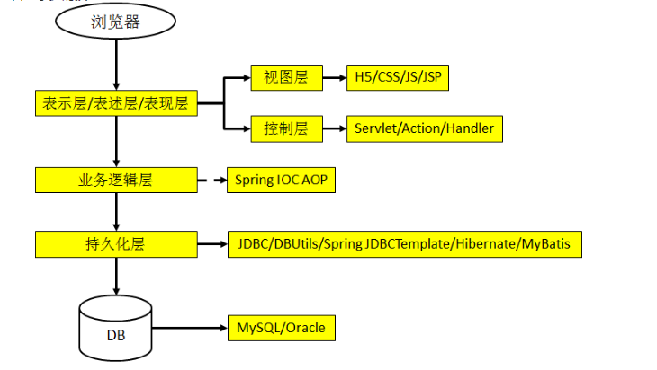
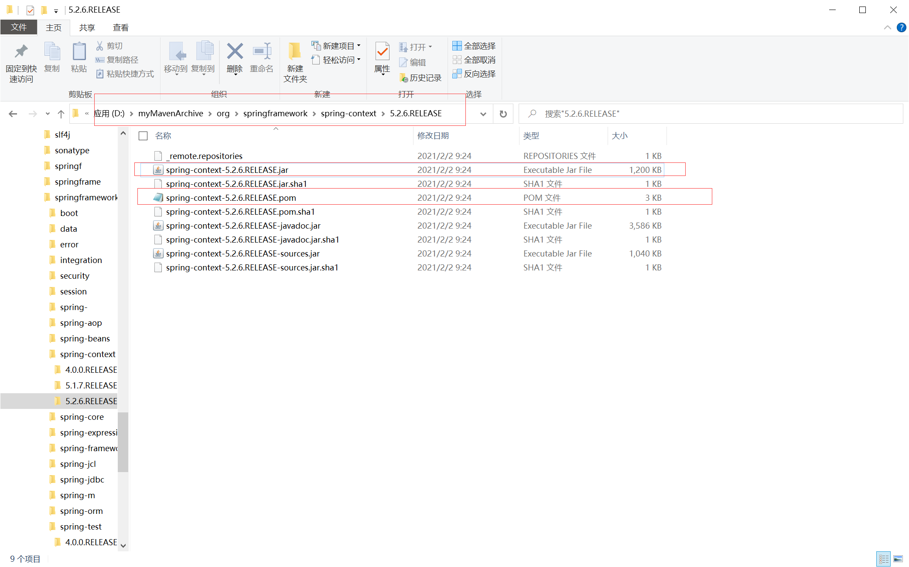
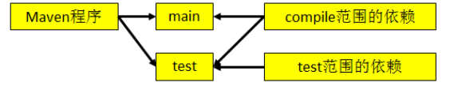
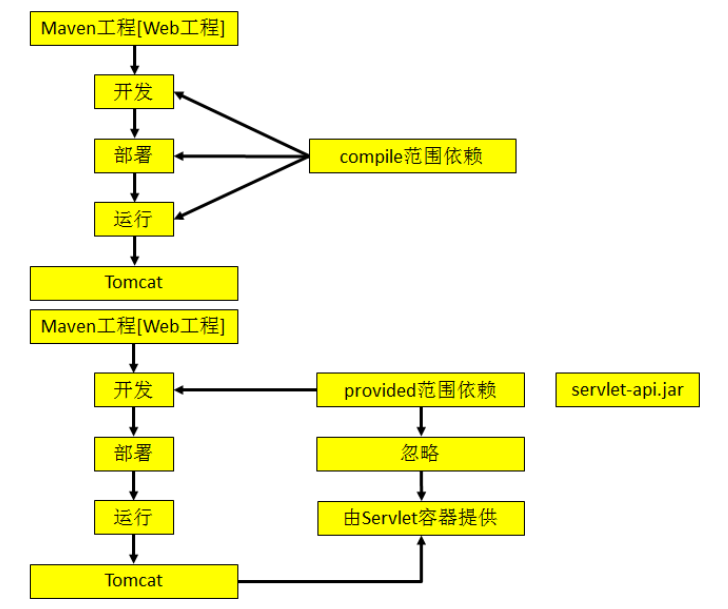
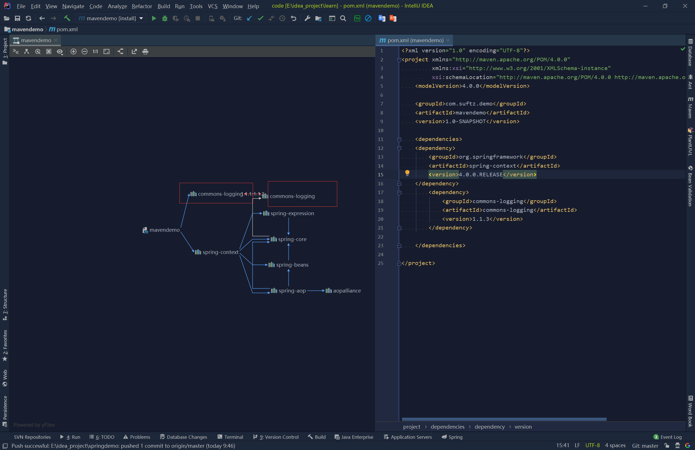
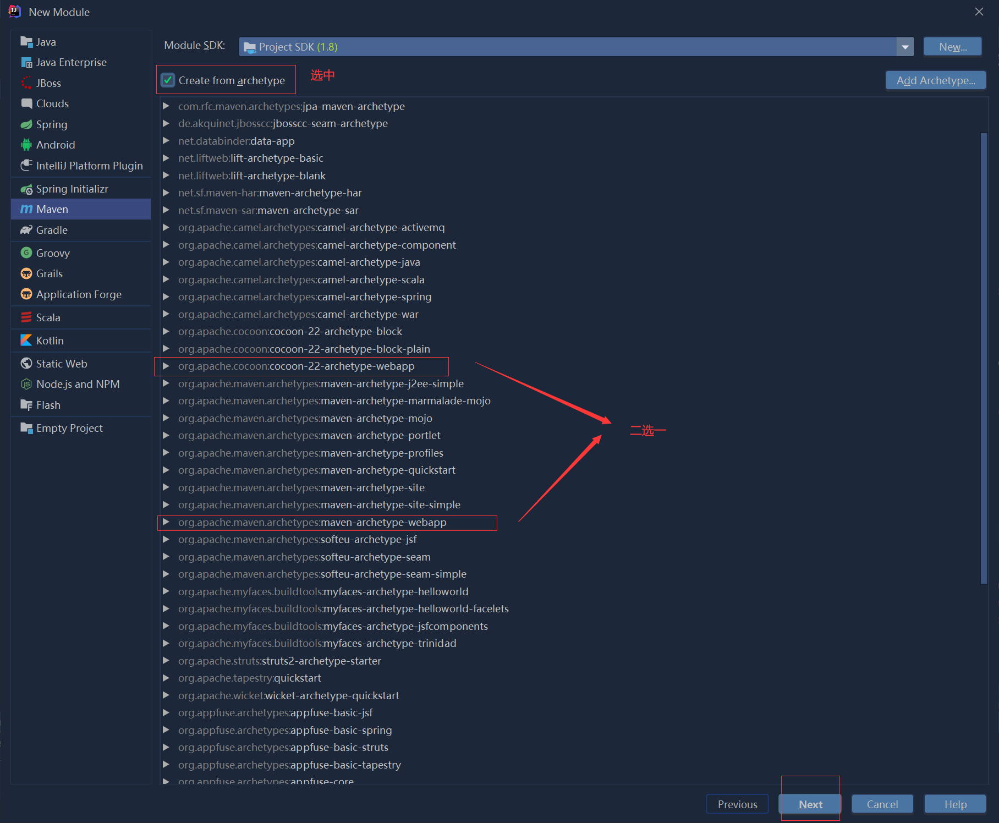

# Maven

[TOC]

## Maven概述

### 目前掌握的技术



### 目前的技术在开发中存在的问题

1. 一个项目就是一个工程
   如果项目非常庞大，就不适合继续使用package来划分模块，最好是每一个模块对应一个工程，利于分工协作
   借助于Maven就可以将一个项目拆分多个工程
2. 项目中需要的jar包必须手动“复制”、“粘贴”到WEB-INF/lib目录下
   带来的问题是：同样的jar包文件重复出现在不同的项目工程中，一方面浪费存储空间，另外也让工程笔记臃肿
   借助Maven,可以将jar包仅仅保存在“仓库”中，有需要使用的工程“引用”这个文件接口，并不需要真的把jar包复制过来
3. jar包需要别人替我们准备好，或到官网下载
   不同的技术的官网提供jar包下载的形式是五花八门的
   有些技术的官网就是通过Maven或SVN等专门的工具来提供下载的
   如果不以规范的方式下载的jar包，那么其中的内容有可能也是不规范的，因为可能包的版本不同，代码有些区别
   借助于Maven可以以一种规范的方式下载jar包，因为所有知名框架或第三方工具的jar包以及按照统一的规范存放在了Maven的中央仓库中
   以规范的方式下载的jar包，内容也是可靠的
4. 一个jar包依赖的其他jar包需要自己手动加入到项目中
   如果所有的jar包之间的依赖的关系都需要程序员自己非常清楚的了解，那么就会极大的增加学习成本

### Maven是什么

1. Maven是一款服务于Java平台的自动化构建工具
   Make-->Ant-->Maven-->Gradle

2. 构建：
   概念：以Java源文件，框架配置文件，静态资源文件或者其他文件，，为原材料，去“生产”一个可以运行的项目的过程
   编译：Java源文件需要编译后生成字节码文件才能交给JVM去执行
   部署：一个BS项目最终运行的并不是工程源代码本身，而是该工程编译后的结果
   搭建运行时环境：JRE System Library+Apache Tomcat

3. 自动化构建
   在实际项目中整合第三方框架， Web 工程中除了 Java 程序和 JSP 页面、 图片等静态资源之外，还包括第三方框架的 jar 包以及各种各样的配置文件。 所有这些资源都必须按照正确的目录结构部署到服务器上， 项目才可以运行。
   所以综上所述： 构建就是以我们编写的 Java 代码、框架配置文件、 国际化等其他资源文件、 JSP 页面和图片等静态资源作为“原材料”， 去“生产”出一个可以运行的项目的过程。

4. 构建过程中的各个环节
   1. 清理：将以前编译得到的旧的class字节码文件删除，为下一次编译做准备
   2. 编译：将Java源程序编译成class字节码文件
   3. 测试：自动测试，自动调用junit程序
   4. 报告：测试程序执行的结果
   5. 打包：动态Web工程打war包，Java工程打jar包
   6. 安装：Maven特定的概念，将打包得到的文件复制到仓库
   7. 部署：将动态的Web工程生成的war包复制到Servlet容器的指定目录下，使其可以运行

### Maven安装

1. 去官网下载 https://maven.apache.org/
2. 官网下载的就是一个可用的程序包，解压后放在一个非中文无空格的路径下即可
3. 然后去配置Maven的环境变量
    * 环境变量名：MAVEN_HOME或M2_HOME
      值就是：maven的路径
    * 修改path环境变量，添加maven\bin到path环境变量中
4. 运行`mvn -v`命令查看maven版本

### Maven使用

Maven 的核心概念

1. 约定的目录结构
2. POM
3. 坐标
4. 依赖
5. 仓库
6. 生命周期/插件/目标
7. 继承
8. 聚合

新建一个Maven工程

1. 创建约定的目录结构
   

2. 遵守约定的目录结构
   Maven要负责项目的自动化构建，以编译为例，Maven要想自动进行编译，那么它必须知道Java源文件保存在哪里
   如果自己定义的东西想要让框架或者工具知道，有两种办法：
   * 以配置的方式明确告诉
   * 遵守框架内部已经存在的约定
   * 约定>配置>编码,因为这样更加简便

3. 常用的Maven命令
   * 注意：执行与构建过程相关的Maven命令，必须进入pom.xml所在的目录
     与构建过程相关：编译、测试、打包
   * 常用命令
     1. mvn clean:清理
     2. mvn compile:编译主程序
     3. mvn test-compile:编译测试程序
     4. mvn test:执行测试
     5. mvn package:打包
     6. mvn install:安装
     7. mvn site:生成站点

4. 获取包的方式
   1. Maven的核心程序中仅仅定义了抽象的生命周期，但是具体的工作必须由特定的插件完成，而插件本身并不包含在Maven的核心程序中
   2. 当执行Maven命令需要用到某些插件时，Maven核心程序会首先到本地仓库中查找
   本地仓库默认的位置：在maven安装目录/conf/settings.xml中的`<localRepository>`标签中指定的
   3. Maven核心程序如果在本地仓库中找不到需要的插件，那么会自动联网去中央仓库下载。如果没有联网，或者中央仓库找不到插件，则构建失败

5. POM
   含义：Project Object Model 项目对象模型
   pom.xml对于Maven工程是核心配置文件，与构建过程相关的一切设置都在这个文件中进行设置

6. 坐标
   Maven坐标：使用下面三个向量在仓库中唯一定位一个Maven工程
   * groupid：公司或组织的域名倒序+项目名  （范围由大到小去确定坐标）
     `<groupid>com.suftz.demo</groupid>`
   * artifactid：模块名
    `<artifactid>springdemo</artifactid>`
   * version：版本
     `<version>1.0.0-SNAPSHOT</version>`

   Maven工程的坐标与仓库中路径的对应关系

    ```xml
    <dependency>
        <groupId>org.springframework</groupId>
        <artifactId>spring-context</artifactId>
        <version>5.2.6.RELEASE</version>
    </dependency>
    ```

    那么该依赖的包对应在maven仓库中地址就是:
    D:\myMavenArchive\org\springframework\spring-context\5.2.6.RELEASE\spring-context-5.2.6.RELEASE.jar

    
    如下图：里面的pom文件是这个jar包所依赖的其他包，所以如果这个包依赖了其他包，那么maven会自动也将其他依赖获取到，所以就不用再去工程里写另外的依赖了
    

## 仓库

### 仓库的分类

1. 本地仓库：当前电脑上部署的仓库目录，为当前电脑上所有的Maven工程服务
2. 远程仓库：
   * 私服：搭建在局域网环境中，为局域网范围内的所有Maven工程服务
   * 中央仓库：架设在Internet上，为全世界所有的Maven工程服务
   * 中央仓库镜像：为了分担中央仓库的浏览，提升用户访问速度

仓库中保存的内容：Maven工程

1. Maven自身所需要的插件
2. 第三方框架或工具的jar包
3. 自己开发的Maven工程

### 依赖

Maven解析依赖信息时会到本地仓库中查找被依赖的jar包，如果一个Maven工程依赖开发人员创建的另一个Maven工程，也会去仓库中寻找，所以这就需要将开发者自己开发的Maven工程，使用mvn install命令安装后发布到仓库中，这样才能使得其他Maven工程引用这个Maven工程的代码

1. compile范围依赖
   * 对主程序是否有效：有效
   * 对测试程序是否有效：有效
   * 是否参与打包：参与
   * 是否参与部署：参与
   * 典型例子：sprnig-core

2. test范围依赖
   * 对主程序是否有效：无效
   * 对测试程序是否有效：有效
   * 是否参与打包：不参与
   * 是否参与部署：不参与
   * 典型例子：junit

3. provided范围依赖
   * 对主程序是否有效：有效
   * 对测试程序是否有效：有效
   * 是否参与打包：不参与
   * 是否参与部署：不参与
   * 典型例子：servlet-api.jar


### 生命周期

各个构建环节执行的顺序：不能打乱顺序，必须按照既定的正确顺序来执行
Maven的核心程序中定义了抽象的生命周期，生命周期中各个阶段的具体任务是由插件来完成的
Maven核心程序为了更好的实现自动化构建，是按照这一特点执行生命周期中的各个阶段：不论现在要执行生命周期中的哪个阶段，都是从这个生命周期最初的位置按照顺序开始执行

```console
执行：mvn compile
过程：
maven-resources-plugin:2.6:resources
maven-compiler-plugin:2.5.1:compile

执行：mvn test
过程：
maven-resources-plugin:2.6:resources
maven-compiler-plugin:2.5.1:compile
maven-resources-plugin:2.6:testResources
maven-compiler-plugin:2.5.1:testCompile
maven-surefire-plugin:2.12.4:test
测试报告

执行：mvn package
过程：
maven-resources-plugin:2.6:resources
maven-compiler-plugin:2.5.1:compile
maven-resources-plugin:2.6:testResources
maven-compiler-plugin:2.5.1:testCompile
maven-surefire-plugin:2.12.4:test
测试报告
maven-jar-plugin:2.4:jar
```

插件和目标

1. 生命周期的各个阶段仅仅蒂尼了要执行的任务是什么
2. 各个阶段和插件的目标是对应的
3. 相似的目标由特定的插件来完成

|生命周期阶段|插件目标|插件|
|:----|:----|:----|
|compile|compile|maven-compiler-plugin|
|test-compile|testCompile|maven-compiler-plugin|

可以把目标看做是调用插件功能的命令

## 在idea中使用maven

### 设置通过Maven创建的工程的JDK版本

1. 打开settings.xml文件
2. 找到profiles标签
3. 加入如下配置

   ```xml
   <profile>
       <id>jdk-1.8</id>
       <activation>
           <activeByDefault>true</activeByDefault>
           <jdk>1.8</jdk>
       </activation>
       <properties>
           <maven.compiler.source>1.8</maven.compiler.source>
           <maven.compiler.target>1.8</maven.compiler.target>
           <maven.compiler.compilerVersion>1.8</maven.compiler.compilerVersion>
       </properties>
   </profile>
   ```


## 再次认识依赖


1. 依赖的传递性
   * 好处：可以传递的依赖不必在每个模块工程中都重复声明，在“最下面”的工程中依赖一次即可
   * 注意：非compile范围的依赖不能传递，所以再各个工程模块中，如果有需要就得重复声明依赖

2. 依赖的排除
   * 需要设置依赖排除的场合：需要依赖的包，又去依赖了其他的包，而这个包却不稳定，自己在当前工程下手动添加了一个稳定的包，此时就需要设置依赖排除，保留一个依赖

   ```xml
   <?xml version="1.0" encoding="UTF-8"?>
   <project xmlns="http://maven.apache.org/POM/4.0.0"
            xmlns:xsi="http://www.w3.org/2001/XMLSchema-instance"
            xsi:schemaLocation="http://maven.apache.org/POM/4.0.0 http://maven.apache.org/xsd/maven-4.0.0.xsd">
       <modelVersion>4.0.0</modelVersion>

       <groupId>com.suftz.demo</groupId>
       <artifactId>mavendemo</artifactId>
       <version>1.0-SNAPSHOT</version>

       <dependencies>
       <dependency>
           <groupId>org.springframework</groupId>
           <artifactId>spring-context</artifactId>
           <version>4.0.0.RELEASE</version>
           <!--排除在spring-context中使用此包-->
           <exclusions>
               <exclusion>
                   <groupId>commons-logging</groupId>
                   <artifactId>commons-logging</artifactId>
               </exclusion>
           </exclusions>
       </dependency>
           <dependency>
               <groupId>commons-logging</groupId>
               <artifactId>commons-logging</artifactId>
               <version>1.1.3</version>
           </dependency>

       </dependencies>

   </project>
   ```

   
   

### 依赖的原则

* 作用：解决模块工程之间的jar包冲突问题，因为可能多个包或者模块会有引用相同的包(版本不同也是相同的包)

* 情景设定：验证路径最短者优先原则
* 验证路径相同时先声明者优先
  先声明指的是dependency标签的声明顺序

### 统一依赖管理

有些依赖的包之间，没有直接去相互依赖，而开发者在使用时，应该去使用同一版本的框架，比如spring+springmvc，以及spring事务管理等等涉及的包

```xml
<?xml version="1.0" encoding="UTF-8"?>
<project xmlns="http://maven.apache.org/POM/4.0.0"
         xmlns:xsi="http://www.w3.org/2001/XMLSchema-instance"
         xsi:schemaLocation="http://maven.apache.org/POM/4.0.0 http://maven.apache.org/xsd/maven-4.0.0.xsd">
    <modelVersion>4.0.0</modelVersion>

    <groupId>com.suftz.demo</groupId>
    <artifactId>mavendemo</artifactId>
    <version>1.0-SNAPSHOT</version>
    <properties>
        <spring.version>5.2.6.RELEASE</spring.version>
    </properties>
    <dependencies>

        <dependency>
            <groupId>org.springframework</groupId>
            <artifactId>spring-test</artifactId>
            <version>${spring.version}</version>
        </dependency>

        <dependency>
            <groupId>org.springframework</groupId>
            <artifactId>spring-context</artifactId>
            <version>${spring.version}</version>
        </dependency>

        <dependency>
            <groupId>org.springframework</groupId>
            <artifactId>spring-jdbc</artifactId>
            <version>${spring.version}</version>
        </dependency>
        <dependency>
            <groupId>org.springframework</groupId>
            <artifactId>spring-tx</artifactId>
            <version>${spring.version}</version>
        </dependency>
        <dependency>
            <groupId>org.springframework</groupId>
            <artifactId>spring-orm</artifactId>
            <version>${spring.version}</version>
        </dependency>

        <dependency>
            <groupId>org.springframework</groupId>
            <artifactId>spring-web</artifactId>
            <version>${spring.version}</version>
        </dependency>

        <dependency>
            <groupId>org.springframework</groupId>
            <artifactId>spring-webmvc</artifactId>
            <version>${spring.version}</version>
        </dependency>


        <dependency>
            <groupId>junit</groupId>
            <artifactId>junit</artifactId>
            <version>4.12</version>
            <scope>test</scope>
        </dependency>
        <dependency>
            <groupId>mysql</groupId>
            <artifactId>mysql-connector-java</artifactId>
            <version>6.0.6</version>
        </dependency>
        <dependency>
            <groupId>com.alibaba</groupId>
            <artifactId>druid</artifactId>
            <version>1.0.9</version>
        </dependency>


<!--                <dependency>-->
<!--                    <groupId>org.aspectj</groupId>-->
<!--                    <artifactId>aspectjrt</artifactId>-->
<!--                    <version>1.8.9</version>-->
<!--                </dependency>-->
<!--                <dependency>-->
<!--                    <groupId>org.aspectj</groupId>-->
<!--                    <artifactId>aspectjtools</artifactId>-->
<!--                    <version>1.8.9</version>-->
<!--                </dependency>-->
<!--                <dependency>-->
<!--                    <groupId>org.aspectj</groupId>-->
<!--                    <artifactId>aspectjweaver</artifactId>-->
<!--                    <version>1.7.4</version>-->
<!--                </dependency>-->
    </dependencies>

</project>
```

### 继承

由于junit是test范围的包，那么不能进行依赖传递，每个模块必须自己引入这个依赖，那么怎么管理，让它们的版本一致

解决思路：将junit依赖统一提取到“父”工程中，在子工程中声明junit依赖时不指定版本，以父工程中统一设定的为准。同时也便于修改。

操作步骤：

1. 创建一个Maven工程作为父工程，注意打包方式为pom

   ```xml
   <groupId>com.suftz.demo</groupId>
   <artifactId>mavendemo</artifactId>
   <version>1.0-SNAPSHOT</version>
   <packaging>pom</packaging>
   ```

2. 在子工程中声明对父工程的引用

   ```xml
   <?xml version="1.0" encoding="UTF-8"?>
   <project xmlns="http://maven.apache.org/POM/4.0.0"
            xmlns:xsi="http://www.w3.org/2001/XMLSchema-instance"
            xsi:schemaLocation="http://maven.apache.org/POM/4.0.0 http://maven.apache.org/xsd/maven-4.0.0.xsd">
       <modelVersion>4.0.0</modelVersion>

       <groupId>com.suftz.demo</groupId>
       <artifactId>mavendemo</artifactId>
       <version>1.0-SNAPSHOT</version>

       <parent>
           <groupId>com.suftz.demo</groupId>
           <artifactId>all-demo</artifactId>
           <version>1.0-SNAPSHOT</version>
           <relativePath>../demo/pom.xml</relativePath>
       </parent>
       <properties>
           <spring.version>5.2.6.RELEASE</spring.version>
       </properties>
       <dependencies>
           <dependency>
               <groupId>junit</groupId>
               <artifactId>junit</artifactId>
               <version>4.12</version>
               <scope>test</scope>
           </dependency>
       </dependencies>

   </project>
   ```

3. 将子工程的坐标中与父工程坐标中重复的内容删除

   ```xml
   <?xml version="1.0" encoding="UTF-8"?>
   <project xmlns="http://maven.apache.org/POM/4.0.0"
            xmlns:xsi="http://www.w3.org/2001/XMLSchema-instance"
            xsi:schemaLocation="http://maven.apache.org/POM/4.0.0 http://maven.apache.org/xsd/maven-4.0.0.xsd">
       <modelVersion>4.0.0</modelVersion>

       <!--<groupId>com.suftz.demo</groupId>-->
       <artifactId>mavendemo</artifactId>
       <!--<version>1.0-SNAPSHOT</version>-->

       <parent>
           <groupId>com.suftz.demo</groupId>
           <artifactId>all-demo</artifactId>
           <version>1.0-SNAPSHOT</version>
           <relativePath>../demo/pom.xml</relativePath>
       </parent>
       <properties>
           <spring.version>5.2.6.RELEASE</spring.version>
       </properties>
       <dependencies>
           <dependency>
               <groupId>junit</groupId>
               <artifactId>junit</artifactId>
               <version>4.12</version>
               <scope>test</scope>
           </dependency>
       </dependencies>

   </project>
   ```

4. 在父工程中统一管理junit的依赖

   ```xml
   <?xml version="1.0" encoding="UTF-8"?>
   <project xmlns="http://maven.apache.org/POM/4.0.0"
            xmlns:xsi="http://www.w3.org/2001/XMLSchema-instance"
            xsi:schemaLocation="http://maven.apache.org/POM/4.0.0 http://maven.apache.org/xsd/maven-4.0.0.xsd">
       <modelVersion>4.0.0</modelVersion>

       <groupId>com.suftz.demo</groupId>
       <artifactId>all-demo</artifactId>
       <version>1.0-SNAPSHOT</version>
       <packaging>pom</packaging>

       <dependencyManagement>
           <dependencies>
           <dependency>
               <groupId>junit</groupId>
               <artifactId>junit</artifactId>
               <version>4.12</version>
               <scope>test</scope>
           </dependency>
           </dependencies>
       </dependencyManagement>

   <dependencies>
       <dependency>
           <groupId>commons-io</groupId>
           <artifactId>commons-io</artifactId>
           <version>2.6</version>
       </dependency>
   </dependencies>
   </project>
   ```

5. 在子工程中删除junit依赖的版本号部分


   ```xml
   <?xml version="1.0" encoding="UTF-8"?>
   <project xmlns="http://maven.apache.org/POM/4.0.0"
            xmlns:xsi="http://www.w3.org/2001/XMLSchema-instance"
            xsi:schemaLocation="http://maven.apache.org/POM/4.0.0 http://maven.apache.org/xsd/maven-4.0.0.xsd">
       <modelVersion>4.0.0</modelVersion>

       <!--<groupId>com.suftz.demo</groupId>-->
       <artifactId>mavendemo</artifactId>
       <!--<version>1.0-SNAPSHOT</version>-->

       <parent>
           <groupId>com.suftz.demo</groupId>
           <artifactId>all-demo</artifactId>
           <version>1.0-SNAPSHOT</version>
           <relativePath>../demo/pom.xml</relativePath>
       </parent>
       <properties>
           <spring.version>5.2.6.RELEASE</spring.version>
       </properties>
       <dependencies>
           <dependency>
               <groupId>junit</groupId>
               <artifactId>junit</artifactId>
               <!--<version>4.12</version>-->
               <scope>test</scope>
           </dependency>
       </dependencies>

   </project>
   ```

### 聚合

* 作用：一键安装各个模块工程
* 配置方式：在一个“总的聚合工程”中配置各个参与聚合的模块

```xml
<modules>
    <!--这里面的工程，如果有父子依赖关系，这是没有影响的，maven会按照正确的方式安装-->
    <module>../springdemo</module>
    <module>../mavendemo</module>
</modules>
```

> 配置继承后，执行安装命令时要先安装父工程

### 自动化部署

maven可以帮助打包成war,但是怎么实现将war包直接打包到servlet容器中，b并且去自动启动servlet容器

```xml
<?xml version="1.0" encoding="UTF-8"?>
<project xmlns="http://maven.apache.org/POM/4.0.0"
         xmlns:xsi="http://www.w3.org/2001/XMLSchema-instance"
         xsi:schemaLocation="http://maven.apache.org/POM/4.0.0 http://maven.apache.org/xsd/maven-4.0.0.xsd">
    <modelVersion>4.0.0</modelVersion>

    <groupId>com.suftz.demo</groupId>
    <artifactId>mavendemo</artifactId>
    <version>1.0-SNAPSHOT</version>
    <packaging>war</packaging>
    <build>
        <finalName>testWeb</finalName>
        <plugins>
            <plugin>
                <groupId>org.codehaus.cargo</groupId>
                <artifactId>cargo-maven2-plugin</artifactId>
                <version>1.2.3</version>
                <configuration>
                    <container>
                        <containerId>tomcat7x</containerId>
                        <home>D:\Programs\apache-tomcat-7.0.107</home>
                    </container>
                    <configuration>
                        <type>existing</type>
                        <home>D:\Programs\apache-tomcat-7.0.107</home>
                        <!-- 如果Tomcat端口为默认值8080则不必设置该属性 -->
                        <properties>
                            <cargo.servlet.port>8989</cargo.servlet.port>
                        </properties>
                    </configuration>
                </configuration>
                <executions>
                    <execution>
                        <id>cargo-run</id>
                        <phase>install</phase>
                        <goals>
                            <goal>run</goal>
                        </goals>
                    </execution>
                </executions>
            </plugin>
        </plugins>
    </build>
    <properties>
        <spring.version>5.2.6.RELEASE</spring.version>
    </properties>
    <dependencies>

    </dependencies>

</project>
```

这里需要注意的是，这个插件不兼容tomcat8，而且，如果maven工程是一个web项目，则之前web文件夹一直是放在工程目录下，现在需要放在`工程目录/src/main/webapp`下，即web.xml路径是`工程目录/src/main/webapp/WEB-INF/web.xml`,此时才能正确打包为war文件


* 如果想在新建一个maven工程的时候，指定该工程是web，则可以如下新建：

当然也可以自己去移动web目录里的内容到`工程目录/src/main/webapp/`,然后修改项目在idea中的设置即可

## 其他配置

### 中央仓库

默认的中央仓库如下：


而镜像仓库就是为了替代它们，当有请求时，则会使用镜像来替代它们

### 镜像配置

```xml
1.<mirrorOf>*</mirrorOf>
匹配所有远程仓库。
2.<mirrorOf>external:*</mirrorOf>
匹配所有远程仓库，使用localhost的除外，使用file://协议的除外。也就是说，匹配所有不在本机上的远程仓库。
3.<mirrorOf>repo1,repo2</mirrorOf>
匹配仓库repo1和repo2，使用逗号分隔多个远程仓库。
4.<mirrorOf>*,!repo1</miiroOf>
匹配所有远程仓库，repo1除外，使用感叹号将仓库从匹配中排除。
需要注意的是，由于镜像仓库完全屏蔽了被镜像仓库，当镜像仓库不稳定或者停止服务的时候，Maven仍将无法访问被镜像仓库，因而将无法下载构件。
-->
```

### 私服设置和搭建

//todo

### maven插件编写

//todo
