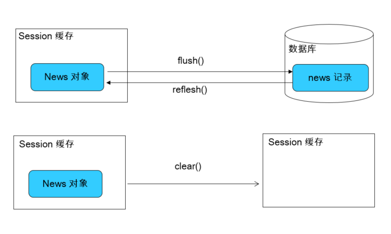
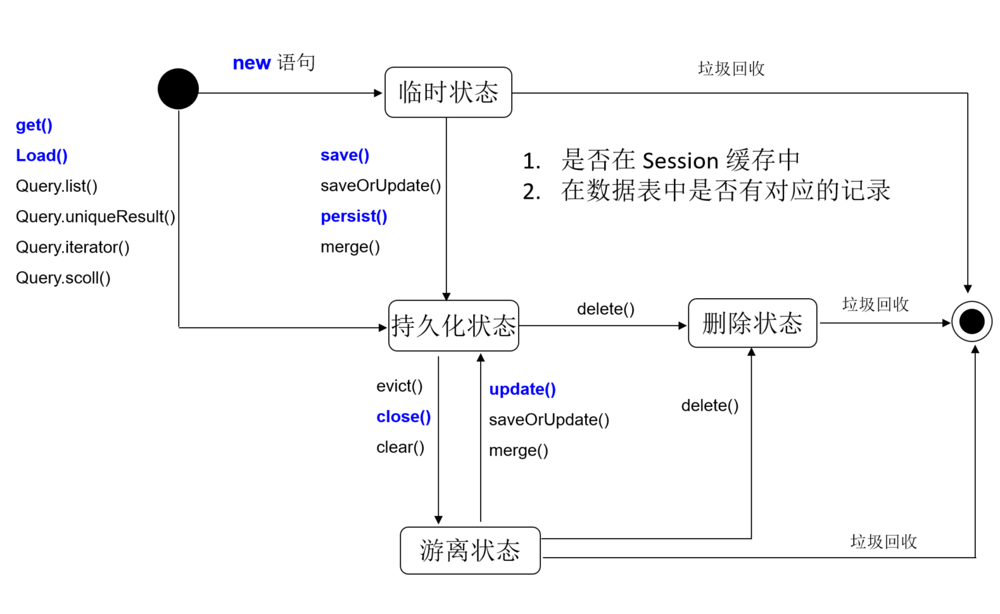
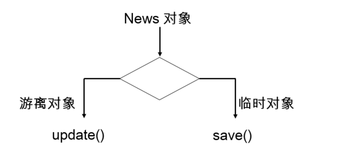
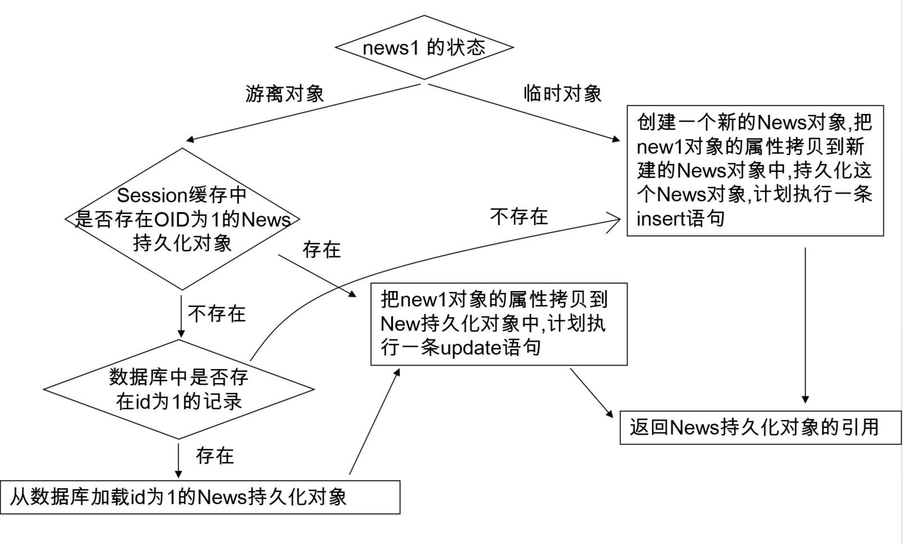
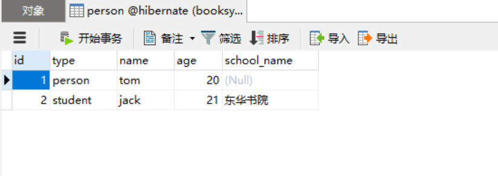
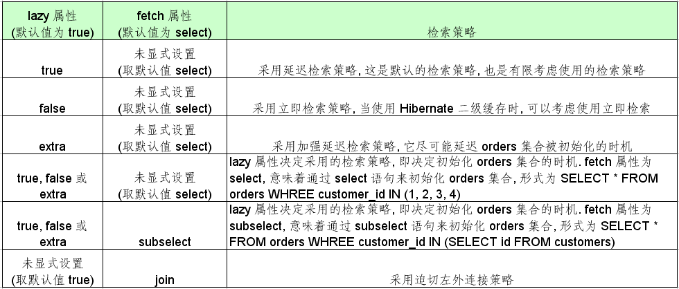
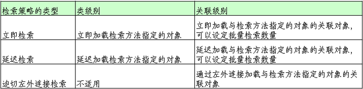
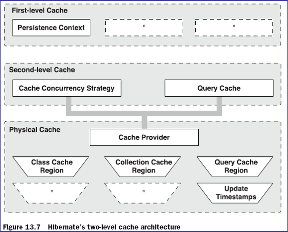

# Hibernate基础

[TOC]

## 认识Hibernate

### 什么是Hibernate

* 一个框架
* 一个 Java 领域的持久化框架
* 一个 ORM 框架

### 对象的持久化

* 狭义的理解，“持久化”仅仅指把对象永久保存到数据库中
* 广义的理解，“持久化”包括和数据库相关的各种操作：
  1. 保存：把对象永久保存到数据库中。
  2. 更新：更新数据库中对象(记录)的状态。
  3. 删除：从数据库中删除一个对象。
  4. 查询：根据特定的查询条件，把符合查询条件的一个或多个对象从数据库加载到内存中。
  5. 加载：根据特定的OID，把一个对象从数据库加载到内存中。
     > 为了在系统中能够找到所需对象，需要为每一个对象分配一个唯一的标识号。在关系数据库中称之为主键，而在对象术语中，则叫做对象标识(Object identifier-OID)

### ORM

* ORM(Object/Relation Mapping): 对象/关系映射
* ORM 主要解决对象-关系的映射
  |面向对象概念|面向关系概念|
  |:----|:----|
  |类|表|
  |对象|表的行(记录)|
  |属性|表的列(字段)|
* ORM的思想：将关系数据库中表中的记录映射成为对象，以对象的形式展现，程序员可以把对数据库的操作转化为对对象的操作。
* ORM 采用元数据来描述对象-关系映射细节, 元数据通常采用 XML 格式, 并且存放在专门的对象-关系映射文件中.

### 流行的ORM框架

* Hibernate:
  1. 非常优秀、成熟的 ORM 框架。
  2. 完成对象的持久化操作
  3. Hibernate 允许开发者采用面向对象的方式来操作关系数据库。
  4. 消除那些针对特定数据库厂商的 SQL 代码
* myBatis：
  1. 相比 Hibernate 灵活高，运行速度快
  2. 开发速度慢，不支持纯粹的面向对象操作，需熟悉sql语句，并且熟练使用sql语句优化功能
* TopLink
* OJB

## 第一个Hibernate程序

### Hibernate开发步骤

* 导入jar相关包
  1. 导入hibernate必须的jar包。可以去官网根据需要的版本下载`hibernate-release-4.2.4.Final`,里面有说明文档，还有空的项目，也可以使用maven下载：

     ```xml
     <?xml version="1.0" encoding="UTF-8"?>
     <project xmlns="http://maven.apache.org/POM/4.0.0"
              xmlns:xsi="http://www.w3.org/2001/XMLSchema-instance"
              xsi:schemaLocation="http://maven.apache.org/POM/4.0.0 http://maven.apache.org/xsd/maven-4.0.0.xsd">
         <modelVersion>4.0.0</modelVersion>

         <groupId>com.suftz</groupId>
         <artifactId>demo-hibernate</artifactId>
         <version>1.0-SNAPSHOT</version>

         <dependencies>
             <dependency>
                 <groupId>org.hibernate</groupId>
                 <artifactId>hibernate-core</artifactId>
                 <version>4.2.4.Final</version>
             </dependency>
             <dependency>
                 <groupId>mysql</groupId>
                 <artifactId>mysql-connector-java</artifactId>
                 <version>6.0.6</version>
             </dependency>
         </dependencies>
     </project>
     ```

  2. 导入数据库连接所需要的必须的jdbc,上面的maven已经写了导入mysql的数据库的jar包，也可以手动去mysql官网下载

* 开发步骤：
  1. 创建hibernate配置文件：`hibernate.cfg.xml`和`*.hbm.xml`
     hibernate.cfg.xml一开始就需要创建，`*.hbm.xml`是根据需要适时创建
  2. 创建持久化类
  3. 创建对象关系映射文件
  4. 通过hibernate-api编写访问数据库的代码

### 创建持久化Java类

* 提供一个无参的构造器:使Hibernate可以使用Constructor.newInstance() 来实例化持久化类
* 提供一个标识属性(identifier property): 通常映射为数据库表的主键字段. 如果没有该属性，一些功能将不起作用，如：Session.saveOrUpdate()
* 为类的持久化类字段声明访问方法(get/set): Hibernate对JavaBeans 风格的属性实行持久化。
* 使用非 final 类: 在运行时生成代理是 Hibernate 的一个重要的功能. 如果持久化类没有实现任何接口, Hibnernate 使用 CGLIB 生成代理. 如果使用的是 final 类, 则无法生成 CGLIB 代理.
* 重写 eqauls 和 hashCode 方法: 如果需要把持久化类的实例放到 Set集合 中(当需要进行关联映射时), 则应该重写这两个方法

### 示例

1. 编写hibernate.cfg.xml

   ```xml
   <?xml version="1.0" encoding="UTF-8"?>
   <!DOCTYPE hibernate-configuration PUBLIC
           "-//Hibernate/Hibernate Configuration DTD 3.0//EN"
           "http://www.hibernate.org/dtd/hibernate-configuration-3.0.dtd">
   <hibernate-configuration>
       <session-factory>

           <!-- 配置连接数据库的基本信息 -->
           <property name="connection.username">root</property>
           <property name="connection.password">booksys123</property>
           <property name="connection.driver_class">com.mysql.cj.jdbc.Driver</property>
           <property name="connection.url">jdbc:mysql://localhost:3306/hibernate?characterEncoding=utf8&amp;useSSL=false&amp;allowPublicKeyRetrieval=true&amp;serverTimezone=Asia/Shanghai</property>

           <!-- 配置 hibernate 的基本信息 -->
           <!-- hibernate 所使用的数据库方言,每个数据都有自己专有的方言，这项的值在hibernate说明文档里找对应的值,mysql不同版本，这里的取值不同 -->
           <property name="dialect">org.hibernate.dialect.MySQL5InnoDBDialect</property>

           <!-- 执行操作时是否在控制台打印 SQL -->
           <property name="show_sql">true</property>

           <!-- 是否对 SQL 进行格式化 -->
           <property name="format_sql">true</property>

           <!-- 指定自动生成数据表的策略 方言设置错误，这里可能无法建表-->
           <property name="hbm2ddl.auto">update</property>

           <!-- 指定关联的 .hbm.xml 文件 -->
           <mapping resource="User.hbm.xml"/>

       </session-factory>

   </hibernate-configuration>
   ```

2. 编写持久化类User.java

   ```java
   package com.suftz.bean;


   import java.sql.Date;
   import java.util.Objects;

   public class User {
       private Integer uid;
       private String name;
       private String password;
       private String address;
       private String email;
       private Date birth;

       public User() {
       }

       public User(String name, String password, String address, String email, Date birth) {
           this.name = name;
           this.password = password;
           this.address = address;
           this.email = email;
           this.birth = birth;
       }

       public User(Integer uid, String name, String password, String address, String email, Date birth) {
           this.uid = uid;
           this.name = name;
           this.password = password;
           this.address = address;
           this.email = email;
           this.birth = birth;
       }

       public Integer getUid() {
           return uid;
       }

       public void setUid(Integer uid) {
           this.uid = uid;
       }

       public String getName() {
           return name;
       }

       public void setName(String name) {
           this.name = name;
       }

       public String getPassword() {
           return password;
       }

       public void setPassword(String password) {
           this.password = password;
       }

       public String getAddress() {
           return address;
       }

       public void setAddress(String address) {
           this.address = address;
       }

       public String getEmail() {
           return email;
       }

       public void setEmail(String email) {
           this.email = email;
       }

       public Date getBirth() {
           return birth;
       }

       public void setBirth(Date birth) {
           this.birth = birth;
       }

       @Override
       public String toString() {
           return "User{" +
                   "uid=" + uid +
                   ", name='" + name + '\'' +
                   ", password='" + password + '\'' +
                   ", address='" + address + '\'' +
                   ", email='" + email + '\'' +
                   ", birth=" + birth +
                   '}';
       }

       @Override
       public boolean equals(Object o) {
           if (this == o) return true;
           if (o == null || getClass() != o.getClass()) return false;
           User user = (User) o;
           return Objects.equals(uid, user.uid) &&
                   Objects.equals(name, user.name) &&
                   Objects.equals(password, user.password) &&
                   Objects.equals(address, user.address) &&
                   Objects.equals(email, user.email) &&
                   Objects.equals(birth, user.birth);
       }

       @Override
       public int hashCode() {
           return Objects.hash(uid, name, password, address, email, birth);
       }
   }
   ```

3. 编写User.hbm.xml文件：ORM映射文件

   ```xml
   <?xml version='1.0' encoding='utf-8'?>
   <!DOCTYPE hibernate-mapping PUBLIC
           "-//Hibernate/Hibernate Mapping DTD 3.0//EN"
           "http://www.hibernate.org/dtd/hibernate-mapping-3.0.dtd">
   <hibernate-mapping>
       <class name="com.suftz.bean.User" table="user" schema="hibernate">
           <id name="uid" type="java.lang.Integer" >
               <column name="uid" />
               <generator class="native" /><!--主键生成策略，自行判断-->
           </id>
           <property name="name" column="name" type="java.lang.String"/>
           <property name="password" column="password" type="java.lang.String"/>
           <property name="address" column="address" type="java.lang.String"/>
           <property name="email" column="email" type="java.lang.String"/>
           <property name="birth" column="birth" type="java.sql.Date"/>
       </class>
   </hibernate-mapping>
   ```

4. 编写测试类，执行插入一条数据的操作

   ```java
   package com.suftz.test;

   import com.suftz.bean.User;
   import org.hibernate.Session;
   import org.hibernate.SessionFactory;
   import org.hibernate.Transaction;
   import org.hibernate.cfg.Configuration;
   import org.hibernate.service.ServiceRegistry;
   import org.hibernate.service.ServiceRegistryBuilder;
   import org.junit.Test;

   import java.sql.Date;

   public class HibernateTest {

       @Test
       public void insertTest(){
   //        1.创建SessionFactory对象
           SessionFactory sessionFactory=null;
   //        2.创建Configuration对象：对应hibernate的基本配置信息和对象关系映射信息
           Configuration configuration=new Configuration().configure();

           //4.0之前创建sessionFactory方式
           //sessionFactory=configuration.buildSessionFactory();

           ServiceRegistry serviceRegistry=new ServiceRegistryBuilder().applySettings(configuration.getProperties()).buildServiceRegistry();
           sessionFactory=configuration.buildSessionFactory(serviceRegistry);

           Session session=sessionFactory.openSession();
           Transaction transaction=session.beginTransaction();
           User u=new User("东方不败","123qwe","黑木崖","skysdongfang@qq.com",new Date(new java.util.Date().getTime()));
           session.save(u);
           transaction.commit();
           session.close();
           sessionFactory.close();
       }
   }
   ```

   * 使用 Hibernate 进行数据持久化操作，通常有如下步骤：
     1. 编写持久化类： POJO + 映射文件
     2. 获取 Configuration 对象
     3. 获取 SessionFactory 对象
     4. 获取 Session，打开事务
     5. 用面向对象的方式操作数据库
     6. 关闭事务，关闭 Session

### Configuration类

* Configuration 类负责管理 Hibernate 的配置信息。包括如下内容：
  * Hibernate 运行的底层信息：数据库的URL、用户名、密码、JDBC驱动类，数据库Dialect,数据库连接池等（对应 hibernate.cfg.xml 文件）。
  * 持久化类与数据表的映射关系（*.hbm.xml 文件）
* 创建 Configuration 的两种方式
  * 属性文件（hibernate.properties）:
    Configuration cfg = new Configuration();
  * Xml文件（hibernate.cfg.xml）
    Configuration cfg = new Configuration().configure();
  * Configuration 的 configure 方法还支持带参数的访问：
    File file = new File(“simpleit.xml”);
    Configuration cfg = new Configuration().configure(file);

### SessionFactory接口

* 针对单个数据库映射关系经过编译后的内存镜像，是线程安全的。
* SessionFactory 对象一旦构造完毕，即被赋予特定的配置信息
* SessionFactory是生成Session的工厂
* 构造 SessionFactory 很消耗资源，一般情况下一个应用中只初始化一个 SessionFactory 对象。
* Hibernate4 新增了一个 ServiceRegistry 接口，所有基于 Hibernate 的配置或者服务都必须统一向这个 ServiceRegistry  注册后才能生效
* Hibernate4 中创建 SessionFactory 的步骤

  ```java
  Configuration configuration=new Configuration().configure();
  ServiceRegistry serviceRegistry=new ServiceRegistryBuilder().applySettings(configuration.getProperties()).buildServiceRegistry();
  SessionFactory  sessionFactory=configuration.buildSessionFactory(serviceRegistry);
  ```

### Session接口

* Session 是应用程序与数据库之间交互操作的一个单线程对象，是 Hibernate 运作的中心，所有持久化对象必须在 session 的管理下才可以进行持久化操作。此对象的生命周期很短。Session 对象有一个一级缓存，显式执行 flush 之前，所有的持久层操作的数据都缓存在 session 对象处。相当于 JDBC 中的 Connection。
* 持久化类与 Session 关联起来后就具有了持久化的能力。
* Session 类的方法：
  * 取得持久化对象的方法： get() load()
  * 持久化对象都得保存，更新和删除：save(),update(),saveOrUpdate(),delete()
  * 开启事务: beginTransaction().
  * 管理 Session 的方法：isOpen(),flush(), clear(), evict(), close()等

### Transaction事务

* 代表一次原子操作，它具有数据库事务的概念。所有持久层都应该在事务管理下进行，即使是只读操作。
  Transaction tx = session.beginTransaction();
* 常用方法:
  * commit():提交相关联的session实例
  * rollback():撤销事务操作
  * wasCommitted():检查事务是否提交

### Hibernate配置文件的设置项

* hbm2ddl.auto：该属性可帮助程序员实现正向工程, 即由 java 代码生成数据库脚本, 进而生成具体的表结构。取值 create | update | create-drop | validate
  * create : 会根据 .hbm.xml  文件来生成数据表, 但是每次运行都会删除上一次的表 ,重新生成表, 哪怕二次没有任何改变
  * create-drop : 会根据 .hbm.xml 文件生成表,但是SessionFactory一关闭, 表就自动删除
  * update : 最常用的属性值，也会根据 .hbm.xml 文件生成表, 但若 .hbm.xml  文件和数据库中对应的数据表的表结构不同, Hiberante  将更新数据表结构，但不会删除已有的行和列
  * validate : 会和数据库中的表进行比较, 若 .hbm.xml 文件中的列在数据表中不存在，则抛出异常
* format_sql：是否将 SQL 转化为格式良好的 SQL . 取值 true | false
* dialect：设置连接的数据库方言，mysql5.5之前是org.hibernate.dialect.MySQLInnoDBDialect，mysql5.5之后是org.hibernate.dialect.MySQL5InnoDBDialect(根据使用的数据库来配置)

## 通过Session操作对象

### Session概述

* Session 接口是 Hibernate 向应用程序提供的操纵数据库的最主要的接口, 它提供了基本的保存, 更新, 删除和加载 Java 对象的方法.
* Session 具有一个缓存, 位于缓存中的对象称为持久化对象, 它和数据库中的相关记录对应. Session 能够在某些时间点, 按照缓存中对象的变化来执行相关的 SQL 语句, 来同步更新数据库, 这一过程被称为刷新缓存(flush)
* 站在持久化的角度, Hibernate 把对象分为 4 种状态: 持久化状态, 临时状态, 游离状态, 删除状态. Session 的特定方法能使对象从一个状态转换到另一个状态.

### Session缓存

* 在 Session 接口的实现中包含一系列的 Java 集合, 这些 Java 集合构成了 Session 缓存. 只要 Session 实例没有结束生命周期, 且没有清理缓存，则存放在它缓存中的对象也不会结束生命周期
* Session 缓存可减少 Hibernate 应用程序访问数据库的频率。

* 比如下列代码：

  ```java
  User user= (User) session.get(User.class,1);
  System.out.println(user);
  User user1= (User) session.get(User.class,1);
  System.out.println(user1);
  ```

  上面代码，只会向数据库发送一条sql语句，第二条查询记录是从session缓存中取出的

### 操作Session缓存



#### flush缓存

* flush：Session 按照缓存中对象的属性变化来同步更新数据库
* 默认情况下 Session 在以下时间点刷新缓存：
  * 显式调用 Session 的 flush() 方法
  * 当应用程序调用 Transaction 的 commit()方法的时, 该方法先 flush ，然后在向数据库提交事务
  * 当应用程序执行一些查询(HQL, Criteria)操作时，如果缓存中持久化对象的属性已经发生了变化，会先 flush 缓存，以保证查询结果能够反映持久化对象的最新状态
* flush 缓存的例外情况: 如果对象使用 native 生成器生成 OID, 那么当调用 Session 的 save() 方法保存对象时, 会立即执行向数据库插入该实体的 insert 语句.
* commit() 和 flush() 方法的区别：flush 执行一系列 sql 语句，但不提交事务；commit 方法先调用flush() 方法，然后提交事务. 提交事务意味着对数据库操作永久保存下来。

* flush:使数据库表中的记录和Session缓存中的对象的状态保持一致，为了保持一致，则可能会发送对应的sql语句
  1. 在Transaction的commit()方法中，先调用session的flush方法，再提交事务
  2. flush方法可能会发送sql语句，但不会去提交事务
  3. 注意：
     未提交事务或显式调用session.flush方法之前，也有可能进行flush()方法：
     * 执行HQL或QBC查询，会先进行flush()方法，以得到数据表的最新记录(指的是当前session中被修改的，但未提交的数据，它也能查到，显示为最新的数据)
     * 若记录的Id是由底层数据库使用自增的方式生成的，则在调用save()方法后，就会立即发送insert语句(只是发送sql语句，仍没有提交事务),因为save方法后，必须保证对象的ID是存在且有效的

#### refresh缓存

* 执行select，刷新一条记录的数据状态，即把数据库中的数据，跟新到session缓存中
* 注意：执行refresh不一定真的就可以将session数据缓存进行更新，因为如果当前数据库的隔离级别是可重复读，即确保一个事务多次从一个段中取相同的值，禁止其他事务对该字段更新，也就是说，另一连接把数据库中的该字段值修改了，但是hibernate执行refresh获取到的还是旧值，设置成“读已提交”即可真的读到最新的数据

#### clear缓存

* session执行clear缓存后，即使是查询相同的一条记录，也会发送两条sql语句

## 持久化对象的状态

* 站在持久化的角度, Hibernate 把对象分为 4 种状态: 持久化状态, 临时状态, 游离状态, 删除状态. Session 的特定方法能使对象从一个状态转换到另一个状态.

* 临时对象（Transient）:
  * 在使用代理主键的情况下, OID 通常为 null
  * 不处于 Session 的缓存中
  * 在数据库中没有对应的记录
* 持久化对象(也叫”托管”)（Persist）：
  * OID 不为 null
  * 位于 Session 缓存中
  * 若在数据库中已经有和其对应的记录, 持久化对象和数据库中的相关记录对应
  * Session 在 flush 缓存时, 会根据持久化对象的属性变化, 来同步更新数据库
  * 在同一个 Session 实例的缓存中, 数据库表中的每条记录只对应唯一的持久化对象
* 删除对象(Removed)
  * 在数据库中没有和其 OID 对应的记录
  * 不再处于 Session 缓存中
  * 一般情况下, 应用程序不该再使用被删除的对象
* 游离对象(也叫”脱管”) （Detached）：
  * OID 不为 null
  * 不再处于 Session 缓存中
  * 一般情况需下, 游离对象是由持久化对象转变过来的, 因此在数据库中可能还存在与它对应的记录



### save()方法

  1. 使得一个临时对象变为持久化对象(提交事务)
  2. 为对象分配ID
  3. 在flush缓存时会发送一条insert语句
  4. 在save方法之前的id是无效的，即设置了主键值也没有作用(针对自增长的)。设置了id值不会报错
  5. 持久化对象的ID字段的值是不能被修改的

  ```java
  package com.suftz.test;

  import com.suftz.bean.User;
  import org.hibernate.Session;
  import org.hibernate.SessionFactory;
  import org.hibernate.Transaction;
  import org.hibernate.cfg.Configuration;
  import org.hibernate.service.ServiceRegistry;
  import org.hibernate.service.ServiceRegistryBuilder;
  import org.junit.After;
  import org.junit.Before;
  import org.junit.Test;

  import java.sql.Date;

  public class Hibernate2Test {
      private SessionFactory sessionFactory;
      private Session session;
      private Transaction transaction;
      @Before
      public void init(){
          Configuration configuration=new Configuration().configure();
          ServiceRegistry serviceRegistry=new ServiceRegistryBuilder().applySettings(configuration.getProperties()).buildServiceRegistry();
          sessionFactory=configuration.buildSessionFactory(serviceRegistry);
          session=sessionFactory.openSession();
          transaction=session.beginTransaction();
      }

      @Test
      public void test(){
          User u=new User("段誉","asdf123","少室山","skysqiaofeng@qq.com",new Date(new java.util.Date().getTime()));
          System.out.println(u);
          session.save(u);
          u.setName("段誉123");//可以重新修改非id属性
          u.setUid(123);//uid是id字段，主键自增长，修改uid则会报错
          System.out.println(u);
      }

      @After
      public void destroy(){
          transaction.commit();
          session.close();
          sessionFactory.close();
      }
  }
  ```

### persist()方法

  1. 和save()方法区别是：在调用persist方法之前，若对象已经有id了，则不会执行insert,直接抛出异常

* Session 的 save() 方法使一个临时对象转变为持久化对象
* Session 的 save() 方法完成以下操作:
  * 把 News 对象加入到 Session 缓存中, 使它进入持久化状态
  * 选用映射文件指定的标识符生成器, 为持久化对象分配唯一的 OID. 在 使用代理主键的情况下, setId() 方法为 News 对象设置 OID 使无效的.
  * 计划执行一条 insert 语句：在 flush 缓存的时候
* Hibernate 通过持久化对象的 OID 来维持它和数据库相关记录的对应关系. 当 News 对象处于持久化状态时, 不允许程序随意修改它的 ID
* persist() 和 save() 区别：
  * 当对一个 OID 不为 Null 的对象执行 save() 方法时, 会把该对象以一个新的 oid 保存到数据库中;  但执行 persist() 方法时会抛出一个异常.

### session的get()和load()方法

  1. 都可以根据跟定的 OID 从数据库中加载一个持久化对象
  2. 区别:
     * 当数据库中不存在与 OID 对应的记录时, load() 方法抛出 ObjectNotFoundException 异常(不是在查询的时候抛异常，是在用它的时候，因为load是懒加载), 而 get() 方法返回 null
     * 两者采用不同的延迟检索策略：load 方法支持延迟加载策略。而 get 不支持。load方法执行后不会立即执行查询操作，而是返回一个代理对象，只有当代理对象被使用其属性时才会去加载数据
     * load方法可能会抛出LazyInitializationException异常：在需要初始化代理对象之前已经关闭了Session

  ```java
  session.load(User.class,1112);//数据库表中没有uid为1112的一条记录。但是这行代码执行不会抛出错误，也不会发sql语句
  System.out.println(session.load(User.class,1112););//此时要输出代理对象的值，会去查数据，查不到，则会报错
  ```

* Session的update()方法
  * Session 的 update() 方法使一个游离对象转变为持久化对象, 并且计划执行一条 update 语句.
  * 若希望 Session 仅当修改了 News 对象的属性时, 才执行 update() 语句, 可以把映射文件中 `<class>` 元素的 select-before-update 设为 true. 该属性的默认值为 false
  * 当 update() 方法关联一个游离对象时, 如果在 Session 的缓存中已经存在相同 OID 的持久化对象, 会抛出异常
  * 当 update() 方法关联一个游离对象时, 如果在数据库中不存在相应的记录, 也会抛出异常.

```java
package com.suftz.test;

import com.suftz.bean.User;
import org.hibernate.Session;
import org.hibernate.SessionFactory;
import org.hibernate.Transaction;
import org.hibernate.cfg.Configuration;
import org.hibernate.service.ServiceRegistry;
import org.hibernate.service.ServiceRegistryBuilder;
import org.junit.After;
import org.junit.Before;
import org.junit.Test;

import java.sql.Date;

public class Hibernate2Test {
    private SessionFactory sessionFactory;
    private Session session;
    private Transaction transaction;
    @Before
    public void init(){
        Configuration configuration=new Configuration().configure();
        ServiceRegistry serviceRegistry=new ServiceRegistryBuilder().applySettings(configuration.getProperties()).buildServiceRegistry();
        sessionFactory=configuration.buildSessionFactory(serviceRegistry);
        session=sessionFactory.openSession();
        transaction=session.beginTransaction();
    }

    @Test
    public void test3(){
        User user=(User) session.get(User.class,1);
        transaction.commit();
        session.close();//session已经被关闭了，user对象缓存也没有了
        session=sessionFactory.openSession();//新开了一个session，里面是没有user对象缓存的
        transaction=session.beginTransaction();
        user.setAddress("日月神教");//新的session缓存感知不到这个数据，提交不会做修改,这个user称为游离对象
        //session.update(user);//如果执行该行，显示调用update，则可以让游离对象变成持久化对象
    }

    @After
    public void destroy(){
        transaction.commit();
        session.close();
        sessionFactory.close();
    }
}
```

### session的update方法

  1. 若更新一个持久化对象，不需要显式调用update方法，因为在调用Transaction的commit()方法时，会先执行session的flush方法
  2. 更新一个游离对象，需要显式的调用session的update方法，可以把一个游离对象变成持久化对象
  3. 需要注意的是：
     * 无论要更新的游离对象与数据表的记录是否一致，都会发送update语句(因为游离对象在新session里面没有缓存)。想让update方法不盲目执行update语句，可以在.hbm.xml的class标签中设置select-before-update="true"（一般不这样设置）
     * 若数据表中没有对应的记录，但还调用了update方法，会抛出异常
     * 当update()方法关联一个游离对象时，如果在session的缓存中已经存在相同OID的持久化对象，会抛出异常，因为在session缓存中不能有两个OID相同的对象

     * 如果上面的test方法体内：

     ```java
     @Test
     public void test3(){
         User user=(User) session.get(User.class,1);
         transaction.commit();
         session.close();
         session=sessionFactory.openSession();
         transaction=session.beginTransaction();
         user.setAddress("日月神教");
         User user2=(User) session.get(User.class,1);
         session.update(user);//执行不通过，会报错,因为此时的session已经有一个uid为1的持久化对象，再将一个uid为1的游离态更新到session缓存会报错，不允许
         //org.hibernate.NonUniqueObjectException: a different object with the same identifier value was already associated with the session: [com.suftz.bean.User#1]
     }
     ```

### Session的saveOrUpdate()方法

* Session 的 saveOrUpdate() 方法同时包含了 save() 与 update() 方法的功能
  
* 判定对象为临时对象的标准
  * Java 对象的 OID 为 null
  * 映射文件中为 `<id>` 设置了 unsaved-value  属性, 并且 Java 对象的 OID 取值与这个 unsaved-value 属性值匹配

* 测试代码示例
  映射文件里，id标签属性设置为`unsaved-value="11"`

  ```java
  User u=new User("段誉","asdf123","少室山","skysqiaofeng@qq.com",new Date(new java.util.Date().getTime()));
  u.setUid(11);
  session.saveOrUpdate(u);//将在数据库插入一条数据
  ```

* 若OID不为null，但数据库表中还没有和其对应的记录，会抛出一个异常
* OID值不等于id的unsaved-value属性值的对象，也被认为是一个游离对象

### session的merge方法

  

### session的delete方法

* Session 的 delete() 方法既可以删除一个游离对象, 也可以删除一个持久化对象
* Session 的 delete() 方法处理过程
  * 计划执行一条 delete 语句
  * 把对象从 Session 缓存中删除, 该对象进入删除状态.
* Hibernate 的 cfg.xml 配置文件中有一个 hibernate.use_identifier_rollback 属性, 其默认值为 false, 若把它设为 true, 将改变 delete() 方法的运行行为: delete() 方法会把持久化对象或游离对象的 OID 设置为 null, 使它们变为临时对象


```java
@Test
public void test4(){
    User user=new User();
    user.setUid(11);
    session.delete(user);//删除一个临时态，不会报错

    User user2=new User();
    user2.setUid(12);
    //session.delete(user2);//删除一个数据库表不存在的数据，报错

    User user3=new User();
    user3.setUid(15);
    session.delete(user3);//删除一个数据库表中存在的记录
    System.out.println(user3);//此时打印，对象的uid仍有值。
    /**此时该对象无法再去被执行saveOrUpdate，因为uid不为空，则认为是游离态，而不是临时态，
      * 则会执行update，但数据库又没有这条记录，则会报错
      * 设置该属性hibernate.use_identifier_rollback=true,则删除对象后OID为null，成了临时对象
      */
    //可以看到，是先输出user3对象信息，后打印的delete语句，说明并不是立即删除，commit的时候执行删除
}
```

### session的evict方法

* evict方法：从session缓存中把指定的持久化对象移除

  ```java
  @Test
  public void test6(){
      User user1=(User)session.get(User.class,1);
      User user2=(User)session.get(User.class,2);
      user1.setEmail("aa@suftz.com");
      user2.setEmail("bb@suftz.com");
      session.evict(user2);
  }
  ```

  最后执行该测试方法时，在提交事务时，控制台只会打印两条select语句和一条update语句，因为user2已被session缓存中移除，不会参与执行更新

## 通过Hibernate调用存储过程

* Work 接口: 直接通过 JDBC API 来访问数据库的操作
* Session 的 doWork(Work) 方法用于执行 Work 对象指定的操作, 即调用 Work 对象的 execute() 方法. Session 会把当前使用的数据库连接传递给 execute() 方法.
* Work接口中有声明一个方法execute，参数为原生的Connection对象,而session对象的doWork(Work work)方法会根据传进来的参数，去执行work的execute方法，达到开发者获取原生Connection对象，来操作数据库的目的

* 部分源码如下：

```java
//SessionImpl.java
public void doWork(final Work work) throws HibernateException {
    WorkExecutorVisitable<Void> realWork = new WorkExecutorVisitable<Void>() {
        @Override
        public Void accept(WorkExecutor<Void> workExecutor, Connection connection) throws SQLException {
            workExecutor.executeWork( work, connection );
            return null;
        }
    };
    doWork( realWork );
}

//workExecutor
public <T> T executeWork(Work work, Connection connection) throws SQLException {
    work.execute( connection );
    return null;
}
```

* 示例实现代码：

```java
@Test
public void test7(){
    session.doWork(System.out::println);
    //下列写法和上面是功能是相同的，都是打印一个原生的Connection对象
    session.doWork(new Work() {
        @Override
        public void execute(Connection connection) throws SQLException {
            System.out.println(connection);
        }
    });
}
```

## Hibernate与触发器协同工作

* Hibernate 与数据库中的触发器协同工作时, 会造成两类问题
  1. 触发器使 Session 的缓存中的持久化对象与数据库中对应的数据不一致:触发器运行在数据库中, 它执行的操作对 Session 是透明的
  2. Session 的 update() 方法盲目地激发触发器: 无论游离对象的属性是否发生变化, 都会执行 update 语句, 而 update 语句会激发数据库中相应的触发器
* 解决方案:
  1. 在执行完 Session 的相关操作后, 立即调用 Session 的 flush() 和 refresh() 方法, 迫使 Session 的缓存与数据库同步(refresh() 方法重新从数据库中加载对象)
  2. 在映射文件的的 `<class>` 元素中设置 select-before-update 属性: 当 Session 的 update 或 saveOrUpdate() 方法更新一个游离对象时, 会先执行 Select 语句, 获得当前游离对象在数据库中的最新数据, 只有在不一致的情况下才会执行 update 语句

## Hibernate配置文件

* Hibernate 配置文件主要用于配置数据库连接和 Hibernate 运行时所需的各种属性
* 每个 Hibernate 配置文件对应一个 Configuration 对象
* Hibernate配置文件可以有两种格式:
  * hibernate.properties
  * hibernate.cfg.xml

### hibernate.cfg.xml的常用配置

* JDBC 连接属性
  * connection.url：数据库URL
  * connection.username：数据库用户名
  * connection.password：数据库用户密码
  * connection.driver_class：数据库JDBC驱动
  * dialect：配置数据库的方言，根据底层的数据库不同产生不同的 sql 语句，Hibernate 会针对数据库的特性在访问时进行优化

* C3P0 数据库连接池属性
  * hibernate.c3p0.max_size: 数据库连接池的最大连接数
  * hibernate.c3p0.min_size: 数据库连接池的最小连接数
  * hibernate.c3p0.timeout:   数据库连接池中连接对象在多长时间没有使用过后，就应该被销毁
  * hibernate.c3p0.max_statements:  缓存 Statement 对象的数量
  * hibernate.c3p0.idle_test_period:  表示连接池检测线程多长时间检测一次池内的所有链接对象是否超时. 连接池本身不会把自己从连接池中移除，而是专门有一个线程按照一定的时间间隔来做这件事，这个线程通过比较连接对象最后一次被使用时间和当前时间的时间差来和 timeout 做对比，进而决定是否销毁这个连接对象。
  * hibernate.c3p0.acquire_increment: 当数据库连接池中的连接耗尽时, 同一时刻获取多少个数据库连接

* 配置步骤：
  1. 先要导入c3p0数据库连接池的依赖包，是两个jar文件，然后还要导入一个hibernate-c3p0包，可以去hibernate-release-4.2.4.Final\lib\optional\c3p0文件夹下找到。也可以如下配置maven来获取：

     ```xml
     <dependency>
        <groupId>com.mchange</groupId>
        <artifactId>c3p0</artifactId>
        <version>0.9.5.2</version>
     </dependency>
     <!--hibernate4以下可能不需要额外导入，直接在hibernate-core里面会依赖-->
     <dependency>
        <groupId>org.hibernate</groupId>
        <artifactId>hibernate-c3p0</artifactId>
        <version>4.2.4.Final</version>
     </dependency>
     ```

  2. 配置hibernate.cfg.xml中的配置参数

     ```xml
     <?xml version="1.0" encoding="UTF-8"?>
     <!DOCTYPE hibernate-configuration PUBLIC
             "-//Hibernate/Hibernate Configuration DTD 3.0//EN"
             "http://www.hibernate.org/dtd/hibernate-configuration-3.0.dtd">
     <hibernate-configuration>
         <session-factory>
             <!-- 配置连接数据库的基本信息 -->
             <property name="connection.username">root</property>
             <property name="connection.password">booksys123</property>
             <property name="connection.driver_class">com.mysql.cj.jdbc.Driver</property>
             <property name="connection.url">jdbc:mysql://localhost:3306/hibernate?characterEncoding=utf8&amp;useSSL=false&amp;allowPublicKeyRetrieval=true&amp;serverTimezone=Asia/Shanghai</property>

             <!-- 配置 hibernate 的基本信息 -->
             <!-- hibernate 所使用的数据库方言,每个数据都有自己专有的方言，这项的值在hibernate说明文档里找对应的值,mysql不同版本，这里的取值不同 -->
             <property name="dialect">org.hibernate.dialect.MySQL5InnoDBDialect</property>

             <!-- 执行操作时是否在控制台打印 SQL -->
             <property name="show_sql">true</property>

             <!-- 是否对 SQL 进行格式化 -->
             <property name="format_sql">true</property>

             <!-- 指定自动生成数据表的策略 方言设置错误，这里可能无法建表-->
             <property name="hbm2ddl.auto">update</property>
             <property name="hibernate.c3p0.max_size">10</property>
             <property name="hibernate.c3p0.min_size">5</property>
             <property name="hibernate.c3p0.acquire_increment">2</property>
             <property name="hibernate.c3p0.idle_test_period">2000</property>
             <property name="hibernate.c3p0.max_statements">10</property>
             <!-- 指定关联的 .hbm.xml 文件 -->
             <mapping resource="User.hbm.xml"/>
         </session-factory>

     </hibernate-configuration>
     ```

     如果是hibernate其他版本，可能还需要配置`hibernate.connection.provider_class`属性参数

* druid连接池配置示例：
  1. 先添加druid数据库连接池的依赖包，只需一个maven依赖：

     ```xml
     <dependency>
       <groupId>com.alibaba</groupId>
       <artifactId>druid</artifactId>
       <version>1.0.9</version>
     </dependency>
     ```

  2. hibernate.cfg.xml参数配置如下：

     ```xml
     <?xml version="1.0" encoding="UTF-8"?>
     <!DOCTYPE hibernate-configuration PUBLIC
             "-//Hibernate/Hibernate Configuration DTD 3.0//EN"
             "http://www.hibernate.org/dtd/hibernate-configuration-3.0.dtd">
     <hibernate-configuration>
         <session-factory>
             <!-- 配置 hibernate 的基本信息 -->
             <!-- hibernate 所使用的数据库方言,每个数据都有自己专有的方言，这项的值在hibernate说明文档里找对应的值,mysql不同版本，这里的取值不同 -->
             <property name="dialect">org.hibernate.dialect.MySQL5InnoDBDialect</property>

             <!-- 执行操作时是否在控制台打印 SQL -->
             <property name="show_sql">true</property>

             <!-- 是否对 SQL 进行格式化 -->
             <property name="format_sql">true</property>

             <property name="username">root</property>
             <property name="password">booksys123</property>
             <property name="driverClassName">com.mysql.cj.jdbc.Driver</property>
             <property name="url">jdbc:mysql://localhost:3306/hibernate?characterEncoding=utf8&amp;useSSL=false&amp;allowPublicKeyRetrieval=true&amp;serverTimezone=Asia/Shanghai</property>

             <property name="hibernate.connection.provider_class">
                 com.alibaba.druid.support.hibernate.DruidConnectionProvider
             </property>

             <!-- 配置初始化大小、最小、最大 -->
             <property name="initialSize">1</property>
             <property name="minIdle">1</property>
             <property name="maxActive">20</property>

             <!-- 配置获取连接等待超时的时间 -->
             <property name="maxWait">60000</property>

             <!-- 配置间隔多久才进行一次检测，检测需要关闭的空闲连接，单位是毫秒 -->
             <property name="timeBetweenEvictionRunsMillis">60000</property>

             <!-- 配置一个连接在池中最小生存的时间，单位是毫秒 -->
             <property name="minEvictableIdleTimeMillis">300000</property>


             <!-- 打开PSCache，并且指定每个连接上PSCache的大小 -->
             <property name="poolPreparedStatements">true</property>
             <property name="maxPoolPreparedStatementPerConnectionSize">20</property>

             <!-- 配置监控统计拦截的filters，去掉后监控界面sql无法统计 -->
             <property name="filters">stat</property>
             <!-- JDBC connection pool (use the built-in) -->
             <!--   <property name="connection.pool_size">5</property> -->


             <!-- Enable Hibernate's automatic session context management -->
             <property name="current_session_context_class">thread</property>

             <!-- Disable the second-level cache  -->
     <!--        <property name="cache.provider_class">org.hibernate.cache.internal.NoCacheProvider</property>-->
             <mapping resource="User.hbm.xml"/>
         </session-factory>

     </hibernate-configuration>
     ```

     测试hibernate是否连接到数据库连接池，可以通过session.doWork来直接打印Connection对象

* hibernate.cfg.xml的其他常用属性
  * show_sql：是否将运行期生成的SQL输出到日志以供调试。取值 true | false
  * format_sql：是否将 SQL 转化为格式良好的 SQL . 取值 true | false
  * hbm2ddl.auto：在启动和停止时自动地创建，更新或删除数据库模式。取值 create | update | create-drop | validate
  * hibernate.jdbc.fetch_size：实质是调用 Statement.setFetchSize() 方法设定 JDBC 的 Statement 读取数据的时候每次从数据库中取出的记录条数。
  例如一次查询1万条记录，对于Oracle的JDBC驱动来说，是不会 1 次性把1万条取出来的，而只会取出 fetchSize 条数，当结果集遍历完了这些记录以后，再去数据库取 fetchSize 条数据。因此大大节省了无谓的内存消耗。Fetch Size设的越大，读数据库的次数越少，速度越快；Fetch Size越小，读数据库的次数越多，速度越慢。Oracle数据库的JDBC驱动默认的Fetch Size = 10，是一个保守的设定，根据测试，当Fetch Size=50时，性能会提升1倍之多，当 fetchSize=100，性能还能继续提升20%，Fetch Size继续增大，性能提升的就不显著了。并不是所有的数据库都支持Fetch Size特性，例如MySQL就不支持
  * hibernate.jdbc.batch_size：设定对数据库进行批量删除，批量更新和批量插入的时候的批次大小，类似于设置缓冲区大小的意思。batchSize 越大，批量操作时向数据库发送sql的次数越少，速度就越快。
  测试结果是当Batch Size=0的时候，使用Hibernate对Oracle数据库删除1万条记录需要25秒，Batch Size = 50的时候，删除仅仅需要5秒！Oracle数据库 batchSize=30 的时候比较合适。

### 对象关系映射文件

* POJO 类和数据库的映射文件*.hbm.xml

  * POJO 类和关系数据库之间的映射可以用一个XML文档来定义。
  * 通过 POJO 类的数据库映射文件，Hibernate可以理解持久化类和数据表之间的对应关系，也可以理解持久化类属性与数据库表列之间的对应关系
  * 在运行时 Hibernate 将根据这个映射文件来生成各种 SQL 语句
  * 映射文件的扩展名为 .hbm.xml

#### 映射文件说明

* hibernate-mapping
  * 类层次：class
    * 主键：id
    * 基本类型:property
    * 实体引用类: many-to-one  |  one-to-one
    * 集合:set | list | map | array
       1. one-to-many
       2. many-to-many
    * 子类:subclass | joined-subclass
    * 其它:component | any 等
  * 查询语句:query（用来放置查询语句，便于对数据库查询的统一管理和优化）
* 每个Hibernate-mapping中可以同时定义多个类. 但更推荐为每个类都创建一个单独的映射文件

* hibernate-mapping的属性设置

  * schema: 指定所映射的数据库schema的名称。若指定该属性, 则表明会自动添加该 schema 前缀
  * catalog:指定所映射的数据库catalog的名称。
  * default-cascade(默认为 none): 设置hibernate默认的级联风格. 若配置 Java 属性, 集合映射时没有指定 cascade 属性, 则 Hibernate 将采用此处指定的级联风格.
  * default-access (默认为 property): 指定 Hibernate 的默认的属性访问策略。默认值为 property, 即使用 getter, setter 方法来访问属性. 若指定 access, 则 Hibernate 会忽略 getter/setter 方法, 而通过反射访问成员变量.
  * default-lazy(默认为 true): 设置 Hibernate morning的延迟加载策略. 该属性的默认值为 true, 即启用延迟加载策略. 若配置 Java 属性映射, 集合映射时没有指定 lazy 属性, 则 Hibernate 将采用此处指定的延迟加载策略
  * auto-import (默认为 true): 指定是否可以在查询语言中使用非全限定的类名（仅限于本映射文件中的类）。
  * package (可选): 指定一个包前缀，如果在映射文档中没有指定全限定的类名， 就使用这个作为包名。

* class标签的属性设置：class 元素用于指定类和表的映射
  * name:指定该持久化类映射的持久化类的类名
  * table:指定该持久化类映射的表名, Hibernate 默认以持久化类的类名作为表名
  * dynamic-insert: 若设置为 true, 表示当保存一个对象时, 会动态生成 insert 语句, insert 语句中仅包含所有取值不为 null 的字段. 默认值为 false
  * dynamic-update: 若设置为 true, 表示当更新一个对象时, 会动态生成 update 语句, update 语句中仅包含所有取值需要更新的字段. 默认值为 false
  * select-before-update:设置 Hibernate 在更新某个持久化对象之前是否需要先执行一次查询. 默认值为 false
  * batch-size:指定根据 OID 来抓取实例时每批抓取的实例数.
  * lazy: 指定是否使用延迟加载.
  * mutable: 若设置为 true, 等价于所有的 `<property>` 元素的 update 属性为 false, 表示整个实例不能被更新. 默认为 true.
  * discriminator-value: 指定区分不同子类的值. 当使用 `<subclass/>` 元素来定义持久化类的继承关系时需要使用该属性

### 映射对象标识符

* Hibernate 使用对象标识符(OID) 来建立内存中的对象和数据库表中记录的对应关系. 对象的 OID 和数据表的主键对应. Hibernate 通过标识符生成器来为主键赋值
* Hibernate 推荐在数据表中使用代理主键, 即不具备业务含义的字段. 代理主键通常为整数类型, 因为整数类型比字符串类型要节省更多的数据库空间.
* 在对象-关系映射文件中, <id> 元素用来设置对象标识符. <generator> 子元素用来设定标识符生成器.
* Hibernate 提供了标识符生成器接口: IdentifierGenerator, 并提供了各种内置实现

* id：设定持久化类的 OID 和表的主键的映射
  * name: 标识持久化类 OID 的属性名
  * column: 设置标识属性所映射的数据表的列名(主键字段的名字)
  * unsaved-value:若设定了该属性, Hibernate 会通过比较持久化类的 OID 值和该属性值来区分当前持久化类的对象是否为临时对象
  * type:指定 Hibernate 映射类型. Hibernate 映射类型是 Java 类型与 SQL 类型的桥梁. 如果没有为某个属性显式设定映射类型, Hibernate 会运用反射机制先识别出持久化类的特定属性的 Java 类型, 然后自动使用与之对应的默认的 Hibernate 映射类型
  * Java 的基本数据类型和包装类型对应相同的 Hibernate 映射类型. 基本数据类型无法表达 null, 所以对于持久化类的 OID 推荐使用包装类型

* generator：设定持久化类设定标识符生成器
  * class: 指定使用的标识符生成器全限定类名或其缩写名
  * hibernate提供的内置标识符生成器：

|标识符生成器|说明|
|:----|:----|
|increment|适用于代理主键。由Hibernate自动以递增的方式生成标识符，每次增加1。<br>优点：由于它的机制不依赖于底层数据库系统，因此它适合于所有的数据库系统。<br>缺点：只适合有单个Hibernate应用进程访问同一个数据库，在集群环境下不推荐使用它。 <br>另外,OID必须为long,int,short类型，如果为byte类型，则会有异常。|
|identity|适用于代理主键。由底层数据库生成标识符。前提条件是底层数据库支持自动增长字段类型。(oracle数据库不能用它)|sequence|适用于代理主键。Hibernate根据底层数据库的序列来生成标识符。前提条件是底层数据库支持序列。(oracle数据库能用它)|
|hilo|适用于代理主键。Hibernate根据high/low算法来生成标识符。Hibernate把特定表的字段作为"high"值.在默认情况下选用hibernate_unique_key表的next_hi字段。它的机制不依赖于底层数据库系统，因此它适合于所有的数据库系统。high/low算法生成的标识符只能在一个数据库中保证唯一。|
|native|适用于代理主键。根据底层数据库对自动生成标识符的支持能力，来选择identity， sequence， hilo。很适合于跨平台开发，即同一个Hibernate应用需要连接多种数据库系统。|
|uuid.hex|适用于代理主键。Hibernate采用128位的UUID算法来生成标识符。UUID算法能够在网络环境中生成唯一的字符串标识符。这种标识符生成策略并不流行，因为字符串类型的主键比整数类型的主键占用更多的数据库空间。|
|assigned|适用于自然主键。由Java应用程序负责生成标识符，为了能让Java应用程序设置OID，不能把setID()方法声明为private类型，应该尽量避免使用自然主键。|
|seqhilo|适用于代理主键，使用一个高/低位算法来高效的生成long,short或者int类型的标识符|
|sequence|适用于代理主键，hibernate根据底层数据库的序列生成标识符，这要求底层数据库支持序列|
|uuid.string|适用于代理主键，uuid被编码成一个16字符长的字符串|
|foreign|适用于代理主键，使用另外一个相关联的对象的标识符|

* increment标识符生成器
  * increment 标识符生成器由 Hibernate 以递增的方式为代理主键赋值
  * Hibernate 会先读取 NEWS 表中的主键的最大值, 而接下来向 NEWS 表中插入记录时, 就在 max(id) 的基础上递增, 增量为 1.
  * 适用范围:
    * 由于 increment 生存标识符机制不依赖于底层数据库系统, 因此它适合所有的数据库系统
    * 适用于只有单个 Hibernate 应用进程访问同一个数据库的场合, 在集群环境下不推荐使用它
    * OID 必须为 long, int 或 short 类型, 如果把 OID 定义为 byte 类型, 在运行时会抛出异常

* identity标识符生成器
  * identity 标识符生成器由底层数据库来负责生成标识符, 它要求底层数据库把主键定义为自动增长字段类型
  * 适用范围:
    * 由于 identity 生成标识符的机制依赖于底层数据库系统, 因此, 要求底层数据库系统必须支持自动增长字段类型. 支持自动增长字段类型的数据库包括: DB2, Mysql, MSSQLServer, Sybase 等
    * OID 必须为 long, int 或 short 类型, 如果把 OID 定义为 byte 类型, 在运行时会抛出异常

* sequence标识符生成器
  * sequence  标识符生成器利用底层数据库提供的序列来生成标识符.
  * Hibernate 在持久化一个 News 对象时, 先从底层数据库的 news_seq 序列中获得一个唯一的标识号, 再把它作为主键值
  * 适用范围:
    * 由于 sequence 生成标识符的机制依赖于底层数据库系统的序列, 因此, 要求底层数据库系统必须支持序列. 支持序列的数据库包括: DB2, Oracle 等
    * OID 必须为 long, int 或 short 类型, 如果把 OID 定义为 byte 类型, 在运行时会抛出异常

* hilo标识符生成器
  * hilo 标识符生成器由 Hibernate 按照一种 high/low 算法*生成标识符, 它从数据库的特定表的字段中获取 high 值.
  * Hibernate 在持久化一个 News 对象时, 由 Hibernate 负责生成主键值. hilo 标识符生成器在生成标识符时, 需要读取并修改 HI_TABLE 表中的 NEXT_VALUE 值.
  * 适用范围:
    * 由于 hilo 生存标识符机制不依赖于底层数据库系统, 因此它适合所有的数据库系统
    * OID 必须为 long, int 或 short 类型, 如果把 OID 定义为 byte 类型, 在运行时会抛出异常

* hilo 和 seqhilo生成器给出了两种hi/lo算法的实现
  第一种情况：

  ```xml
  <id name="id" type="id" column="id">
      <generator class="hilo">
          <param name="table">zhxy_hilo_tbl</param>
          <param name="column">next_value</param>
          <param name="max_lo">100</param>
      </generator>
  </id>
  ```

  第二种情况:

  ```xml
  <id name="id" type="long" column="cat_id">
      <generator class="seqhilo">
          <param name="sequence">hi_value</param>
          <param name="max_lo">100</param>
      </generator>
  </id>
  ```

  * 第二种情况需要sequence的支持，这里只讨论更通用的第一种情况,默认请况下使用的表是,hibernate_unique_key，默认字段叫作next_hi。next_hi必须有一条记录否则会出现错误。
  * 几个简写解释：
    hi：高值-从数据库取得的那个值
    lo：低值-hibernate自动维护，取值1到max_low
    max_low:映射文件中配置的那个值
    那hibernate怎样生成主键呢？
    1.从数据库中取得hi值，数据库的next_value值加1
    2.hibernate取得lo值（0到max_lo-1循环，lo到max_lo时，执行步骤1，然后lo继续从0到max_lo-1循环）

  * 根据下面的公式计算值：
    `hi*(max_lo+1)+lo;`
    例如hi初始为2，max_lo为3生成的值依次是：
    读取hi为2，写到数据库为3
    2*(3+1)+0=8
    2*(3+1)+1=9
    2*(3+1)+2=10
    2*(3+1)+3=11
    这有次读写表zhxy_hilo_tbl操作，hi变为3，数据库成为4
    3*(3+1)+0=12
    3*(3+1)+1=13
    关闭数据库，下次打开时，读取hi值为4，数据库变为5
    4*(3+1)+0=16

  * 但是有一种特殊情况，就是hi是0的时候，那么第一个值不是0*(max_lo+1)+0=0，而是跳过0，直接就是1

* native标识符生成器
  * native 标识符生成器依据底层数据库对自动生成标识符的支持能力, 来选择使用 identity, sequence 或 hilo 标识符生成器.
  * 适用范围:
  由于 native 能根据底层数据库系统的类型, 自动选择合适的标识符生成器, 因此很适合于跨数据库平台开发
  OID 必须为 long, int 或 short 类型, 如果把 OID 定义为 byte 类型, 在运行时会抛出异常

### property

* property 元素用于指定类的属性和表的字段的映射
* property各属性如下：
  * name:指定该持久化类的属性的名字
  * column:指定与类的属性映射的表的字段名. 如果没有设置该属性, Hibernate 将直接使用类的属性名作为字段名.
  * type:指定 Hibernate 映射类型. Hibernate 映射类型是 Java 类型与 SQL 类型的桥梁. 如果没有为某个属性显式设定映射类型, Hibernate 会运用反射机制先识别出持久化类的特定属性的 Java 类型, 然后自动使用与之对应的默认的 Hibernate 映射类型.
  * not-null:若该属性值为 true, 表明不允许为 null, 默认为 false
  * access:指定 Hibernate 的默认的属性访问策略。默认值为 property, 即使用 getter, setter 方法来访问属性. 若指定 field, 则 Hibernate 会忽略 getter/setter 方法, 而通过反射访问成员变量
  * unique: 设置是否为该属性所映射的数据列添加唯一约束.

* index: 指定一个字符串的索引名称. 当系统需要 Hibernate 自动建表时, 用于为该属性所映射的数据列创建索引, 从而加快该数据列的查询.
* length: 指定该属性所映射数据列的字段的长度
* scale: 指定该属性所映射数据列的小数位数, 对 double, float, decimal 等类型的数据列有效.
* formula：设置一个 SQL 表达式, Hibernate 将根据它来计算出派生属性的值.
派生属性: 并不是持久化类的所有属性都直接和表的字段匹配, 持久化类的有些属性的值必须在运行时通过计算才能得出来, 这种属性称为派生属性

* 使用 formula 属性时
  formula=“(sql)” 的英文括号不能少
  Sql 表达式中的列名和表名都应该和数据库对应, 而不是和持久化对象的属性对应
  如果需要在 formula 属性中使用参数, 这直接使用 where cur.id=id 形式, 其中 id 就是参数, 和当前持久化对象的 id 属性对应的列的 id 值将作为参数传入

## Java时间和日期的Hibernate映射

* 在 Java 中, 代表时间和日期的类型包括: java.util.Date 和 java.util.Calendar. 此外, 在 JDBC API 中还提供了 3 个扩展了 java.util.Date 类的子类: java.sql.Date, java.sql.Time 和 java.sql.Timestamp, 这三个类分别和标准 SQL 类型中的 DATE, TIME 和 TIMESTAMP 类型对应
* 在标准 SQL 中, DATE 类型表示日期, TIME 类型表示时间, TIMESTAMP 类型表示时间戳, 同时包含日期和时间信息.

|映射类型|Java类型|表中SQL类型|描述|
|:----|:----|:----|:----|
|date|java.uitl.Date或java.sql.Date|DATE|yyyy-MM-dd|
|time|java.util.Date或java.sql.Time|TIME|hh:mm:ss|
|timestamp|java.util.Date或java.sql.Timestamp|TIMESTAMP|yyyymmddhhmiss|
|calendar|java.util.Calendar|TIMESTAMP|同上|
|calendar_date|java.util.Calendar|DATE|yyyy-MM-dd|

以下情况下必须显式指定 Hibernate 映射类型
一个 Java 类型可能对应多个 Hibernate 映射类型. 例如: 如果持久化类的属性为 java.util.Date 类型, 对应的 Hibernate 映射类型可以是 date, time 或 timestamp. 此时必须根据对应的数据表的字段的 SQL 类型, 来确定 Hibernate 映射类型. 如果字段为 DATE 类型, 那么 Hibernate 映射类型为 date; 如果字段为 TIME 类型, 那么 Hibernate 映射类型为 time; 如果字段为 TIMESTATMP 类型, 那么 Hibernate 映射类型为 timestamp.

## Java大对象类型的hibernate映射

* 在 Java 中, java.lang.String 可用于表示长字符串(长度超过 255), 字节数组 byte[] 可用于存放图片或文件的二进制数据. 此外, 在 JDBC API 中还提供了 java.sql.Clob 和 java.sql.Blob 类型, 它们分别和标准 SQL 中的 CLOB 和 BLOB 类型对应. CLOB 表示字符串大对象(Character Large Object), BLOB表示二进制对象(Binary Large Object)
* Mysql 不支持标准 SQL 的 CLOB 类型, 在 Mysql 中, 用 TEXT, MEDIUMTEXT 及 LONGTEXT 类型来表示长度操作 255 的长文本数据
* 在持久化类中, 二进制大对象可以声明为 byte[] 或 java.sql.Blob 类型; 字符串可以声明为 java.lang.String 或 java.sql.Clob
* 实际上在 Java 应用程序中处理长度超过 255 的字符串, 使用 java.lang.String 比 java.sql.Clob 更方便

* 如果想让数据库根据自己配置的映射文件来生成字段的类型，可以如下设置：

    ```xml
    <property name="info" type="java.sql.Clob">
        <column name="info" sql-type="MEDIUMTEXT"></column>
    </property>
    ```

* 示例数据库读写大文件:（新建一个字段photo，类型为Blob）

```java
@Test
public void test8() throws Exception {
    File file=new File("a.jpg");
    System.out.println(file.getAbsolutePath());
    InputStream stream=new FileInputStream(file);
    Blob image= Hibernate.getLobCreator(session).createBlob(stream,stream.available());
    User user=new User();
    user.setPhoto(image);
    session.save(user);
}
@Test
public void test9() throws Exception {
    File file=new File("b.jpg");
    file.createNewFile();
    FileOutputStream fos=new FileOutputStream(file);
    User user=(User)session.get(User.class,17);
    Blob image=user.getPhoto();
    InputStream in=image.getBinaryStream();
    byte[] bytes=new byte[1024];
    int len=-1;
    while((len=in.read(bytes))!=-1){
        fos.write(bytes);
    }
    in.close();
    fos.close();
}
```

## 映射组成关系

### 域模型

* 建立域模型和关系数据模型有着不同的出发点:
  * 域模型: 由程序代码组成, 通过细化持久化类的的粒度可提高代码的可重用性, 简化编程
  * 在没有数据冗余的情况下, 应该尽可能减少表的数目, 简化表之间的参照关系, 以便提高数据的访问速度

* Hibernate 把持久化类的属性分为两种:
  * 值(value)类型: 没有 OID, 不能被单独持久化, 生命周期依赖于所属的持久化类的对象的生命周期
  * 实体(entity)类型: 有 OID, 可以被单独持久化, 有独立的生命周期
* 显然无法直接用 property 映射 pay 属性
* Hibernate 使用 `<component>` 元素来映射组成关系, 该元素表名 pay 属性是 Worker 类一个组成部分, 在 Hibernate 中称之为组件

> 域模型并不是真正对应数据库中的一张表，它只是现在持久化层面将数据所映射的对象进行了细化的拆分和封装

* 举例：

  1. User.hbm.xml配置文件修改如下：

     ```xml
     <?xml version='1.0' encoding='utf-8'?>
     <!DOCTYPE hibernate-mapping PUBLIC
             "-//Hibernate/Hibernate Mapping DTD 3.0//EN"
             "http://www.hibernate.org/dtd/hibernate-mapping-3.0.dtd">
     <hibernate-mapping>
         <class name="com.suftz.bean.User" table="user" schema="hibernate">
             <id name="uid" type="java.lang.Integer" unsaved-value="11" >
                 <column name="uid" />
                 <generator class="native" />
             </id>
             <property name="name" column="name" type="java.lang.String" />
             <property name="password" column="password" type="java.lang.String"/>
             <property name="address" column="address" type="java.lang.String"/>
             <property name="email"  formula="(select concat(email,'aaa') from user u where u.uid=uid)" column="email" type="java.lang.String"/>
             <property name="birth" column="birth" type="java.sql.Date" />
             <property name="photo" column="photo" type="java.sql.Blob" />
             <component name="pay" class="com.suftz.bean.Pay">
                 <parent name="user"></parent>
                 <property name="monthlyPay" column="monthlyPay" />
                 <property name="yearPay" column="yearPay" />
                 <property name="vocationWithPay" column="vocationWithPay" />
             </component>
         </class>
     </hibernate-mapping>
     ```

  2. User类修改如下：

     ```java
     package com.suftz.bean;


     import java.sql.Blob;

     import java.sql.Date;
     import java.util.Objects;

     public class User {
         private Integer uid;
         private String name;
         private String password;
         private String address;
         private String email;
         private Date birth;
         private Blob photo;

         private Pay pay;

         public Pay getPay() {
             return pay;
         }

         public void setPay(Pay pay) {
             this.pay = pay;
         }

         public User() {
         }

         public Blob getPhoto() {
             return photo;
         }

         public void setPhoto(Blob photo) {
             this.photo = photo;
         }

         public User(String name, String password, String address, String email, Date birth) {
             this.name = name;
             this.password = password;
             this.address = address;
             this.email = email;
             this.birth = birth;
         }

         public User(Integer uid, String name, String password, String address, String email, Date birth) {
             this.uid = uid;
             this.name = name;
             this.password = password;
             this.address = address;
             this.email = email;
             this.birth = birth;
         }

         public Integer getUid() {
             return uid;
         }

         public void setUid(Integer uid) {
             this.uid = uid;
         }

         public String getName() {
             return name;
         }

         public void setName(String name) {
             this.name = name;
         }

         public String getPassword() {
             return password;
         }

         public void setPassword(String password) {
             this.password = password;
         }

         public String getAddress() {
             return address;
         }

         public void setAddress(String address) {
             this.address = address;
         }

         public String getEmail() {
             return email;
         }

         public void setEmail(String email) {
             this.email = email;
         }

         public Date getBirth() {
             return birth;
         }

         public void setBirth(Date birth) {
             this.birth = birth;
         }

         @Override
         public String toString() {
             return "User{" +
                     "uid=" + uid +
                     ", name='" + name + '\'' +
                     ", password='" + password + '\'' +
                     ", address='" + address + '\'' +
                     ", email='" + email + '\'' +
                     ", birth=" + birth +
                     '}';
         }

         @Override
         public boolean equals(Object o) {
             if (this == o) return true;
             if (o == null || getClass() != o.getClass()) return false;
             User user = (User) o;
             return Objects.equals(uid, user.uid) &&
                     Objects.equals(name, user.name) &&
                     Objects.equals(password, user.password) &&
                     Objects.equals(address, user.address) &&
                     Objects.equals(email, user.email) &&
                     Objects.equals(birth, user.birth);
         }

         @Override
         public int hashCode() {
             return Objects.hash(uid, name, password, address, email, birth);
         }
     }
     ```

  3. 新添加一个Pay类

     ```java
     package com.suftz.bean;

     public class Pay {
         private int monthlyPay;
         private int yearPay;
         private int vocationWithPay;
         private User user;

         public Pay() {
         }

         public Pay(int monthlyPay, int yearPay, int vocationWithPay) {
             this.monthlyPay = monthlyPay;
             this.yearPay = yearPay;
             this.vocationWithPay = vocationWithPay;
         }

         public User getUser() {
             return user;
         }

         public void setUser(User user) {
             this.user = user;
         }

         public int getMonthlyPay() {
             return monthlyPay;
         }

         public void setMonthlyPay(int monthlyPay) {
             this.monthlyPay = monthlyPay;
         }

         public int getYearPay() {
             return yearPay;
         }

         public void setYearPay(int yearPay) {
             this.yearPay = yearPay;
         }

         public int getVocationWithPay() {
             return vocationWithPay;
         }

         public void setVocationWithPay(int vocationWithPay) {
             this.vocationWithPay = vocationWithPay;
         }
     }

     ```

  4. 测试方法如下：

     ```java
         @Test
         public void test10(){
             Pay pay=new Pay(1,1,1);
             User user=new User();
             user.setPay(pay);
             session.save(user);
         }
     ```

  此时数据库表user会新添加三个字段属性，然后之前的数据此三个字段值为NULL
  域模型需要注意的是，component组件和整体类，是有关联关系的，所以整体类有component组件的类作为属性，而组件类定义的属性里面，也有整体类作为组件的属性

### 映射一对多关联关系

* 在领域模型中, 类与类之间最普遍的关系就是关联关系.
* 在 UML 中, 关联是有方向的.
  * 以 Customer 和 Order 为例： 一个用户能发出多个订单, 而一个订单只能属于一个客户. 从 Order 到 Customer 的关联是多对一关联; 而从 Customer 到 Order 是一对多关联
  * 单向关联：比如用户表的一个用户记录可以对应订单表的多个订单记录
  * 双向关联：比如在订单表中可以找到一条用户表的用户记录，用户表的一条用户记录能找到可能存在多个订单记录

#### 单向n-1

* 单向 n-1 关联只需从 n 的一端可以访问 1 的一端
* 域模型: 从 Order 到 Customer 的多对一单向关联需要在Order 类中定义一个 Customer 属性, **而在 Customer 类中无需定义存放 Order 对象的集合属性**
* 关系数据模型:ORDERS 表中的 CUSTOMER_ID 参照 CUSTOMER 表的主键
* 显然无法直接用 property 映射 customer 属性
* Hibernate 使用 <many-to-one> 元素来映射多对一关联关系
* `<many-to-one>` 元素来映射组成关系
  name: 设定待映射的持久化类的属性的名字
  column: 设定和持久化类的属性对应的表的外键
  class：设定待映射的持久化类的属性的类型

* 示例：
  1. Order.java类如下：

     ```java
     package com.suftz.bean.day02;

     public class Order {

         private Integer orderId;
         private String orderName;

         private Customer customer;

         public Order(String orderName, Customer customer) {
             this.orderName = orderName;
             this.customer = customer;
         }

         public Order() {
         }

         public Order(Integer orderId, String orderName) {
             this.orderId = orderId;
             this.orderName = orderName;
         }

         public Order(Integer orderId, String orderName, Customer customer) {
             this.orderId = orderId;
             this.orderName = orderName;
             this.customer = customer;
         }

         public Integer getOrderId() {
             return orderId;
         }
         public void setOrderId(Integer orderId) {
             this.orderId = orderId;
         }

         public String getOrderName() {
             return orderName;
         }

         public void setOrderName(String orderName) {
             this.orderName = orderName;
         }

         public Customer getCustomer() {
             return customer;
         }

         public void setCustomer(Customer customer) {
             this.customer = customer;
         }

         @Override
         public String toString() {
             return "Order{" +
                     "orderId=" + orderId +
                     ", orderName='" + orderName + '\'' +
                     ", customer=" + customer +
                     '}';
         }
     }
     ```

  2. Customer.java类：

     ```java
     package com.suftz.bean.day02;

     public class Customer {
         private Integer customerId;
         private String customerName;

         public Customer() {
         }

         public Customer(String customerName) {
             this.customerName = customerName;
         }

         public Customer(Integer customerId, String customerName) {
             this.customerId = customerId;
             this.customerName = customerName;
         }

         public Integer getCustomerId() {
             return customerId;
         }

         public void setCustomerId(Integer customerId) {
             this.customerId = customerId;
         }

         public String getCustomerName() {
             return customerName;
         }

         public void setCustomerName(String customerName) {
             this.customerName = customerName;
         }

         @Override
         public String toString() {
             return "Customer{" +
                     "customerId='" + customerId + '\'' +
                     ", customerName='" + customerName + '\'' +
                     '}';
         }
     }
     ```

  3. Order.hbm.xml如下：

     ```xml
     <?xml version='1.0' encoding='utf-8'?>
     <!DOCTYPE hibernate-mapping PUBLIC
             "-//Hibernate/Hibernate Mapping DTD 3.0//EN"
             "http://www.hibernate.org/dtd/hibernate-mapping-3.0.dtd">
     <hibernate-mapping>
         <class name="com.suftz.bean.day02.Order" table="orders" schema="hibernate">
             <id name="orderId" type="java.lang.Integer" unsaved-value="11" >
                 <column name="order_id" />
                 <generator class="native" />
             </id>
             <property name="orderName" column="order_name" type="java.lang.String" />
             <!--
                 映射多对一的关联关系，使用many-to-one来映射多对一的关联关系
                 name:多的一端关联的属性的名字
                 class:一的一端属性对应的类
                 column:一的一端在多的一端对应数据库表中外键的名字
             -->
             <many-to-one name="customer" class="com.suftz.bean.day02.Customer" column="custom_id"></many-to-one>
         </class>
     </hibernate-mapping>
     ```

  4. Customer.hbm.xml如下：

     ```xml
     <?xml version='1.0' encoding='utf-8'?>
     <!DOCTYPE hibernate-mapping PUBLIC
             "-//Hibernate/Hibernate Mapping DTD 3.0//EN"
             "http://www.hibernate.org/dtd/hibernate-mapping-3.0.dtd">
     <hibernate-mapping>
         <class name="com.suftz.bean.day02.Customer" table="customers" schema="hibernate">
             <id name="customerId" type="java.lang.Integer" unsaved-value="11" >
                 <column name="customer_id" />
                 <generator class="native" />
             </id>
             <property name="customerName" column="customer_name" type="java.lang.String" />

         </class>
     </hibernate-mapping>
     ```

  5. 测试方法：

     ```java
     package com.suftz.test;

     import com.suftz.bean.day02.Customer;
     import com.suftz.bean.day02.Order;
     import org.hibernate.Hibernate;
     import org.hibernate.Session;
     import org.hibernate.SessionFactory;
     import org.hibernate.Transaction;
     import org.hibernate.cfg.Configuration;
     import org.hibernate.jdbc.Work;
     import org.hibernate.service.ServiceRegistry;
     import org.hibernate.service.ServiceRegistryBuilder;
     import org.junit.After;
     import org.junit.Before;
     import org.junit.Test;

     public class Hibernate2Test {
         private SessionFactory sessionFactory;
         private Session session;
         private Transaction transaction;
         @Before
         public void init(){
             Configuration configuration=new Configuration().configure();
             ServiceRegistry serviceRegistry=new ServiceRegistryBuilder().applySettings(configuration.getProperties()).buildServiceRegistry();
             sessionFactory=configuration.buildSessionFactory(serviceRegistry);
             session=sessionFactory.openSession();
             transaction=session.beginTransaction();
         }

         //插入
         @Test
         public void testInsert(){
             Customer customer=new Customer("Tom");

             Order order1=new Order("外卖1",customer);

             Order order2=new Order("外卖2",customer);

     //        session.save(customer);
     //        session.save(order1);
     //        session.save(order2);
             //以上会发送三条insert语句

             session.save(order1);
             session.save(order2);
             session.save(customer);
             //以上会有3条insert语句，和2条update语句
             //因为在插入n端的数据时，是将customId置空插入的数据，然后再等到一端的时候时，插入后，将n端中引用该数据的字段值更新
             //因为在插入多的一端时，无法确定一的一端的外键值，只能等一的一端插入后，再额外执行update语句去更新n的一端其外键值
         }

         //查询
         @Test
         public void testSelect(){
             Order order=(Order) session.get(Order.class ,1);
             System.out.println(order.getOrderName());
             //以上只查询多的一端的数据，则默认情况下，只查询多的一端，而没有查询关联到的1的一端的对象：只有一条select语句

             //如果在查询Customer对象时，由多的一端到一的一端，关闭了session，则会报错LazyInitializationException异常
             //session.close();

             //懒加载，在需要使用到关联的对象时，才发送对应的sql语句：会有两条select语句
             Customer customer=order.getCustomer();
             System.out.println(customer.getCustomerName());
         }

         //更新
         @Test
         public void testUpdate(){
             Order order=(Order)session.get(Order.class,1);
             order.getCustomer().setCustomerName("Jack");
         }
         //删除
         @Test
         public void testDelete(){
             //在多的一端中只要有一条记录还在引用一的一端的某记录，则无法删除一的一端中的该记录
             //在多的一端中任何一条记录都没有引用一的一端的某记录，则可以删除一的一端中的该记录
             Customer customer=(Customer) session.get(Customer.class,1);
             session.delete(customer);//报错
         }

         @After
         public void destroy(){
             transaction.commit();
             session.close();
             sessionFactory.close();
         }
     }
     ```

#### 双向1-n

* 双向 1-n 与 双向 n-1 是完全相同的两种情形
* 双向 1-n 需要在 1 的一端可以访问 n 的一端, 反之依然.
* 域模型:从 Order 到 Customer 的多对一双向关联需要在Order 类中定义一个 Customer 属性, 而在 Customer 类中需定义存放 Order 对象的集合属性
* 关系数据模型:ORDERS 表中的 CUSTOMER_ID 参照 CUSTOMER 表的主键

* 当 Session 从数据库中加载 Java 集合时, 创建的是 Hibernate 内置集合类的实例PersistentSet对象, 因此在持久化类中定义集合属性时必须把属性声明为 Java 接口类型
  * Hibernate 的内置集合类具有集合代理功能, 支持延迟检索策略
  * 事实上, Hibernate 的内置集合类封装了 JDK 中的集合类, 这使得 Hibernate 能够对缓存中的集合对象进行脏检查, 按照集合对象的状态来同步更新数据库。
* 在定义集合属性时, 通常把它初始化为集合实现类的一个实例. 这样可以提高程序的健壮性, 避免应用程序访问取值为 null 的集合的方法抛出 NullPointerException

* 在一的一端需要使用`<set>`元素来映射set类型的属性
  * name: 设定待映射的持久化类的属性的名称
  * `<key>` 元素设定与所关联的持久化类对应的表的外键
    * column: 指定关联表的外键名
  * `<one-to-many>` 元素设定集合属性中所关联的持久化类
    * class: 指定关联的持久化类的类名

* `<set>`元素的inverse属性
  * 在hibernate中通过对 inverse 属性的来决定是由双向关联的哪一方来维护表和表之间的关系. inverse = false 的为主动方，inverse = true 的为被动方, 由主动方负责维护关联关系
  * 在没有设置 inverse=true 的情况下，父子两边都维护父子关系
  * 在 1-n 关系中，将 n 方设为主控方将有助于性能改善(如果要国家元首记住全国人民的名字，不太可能，但要让全国人民知道国家元首，就容易的多)
  * 在 1-N 关系中，若将 1 方设为主控方
    * 会额外多出 update 语句。
    * 插入数据时无法同时插入外键列，因而无法为外键列添加非空约束

* cascade属性
  * 在对象 – 关系映射文件中, 用于映射持久化类之间关联关系的元素, `<set>`, `<many-to-one>` 和 `<one-to-one>` 都有一个 cascade 属性, 它用于指定如何操纵与当前对象关联的其他对象.
  
  * 具体的使用效果结合下面的案例

* order-by
  * `<set>` 元素有一个 order-by 属性, 如果设置了该属性, 当 Hibernate 通过 select 语句到数据库中检索集合对象时, 利用 order by 子句进行排序
  * order-by 属性中还可以加入 SQL 函数
  * order-by在查询时对集合中的元素进行排序，order-by中使用的是表的字段名，而不是持久化类的属性名

* 示例：
  1. Order类不需要修改
  2. Customer类修改如下：

     ```java
     package com.suftz.bean.day02;

     import java.util.HashSet;
     import java.util.Set;

     public class Customer {
         private Integer customerId;
         private String customerName;
         /**
          * 1.这里声明的类型一定要用接口类型，而不是具体的实现类来作声明类型，因为在使用时，hibernate返回的实例对象并不是这个类型，会产生代理对象
          * 2.需要把集合进行初始化，可以防止发生空指针异常
          */
         private Set<Order> orders=new HashSet<>();
         public Customer() {
         }

         public Customer(String customerName) {
             this.customerName = customerName;
         }

         public Customer(Integer customerId, String customerName) {
             this.customerId = customerId;
             this.customerName = customerName;
         }

         public Integer getCustomerId() {
             return customerId;
         }

         public void setCustomerId(Integer customerId) {
             this.customerId = customerId;
         }

         public String getCustomerName() {
             return customerName;
         }

         public void setCustomerName(String customerName) {
             this.customerName = customerName;
         }

         public Set<Order> getOrders() {
             return orders;
         }

         public void setOrders(Set<Order> orders) {
             this.orders = orders;
         }

         @Override
         public String toString() {
             return "Customer{" +
                     "customerId='" + customerId + '\'' +
                     ", customerName='" + customerName + '\'' +
                     '}';
         }
     }
     ```

  3. 映射文件Order.hbm.xml不需要修改，仍是many-to-one关联关系
  4. 映射文件Customer.hbm.xml需要修改，添加one-to-many关联关系

      ```xml
      <?xml version='1.0' encoding='utf-8'?>
      <!DOCTYPE hibernate-mapping PUBLIC
              "-//Hibernate/Hibernate Mapping DTD 3.0//EN"
              "http://www.hibernate.org/dtd/hibernate-mapping-3.0.dtd">
      <hibernate-mapping>
          <class name="com.suftz.bean.day02.Customer" table="customers" schema="hibernate">
              <id name="customerId" type="java.lang.Integer" unsaved-value="11" >
                  <column name="customer_id" />
                  <generator class="native" />
              </id>
              <property name="customerName" column="customer_name" type="java.lang.String" />
              <!--set元素，name表示持久化对象的属性，table表示set中的元素放在哪个表里-->
              <!--
                  inverse表示一的一端放弃主动维护多的一端的数据，此时在插入时，就不会多出现update语句，否则多的一端只要插入数据，一的一端就需要维护它
                  设定级联操作cascade=delete时，删除一的一端的数据，会把相关联的多的一端的数据也全部删除掉，即使inverse=true，也是这样
                  cascade=delete-orphan,删除所有和当前对象解除关联关系的对象
                  开发中，一般也不设置该cascade属性

                  order-by在查询时对集合中的元素进行排序，order-by中使用的是表的字段名，而不是持久化类的属性名
              -->
              <set name="orders" table="orders" inverse="true" cascade="save-update" order-by="customer_id">
                  <!--key表示多的一端是用哪个外键和一的一端关联-->
                  <key column="customer_id"></key>
                  <!--映射类型-->
                  <one-to-many class="com.suftz.bean.day02.Order" />
              </set>
          </class>
      </hibernate-mapping>
      ```

  5. 测试示例如下：

     ```java
     package com.suftz.test;

     import com.suftz.bean.day02.Customer;
     import com.suftz.bean.day02.Order;

     import org.hibernate.Session;
     import org.hibernate.SessionFactory;
     import org.hibernate.Transaction;
     import org.hibernate.cfg.Configuration;

     import org.hibernate.service.ServiceRegistry;
     import org.hibernate.service.ServiceRegistryBuilder;
     import org.junit.After;
     import org.junit.Before;
     import org.junit.Test;

     public class Hibernate3Test {
         private SessionFactory sessionFactory;
         private Session session;
         private Transaction transaction;
         @Before
         public void init(){
             Configuration configuration=new Configuration().configure();
             ServiceRegistry serviceRegistry=new ServiceRegistryBuilder().applySettings(configuration.getProperties()).buildServiceRegistry();
             sessionFactory=configuration.buildSessionFactory(serviceRegistry);
             session=sessionFactory.openSession();
             transaction=session.beginTransaction();
         }
         //测试级联保存
         @Test
         public void _testInsert(){
             Customer customer=new Customer("Tom");

             Order order1=new Order("外卖1",customer);

             Order order2=new Order("外卖2",customer);
             customer.getOrders().add(order1);
             customer.getOrders().add(order2);
             //session.save(customer);//设置了级联保存cascade=save-update后，则只进行一的一端的保存，也会保存关联的多的一端的数据

             session.save(order1);
             session.save(order2);//不保存一的一端，而只进行多的一端的保存，即使设置了cascade=save-update，仍会报错，不会去级联保存一的一端
         }

         //插入
         @Test
         public void testInsert(){
             Customer customer=new Customer("Tom");

             Order order1=new Order("外卖1",customer);

             Order order2=new Order("外卖2",customer);
             customer.getOrders().add(order1);
             customer.getOrders().add(order2);
     //        session.save(customer);
     //        session.save(order1);
     //        session.save(order2);
             //以上会发送三条insert语句,两条update语句，因为有三条插入，两条更新是因为，order对象每插入一个，customer就需要去更新维护
             //设置 set的那端设置inverse="true"，则不会出现多余的两条update语句，即一的一端放弃维护多的数据

             session.save(order1);
             session.save(order2);
             session.save(customer);
             //以上会有3条insert语句，和4条update语句
             //因为在插入n端的数据时，是将customId置空插入的数据，然后再等到一端的时候时，插入后，将n端中引用该数据的字段值更新
             //因为在插入多的一端时，无法确定一的一端的外键值，只能等一的一端插入后，再额外执行update语句去更新n的一端其外键值
             //现在customer还维护了order数据，又需要被更新
             //设置 set的那端设置inverse="true"，则不会出现多余的两条update语句，即一的一端放弃维护多的数据
         }

         //查询
         @Test
         public void testSelect(){
             Customer customer=(Customer) session.get(Customer.class ,1);
             System.out.println(customer.getCustomerName());
             System.out.println(customer.getOrders().getClass());
             //class org.hibernate.collection.internal.PersistentSet
             //该类型具有延迟加载和存放代理对象的功能

             //如果通过Customer对象查询orders，关闭了session，则会报错LazyInitializationException异常
             //session.close();

             //懒加载，在需要使用到关联的对象时，才发送对应的sql语句：即总共会有两条select语句
             System.out.println(customer.getOrders());
         }

         //更新：如果customer的这端设置了inverse=true,则一端的一端放弃维护关系，则不能从customer获取orders后进行更新
         @Test
         public void testUpdate(){
             Customer customer=(Customer) session.get(Customer.class,1);
             customer.getOrders().iterator().next().setOrderName("今日外卖1");
         }
         //删除：如果customer的这端设置了inverse=true,则一端的一端放弃维护关系，则不能：
         //在多的一端中只要有一条记录还在引用一的一端的某记录，则无法删除一的一端中的该记录
         //在多的一端中任何一条记录都没有引用一的一端的某记录，则可以删除一的一端中的该记录
         //如果inverse=false,删除customer后，orders相关记录的customer_id会置空
         @Test
         public void testDelete(){

             Customer customer=(Customer) session.get(Customer.class,2);
             session.delete(customer);//报错
         }
         //测试级联删除
         @Test
         public void testDelete_(){
             Customer customer=(Customer) session.get(Customer.class,4);
             //session.delete(customer);//当设置了cascade=delete或者delete-arphan后，会级联删除多的一端相关联到的数据
             customer.getOrders().clear();//清空了customer中关联的多的一端的数据时，设置cascade=delete-arphan，则会清空多的一端的关联数据
         }

         @After
         public void destroy(){
             transaction.commit();
             session.close();
             sessionFactory.close();
         }
     }
     ```

### 映射一对一关联关系

#### 基于外键映射的1-1

* 对于基于外键的1-1关联，其外键可以存放在任意一边，在需要存放外键一端，增加many-to-one元素。为many-to-one元素增加unique=“true” 属性来表示为1-1关联
* 另一端需要使用one-to-one元素，该元素使用 property-ref 属性指定使用被关联实体主键以外的字段作为关联字段，具体使用和不使用产生的影响根据示例分析

* 示例：
  1. 新建一个Manager类

     ```java
     package com.suftz.bean.day03;

     public class Manager {
         private Integer mgrId;
         private String mgrName;
         private Department department;

         public Manager(String mgrName) {
             this.mgrName = mgrName;
         }

         public Manager(String mgrName, Department department) {
             this.mgrName = mgrName;
             this.department = department;
         }

         public Manager() {

         }

         public Integer getMgrId() {
             return mgrId;
         }

         public void setMgrId(Integer mgrId) {
             this.mgrId = mgrId;
         }

         public String getMgrName() {
             return mgrName;
         }

         public void setMgrName(String mgrName) {
             this.mgrName = mgrName;
         }

         public Department getDepartment() {
             return department;
         }

         public void setDepartment(Department department) {
             this.department = department;
         }
     }
     ```

  2. 新建一个Department类

     ```java
     package com.suftz.bean.day03;

     public class Department {

         private Integer deptId;
         private String deptName;
         private Manager manager;

         public Department(String deptName) {
             this.deptName = deptName;
         }

         public Department(String deptName, Manager manager) {
             this.deptName = deptName;
             this.manager = manager;
         }

         public Department() {

         }

         public Integer getDeptId() {
             return deptId;
         }

         public void setDeptId(Integer deptId) {
             this.deptId = deptId;
         }

         public String getDeptName() {
             return deptName;
         }

         public void setDeptName(String deptName) {
             this.deptName = deptName;
         }

         public Manager getManager() {
             return manager;
         }

         public void setManager(Manager manager) {
             this.manager = manager;
         }
     }
     ```

  3. 设置映射文件Department.hbm.xml

     ```xml
     <?xml version='1.0' encoding='utf-8'?>
     <!DOCTYPE hibernate-mapping PUBLIC
             "-//Hibernate/Hibernate Mapping DTD 3.0//EN"
             "http://www.hibernate.org/dtd/hibernate-mapping-3.0.dtd">
     <hibernate-mapping>
         <class name="com.suftz.bean.day03.Department" table="departments" schema="hibernate">
             <id name="deptId" type="java.lang.Integer">
                 <column name="dept_id" />
                 <generator class="native" />
             </id>
             <property name="deptName" column="dept_name" type="java.lang.String" />

             <many-to-one name="manager" class="com.suftz.bean.day03.Manager" column="mgr_id" unique="true"></many-to-one>
         </class>
     </hibernate-mapping>
     ```

  4. 设置映射文件Manager.hbm.xml

     ```xml
     <?xml version='1.0' encoding='utf-8'?>
     <!DOCTYPE hibernate-mapping PUBLIC
             "-//Hibernate/Hibernate Mapping DTD 3.0//EN"
             "http://www.hibernate.org/dtd/hibernate-mapping-3.0.dtd">
     <hibernate-mapping>
         <class name="com.suftz.bean.day03.Manager" table="managers" schema="hibernate">
             <id name="mgrId" type="java.lang.Integer">
                 <column name="mgr_id" />
                 <generator class="native" />
             </id>
             <property name="mgrName" column="mgr_name" type="java.lang.String" />

             <!--
                 没有外键的一端需要使用one-to-one元素，该元素使用property-ref属性指定使用被关联实体主键以外的字段作为关联字段
                 查询Manager对象的连接条件应该是dept.mgr_id=mgr.mgr_id,而不应该是dept.dept_id=mgr.mgr_id。出现问题的原因是：Manager.hbm.xml需要设置
             -->
             <one-to-one name="department" class="com.suftz.bean.day03.Department" property-ref="manager"></one-to-one>
             <!--property-ref取值来自name指向的属性名的类，即Department，，然后在Department类中选择属性进行关联-->
         </class>
     </hibernate-mapping>
     ```

  5. 测试示例：

     ```java
     package com.suftz.test;

     import com.suftz.bean.day03.Department;
     import com.suftz.bean.day03.Manager;
     import org.hibernate.Session;
     import org.hibernate.SessionFactory;
     import org.hibernate.Transaction;
     import org.hibernate.cfg.Configuration;
     import org.hibernate.service.ServiceRegistry;
     import org.hibernate.service.ServiceRegistryBuilder;
     import org.junit.After;
     import org.junit.Before;
     import org.junit.Test;

     public class Hibernate4Test {
         private SessionFactory sessionFactory;
         private Session session;
         private Transaction transaction;
         @Before
         public void init(){
             Configuration configuration=new Configuration().configure();
             ServiceRegistry serviceRegistry=new ServiceRegistryBuilder().applySettings(configuration.getProperties()).buildServiceRegistry();
             sessionFactory=configuration.buildSessionFactory(serviceRegistry);
             session=sessionFactory.openSession();
             transaction=session.beginTransaction();
         }

         //获取测试:查询有外键的一端
         @Test
         public void testGet(){
             Department dept=(Department) session.get(Department.class,1);
             System.out.println(dept.getDeptName());
             //仍然使用了懒加载，只加载当前对象，而关联的对象在使用的时候再加载

             //session.close();

             Manager mgr=dept.getManager();
             System.out.println(mgr.getClass());//这里即使关闭了session也不会报异常，这只是获取了代理对象的类型，并没有获取代理对象里的值

             System.out.println(mgr.getMgrName());//如果关闭了session，则会报错懒加载异常
             //查询Manager对象的连接条件应该是dept.mgr_id=mgr.mgr_id,而不应该是dept.dept_id=mgr.mgr_id。出现问题的原因是：Manager.hbm.xml需要设置
         }
         //获取测试：查询没有外键的一端
         @Test
         public void testGet2(){
             //在查询没有外键的实体对象时，使用的左外连接查询，一并查询出其关联的对象department数据
             //并已经进行了初始化
             Manager manager=(Manager) session.get(Manager.class,1);
             System.out.println(manager.getMgrName());
             System.out.println(manager.getDepartment().getDeptName());//这不是懒加载，早就初始化在对象里了，执行此处时，不会发sql语句
             System.out.println(manager.getDepartment().getClass().getName());//类型就是com.suftz.bean.day03.Department
         }

         //插入测试
         @Test
         public void testSave(){
             Manager manager=new Manager("雷军");
             Department department=new Department("研发",manager);
             manager.setDepartment(department);

             session.save(manager);
             session.save(department);
             //以上会产生两条insert语句

     //        session.save(department);
     //        session.save(manager);
             //以上会产生两条insert语句和一条update语句

             //总结：建议先保存没有外键列的那个对象，这样就会减少update语句
         }

         @After
         public void destroy(){
             transaction.commit();
             session.close();
             sessionFactory.close();
         }
     }
     ```

* 如下代码，如果Manager.hbm.xml，one-to-one标签没有设置property-ref="manager"，则无法进行查询，会得到错误的结果

  ```java
  Department dept=(Department) session.get(Department.class,1);
  Manager mgr=dept.getManager();
  System.out.println(mgr.getMgrName());
  ```

  从打印的sql语句也能看出不同：使用的左外连接查询，连接条件是错的

  ```text
  //没有设置property-ref
  Hibernate:
      select
          manager0_.mgr_id as mgr_id1_2_1_,
          manager0_.mgr_name as mgr_name2_2_1_,
          department1_.dept_id as dept_id1_1_0_,
          department1_.dept_name as dept_nam2_1_0_,
          department1_.mgr_id as mgr_id3_1_0_
      from
          hibernate.managers manager0_
      left outer join
          hibernate.departments department1_
              on manager0_.mgr_id=department1_.dept_id  //此处连接条件错误
      where
          manager0_.mgr_id=?

  //设置了property-ref
  Hibernate:
      select
          manager0_.mgr_id as mgr_id1_2_1_,
          manager0_.mgr_name as mgr_name2_2_1_,
          department1_.dept_id as dept_id1_1_0_,
          department1_.dept_name as dept_nam2_1_0_,
          department1_.mgr_id as mgr_id3_1_0_
      from
          hibernate.managers manager0_
      left outer join
          hibernate.departments department1_
              on manager0_.mgr_id=department1_.mgr_id  //连接条件正确
      where
          manager0_.mgr_id=?
  ```

#### 基于主键映射的1-1

* 基于主键的映射策略:指一端的主键生成器使用 foreign 策略,表明根据”对方”的主键来生成自己的主键，自己并不能独立生成主键。`<param>` 子元素指定使用当前持久化类的哪个属性作为 “对方”
* 采用foreign主键生成器策略的一端增加 one-to-one 元素映射关联属性，其one-to-one属性还应增加 constrained=“true” 属性；另一端增加one-to-one元素映射关联属性。
* constrained(约束):指定为当前持久化类对应的数据库表的主键添加一个外键约束，引用被关联的对象(“对方”)所对应的数据库表主键

* 示例：
  1. 修改Department.hbm.xml

     ```xml
     <?xml version='1.0' encoding='utf-8'?>
     <!DOCTYPE hibernate-mapping PUBLIC
             "-//Hibernate/Hibernate Mapping DTD 3.0//EN"
             "http://www.hibernate.org/dtd/hibernate-mapping-3.0.dtd">
     <hibernate-mapping>
         <class name="com.suftz.bean.day03.Department" table="departments" schema="hibernate">
             <id name="deptId" type="java.lang.Integer">
                 <column name="dept_id" />
                 <!--主键生成方式是：使用外键来生成当前主键-->
                 <generator class="foreign">
                     <!--property属性指定使用当前持久化类的哪一个属性的主键作为外键-->
                     <param name="property">manager</param>
                 </generator>
             </id>
             <property name="deptName" column="dept_name" type="java.lang.String" />
             <!--采用foreign主键生成策略的一端增加one-to-one元素映射关联属性-->
             <one-to-one name="manager" class="com.suftz.bean.day03.Manager" constrained="true"></one-to-one>
         </class>
     </hibernate-mapping>
     ```

  2. 修改Manager.hbm.xml

     ```xml
     <?xml version='1.0' encoding='utf-8'?>
     <!DOCTYPE hibernate-mapping PUBLIC
             "-//Hibernate/Hibernate Mapping DTD 3.0//EN"
             "http://www.hibernate.org/dtd/hibernate-mapping-3.0.dtd">
     <hibernate-mapping>
         <class name="com.suftz.bean.day03.Manager" table="managers" schema="hibernate">
             <id name="mgrId" type="java.lang.Integer">
                 <column name="mgr_id" />
                 <generator class="native" />
             </id>
             <property name="mgrName" column="mgr_name" type="java.lang.String" />

             <one-to-one name="department" class="com.suftz.bean.day03.Department"></one-to-one>

         </class>
     </hibernate-mapping>
     ```

  3. 测试示例：

     ```java
     package com.suftz.test;

     import com.suftz.bean.day03.Department;
     import com.suftz.bean.day03.Manager;
     import org.hibernate.Session;
     import org.hibernate.SessionFactory;
     import org.hibernate.Transaction;
     import org.hibernate.cfg.Configuration;
     import org.hibernate.service.ServiceRegistry;
     import org.hibernate.service.ServiceRegistryBuilder;
     import org.junit.After;
     import org.junit.Before;
     import org.junit.Test;

     public class Hibernate5Test {
         private SessionFactory sessionFactory;
         private Session session;
         private Transaction transaction;
         @Before
         public void init(){
             Configuration configuration=new Configuration().configure();
             ServiceRegistry serviceRegistry=new ServiceRegistryBuilder().applySettings(configuration.getProperties()).buildServiceRegistry();
             sessionFactory=configuration.buildSessionFactory(serviceRegistry);
             session=sessionFactory.openSession();
             transaction=session.beginTransaction();
         }

         //获取测试:查询有外键的一端
         @Test
         public void testGet(){
             Department dept=(Department) session.get(Department.class,1);
             System.out.println(dept.getDeptName());
             //仍然使用了懒加载，只加载当前对象，而关联的对象在使用的时候再加载

             //session.close();

             Manager mgr=dept.getManager();
             System.out.println(mgr.getClass());//这里即使关闭了session也不会报异常，这只是获取了代理对象的类型，并没有获取代理对象里的值

             System.out.println(mgr.getMgrName());//如果关闭了session，则会报错懒加载异常
         }
         //获取测试：查询没有外键的一端
         @Test
         public void testGet2(){
             //在查询没有外键的实体对象时，使用的左外连接查询，一并查询出其关联的对象department数据
             //并已经进行了初始化
             Manager manager=(Manager) session.get(Manager.class,1);
             System.out.println(manager.getMgrName());
             System.out.println(manager.getDepartment().getDeptName());//这不是懒加载，早就初始化在对象里了，执行此处时，不会发sql语句
             System.out.println(manager.getDepartment().getClass().getName());//类型就是com.suftz.bean.day03.Department
         }

         //插入测试
         @Test
         public void testSave(){
             Manager manager=new Manager("雷军");
             Department department=new Department("研发",manager);
             manager.setDepartment(department);

             session.save(manager);
             session.save(department);
             //以上会产生两条insert语句

     //        session.save(department);
     //        session.save(manager);
             //以上会产生两条insert语句,因为此时manager和department是基于主键的一对一关联关系，
             // department的主键依赖于manager，只能让manager先插入，产生主键后，作为department主键，department才能插入数据，，现在mgr_id=dept_id
             //这和之前的示例不一样是因为：之前都是作为外键，自己当前的表有自己的主键，可以外键先置空，然后再更新外键，没有依赖关系
     }

         @After
         public void destroy(){
             transaction.commit();
             session.close();
             sessionFactory.close();
         }
     }
     ```

### 映射多对多关联关系

#### 单向n-n

* 如果当前有一个业务场景中有两个对象：商品种类，商品元素，一个商品元素能被划分到多个不同商品种类中去，一个商品种类有多个不同的商品元素，即出现了多对多的关联关系，现在只考虑商品种类到商品元素这一方向的多对多，即单向的n-n
* 两个对象有多对多的关联关系，此时无法像单向或者双向一对多的关联关系那样，在多的一端的数据表中加上一个外键即可，也就是说只需要两个数据库表就可表示两个对象有一对多的关联关系。两个对象多对多的关联关系，需要使用第三个数据表来维护这个多对多的关联关系，即需要连接表，一般来说连接表的字段刚好分别就是这两个对象的主键

* 注意区分域模型和关系数据模型，在表示单向n-n时是有区分的：
  域模型中，两个对象是你中有我，我中有你
  而在关系数据模型中，两个对象所存储的物理数据库表没有直接关联，而是通过第三个关联表产生关联关系

* n-n 的关联必须使用连接表
* 与 1-n 映射类似，必须为 set 集合元素添加 key 子元素，指定 cate_item 表中参照 categorys 表的外键为 c_id. 与 1-n 关联映射不同的是，建立 n-n 关联时, 集合中的元素使用 many-to-many. many-to-many 子元素的 class 属性指定 items 集合中存放的是 Item 对象, column 属性指定  cate_item 表中参照 items 表的外键为 i_id

* 示例：
  1. 新建Category.java类

     ```java
     package com.suftz.bean.day03;

     import java.util.HashSet;
     import java.util.Set;

     public class Category {
         private Integer id;
         private String name;
         private Set<Item> items=new HashSet<>();

         public Category() {
         }

         public Category(String name) {
             this.name = name;
         }

         public Category(String name, Set<Item> items) {
             this.name = name;
             this.items = items;
         }

         public Integer getId() {
             return id;
         }

         public void setId(Integer id) {
             this.id = id;
         }

         public String getName() {
             return name;
         }

         public void setName(String name) {
             this.name = name;
         }

         public Set<Item> getItems() {
             return items;
         }

         public void setItems(Set<Item> items) {
             this.items = items;
         }

         @Override
         public String toString() {
             return "Category{" +
                     "id=" + id +
                     ", name='" + name + '\'' +
                     ", items=" + items +
                     '}';
         }
     }
     ```

  2. 新建Item.java类

     ```java
     package com.suftz.bean.day03;

     public class Item {
         private Integer id;
         private String name;

         public Item() {
         }

         public Item(String name) {
             this.name = name;
         }

         public Integer getId() {
             return id;
         }

         public void setId(Integer id) {
             this.id = id;
         }

         public String getName() {
             return name;
         }

         public void setName(String name) {
             this.name = name;
         }
     }
     ```

  3. 新建映射文件Category.hbm.xml

     ```xml
     <?xml version='1.0' encoding='utf-8'?>
     <!DOCTYPE hibernate-mapping PUBLIC
             "-//Hibernate/Hibernate Mapping DTD 3.0//EN"
             "http://www.hibernate.org/dtd/hibernate-mapping-3.0.dtd">
     <hibernate-mapping>
         <class name="com.suftz.bean.day03.Category" table="categorys" schema="hibernate">
             <id name="id" type="java.lang.Integer">
                 <column name="id" />
                 <generator class="native" />
             </id>
             <property name="name" column="name" type="java.lang.String" />
     <!--        指定中间表-->
             <set name="items" table="cat_item">
                 <key>
                     <column name="c_id" />
                 </key>
     <!--            使用many-to-many指定多对多的关联关系，column执行set集合中的持久化类在中间表的外键列的名称-->
                 <many-to-many class="com.suftz.bean.day03.Item" column="i_id"></many-to-many>
             </set>
         </class>
     </hibernate-mapping>
     ```

  4. 新建映射文件Item.hbm.xml

     ```xml
     <?xml version='1.0' encoding='utf-8'?>
     <!DOCTYPE hibernate-mapping PUBLIC
            "-//Hibernate/Hibernate Mapping DTD 3.0//EN"
            "http://www.hibernate.org/dtd/hibernate-mapping-3.0.dtd">
     <hibernate-mapping>
        <class name="com.suftz.bean.day03.Item" table="items" schema="hibernate">
            <id name="id" type="java.lang.Integer">
                <column name="id" />
                <generator class="native" />
            </id>
            <property name="name" column="name" type="java.lang.String" />

        </class>
     </hibernate-mapping>
     ```

  5. 测试示例：

     ```java
     package com.suftz.test;

     import com.suftz.bean.day03.Category;
     import com.suftz.bean.day03.Item;
     import org.hibernate.Session;
     import org.hibernate.SessionFactory;
     import org.hibernate.Transaction;
     import org.hibernate.cfg.Configuration;
     import org.hibernate.service.ServiceRegistry;
     import org.hibernate.service.ServiceRegistryBuilder;
     import org.junit.After;
     import org.junit.Before;
     import org.junit.Test;

     import java.util.Set;

     public class Hibernate6Test {
         private SessionFactory sessionFactory;
         private Session session;
         private Transaction transaction;
         @Before
         public void init(){
             Configuration configuration=new Configuration().configure();
             ServiceRegistry serviceRegistry=new ServiceRegistryBuilder().applySettings(configuration.getProperties()).buildServiceRegistry();
             sessionFactory=configuration.buildSessionFactory(serviceRegistry);
             session=sessionFactory.openSession();
             transaction=session.beginTransaction();
         }

         @Test
         public void test2(){
             Category category=(Category) session.get(Category.class,1);
             System.out.println(category.getName());
             //支持懒加载

             Set<Item> items=category.getItems();
             System.out.println(items.size());
         }

         //
         @Test
         public void test1(){
             Category category1=new Category("C-AA");
             Category category2=new Category("C-BB");

             Item item1=new Item("I-AA");
             Item item2=new Item("I-BB");

             category1.getItems().add(item1);
             category1.getItems().add(item2);
             category2.getItems().add(item1);
             category2.getItems().add(item2);

             session.save(category1);
             session.save(category2);
             session.save(item1);
             session.save(item2);
         }

         @After
         public void destroy(){
             transaction.commit();
             session.close();
             sessionFactory.close();
         }
     }
     ```

#### 双向n-n

* 双向n-n关联是在单向n-n关联上，两端都可以使用集合来保存关联的数据
* 在数据库表上，双向n-n和单向n-n没有区别，也是需要连接表来关联信息

* 双向 n-n 关联需要两端都使用集合属性
* 双向n-n关联必须使用连接表
* 集合属性应增加 key 子元素用以映射外键列, 集合元素里还应增加many-to-many子元素关联实体类
* 在双向 n-n 关联的两边都需指定连接表的表名及外键列的列名. 两个集合元素 set 的 table 元素的值必须指定，而且必须相同。set元素的两个子元素：key 和 many-to-many 都必须指定 column 属性，其中，key 和 many-to-many 分别指定本持久化类和关联类在连接表中的外键列名，因此两边的 key 与 many-to-many 的column属性交叉相同。也就是说，一边的set元素的key的 cloumn值为a,many-to-many 的 column 为b；则另一边的 set 元素的 key 的 column 值 b,many-to-many的 column 值为 a.
* 对于双向 n-n 关联, 必须把其中一端的 inverse 设置为 true, 否则两端都维护关联关系可能会造成主键冲突.
* 思考：既然有第三个表，连接表来维护关系，而且现在在域对象中，双方都具有了关联的数据集合，那么在进行操作时，都需要维护关联关系，即都需要向连接表写入数据，由于都主动维护数据，则该连接表写入的数据会重复，所以需要有一方是被动方

* 示例：
  1. 改写Item类，添加一个Set集合属性：

     ```java
     package com.suftz.bean.day03;

     import java.util.HashSet;
     import java.util.Set;

     public class Item {
         private Integer id;
         private String name;

         private Set<Category> cates=new HashSet<>();

         public Item() {
         }

         public Item(String name) {
             this.name = name;
         }

         public Item(String name, Set<Category> cates) {
             this.name = name;
             this.cates = cates;
         }

         public Integer getId() {
             return id;
         }

         public void setId(Integer id) {
             this.id = id;
         }

         public String getName() {
             return name;
         }

         public void setName(String name) {
             this.name = name;
         }

         public Set<Category> getCates() {
             return cates;
         }

         public void setCates(Set<Category> cates) {
             this.cates = cates;
         }

         @Override
         public String toString() {
             return "Item{" +
                     "id=" + id +
                     ", name='" + name + '\'' +
                     ", cates=" + cates +
                     '}';
         }
     }
     ```

  2. 修改映射配置文件Item.hbm.xml

     ```xml
     <?xml version='1.0' encoding='utf-8'?>
     <!DOCTYPE hibernate-mapping PUBLIC
             "-//Hibernate/Hibernate Mapping DTD 3.0//EN"
             "http://www.hibernate.org/dtd/hibernate-mapping-3.0.dtd">
     <hibernate-mapping>
         <class name="com.suftz.bean.day03.Item" table="items" schema="hibernate">
             <id name="id" type="java.lang.Integer">
                 <column name="id" />
                 <generator class="native" />
             </id>
             <property name="name" column="name" type="java.lang.String" />
             <set name="cates" table="cate_item" >
                 <key column="i_id"></key>
                 <many-to-many class="com.suftz.bean.day03.Category" column="c_id"></many-to-many>
             </set>

         </class>
     </hibernate-mapping>
     ```

  3. 测试代码如下：

     ```java
     package com.suftz.test;

     import com.suftz.bean.day03.Category;
     import com.suftz.bean.day03.Item;
     import org.hibernate.Session;
     import org.hibernate.SessionFactory;
     import org.hibernate.Transaction;
     import org.hibernate.cfg.Configuration;
     import org.hibernate.service.ServiceRegistry;
     import org.hibernate.service.ServiceRegistryBuilder;
     import org.junit.After;
     import org.junit.Before;
     import org.junit.Test;

     import java.util.Set;

     public class Hibernate6Test {
         private SessionFactory sessionFactory;
         private Session session;
         private Transaction transaction;
         @Before
         public void init(){
             Configuration configuration=new Configuration().configure();
             ServiceRegistry serviceRegistry=new ServiceRegistryBuilder().applySettings(configuration.getProperties()).buildServiceRegistry();
             sessionFactory=configuration.buildSessionFactory(serviceRegistry);
             session=sessionFactory.openSession();
             transaction=session.beginTransaction();
         }

         @Test
         public void test2(){
             Category category=(Category) session.get(Category.class,1);
             System.out.println(category.getName());
             //支持懒加载

             Set<Item> items=category.getItems();
             System.out.println(items.size());
         }

         //
         @Test
         public void test1(){
             Category category1=new Category("C-AA");
             Category category2=new Category("C-BB");

             Item item1=new Item("I-AA");
             Item item2=new Item("I-BB");

             category1.getItems().add(item1);
             category1.getItems().add(item2);
             category2.getItems().add(item1);
             category2.getItems().add(item2);

             item1.getCates().add(category1);
             item1.getCates().add(category2);
             item2.getCates().add(category1);
             item2.getCates().add(category2);

             session.save(category1);
             session.save(category2);
             session.save(item1);
             session.save(item2);
         }

         @After
         public void destroy(){
             transaction.commit();
             session.close();
             sessionFactory.close();
         }
     }
     ```

## 映射继承关系

* 对于面向对象的程序设计语言而言，继承和多态是两个最基本的概念。Hibernate 的继承映射可以理解持久化类之间的继承关系。例如：人和学生之间的关系。学生继承了人，可以认为学生是一个特殊的人，如果对人进行查询，学生的实例也将被得到。

* Hibernate支持三种继承映射策略：
**使用 subclass 进行映射**：将域模型中的每一个实体对象映射到一个独立的表中，也就是说不用在关系数据模型中考虑域模型中的继承关系和多态。
**使用 joined-subclass 进行映射**： 对于继承关系中的子类使用同一个表，这就需要在数据库表中增加额外的区分子类类型的字段。
**使用  union-subclass 进行映射**：域模型中的每个类映射到一个表，通过关系数据模型中的外键来描述表之间的继承关系。这也就相当于按照域模型的结构来建立数据库中的表，并通过外键来建立表之间的继承关系。

### 使用subclass继承映射

* 采用 subclass 的继承映射可以实现对于继承关系中父类和子类使用同一张表
* 因为父类和子类的实例全部保存在同一个表中，因此需要在该表内增加一列，使用该列来区分每行记录到低是哪个类的实例----这个列被称为辨别者列(discriminator).
* 在这种映射策略下，使用 subclass 来映射子类，使用 class 或 subclass 的 discriminator-value 属性指定辨别者列的值
* 所有子类定义的字段都不能有非空约束。如果为那些字段添加非空约束，那么父类的实例在那些列其实并没有值，这将引起数据库完整性冲突，导致父类的实例无法保存到数据库中

* 示例：
  1. 新建父类Person.java

     ```java
     package com.suftz.bean.day03;

     public class Person {
         private Integer id;
         private String name;
         private Integer age;

         public Person(String name, Integer age) {
             this.name = name;
             this.age = age;
         }

         public Person() {
         }

         public Integer getId() {
             return id;
         }

         public void setId(Integer id) {
             this.id = id;
         }

         public String getName() {
             return name;
         }

         public void setName(String name) {
             this.name = name;
         }

         public Integer getAge() {
             return age;
         }

         public void setAge(Integer age) {
             this.age = age;
         }

         @Override
         public String toString() {
             return "Person{" +
                     "id=" + id +
                     ", name='" + name + '\'' +
                     ", age=" + age +
                     '}';
         }
     }
     ```

  2. 新建子类Student.java

     ```java
     package com.suftz.bean.day03;

     public class Student extends Person{
         private String schoolName;

         public Student() {
         }

         public Student(String name, Integer age, String schoolName) {
             super(name, age);
             this.schoolName = schoolName;
         }

         public String getSchoolName() {
             return schoolName;
         }

         public void setSchoolName(String schoolName) {
             this.schoolName = schoolName;
         }

         @Override
         public String toString() {
             return "Student{" +
                     "schoolName='" + schoolName + '\'' +
                     "} " + super.toString();
         }
     }
     ```

  3. 创建映射文件Person.hbm.xml

     ```xml
     <?xml version='1.0' encoding='utf-8'?>
     <!DOCTYPE hibernate-mapping PUBLIC
             "-//Hibernate/Hibernate Mapping DTD 3.0//EN"
             "http://www.hibernate.org/dtd/hibernate-mapping-3.0.dtd">
     <hibernate-mapping>
         <class name="com.suftz.bean.day03.Person" table="person" schema="hibernate" discriminator-value="person">
             <id name="id" type="java.lang.Integer">
                 <column name="id" />
                 <generator class="native" />
             </id>
             <!--配置辨别者列-->
             <discriminator column="type" type="java.lang.String" />
             <property name="name" column="name" type="java.lang.String" />

             <property name="age" type="java.lang.Integer" column="age" />
             <!--映射子类Student，使用subclass进行映射-->
             <subclass name="com.suftz.bean.day03.Student" discriminator-value="student">
                 <property name="schoolName" type="java.lang.String" column="school_name" />
             </subclass>
         </class>
     </hibernate-mapping>
     ```

  4. 测试代码如下：

     ```java
     package com.suftz.test;

     import com.suftz.bean.day03.Person;
     import com.suftz.bean.day03.Student;
     import org.hibernate.Session;
     import org.hibernate.SessionFactory;
     import org.hibernate.Transaction;
     import org.hibernate.cfg.Configuration;
     import org.hibernate.service.ServiceRegistry;
     import org.hibernate.service.ServiceRegistryBuilder;
     import org.junit.After;
     import org.junit.Before;
     import org.junit.Test;

     import java.util.List;
     import java.util.Set;

     public class Hibernate7Test {
         private SessionFactory sessionFactory;
         private Session session;
         private Transaction transaction;
         @Before
         public void init(){
             Configuration configuration=new Configuration().configure();
             ServiceRegistry serviceRegistry=new ServiceRegistryBuilder().applySettings(configuration.getProperties()).buildServiceRegistry();
             sessionFactory=configuration.buildSessionFactory(serviceRegistry);
             session=sessionFactory.openSession();
             transaction=session.beginTransaction();
         }
         @Test
         public void testGet(){
             //查询父类记录，只需要查询一张数据库表
             //查询子类记录，只需要查一张数据库表
     //        List<Person> persons=session.createQuery("from Person").list();
     //        System.out.println(persons.size());//会把子类和父类记录全部统计上

             List<Student> students=session.createQuery("from Student").list();
             System.out.println(students.size());//只会统计子类记录,使用标记字段来过滤，加上where条件
         }

         @Test
         public void testSave(){
             Person p=new Person("tom",20);
             Student stu=new Student("jack",21,"东华书院");
             session.save(p);
             session.save(stu);
             //数据库中会创建一张数据库表，将父类字段和子类特有字段都放在同一张数据库表中，其实还有一个标记字段，用来表明一条记录是子类记录还是父类记录
         }

         @After
         public void destroy(){
             transaction.commit();
             session.close();
             sessionFactory.close();
         }
     }
     ```

* 执行testSave测试方法后，数据库表person如下：
  

* 采用 subclass 元素继承映射的缺点：
  1. 使用了辨别者列
  2. 子类特有的字段不能添加非空约束
  3. 若继承层次较深，则数据库表的字段也会较多

### 使用joined-subclass继承映射

* 采用 joined-subclass 元素的继承映射可以实现每个子类一张表
* 采用这种映射策略时，父类实例保存在父类表中，子类实例由父类表和子类表共同存储。因为子类实例也是一个特殊的父类实例，因此必然也包含了父类实例的属性。于是将子类和父类共有的属性保存在父类表中，子类增加的属性，则保存在子类表中。
* 在这种映射策略下，无须使用鉴别者列，但需要为每个子类使用 key 元素映射共有主键。
* 子类增加的属性可以添加非空约束。因为子类的属性和父类的属性没有保存在同一个表中

* 示例：
  1. 修改Person.bbm.xml配置信息：

     ```xml
     <?xml version='1.0' encoding='utf-8'?>
     <!DOCTYPE hibernate-mapping PUBLIC
             "-//Hibernate/Hibernate Mapping DTD 3.0//EN"
             "http://www.hibernate.org/dtd/hibernate-mapping-3.0.dtd">
     <hibernate-mapping>
         <class name="com.suftz.bean.day03.Person" table="person" schema="hibernate" >
             <id name="id" type="java.lang.Integer">
                 <column name="id" />
                 <generator class="native" />
             </id>

             <property name="name" column="name" type="java.lang.String" />

             <property name="age" type="java.lang.Integer" column="age" />

             <joined-subclass name="com.suftz.bean.day03.Student" table="student">
                 <key column="stu_id"></key>
                 <property name="schoolName" type="java.lang.String" column="school_name" />
             </joined-subclass>
         </class>
     </hibernate-mapping>
     ```

     >此时会产生两个数据库表，其实注意的是，第一个表person放子父类共有数据，第二个表student放只有子类才有的字段数据，在这第二个表里，有一个stu_id属性，其取值是有主表的id字段取值一致，所以这里就有点像一对一关联关系，关联的表的主键是依赖于主表的主键，即`student.stu_id=person.id`

  2. 测试方法如下：

     ```java
     package com.suftz.test;

     import com.suftz.bean.day03.Person;
     import com.suftz.bean.day03.Student;
     import org.hibernate.Session;
     import org.hibernate.SessionFactory;
     import org.hibernate.Transaction;
     import org.hibernate.cfg.Configuration;
     import org.hibernate.service.ServiceRegistry;
     import org.hibernate.service.ServiceRegistryBuilder;
     import org.junit.After;
     import org.junit.Before;
     import org.junit.Test;

     import java.util.List;

     public class Hibernate8Test {
         private SessionFactory sessionFactory;
         private Session session;
         private Transaction transaction;
         @Before
         public void init(){
             Configuration configuration=new Configuration().configure();
             ServiceRegistry serviceRegistry=new ServiceRegistryBuilder().applySettings(configuration.getProperties()).buildServiceRegistry();
             sessionFactory=configuration.buildSessionFactory(serviceRegistry);
             session=sessionFactory.openSession();
             transaction=session.beginTransaction();
         }
         @Test
         public void testGet(){
             //通过控制台查看具体的执行语句：
             //查询父类记录，做一个左外连接查询
             //查询子类记录，做一个内连接查询
     //        List<Person> persons=session.createQuery("from Person").list();
     //        System.out.println(persons.size());//会把子类和父类记录全部统计上

             List<Student> students=session.createQuery("from Student").list();
             System.out.println(students.size());//只会统计子类记录

         }

         @Test
         public void testSave(){
             Person p=new Person("tom",20);
             Student stu=new Student("jack",21,"东华书院");
             session.save(p);
             session.save(stu);
             //以上会产生三个insert语句，父类一条记录产生一个insert语句；子类一条记录产生两个insert语句
         }

         @After
         public void destroy(){
             transaction.commit();
             session.close();
             sessionFactory.close();
         }
     }
     ```

* 优点：
  1. 不需要使用辨别者列
  2. 子类独有的字段能添加非空约束
  3. 没有冗余的字段

### 使用union-subclass继承映射

* 采用 union-subclass 元素可以实现将每一个实体对象映射到一个独立的表中。
* 子类增加的属性可以有非空约束 --- 即父类实例的数据保存在父表中，而子类实例的数据保存在子类表中。
* 子类实例的数据仅保存在子类表中, 而在父类表中没有任何记录
* 在这种映射策略下，子类表的字段会比父类表的映射字段要多,因为子类表的字段等于父类表的字段、加子类增加属性的总和
* 在这种映射策略下，既不需要使用鉴别者列，也无须使用 key 元素来映射共有主键.
* 使用 union-subclass 映射策略是不可使用 identity 的主键生成策略, 因为同一类继承层次中所有实体类都需要使用同一个主键种子, 即多个持久化实体对应的记录的主键应该是连续的. 受此影响, 也不该使用 native 主键生成策略, 因为 native 会根据数据库来选择使用 identity 或 sequence.

  > identity是采用数据库底层的自动增长的方式来实现自动增长的。 也就是说,建表的时候，肯定需要设定auto_increment，并且，程序中insert的时候，是不带id的，identity这种主键增长的策略，是依靠数据库底层自动增长
  但是现在有两个域模型，有子父类的关系，现在采用union-subclass来继承映射，那么就会产生两个互不影响的表，此时如果他们各自使用自己的主键生成方式必然会使得这两个表的主键会重复，同一类继承层次中所有实体类都需要使用同一个主键种子

* 优缺点：
  1. 无需使用辨别者列
  2. 自列独有的字段能添加非空约束
  3. 存在冗余字段
  4. 若更新父表的字段，则更新的效率较低

### 三种继承映射方式的比较

|比较方面|union-subclass(每个具体类一张表)|subclass(每个分层结构一张表)|joined-subclass(每个子类一张表)|
|:----|:----|:----|:----|
|建立关系模型原则|每个具体类对应一张表，有多少具体类就需要建立多少个独立的表|描述一个继承关系只用一张表，也就是说子类所使用的表与父类相同|每个子类使用一张表，但这些子类所对应的表都关联到基类所对应的表中|
|关系模型的优缺点|这种设计方式符合关系模型的设计原则，但有表中存在重复字段的问题|缺点有二：首先表中引入的区分子类的字段，也就是包括了描述其他字段的字段。其次，如果某个子类的某个属性不能为空，那么在数据库一级不能设置该字段not null(非空)|这种设计方式完全符合关系模型的设计原则，且不存在冗余|
|可维护性|如果需要对基类进行修改，则需要对基类以及该类的子类所对应的所有表都进行修改|维护起来方便，只需要修改一个表|维护起来比较方便，对每个类的修改只需要修改其所对应的表|
|灵活性|映射的灵活性很大，子类可以包括基类属性在内的每一个属性进行单独配置|灵活性差，表中冗余字段会随着子类的增多而越来越多|灵活性很好，完全是参照对象继承的方式进行配置|
|查询性能|对于子类的查询只需要访问单独的表，对父类查询怎需要检索所有的表|在任何情况下，都只需处理一个表|对于父类的查询需要使用左外链接，对于子类查询需要使用内链接|
|维护性能|对于单个对象持久话操作只需要处理一个表|对于单个对象的持久话操作只需要处理一个表|对于子类的持久话至少要处理两个表|

## Hibernate检索策略

* 检索数据时的 2 个问题：
  * 不浪费内存：当 Hibernate 从数据库中加载 Customer 对象时, 如果同时加载所有关联的 Order 对象, 而程序实际上仅仅需要访问 Customer 对象, 那么这些关联的 Order 对象就白白浪费了许多内存.
  * 更高的查询效率：发送尽可能少的 SQL 语句

### 类级别的检索策略

* 类级别可选的检索策略包括立即检索和延迟检索, 默认为延迟检索
立即检索: 立即加载检索方法指定的对象
延迟检索: 延迟加载检索方法指定的对象。在使用具体的属性时，再进行加载
* 类级别的检索策略可以通过在映射配置文件中 `<class>` 元素的 lazy 属性进行设置，可以设置lazy="true"或者lazy="false"
* 如果程序加载一个对象的目的是为了访问它的属性, 可以采取立即检索.
* 如果程序加载一个持久化对象的目的是仅仅为了获得它的引用, 可以采用延迟检索。注意出现懒加载异常！

* 无论 `<class>` 元素的 lazy 属性是 true 还是 false, Session 的 get() 方法及 Query 的 list() 方法在类级别总是使用立即检索策略
* 若 `<class>` 元素的 lazy 属性为 true 或取默认值, Session 的 load() 方法不会执行查询数据表的 SELECT 语句, 仅返回代理类对象的实例, 该代理类实例有如下特征:
  * 由 Hibernate 在运行时采用 CGLIB 工具动态生成
  * Hibernate 创建代理类实例时, **仅初始化其 OID 属性**
  * 在应用程序第一次访问代理类实例的非 OID 属性时, Hibernate 会初始化代理类实例

* 这种检索策略仅适用于load方法,在不设置lazy属性值时，默认就是true

  ```java
  @Test
  public void test(){
      //Customer customer=(Customer) session.get(Customer.class,1);//会发出一条select语句，无论是否lazy取值为true或false
      Customer customer2=(Customer) session.load(Customer.class,5);//会发出一条select语句，无论是否lazy取值为true或false
      //System.out.println(customer2.getCustomerId());//打印1，但是却没有select语句
      System.out.println(customer2.getCustomerName());//使用非OID属性时才有select语句
  }
  ```

### 一对多和多对多的检索策略

* 在映射文件中, 用 `<set>` 元素来配置一对多关联及多对多关联关系. `<set>` 元素有 lazy 和 fetch 属性
  * lazy: 主要决定 orders 集合被初始化的时机. 即到底是在加载 Customer 对象时就被初始化, 还是在程序访问 orders 集合时被初始化
  * fetch: 取值为 "select" 或 "subselect" 时, 决定初始化 orders 的查询语句的形式;  若取值为"join", 则决定 orders 集合被初始化的时机
  * 若把 fetch 设置为 "join", lazy 属性将被忽略
  * `<set>` 元素的 batch-size 属性：用来为延迟检索策略或立即检索策略设定批量检索的数量. 批量检索能减少 SELECT 语句的数目, 提高延迟检索或立即检索的运行性能.

* `<set>`元素的lazy和fetch属性

  

#### 延迟检索和增强延迟检索

* 在延迟检索(lazy 属性值为 true) 集合属性时, Hibernate 在以下情况下初始化集合代理类实例
  * 应用程序第一次访问集合属性: iterator(), size(), isEmpty(), contains() 等方法
  * 通过 Hibernate.initialize() 静态方法显式初始化
* 增强延迟检索(lazy 属性为 extra): 与 lazy=“true” 类似. 主要区别是增强延迟检索策略能进一步延迟 Customer 对象的 orders 集合代理实例的初始化时机：
  * 当程序第一次访问 orders 属性的 iterator() 方法时, 会导致 orders 集合代理类实例的初始化
  * 当程序第一次访问 order 属性的 size(), contains() 和 isEmpty() 方法时, Hibernate 不会初始化 orders 集合类的实例, 仅通过特定的 select 语句查询必要的信息, 不会检索所有的 Order 对象

* `<set>` 元素有一个 batch-size 属性, 用来为延迟检索策略或立即检索策略设定批量检索的数量. 批量检索能减少 SELECT 语句的数目, 提高延迟检索或立即检索的运行性能.

* `<set>` 元素的 fetch 属性: 取值为 "select" 或 "subselect" 时, 决定初始化 orders 的查询语句的形式;  若取值为”join”, 则决定 orders 集合被初始化的时机.默认值为 select
* 当 fetch 属性为 "subselect" 时
  * 假定 Session 缓存中有 n 个 orders 集合代理类实例没有被初始化, Hibernate 能够通过带子查询的 select 语句, 来批量初始化 n 个 orders 集合代理类实例
  * batch-size 属性将被忽略
  * 子查询中的 select 语句为查询 CUSTOMERS 表 OID 的 SELECT 语句

* `<set>` 元素的 fetch 属性: 取值为 “select” 或 “subselect” 时, 决定初始化 orders 的查询语句的形式;  若取值为”join”, 则决定 orders 集合被初始化的时机.默认值为 select
* 当 fetch 属性为 “join” 时:
  * 检索 Customer 对象时, 会采用迫切左外连接(通过左外连接加载与检索指定的对象关联的对象)策略来检索所有关联的 Order 对象
  * lazy 属性将被忽略
  * Query 的list() 方法会忽略映射文件中配置的迫切左外连接检索策略, 而依旧采用延迟加载策略

* 和 `<set>` 一样, `<many-to-one>` 元素也有一个 lazy 属性和 fetch 属性.
  
  若 fetch 属性设为 join, 那么 lazy 属性被忽略
  迫切左外连接检索策略的优点在于比立即检索策略使用的 SELECT 语句更少.
  无代理延迟检索需要增强持久化类的字节码才能实现
* Query 的 list 方法会忽略映射文件配置的迫切左外连接检索策略, 而采用延迟检索策略
* 如果在关联级别使用了延迟加载或立即加载检索策略, 可以设定批量检索的大小, 以帮助提高延迟检索或立即检索的运行性能.
* Hibernate 允许在应用程序中覆盖映射文件中设定的检索策略.

```java
@Test
public void testGet(){
    /**
     * many-to-one上的lazy=false,会立即检索，order对象和关联对象，即会发出两条sql语句
     * many-to-one上的lazy=proxy,会采用延迟检索，产生代理对象在关联对象上，即查询order只发出一条sql语句
     *
     */
    Order order=(Order) session.get(Order.class,1);
    //many-to-one上的lazy=proxy
    System.out.println(order.getCustomer().getClass().getName());//com.suftz.bean.day02.Customer_$$_javassist_4

//        fteth=join时，忽略lazy属性
    //会使用迫切左外连接检索策略，查出该对象的所有数据，且只发了一条sql语句

    // Query的list方法会忽略迫切左外连接，而使用延迟检索
    List<Order> list=session.createQuery("from Order").list();
    for(Order o:list){
        System.out.println(o.getCustomer().getClass().getName());
        System.out.println(o.getCustomer().getCustomerName());
    }
}
```

#### 检索策略小结

* 类级别和关联级别可选的检索策略及默认的检索策略
  
* 3种检索策略的运行机制
  
* 映射文件中用于设定检索策略的几个属性
  
* 比较 Hibernate 的三种检索策略
  

## HQL查询

* Hibernate 提供了以下几种检索对象的方式
  1. 导航对象图检索方式:  根据已经加载的对象导航到其他对象
  2. OID 检索方式:  按照对象的 OID 来检索对象
  3. HQL 检索方式: 使用面向对象的 HQL 查询语言
  4. QBC 检索方式: 使用 QBC(Query By Criteria) API 来检索对象. 这种 API 封装了基于字符串形式的查询语句, 提供了更加面向对象的查询接口.
  5. 本地 SQL 检索方式: 使用本地数据库的 SQL 查询语句

### HQL检索方式

* HQL(Hibernate Query Language) 是面向对象的查询语言, 它和 SQL 查询语言有些相似. 在 Hibernate 提供的各种检索方式中, HQL 是使用最广的一种检索方式. 它有如下功能:
在查询语句中设定各种查询条件
  * 支持投影查询, 即仅检索出对象的部分属性
  * 支持分页查询
  * 支持连接查询
  * 支持分组查询, 允许使用 HAVING 和 GROUP BY 关键字
  * 提供内置聚集函数, 如 sum(), min() 和 max()
  * 支持子查询
  * 支持动态绑定参数
  * 能够调用 用户定义的 SQL 函数或标准的 SQL 函数
* HQL 检索方式包括以下步骤:
  1. 通过 Session 的 createQuery() 方法创建一个 Query 对象, 它包括一个 HQL 查询语句. HQL 查询语句中可以包含命名参数
  2. 动态绑定参数
  3. 调用 Query 相关方法执行查询语句.
* Qurey 接口支持方法链编程风格, 它的 setXxx() 方法返回自身实例, 而不是 void 类型
* HQL vs SQL:
  1. HQL 查询语句是面向对象的, Hibernate 负责解析 HQL 查询语句, 然后根据对象-关系映射文件中的映射信息, 把 HQL 查询语句翻译成相应的 SQL 语句. HQL 查询语句中的主体是域模型中的类及类的属性
  2. SQL 查询语句是与关系数据库绑定在一起的. SQL 查询语句中的主体是数据库表及表的字段.

* 绑定参数:
  * Hibernate 的参数绑定机制依赖于 JDBC API 中的 PreparedStatement 的预定义 SQL 语句功能.
  * HQL 的参数绑定由两种形式:
    1. 按参数名字绑定: 在 HQL 查询语句中定义命名参数, 命名参数以 “:” 开头.
    2. 按参数位置绑定: 在 HQL 查询语句中用 “?” 来定义参数位置
  * 相关方法:
    1. setEntity(): 把参数与一个持久化类绑定
    2. setParameter(): 绑定任意类型的参数. 该方法的第三个参数显式指定 Hibernate 映射类型
* HQL 采用 ORDER BY 关键字对查询结果排序

* 简单的HQL示例：

  ```java
  package com.suftz.test;

  import com.suftz.bean.User;
  import org.hibernate.Query;
  import org.hibernate.Session;
  import org.hibernate.SessionFactory;
  import org.hibernate.Transaction;
  import org.hibernate.cfg.Configuration;
  import org.hibernate.service.ServiceRegistry;
  import org.hibernate.service.ServiceRegistryBuilder;
  import org.junit.After;
  import org.junit.Before;
  import org.junit.Test;

  import java.text.ParseException;
  import java.text.SimpleDateFormat;
  import java.util.Date;
  import java.util.List;

  public class Hibernate11Test {
      private SessionFactory sessionFactory;
      private Session session;
      private Transaction transaction;
      @Before
      public void init(){
          Configuration configuration=new Configuration().configure();
          ServiceRegistry serviceRegistry=new ServiceRegistryBuilder().applySettings(configuration.getProperties()).buildServiceRegistry();
          sessionFactory=configuration.buildSessionFactory(serviceRegistry);
          session=sessionFactory.openSession();
          transaction=session.beginTransaction();
      }

      @Test
      public void testHQL() throws ParseException {
          //创建sql对象
          //String hql="from User u where u.birth<? and uid<?";    //位置参数
          String hql="from User u where u.birth<:birth and uid<:uid"; //命名参数
          Query query=session.createQuery(hql);
          SimpleDateFormat simpleDateFormat=new SimpleDateFormat("yyyy-MM-dd hh:mm:ss");
          //绑定参数
          Date date=simpleDateFormat.parse("2000-01-01 12:12:12");
          query.setDate("birth",date).setInteger("uid",17);//方法链，当然也可以分开给query赋值

          //query.setDate(0,date).setInteger(1,17);

          //执行查询
          List<User> users=query.list();
          users.forEach(System.out::println);

          //hql是基于域模型的，所有里面的where条件还能是一个实体属性名，其实生成sql的时候会被替换成实体的OID
      }

      @After
      public void destroy(){
          transaction.commit();
          session.close();
          sessionFactory.close();
      }
  }
  ```

* 分页查询:
  1. setFirstResult(int firstResult): 设定从哪一个对象开始检索, 参数 firstResult 表示这个对象在查询结果中的索引位置, 索引位置的起始值为 0. 默认情况下, Query 从查询结果中的第一个对象开始检索
  2. setMaxResults(int maxResults): 设定一次最多检索出的对象的数目. 在默认情况下, Query 和 Criteria 接口检索出查询结果中所有的对象

     ```java
     @Test
     public void testQueryByPage(){
        String hql="from User u";
        Query query=session.createQuery(hql);
        int pageNo=2;
        int pageSize=2;
        List<User> list=query.setFirstResult((pageNo-1)*pageSize).setMaxResults(pageSize).list();
        list.forEach(System.out::println);
     }
     ```

* 在映射文件中定义命名查询语句
  * Hibernate 允许在映射文件中定义字符串形式的查询语句
  * `<query>` 元素用于定义一个 HQL 查询语句, 它和 `<class>` 元素并列
  * 在程序中通过 Session 的 getNamedQuery() 方法获取查询语句对应的 Query 对象

    ```xml
    <?xml version='1.0' encoding='utf-8'?>
    <!DOCTYPE hibernate-mapping PUBLIC
            "-//Hibernate/Hibernate Mapping DTD 3.0//EN"
            "http://www.hibernate.org/dtd/hibernate-mapping-3.0.dtd">
    <hibernate-mapping>
        <class name="com.suftz.bean.User" table="user" schema="hibernate">
            <id name="uid" type="java.lang.Integer" unsaved-value="11" >
                <column name="uid" />
                <generator class="native" />
            </id>
            <property name="name" column="name" type="java.lang.String" />
            <property name="password" column="password" type="java.lang.String"/>
            <property name="address" column="address" type="java.lang.String"/>
            <property name="email"  formula="(select concat(email,'aaa') from user u where u.uid=uid)" column="email" type="java.lang.String"/>
            <property name="birth" column="birth" type="java.sql.Date" />
            <property name="photo" column="photo" type="java.sql.Blob" />
            <component name="pay" class="com.suftz.bean.Pay">
                <parent name="user"></parent>
                <property name="monthlyPay" column="monthlyPay" />
                <property name="yearPay" column="yearPay" />
                <property name="vocationWithPay" column="vocationWithPay" />
            </component>
        </class>
        <query name="userquery"><![CDATA[from User u where u.birth<:birth and uid<:uid]]></query>
    </hibernate-mapping>
    ```

    ```java
    @Test
    public void testNamedQuery() throws ParseException {
        Query query=session.getNamedQuery("userquery");
        SimpleDateFormat simpleDateFormat=new SimpleDateFormat("yyyy-MM-dd hh:mm:ss");
        Date date=simpleDateFormat.parse("2000-01-01 12:12:12");
        List<User> list=query.setDate("birth",date).setInteger("uid",17).list();
        list.forEach(System.out::println);
    }
    ```

* 投影查询: 查询结果仅包含实体的部分属性. 通过 SELECT 关键字实现
* Query 的 list() 方法返回的集合中包含的是数组类型的元素, 每个对象数组代表查询结果的一条记录
* 可以在持久化类中定义一个对象的构造器来包装投影查询返回的记录, 使程序代码能完全运用面向对象的语义来访问查询结果集
* 可以通过 DISTINCT 关键字来保证查询结果不会返回重复元素

  ```java
  @Test
  public void testFieldQuery(){
      String hql="select u.uid,u.name,u.address from User u";
      Query query=session.createQuery(hql);
      List<Object[]> list= query.list();
      list.forEach((o)->System.out.println(Arrays.toString(o)));
      //返回的是list集合，里面元素是数组，数组里面每个位置放属性值
      //结果如下：
      //[1, 东方不败, 黑木崖]
      //[2, 西门吹雪, 紫禁之巅]
      //[3, 段誉, 少室山]
      //[4, 陆小凤, 风月楼]
      //[5, 叶孤诚, 白云山庄]
  }
  @Test
  public void testFieldQuery2(){
      String hql="select new User(u.uid,u.name,u.address) from User u";
      Query query=session.createQuery(hql);
      List<User> list= query.list();
      list.forEach(System.out::println);
      //这样会返回List集合，里面自动封装成了User对象，上面查的属性会在user对象中赋值，其他属性为null
      //结果如下：
      //User{uid=1, name='东方不败', password='null', address='黑木崖', email='null', birth=null, photo=null, pay=null}
      //User{uid=2, name='西门吹雪', password='null', address='紫禁之巅', email='null', birth=null, photo=null, pay=null}
      //User{uid=3, name='段誉', password='null', address='少室山', email='null', birth=null, photo=null, pay=null}
      //User{uid=4, name='陆小凤', password='null', address='风月楼', email='null', birth=null, photo=null, pay=null}
      //User{uid=5, name='叶孤诚', password='null', address='白云山庄', email='null', birth=null, photo=null, pay=null}
  }
  ```

* 报表查询用于对数据分组和统计, 与 SQL 一样, HQL 利用 GROUP BY 关键字对数据分组, 用 HAVING 关键字对分组数据设定约束条件.
* 在 HQL 查询语句中可以调用以下聚集函数
  * count()
  * min()
  * max()
  * sum()
  * avg()

#### (迫切)左外连接

* 迫切左外连接:
  * LEFT JOIN FETCH 关键字表示迫切左外连接检索策略.
  * list() 方法返回的集合中存放实体对象的引用, 每个 Department 对象关联的 Employee  集合都被初始化, 存放所有关联的 Employee 的实体对象. 
  * 查询结果中可能会包含重复元素, 可以通过一个 HashSet 来过滤重复元素
* 左外连接:
  * LEFT JOIN 关键字表示左外连接查询. 
  * list() 方法返回的集合中存放的是对象数组类型
  * 根据配置文件来决定 Employee 集合的检索策略. 
  * 如果希望 list() 方法返回的集合中仅包含 Department 对象, 可以在HQL 查询语句中使用 SELECT 关键字

  ```java
  //迫切左外连接，会在查询对象时，将关联对象也一并获取
  @Test
  public void testLeftJoinFetch(){

      String hql=" select distinct c from Customer c left join fetch c.orders";//去重方式一
  //      String hql="from Customer c left join fetch c.orders";//有重复的数据，左外连接查询所有的customer,和能够连接上的orders，orders多个订单对应一个customer，就会产生重复的customer
      Query query=session.createQuery(hql);
      List<Customer> list=query.list();
  //        去重方式二：list=new ArrayList<>(new LinkedHashSet(list));//放在set集合中包装
      System.out.println(list.size());
      list.forEach(System.out::println);
  }

  //左外连接：查询对象时，不会去获取关联对象，当使用关联对象的属性时才发sql语句
  @Test
  public void testLeftJoin(){

      String hql=" select distinct c from Customer c left join c.orders";//去重方式一
  //      String hql="from Customer c left join c.orders";//有重复的数据，左外连接查询所有的customer,和能够连接上的orders，orders多个订单对应一个customer，就会产生重复的customer
      Query query=session.createQuery(hql);
      List<Customer> list=query.list();
  //        去重方式二：list=new ArrayList<>(new LinkedHashSet(list));//放在set集合中包装
      System.out.println(list.size());
      list.forEach(System.out::println);

  }
  ```

#### (迫切)内连接

* 迫切内连接:
  * INNER JOIN FETCH 关键字表示迫切内连接, 也可以省略 INNER 关键字
  * list() 方法返回的集合中存放 Department 对象的引用, 每个 Department 对象的 Employee 集合都被初始化, 存放所有关联的 Employee 对象
* 内连接:
  * INNER JOIN 关键字表示内连接, 也可以省略 INNER 关键字
  * list() 方法的集合中存放的每个元素对应查询结果的一条记录, 每个元素都是对象数组类型
  * 如果希望 list() 方法的返回的集合仅包含 Department  对象, 可以在 HQL 查询语句中使用 SELECT 关键字

  ```java
  //迫切内连接，会在查询对象时，将关联对象也一并获取
  @Test
  public void testInnerJoinFetch(){
  //      String hql="from Customer c inner join c.orders";
      String hql=" select distinct c from Customer c inner join fetch c.orders";//去重方式一
      Query query=session.createQuery(hql);
      List<Customer> list=query.list();
  //        去重方式二：list=new ArrayList<>(new LinkedHashSet(list));//放在set集合中包装
      System.out.println(list.size());
      list.forEach(System.out::println);
  }

  //内连接：查询对象时，不会去获取关联对象，当使用关联对象的属性时才发sql语句
  @Test
  public void testInnerJoin(){

      String hql=" select distinct c from Customer c inner join c.orders";//去重方式一
  //      String hql="from Customer c left join c.orders";//
      Query query=session.createQuery(hql);
      List<Customer> list=query.list();
  //        去重方式二：list=new ArrayList<>(new LinkedHashSet(list));//放在set集合中包装
      System.out.println(list.size());
      list.forEach(System.out::println);

  }
  ```

#### 关联级别运行时的检索策略

* 如果在 HQL 中没有显式指定检索策略, 将使用映射文件配置的检索策略.
* HQL 会忽略映射文件中设置的迫切左外连接检索策略, 如果希望 HQL 采用迫切左外连接策略, 就必须在 HQL 查询语句中显式的指定它
* 若在 HQL 代码中显式指定了检索策略, 就会覆盖映射文件中配置的检索策略

## QBC与本地SQL

* QBC 查询就是通过使用 Hibernate 提供的 Query By Criteria API 来查询对象，这种 API 封装了 SQL 语句的动态拼装，对查询提供了更加面向对象的功能接口
* 本地SQL查询来完善HQL不能涵盖所有的查询特性

* 示例查询：

  ```java
  package com.suftz.test;

  import com.suftz.bean.Pay;
  import com.suftz.bean.User;
  import org.hibernate.*;
  import org.hibernate.cfg.Configuration;
  import org.hibernate.criterion.*;
  import org.hibernate.service.ServiceRegistry;
  import org.hibernate.service.ServiceRegistryBuilder;
  import org.junit.After;
  import org.junit.Before;
  import org.junit.Test;
  import java.text.ParseException;
  import java.text.SimpleDateFormat;
  import java.util.Arrays;
  import java.util.Date;
  import java.util.List;

  public class Hibernate12Test {
      private SessionFactory sessionFactory;
      private Session session;
      private Transaction transaction;
      Criteria c;
      //下列测试的都是查询,使用list()；如果是增删改，则使用executeUpdate()
      @Before
      public void init() {
          Configuration configuration = new Configuration().configure();
          ServiceRegistry serviceRegistry = new ServiceRegistryBuilder().applySettings(configuration.getProperties()).buildServiceRegistry();
          sessionFactory = configuration.buildSessionFactory(serviceRegistry);
          session = sessionFactory.openSession();
          transaction = session.beginTransaction();
          c = session.createCriteria(User.class);
      }

      @Test
      public void test1() throws ParseException {
          //System.out.println(c.add(Restrictions.eq("name", "陆小凤")).list());

          //AND:使用Conjunction表示，它本身就是一个Criterion对象，且其中还可以添加Criterion对象，这些条件最后是and连接

          Conjunction conjunction = Restrictions.conjunction();
          conjunction.add(Restrictions.like("email", "a", MatchMode.ANYWHERE));
          Pay pay = new Pay(5000, 5000, 5000);
          conjunction.add(Restrictions.eq("pay", pay));
          c.add(conjunction);
          System.out.println(c.list());
      }

      @Test
      public void test2() throws ParseException {
          //System.out.println(c.add(Restrictions.eq("name", "陆小凤")).list());

          //AND:使用Conjunction表示，它本身就是一个Criterion对象，且其中还可以添加Criterion对象，这些条件最后是and连接

          Conjunction conjunction = Restrictions.conjunction();
          conjunction.add(Restrictions.like("email", "a", MatchMode.ANYWHERE));
          Pay pay = new Pay(5000, 5000, 5000);
          conjunction.add(Restrictions.eq("pay", pay));
          c.add(conjunction);
          System.out.println(c.list());
          //OR
          Disjunction disjunction = Restrictions.disjunction();
          disjunction.add(Restrictions.ge("birth", new SimpleDateFormat("yyyy-mm-dd").parse("2012-12-12")));
          disjunction.add(Restrictions.isNotNull("pay"));
          c.add(disjunction);
          c.add(conjunction);
          System.out.println(c.list());
      }

      @Test
      public void test3() {

          //统计查询：Projection来表示
          c.setProjection(Projections.projectionList().add(Projections.max("birth")).add(Projections.groupProperty("uid")));
          List<Object[]> list=c.list();
          list.forEach((o)-> System.out.println(Arrays.toString(o)));
      }

      @Test
      public void test4() {
          //排序
          c.addOrder(org.hibernate.criterion.Order.desc("uid"));//降序
          c.addOrder(org.hibernate.criterion.Order.asc("password"));//升序

          int pageSize=3;
          int pageNo=1;
          c.setFirstResult((pageNo-1)*pageSize).setMaxResults(pageSize);
          c.list().forEach(System.out::println);
      }

      @Test
      public void testNativeSQL() {
          //原生sql,涉及的表字段都是直接使用数据库中的名称
          String sql="select * from user where uid>? and birth>?";
          Query query=session.createSQLQuery(sql);
          query.setInteger(0,2);
          query.setDate(1,new Date());
          List<Object[]> list=query.list();
          list.forEach((o)-> System.out.println(Arrays.toString(o)));
      }

      @After
      public void destroy() {
          transaction.commit();
          session.close();
          sessionFactory.close();
      }
  }
  ```

## 二级缓存

* 缓存(Cache): 计算机领域非常通用的概念。它介于应用程序和永久性数据存储源(如硬盘上的文件或者数据库)之间，其作用是降低应用程序直接读写永久性数据存储源的频率，从而提高应用的运行性能。缓存中的数据是数据存储源中数据的拷贝。缓存的物理介质通常是内存
* Hibernate中提供了两个级别的缓存
  * 第一级别的缓存是 Session 级别的缓存，它是属于事务范围的缓存。这一级别的缓存由 hibernate 管理的(Session关闭之后，缓存消失)
  * 第二级别的缓存是 SessionFactory 级别的缓存，它是属于进程范围的缓存

### SessionFactory缓存

* SessionFactory 的缓存可以分为两类:
  * 内置缓存: Hibernate 自带的, 不可卸载. 通常在 Hibernate 的初始化阶段, Hibernate 会把映射元数据和预定义的 SQL 语句放到 SessionFactory 的缓存中, 映射元数据是映射文件中数据（.hbm.xml 文件中的数据）的复制. 该内置缓存是只读的
  * 外置缓存(二级缓存): 一个可配置的缓存插件. 在默认情况下, SessionFactory 不会启用这个缓存插件. 外置缓存中的数据是数据库数据的复制, 外置缓存的物理介质可以是内存或硬盘

* 适合放入二级缓存中的数据:
  * 很少被修改
  * 不是很重要的数据, 允许出现偶尔的并发问题
* 不适合放入二级缓存中的数据:
  * 经常被修改
  * 财务数据, 绝对不允许出现并发问题
  * 与其他应用程序共享的数据
  > Blob和Clob类型字段的数据是不能使用二级缓存的

* Hibernate二级缓存的架构
  

* 两个并发的事务同时访问持久层的缓存的相同数据时, 也有可能出现各类并发问题.
* 二级缓存可以设定以下 4 种类型的并发访问策略, 每一种访问策略对应一种事务隔离级别
  * 非严格读写(Nonstrict-read-write): 不保证缓存与数据库中数据的一致性. 提供 Read Uncommited 事务隔离级别, 对于极少被修改, 而且允许脏读的数据, 可以采用这种策略
  * 读写型(Read-write): 提供 Read Commited 数据隔离级别.对于经常读但是很少被修改的数据, 可以采用这种隔离类型, 因为它可以防止脏读
  * 事务型(Transactional): 仅在受管理环境下适用. 它提供了 Repeatable Read 事务隔离级别. 对于经常读但是很少被修改的数据, 可以采用这种隔离类型, 因为它可以防止脏读和不可重复读
  * 只读型(Read-Only):提供 Serializable 数据隔离级别, 对于从来不会被修改的数据, 可以采用这种访问策略
  > 这与数据库的隔离级别相似

* Hibernate 的二级缓存是进程或集群范围内的缓存
* 二级缓存是可配置的的插件, Hibernate 允许选用以下类型的缓存插件:
  1. EHCache: 可作为进程范围内的缓存, 存放数据的物理介质可以使内存或硬盘, 对 Hibernate 的查询缓存提供了支持
  2. OpenSymphony OSCache:可作为进程范围内的缓存, 存放数据的物理介质可以使内存或硬盘, 提供了丰富的缓存数据过期策略, 对 Hibernate 的查询缓存提供了支持
  3. SwarmCache: 可作为集群范围内的缓存, 但不支持 Hibernate 的查询缓存
  4. JBossCache:可作为集群范围内的缓存, 支持 Hibernate 的查询缓存

* 4种缓存插件支持的并发访问策略(x 代表支持, 空白代表不支持)
  

### EHCache缓存

* 配置进程范围内的二级缓存的步骤:
  1. 选择合适的缓存插件: EHCache(jar 包和 配置文件), 并编译器配置文件
  2. 在 Hibernate 的配置文件中启用二级缓存并指定和 EHCache 对应的缓存适配器
  3. 选择需要使用二级缓存的持久化类, 设置它的二级缓存的并发访问策略
     * `<class>` 元素的 cache 子元素表明 Hibernate 会缓存对象的简单属性, 但不会缓存集合属性, 若希望缓存集合属性中的元素, 必须在 `<set>` 元素中加入 `<cache>` 子元素
     * 在 hibernate 配置文件中通过 `<class-cache/>` 节点配置使用缓存

* 配置EHCache缓存步骤：
  1. 加入依赖的包，使用maven依赖引入如下：

     ```xml
     <dependency>
          <groupId>net.sf.ehcache</groupId>
          <artifactId>ehcache-core</artifactId>
          <version>2.4.3</version>
     </dependency>
     <dependency>
          <groupId>org.hibernate</groupId>
          <artifactId>hibernate-ehcache</artifactId>
          <version>4.2.4.Final</version>
     </dependency>
     ```

  2. 在项目根目录下或者resources目录下创建ehcache.xml文件：

     ```xml
     <ehcache>

         <!-- Sets the path to the directory where cache .data files are created.

              If the path is a Java System Property it is replaced by
              its value in the running VM.

              The following properties are translated:
              user.home - User's home directory
              user.dir - User's current working directory
              java.io.tmpdir - Default temp file path -->
         <!--
         	指定一个目录：当 EHCache 把数据写到硬盘上时, 将把数据写到这个目录下.
         -->
         <diskStore path="d:\\tempDirectory"/>


         <!--Default Cache configuration. These will applied to caches programmatically created through
             the CacheManager.

             The following attributes are required for defaultCache:

             maxInMemory       - Sets the maximum number of objects that will be created in memory
             eternal           - Sets whether elements are eternal. If eternal,  timeouts are ignored and the element
                                 is never expired.
             timeToIdleSeconds - Sets the time to idle for an element before it expires. Is only used
                                 if the element is not eternal. Idle time is now - last accessed time
             timeToLiveSeconds - Sets the time to live for an element before it expires. Is only used
                                 if the element is not eternal. TTL is now - creation time
             overflowToDisk    - Sets whether elements can overflow to disk when the in-memory cache
                                 has reached the maxInMemory limit.

             -->
         <!--
         	设置缓存的默认数据过期策略
         -->
         <defaultCache
                 maxElementsInMemory="10000"
                 eternal="false"
                 timeToIdleSeconds="120"
                 timeToLiveSeconds="120"
                 overflowToDisk="true"
         />

         <!--
             设定具体的命名缓存的数据过期策略。每个命名缓存代表一个缓存区域
             缓存区域(region)：一个具有名称的缓存块，可以给每一个缓存块设置不同的缓存策略。
             如果没有设置任何的缓存区域，则所有被缓存的对象，都将使用默认的缓存策略。即：<defaultCache.../>
             Hibernate 在不同的缓存区域保存不同的类/集合。
              对于类而言，区域的名称是类名。如:com.atguigu.domain.Customer
              对于集合而言，区域的名称是类名加属性名。如com.atguigu.domain.Customer.orders
         -->
         <!--
             name: 设置缓存的名字,它的取值为类的全限定名或类的集合的名字
          maxElementsInMemory: 设置基于内存的缓存中可存放的对象最大数目

          eternal: 设置对象是否为永久的, true表示永不过期,
          此时将忽略timeToIdleSeconds 和 timeToLiveSeconds属性; 默认值是false
          timeToIdleSeconds:设置对象空闲最长时间,以秒为单位, 超过这个时间,对象过期。
          当对象过期时,EHCache会把它从缓存中清除。如果此值为0,表示对象可以无限期地处于空闲状态。
          timeToLiveSeconds:设置对象生存最长时间,超过这个时间,对象过期。
          如果此值为0,表示对象可以无限期地存在于缓存中. 该属性值必须大于或等于 timeToIdleSeconds 属性值

          overflowToDisk:设置基于内存的缓存中的对象数目达到上限后,是否把溢出的对象写到基于硬盘的缓存中
         -->
         <cache name="com.suftz.bean.day02.Order"
                maxElementsInMemory="1"
                eternal="false"
                timeToIdleSeconds="300"
                timeToLiveSeconds="600"
                overflowToDisk="true"
         />

         <cache name="com.suftz.bean.day02.Customer"
                maxElementsInMemory="1000"
                eternal="true"
                timeToIdleSeconds="0"
                timeToLiveSeconds="0"
                overflowToDisk="false"
         />

     </ehcache>
     ```

  3. 在配置文件hibernate.cfg.xml文件中配置开启二级缓存，配置二级缓存的产品，以及设置对哪个对象的数据进行缓存，以及集合缓存，查询缓存，都是在这里配置

     ```xml
     <?xml version="1.0" encoding="UTF-8"?>
     <!DOCTYPE hibernate-configuration PUBLIC
             "-//Hibernate/Hibernate Configuration DTD 3.0//EN"
             "http://www.hibernate.org/dtd/hibernate-configuration-3.0.dtd">
     <hibernate-configuration>
         <session-factory>
             <!-- 配置连接数据库的基本信息 -->
             <property name="connection.username">root</property>
             <property name="connection.password">booksys123</property>
             <property name="connection.driver_class">com.mysql.cj.jdbc.Driver</property>
             <property name="connection.url">jdbc:mysql://localhost:3306/hibernate?characterEncoding=utf8&amp;useSSL=false&amp;allowPublicKeyRetrieval=true&amp;serverTimezone=Asia/Shanghai</property>

             <!-- 配置 hibernate 的基本信息 -->
             <!-- hibernate 所使用的数据库方言,每个数据都有自己专有的方言，这项的值在hibernate说明文档里找对应的值,mysql不同版本，这里的取值不同 -->
             <property name="dialect">org.hibernate.dialect.MySQL5InnoDBDialect</property>

             <!-- 执行操作时是否在控制台打印 SQL -->
             <property name="show_sql">true</property>

             <!-- 是否对 SQL 进行格式化 -->
             <property name="format_sql">true</property>

             <!--启用二级缓存-->
             <property name="cache.use_second_level_cache">true</property>
             <!--配置使用的二级缓存的产品-->
             <property name="hibernate.cache.region.factory_class">org.hibernate.cache.ehcache.EhCacheRegionFactory</property>

             <!--声明开启查询缓存-->
             <property name="cache.use_query_cache">true</property>

             <!-- 指定自动生成数据表的策略 方言设置错误，这里可能无法建表-->
             <property name="hbm2ddl.auto">update</property>
             <property name="hibernate.c3p0.max_size">10</property>
             <property name="hibernate.c3p0.min_size">5</property>
             <property name="hibernate.c3p0.acquire_increment">2</property>
             <property name="hibernate.c3p0.idle_test_period">2000</property>
             <property name="hibernate.c3p0.max_statements">10</property>

             <!-- 指定关联的 .hbm.xml 文件 -->
             <mapping resource="Order.hbm.xml" />
             <mapping resource="Customer.hbm.xml" />

             <!--类缓存设置 ，也可以在Customer.hbm.xml的class标签里面设置cache子标签-->
             <class-cache usage="read-write" class="com.suftz.bean.day02.Customer" />
             <class-cache usage="read-write" class="com.suftz.bean.day02.Order" />
             <!--集合元素的缓存设置，也可以在Customer.hbm.xml的set里面设置cache子标签-->
             <collection-cache usage="read-write" collection="com.suftz.bean.day02.Customer.orders"/>
         </session-factory>

     </hibernate-configuration>
     ```

* ehcache.xml设置介绍：
  * `<diskStore>`: 指定一个目录：当 EHCache 把数据写到硬盘上时, 将把数据写到这个目录下.
  * `<defaultCache>`: 设置缓存的默认数据过期策略
  * `<cache>` 设定具体的命名缓存的数据过期策略。每个命名缓存代表一个缓存区域
  * 缓存区域(region)：一个具有名称的缓存块，可以给每一个缓存块设置不同的缓存策略。如果没有设置任何的缓存区域，则所有被缓存的对象，都将使用默认的缓存策略。即：`<defaultCache.../>`
  * Hibernate在不同的缓存区域保存不同的类/集合。
    1. 对于类而言，区域的名称是类名。如:com.suftz.bean.Customer
    2. 对于集合而言，区域的名称是类名加属性名。如com.suftz.bean.Customer.orders

* cache 元素的属性
  * name:设置缓存的名字,它的取值为类的全限定名或类的集合的名字
  * maxInMemory:设置基于内存的缓存中可存放的对象最大数目
  * eternal:设置对象是否为永久的,true表示永不过期,此时将忽略timeToIdleSeconds 和 timeToLiveSeconds属性; 默认值是false
  * timeToIdleSeconds:设置对象空闲最长时间,以秒为单位, 超过这个时间,对象过期。当对象过期时,EHCache会把它从缓存中清除。如果此值为0,表示对象可以无限期地处于空闲状态。
  * timeToLiveSeconds:设置对象生存最长时间,超过这个时间,对象过期。如果此值为0,表示对象可以无限期地存在于缓存中. 该属性值必须大于或等于 timeToIdleSeconds 属性值
  * overflowToDisk:设置基于内存的缓存中的对象数目达到上限后,是否把溢出的对象写到基于硬盘的缓存中

* 二级缓存测试用例：

```java
package com.suftz.test;

import com.suftz.bean.Customer;
import org.hibernate.*;
import org.hibernate.cfg.Configuration;
import org.hibernate.service.ServiceRegistry;
import org.hibernate.service.ServiceRegistryBuilder;
import org.junit.After;
import org.junit.Before;
import org.junit.Test;

import java.text.ParseException;
import java.text.SimpleDateFormat;
import java.util.Arrays;
import java.util.Date;
import java.util.List;

public class Hibernate12Test {
    private SessionFactory sessionFactory;
    private Session session;
    private Transaction transaction;

    @Before
    public void init() {
        Configuration configuration = new Configuration().configure();
        ServiceRegistry serviceRegistry = new ServiceRegistryBuilder().applySettings(configuration.getProperties()).buildServiceRegistry();
        sessionFactory = configuration.buildSessionFactory(serviceRegistry);
        session = sessionFactory.openSession();
        transaction = session.beginTransaction();
        c = session.createCriteria(User.class);
    }

    @Test
    public void testCache(){
        Customer customer=(Customer)session.load(Customer.class,19);
        System.out.println(customer);
        transaction.commit();
        session.close();
        session=sessionFactory.openSession();
        transaction=session.beginTransaction();
        Customer customer2=(Customer)session.load(Customer.class,19);
        System.out.println(customer2);
        /**
        * 在没有设置二级缓存的时候，上面代码会发送三条sql语句，一条是查询customer,两条是查询order对象，因为集合没有设置二级缓存
        * 设置了集合的二级缓存后，上面代码只会发送4条sql语句,因为只是对Customer类的属性orders设置缓存，只是缓存了orderid
        * 设置类的集合属性的二级缓存后，且又设置了集合元素类型所在的类二级缓存，才能真正去缓存集合里的数据
        * 即，想要达到缓存对象和对象的属性的数据，需要设置该类的缓存，和集合元素的类的缓存
        */
    }

    @Test
    public void testQueryCache(){
        //查询缓存:需要在配置文件中声明开启查询缓存,并且在查询时开启缓存
        Query query=session.createQuery("from Order");
        query.setCacheable(true);
        query.list().forEach(System.out::println);
        query.list().forEach(System.out::println);
    }

    @After
    public void destroy() {
        transaction.commit();
        session.close();
        sessionFactory.close();
    }
}
```

### 查询缓存

对于经常使用的查询语句, 如果启用了查询缓存, 当第一次执行查询语句时, Hibernate 会把查询结果存放在查询缓存中. 以后再次执行该查询语句时, 只需从缓存中获得查询结果, 从而提高查询性能
查询缓存使用于如下场合:
应用程序运行时经常使用查询语句
很少对与查询语句检索到的数据进行插入, 删除和更新操作
启用查询缓存的步骤
配置二级缓存, 因为查询缓存依赖于二级缓存
在 hibernate 配置文件中启用查询缓存
对于希望启用查询缓存的查询语句, 调用 Query 的 setCacheable() 方法

### 时间戳缓存区域

* 时间戳缓存区域存放了对于查询结果相关的表进行插入, 更新或删除操作的时间戳.  Hibernate 通过时间戳缓存区域来判断被缓存的查询结果是否过期, 其运行过程如下:
  1. T1 时刻执行查询操作, 把查询结果存放在 QueryCache 区域, 记录该区域的时间戳为 T1
  2. T2 时刻对查询结果相关的表进行更新操作, Hibernate 把 T2 时刻存放在 UpdateTimestampCache 区域.
  3. T3 时刻执行查询结果前, 先比较 QueryCache 区域的时间戳和 UpdateTimestampCache 区域的时间戳, 若 T2 >T1, 那么就丢弃原先存放在 QueryCache 区域的查询结果, 重新到数据库中查询数据, 再把结果存放到 QueryCache 区域; 若 T2 < T1, 直接从 QueryCache 中获得查询结果

## 管理Session与批量操作

### 管理Session

* 在真正的项目开发时，为了不耦合各模块，需要将Session对象进行适当的管理，以便DAO层更方便的操作数据库，而不去耦合其他业务层
* Hibernate  自身提供了三种管理 Session 对象的方法
  * **Session 对象的生命周期与本地线程绑定**
  * Session 对象的生命周期与 JTA 事务绑定
  * Hibernate 委托程序管理 Session 对象的生命周期
* 在 Hibernate 的配置文件中, hibernate.current_session_context_class 属性用于指定 Session 管理方式, 可选值包括
  * **thread: Session 对象的生命周期与本地线程绑定**
  * jta*: Session 对象的生命周期与 JTA 事务绑定
  * managed: Hibernate 委托程序来管理 Session 对象的生命周期

#### Session 对象的生命周期与本地线程绑定

* 如果把 Hibernate 配置文件的 hibernate.current_session_context_class 属性值设为 thread, Hibernate 就会按照与本地线程绑定的方式来管理 Session
* Hibernate 按一下规则把 Session 与本地线程绑定
  * 当一个线程(threadA)第一次调用 SessionFactory 对象的 getCurrentSession() 方法时, 该方法会创建一个新的 Session(sessionA) 对象, 把该对象与 threadA 绑定, 并将 sessionA 返回
  * 当 threadA 再次调用 SessionFactory 对象的 getCurrentSession() 方法时, 该方法将返回 sessionA 对象
  * 当 threadA 提交 sessionA 对象关联的事务时, Hibernate 会自动flush sessionA 对象的缓存, 然后提交事务, 关闭 sessionA 对象. 当 threadA 撤销 sessionA 对象关联的事务时, 也会自动关闭 sessionA 对象
  * 若 threadA 再次调用 SessionFactory 对象的 getCurrentSession() 方法时, 该方法会又创建一个新的 Session(sessionB) 对象, 把该对象与 threadA 绑定, 并将 sessionB 返回

* 设置步骤：
  1. 在hibernate.cfg.xml中配置添加 `<property name="hibernate.current_session_context_class">thread</property>`
  2. 编写HibernateUtils.java类：

      ```java
      package com.suftz.utils;

      import org.hibernate.Session;
      import org.hibernate.SessionFactory;
      import org.hibernate.cfg.Configuration;
      import org.hibernate.service.ServiceRegistry;
      import org.hibernate.service.ServiceRegistryBuilder;

      public class HibernateUtils {
          private HibernateUtils(){

          }
          private static HibernateUtils instance=new HibernateUtils();

          public static HibernateUtils getInstance(){
              return instance;
          }

          private SessionFactory sessionFactory;

          public SessionFactory getSessionFactory(){
              if(sessionFactory==null){
                  Configuration configuration = new Configuration().configure();
                  ServiceRegistry serviceRegistry = new ServiceRegistryBuilder().applySettings(configuration.getProperties()).buildServiceRegistry();
                  sessionFactory = configuration.buildSessionFactory(serviceRegistry);
              }
              return sessionFactory;
          }

          private Session session;

          public Session getSession(){
              return sessionFactory.getCurrentSession();
          }
      }
      ```

### 批量处理数据

* 批量处理数据是指在一个事务中处理大量数据.
* 在应用层进行批量操作, 主要有以下方式:
  1. 通过 Session
  2. 通过 HQL
  3. 通过 StatelessSession
  4. **通过 JDBC API**

#### 通过 Session 来进行批量操作

* Session 的 save() 及 update() 方法都会把处理的对象存放在自己的缓存中. 如果通过一个 Session 对象来处理大量持久化对象, 应该及时从缓存中清空已经处理完毕并且不会再访问的对象. 具体的做法是在处理完一个对象或小批量对象后, 立即调用 flush() 方法刷新缓存, 然后在调用 clear() 方法清空缓存
* 通过 Session 来进行处理操作会受到以下约束
  1. 需要在  Hibernate 配置文件中设置 JDBC 单次批量处理的数目, 应保证每次向数据库发送的批量的 SQL 语句数目与 batch_size 属性一致
  2. 若对象采用 “identity” 标识符生成器, 则 Hibernate 无法在 JDBC 层进行批量插入操作
  3. 进行批量操作时, 建议关闭 Hibernate 的二级缓存
* 批量更新: 在进行批量更新时, 如果一下子把所有对象都加载到 Session 缓存, 然后再缓存中一一更新, 显然是不可取的
* 使用可滚动的结果集 org.hibernate.ScrollableResults, 该对象中实际上并不包含任何对象, 只包含用于在线定位记录的游标. 只有当程序遍历访问 ScrollableResults 对象的特定元素时, 它才会到数据库中加载相应的对象
* org.hibernate.ScrollableResults 对象由 Query 的 scroll 方法返回

> 注意: HQL 只支持 INSERT INTO … SELECT 形式的插入语句, 但不支持 INSERT INTO … VALUES 形式的插入语句. 所以使用 HQL 不能进行批量插入操作

#### 通过StatelessSession来进行批量操作

* 从形式上看，StatelessSession与session的用法类似。StatelessSession与session相比，有以下区别:
  * StatelessSession没有缓存，通过StatelessSession来加载、保存或更新后的对象处于游离状态。
  * StatelessSession不会与Hibernate的第二级缓存交互。
  * 当调用StatelessSession的save()、update()或delete()方法时，这些方法会立即执行相应的SQL语句，而不会仅计划执行一条SQL语句
  S* tatelessSession不会进行脏检查，因此修改了Customer对象属性后，还需要调用StatelessSession的update()方法来更新数据库中数据。
  * StatelessSession不会对关联的对象进行任何级联操作。
  * 通过同一个StatelessSession对象两次加载OID为1的Customer对象，得到的两个对象内存地址不同。
  * StatelessSession所做的操作可以被Interceptor拦截器捕获到，但是会被Hibernate的事件处理系统忽略掉。
