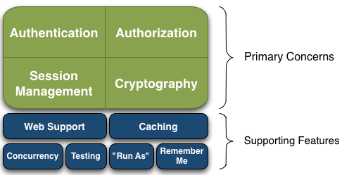
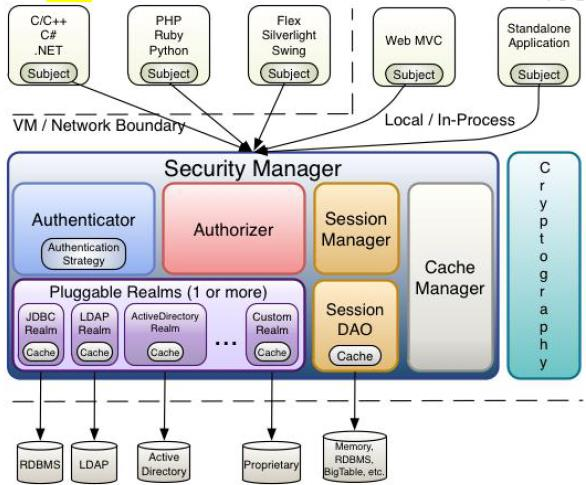

# Shiro

[TOC]

## Shiro概述

### shiro简介

* Apache Shiro 是 Java 的一个安全（ 权限）框架。
* Shiro 可以非常容易的开发出足够好的应用，其不仅可以用在JavaSE 环境，也可以用在 JavaEE 环境。
* Shiro 可以完成：认证、授权、加密、会话管理、与Web 集成、 缓存
等。
* 下载： http://shiro.apache.org/

### 功能简介

* 基本功能点如下图所示：
  

* Authentication： 身份认证/登录，验证用户是不是拥有相应的身份；
* Authorization： 授权，即权限验证，验证某个已认证的用户是否拥有某个权限；即判断用
户是否能进行什么操作，如：验证某个用户是否拥有某个角色。或者细粒度的验证某个用户
对某个资源是否具有某个权限；
* Session Manager： 会话管理，即用户登录后就是一次会话，在没有退出之前，它的所有
信息都在会话中； 会话可以是普通 JavaSE 环境， 也可以是 Web 环境的；
* Cryptography： 加密，保护数据的安全性，如密码加密存储到数据库，而不是明文存储；
* Web Support： Web 支持，可以非常容易的集成到Web 环境；
* Caching： 缓存，比如用户登录后，其用户信息、拥有的角色/权限不必每次去查，这样可
以提高效率；
* Concurrency： Shiro 支持多线程应用的并发验证，即如在一个线程中开启另一个线程，能
* 把权限自动传播过去；
* Testing：提供测试支持；
* Run As： 允许一个用户假装为另一个用户（如果他们允许） 的身份进行访问；
* Remember Me： 记住我，这个是非常常见的功能，即一次登录后，下次再来的话不用登
录了

### Shiro架构

#### 外部架构

从外部来看Shiro，即从应用程序角度的来观察如何使用 Shiro 完成
工作：


* Subject：应用代码直接交互的对象是 Subject，也就是说 Shiro 的对外API 核心就是 Subject。Subject 代表了当前“用户”，这个用户不一定是一个具体的人，与当前应用交互的任何东西都是 Subject，如网络爬虫，机器人等；与 Subject 的所有交互都会委托给 SecurityManager；Subject 其实是一个门面，SecurityManager 才是实际的执行者；
* SecurityManager：安全管理器；即所有与安全有关的操作都会与SecurityManager 交互；且其管理着所有 Subject；可以看出它是 Shiro的核心，它负责与 Shiro 的其他组件进行交互，它相当于 SpringMVC 中DispatcherServlet 的角色
* Realm： Shiro 从 Realm 获取安全数据（如用户、角色、权限），就是说SecurityManager 要验证用户身份，那么它需要从 Realm 获取相应的用户进行比较以确定用户身份是否合法；也需要从 Realm 得到用户相应的角色/权限进行验证用户是否能进行操作；可以把 Realm 看成 DataSource

#### 内部架构

* Shiro 架构(Shiro内部来看)
  

* Subject：任何可以与应用交互的“用户”；
* SecurityManager：相当于SpringMVC 中的 DispatcherServlet；是 Shiro 的心脏；所有具体的交互都通过 SecurityManager 进行控制；它管理着所有 Subject、且负责进行认证、授权、会话及缓存的管理。
* Authenticator： 负责 Subject 认证，是一个扩展点，可以自定义实现；可以使用认证策略（ Authentication Strategy），即什么情况下算用户认证通过了；
* Authorizer： 授权器、即访问控制器，用来决定主体是否有权限进行相应的操作；即控制着用户能访问应用中的哪些功能；
* Realm：可以有 1 个或多个 Realm，可以认为是安全实体数据源，即用于获取安全实体的；可以是JDBC 实现，也可以是内存实现等等；由用户提供；所以一般在应用中都需要实现自己的 Realm；
* SessionManager：管理 Session 生命周期的组件；而 Shiro 并不仅仅可以用在 Web环境，也可以用在如普通的 JavaSE 环境
* CacheManager：缓存控制器，来管理如用户、角色、权限等的缓存的；因为这些数据基本上很少改变，放到缓存中后可以提高访问的性能
* Cryptography：密码模块，Shiro 提高了一些常见的加密组件用于如密码加密/解密

## 第一个Shiro程序

### 搭建开发环境

1. 测试实例是基于Spring+SpringMVC的开发环境，所以它们所需要的依赖，另外还需要Shiro所需要的依赖，如下：

     ```xml
     <?xml version="1.0" encoding="UTF-8"?>
     <project xmlns="http://maven.apache.org/POM/4.0.0"
              xmlns:xsi="http://www.w3.org/2001/XMLSchema-instance"
              xsi:schemaLocation="http://maven.apache.org/POM/4.0.0 http://maven.apache.org/xsd/maven-4.0.0.xsd">
         <modelVersion>4.0.0</modelVersion>

         <groupId>com.suftz.demo</groupId>
         <artifactId>shiro-demo</artifactId>
         <version>1.0-SNAPSHOT</version>

         <dependencies>
             <dependency>
                 <groupId>junit</groupId>
                 <artifactId>junit</artifactId>
                 <version>4.12</version>
             </dependency>
             <dependency>
                 <groupId>org.apache.shiro</groupId>
                 <artifactId>shiro-all</artifactId>
                 <version>1.3.2</version>
             </dependency>

             <dependency>
                 <groupId>org.apache.logging.log4j</groupId>
                 <artifactId>log4j-core</artifactId>
                 <version>2.11.2</version>
             </dependency>
             <dependency>
                 <groupId>org.apache.logging.log4j</groupId>
                 <artifactId>log4j-api</artifactId>
                 <version>2.11.2</version>
             </dependency>
             <dependency>
                 <groupId>org.apache.logging.log4j</groupId>
                 <artifactId>log4j-slf4j-impl</artifactId>
                 <version>2.11.2</version>
             </dependency>
             <dependency>
                 <groupId>org.slf4j</groupId>
                 <artifactId>slf4j-api</artifactId>
                 <version>1.7.30</version>
             </dependency>

             <dependency>
                 <groupId>org.springframework</groupId>
                 <artifactId>spring-context</artifactId>
                 <version>4.0.0.RELEASE</version>
             </dependency>
             <dependency>
                 <groupId>commons-logging</groupId>
                 <artifactId>commons-logging</artifactId>
                 <version>1.1.1</version>
             </dependency>
             <dependency>
                 <groupId>junit</groupId>
                 <artifactId>junit</artifactId>
                 <version>4.12</version>
                 <scope>test</scope>
             </dependency>
             <dependency>
                 <groupId>mysql</groupId>
                 <artifactId>mysql-connector-java</artifactId>
                 <version>6.0.6</version>
             </dependency>
             <dependency>
                 <groupId>com.alibaba</groupId>
                 <artifactId>druid</artifactId>
                 <version>1.0.9</version>
             </dependency>

             <dependency>
                 <groupId>org.aspectj</groupId>
                 <artifactId>aspectjrt</artifactId>
                 <version>1.8.9</version>
             </dependency>
             <dependency>
                 <groupId>org.aspectj</groupId>
                 <artifactId>aspectjtools</artifactId>
                 <version>1.8.9</version>
             </dependency>
             <dependency>
                 <groupId>org.aspectj</groupId>
                 <artifactId>aspectjweaver</artifactId>
                 <version>1.7.4</version>
             </dependency>

             <dependency>
                 <groupId>org.springframework</groupId>
                 <artifactId>spring-jdbc</artifactId>
                 <version>4.0.0.RELEASE</version>
             </dependency>
             <dependency>
                 <groupId>org.springframework</groupId>
                 <artifactId>spring-tx</artifactId>
                 <version>4.0.0.RELEASE</version>
             </dependency>
             <dependency>
                 <groupId>org.springframework</groupId>
                 <artifactId>spring-orm</artifactId>
                 <version>4.0.0.RELEASE</version>
             </dependency>
             <dependency>
                 <groupId>org.springframework</groupId>
                 <artifactId>spring-core</artifactId>
                 <version>4.0.6.RELEASE</version>
             </dependency>
             <!--        <dependency>-->
             <!--            <groupId>org.springframework</groupId>-->
             <!--            <artifactId>spring-web</artifactId>-->
             <!--            <version>5.2.6.RELEASE</version>-->
             <!--        </dependency>-->

             <!--        <dependency>-->
             <!--            <groupId>org.springframework</groupId>-->
             <!--            <artifactId>spring-webmvc</artifactId>-->
             <!--            <version>5.2.6.RELEASE</version>-->
             <!--        </dependency>-->
             <dependency>
                 <groupId>org.springframework</groupId>
                 <artifactId>spring-web</artifactId>
                 <version>4.0.0.RELEASE</version>
             </dependency>

             <dependency>
                 <groupId>org.springframework</groupId>
                 <artifactId>spring-webmvc</artifactId>
                 <version>4.0.0.RELEASE</version>
             </dependency>

             <dependency>
                 <groupId>org.junit.jupiter</groupId>
                 <artifactId>junit-jupiter</artifactId>
                 <version>RELEASE</version>
                 <scope>test</scope>
             </dependency>
             <dependency>
                 <groupId>org.testng</groupId>
                 <artifactId>testng</artifactId>
                 <version>RELEASE</version>
                 <scope>compile</scope>
             </dependency>

             <dependency>
                 <groupId>org.hibernate</groupId>
                 <artifactId>hibernate-validator</artifactId>
                 <version>5.1.3.Final</version>
             </dependency>
             <dependency>
                 <groupId>javax.validation</groupId>
                 <artifactId>validation-api</artifactId>
                 <version>1.1.0.Final</version>
             </dependency>
             <dependency>
                 <groupId>org.jboss.logging</groupId>
                 <artifactId>jboss-logging</artifactId>
                 <version>3.1.1.GA</version>
             </dependency>
             <dependency>
                 <groupId>org.apache.taglibs</groupId>
                 <artifactId>taglibs-standard-spec</artifactId>
                 <version>1.2.1</version>
             </dependency>
             <dependency>
                 <groupId>org.apache.taglibs</groupId>
                 <artifactId>taglibs-standard-impl</artifactId>
                 <version>1.2.1</version>
             </dependency>

             <dependency>
                 <groupId>com.fasterxml.jackson.core</groupId>
                 <artifactId>jackson-databind</artifactId>
                 <version>2.5.4</version>
             </dependency>

             <dependency>
                 <groupId>commons-fileupload</groupId>
                 <artifactId>commons-fileupload</artifactId>
                 <version>1.4</version>
             </dependency>
             <dependency>
                 <groupId>commons-io</groupId>
                 <artifactId>commons-io</artifactId>
                 <version>2.2</version>
             </dependency>

             <dependency>
                 <groupId>net.sf.ehcache</groupId>
                 <artifactId>ehcache-core</artifactId>
                 <version>2.4.3</version>
             </dependency>
         </dependencies>
     </project>
     ```

2. 配置log4j2.xml日志信息，以及缓存ehcache.xml,以及spring-mvc.xml

3. 编写applicationContext.xml

   ```xml
   <?xml version="1.0" encoding="UTF-8"?>
   <beans xmlns="http://www.springframework.org/schema/beans"
       xmlns:xsi="http://www.w3.org/2001/XMLSchema-instance"
       xsi:schemaLocation="http://www.springframework.org/schema/beans http://www.springframework.org/schema/beans/spring-beans.xsd">

       <!--
       1. 配置 SecurityManager!
       -->
       <bean id="securityManager" class="org.apache.shiro.web.mgt.DefaultWebSecurityManager">
           <property name="cacheManager" ref="cacheManager"/>
           <property name="authenticator" ref="authenticator"></property>
           <property name="realms">
               <list>
                   <ref bean="jdbcRealm" />
                   <ref bean="secondRealm" />
               </list>
           </property>
           <!--rememberMe最大有效时间，其实就是设置本地cookie的有效时间-->
           <property name="rememberMeManager.cookie.maxAge" value="20"></property>
       </bean>

       <!--
       1. 配置 CacheManager.
       2.1 需要加入 ehcache 的 jar 包及配置文件.
       -->
       <bean id="cacheManager" class="org.apache.shiro.cache.ehcache.EhCacheManager">
           <property name="cacheManagerConfigFile" value="classpath:ehcache.xml"/>
       </bean>

       <bean id="authenticator" class="org.apache.shiro.authc.pam.ModularRealmAuthenticator">
           <property name="authenticationStrategy">
               <bean class="org.apache.shiro.authc.pam.AtLeastOneSuccessfulStrategy" />
           </property>
       </bean>

       <!--
       	1. 配置 Realm
       	3.1 直接配置实现了 org.apache.shiro.realm.Realm 接口的 bean
       -->
       <bean id="jdbcRealm" class="com.suftz.demo.shirodemo.realms.ShiroRealm">
           <property name="credentialsMatcher">
               <bean class="org.apache.shiro.authc.credential.HashedCredentialsMatcher">
                   <property name="hashAlgorithmName" value="MD5"></property>
                   <property name="hashIterations" value="1024"></property>
               </bean>
           </property>
       </bean>
       <bean id="secondRealm" class="com.suftz.demo.shirodemo.realms.SecondShiroRealm">
           <property name="credentialsMatcher">
               <bean class="org.apache.shiro.authc.credential.HashedCredentialsMatcher">
                   <property name="hashAlgorithmName" value="SHA1"></property>
                   <property name="hashIterations" value="1024"></property>
               </bean>
           </property>
       </bean>

       <!--
       1. 配置 LifecycleBeanPostProcessor. 可以自定的来调用配置在 Spring IOC 容器中 shiro bean 的生命周期方法.
       -->
       <bean id="lifecycleBeanPostProcessor" class="org.apache.shiro.spring.LifecycleBeanPostProcessor"/>

       <!--
       1. 启用 IOC 容器中使用 shiro 的注解. 但必须在配置了 LifecycleBeanPostProcessor 之后才可以使用.
       -->
       <bean class="org.springframework.aop.framework.autoproxy.DefaultAdvisorAutoProxyCreator"
             depends-on="lifecycleBeanPostProcessor"/>
       <bean class="org.apache.shiro.spring.security.interceptor.AuthorizationAttributeSourceAdvisor">
           <property name="securityManager" ref="securityManager"/>
       </bean>

       <!--
       1. 配置 ShiroFilter.
       6.1 id 必须和 web.xml 文件中配置的 DelegatingFilterProxy 的 <filter-name> 一致.
                         若不一致, 则会抛出: NoSuchBeanDefinitionException. 因为 Shiro 会来 IOC 容器中查找和 <filter-name> 名字对应的 filter bean.
       -->
       <bean id="shiroFilter" class="org.apache.shiro.spring.web.ShiroFilterFactoryBean">
           <property name="securityManager" ref="securityManager"/>
           <property name="loginUrl" value="/login.jsp"/>
           <property name="successUrl" value="/list.jsp"/>
           <property name="unauthorizedUrl" value="/un.jsp"/>

           <property name="filterChainDefinitionMap" ref="filterChainDefinitionMap"></property>

           <!--
           	配置哪些页面需要受保护.
           	以及访问这些页面需要的权限.
           	1). anon 可以被匿名访问
           	2). authc 必须认证(即登录)后才可能访问的页面.
           	3). logout 登出.
           	4). roles 角色过滤器
           -->

   <!--        <property name="filterChainDefinitions">-->
   <!--            <value>-->
   <!--                /login.jsp = anon-->
   <!--                /user/login=anon-->
   <!--                /user/logout=logout-->

   <!--                /user.jsp = roles[user]-->
   <!--                /admin.jsp = roles[admin]-->

   <!--                # everything else requires authentication:-->
   <!--                /** = authc-->
   <!--            </value>-->
   <!--        </property>-->

       </bean>

       <!-- 配置一个 bean, 该 bean 实际上是一个 Map. 通过实例工厂方法的方式 -->
       <bean id="filterChainDefinitionMap" factory-bean="filterChainDefinitionMapBuilder" factory-method="buildFilterChainDefinitionMap"></bean>
   <!--    -->
       <bean id="filterChainDefinitionMapBuilder" class="com.suftz.demo.shirodemo.factory.FilterChainDefinitionMapBuilder"></bean>
   <!--    -->

   </beans>
   ```

4. 配置web.xml文件

   ```xml
   <?xml version="1.0" encoding="UTF-8"?>
   <web-app xmlns="http://xmlns.jcp.org/xml/ns/javaee"
            xmlns:xsi="http://www.w3.org/2001/XMLSchema-instance"
            xsi:schemaLocation="http://xmlns.jcp.org/xml/ns/javaee http://xmlns.jcp.org/xml/ns/javaee/web-app_4_0.xsd"
            version="4.0">

       <context-param>
           <param-name>contextConfigLocation</param-name>
           <param-value>classpath:applicationContext.xml</param-value>
       </context-param>
       <listener>
           <listener-class>org.springframework.web.context.ContextLoaderListener</listener-class>
       </listener>

       <servlet>
           <servlet-name>spring</servlet-name>
           <servlet-class>org.springframework.web.servlet.DispatcherServlet</servlet-class>
           <load-on-startup>1</load-on-startup>
       </servlet>
       <servlet-mapping>
           <servlet-name>spring</servlet-name>
           <url-pattern>/</url-pattern>
       </servlet-mapping>

       <!-- Shiro Filter is defined in the spring application context: -->
       <!--
       1. 配置  Shiro 的 shiroFilter.
       2. DelegatingFilterProxy 实际上是 Filter 的一个代理对象. 默认情况下, Spring 会到 IOC 容器中查找和
       <filter-name> 对应的 filter bean. 也可以通过 targetBeanName 的初始化参数来配置 filter bean 的 id.
       -->
       <filter>
           <filter-name>shiroFilter</filter-name>
           <filter-class>org.springframework.web.filter.DelegatingFilterProxy</filter-class>
           <init-param>
               <param-name>targetFilterLifecycle</param-name>
               <param-value>true</param-value>
           </init-param>
       </filter>
       <filter-mapping>
           <filter-name>shiroFilter</filter-name>
           <url-pattern>/*</url-pattern>
       </filter-mapping>
   </web-app>
   ```