# SpringMVC基础

[TOC]

## SpringMVC概述

### SpringMVC特点

* Spring 为展现层提供的基于 MVC 设计理念的优秀的Web 框架，是目前最主流的 MVC 框架之一
* Spring3.0 后全面超越 Struts2，成为最优秀的 MVC 框架
* Spring MVC 通过一套 MVC 注解，让 POJO 成为处理请求的控制器，而无须实现任何接口。
* 支持 REST 风格的 URL 请求
* 采用了松散耦合可插拔组件结构，比其他 MVC 框架更具扩展性和灵活性

### 第一个HelloWorld程序

* 步骤：新建一个web工程
  1. 加入jar包
     * commons-logging-x.y.z.jar
     * spring-aop-x.y.z.RELEASE.jar
     * spring-beans-x.y.z.RELEASE.jar
     * spring-context-x.y.z.RELEASE.jar
     * spring-core-x.y.z.RELEASE.jar
     * spring-expression-x.y.z.RELEASE.jar
     * spring-web-x.y.z.RELEASE.jar
     * spring-webmvc-x.y.z.RELEASE.jar
       > x,y,z是数字，代表版本号，根据最新稳定的版本来使用

     或者使用maven来添加依赖：

     ```xml
     <?xml version="1.0" encoding="UTF-8"?>
     <project xmlns="http://maven.apache.org/POM/4.0.0"
              xmlns:xsi="http://www.w3.org/2001/XMLSchema-instance"
              xsi:schemaLocation="http://maven.apache.org/POM/4.0.0 http://maven.apache.org/xsd/maven-4.0.0.xsd">
         <modelVersion>4.0.0</modelVersion>

         <groupId>com.suftz.springmvc</groupId>
         <artifactId>springmvc-demo</artifactId>
         <version>1.0-SNAPSHOT</version>

         <dependencies>
             <dependency>
                 <groupId>org.springframework</groupId>
                 <artifactId>spring-test</artifactId>
                 <version>5.2.6.RELEASE</version>
             </dependency>
             <!--        <dependency>-->
             <!--            <groupId>org.springframework</groupId>-->
             <!--            <artifactId>spring-context</artifactId>-->
             <!--            <version>5.2.6.RELEASE</version>-->
             <!--        </dependency>-->
             <dependency>
                 <groupId>org.springframework</groupId>
                 <artifactId>spring-context</artifactId>
                 <version>4.0.0.RELEASE</version>
             </dependency>
             <dependency>
                 <groupId>commons-logging</groupId>
                 <artifactId>commons-logging</artifactId>
                 <version>1.1.1</version>
             </dependency>
             <dependency>
                 <groupId>junit</groupId>
                 <artifactId>junit</artifactId>
                 <version>4.12</version>
                 <scope>test</scope>
             </dependency>
             <dependency>
                 <groupId>mysql</groupId>
                 <artifactId>mysql-connector-java</artifactId>
                 <version>6.0.6</version>
             </dependency>
             <dependency>
                 <groupId>com.alibaba</groupId>
                 <artifactId>druid</artifactId>
                 <version>1.0.9</version>
             </dependency>


             <dependency>
                 <groupId>org.aspectj</groupId>
                 <artifactId>aspectjrt</artifactId>
                 <version>1.8.9</version>
             </dependency>
             <dependency>
                 <groupId>org.aspectj</groupId>
                 <artifactId>aspectjtools</artifactId>
                 <version>1.8.9</version>
             </dependency>
             <dependency>
                 <groupId>org.aspectj</groupId>
                 <artifactId>aspectjweaver</artifactId>
                 <version>1.7.4</version>
             </dependency>

             <dependency>
                 <groupId>org.springframework</groupId>
                 <artifactId>spring-jdbc</artifactId>
                 <version>4.0.0.RELEASE</version>
             </dependency>
             <dependency>
                 <groupId>org.springframework</groupId>
                 <artifactId>spring-tx</artifactId>
                 <version>4.0.0.RELEASE</version>
             </dependency>
             <dependency>
                 <groupId>org.springframework</groupId>
                 <artifactId>spring-orm</artifactId>
                 <version>4.0.0.RELEASE</version>
             </dependency>
             <dependency>
                 <groupId>org.springframework</groupId>
                 <artifactId>spring-core</artifactId>
                 <version>4.0.6.RELEASE</version>
             </dependency>
             <!--        <dependency>-->
             <!--            <groupId>org.springframework</groupId>-->
             <!--            <artifactId>spring-web</artifactId>-->
             <!--            <version>5.2.6.RELEASE</version>-->
             <!--        </dependency>-->

             <!--        <dependency>-->
             <!--            <groupId>org.springframework</groupId>-->
             <!--            <artifactId>spring-webmvc</artifactId>-->
             <!--            <version>5.2.6.RELEASE</version>-->
             <!--        </dependency>-->
             <dependency>
                 <groupId>org.springframework</groupId>
                 <artifactId>spring-web</artifactId>
                 <version>4.0.0.RELEASE</version>
             </dependency>

             <dependency>
                 <groupId>org.springframework</groupId>
                 <artifactId>spring-webmvc</artifactId>
                 <version>4.0.0.RELEASE</version>
             </dependency>


             <!--日志框架-->
             <dependency>
                 <groupId>org.apache.logging.log4j</groupId>
                 <artifactId>log4j-core</artifactId>
                 <version>2.11.2</version>
             </dependency>
             <dependency>
                 <groupId>org.apache.logging.log4j</groupId>
                 <artifactId>log4j-api</artifactId>
                 <version>2.11.2</version>
             </dependency>
             <dependency>
                 <groupId>org.apache.logging.log4j</groupId>
                 <artifactId>log4j-slf4j-impl</artifactId>
                 <version>2.11.2</version>
             </dependency>
             <dependency>
                 <groupId>org.slf4j</groupId>
                 <artifactId>slf4j-api</artifactId>
                 <version>1.7.30</version>
             </dependency>
             <dependency>
                 <groupId>org.junit.jupiter</groupId>
                 <artifactId>junit-jupiter</artifactId>
                 <version>RELEASE</version>
                 <scope>test</scope>
             </dependency>
             <dependency>
                 <groupId>org.testng</groupId>
                 <artifactId>testng</artifactId>
                 <version>RELEASE</version>
                 <scope>compile</scope>
             </dependency>

         </dependencies>
     </project>
     ```

  2. 在web.xml中配置spring的DispatcherServlet

      ```xml
      <?xml version="1.0" encoding="UTF-8"?>
      <web-app xmlns="http://xmlns.jcp.org/xml/ns/javaee"
               xmlns:xsi="http://www.w3.org/2001/XMLSchema-instance"
               xsi:schemaLocation="http://xmlns.jcp.org/xml/ns/javaee http://xmlns.jcp.org/xml/ns/javaee/web-app_4_0.xsd"
               version="4.0">

          <servlet>
              <servlet-name>springDispatcherServlet</servlet-name>
              <servlet-class>org.springframework.web.servlet.DispatcherServlet</servlet-class>
              <init-param>
                  <param-name>contextConfigLocation</param-name>
                  <param-value>classpath:springmvc.xml</param-value>
              </init-param>
              <!--实际上也可以不通过contextConfigLocation来配置SpringMVC的配置文件，
                  而使用默认的配置文件：/WEB-INF/<servlet-name>-servlet.xml
                  即：在WEB-INF目录下放springDispatcherServlet-servlet.xml文件
              -->
              <load-on-startup>1</load-on-startup>
          </servlet>

          <servlet-mapping>
              <servlet-name>springDispatcherServlet</servlet-name>
              <url-pattern>/</url-pattern>
          </servlet-mapping>

      </web-app>
      ```

     需要注意的是url-pattern配置为`/`而不是`/*`,因为：
     `<url-pattern>/</url-pattern>`会匹配到/login这样的路径型url，不会匹配到模式为*.jsp这样的后缀型url
    `<url-pattern>/*</url-pattern>`会匹配所有url：路径型的和后缀型的url(包括/login,*.jsp,*.js和*.html等)

  3. 在src下，或者resources目录下(maven),或者是默认的配置文件路径，新建srping配置文件:

     ```xml
     <?xml version="1.0" encoding="UTF-8"?>
     <beans xmlns="http://www.springframework.org/schema/beans"
            xmlns:xsi="http://www.w3.org/2001/XMLSchema-instance"
            xmlns:context="http://www.springframework.org/schema/context"
            xmlns:mvc="http://www.springframework.org/schema/mvc"
            xsi:schemaLocation="http://www.springframework.org/schema/beans http://www.springframework.org/schema/beans/spring-beans.xsd
            http://www.springframework.org/schema/context http://www.springframework.org/schema/context/spring-context-4.0.xsd
            http://www.springframework.org/schema/mvc http://www.springframework.org/schema/mvc/spring-mvc-4.0.xsd">

         <!-- 配置自动扫描的包 -->
         <context:component-scan base-package="com.suftz.handlers"></context:component-scan>

         <!--配置视图解析器：如何把handler方法返回值解析为实际的物理视图-->
         <bean class="org.springframework.web.servlet.view.InternalResourceViewResolver">
             <property name="prefix" value="/WEB-INF/views/"></property>
             <property name="suffix" value=".jsp"></property>
         </bean>

     </beans>
     ```

  4. 编写一个HelloWorld类作为处理请求的类

      ```java
      package com.suftz.handlers;

      import org.springframework.stereotype.Controller;
      import org.springframework.web.bind.annotation.RequestMapping;

      @Controller
      public class HelloWorld {
      //    1. 使用@RequestMapping 注解来映射请求的URL
      //    2. 返回值会通过视图解析器解析为实际的物理视图，对于InternalResourceViewResolver视图解析器，会做如下的解析：
      //       通过prefix+returnVal+后缀  这样的方式得到实际的物理视图，然后做转发操作
          //   相当于请求转发到了/WEB-INF/views/success.jsp

          @RequestMapping("/helloworld")
          public String hello(){
              System.out.println("hello world");
              return "success";
          }
      }
      ```

  5. 根据上面的指示，需要新建一个文件，路径为/WEB-INF/views/success.jsp

     ```xml
     <%@ page contentType="text/html;charset=UTF-8" language="java" %>
     <html>
     <head>
         <title>Hello world</title>
     </head>
     <body>
     hi!hello world
     </body>
     </html>
     ```

### @RequestMapping映射请求

* Spring MVC 使用 @RequestMapping 注解为控制器指定可以处理哪些 URL 请求
* 在控制器的类定义及方法定义处都可标注@RequestMapping
  * 类定义处：提供初步的请求映射信息。相对于 WEB 应用的根目录
  * 方法处：提供进一步的细分映射信息。相对于类定义处的 URL。若类定义处未标注 @RequestMapping，则方法处标记的 URL 相对于WEB 应用的根目录
* DispatcherServlet 截获请求后，就通过控制器上@RequestMapping 提供的映射信息确定请求所对应的处理方法

* 示例：

  ```java
  package com.suftz.handlers;

  import org.springframework.stereotype.Controller;
  import org.springframework.web.bind.annotation.RequestMapping;
  //此时，地址栏上的请求http://ip:port/contextPath/user/*   下的请求都会由该类处理
  @Controller
  @RequestMapping("/user")
  public class HelloWorld {
      //此时，地址栏上的请求http://ip:port/contextPath/user/hello   会进入到此方法
      @RequestMapping("/hello")
      public String hello(){
          System.out.println("hello world");
          return "success";
      }
  }
  ```

#### 映射请求参数、请求方法或请求头

* @RequestMapping 除了可以使用请求 URL 映射请求外，还可以使用请求方法、请求参数及请求头映射请求
* @RequestMapping 的 value、method、params 及 heads分别表示请求 URL、请求方法、请求参数及请求头的映射条件，他们之间是与的关系，联合使用多个条件可让请求映射更加精确化。
* params 和 headers支持简单的表达式：
  * param1: 表示请求必须包含名为 param1 的请求参数
  * !param1: 表示请求不能包含名为 param1 的请求参数
  * param1 != value1: 表示请求包含名为 param1 的请求参数，但其值
  不能为 value1
  * {“param1=value1”, “param2”}: 请求必须包含名为 param1 和param2
  的两个请求参数，且 param1 参数的值必须为 value1

* 格式举例：

  ```java
  package com.suftz.handlers;

  import org.springframework.stereotype.Controller;
  import org.springframework.web.bind.annotation.RequestMapping;
  //此时，地址栏上的请求http://ip:port/contextPath/user/*   下的请求都会由该类处理
  @Controller
  @RequestMapping("/user")
  public class HelloWorld {
      //此时，地址栏上的请求http://ip:port/contextPath/user/hello   会进入到此方法
      @RequestMapping(value="/hello",method=RequestMethod.GET,params={"username","age!=10"},headers={"Accept-Language=zh-CN,q=0.8"})
      public String hello(){
          System.out.println("hello world");
          return "success";
      }
  }
  ```

> 一般情况下，根据url和请求方法来映射即可，请求参数和请求头并不常用

* 使用 @RequestMapping 映射请求

* Ant 风格资源地址支持 3 种匹配符：
  1. `?`：匹配文件名中的一个字符
  2. `*`：匹配文件名中的任意字符
  3. `**`：`**` 匹配多层路径
* @RequestMapping 还支持 Ant 风格的 URL：
  * `/user/*/createUser`: 匹配
    `/user/aaa/createUser`、`/user/bbb/createUser` 等 URL
  * `/user/**/createUser`: 匹配
    `/user/createUser`、`/user/aaa/bbb/createUser` 等 URL
  * `/user/createUser??`: 匹配
    `/user/createUseraa`、`/user/createUserbb` 等 URL

#### @PathVariable映射 URL 绑定的占位符

* 带占位符的 URL 是 Spring3.0 新增的功能，该功能在SpringMVC 向 REST 目标挺进发展过程中具有里程碑的意义
* 通过 @PathVariable 可以将 URL 中占位符参数绑定到控制器处理方法的入参中：URL 中的 {xxx} 占位符可以通过@PathVariable("xxx") 绑定到操作方法的入参中

```java
@RequestMapping(value="/order/{id}",method = RequestMethod.GET)
public String get(@PathVariable Integer id){
    System.out.println("get请求，执行get方法");
    return SUCCESS;
}
```

#### REST

* REST：即 Representational State Transfer。（资源）表现层状态转化。是目前最流行的一种互联网软件架构。它结构清晰、符合标准、易于理解、扩展方便，所以正得到越来越多网站的采用
* 资源（Resources）：网络上的一个实体，或者说是网络上的一个具体信息。它可以是一段文本、一张图片、一首歌曲、一种服务，总之就是一个具体的存在。可以用一个URI（统一资源定位符）指向它，每种资源对应一个特定的 URI 。要获取这个资源，访问它的URI就可以，因此 URI 即为每一个资源的独一无二的识别符。
* 表现层（Representation）：把资源具体呈现出来的形式，叫做它的表现层（Representation）。比如，文本可以用 txt 格式表现，也可以用 HTML 格式、XML 格式、JSON 格式表现，甚至可以采用二进制格式。
* 状态转化（State Transfer）：每发出一个请求，就代表了客户端和服务器的一次交互过程。HTTP协议，是一个无状态协议，即所有的状态都保存在服务器
端。因此，如果客户端想要操作服务器，必须通过某种手段，让服务器端发生“
状态转化”（State Transfer）。而这种转化是建立在表现层之上的，所以就是 “表现层状态转化”。具体说，就是 HTTP 协议里面，四个表示操作方式的动
词：GET、POST、PUT、DELETE。它们分别对应四种基本操作：GET 用来获取资源，POST 用来新建资源，PUT 用来更新资源，DELETE 用来删除资源。

* SpringMVC的REST风格请求处理示例：

1. 在web.xml中配置拦截器HiddenHttpMethodFilter

   ```xml
   <?xml version="1.0" encoding="UTF-8"?>
   <web-app xmlns="http://xmlns.jcp.org/xml/ns/javaee"
            xmlns:xsi="http://www.w3.org/2001/XMLSchema-instance"
            xsi:schemaLocation="http://xmlns.jcp.org/xml/ns/javaee http://xmlns.jcp.org/xml/ns/javaee/web-app_4_0.xsd"
            version="4.0">
       <!--将post请求转换成delete请求或者put请求-->

       <filter>
           <filter-name>HiddenHttpMethodFilter</filter-name>
           <filter-class>org.springframework.web.filter.HiddenHttpMethodFilter</filter-class>
           <init-param>
               <param-name>readonly</param-name>
               <param-value>false</param-value>
           </init-param>
       </filter>
       <filter-mapping>
           <filter-name>HiddenHttpMethodFilter</filter-name>
           <url-pattern>/*</url-pattern>
       </filter-mapping>

       <servlet>
           <servlet-name>springDispatcherServlet</servlet-name>
           <servlet-class>org.springframework.web.servlet.DispatcherServlet</servlet-class>
           <init-param>
               <param-name>contextConfigLocation</param-name>
               <param-value>classpath:springmvc.xml</param-value>
           </init-param>
           <!--实际上也可以不通过contextConfigLocation来配置SpringMVC的配置文件，
               而使用默认的配置文件：/WEB-INF/<servlet-name>-servlet.xml
               即：在WEB-INF目录下放springDispatcherServlet-servlet.xml文件
           -->
           <load-on-startup>1</load-on-startup>
       </servlet>

       <servlet-mapping>
           <servlet-name>springDispatcherServlet</servlet-name>
           <url-pattern>/</url-pattern>
       </servlet-mapping>

   </web-app>
   ```

2. 编写jsp页面，文件放在/WEB-INF/views/order.jsp

   ```xml
   <%@ page contentType="text/html;charset=UTF-8" language="java" %>
   <html>
   <head>
       <title>Title</title>
       <base href="<%=request.getContextPath()%>/" >
   </head>
   <body>
   <form action="order/1" method="GET">
       <input type="hidden" name="_method" value="GET">
       <input type="submit" value="发送get请求">
   </form>

   <form action="order" method="POST">
       <input type="hidden" name="_method" value="POST">
       <input type="submit" value="发送post请求">
   </form>

   <form action="order/1" method="POST">
       <input type="hidden" name="_method" value="PUT">
       <input type="submit" value="发送put请求">
   </form>

   <form action="order/1" method="POST">
       <input type="hidden" name="_method" value="DELETE">
       <input type="submit" value="发送delete请求">
   </form>


   </body>
   </html>
   ```

3. 编写Controller类，来处理请求

   ```java
   package com.suftz.handlers;

   import org.springframework.stereotype.Controller;
   import org.springframework.web.bind.annotation.PathVariable;
   import org.springframework.web.bind.annotation.RequestMapping;
   import org.springframework.web.bind.annotation.RequestMethod;

   @Controller
   public class OrderHandler {
       private static final String SUCCESS="success";

       /**
        * Rest 风格的 URL
        * 以CRUD为例：
        * 新增：/order POST
        * 修改：/order1 PUT
        * 获取：/order/1 GET
        * 删除：/order/1 DELETE
        */


       @RequestMapping(value="/order/{id}",method = RequestMethod.GET)
       public String get(@PathVariable Integer id){
           System.out.println("get请求，执行get方法");
           return SUCCESS;
       }

       @RequestMapping(value="/order",method = RequestMethod.POST)
       public String add(){
           System.out.println("post请求，执行add方法");
           return SUCCESS;
       }

       @RequestMapping(value="/order/{id}",method = RequestMethod.DELETE)
       public String delete(@PathVariable Integer id){
           System.out.println("delete请求，执行delete方法");
           return SUCCESS;
       }

       @RequestMapping(value="/order/{id}",method = RequestMethod.PUT)
       public String update(@PathVariable Integer id){
           System.out.println("put请求，执行update方法");
           return SUCCESS;
       }

       @RequestMapping(value="/order/list",method = RequestMethod.GET)
       public String list(){
           return "order";
       }

   }
   ```

   > 点击后，会在控制台打印相应语句，可以看到进入了对应的方法内，但是在请求转发时，可能会出问题，无法转发到success.jsp页面，因为tomcat不支持delete和put方法，可以设置success.jsp页面为errorPage来实现转发，或者其他方法(不讨论)

#### 映射请求参数

* Spring MVC 通过分析处理方法的签名，将 HTTP 请求信息绑定到处理方法的相应人参中。
* Spring MVC 对控制器处理方法签名的限制是很宽松的，几乎可以按喜欢的任何方式对方法进行签名。
* 必要时可以对方法及方法入参标注相应的注解（@PathVariable、@RequestParam、@RequestHeader 等）、SpringMVC 框架会将 HTTP 请求的信息绑定到相应的方法入参中，并根据方法的返回值类型做出相应的后续处理。

##### 使用 @RequestParam 绑定请求参数值

* 在处理方法入参处使用 @RequestParam 可以把请求参数传递给请求方法
  * value：参数名
  * required：是否必须。默认为 true, 表示请求参数中必须包含对应
的参数，若不存在，将抛出异常

* 示例：

  ```java
  @RequestMapping(value = "/login")
  public String login(@RequestParam(value = "username") String username, @RequestParam(value = "password") String password, @RequestParam(value = "age", required = false, defaultValue = "0") Integer age) {
      return "success";
  }
  ```

  > 如果age是int类型，在没有传值的时候会报错，无法进入该方法，可以设置age参数为非必须的参数；也可以设置它的默认值，则不会报错；设置成包装类型后就不会有这些问题

##### 使用 @RequestHeader 绑定请求报头的属性值

* 请求头包含了若干个属性，服务器可据此获知客户端的信息，通过 @RequestHeader 即可将请求头中的属性值绑定到处理方法的入参中

* 使用示例

  ```java
  @RequestMapping(value = "/login")
  public String login(@RequestHeader(value="Accept-Language") String al, @RequestParam(value = "username") String username, @RequestParam(value = "password") String password, @RequestParam(value = "age", required = false, defaultValue = "0") Integer age) {
      return "success";
  }
  ```

  > @RequestHeader并不常使用

##### 使用 @CookieValue 绑定请求中的 Cookie 值

* @CookieValue 可让处理方法入参绑定某个 Cookie 值

* 使用示例

  ```java
  @RequestMapping(value = "/login")
  public String login(@CookieValue(value="JSESSIONID") String sessionId, @RequestHeader(value="Accept-Language") String al, @RequestParam(value = "username") String username, @RequestParam(value = "password") String password, @RequestParam(value = "age", required = false, defaultValue = "0") Integer age) {
      return "success";
  }
  ```

##### 使用 POJO 对象绑定请求参数值

* Spring MVC 会按请求参数名和 POJO 属性名进行自动匹配，自动为该对象填充属性值。支持级联属性

* 示例

1. 新建一个Address类：

   ```java
   package com.suftz.bean;

   public class Address {
       private String province;
       private String city;

       public Address() {
       }

       public Address(String province, String city) {
           this.province = province;
           this.city = city;
       }

       public String getProvince() {
           return province;
       }

       public void setProvince(String province) {
           this.province = province;
       }

       public String getCity() {
           return city;
       }

       public void setCity(String city) {
           this.city = city;
       }
   }
   ```

2. 新建一个User类

   ```java
   package com.suftz.bean;

   public class User {
       private String name;
       private String password;

       private Address address;

       public User() {
       }

       public User(String name, String password) {
           this.name = name;
           this.password = password;
       }

       public User(String name, String password, Address address) {
           this.name = name;
           this.password = password;
           this.address = address;
       }

       public String getName() {
           return name;
       }

       public void setName(String name) {
           this.name = name;
       }

       public String getPassword() {
           return password;
       }

       public void setPassword(String password) {
           this.password = password;
       }

       public Address getAddress() {
           return address;
       }

       public void setAddress(Address address) {
           this.address = address;
       }
   }
   ```

3. 新建一个register.jsp页面，在/WEB-INF/views/register.jsp位置

   ```xml

   <%@ page contentType="text/html;charset=UTF-8" language="java" %>
   <html>
   <head>
       <title>Title</title>
       <base href="<%=request.getContextPath()%>/" >
   </head>
   <body>
   <form action="register" method="POST">
       昵称：<input type="text" name="name"><br>
       密码：<input type="password" name="password"><br>
       省份：<input type="text" name="address.province"><br>
       城市：<input type="text" name="address.city"><br>
       <input type="submit" value="提交">
   </form>
   ```

4. 创建Controller处理类UserHandler

   ```java
   package com.suftz.handlers;

   import com.suftz.bean.User;
   import org.springframework.stereotype.Controller;
   import org.springframework.web.bind.annotation.RequestMapping;

   @Controller
   public class UserHandler {

       @RequestMapping(value="/register")
       public String doRegister(User user){
           System.out.println(user);
           return "success";
       }

       @RequestMapping(value="/registerpage")
       public String showRegisterPage(){
           return "register";
       }
   }
   ```

可以通过debug，断点打在doRegister方法内，可以看到User对象被自动匹配到参数变量内，且支持级联属性
> 这里输入中文，可能存在乱码，需要设置才能解决问题

##### 使用 Servlet API 作为入参

* MVC 的 Handler 方法可以接受下列 ServletAPI 类型的参数
  * HttpServletRequest
  * HttpServletResponse
  * HttpSession
  * java.security.Principal
  * Locale
  * InputStream
  * OutputStream
  * Reader
  * Writer

* 举例使用：

    ```java
    @RequestMapping(value="/order/{id}",method = RequestMethod.GET)
    public String get(Principal principal,Writer writer, Reader reader, Locale locale, HttpSession session, @PathVariable Integer id, HttpServletRequest request, HttpServletResponse response){
        System.out.println(request);
        System.out.println("get请求，执行get方法");
        return SUCCESS;
    }
    ```

* ServletAPI入参的时间
  

### 处理模型数据

* Spring MVC 提供了以下几种途径输出模型数据：
  * ModelAndView: 处理方法返回值类型为 ModelAndView时, 方法体即可通过该对象添加模型数据
  * Map 及 Model: 入参为org.springframework.ui.Model、org.springframework.ui.ModelMap 或java.uti.Map 时，处理方法返回时，Map中的数据会自动添加到模型中。
  * @SessionAttributes: 将模型中的某个属性暂存到HttpSession 中，以便多个请求之间可以共享这个属性
  * @ModelAttribute: 方法入参标注该注解后, 入参的对象就会放到数据模型中

#### ModelAndView

* 控制器处理方法的返回值如果为 ModelAndView, 则其既包含视图信息，也包含模型数据信息。
* 添加模型数据:
  * MoelAndView addObject(String attributeName, Object attributeValue)
  * ModelAndView addAllObject(Map<String, ?> modelMap)
* 设置视图:
  * void setView(View view)
  * void setViewName(String viewName)

#### Map 及Model

* Spring MVC 在内部使用了一个org.springframework.ui.Model 接口存储模型数据
* 具体步骤
  * Spring MVC 在调用方法前会创建一个隐含的模型对象作为模型数据的存储容器。
  * 如果方法的入参为 Map 或 Model 类型，Spring MVC 会将隐含模型的引用传递给这些入参。在方法体内，开发者可以通过这个入参对象访问到模型中的所有数据，也可以向模型中添加新的属性数据

#### @SessionAttributes

* 若希望在多个请求之间共用某个模型属性数据，则可以在控制器类上标注一个 @SessionAttributes,Spring MVC将在模型中对应的属性暂存到 HttpSession 中。
* @SessionAttributes 除了可以通过属性名指定需要放到会话中的属性外，还可以通过模型属性的对象类型指定哪些模型属性需要放到会话中
  * @SessionAttributes(types=User.class) 会将隐含模型中所有类型为 User.class 的属性添加到会话中。
  * @SessionAttributes(value={“user1”, “user2”})
  * @SessionAttributes(types={User.class, Dept.class})
  * @SessionAttributes(value={“user1”, “user2”},types={Dept.class})
* 当给类加上@SessionAttributes(value="names",types = String.class)注解后，处理请求的方法写入模型数据后，该数据的范围不仅仅是requestScope域对象中，也会在sessionScope域对象中存在，其中value表示存入session域对象的中的key，哪些key-value需要写入sessionScope，types表示key的数据类型

#### 使用测试

```java
package com.suftz.handlers;

import org.springframework.stereotype.Controller;
import org.springframework.web.bind.annotation.*;
import org.springframework.web.servlet.ModelAndView;

import java.util.Arrays;
import java.util.Date;
import java.util.Map;

@Controller
@SessionAttributes(value="names",types = String.class)
@RequestMapping("/user")
public class HelloWorld {

    //springmvc会把modelAndView的model中的数据放入到request域对象中
    @RequestMapping("/test1")
    public ModelAndView testModelAndView(){
        String viewName="success";
        ModelAndView modelAndView=new ModelAndView(viewName);
        modelAndView.addObject("time",new Date());
        return modelAndView;
    }

    //传入Map类型，ModelMap类型或者Model类型
    @RequestMapping("/test2")
    public String testMap(Map<String,Object> map){
        map.put("names", Arrays.asList("Tom","Jack","Smith"));
        System.out.println(map);
        return "success";
    }
}
```

#### @ModelAttribute的使用和原理

* 问题引入：从上面的使用POJO对象来作为入参类型，springmvc会自动将请求的参数尝试封装成一个对象，但是如果现在进行的是更新操作，而且前端传来的只是需要更新的字段值，以及一条记录的主键id值，那么该对象参数只能表示一条数据的某些字段，而不是全部，如果将这个对象直接在数据库DAO层进行更新，则反而会使得不需要更新的字段值全部置空。
* 解决办法和Struts2中的param拦截器很相似，就是这个入参对象不是一个空对象然后被请求参数注入，而是根据业务需要从数据库获取而来的，这样就使得需要修改的字段值被注入的时候不会影响其他不需要修改的字段值
* 使用ModelAttriubte可以让请求处理方法在执行之前，去调用一个被该注解标注的方法，然后去执行这个方法，这个方法可以根据请求参数中的主键等信息，获取一个对象，然后放入一个Map对象中，然后请求方法中的对象就会从这个Map对象中查找，以此作为入参值

* 在方法定义上使用 @ModelAttribute 注解：Spring MVC在调用目标处理方法前，会先逐个调用在方法级上标注了@ModelAttribute 的方法。
* 在方法的入参前使用 @ModelAttribute 注解：
  * 可以从隐含对象中获取隐含的模型数据中获取对象，再将请求参数绑定到对象中，再传入入参
  * 将方法入参对象添加到模型中

* 具体操作：

1. 编写一个jsp页面

   ```xml
   <%@ page contentType="text/html;charset=UTF-8" language="java" %>
   <%@ taglib prefix="c" uri="http://java.sun.com/jsp/jstl/core" %>
   <html>
   <head>
       <title>Title</title>
       <base href="<%=request.getContextPath()%>/" >
   </head>
   <body>
   <form action="user/update" method="POST">
       <input type="hidden" value="123" name="uid">
       昵称：<input type="text" name="name"><br>
   <%--    密码：<input type="password" name="password"><br>--%>
       年龄：<input type="text" name="age"><br>
       邮箱：<input type="text" name="email"><br>
       <input type="submit" value="提交">
   </form>
   ```

2. 编写一个处理请求的类

   ```java
   package com.suftz.handlers;

   import com.suftz.bean.User;
   import org.springframework.stereotype.Controller;
   import org.springframework.web.bind.annotation.ModelAttribute;
   import org.springframework.web.bind.annotation.RequestMapping;
   import org.springframework.web.bind.annotation.RequestParam;

   import java.util.Map;

   @Controller
   @RequestMapping("/user")
   public class UserHandler {

       @ModelAttribute
       public void getUser(@RequestParam(value="uid",required=false) Integer uid, Map<String,Object> map){
           System.out.println("modelAttribute method");
           if(uid!=null){
               //模拟从数据库中取出该uid对应的一条记录
               User user=new User(uid,"Tom","asdfdfd","sky@suftz.com",23);
               map.put("user",user);
           }
       }

       /**
        * 运行流程：
        * 1. 执行@ModelAttribute注解修饰的方法：从数据库中取出对象，把对象放入到Map中，键为"user"
        * 2. SpringMVC从Map中取出User对象，并把表单的请求参数赋给User对象的对应属性
        * 3. SpringMVC把上述对象传入目标方法的参数
        *
        * 注意：
        * map中的键key的名字应该与请求处理方法的参数变量名一样，不一致就无法正确取值
        * */
       @RequestMapping("/update")
       public String testModelAttribute(User user){
           System.out.println(user);
           return "success";
       }

       @RequestMapping("/form")
       public String showUserForm(){
           return "user-update";
       }
   }
   ```

3. 在请求处理方法内加上断点，可以看到，此时传入的参数封装而成的对象，并不仅仅来自于表单提交的数据了


##### 具体实现流程以及源码分析

* 源码分析的流程：
  1. 调用@ModelAttribute注解修饰的方法，实际上把@ModelAttribute方法中Map中的数据放在了implicitModel中
  2. 解析请求处理器的目标参数，实际上该目标参数来自于WebDataBinder对象的tartget属性
     1. 创建WebDataBinder对象：
        确定objectName属性，若传入的attrName属性值为"",则objectName为类名第一个字母小写
        attrName,若目标方法的POJO属性使用了@ModelAttribute来修饰，则attrName值即为@ModelAttribute的value属性值
     2. 确定target属性：
        * 在implicitModel中查找attrName对应的属性值。若存在，赋值
        * 若不存在：则验证当前Handler是否使用了@SessionAttributes进行修饰；若使用了，则尝试从Session中获取attrName所对应的属性值，若session中没有对应的属性值，则抛出异常
        * 若Handler没有使用@SessionAttributes进行修饰，或@SessionAttributes中没有使用value值指定的key和attrName相匹配，则通过反射创建了POJO对象

* 调试技巧：
  1. 需要在上面的代码上，设置三个断点，分别是：使用@ModelAttribute注解的getUser方法体内，和处理请求的方法testModelAttribute方法体内，以及User类的setName方法体内，
  2. 需要了解的是，这三个断点分别进入的顺序应该是，先进入getUser方法，获取了从数据库得到的User对象，然后将请求参数设置到该对象上，所以会调用setName方法，最后才会进入到请求处理方法处。这三个断点刚好可以追踪其运行轨迹

* 部分代码截图说明：

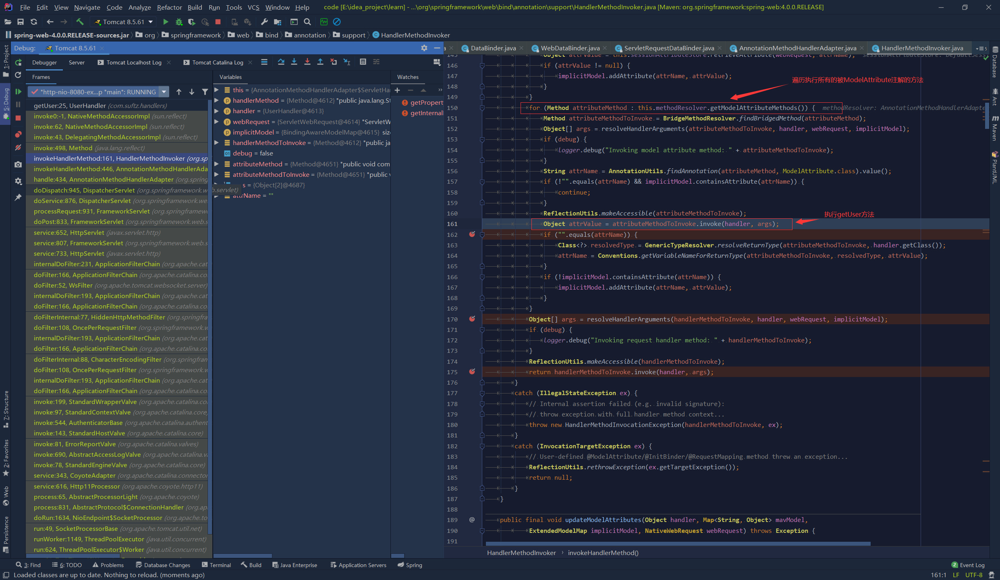
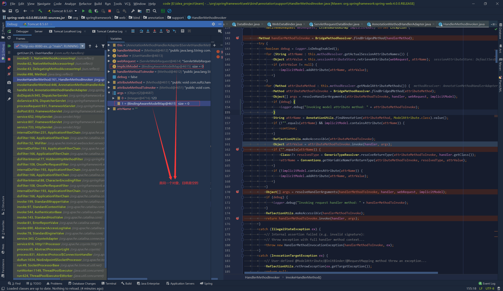
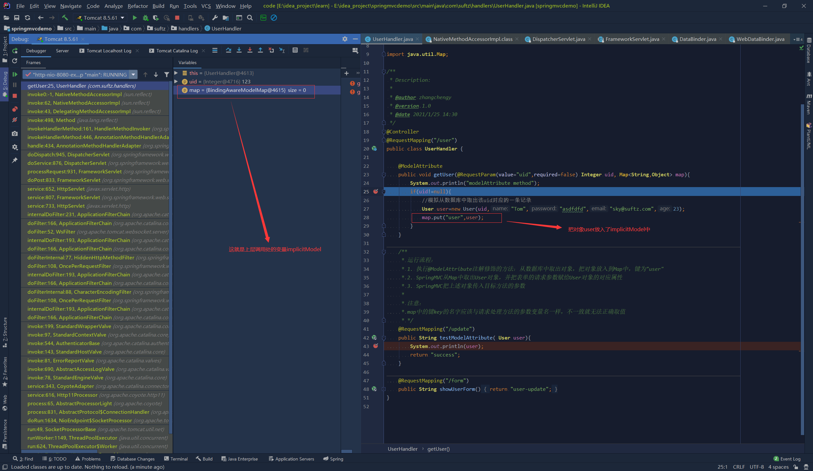


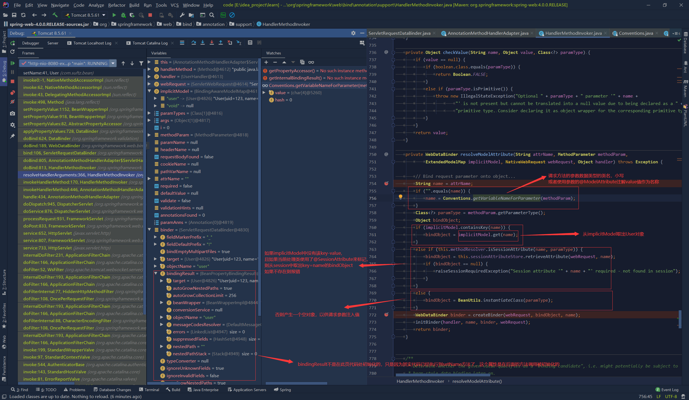
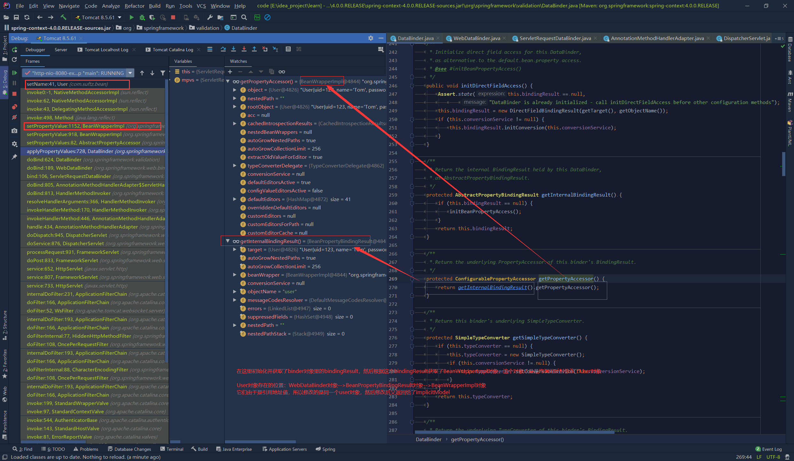

> 修改后的User对象保存到implicitModel中后，还会保存到request中
> 如果使用了
> `<mvc:default-servlet-handler></mvc:default-servlet-handler>`
`<mvc:annotation-driven></mvc:annotation-driven>`
流程可能会不太一样，但大体流程相似
> 这是基于springmvc4的代码，springmvc5在这片代码上处理不同

* 从上面的流程可知：可以在处理方法上添加注解

```java
 @RequestMapping("/update")
 public String testModelAttribute(@ModelAttribute(value="user") User user){
     System.out.println(user);
     return "success";
 }
```

* 如果请求方法上没有使用注解，且又没有一个方法被注解@ModelAttribute标识，则进入到了SessionAttributes逻辑，当session域也没有保存值，则会报错
即以下代码会报错：

    ```java
    package com.suftz.handlers;

    import com.suftz.bean.User;
    import org.springframework.stereotype.Controller;
    import org.springframework.web.bind.annotation.ModelAttribute;
    import org.springframework.web.bind.annotation.RequestMapping;
    import org.springframework.web.bind.annotation.RequestParam;
    import org.springframework.web.bind.annotation.SessionAttributes;

    import java.util.Map;


    @Controller
    @RequestMapping("/user")
    @SessionAttributes(value = "user")
    public class UserHandler {
        //提交表单后会报错，这个请求
        @RequestMapping("/update")
        public String testModelAttribute( User user){
            System.out.println(user);
            return "success";
        }
        //此请求不会报错，因为没有任何参数，不需要将请求参数注入到对象中
        @RequestMapping("/form")
        public String showUserForm(){
            return "user-update";
        }
    }
    ```

### 视图和视图解析器

1.**ModelAndView**

可以看到，无论请求的处理方法执行后返回的是String,还是ModelAndView，View还是void，都会跟着其他请求信息一起封装到ModelAndView中

2.**视图和视图解析器**

* 请求处理方法执行完成后，最终返回一个 ModelAndView对象。对于那些返回 String，View 或 ModeMap 等类型的处理方法，Spring MVC 也会在内部将它们装配成一个ModelAndView 对象，它包含了逻辑名和模型对象的视图
* Spring MVC 借助视图解析器（ViewResolver）得到最终的视图对象（View），最终的视图可以是 JSP ，也可能是Excel、JFreeChart 等各种表现形式的视图
* 对于最终究竟采取何种视图对象对模型数据进行渲染，处理器并不关心，处理器工作重点聚焦在生产模型数据的工作上，从而实现 MVC 的充分解耦

3.**视图**

* 视图的作用是渲染模型数据，将模型里的数据以某种形式呈现给客户。
* 为了实现视图模型和具体实现技术的解耦，Spring 在org.springframework.web.servlet 包中定义了一个高度抽象的 View接口
* 视图对象由视图解析器负责实例化。由于视图是无状态的，所以他们不会有线程安全的问题
* 视图的实现类有：//todo
  1. URL资源视图InternalResourceView,JstlView
  2. 文档视图AbstractExcelView,AbstractPdfView
  3. 报表视图ConfigurableJsperReportsView,JasperReportsCsvView...
  4. JSON视图MappingJacksonJsonView

4.**视图解析器**

* SpringMVC 为逻辑视图名的解析提供了不同的策略，可以在 Spring WEB 上下文中配置一种或多种解析策略，并指定他们之间的先后顺序。每一种映射策略对应一个具体的视图解析器实现类。
* 视图解析器的作用比较单一：将逻辑视图解析为一个具体的视图对象。
* 所有的视图解析器都必须实现 ViewResolver 接口：`View resolveViewName(String,Locale)`
* 常用的视图解析器实现类：//todo
  1. 解析为bean的名字：**beanNameViewResolver**
  2. 解析为URL文件：**InternalResourceViewResolver**,JasperReportsViewResolver
  3. 模板文件视图：FreeMarkerViewResolver,VelocityViewResolver,VelocityLayoutViewResolver
* 程序员可以选择一种视图解析器或混用多种视图解析器
* 每个视图解析器都实现了 Ordered 接口并开放出一个 order 属性，可以通过 order 属性指定解析器的优先顺序，order 越小优先级越高。
* SpringMVC 会按视图解析器顺序的优先顺序对逻辑视图名进行解析，直到解析成功并返回视图对象，否则将抛出 ServletException 异常

* JSP 是最常见的视图技术，可以使用InternalResourceViewResolver 作为视图解析器
往往是这样在spring配置文件中设置：
* 若项目中使用了 JSTL，则 SpringMVC 会自动把视图由InternalResourceView 转为 JstlView
* 若使用 JSTL 的 fmt 标签则需要在 SpringMVC 的配置文件中配置国际
化资源文件
* 若希望直接响应通过 SpringMVC 渲染的页面，可以使用 `mvc:viewcontroller` 标签实现

```xml
<bean id="viewResolver" class="org.springframework.web.servlet.view.InternalResourceViewResolver">
     <property name="prefix" value="/WEB-INF/jsp/"/>
     <property name="suffix" value=".jsp"/>
</bean>
```

5.**Excel视图**

* 若希望使用 Excel 展示数据列表，仅需要扩展SpringMVC 提供的 AbstractExcelView 或AbstractJExcel View 即可。实现 buildExcelDocument()方法，在方法中使用模型数据对象构建 Excel 文档就可以了。
* AbstractExcelView 基于 POI API，而AbstractJExcelView 是基于 JExcelAPI 的。
* 视图对象需要配置 IOC 容器中的一个 Bean，使用BeanNameViewResolver 作为视图解析器即可
* 若希望直接在浏览器中直接下载 Excel 文档，则可以设置响应头 Content-Disposition 的值为attachment;filename=xxx.xls

#### 视图源码分析图解

WebAndView,
View----->InternalResourceView
ViewResolver------>InternalResourceViewResolver

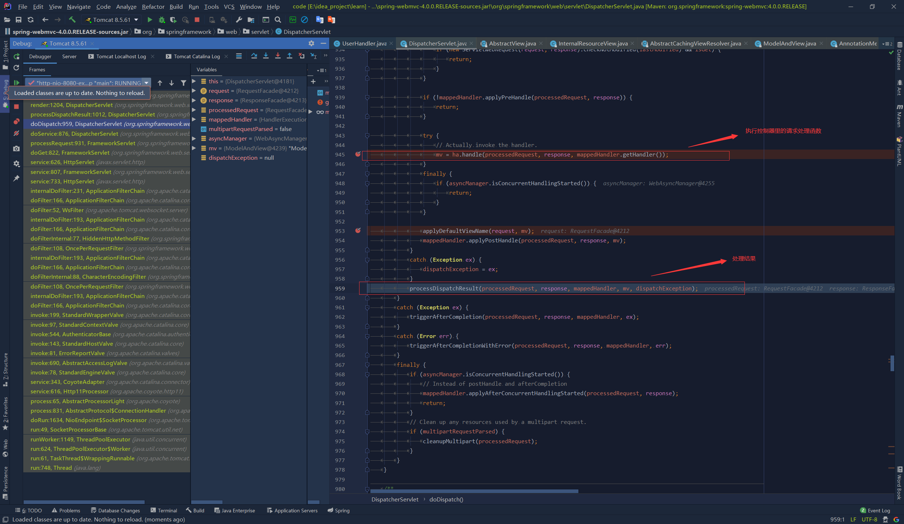


#### 重定向和直接转发

* 之前转发需要使用handler来处理，其实可以直接在配置文件中配置url请求与转发的地址

```xml
<!--配置后，在地址栏直接输入/工程名/success，就能访问到/WEB-INF/views/success.jsp, 但这样配置之后，通过注解打开的url就都不能识别了-->
<mvc:view-controller path="/success" view-name="success" />
<!--开启后，注解的url和上面的url都能使用了-->
<mvc:annotation-driven></mvc:annotation-driven>
```

* 一般情况下，控制器方法返回字符串类型的值会被当成逻辑视图名处理
* 如果返回的字符串中带 forward: 或 redirect: 前缀时，SpringMVC 会对他们进行特殊处理：将 forward: 和redirect: 当成指示符，其后的字符串作为 URL 来处理
  * redirect:success.jsp：会完成一个到 success.jsp 的重定向的操作
  * forward:success.jsp：会完成一个到 success.jsp 的转发操作
* 也可以重新转发或重定向到其他的urlMapping中

#### 自定义视图

* 步骤：

1. 实现View接口

   ```java
   package com.suftz.handlers;

   import org.springframework.stereotype.Component;
   import org.springframework.web.servlet.View;

   import javax.servlet.http.HttpServletRequest;
   import javax.servlet.http.HttpServletResponse;
   import java.util.Map;
    //不设置value值无法使用自定义的视图，但是一般是不需要设置的，默认就是类名小写
   @Component(value="helloView")
   public class HelloViev implements View {
      @Override
      public String getContentType() {
          return "text/html";
      }

      @Override
      public void render(Map<String, ?> model, HttpServletRequest request, HttpServletResponse response) throws Exception {
          response.getWriter().write("hello,this is my defined view");
      }
   }
   ```

2. 在springmvc配置文件中配置自定义的视图解析器

   ```xml
   <?xml version="1.0" encoding="UTF-8"?>
   <beans xmlns="http://www.springframework.org/schema/beans"
          xmlns:xsi="http://www.w3.org/2001/XMLSchema-instance"
          xmlns:context="http://www.springframework.org/schema/context"
          xmlns:mvc="http://www.springframework.org/schema/mvc"
          xsi:schemaLocation="http://www.springframework.org/schema/beans http://www.springframework.org/schema/beans/spring-beans.xsd
           http://www.springframework.org/schema/context http://www.springframework.org/schema/context/spring-context-4.0.xsd
           http://www.springframework.org/schema/mvc http://www.springframework.org/schema/mvc/spring-mvc-4.0.xsd">

       <!-- 配置自动扫描的包 -->
       <context:component-scan base-package="com.suftz"></context:component-scan>

       <!--配置视图解析器：如何把handler方法返回值解析为实际的物理视图-->
       <bean class="org.springframework.web.servlet.view.InternalResourceViewResolver">
           <property name="prefix" value="/WEB-INF/views/"></property>
           <property name="suffix" value=".jsp"></property>
       </bean>

       <!--配置视图BeanNameViewResolver解析器：使用视图的名字来解析视图-->
       <bean class="org.springframework.web.servlet.view.BeanNameViewResolver">
           <!--使用order属性来定义视图的优先级，order值越小优先级越高  ，默认的InternalResourceViewResolver的order值是Integer.Max-->
           <property name="order" value="100"></property>
       </bean>
   <!--    <mvc:default-servlet-handler></mvc:default-servlet-handler>-->

       <!--配置后，在地址栏直接输入/工程名/success，就能访问到/WEB-INF/views/success.jsp, 但这样配置之后，通过注解打开的url就都不能识别了-->
       <mvc:view-controller path="/success" view-name="success" />
       <!--开启后，注解的url和上面的url都能使用了-->
       <mvc:annotation-driven></mvc:annotation-driven>
   </beans>
   ```

3. 编写测试请求处理方法

   ```java
   package com.suftz.handlers;

   import org.springframework.stereotype.Controller;
   import org.springframework.web.bind.annotation.*;
   import org.springframework.web.servlet.ModelAndView;

   import java.util.Arrays;
   import java.util.Date;
   import java.util.Map;

   @Controller
   @SessionAttributes(value="names",types = String.class)
   public class HelloWorld {

       @RequestMapping("/myview")
       public String testView(){
           System.out.println("testView");
           return "helloView";
       }
   }
   ```

> 这里无法进入到bean的视图解析器里去，就好像配置文件没有起作用一样
> 解决：在自定义的视图类的注解上设置value来标记bean的id值

//静态属性autowired注入的时机

### SpringMVC处理表单CRUD

* 使用springmvc完成一组表单提交，涉及到数据的增删改查，这里需要两个页面：
  1. 一个是list.jsp，用来显示数据列表，可以直接在数据列表的"操作栏列"进行数据的删除，以及点击修改按钮，页面上还有一个用于添加数据的表单
  2. 一个是edit.jsp，当在数据列表一行数据上点击修改时，则会进入到该页面，回显刚刚点击的数据到这个页面的表单上，用于对数据修改后进行提交
* 添加数据，删除数据，以及在数据修改页面提交数据后都会进入到list.jsp页面打印当前所有数据

* 步骤如下：

1. web.xml配置如下：这里有进行中文转码的配置以及spring的相关配置(算是重复上面的知识)

   ```xml
   <?xml version="1.0" encoding="UTF-8"?>
   <web-app xmlns="http://xmlns.jcp.org/xml/ns/javaee"
            xmlns:xsi="http://www.w3.org/2001/XMLSchema-instance"
            xsi:schemaLocation="http://xmlns.jcp.org/xml/ns/javaee http://xmlns.jcp.org/xml/ns/javaee/web-app_4_0.xsd"
            version="4.0">
      <!--中文乱码问题解决-->
       <filter>
           <filter-name>characterEncodingFilter</filter-name>
           <filter-class>org.springframework.web.filter.CharacterEncodingFilter</filter-class>
           <init-param>
               <param-name>encoding</param-name>
               <param-value>UTF-8</param-value>
           </init-param>
           <init-param>
               <param-name>forceEncoding</param-name>
               <param-value>true</param-value>
           </init-param>
       </filter>
       <filter-mapping>
           <filter-name>characterEncodingFilter</filter-name>
           <url-pattern>/*</url-pattern>
       </filter-mapping>

       <!--将post请求转换成delete请求或者put请求-->
       <filter>
           <filter-name>HiddenHttpMethodFilter</filter-name>
           <filter-class>org.springframework.web.filter.HiddenHttpMethodFilter</filter-class>
       </filter>
       <filter-mapping>
           <filter-name>HiddenHttpMethodFilter</filter-name>
           <url-pattern>/*</url-pattern>
       </filter-mapping>

       <servlet>
           <servlet-name>springDispatcherServlet</servlet-name>
           <servlet-class>org.springframework.web.servlet.DispatcherServlet</servlet-class>
           <init-param>
               <param-name>contextConfigLocation</param-name>
               <param-value>classpath:springmvc.xml</param-value>
           </init-param>
           <!--实际上也可以不通过contextConfigLocation来配置SpringMVC的配置文件，
               而使用默认的配置文件：/WEB-INF/<servlet-name>-servlet.xml
               即：在WEB-INF目录下放springDispatcherServlet-servlet.xml文件
           -->
           <load-on-startup>1</load-on-startup>
       </servlet>

       <servlet-mapping>
           <servlet-name>springDispatcherServlet</servlet-name>
           <url-pattern>/</url-pattern>
       </servlet-mapping>

   </web-app>
   ```

2. springmvc.xml配置文件如下：

   ```xml
   <?xml version="1.0" encoding="UTF-8"?>
   <beans xmlns="http://www.springframework.org/schema/beans"
          xmlns:xsi="http://www.w3.org/2001/XMLSchema-instance"
          xmlns:context="http://www.springframework.org/schema/context"
          xmlns:mvc="http://www.springframework.org/schema/mvc"
          xsi:schemaLocation="http://www.springframework.org/schema/beans http://www.springframework.org/schema/beans/spring-beans.xsd
           http://www.springframework.org/schema/context http://www.springframework.org/schema/context/spring-context-4.0.xsd
           http://www.springframework.org/schema/mvc http://www.springframework.org/schema/mvc/spring-mvc-4.0.xsd">

       <!-- 配置自动扫描的包 -->
       <context:component-scan base-package="com.suftz"/>

       <!--配置视图解析器：如何把handler方法返回值解析为实际的物理视图-->
       <bean class="org.springframework.web.servlet.view.InternalResourceViewResolver">
           <property name="prefix" value="/WEB-INF/views/"></property>
           <property name="suffix" value=".jsp"></property>
       </bean>

       <mvc:annotation-driven conversion-service="conversionService"></mvc:annotation-driven>
   </beans>
   ```

3. Department类

   ```java
   package com.suftz.bean;

   public class Department {
       private String name;
       private Integer id;

       public Department() {
       }

       public Department(String name, Integer id) {
           this.name = name;
           this.id = id;
       }

       public String getName() {
           return name;
       }

       public void setName(String name) {
           this.name = name;
       }

       public Integer getId() {
           return id;
       }

       public void setId(Integer id) {
           this.id = id;
       }

       @Override
       public String toString() {
           return "Department{" +
                   "name='" + name + '\'' +
                   ", id=" + id +
                   '}';
       }
   }
   ```

4. Employee类

   ```java
   package com.suftz.bean;

   public class Employee {
       private Integer id;
       private String name;
       private Integer age;
       private String email;
       private String address;
       private Department dpt;


       public Employee() {
       }

       public Employee(Integer id, String name, Integer age, String email, String address, Department dpt) {
           this.id = id;
           this.name = name;
           this.age = age;
           this.email = email;
           this.address = address;
           this.dpt = dpt;
       }

       public Integer getId() {
           return id;
       }

       public void setId(Integer id) {
           this.id = id;
       }

       public String getName() {
           return name;
       }

       public void setName(String name) {
           this.name = name;
       }

       public Integer getAge() {
           return age;
       }

       public void setAge(Integer age) {
           this.age = age;
       }

       public String getEmail() {
           return email;
       }

       public void setEmail(String email) {
           this.email = email;
       }

       public String getAddress() {
           return address;
       }

       public void setAddress(String address) {
           this.address = address;
       }

       public Department getDpt() {
           return dpt;
       }

       public void setDpt(Department dpt) {
           this.dpt = dpt;
       }

       @Override
       public String toString() {
           return "Employee{" +
                   "id=" + id +
                   ", name='" + name + '\'' +
                   ", age=" + age +
                   ", email='" + email + '\'' +
                   ", address='" + address + '\'' +
                   ", dpt=" + dpt +
                   '}';
       }
   }
   ```

5. DepartmentDao类

   ```java
   package com.suftz.dao;

   import com.suftz.bean.Department;
   import org.springframework.stereotype.Repository;

   import java.util.*;

   @Repository
   public class DepartmentDao {


       private static Map<Integer, Department> dpts = null;
       static {
           dpts = new HashMap<>();
           dpts.put(1001, new Department("1001-AA", 1001));
           dpts.put(1002, new Department("1002-BB", 1002));
           dpts.put(1003, new Department("1003-CC", 1003));
           dpts.put(1004, new Department("1004-DD", 1004));
           dpts.put(1005, new Department("1005-EE", 1005));
           dpts.put(1006, new Department("1006-FF", 1006));
       }

       public Department getDepartment(Integer id){
           return dpts.get(id);
       }

       public Collection<Department> getDepartments(){
           return new ArrayList(dpts.values());
       }
   }
   ```

6. EmployeeDao类

   ```java
   package com.suftz.dao;

   import com.suftz.bean.Department;
   import com.suftz.bean.Employee;
   import org.springframework.beans.factory.annotation.Autowired;
   import org.springframework.stereotype.Repository;

   import java.util.ArrayList;
   import java.util.HashMap;
   import java.util.List;
   import java.util.Map;

   @Repository
   public class EmployeeDao {

       @Autowired
       private DepartmentDao departmentDao;

       private static Map<Integer, Employee> emps=null;
       private static Integer initId=108;

       static {
           emps=new HashMap<>();
           emps.put(101,new Employee(101,"刘备",45,"liubei@suftz.com","益州", new Department("1001-AA", 1001)));
           emps.put(102,new Employee(102,"诸葛亮",30,"zhuge@suftz.com","古隆中",new Department("1002-BB", 1002)));
           emps.put(103,new Employee(103,"关羽",29,"guanyu@suftz.com","运城",new Department("1003-CC", 1003)));
           emps.put(104,new Employee(104,"张飞",26,"zhangfei@suftz.com","益州",new Department("1004-DD", 1004)));
           emps.put(105,new Employee(105,"赵云",25,"zhaoyun@suftz.com","常山",new Department("1005-EE", 1005)));
           emps.put(106,new Employee(106,"马超",24,"machao@suftz.com","西凉",new Department("1006-FF", 1006)));
           emps.put(107,new Employee(107,"黄忠",60,"huangzhong@suftz.com","长沙",new Department("1002-BB", 1002)));
       }

       public void save(Employee employee){
           if(employee.getId()==null){
               employee.setId(initId++);
           }
           employee.setDpt(departmentDao.getDepartment(employee.getDpt().getId()));
           emps.put(employee.getId(),employee);
       }

       public List<Employee> getEmployees(){
           return new ArrayList(emps.values());
       }

       public Employee get(Integer id){
           return emps.get(id);
       }

       public void delete(Integer id){
           emps.remove(id);
       };

       public DepartmentDao getDepartmentDao() {
           return departmentDao;
       }
   }
   ```

7. EmployeeHandler类

   ```java
   package com.suftz.handlers;

   import com.suftz.bean.Employee;
   import com.suftz.dao.DepartmentDao;
   import com.suftz.dao.EmployeeDao;
   import org.springframework.beans.factory.annotation.Autowired;
   import org.springframework.stereotype.Controller;
   import org.springframework.web.bind.annotation.RequestMapping;
   import org.springframework.web.bind.annotation.RequestParam;

   import java.util.Map;

   @Controller
   @RequestMapping(value="emp")
   public class EmployeeHandler {

       @Autowired
       DepartmentDao departmentDao;

       @Autowired
       EmployeeDao employeeDao;

       @RequestMapping(value="list")
       public String employeeList(Map<String,Object> map){
           map.put("departments",departmentDao.getDepartments());
           map.put("employees",employeeDao.getEmployees());
           map.put("employee",new Employee());
           return "list";
       }

       @RequestMapping(value="save")
       public String employeeSave(Employee employee){
           employeeDao.save(employee);
           return "redirect:/emp/list";
       }

       @RequestMapping(value="delete")
       public String employeeDelete(Integer id){
           employeeDao.delete(id);
           return "redirect:/emp/list";
       }

       @RequestMapping(value="edit")
       public String employeeEdit(Integer id,Map<String,Object> map){
           map.put("departments",departmentDao.getDepartments());
           Employee employee= employeeDao.get(id);
           if(employee==null){
               employee=new Employee();
               employee.setId(id);
           }
           map.put("employee",employee);
           return "edit";
       }
   }
   ```

8. list.jsp页面如下,位置是/WEB-INF/views/list.jsp：

   ```xml
   <%@ page contentType="text/html;charset=UTF-8" language="java" %>
   <%@ taglib prefix="c" uri="http://java.sun.com/jsp/jstl/core" %>
   <%@ taglib prefix="form" uri="http://www.springframework.org/tags/form" %>
   <html>
   <head>
       <base href="<%=request.getContextPath()%>/">
       <title>员工列表</title>
   </head>
   <body>
   <form:form action="emp/save" method="post" modelAttribute="employee">
   姓名：<form:input path="name" /><br>
   年龄：<form:input path="age" /><br>
   邮箱：<form:input path="email" /><br>
   地址：<form:input path="address" /><br>
   部门：<form:select path="dpt.id" items="${departments}" itemLabel="name" itemValue="id"></form:select><br>
   <input type="submit" value="新增">
   </form:form>
   <br>

   <c:if test="${requestScope.employees!=null&&requestScope.employees.size()!=0}">
   <table cellspacing="0" cellpadding="4" border="1px solid #eeeeee">
       <tr><td>id</td><td>姓名</td><td>年龄</td><td>邮箱</td><td>地址</td><td>部门</td><td colspan="2">操作</td></tr>
       <c:forEach items="${requestScope.employees}" var="employee">
           <tr>
               <td>${employee.id}</td>
               <td>${employee.name}</td>
               <td>${employee.age}</td>
               <td>${employee.email}</td>
               <td>${employee.address}</td>
               <td>${employee.dpt}</td>
               <td><a href="emp/delete?id=${employee.id}" >删除</a></td>
               <td><a href="emp/edit?id=${employee.id}" >修改</a></td>

           </tr>
       </c:forEach>
   </table>
   </c:if>
   </body>
   </html>
   ```

9. edit.jsp页面如下,位置是/WEB-INF/views/edit.jsp：

   ```xml
   <%@ page contentType="text/html;charset=UTF-8" language="java" %>
   <%@ taglib prefix="c" uri="http://java.sun.com/jsp/jstl/core" %>
   <%@ taglib prefix="form" uri="http://www.springframework.org/tags/form" %>
   <html>
   <head>
       <base href="<%=request.getContextPath()%>/">
       <title>信息修改</title>
   </head>
   <body>
   <form:form action="emp/save" method="post" modelAttribute="employee">
   <form:hidden path="id"/>
   姓名：<form:input path="name" /><br>
   年龄：<form:input path="age" /><br>
   邮箱：<form:input path="email" /><br>
   地址：<form:input path="address" /><br>
   部门：<form:select path="dpt.id" items="${departments}" itemLabel="name" itemValue="id"></form:select><br>
   <input type="submit" value="修改">
   </form:form>
   <br>
   ```

* 页面在浏览器上如下：

  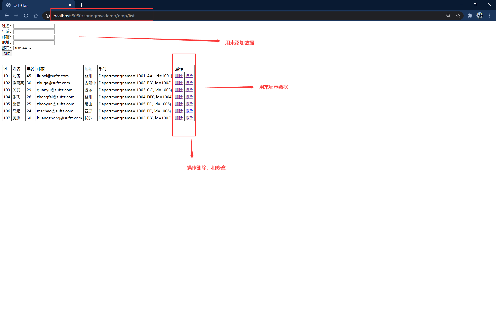
  

### 数据绑定流程

1. Spring MVC 主框架将 ServletRequest 对象及目标方法的入参实例传递给 WebDataBinderFactory 实例，以创建 DataBinder 实例对象
2. DataBinder 调用装配在 Spring MVC 上下文中的ConversionService 组件进行数据类型转换、数据格式化工作。将 Servlet 中的请求信息填充到入参对象中
3. 调用 Validator 组件对已经绑定了请求消息的入参对象进行数据合法性校验，并最终生成数据绑定结果BindingData 对象
4. Spring MVC 抽取 BindingResult 中的入参对象和校验错误对象，将它们赋给处理方法的响应入参

* 数据绑定流程
  Spring MVC 通过反射机制对目标处理方法进行解析，将请求消息绑定到处理方法的入参中。数据绑定的核心部件是DataBinder，运行机制如下：
  
   通过源代码来查看：
   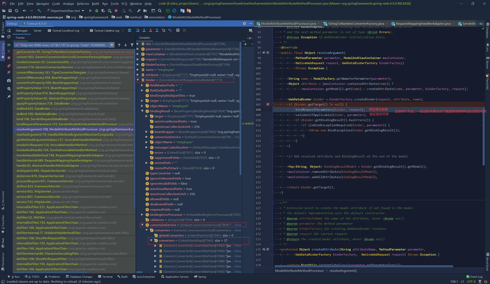
   注意查看binder的三个属性：bindingResult,validators,conversionService

* springmvc内置转换器
  

### 自定义类型转换器

* ConversionService 是 Spring 类型转换体系的核心接口。
* 可以利用 ConversionServiceFactoryBean 在 Spring 的 IOC容器中定义一个 ConversionService. Spring 将自动识别出IOC 容器中的 ConversionService，并在 Bean 属性配置及Spring MVC 处理方法入参绑定等场合使用它进行数据的转换
* 可通过 ConversionServiceFactoryBean 的 converters 属性注册自定义的类型转换器

> 自定义类型转换器，根据自己的需要设定转换规则,比如可以将特殊格式的请求参数字符串转换成特殊的对象

#### Spring 支持的转换器

* Spring 定义了 3 种类型的转换器接口，实现任意一个转换器接口都可以作为自定义转换器注册到`ConversionServiceFactroyBean` 中：
  * `Converter<S,T>`：将 S 类型对象转为 T 类型对象
  * `ConverterFactory`：将相同系列多个 “同质” Converter 封装在一起。如果希望将一种类型的对象转换为另一种类型及其子类的对象（例如将 String 转换为 Number 及 Number 子类（Integer、Long、Double 等）对象）可使用该转换器工厂类
  * GenericConverter：会根据源类对象及目标类对象所在的宿主类中的上下文信息进行类型转换

#### 自定义转换器示例：

示例：将字符串`199-孙权-23-sunquan@suftz.com-苏州-1001`转换成对象`Employee(Integer id, String name, Integer age, String email, String address, Department dpt)`

1. 编写自定义转换器类，实现Converter接口

   ```java
   package com.suftz.bean;


   import org.springframework.core.convert.converter.Converter;
   import org.springframework.stereotype.Component;

   @Component
   public class EmployeeConverter implements Converter<String,Employee> {

       @Override
       public Employee convert(String source) {
   //        199-孙权-23-sunquan@suftz.com-苏州-1001
           String [] infos=source.split("-");
           Employee employee=new Employee();
           employee.setId(Integer.valueOf(infos[0]));
           employee.setName(infos[1]);
           employee.setAge(Integer.valueOf(infos[2]));
           employee.setEmail(infos[3]);
           employee.setAddress(infos[4]);
           Department department=new Department();
           department.setId(Integer.valueOf(infos[5]));
           employee.setDpt(department);
           return employee;
       }
   }
   ```

2. 在配置文件中将自定义转换器加入到conversionService中

   ```xml
   <?xml version="1.0" encoding="UTF-8"?>
   <beans xmlns="http://www.springframework.org/schema/beans"
          xmlns:xsi="http://www.w3.org/2001/XMLSchema-instance"
          xmlns:context="http://www.springframework.org/schema/context"
          xmlns:mvc="http://www.springframework.org/schema/mvc"
          xsi:schemaLocation="http://www.springframework.org/schema/beans http://www.springframework.org/schema/beans/spring-beans.xsd
           http://www.springframework.org/schema/context http://www.springframework.org/schema/context/spring-context-4.0.xsd
           http://www.springframework.org/schema/mvc http://www.springframework.org/schema/mvc/spring-mvc-4.0.xsd">

       <!-- 配置自动扫描的包 -->
       <context:component-scan base-package="com.suftz"/>

       <!--配置视图解析器：如何把handler方法返回值解析为实际的物理视图-->
       <bean class="org.springframework.web.servlet.view.InternalResourceViewResolver">
           <property name="prefix" value="/WEB-INF/views/"></property>
           <property name="suffix" value=".jsp"></property>
       </bean>

       <!--配置视图BeanNameViewResolver解析器：使用视图的名字来解析视图-->
       <bean class="org.springframework.web.servlet.view.BeanNameViewResolver">
           <!--使用order属性来定义视图的优先级，order值越小优先级越高  ，默认的InternalResourceViewResolver的order值是Integer.Max-->
           <property name="order" value="100"></property>
       </bean>

       <!--处理静态资源，这样配置后，静态资源可以通过url来get-->
       <mvc:default-servlet-handler></mvc:default-servlet-handler>

       <!--配置后，在地址栏直接输入/工程名/success，就能访问到/WEB-INF/views/success.jsp, 但这样配置之后，通过注解打开的url就都不能识别了-->
       <mvc:view-controller path="/success" view-name="success" />
       <!--开启后，注解的url和上面的url都能使用了-->
       <mvc:annotation-driven conversion-service="conversionService"></mvc:annotation-driven>
       <!--注意：自定义转换器定义好后，还要在上面的配置中设置属性-->

       <!--配置自定义转换器-->
       <bean id="conversionService" class="org.springframework.context.support.ConversionServiceFactoryBean">
           <property name="converters" >
               <set>
                   <ref bean="employeeConverter"/>
               </set>
           </property>
       </bean>
   </beans>
   ```

3. 编写converter.jsp页面进行测试，提交的请求地址仍然是"emp/save"

   ```xml
   <%@ page contentType="text/html;charset=UTF-8" language="java" %>
   <%@ taglib prefix="c" uri="http://java.sun.com/jsp/jstl/core" %>
   <%@ taglib prefix="form" uri="http://www.springframework.org/tags/form" %>
   <html>
   <head>
       <base href="<%=request.getContextPath()%>/">
       <title>员工列表</title>
   </head>
   <body>
   <form action="emp/save" method="post">
   员工信息：<input name="employee" value="199-孙权-23-sunquan@suftz.com-苏州-1001" /><br>
   <input type="submit" value="新增">
   </form>
   <br>
   </body>
   </html>
   ```


### annnotation-driven配置

* `<mvc:annotation-driven />` 会自动注册RequestMappingHandlerMapping、RequestMappingHandlerAdapter 与ExceptionHandlerExceptionResolver 三个bean。
* 还将提供以下支持：
* 支持使用 ConversionService 实例对表单参数进行类型转换
* 支持使用 @NumberFormat annotation、@DateTimeFormat注解完成数据类型的格式化
* 支持使用 @Valid 注解对 JavaBean 实例进行 JSR 303 验证
* 支持使用 @RequestBody 和 @ResponseBody 注解


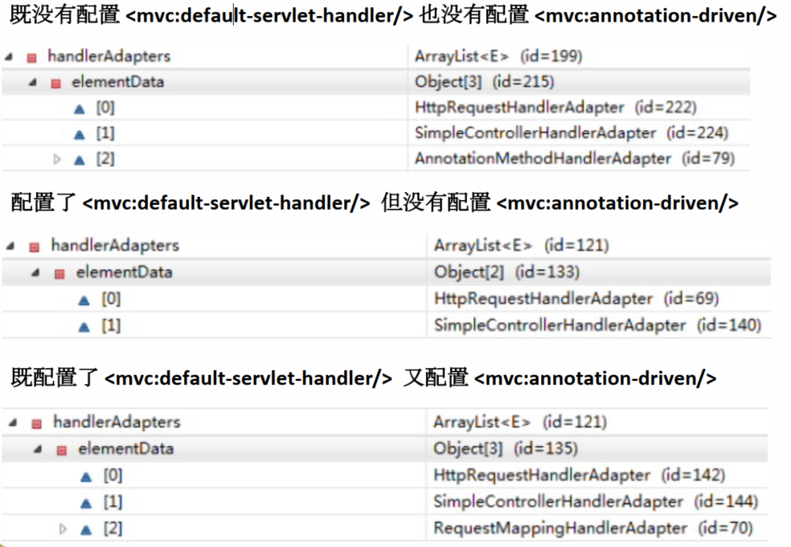

### 数据格式化

* 对属性对象的输入/输出进行格式化，从其本质上讲依然属于 “类型转换” 的范畴。
* Spring 在格式化模块中定义了一个实现ConversionService 接口的FormattingConversionService 实现类，该实现类扩展了 GenericConversionService，因此它既具有类型转换的功能，又具有格式化的功能
* FormattingConversionService 拥有一个FormattingConversionServiceFactroyBean 工厂类，后者用于在 Spring 上下文中构造前者

* FormattingConversionServiceFactroyBean 内部已经注册了 :
  * NumberFormatAnnotationFormatterFactroy：支持对数字类型的属性使用 @NumberFormat 注解
  * JodaDateTimeFormatAnnotationFormatterFactroy：支持对日期类型的属性使用 @DateTimeFormat 注解
* 装配了 FormattingConversionServiceFactroyBean 后，就可以在 Spring MVC 入参绑定及模型数据输出使用注解驱动了。`<mvc:annotation-driven/>` 默认创建的ConversionService 实例即为FormattingConversionServiceFactroyBean

1.**日期格式化**

* @DateTimeFormat 注解可对java.util.Date、java.util.Calendar、java.long.Long 时间类型进行标注：
  * pattern 属性：类型为字符串。指定解析/格式化字段数据的模式，如：”yyyy-MM-dd hh:mm:ss”
  * iso 属性：类型为 DateTimeFormat.ISO。指定解析/格式化字段数据的ISO模式，包括四种：ISO.NONE（不使用） -- 默认、ISO.DATE(yyyy-MM-dd) 、ISO.TIME(hh:mm:ss.SSSZ)、ISO.DATE_TIME(yyyy-MM-dd hh:mm:ss.SSSZ)
  * style 属性：字符串类型。通过样式指定日期时间的格式，由两位字符组成，第一位表示日期的格式，第二位表示时间的格式：S：短日期/时间格式、M：中日期/时间格式、L：长日期/时间格式、F：完整日期/时间格式、-：忽略日期或时间格式

2.**数值格式化**

* @NumberFormat 可对类似数字类型的属性进行标注，它拥有两个互斥的属性：
  * style：类型为 NumberFormat.Style。用于指定样式类型，包括三种：Style.NUMBER（正常数字类型）、Style.CURRENCY（货币类型）、 Style.PERCENT（百分数类型）
  * pattern：类型为 String，自定义样式，如patter="#,###"

### @InitBinder

* 由 @InitBinder 标识的方法，可以对 WebDataBinder 对象进行初始化。WebDataBinder 是 DataBinder 的子类，用于完成由表单字段到 JavaBean 属性的绑定
* @InitBinder方法不能有返回值，它必须声明为void。
* @InitBinder方法的参数通常是是 WebDataBinder

```java
@InitBinder
public void initBinder(WebDataBinder dataBinder){
    dataBinder.setDisallowedFields("name");
}
```

### 数据校验

* 数据校验有三个问题需要考虑：
  1. 如何校验
  2. 验证出错转向哪个页面
  3. 错误信息如何显示，如何把错误信息进行国际化

#### JSR 303

* JSR 303 是 Java 为 Bean 数据合法性校验提供的标准框架，它已经包含在 JavaEE 6.0 中 .
* JSR 303 通过在 Bean 属性上标注类似于 @NotNull、@Max等标准的注解指定校验规则，并通过标准的验证接口对 Bean进行验证

一、**基本校验规则**

1. 空检查
   @Null 验证对象是否为null
   @NotNull 验证对象是否不为null, 无法查检长度为0的字符串
   @NotBlank 检查约束字符串是不是Null还有被Trim的长度是否大于0,只对字符串,且会去掉前后空格.
   @NotEmpty 检查约束元素是否为NULL或者是EMPTY.
2. Booelan检查
   @AssertTrue 验证 Boolean 对象是否为 true
   @AssertFalse 验证 Boolean 对象是否为 false
3. 长度检查
   @Size(min=, max=) 验证对象(Array,Collection,Map,String)长度是否在给定的范围之内
   @Length(min=, max=) Validates that the annotated string is between min and max included.
4. 日期检查
   @Past 验证 Date 和 Calendar 对象是否在当前时间之前,验证成立的话被注释的元素一定是一个过去的日期
   @Future 验证 Date 和 Calendar 对象是否在当前时间之后 ,验证成立的话被注释的元素一定是一个将来的日期
   @Pattern 验证 String 对象是否符合正则表达式的规则,被注释的元素符合制定的正则表达式,regexp:正则表达式 flags: 指定 Pattern.Flag 的数组,表示正则表达式的相关选项。
5. 数值检查
   建议使用在Stirng,Integer类型,不建议使用在int类型上,因为表单值为“”时无法转换为int,但可以转换为Stirng为”“,Integer为null
   @Min 验证 Number 和 String 对象是否大等于指定的值
   @Max 验证 Number 和 String 对象是否小等于指定的值
   @DecimalMax 被标注的值必须不大于约束中指定的最大值. 这个约束的参数是一个通过BigDecimal定义的最大值的字符串表示.小数存在精度
   @DecimalMin 被标注的值必须不小于约束中指定的最小值. 这个约束的参数是一个通过BigDecimal定义的最小值的字符串表示.小数存在精度
   @Digits 验证 Number 和 String 的构成是否合法
   @Digits(integer=,fraction=) 验证字符串是否是符合指定格式的数字,interger指定整数精度,fraction指定小数精度。
   @Range(min=, max=) 被指定的元素必须在合适的范围内
   @Range(min=10000,max=50000,message=”range.bean.wage”)
   @Valid 递归的对关联对象进行校验, 如果关联对象是个集合或者数组,那么对其中的元素进行递归校验,如果是一个map,则对其中的值部分进行校验.(是否进行递归验证)
   @CreditCardNumber信用卡验证
   @Email 验证是否是邮件地址,如果为null,不进行验证,算通过验证。
   @ScriptAssert(lang= ,script=, alias=)
   @URL(protocol=,host=, port=,regexp=, flags=)

#### Hibernate Validator 扩展注解

* Hibernate Validator 是 JSR 303 的一个参考实现，除支持所有标准的校验注解外，它还支持以下的扩展注解

|注解|使用|
|:----|:----|
|@NotNull|被注释的元素（任何元素）必须不为 null, 集合为空也是可以的。没啥实际意义|
|@NotEmpty|用来校验字符串、集合、map、数组不能为null或空<br>（字符串传入空格也不可以）（集合需至少包含一个元素）|
|@NotBlank|只用来校验字符串不能为null，空格也是被允许的 。校验字符串推荐使用@NotEmpty|
|@Size(max=, min=)|指定的字符串、集合、map、数组长度必须在指定的max和min内<br>允许元素为null，字符串允许为空格|
|@Length(min=,max=)|只用来校验字符串，长度必须在指定的max和min内 允许元素为null|
|@Range(min=,max=)|用来校验数字或字符串的大小必须在指定的min和max内<br>字符串会转成数字进行比较，如果不是数字校验不通过<br>允许元素为null|
|@Min()|校验数字（包括integer short long int 等）的最小值，不支持小数即double和float<br>允许元素为null|
|@Max()|校验数字（包括integer short long int 等）的最小值，不支持小数即double和float<br>允许元素为null|
|@Pattern()|正则表达式匹配，可用来校验年月日格式，是否包含特殊字符（`regexp = "^[a-zA-Z0-9\u4e00-\u9fa5]"`)

#### SpringMVC数据校验

* Spring 4.0 拥有自己独立的数据校验框架，同时支持 JSR303 标准的校验框架。
* Spring 在进行数据绑定时，可同时调用校验框架完成数据校验工作。在 Spring MVC 中，可直接通过注解驱动的方式进行数据校验
* Spring 的 LocalValidatorFactroyBean 既实现了 Spring 的Validator 接口，也实现了 JSR 303 的 Validator 接口。只要在 Spring 容器中定义了一个LocalValidatorFactoryBean，即可将其注入到需要数据校验的 Bean 中。
* Spring 本身并没有提供 JSR303 的实现，所以必须将JSR303 的实现者的 jar 包放到类路径下

* `<mvc:annotation-driven/>` 会默认装配好一个LocalValidatorFactoryBean，通过在处理方法的入参上标注 @valid 注解即可让 Spring MVC 在完成数据绑定后执行数据校验的工作
* 在已经标注了 JSR303 注解的表单/命令对象前标注一个@Valid，Spring MVC 框架在将请求参数绑定到该入参对象后，就会调用校验框架根据注解声明的校验规则实施校验
* Spring MVC 是通过对处理方法签名的规约来保存校验结果的：前一个表单/命令对象的校验结果保存到随后的入参中，这个保存校验结果的入参必须是 BindingResult 或Errors 类型，这两个类都位于org.springframework.validation 包中
* 需校验的 Bean 对象和其绑定结果对象或错误对象时成对出现的，它们之间不允许声明其他的入参
* Errors 接口提供了获取错误信息的方法，如 getErrorCount() 或getFieldErrors(String field)
* BindingResult 扩展了 Errors 接口

一、**在目标方法中获取校验结果**

* 在表单/命令对象类的属性中标注校验注解，在处理方法对应的入参前添加 @Valid，Spring MVC 就会实施校验并将校验结果保存在被校验入参对象之后的 BindingResult 或Errors 入参中。
* 常用方法：
  * `FieldError getFieldError(String field)`
  * `List<FieldError> getFieldErrors()`
  * `Object getFieldValue(String field)`
  * `Int getErrorCount()`

二、**在页面上显示错误**

* Spring MVC 除了会将表单/命令对象的校验结果保存到对应的 BindingResult 或 Errors 对象中外，还会将所有校验结果保存到 “隐含模型”
* 即使处理方法的签名中没有对应于表单/命令对象的结果入参，校验结果也会保存在 “隐含对象” 中。
* 隐含模型中的所有数据最终将通过 HttpServletRequest 的属性列表暴露给 JSP 视图对象，因此在 JSP 中可以获取错误信息
* 在 JSP 页面上可通过 `<form:errors path="userName">`显示错误消息

#### 提示信息国际化

* 每个属性在数据绑定和数据校验发生错误时，都会生成一个对应的 FieldError 对象。
* 当一个属性校验失败后，校验框架会为该属性生成 4 个消息代码，这些代码以校验注解类名为前缀，结合modleAttribute、属性名及属性类型名生成多个对应的消息代码：例如 User 类中的 password 属性标准了一个 @Pattern 注解，当该属性值不满足 @Pattern 所定义的规则时, 就会产生以下 4个错误代码：
  * Pattern.user.password
  * Pattern.password
  * Pattern.java.lang.String
  * Pattern
* 当使用 Spring MVC 标签显示错误消息时， Spring MVC 会查看WEB 上下文是否装配了对应的国际化消息，如果没有，则显示默认的错误消息，否则使用国际化消息

* 若数据类型转换或数据格式转换时发生错误，或该有的参数不存在，或调用处理方法时发生错误，都会在隐含模型中创建错误消息。其错误代码前缀说明如下：
* required：必要的参数不存在。如 @RequiredParam(“param1”)标注了一个入参，但是该参数不存在
* typeMismatch：在数据绑定时，发生数据类型不匹配的问题
* methodInvocation：Spring MVC 在调用处理方法时发生了错误
* 需要在springmvc配置文件中注册国际化资源文件

#### 完整校验示例

* 数据校验
  1. 使用JSR 303 验证标准
  2. 加入hibernate Validator验证框架
  3. 在SpringMVC配置文件中添加`<mvc:annotation-driven>`
  4. 需要在bean类型的前面添加@Valid注解

1. 导入依赖，maven如下：

   ```xml
   <dependency>
      <groupId>org.hibernate</groupId>
      <artifactId>hibernate-validator</artifactId>
      <version>5.1.3.Final</version>
   </dependency>
   <dependency>
      <groupId>javax.validation</groupId>
      <artifactId>validation-api</artifactId>
      <version>1.1.0.Final</version>
   </dependency>
   <dependency>
      <groupId>org.jboss.logging</groupId>
      <artifactId>jboss-logging</artifactId>
      <version>3.1.1.GA</version>
   </dependency>
   ```

2. 修改springmvc配置文件

   ```xml
   <?xml version="1.0" encoding="UTF-8"?>
   <beans xmlns="http://www.springframework.org/schema/beans"
          xmlns:xsi="http://www.w3.org/2001/XMLSchema-instance"
          xmlns:context="http://www.springframework.org/schema/context"
          xmlns:mvc="http://www.springframework.org/schema/mvc"
          xsi:schemaLocation="http://www.springframework.org/schema/beans http://www.springframework.org/schema/beans/spring-beans.xsd
        http://www.springframework.org/schema/context http://www.springframework.org/schema/context/spring-context-4.0.xsd
        http://www.springframework.org/schema/mvc http://www.springframework.org/schema/mvc/spring-mvc-4.0.xsd">

       <!-- 配置自动扫描的包 -->
       <context:component-scan base-package="com.suftz"/>
       <!--配置后，在地址栏直接输入/工程名/success，就能访问到/WEB-INF/views/success.jsp, 但这样配置之后，通过注解打开的url就都不能识别了-->
       <mvc:view-controller path="/success" view-name="success" />
       <!--配置自定义转换器-->
       <!--配置视图解析器：如何把handler方法返回值解析为实际的物理视图-->
       <bean class="org.springframework.web.servlet.view.InternalResourceViewResolver">
           <property name="prefix" value="/WEB-INF/views/"></property>
           <property name="suffix" value=".jsp"></property>
       </bean>

       <!--配置视图BeanNameViewResolver解析器：使用视图的名字来解析视图-->
       <bean class="org.springframework.web.servlet.view.BeanNameViewResolver">
           <!--使用order属性来定义视图的优先级，order值越小优先级越高  ，默认的InternalResourceViewResolver的order值是Integer.Max-->
           <property name="order" value="100"></property>
       </bean>

       <!--处理静态资源，这样配置后，静态资源可以通过url来get:原理，会去urlMapping中找，如果映射过，则请求由DispatcherServlet处理，如果没有，则交给servlet处理-->
       <mvc:default-servlet-handler></mvc:default-servlet-handler>

       <!--注册国际化配置文件-->
       <bean id="messageSource" class="org.springframework.context.support.ResourceBundleMessageSource">
           <property name="basename" value="i18n"></property>
       </bean>

       <!--开启后，注解的url和上面的url都能使用了-->
       <mvc:annotation-driven ></mvc:annotation-driven>
       <!--自定义转换器-->
           <!--conversion-service="conversionService"-->
   <!--    <bean id="conversionService" class="org.springframework.context.support.ConversionServiceFactoryBean">-->
   <!--        <property name="converters" >-->
   <!--            <set>-->
   <!--                <ref bean="employeeConverter"/>-->
   <!--            </set>-->
   <!--        </property>-->
   <!--    </bean>-->
   </beans>
   ```

3. 在相关的类上添加注解验证条件

   ```java
   package com.suftz.bean;

   import org.hibernate.validator.constraints.Email;
   import org.hibernate.validator.constraints.Length;
   import org.hibernate.validator.constraints.NotBlank;
   import org.hibernate.validator.constraints.NotEmpty;
   import org.springframework.format.annotation.DateTimeFormat;
   import org.springframework.format.annotation.NumberFormat;

   import javax.validation.Valid;
   import javax.validation.constraints.DecimalMax;
   import javax.validation.constraints.NotNull;
   import javax.validation.constraints.Past;
   import java.util.Date;

   public class Employee {

       private Integer id;

       @NotEmpty
       private String name;

       @NotNull
       @NumberFormat(style = NumberFormat.Style.NUMBER)
       @DecimalMax("150")
       private Integer age;

       @NotEmpty
       @Email
       private String email;

       @NotEmpty
       @Length(max = 30)
       private String address;

       @NotNull
       //这样就可以让它继续到Department类中进行验证，即级联验证
       @Valid
       private Department dpt;

       @NotNull
       @Past
       @DateTimeFormat(pattern = "yyyy-MM-dd")
       private Date birthday;

       public Employee() {
       }

       public Employee(Integer id, String name, Integer age, String email, String address, Department dpt) {
           this.id = id;
           this.name = name;
           this.age = age;
           this.email = email;
           this.address = address;
           this.dpt = dpt;
       }

       public Integer getId() {
           return id;
       }

       public void setId(Integer id) {
           this.id = id;
       }

       public String getName() {
           return name;
       }

       public void setName(String name) {
           this.name = name;
       }

       public Integer getAge() {
           return age;
       }

       public void setAge(Integer age) {
           this.age = age;
       }

       public String getEmail() {
           return email;
       }

       public void setEmail(String email) {
           this.email = email;
       }

       public String getAddress() {
           return address;
       }

       public void setAddress(String address) {
           this.address = address;
       }

       public Department getDpt() {
           return dpt;
       }

       public void setDpt(Department dpt) {
           this.dpt = dpt;
       }

       public Date getBirthday() {
           return birthday;
       }

       public void setBirthday(Date birthday) {
           this.birthday = birthday;
       }

       @Override
       public String toString() {
           return "Employee{" +
                   "id=" + id +
                   ", name='" + name + '\'' +
                   ", age=" + age +
                   ", email='" + email + '\'' +
                   ", address='" + address + '\'' +
                   ", dpt=" + dpt +
                   ", birthday=" + birthday +
                   '}';
       }
   }
   ```

   ```java
   package com.suftz.bean;

   import org.hibernate.validator.constraints.NotEmpty;

   import javax.validation.constraints.NotNull;

   public class Department {
       private String name;

       @NotNull
       private Integer id;

       public Department() {
       }

       public Department(String name, Integer id) {
           this.name = name;
           this.id = id;
       }

       public String getName() {
           return name;
       }

       public void setName(String name) {
           this.name = name;
       }

       public Integer getId() {
           return id;
       }

       public void setId(Integer id) {
           this.id = id;
       }

       @Override
       public String toString() {
           return "Department{" +
                   "name='" + name + '\'' +
                   ", id=" + id +
                   '}';
       }
   }
   ```

4. 在Handler类中的入参上使用@Valid来说明需要校验

   ```java
   package com.suftz.handlers;

   import com.suftz.bean.Department;
   import com.suftz.bean.Employee;
   import com.suftz.dao.DepartmentDao;
   import com.suftz.dao.EmployeeDao;
   import org.springframework.beans.factory.annotation.Autowired;
   import org.springframework.stereotype.Controller;
   import org.springframework.validation.BindingResult;
   import org.springframework.validation.FieldError;

   import org.springframework.web.bind.annotation.RequestMapping;


   import javax.validation.Valid;

   import java.util.List;
   import java.util.Map;

   @Controller
   @RequestMapping(value="emp")
   public class EmployeeHandler {

       @Autowired
       DepartmentDao departmentDao;

       @Autowired
       EmployeeDao employeeDao;

       @RequestMapping(value="list")
       public String employeeList(Map<String,Object> map){
           List<Department> list=departmentDao.getDepartments();
           list.add(0,new Department("请选择",null));
           map.put("departments",list);
           map.put("employees",employeeDao.getEmployees());
           map.put("employee",new Employee());
           return "list";
       }

       //将前端的日期yyyy-MM-dd转换成Date一直无法进行，是因为之前自定义了xx-xx-xx-xx-xx一条记录转成对象的转换器，产生了影响
       @RequestMapping(value="save")
       public String employeeSave(@Valid Employee employee, BindingResult result,Map<String,Object> map){
           if(result.getErrorCount()>0){//获取错误信息的数目
               System.out.println("出错了");
               for(FieldError error:result.getFieldErrors()){
                   System.out.println(error.getField()+":"+error.getDefaultMessage());
               }
   //            return "forward:/emp/list";//为什么这样转发回显错误信息，显示不出，而是直接return "list"才行，因为错误信息被抹掉了
               List<Department> list=departmentDao.getDepartments();
               list.add(0,new Department("请选择",null));
               map.put("departments",list);
               map.put("employees",employeeDao.getEmployees());
               map.put("employees",employeeDao.getEmployees());
               map.put("employee",employee);
               return "list";//错误后就执行返回原页面，然后回显错误
           }else{
               employeeDao.save(employee);
           }
           return "redirect:/emp/list";
       }

       @RequestMapping(value="delete")
       public String employeeDelete(Integer id){
           employeeDao.delete(id);
           return "redirect:/emp/list";
       }

       @RequestMapping(value="edit")
       public String employeeEdit(Integer id,Map<String,Object> map){
           List<Department> list=departmentDao.getDepartments();
           list.add(0,new Department("请选择",null));
           map.put("departments",list);
           map.put("employees",employeeDao.getEmployees());
           Employee employee= employeeDao.get(id);
           if(employee==null){
               employee=new Employee();
               employee.setId(id);
           }
           map.put("employee",employee);
           return "edit";
       }

       //可以对数据进行封装前的提前处理
   //    @InitBinder
   //    public void initBinder(WebDataBinder dataBinder){
   //        dataBinder.setDisallowedFields("name");
   //    }
   }
   ```

5. 配置国际化文件

   i18n.zh_CN.properties

   ```properties
   NotEmpty.employee.name=员工名称不能为空
   NotNull.employee.age=员工年龄不能为空
   DecimalMax.employee.age=请添加合理的年龄
   typeMismatch.employee.age=请填写1-150之间的数字
   NotEmpty.employee.email=邮箱不能为空
   Email.employee.name=请填写正确的邮箱
   NotEmpty.employee.address=地址不能为空
   Length.employee.address=地址内容长度不能超过30个字符
   #NotNull.employee.dpt=员工部门不能为空
   #Valid.employee.dpt=请选择员工所在部门
   NotNull.employee.dpt.id=请选择员工所在部门
   NotNull.employee.birthday=员工生日不能为空
   Past.employee.birthday=员工生日不能为空
   typeMismatch.employee.birthday=员工生日格式不正确
   ```

   i18n.en_US.properties

   ```properties
   NotEmpty.employee.name=Employee name cannot be empty
   NotNull.employee.age=Employee age cannot be empty
   DecimalMax.employee.age=Please add a reasonable age
   typeMismatch.employee.age=Please fill in a number between 1-150
   NotEmpty.employee.email=The email cannot be empty
   Email.employee.name=Please fill in the correct email address
   NotEmpty.employee.address=Address cannot be empty
   Length.employee.address=The length of the address content cannot exceed 30 characters
   #NotNull.employee.dpt=Employee department cannot be empty
   #Valid.employee.dpt=Please select the employee's department
   NotNull.employee.dpt.id=Please select the employee's department
   NotNull.employee.birthday=Employee birthday cannot be empty
   Past.employee.birthday=Employee birthday cannot be empty
   typeMismatch.employee.birthday=The employee birthday format is incorrect
   ```

6. 修改list.jsp页面上的元素，提供错误信息显示的标签

   ```xml
   <%@ page contentType="text/html;charset=UTF-8" language="java" %>
   <%@ taglib prefix="c" uri="http://java.sun.com/jsp/jstl/core" %>
   <%@ taglib prefix="form" uri="http://www.springframework.org/tags/form" %>
   <html>
   <head>
       <base href="<%=request.getContextPath()%>/">
       <title>员工列表</title>
       <style type="text/css">
           .form-error-info{
               color:red;
           }
       </style>
   </head>
   <body>
   <form:form action="emp/save" method="post" modelAttribute="employee">
   <!--这里可以显示所有的错误信息，但是无法和下面的表单对应上，所以不太友好-->
   <%--    <form:errors path="*" /><br>--%>
   姓名：<form:input path="name" /><form:errors path="name" class="form-error-info" /><br>

   年龄：<form:input path="age" /><form:errors path="age" class="form-error-info" /><br>

   邮箱：<form:input path="email" /><form:errors path="email" class="form-error-info" /><br>

   地址：<form:input path="address" /><form:errors path="address" class="form-error-info"/><br>

   部门：<form:select path="dpt.id" items="${departments}" itemLabel="name"  itemValue="id"></form:select>
   <form:errors path="dpt.id" class="form-error-info" /><br>

   生日:<input name="birthday" type="date" /><form:errors path="birthday" class="form-error-info"/><br>

   <input type="submit" value="新增">
   </form:form>
   <br>

   <c:if test="${requestScope.employees!=null&&requestScope.employees.size()!=0}">
   <table cellspacing="0" cellpadding="4" border="1px solid #eeeeee">
       <tr><td>id</td><td>姓名</td><td>年龄</td><td>邮箱</td><td>地址</td><td>部门</td><td colspan="2">操作</td></tr>
       <c:forEach items="${requestScope.employees}" var="employee">
           <tr>
               <td>${employee.id}</td>
               <td>${employee.name}</td>
               <td>${employee.age}</td>
               <td>${employee.email}</td>
               <td>${employee.address}</td>
               <td>${employee.dpt}</td>
               <td><a href="emp/delete?id=${employee.id}" >删除</a></td>
               <td><a href="emp/edit?id=${employee.id}" >修改</a></td>

           </tr>
       </c:forEach>
   </table>
   </c:if>
   </body>
   </html>
   ```


> i18n.properties文件中的中文如何自动变成unicode编码

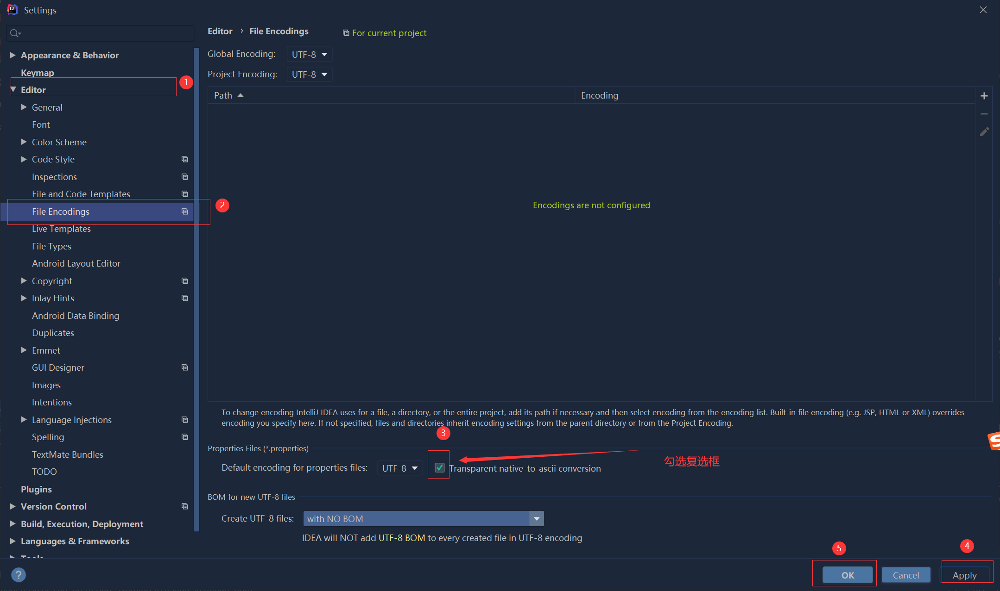

### 返回JSON

* 请求处理方法返回JSON数据到前端的便捷方法：
  1. 加入 jar 包：

      ```xml
      <dependency>
         <groupId>com.fasterxml.jackson.core</groupId>
         <artifactId>jackson-databind</artifactId>
         <version>2.5.4</version>
      </dependency>
      ```

  2. 编写目标方法，使其返回 JSON 对应的对象或集合
  3. 在方法上添加 @ResponseBody 注解

      ```xml
      @ResponseBody
      @RequestMapping(value="jsonlist")
      public Collection<Employee> employeeListToJson(){
         return employeeDao.getEmployees();
      }
      ```

  4. 在浏览器地址栏输入：`http://localhost:8080/springmvcdemo/emp/jsonlist`或者在前端编写ajax请求，也可以获取到数据

### HttpMessageConverter\<T\>

* HttpMessageConverter<T> 是 Spring3.0 新添加的一个接口，负责将请求信息转换为一个对象（类型为 T），将对象（类型为 T）输出为响应信息
* HttpMessageConverter<T>接口定义的方法：
  * `Boolean canRead(Class<?> clazz,MediaType mediaType)`: 指定转换器
可以读取的对象类型，即转换器是否可将请求信息转换为 clazz 类型的对
象，同时指定支持 MIME 类型(text/html,applaiction/json等)
  * `Boolean canWrite(Class<?> clazz,MediaType mediaType)`:指定转换器
是否可将 clazz 类型的对象写到响应流中，响应流支持的媒体类型
在MediaType 中定义。
  * `LIst<MediaType> getSupportMediaTypes()`：该转换器支持的媒体类
型。
  * `T read(Class<? extends T> clazz,HttpInputMessage inputMessage)`：
将请求信息流转换为 T 类型的对象。
  * `void write(T t,MediaType contnetType,HttpOutputMessgae
outputMessage)`:将T类型的对象写到响应流中，同时指定相应的媒体类
型为 contentType

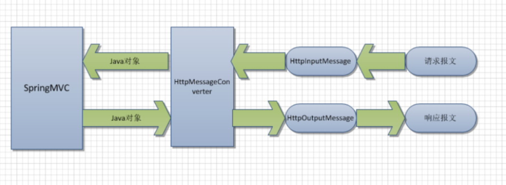

**`HttpMessageConverter<T> 的实现类`**


* 各实现类功能如下：

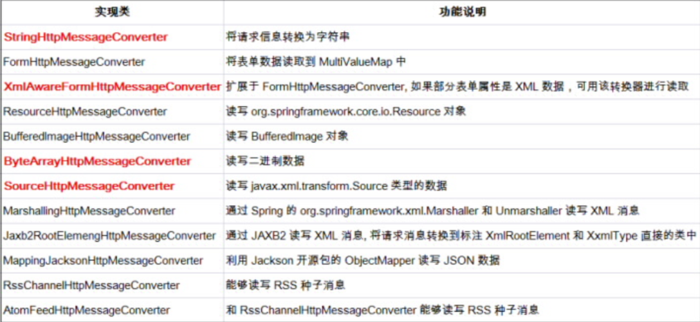


* DispatcherServlet 默认装配RequestMappingHandlerAdapter ，而RequestMappingHandlerAdapter 默认装配HttpMessageConverter
* 加入 jackson jar 包后， RequestMappingHandlerAdapter装配的 HttpMessageConverter 如下：
  

**`使用 HttpMessageConverter<T>`**

* 使用 `HttpMessageConverter<T>` 将请求信息转化并绑定到处理方法的入参中或将响应结果转为对应类型的响应信息，Spring 提供了两种途径：
  * 使用 @RequestBody / @ResponseBody 对处理方法进行标注
  * 使用 `HttpEntity<T>` / `ResponseEntity<T>` 作为处理方法的入参或返回值
* 当控制器处理方法使用到 @RequestBody/@ResponseBody 或`HttpEntity<T>/ResponseEntity<T>` 时, Spring 首先根据请求头或响应头的Accept 属性选择匹配的 HttpMessageConverter, 进而根据参数类型或泛型类型的过滤得到匹配的 HttpMessageConverter, 若找不到可用的HttpMessageConverter 将报错
* @RequestBody 和 @ResponseBody 不需要成对出现

* 使用测试:

  ```java
  package com.suftz.handlers;

  import org.springframework.http.HttpHeaders;
  import org.springframework.http.HttpStatus;
  import org.springframework.http.ResponseEntity;
  import org.springframework.stereotype.Component;
  import org.springframework.stereotype.Controller;
  import org.springframework.web.bind.annotation.RequestBody;
  import org.springframework.web.bind.annotation.RequestMapping;
  import org.springframework.web.bind.annotation.RequestParam;

  import javax.servlet.ServletContext;
  import javax.servlet.http.HttpServletRequest;
  import java.io.IOException;
  import java.io.InputStream;
  import java.util.Date;

  @Controller
  public class RequestAndResponseTest {

      @RequestMapping("/uptest")
      public String test1(@RequestBody String body){
          System.out.println(body);
          return "hello!"+new Date();
      }

      @RequestMapping("/downloadtest")
      public ResponseEntity<byte[]> test2(HttpServletRequest request) throws IOException {
          byte[] body=null;
          ServletContext servletContext=request.getServletContext();
          InputStream in=servletContext.getResourceAsStream("index.html");
          body=new byte[in.available()];
          in.read(body);
          HttpHeaders headers=new HttpHeaders();
          headers.add("Content-Disposition","attachment;filename=index.html");
          ResponseEntity<byte[]> responseEntity=new ResponseEntity<byte[]>(body,headers, HttpStatus.OK);
          return responseEntity;
      }
  }
  ```

### 国际化

* 国际化的需求：
  1. 在页面上能够根据浏览器语言设置的请求对文本(不是内容),时间，数值进行本地化处理
  2. 可以在bean中获取国际化资源文件Locale对应的消息
  3. 可以通过超链接切换Locale，而不再依赖于浏览器的语言设置情况

* 解决方式如下：
  1. 使用JSTL的fmt标签
  2. 在bean中注入ResourceBundleMessageSource的示例，使用其对应的getMessage方法
  3. 配置LocalResolver和LocaleChangeiNTERceptor

* 实例步骤：

1. 在springmvc配置文件中注册localeResolver引用i18n的文件，并且设置LocaleChangeInterceptor拦截器

   ```xml
   <?xml version="1.0" encoding="UTF-8"?>
   <beans xmlns="http://www.springframework.org/schema/beans"
          xmlns:xsi="http://www.w3.org/2001/XMLSchema-instance"
          xmlns:context="http://www.springframework.org/schema/context"
          xmlns:mvc="http://www.springframework.org/schema/mvc"
          xsi:schemaLocation="http://www.springframework.org/schema/beans http://www.springframework.org/schema/beans/spring-beans.xsd
           http://www.springframework.org/schema/context http://www.springframework.org/schema/context/spring-context-4.0.xsd
           http://www.springframework.org/schema/mvc http://www.springframework.org/schema/mvc/spring-mvc-4.0.xsd">

       <!-- 配置自动扫描的包 -->
       <context:component-scan base-package="com.suftz"/>
       <!--配置后，在地址栏直接输入/工程名/success，就能访问到/WEB-INF/views/success.jsp, 但这样配置之后，通过注解打开的url就都不能识别了-->
       <mvc:view-controller path="/success" view-name="success" />
       <!--配置自定义转换器-->
       <!--配置视图解析器：如何把handler方法返回值解析为实际的物理视图-->
       <bean class="org.springframework.web.servlet.view.InternalResourceViewResolver">
           <property name="prefix" value="/WEB-INF/views/"></property>
           <property name="suffix" value=".jsp"></property>
       </bean>

       <!--配置视图BeanNameViewResolver解析器：使用视图的名字来解析视图-->
       <bean class="org.springframework.web.servlet.view.BeanNameViewResolver">
           <!--使用order属性来定义视图的优先级，order值越小优先级越高  ，默认的InternalResourceViewResolver的order值是Integer.Max-->
           <property name="order" value="100"></property>
       </bean>

       <!--处理静态资源，这样配置后，静态资源可以通过url来get:原理，会去urlMapping中找，如果映射过，则请求由DispatcherServlet处理，如果没有，则交给servlet处理-->
       <mvc:default-servlet-handler></mvc:default-servlet-handler>

       <!--注册国际化配置文件-->
       <bean id="messageSource" class="org.springframework.context.support.ResourceBundleMessageSource">
           <property name="basename" value="i18n"></property>
       </bean>

       <bean id="localeResolver" class="org.springframework.web.servlet.i18n.SessionLocaleResolver">
       </bean>

       <mvc:interceptors>
           <bean class="org.springframework.web.servlet.i18n.LocaleChangeInterceptor" />
       </mvc:interceptors>

       <!--开启后，注解的url和上面的url都能使用了-->
       <mvc:annotation-driven ></mvc:annotation-driven>
           <!--conversion-service="conversionService"-->
   <!--    <bean id="conversionService" class="org.springframework.context.support.ConversionServiceFactoryBean">-->
   <!--        <property name="converters" >-->
   <!--            <set>-->
   <!--                <ref bean="employeeConverter"/>-->
   <!--            </set>-->
   <!--        </property>-->
   <!--    </bean>-->
   </beans>
   ```

2. 编写i18n的文件

   ```properties
   NotEmpty.employee.name=Employee name cannot be empty
   NotNull.employee.age=Employee age cannot be empty
   DecimalMax.employee.age=Please add a reasonable age
   typeMismatch.employee.age=Please fill in a number between 1-150
   NotEmpty.employee.email=The mailbox cannot be empty
   Email.employee.name=Please fill in the correct email address
   NotEmpty.employee.address=Address cannot be empty
   Length.employee.address=The length of the address content cannot exceed 30 characters
   #NotNull.employee.dpt=Employee department cannot be empty
   #Valid.employee.dpt=Please select the employee's department
   NotNull.employee.dpt.id=Please select the employee's department
   NotNull.employee.birthday=Employee birthday cannot be empty
   Past.employee.birthday=Employee birthday cannot be empty
   typeMismatch.employee.birthday=The employee birthday format is incorrect
   i18n.uname=name
   i18n.age=age
   i18n.email=email
   i18n.address=address
   i18n.department=department
   i18n.birthday=birthday
   i18n.add=submit
   i18n.alter=Submit Update
   ```

   ```properties
   NotEmpty.employee.name=员工名称不能为空
   NotNull.employee.age=员工年龄不能为空
   DecimalMax.employee.age=请添加合理的年龄
   typeMismatch.employee.age=请填写1-150之间的数字
   NotEmpty.employee.email=邮箱不能为空
   Email.employee.name=请填写正确的邮箱
   NotEmpty.employee.address=地址不能为空
   Length.employee.address=地址内容长度不能超过30个字符
   #NotNull.employee.dpt=员工部门不能为空
   #Valid.employee.dpt=请选择员工所在部门
   NotNull.employee.dpt.id=请选择员工所在部门
   NotNull.employee.birthday=员工生日不能为空
   Past.employee.birthday=员工生日不能为空
   typeMismatch.employee.birthday=员工生日格式不正确
   i18n.uname=姓名
   i18n.age=年龄
   i18n.email=邮箱
   i18n.address=地址
   i18n.department=部门
   i18n.birthday=生日
   i18n.add=新增
   i18n.alter=修改
   ```

3. 改写list.jsp和edit.jsp文件

   ```xml
   <!--list.jsp-->
   <%@ page contentType="text/html;charset=UTF-8" language="java" %>
   <%@ taglib prefix="c" uri="http://java.sun.com/jsp/jstl/core" %>
   <%@ taglib prefix="fmt" uri="http://java.sun.com/jsp/jstl/fmt" %>

   <%@ taglib prefix="form" uri="http://www.springframework.org/tags/form" %>
   <html>
   <head>
       <base href="<%=request.getContextPath()%>/">
       <title>员工列表</title>
       <style type="text/css">
           .form-error-info{
               color:red;
           }
       </style>
   </head>
   <body>
   <!--jsp的jstl方式实现国际化切换,这种方式只是在request域中起作用，如果其他页面不传locale参数，则又是使用默认的语言，而不能按照第一次访问站点时设置的语言优先显示
       需要在session级别去设置
   -->
   <fmt:setLocale value="${param.locale}"/>
   <fmt:setBundle basename="i18n"/>
   <a href="emp/list?locale=zh_CN">中文</a><br>
   <a href="emp/list?locale=en_US">English</a><br>
   <form:form action="emp/save" method="post" modelAttribute="employee">
   <%--    <form:errors path="*" /><br>--%>
   <fmt:message key="i18n.uname" />：<form:input path="name" /><form:errors path="name" class="form-error-info" /><br>

       <fmt:message key="i18n.age" />：<form:input path="age" /><form:errors path="age" class="form-error-info" /><br>

       <fmt:message key="i18n.email" />：<form:input path="email" /><form:errors path="email" class="form-error-info" /><br>

       <fmt:message key="i18n.address" />：<form:input path="address" /><form:errors path="address" class="form-error-info"/><br>

       <fmt:message key="i18n.department" />：<form:select path="dpt.id" items="${departments}" itemLabel="name"  itemValue="id">
       <option path="dpt.id" value="" />请选择</option>
   </form:select><form:errors path="dpt.id" class="form-error-info" /><br>

       <fmt:message key="i18n.birthday" />:<input name="birthday" type="date" /><form:errors path="birthday" class="form-error-info"/><br>

   <input type="submit" value="<fmt:message key="i18n.add" />">
   </form:form>
   <br>

   <c:if test="${requestScope.employees!=null&&requestScope.employees.size()!=0}">
   <table cellspacing="0" cellpadding="4" border="1px solid #eeeeee">
       <tr><td>id</td><td>姓名</td><td>年龄</td><td>邮箱</td><td>地址</td><td>部门</td><td colspan="2">操作</td></tr>
       <c:forEach items="${requestScope.employees}" var="employee">
           <tr>
               <td>${employee.id}</td>
               <td>${employee.name}</td>
               <td>${employee.age}</td>
               <td>${employee.email}</td>
               <td>${employee.address}</td>
               <td>${employee.dpt}</td>
               <td><a href="emp/delete?id=${employee.id}" >删除</a></td>
               <td><a href="emp/edit?id=${employee.id}" >修改</a></td>

           </tr>
       </c:forEach>
   </table>
   </c:if>
   </body>
   </html>
   ```

   ```xml
   <!--edit.jsp-->
   <%@ page contentType="text/html;charset=UTF-8" language="java" %>
   <%@ taglib prefix="c" uri="http://java.sun.com/jsp/jstl/core" %>
   <%@ taglib prefix="fmt" uri="http://java.sun.com/jsp/jstl/fmt" %>
   <%@ taglib prefix="form" uri="http://www.springframework.org/tags/form" %>
   <html>
   <head>
       <base href="<%=request.getContextPath()%>/">
       <title>信息修改</title>
       <style type="text/css">
           .form-error-info{
               color:red;
           }
       </style>
   </head>
   <body>
   <form:form action="emp/save" method="post" modelAttribute="employee">
       <%--    <form:errors path="*" /><br>--%>
       <form:hidden path="id"/>
       <fmt:message key="i18n.uname" />：<form:input path="name" /><form:errors path="name" class="form-error-info" /><br>

       <fmt:message key="i18n.age" />：<form:input path="age" /><form:errors path="age" class="form-error-info" /><br>

       <fmt:message key="i18n.email" />：<form:input path="email" /><form:errors path="email" class="form-error-info" /><br>

       <fmt:message key="i18n.address" />：<form:input path="address" /><form:errors path="address" class="form-error-info"/><br>

       <fmt:message key="i18n.department" />：<form:select path="dpt.id" items="${departments}" itemLabel="name"  itemValue="id">
   <option path="dpt.id" value="" />请选择</option>
       </form:select><form:errors path="dpt.id" class="form-error-info" /><br>

       <fmt:message key="i18n.birthday" />:<input name="birthday" type="date" /><form:errors path="birthday" class="form-error-info"/><br>

   <input type="submit" value="<fmt:message key="i18n.alter" />">
   </form:form>
   <br>
   </body>
   </html>
   ```

* 国际化源码分析：

* 工作原理：
  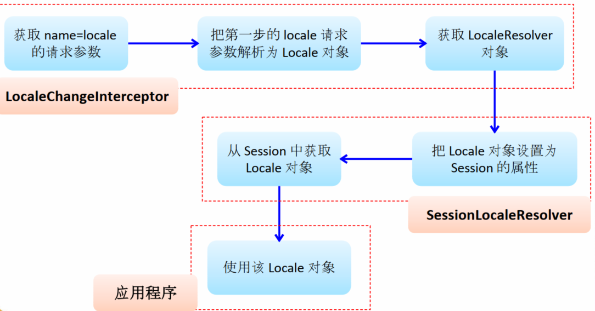

  
  
  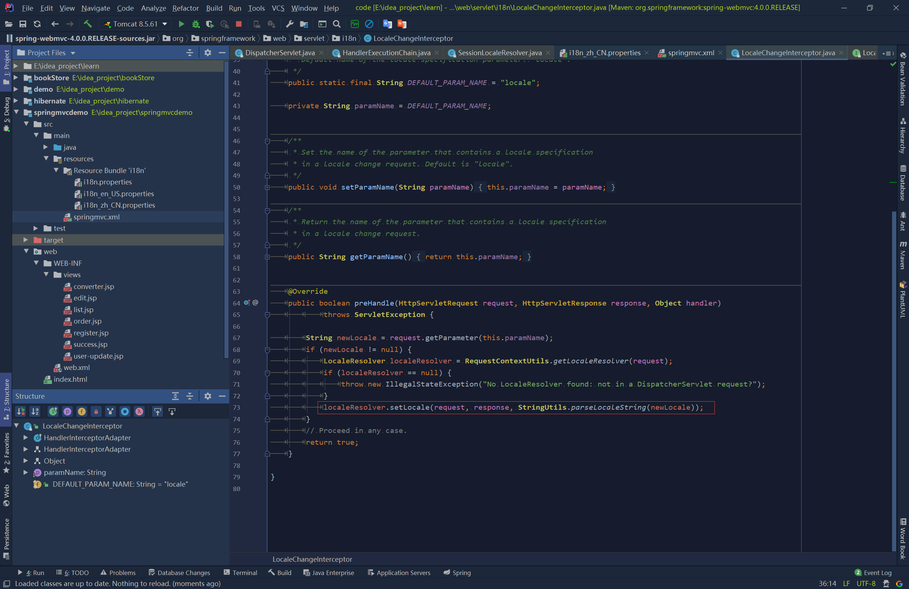
  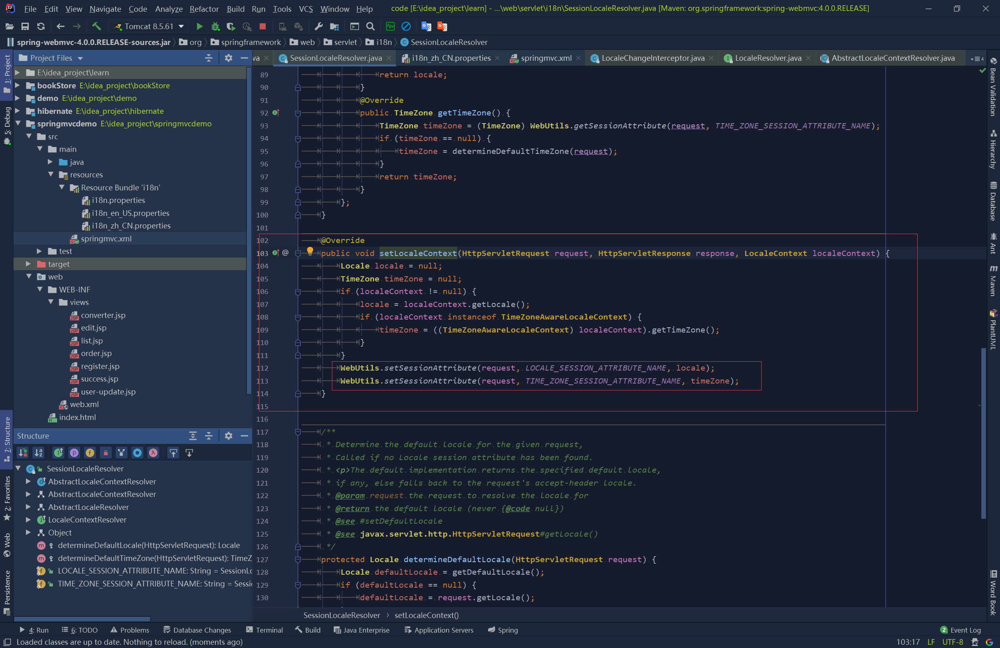
  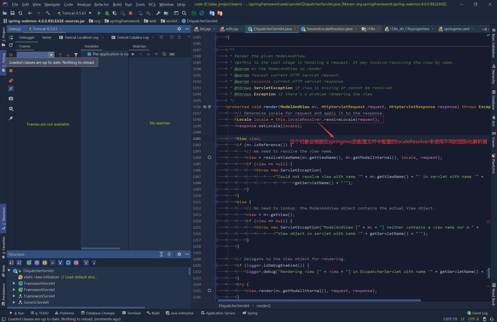

* 在没有设置解析器和拦截器的时候，springmvc会使用默认的解析器和拦截器，去根据请求头的Accept-Language来决定本地化类型，这就是为什么刚刚上面的数据校验只是设置了国际化文件，也能进行国际化显示

* AcceptHeaderLocaleResolver：根据 HTTP 请求头的Accept-Language 参数确定本地化类型，如果没有显式定义本地化解析器， SpringMVC 使用该解析器。
* CookieLocaleResolver：根据指定的 Cookie 值确定本地类型
* SessionLocaleResolver：根据 Session 中特定的属性确本地化类型
* LocaleChangeInterceptor：从请求参数中获取本次请求对应的本地化类型。

### 文件上传

* Spring MVC 为文件上传提供了直接的支持，这种支持是通过即插即用的 MultipartResolver 实现的。Spring 用Jakarta Commons FileUpload 技术实现了一个MultipartResolver 实现类：CommonsMultipartResovler
* Spring MVC 上下文中默认没有装配 MultipartResovler，因此默认情况下不能处理文件的上传工作，如果想使用 Spring的文件上传功能，需现在上下文中配置 MultipartResolver

* 配置 MultipartResolver
  * defaultEncoding: 必须和用户 JSP 的 pageEncoding 属性
  一致，以便正确解析表单的内容
  * 为了让 CommonsMultipartResovler 正确工作，必须先
  将 Jakarta Commons FileUpload 及 Jakarta Commons io
  的类包添加到类路径下。

* 上传文件完整示例：

1. 导入所需要的包

   ```xml
   <dependency>
      <groupId>commons-fileupload</groupId>
      <artifactId>commons-fileupload</artifactId>
      <version>1.4</version>
   </dependency>
   <dependency>
      <groupId>commons-io</groupId>
      <artifactId>commons-io</artifactId>
      <version>2.2</version>
   </dependency>
   ```

2. 在springmvc配置文件中设置实现类

   ```xml
   <?xml version="1.0" encoding="UTF-8"?>
   <beans xmlns="http://www.springframework.org/schema/beans"
          xmlns:xsi="http://www.w3.org/2001/XMLSchema-instance"
          xmlns:context="http://www.springframework.org/schema/context"
          xmlns:mvc="http://www.springframework.org/schema/mvc"
          xsi:schemaLocation="http://www.springframework.org/schema/beans http://www.springframework.org/schema/beans/spring-beans.xsd
        http://www.springframework.org/schema/context http://www.springframework.org/schema/context/spring-context-4.0.xsd
        http://www.springframework.org/schema/mvc http://www.springframework.org/schema/mvc/spring-mvc-4.0.xsd">

       <!-- 配置自动扫描的包 -->
       <context:component-scan base-package="com.suftz"/>
       <!--配置后，在地址栏直接输入/工程名/success，就能访问到/WEB-INF/views/success.jsp, 但这样配置之后，通过注解打开的url就都不能识别了-->
       <mvc:view-controller path="/success" view-name="success" />
       <!--配置自定义转换器-->
       <!--配置视图解析器：如何把handler方法返回值解析为实际的物理视图-->
       <bean class="org.springframework.web.servlet.view.InternalResourceViewResolver">
           <property name="prefix" value="/WEB-INF/views/"></property>
           <property name="suffix" value=".jsp"></property>
       </bean>

       <!--配置视图BeanNameViewResolver解析器：使用视图的名字来解析视图-->
       <bean class="org.springframework.web.servlet.view.BeanNameViewResolver">
           <!--使用order属性来定义视图的优先级，order值越小优先级越高  ，默认的InternalResourceViewResolver的order值是Integer.Max-->
           <property name="order" value="100"></property>
       </bean>

       <!--处理静态资源，这样配置后，静态资源可以通过url来get:原理，会去urlMapping中找，如果映射过，则请求由DispatcherServlet处理，如果没有，则交给servlet处理-->
       <mvc:default-servlet-handler></mvc:default-servlet-handler>

       <!--注册国际化配置文件-->
       <bean id="messageSource" class="org.springframework.context.support.ResourceBundleMessageSource">
           <property name="basename" value="i18n"></property>
       </bean>

       <bean id="localeResolver" class="org.springframework.web.servlet.i18n.SessionLocaleResolver">
       </bean>

       <mvc:interceptors>
           <bean class="org.springframework.web.servlet.i18n.LocaleChangeInterceptor" />
       </mvc:interceptors>

       <!--上传文件设置-->
       <bean id="multipartResolver" class="org.springframework.web.multipart.commons.CommonsMultipartResolver">
           <property name="defaultEncoding" value="UTF-8"></property>
           <property name="maxUploadSize" value="1024000000"></property>
       </bean>

       <!--开启后，注解的url和上面的url都能使用了-->
       <mvc:annotation-driven ></mvc:annotation-driven>
           <!--conversion-service="conversionService"-->
   <!--    <bean id="conversionService" class="org.springframework.context.support.ConversionServiceFactoryBean">-->
   <!--        <property name="converters" >-->
   <!--            <set>-->
   <!--                <ref bean="employeeConverter"/>-->
   <!--            </set>-->
   <!--        </property>-->
   <!--    </bean>-->
   </beans>
   ```

3. 编写上传文件以及回显上传图片的upload.jsp页面

   ```xml
   <%@ page contentType="text/html;charset=UTF-8" language="java" pageEncoding="UTF-8" %>
   <html>
   <head>
       <title>Title</title>
       <base href="<%=request.getContextPath()%>/">
   </head>
   <body>

   <form action="file/upload" enctype="multipart/form-data" method="post">
       用户名：<input type="text" name="username" /><br>
       头像：<input type="file" name="avatar" /><br>
       <input type="submit" value="上传"><br>

       <br>
   </form>
   </body>
   </html>
   ```

4. 编写上传文件的处理类

   ```java
   package com.suftz.handlers;

   import org.springframework.http.HttpHeaders;
   import org.springframework.http.HttpStatus;
   import org.springframework.http.ResponseEntity;
   import org.springframework.stereotype.Component;
   import org.springframework.stereotype.Controller;
   import org.springframework.web.bind.annotation.RequestBody;
   import org.springframework.web.bind.annotation.RequestMapping;
   import org.springframework.web.bind.annotation.RequestParam;
   import org.springframework.web.multipart.MultipartFile;

   import javax.servlet.ServletContext;
   import javax.servlet.http.HttpServletRequest;
   import java.io.*;
   import java.util.Date;
   import java.util.Map;

   @Controller
   public class UploadFileHandler {
        //地址栏输入：http://localhost:8080/springmvcdemo/file/test访问上传文件的表单页面
       @RequestMapping("/file/test")
       public String fileForm(){
           return "upload";
       }
       //处理上传文件的请求
       @RequestMapping("/file/upload")
       public String upload(@RequestParam("username") String username, @RequestParam("avatar") MultipartFile file,HttpServletRequest request, Map<String,Object> map) {
           System.out.println(username);
           String fileName=file.getOriginalFilename();
           InputStream in=null;
           FileOutputStream fos=null;
           File fileObj=new File(request.getServletContext().getRealPath("WEB-INF/files")+File.separator+fileName);
           try {
               if(!fileObj.exists()){
                   fileObj.createNewFile();
               }
               in = file.getInputStream();
               fos = new FileOutputStream(fileObj);
               byte[] bytes = new byte[1024];
               int len = -1;
               while ((len = in.read(bytes)) != -1) {
                   fos.write(bytes, 0, len);
               }
               map.put("avatarUrl","fileshow?filename="+fileName);
           }catch(IOException e){
              e.printStackTrace();
           }finally {
               if(in!=null){
                   try {
                       in.close();
                   } catch (IOException e) {
                       e.printStackTrace();
                   }
               }
               if(fos!=null){
                   try {
                       fos.close();
                   } catch (IOException e) {
                       e.printStackTrace();
                   }
               }
           }
           return "upload";
       }

       //用于页面上回显上传后的图片
       @RequestMapping("/fileshow")
       public ResponseEntity<byte[]> fileshow(HttpServletRequest request,@RequestParam("filename") String filename) throws IOException {
           byte[] body=null;
           ServletContext servletContext=request.getServletContext();
           InputStream in=servletContext.getResourceAsStream("/WEB-INF/files/"+filename);
           Integer length=in.available();
           body=new byte[length];
           in.read(body);
           HttpHeaders headers=new HttpHeaders();
           headers.add("content-type","image/jpeg");
           headers.add("Length",length.toString());
           ResponseEntity<byte[]> responseEntity=new ResponseEntity<byte[]>(body,headers, HttpStatus.OK);
           return responseEntity;
       }
   }
   ```

### 拦截器

#### 自定义拦截器

* Spring MVC也可以使用拦截器对请求进行拦截处理，用户可以自定义拦截器来实现特定的功能，自定义的拦截器必须实现HandlerInterceptor接口
  * preHandle()：这个方法在业务处理器处理请求之前被调用，在该方法中对用户请求 request 进行处理。如果程序员决定该拦截器对请求进行拦截处理后还要调用其他的拦截器，或者是业务处理器去进行处理，则返回true；如果程序员决定不需要再调用其他的组件去处理请求，则返回false。
  * postHandle()：这个方法在业务处理器处理完请求后，但是DispatcherServlet 向客户端返回响应前被调用，在该方法中对用户请求request进行处理。
  * afterCompletion()：这个方法在 DispatcherServlet 完全处理完请求后被调用，可以在该方法中进行一些资源清理的操作。

* 自定义拦截器示例：

  ```java
  package com.suftz.interceptors;

  import org.springframework.web.servlet.HandlerInterceptor;
  import org.springframework.web.servlet.ModelAndView;

  import javax.servlet.http.HttpServletRequest;
  import javax.servlet.http.HttpServletResponse;

  public class FirstInterceptor implements HandlerInterceptor {

      /**
       * 该方法在目标方法之前被调用。
       * 若返回值为true,则继续调用后续的拦截器和目标方法
       * 若返回值为false,则不会再调用后续的拦截器和目标方法
       *
       * 作用：
       * 可以考虑做权限，事务，日志等
       * */
      @Override
      public boolean preHandle(HttpServletRequest request, HttpServletResponse response, Object handler) throws Exception {
          System.out.println("FistInterceptor,preHandle...");
          return true;
      }

      /**
       *该方法执行时机：调用目标方法之后，但渲染视图之前
       *
       * 作用：
       * 可以对请求域中的属性或视图做出修改
       *
       * 作用：
       * 释放资源
       * */
      @Override
      public void postHandle(HttpServletRequest request, HttpServletResponse response, Object handler, ModelAndView modelAndView) throws Exception {
          System.out.println("FistInterceptor,postHandle...");
      }
      /**
       * 在渲染视图之后才被调用
       *
       * */
      @Override
      public void afterCompletion(HttpServletRequest request, HttpServletResponse response, Object handler, Exception ex) throws Exception {
          System.out.println("FistInterceptor,afterCompletion...");
      }
  }
  ```


#### 拦截器设置

```xml
<?xml version="1.0" encoding="UTF-8"?>
<beans xmlns="http://www.springframework.org/schema/beans"
       xmlns:xsi="http://www.w3.org/2001/XMLSchema-instance"
       xmlns:context="http://www.springframework.org/schema/context"
       xmlns:mvc="http://www.springframework.org/schema/mvc"
       xsi:schemaLocation="http://www.springframework.org/schema/beans http://www.springframework.org/schema/beans/spring-beans.xsd
        http://www.springframework.org/schema/context http://www.springframework.org/schema/context/spring-context-4.0.xsd
        http://www.springframework.org/schema/mvc http://www.springframework.org/schema/mvc/spring-mvc-4.0.xsd">

    <!-- 配置自动扫描的包 -->
    <context:component-scan base-package="com.suftz"/>
    <!--配置后，在地址栏直接输入/工程名/success，就能访问到/WEB-INF/views/success.jsp, 但这样配置之后，通过注解打开的url就都不能识别了-->
    <mvc:view-controller path="/success" view-name="success" />
    <!--配置自定义转换器-->
    <!--配置视图解析器：如何把handler方法返回值解析为实际的物理视图-->
    <bean class="org.springframework.web.servlet.view.InternalResourceViewResolver">
        <property name="prefix" value="/WEB-INF/views/"></property>
        <property name="suffix" value=".jsp"></property>
    </bean>

    <!--配置视图BeanNameViewResolver解析器：使用视图的名字来解析视图-->
    <bean class="org.springframework.web.servlet.view.BeanNameViewResolver">
        <!--使用order属性来定义视图的优先级，order值越小优先级越高  ，默认的InternalResourceViewResolver的order值是Integer.Max-->
        <property name="order" value="100"></property>
    </bean>

    <!--处理静态资源，这样配置后，静态资源可以通过url来get:原理，会去urlMapping中找，如果映射过，则请求由DispatcherServlet处理，如果没有，则交给servlet处理-->
    <mvc:default-servlet-handler></mvc:default-servlet-handler>

    <!--注册国际化配置文件-->
    <bean id="messageSource" class="org.springframework.context.support.ResourceBundleMessageSource">
        <property name="basename" value="i18n"></property>
    </bean>

    <bean id="localeResolver" class="org.springframework.web.servlet.i18n.SessionLocaleResolver">
    </bean>

    <mvc:interceptors>
        <!--自定义的拦截器:FirstInterceptor-->
        <bean class="com.suftz.interceptors.FirstInterceptor"></bean>
        <bean class="org.springframework.web.servlet.i18n.LocaleChangeInterceptor" />

        <!--自定义的拦截器:SecondInterceptor-->
        <mvc:interceptor>
            <mvc:mapping path="/emp/*" /><!--作用在哪个请求上-->
            <mvc:exclude-mapping path="/file" /><!--不作用在哪个请求上-->
            <bean class="com.suftz.interceptors.SecondInterceptor" />
        </mvc:interceptor>

    </mvc:interceptors>

    <bean id="multipartResolver" class="org.springframework.web.multipart.commons.CommonsMultipartResolver">
        <property name="defaultEncoding" value="UTF-8"></property>
        <property name="maxUploadSize" value="1024000000"></property>
    </bean>

    <!--开启后，注解的url和上面的url都能使用了-->
    <mvc:annotation-driven ></mvc:annotation-driven>
        <!--conversion-service="conversionService"-->
<!--    <bean id="conversionService" class="org.springframework.context.support.ConversionServiceFactoryBean">-->
<!--        <property name="converters" >-->
<!--            <set>-->
<!--                <ref bean="employeeConverter"/>-->
<!--            </set>-->
<!--        </property>-->
<!--    </bean>-->
</beans>
```

#### 拦截器执行顺序

* 拦截器执行顺序，与Struts2的拦截器执行顺序类似，进入拦截器是按照顺序，出来的是按照倒序，即(两个拦截器):

  ```text
  FistInterceptor,preHandle...
  SecondInterceptor,preHandle...
  SecondInterceptor,postHandle...
  FistInterceptor,postHandle...
  SecondInterceptor,afterCompletion...
  FistInterceptor,afterCompletion...
  ```

  > 需要注意的是，如果在某个拦截器的方法preHandle中返回了false，则当前拦截器会停止执行postHandle和afterCompletion,后面的拦截器不会被执行，**但是当前拦截器之前被执行过的拦截器的afterCompletion方法都会会被执行的**(从源码可以查看)

  
  
* 拦截器方法执行顺序
  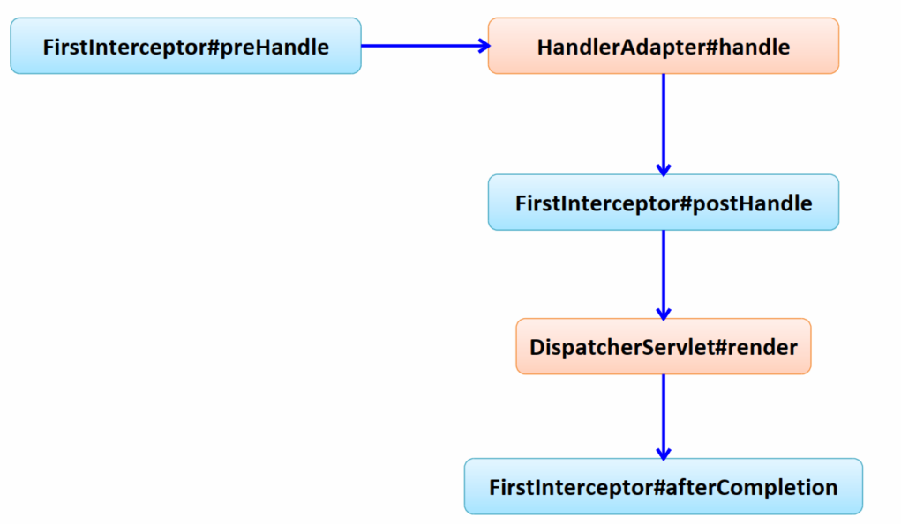
  ****
  
  ****
  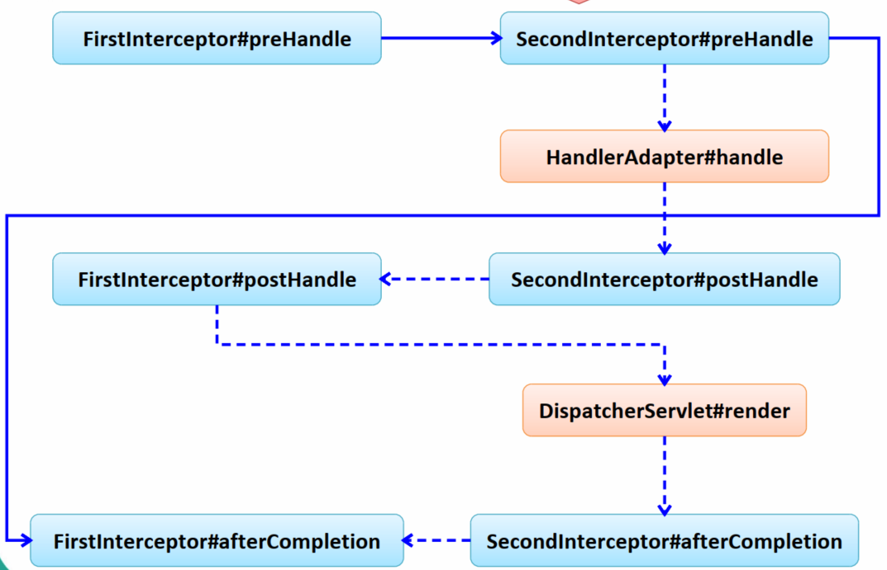

### 异常处理

* Spring MVC 通过 HandlerExceptionResolver 处理程序的异常，包括 Handler 映射、数据绑定以及目标方法执行时发生的异常。
* SpringMVC 提供的 HandlerExceptionResolver 的实现类

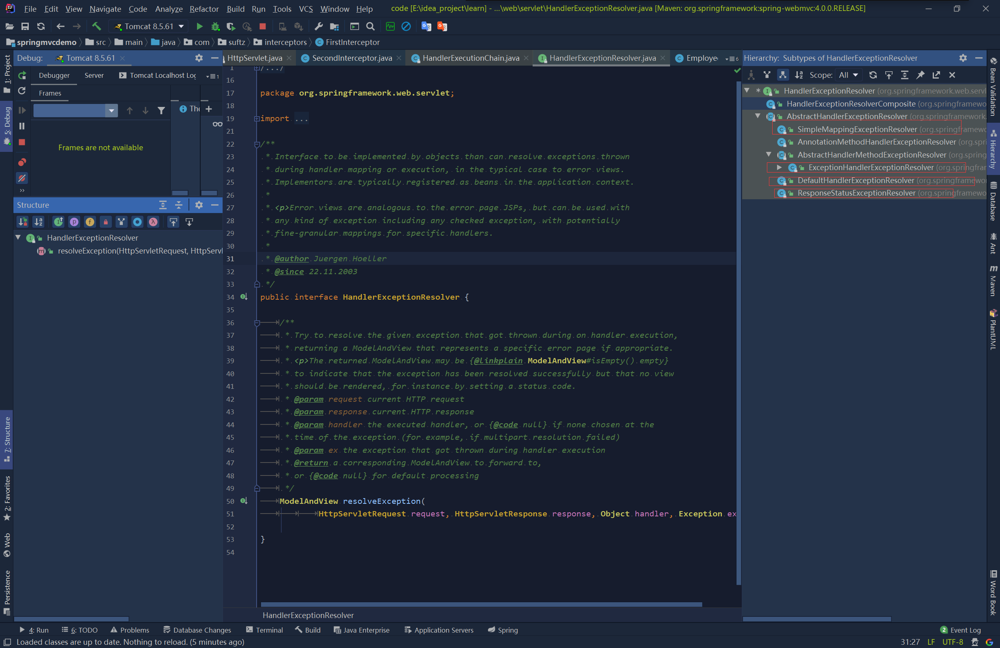

* DispatcherServlet 默认装配的 HandlerExceptionResolver有：
  1. AnnotationMethodHandlerExceptionResolver（已废弃）
  2. ResponseStatusExceptionResolver
  3. DefaultHandlerExceptonResolver

* 如果使用 `<mvc:annotation-driven/>` 配置,则DispatcherServlet装配的异常解析器是：
  1. ExceptionHandlerExceptionResolver
  2. ResponseStatusExceptionResolver
  3. DefaultHandlerExceptonResolver

#### ExceptionHandlerExceptionResolver

* 主要处理 Handler 中用 @ExceptionHandler 注解定义的方法。
* @ExceptionHandler 注解定义的方法优先级问题：例如发生的是NullPointerException，但是声明的异常有RuntimeException 和 Exception，此候会根据异常的最近继承关系找到继承深度最浅的那个 @ExceptionHandler注解方法，即标记了 RuntimeException 的方法
* ExceptionHandlerMethodResolver 内部若找不到@ExceptionHandler 注解的话，会找@ControllerAdvice 中的@ExceptionHandler 注解方法

* 示例：

1. 写一个请求处理方法math,传一个参数i，则会运算10/i，并把结果返回到浏览器页面，如果出错，则会跳转到error.jsp页面

      ```java
      package com.suftz.handlers;

      import org.springframework.http.HttpHeaders;
      import org.springframework.http.HttpStatus;
      import org.springframework.http.ResponseEntity;
      import org.springframework.stereotype.Component;
      import org.springframework.stereotype.Controller;
      import org.springframework.web.bind.annotation.*;
      import org.springframework.web.multipart.MultipartFile;
      import org.springframework.web.servlet.ModelAndView;

      import javax.servlet.ServletContext;
      import javax.servlet.http.HttpServletRequest;
      import java.io.*;
      import java.util.Date;
      import java.util.Map;

      @Controller
      public class RequestAndResponseTest {

      //    //这里无法将错误信息写入到Map中，然后显示到错误页面中
      //    //处理算法运算错误
      //    @ExceptionHandler({ArithmeticException.class})
      //    public String handleException(Exception ex){
      //        System.out.println(ex);
      //        return "error";//跳转到错误页面
      //    }

         /**
          * 1. 在错误处理方法的入参中可以加入Exception类型的参数，该参数即为对应的发送的异常对象
          * 2. 在该方法中不能传入Map,若希望把异常信息传到页面上，需要使用ModelAndview作为返回值
          * 3. 异常处理的顺序， 如果有多个异常，默认当然是找最能匹配的异常(范围最小的异常)
          * 4. 如果在当前Handler中找不到@ExceptionHandler处理异常的方法，则会去@ControllerAdvice标记的类中查找
          *     @ExceptionHandler标记的方法来处理异常
          */
         //处理算法运算异常
         @ExceptionHandler({ArithmeticException.class})
         public ModelAndView handleArithmeticException(Exception ex){
             ModelAndView modelAndView=new ModelAndView("error");//jsp页面的名字
             modelAndView.addObject("exception",ex);
             return modelAndView;
         }

         //处理运行时异常错误
         @ExceptionHandler({RuntimeException.class})
         public ModelAndView handleRuntimeException(Exception ex){
             ModelAndView modelAndView=new ModelAndView("error");//jsp页面的名字
             modelAndView.addObject("exception",ex);
             return modelAndView;
         }

         @ResponseBody
         @RequestMapping("/math")
         public String math(@RequestParam("i") int i) {
             System.out.println(10/i);
             return "10/"+i+"="+10/i;
         }
      }
      ```

2. 错误页面error.jsp

   ```xml
   <%@ page contentType="text/html;charset=UTF-8" language="java" %>
   <html>
   <head>
       <title>错误页面</title>
   </head>
   <body>
   <h2>This is an error page</h2>
   <h2>If you can see this page, there is an error in the program</h2>

   <h3>服务器错误的信息：</h3>
   ${requestScope.exception}
   </body>
   </html>
   ```

3. 自定义的全局的错误处理类

   ```java
   package com.suftz.handlers;

   import org.springframework.web.bind.annotation.ControllerAdvice;
   import org.springframework.web.bind.annotation.ExceptionHandler;
   import org.springframework.web.servlet.ModelAndView;

   @ControllerAdvice
   public class MyExceptionHandler {
       /**
        * 1. 在错误处理方法的入参中可以加入Exception类型的参数，该参数即为对应的发送的异常对象
        * 2. 在该方法中不能传入Map,若希望把异常信息传到页面上，需要使用ModelAndview作为返回值
        * 3. 异常处理的顺序， 如果有多个异常，默认当然是找最能匹配的异常(范围最小的异常)
        * 4. 如果在当前Handler中找不到@ExceptionHandler处理异常的方法，则会去@ControllerAdvice标记的类中查找
        *     @ExceptionHandler标记的方法来处理异常
        */
       //处理算法运算异常
       @ExceptionHandler({ArithmeticException.class})
       public ModelAndView handleArithmeticException(Exception ex){
           ModelAndView modelAndView=new ModelAndView("error");//jsp页面的名字
           modelAndView.addObject("exception",ex);
           return modelAndView;
       }

       //处理运行时异常错误
       @ExceptionHandler({RuntimeException.class})
       public ModelAndView handleRuntimeException(Exception ex){
           ModelAndView modelAndView=new ModelAndView("error");//jsp页面的名字
           modelAndView.addObject("exception",ex);
           return modelAndView;
       }
   }
   ```

#### ResponseStatusExceptionResolver

* 在异常及异常父类中找到 @ResponseStatus 注解，然后使用这个注解的属性进行处理。
* 定义一个 @ResponseStatus 注解修饰的异常类
* 若在处理器方法中抛出了上述异常：
  若ExceptionHandlerExceptionResolver 不解析述异常。由于触发的异常 UnauthorizedException 带有@ResponseStatus注解。因此会被ResponseStatusExceptionResolver 解析到。最后响应HttpStatus.UNAUTHORIZED 代码给客户端。HttpStatus.UNAUTHORIZED 代表响应码401，无权限。
* 关于其他的响应码请参考 HttpStatus 枚举类型源码

* 用法示例:
  1. 新建一个异常类，然后在异常类上使用@ResponseStatus 注解，这样出现异常后，就会显示为@ResponseStatus 注解上面写的状态码，以及错误原因
  2. 使用这个之前，需要把上面的异常处理注释掉，不然不会被该自定义异常捕获

  请求处理方法

  ```java
  package com.suftz.handlers;

  import com.mysql.cj.jdbc.exceptions.MysqlDataTruncation;
  import org.springframework.http.HttpHeaders;
  import org.springframework.http.HttpStatus;
  import org.springframework.http.ResponseEntity;
  import org.springframework.stereotype.Component;
  import org.springframework.stereotype.Controller;
  import org.springframework.web.bind.annotation.*;
  import org.springframework.web.multipart.MultipartFile;
  import org.springframework.web.servlet.ModelAndView;

  import javax.servlet.ServletContext;
  import javax.servlet.http.HttpServletRequest;
  import java.io.*;
  import java.util.Date;
  import java.util.Map;

  @Controller
  public class RequestAndResponseTest {

  //    //这里无法将错误信息写入到Map中，然后显示到错误页面中
  //    //处理算法运算错误
  //    @ExceptionHandler({ArithmeticException.class})
  //    public String handleException(Exception ex){
  //        System.out.println(ex);
  //        return "error";//跳转到错误页面
  //    }

      /**
       * 1. 在错误处理方法的入参中可以加入Exception类型的参数，该参数即为对应的发送的异常对象
       * 2. 在该方法中不能传入Map,若希望把异常信息传到页面上，需要使用ModelAndview作为返回值
       * 3. 异常处理的顺序， 如果有多个异常，默认当然是找最能匹配的异常(范围最小的异常)
       * 4. 如果在当前Handler中找不到@ExceptionHandler处理异常的方法，则会去@ControllerAdvice标记的类中查找
       *
       * @ExceptionHandler标记的方法来处理异常
       */
  //    //处理算法运算异常
  //    @ExceptionHandler({ArithmeticException.class})
  //    public ModelAndView handleArithmeticException(Exception ex) {
  //        ModelAndView modelAndView = new ModelAndView("error");//jsp页面的名字
  //        modelAndView.addObject("exception", ex);
  //        return modelAndView;
  //    }
  //
  //    //处理运行时异常错误
  //    @ExceptionHandler({RuntimeException.class})
  //    public ModelAndView handleRuntimeException(Exception ex) {
  //        ModelAndView modelAndView = new ModelAndView("error");//jsp页面的名字
  //        modelAndView.addObject("exception", ex);
  //        return modelAndView;
  //    }

      @ResponseBody
      @RequestMapping("/math")
      public String math(@RequestParam("i") int i) {
          System.out.println(10 / i);
          return "10/" + i + "=" + 10 / i;
      }

      //@ResponseStatus(value = HttpStatus.BAD_REQUEST,reason = "除数不能为0")
      /**
      * 如果只在这里加上这个注解，而异常类上面没有这个注解
      * 在方法上使用这个注解，但是有问题的是，使用这个注解后方法会被执行，不管结果，无论如何，页面都会报该异常(也不一定)
      * 如果传参是0，则会抛出MyException异常，然后页面上显示500异常，服务器内部出现错误
      */
      @ResponseBody
      @RequestMapping("/math2")
      public String math2(@RequestParam("i") int i) {
          if (i != 0) {
              System.out.println(10 / i);
              return "10/" + i + "=" + 10 / i;
          }else{
              throw new MyException();
          }
      }
  }
  ```

  自定义异常类

  ```java
  package com.suftz.handlers;

  import org.springframework.http.HttpStatus;
  import org.springframework.web.bind.annotation.ResponseStatus;

  //@ResponseStatus(value = HttpStatus.BAD_REQUEST,reason="输入的值错误，不能为0")
  public class MyException extends RuntimeException{

      public MyException() {
      }

      public MyException(String message){
          super(message);
      }
  }
  ```

#### DefaultHandlerExceptionResolver

* 对一些特殊的异常进行处理，比如:
  1. NoSuchRequestHandlingMethodException
  2. HttpRequestMethodNotSupportedException
  3. HttpMediaTypeNotSupportedException
  4. HttpMediaTypeNotAcceptableException
  5. ...
* 比如请求处理方法只支持POST请求，或者请求的参数有限制，此时页面上就会显示异常，而tomcat本身没有去做这些事情，这些异常都是spring自己定义的

#### SimpleMappingExceptionResolver

* 如果希望对所有异常进行统一处理，可以使用SimpleMappingExceptionResolver，它将异常类名映射为视图名，即发生异常时使用对应的视图报告异常

* 只需要通过配置就可以把指定异常拦截，并使用这个异常解析器来处理，处理方式就是将异常信息返回显示到一个页面上

  ```xml
  <bean id="simpleMappingExceptionResolver" class="org.springframework.web.servlet.handler.SimpleMappingExceptionResolver">
      <property name="exceptionMappings">
          <props>
              <!--指定出现异常后，转发到error.jsp页面-->
              <prop key="java.lang.ArithmeticException">error</prop>
          </props>
      </property>
  </bean>
  ```

* 原理和第一种异常解析器捕获异常后，在异常处理方法中把异常信息显示给页面的方法一样：都是通过ModelAndView
  

### SpringMVC运行流程

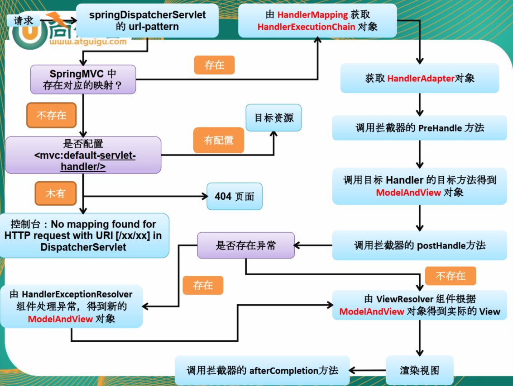


### SpringMVC整合到Spring

* 问题引入：
  * 需要进行Spring整合SpringMVC?
  * 还是否需要再加入Spring的IOC容器？
  * 是否需要在web.xml文件中配置启动SpringIOC的ContextLoaderListener?
* 回答：
  * 需要：通常情况下，类似于数据源，事务，整合其他框架都是房子Spring的配置文件中，而不是放在springmvc的配置文件中，而且实际上放入Spring配置文件对应的IOC容器的还有很多其他的Service和DAO
  * 不需要：都放在SpringMVC的配置文件中，也可以分为多个Spring的配置文件，然后使用import节点导入其他的配置文件

* 整合过程：
  只需要在web.xml中配置SpringIoc容器启动的Listener和配置文件的参数

  ```xml
  <?xml version="1.0" encoding="UTF-8"?>
  <web-app xmlns="http://xmlns.jcp.org/xml/ns/javaee"
           xmlns:xsi="http://www.w3.org/2001/XMLSchema-instance"
           xsi:schemaLocation="http://xmlns.jcp.org/xml/ns/javaee http://xmlns.jcp.org/xml/ns/javaee/web-app_4_0.xsd"
           version="4.0">
     <!--中文乱码问题解决-->
      <filter>
          <filter-name>characterEncodingFilter</filter-name>
          <filter-class>org.springframework.web.filter.CharacterEncodingFilter</filter-class>
          <init-param>
              <param-name>encoding</param-name>
              <param-value>UTF-8</param-value>
          </init-param>
          <init-param>
              <param-name>forceEncoding</param-name>
              <param-value>true</param-value>
          </init-param>
      </filter>
      <filter-mapping>
          <filter-name>characterEncodingFilter</filter-name>
          <url-pattern>/*</url-pattern>
      </filter-mapping>

      <!--将post请求转换成delete请求或者put请求-->
      <filter>
          <filter-name>HiddenHttpMethodFilter</filter-name>
          <filter-class>org.springframework.web.filter.HiddenHttpMethodFilter</filter-class>
      </filter>
      <filter-mapping>
          <filter-name>HiddenHttpMethodFilter</filter-name>
          <url-pattern>/*</url-pattern>
      </filter-mapping>

      <servlet>
          <servlet-name>springDispatcherServlet</servlet-name>
          <servlet-class>org.springframework.web.servlet.DispatcherServlet</servlet-class>
          <init-param>
              <param-name>contextConfigLocation</param-name>
              <param-value>classpath:springmvc.xml</param-value>
          </init-param>
          <!--实际上也可以不通过contextConfigLocation来配置SpringMVC的配置文件，
              而使用默认的配置文件：/WEB-INF/<servlet-name>-servlet.xml
              即：在WEB-INF目录下放springDispatcherServlet-servlet.xml文件
          -->
          <load-on-startup>1</load-on-startup>
      </servlet>

      <servlet-mapping>
          <servlet-name>springDispatcherServlet</servlet-name>
          <url-pattern>/</url-pattern>
      </servlet-mapping>

      <!--Spring启动的Listener-->
      <context-param>
          <param-name>contextConfigLocation</param-name>
          <param-value>classpath:applicationContext.xml</param-value>
      </context-param>
      <listener>
          <listener-class>org.springframework.web.context.ContextLoaderListener</listener-class>
      </listener>
  </web-app>
  ```

* 但是这里有一个问题：当Spring的IOC容器和SpringMVC的IOC容器扫描的包有重合的部分，就会导致有些bean会被创建2次
  解决：
  * 方式一：将不同业务的包分开，使得Spring的IOC容器和SpringMVC的IOC容器扫描的包没有重合的部分
  * 方式二：使用exclude-filter的include-filter子节点来规定只能扫描的注解

* 方式二解决示例：
  1. 在springmvc配置文件扫描注解设置为：

      ```xml
      <context:component-scan base-package="com.suftz" use-default-filters="false">
          <context:include-filter type="annotation" expression="org.springframework.stereotype.Controller" />
          <context:include-filter type="annotation" expression="org.springframework.web.bind.annotation.ControllerAdvice" />
      </context:component-sacn>
      ```

  2. 在spring配置文件扫描注解设置为：

      ```xml
      <context:component-scan base-package="com.suftz">
          <context:exclude-filter type="annotation" expression="org.springframework.stereotype.Controller" />
          <context:exclude-filter type="annotation" expression="org.springframework.web.bind.annotation.ControllerAdvice" />
      </context:component-sacn>
      ```

### SpringMVC中的IOC容器与Spring中的IOC容器的关系

* 可以测试：
* SpringMVC的IOC容器中的bean可以来引用Spring IOC容器中的bean，但是反过来，Spring IOC容器中的bean却不能引用SpringMVC IOC容器中的bean

* 在 Spring MVC 配置文件中引用业务层的 Bean
  * 多个 Spring IOC 容器之间可以设置为父子关系，以实现良好的解耦。
  * Spring MVC WEB 层容器可作为 “业务层” Spring容器的子容器：即 WEB 层容器可以引用业务层容器的 Bean，而业务层容器却访问不到 WEB 层容器的 Bean

### SpringMVC 对比 Struts2

1. Spring MVC 的入口是 Servlet, 而 Struts2 是 Filter
2. Spring MVC 会稍微比 Struts2 快些. Spring MVC 是基于方法设计, 而 Sturts2 是基于类, 每次发一次请求都会实例一个 Action.
3. Spring MVC 使用更加简洁, 开发效率Spring MVC确实比 struts2 高: 支持 JSR303, 处理 ajax 的请求更方便
4. Struts2 的 OGNL 表达式使页面的开发效率相比Spring MVC 更高些