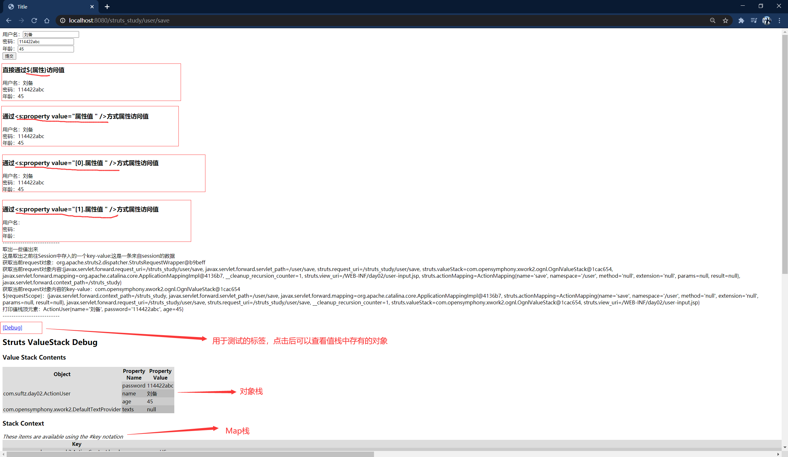
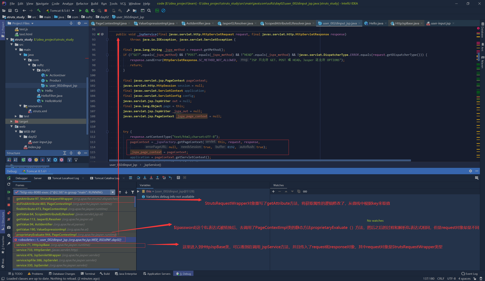
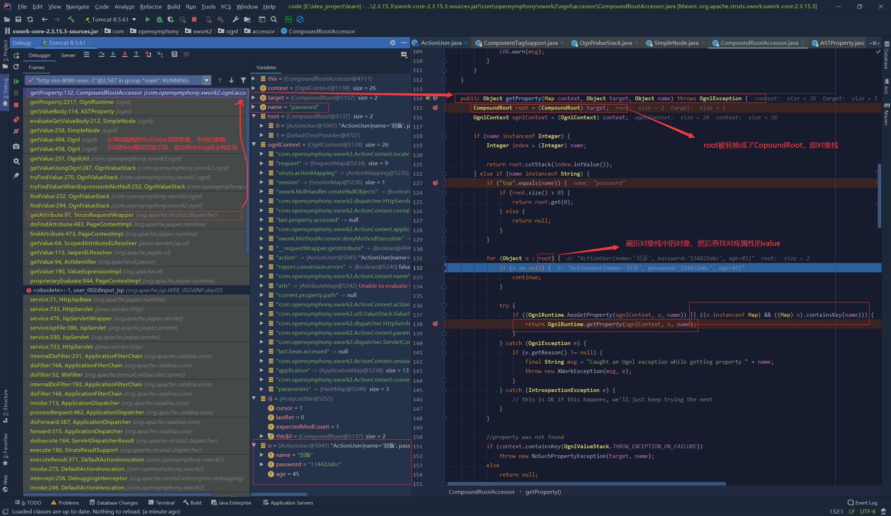
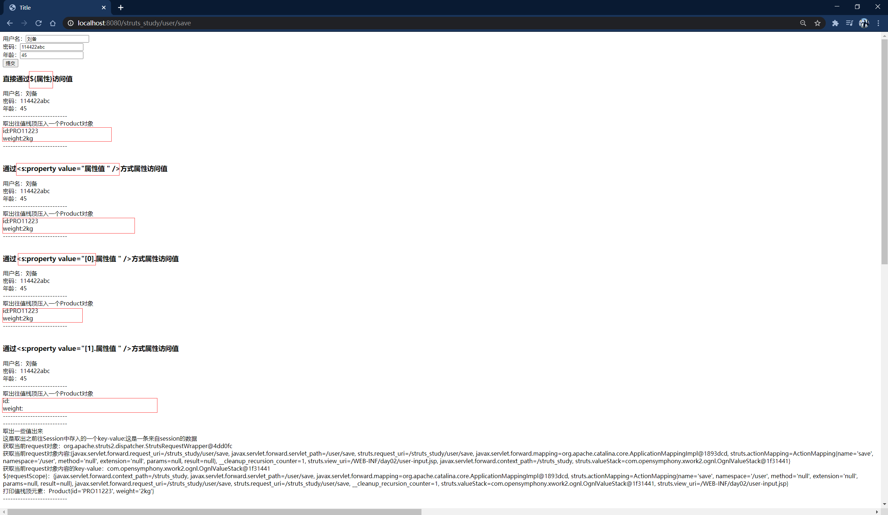
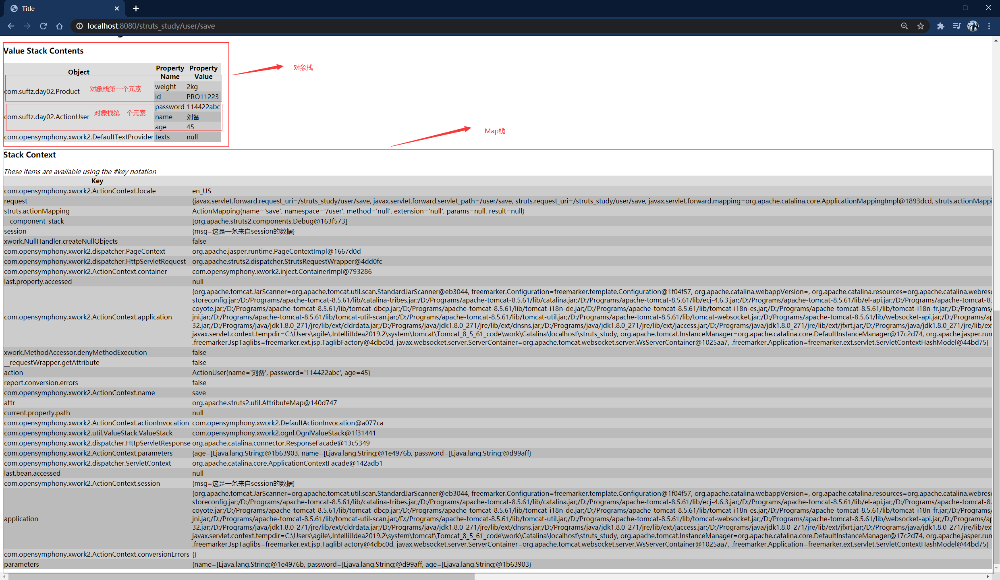
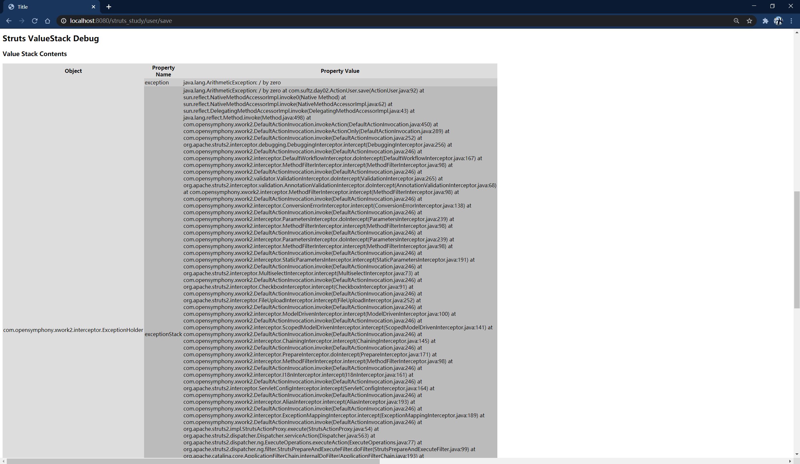
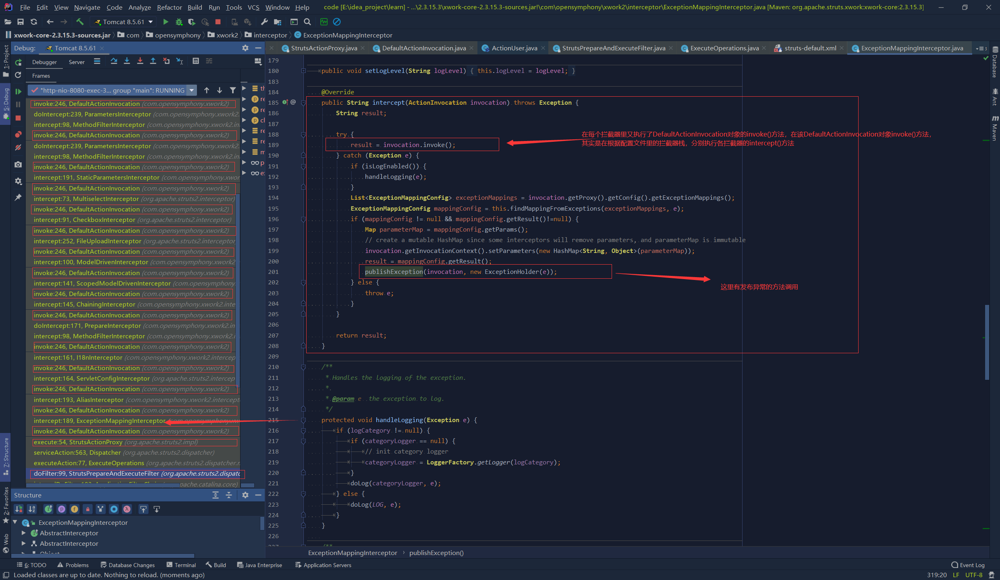
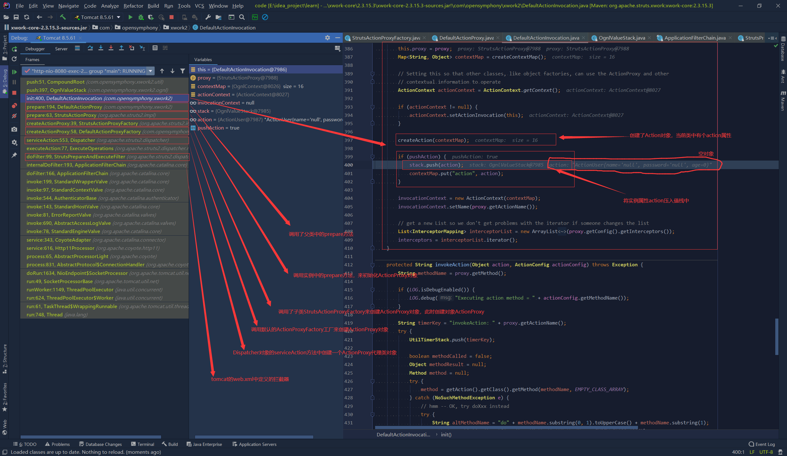

# Struts2基础

[TOC]

## Struts2概述

### 问题引入：Filter作为控制器的MVC应用

* 实现MVC(Model、View、Control):
  1. 模型：封装应用程序的数据和业务逻辑POJO(Plain Old Java Object)
  2. 视图：实现应用程序的信息显示功能（JSP）
  3. 控制器：接收来自用户的输入，调用模型层，响应对应的视图组件（Servlet,Filter）

* Filter相比Servlet而言，可以完成Servlet所有的功能，也能拿到Servlet中所有的预定义变量，但是Filter可以拦截请求，Filter中有一个FilterChain对象，这是Servlet中没有的。因此使用Filter作为控制器更好，可以方便的在应用程序里对所有资源(包括静态资源)进行控制访问

* 使用Filter作为控制器处理业务示例

  Filter实现类如下：

  ```java
  package com.suftz;

  import javax.servlet.*;
  import javax.servlet.http.HttpServletRequest;
  import java.io.IOException;

  public class HelloFilter implements Filter {

      @Override
      public void init(FilterConfig filterConfig) throws ServletException {

      }

      @Override
      public void doFilter(ServletRequest request, ServletResponse response, FilterChain chain) throws IOException, ServletException {
          request.setCharacterEncoding("utf-8");
          HttpServletRequest req=(HttpServletRequest) request;
          String uri=req.getServletPath();
          if("/hello".equals(uri)){
              request.getRequestDispatcher("/WEB-INF/index.jsp").forward(request,response);
          }
          if("/save".equals(uri)){
              request.getRequestDispatcher("/WEB-INF/index.jsp").forward(request,response);
          }
      }

      @Override
      public void destroy() {

      }
  }
  ```

  JSP页面如下：

  ```java
  <%@ page pageEncoding="UTF-8" contentType="text/html;charset=UTF-8" language="java" %>
  <html>
    <head>
      <title>$Title$</title>
      <base href="<%=request.getContextPath()%>/">
      <meta charset="UTF-8">
    </head>
    <body>
    <form action="save" method="post">
      用户名：<input name="name" value="${param.name}"><br>
      密码：<input name="age" value="${param.age}"><br>
      <input type="submit" value="提交">
    </form>
    <% if(request.getParameter("name")!=null||request.getParameter("age")!=null){ %>
      用户名：${param.name}<br>
      密码：${param.age}<br>
     <%   }%>

    </body>
  </html>
  ```

### 认识Struts2

* Struts2是用来开发MVC应用程序的框架，它提供了Web应用程序开发过程中一些常见问题的解决方案：
  1. 对来自用户的输入数据进行合法性验证
  2. 统一的布局
  3. 国际化和本地化
  4. 支持Ajax
  5. 表单的重复提交
  6. 文件的上传下载
  7. ...

* Struts2 VS Struts1:
  1. 类更少，更高效：在Struts2中无需使用ActionForm来封装请求参数
  2. 扩展更容易：Struts2通过拦截器完成了框架的大部分工作，在Struts2中插入一个拦截器对象十分简便
  3. 更容易测试：不使用浏览器前端，也可以对基于Struts2的应用进行测试
  4. Struts2本质不是从Struts1扩展而来，是从WebWork发展而来的

* 从Struts1升级到Struts2：
  1. Struts1里使用ActionServlet作为控制器，Struts2使用一个过滤器作为控制器
  2. Struts1中每个前端表单都对应一个ActionForm实例，Struts2中表单被直接映射到一个POJO
  3. Struts1的验证逻辑编写在ActionForm中，Struts2中验证逻辑编写在Action中
  4. Struts2在页面里面使用OGNL来显示各种对象模型，可以不再使用EL和JSTL

### 搭建Struts2环境

1. 加入依赖包：可以使用Maven或者去官网下载依赖包，官网有示例项目，直接使用里面lib下的包即可，需要注意的是：不同版本最少依赖包的个数不同，对包的依赖也不一样。而且，不同版本可能区别很大，学习也不太一样，因为Struts2是很严重的漏洞，在Struts2 2.3之前的版本中存在问题，最新版本的Struts2框架可能有些区别
   >Struts的漏洞处理机制常被诟病，一来OGNL的功能强大和请求处理机制极易产生远程执行问题，二来开发组对漏洞处理能力不足，要么修复后仍可以绕过，要么无法修复而长期闲置处理。
2. maven下载：

   ```xml
   <?xml version="1.0" encoding="UTF-8"?>
   <project xmlns="http://maven.apache.org/POM/4.0.0"
            xmlns:xsi="http://www.w3.org/2001/XMLSchema-instance"
            xsi:schemaLocation="http://maven.apache.org/POM/4.0.0 http://maven.apache.org/xsd/maven-4.0.0.xsd">
       <modelVersion>4.0.0</modelVersion>

       <groupId>groupId</groupId>
       <artifactId>struts_study</artifactId>
       <version>1.0-SNAPSHOT</version>
       <dependencies>
           <dependency>
               <groupId>org.apache.struts</groupId>
               <artifactId>struts2-core</artifactId>
               <version>2.3.15.3</version>
           </dependency>
   </dependencies>

       <build>
           <finalName>struts</finalName>
       </build>
   </project>
   ```

   >Struts2还依赖其他的包，但是Maven这样写即可，其他的包也会被自动添加进来。但是不同版本(最新的版本)可能不太一样，可能还需要手动添加其他的一些不会被自动加入的依赖包

3. 或者手动下载，最少依赖的包如下：
   

4. 在web.xml文件中配置struts2：可以直接复制Struts2-all.zip里面的示例项目，示例的空项目里面有配置文件，也可自己阅读配置信息自己写，就是将Struts2中提供的Filter配置到Tomcat中，如下：

   ```xml
   <?xml version="1.0" encoding="UTF-8"?>
   <web-app xmlns="http://xmlns.jcp.org/xml/ns/javaee"
            xmlns:xsi="http://www.w3.org/2001/XMLSchema-instance"
            xsi:schemaLocation="http://xmlns.jcp.org/xml/ns/javaee http://xmlns.jcp.org/xml/ns/javaee/web-app_4_0.xsd"
            version="4.0">
       <filter>
           <filter-name>struts2</filter-name>
           <filter-class>org.apache.struts2.dispatcher.ng.filter.StrutsPrepareAndExecuteFilter</filter-class>
       </filter>
       <filter-mapping>
           <filter-name>struts2</filter-name>
           <url-pattern>/*</url-pattern>
       </filter-mapping>

       <welcome-file-list>
           <welcome-file>index.jsp</welcome-file>
           <welcome-file>index.html</welcome-file>
       </welcome-file-list>
   </web-app>
   ```

   > 需要注意的是，不同版本的Struts2中,filter-class的全类名可能有所不同，要灵活思考问题

5. 在当前web应用的classPath下添加struts2的配置文件struts.xml，作为初学者可以直接复制空项目中的配置文件，如下：

   ```xml
   <?xml version="1.0" encoding="UTF-8"?>

   <!DOCTYPE struts PUBLIC
           "-//Apache Software Foundation//DTD Struts Configuration 2.0//EN"
           "http://struts.apache.org/dtds/struts-2.3.dtd">

   <struts>
       <package name="hello" extends="struts-default">
           <!--最简单的一个处理请求，当请求为/工程名/hello，则(转发)显示WEB-INF/index.jsp页面-->
           <action name="hello">
               <result>/WEB-INF/index.jsp</result>
           </action>
           <action name="save">
               <result>/WEB-INF/index.jsp</result>
           </action>
       </package>
   </struts>
   ```

6. 在idea中，还需要将struts-default.xml和struts.xml一起关联，不然配置文件会报红(可能对启动项目没有影响)，这个struts-default.xml是对配置的默认设置。当在struts.xml中没有配置某个属性时，struts2就会使用struts-default中的默认配置
   

7. 在idea中，在配置struts.xml时，可能会配置action动作为请求转发，转发到一个资源文件中，此时可能会出现无法识别资源地址而报红的情况(可能并不影响项目启动)，解决步骤如下：
   

## Struts2基本使用

* 配置文件简单的使用介绍：

  ```xml
  <?xml version="1.0" encoding="UTF-8"?>

  <!DOCTYPE struts PUBLIC
          "-//Apache Software Foundation//DTD Struts Configuration 2.0//EN"
          "http://struts.apache.org/dtds/struts-2.3.dtd">

  <struts>
      <!--package，包，struts2使用package来组织模块
      name属性：必须，用于其他的包应用当前包
      extends :继承哪个包，填入的值是其他package的name属性值,通常继承struts-default
      -->
      <package name="hello" extends="struts-default">
          <!--简单介绍
          action:就是一个请求
          name:对应请求的url，hello等于是访问http://localhost:8080/工程名/hello  ,这里省略了"/"和contextPath,相当于是省去了/的servletPath
               这里也省略了扩展名".action",也就是说，当地址栏输入：
               http://localhost:8080/struts_study/hello
               http://localhost:8080/struts_study/hello.action
               它们访问的都是同一个资源，都会进来这个action,都会被转发到index.jsp
          result:结果.
          -->
          <action name="hello">
              <result>/WEB-INF/index.jsp</result>
          </action>
          <action name="save">
              <result>/WEB-INF/index.jsp</result>
          </action>
          <!--以上两个的功能，和上面自己手写实现Filter接口，是相同的作用和效果-->
      </package>
  </struts>
  ```

* 对比自实现控制器，Struts:
  1. 搭建Struts2的开发环境
  2. 不需要显式定义Filter,而使用struts2的配置文件
  3. jsp页面更简单，步骤：
     配置文件写成：

     ```xml
     <?xml version="1.0" encoding="UTF-8"?>

     <!DOCTYPE struts PUBLIC
             "-//Apache Software Foundation//DTD Struts Configuration 2.0//EN"
             "http://struts.apache.org/dtds/struts-2.3.dtd">

     <struts>
         <!--package，包，struts2使用package来组织模块
         name属性：必须，用于其他的包应用当前包
         extends :继承哪个包，填入的值是其他package的name属性值,通常继承struts-default
         -->
         <package name="hello" extends="struts-default">
             <!--简单介绍
             action:就是一个请求
             name:对应请求的url，hello等于是访问http://localhost:8080/工程名/hello  ,这里省略了"/"和contextPath,相当于是省去了/的servletPath
                  这里也省略了扩展名".action",也就是说，当地址栏输入：
                  http://localhost:8080/struts_study/hello
                  http://localhost:8080/struts_study/hello.action
                  它们访问的都是同一个资源，都会进来这个action,都会被转发到index.jsp
             result:结果.
             -->
             <action name="hello">
                 <result>/WEB-INF/index.jsp</result>
             </action>
     <!--        <action name="save">-->
     <!--            <result>/WEB-INF/index.jsp</result>-->
     <!--        </action>-->
             <action name="save" class="com.suftz.Hello" method="save"><!--method不指定,则执行execute,返回值应是success-->
                 <result name="save">/WEB-INF/index.jsp</result>
             </action>
         </package>
     </struts>
     ```

     新添加一个类Hello.java如下：

     ```java
     package com.suftz;

     public class Hello {
         private String name;
         private int age;

         public Hello() {
         }

         public Hello(String name, int age) {
             this.name = name;
             this.age = age;
         }

         public String getName() {
             return name;
         }

         public void setName(String name) {
             this.name = name;
         }

         public int getAge() {
             return age;
         }

         public void setAge(int age) {
             this.age = age;
         }
         public String save(){
             return "save";
         }
     }
     ```

     jsp页面修改成：

     ```java
     <%@ page pageEncoding="UTF-8" contentType="text/html;charset=UTF-8" language="java" %>
     <html>
     <head>
       <title>$Title$</title>
       <base href="<%=request.getContextPath()%>/">
       <meta charset="UTF-8">
     </head>
     <body>
     <form action="save" method="post">
       用户名：<input name="name" value="${name}"><br>
       密码：<input name="age" value="${age}"><br>
       <input type="submit" value="提交">
     </form>
     <% if(request.getParameter("name")!=null||request.getParameter("age")!=null){ %>
     用户名：${name}<br>
     密码：${age}<br>
     <%   }%>

     </body>
     </html>
     ```

     可以看出，jsp页面上使用参数，不用写域对象，struts封装了提取参数值的方式，其实，此页面上的request,已经不是之前jsp页面上的那个对象了，可以通过输出打印可知，此时的request是org.apache.struts2.dispatcher.StrutsRequestWrapper的实例，使得取值更方便
  4. 通过配置action标签中的method属性，以及result标签，即可完成将请求转发到Hello类中的save方法中执行，且result标签可以指定处理后进行哪些操作，上面的配置表明是进行请求转发，而这一系列步骤只需要配置一个action标签完成
  5. result:结果，表示action方法执行后可能返回的一个结果，所以一个action节点可能会有多个result子节点，多个result子节点使用name来区分，name=save表示Hello类中的save()方法执行后返回"save"字符串后，进行的处理方式；也可能返回其他字符串，就需要进行其他处理
  6. name:标识一个result，和action方法的返回值对应，默认值为success
  7. org.apache.struts2.dispatcher.StrutsRequestWrapper类的继承结构
   
   它重写了getParameter()方法，使得在jsp页面上引用request域对象中的数据更方便(从值栈ValueStack中取出的参数值)
  8. package标签中的namespace属性作用：

     ```xml
     <package name="hello" namespace="book" extends="struts-default">
        <action name="save">
        </action>
     </package>
     ```

     此时请求进入到此action的前提是地址栏输入地址为：`http://localhost:8080/struts_study/book/save`或者`http://localhost:8080/struts_study/book/save.action`

  9. 同一个Action类可以包含多个action方法
  10. Struts2会为每个HTTP请求创建一个新的Action实例，即Action不是单例的，线程安全

## Action

* action:应用程序可以完成的每一步操作，例如：显示一个登陆表单，把产品信息保存起来

* Action类：普通的Java类，可以有属性和方法，同时必须遵守下面这些规则：
  1. 属性的名字必须遵守与JavaBeans属性名相同的命名规则。属性的类型可以是任意类型，从字符串到非字符串(基本数据类型)之间的数据转换可以自动发送
  2. 必须有一个不带参的构造器
  3. 至少有一个供struts在执行action时调用的方法
  4. 同一个Action类可以包含多个action方法
  5. Struts2会为每一个HTTP请求创建一个新的Action实例

  ```xml
  <?xml version="1.0" encoding="UTF-8"?>

  <!DOCTYPE struts PUBLIC
          "-//Apache Software Foundation//DTD Struts Configuration 2.0//EN"
          "http://struts.apache.org/dtds/struts-2.3.dtd">

  <struts>
      <package name="hello" extends="struts-default">
          <action name="hello">
              <result>/WEB-INF/index.jsp</result>
          </action>
          <action name="save" class="com.suftz.Hello" method="save">
              <result name="success">/WEB-INF/index.jsp</result>
              <result name="failed">/error.jsp</result>
          </action>

          <action name="delete" class="com.suftz.Hello" method="delete">
              <result name="success">/WEB-INF/index.jsp</result>
              <result name="failed">/error.jsp</result>
          </action>
      </package>
  </struts>
  ```

  ```java
  package com.suftz;

  public class Hello {
      private String name;
      private Integer age;

      public Hello() {
      }

      public Hello(String name, int age) {
          this.name = name;
          this.age = age;
      }

      public String getName() {
          return name;
      }

      public void setName(String name) {
          this.name = name;
      }

      public int getAge() {
          return age;
      }

      public void setAge(int age) {
          this.age = age;
      }
      public String save(){
          if(name!=null&&age!=null){
              return "success";
          }else{
              return "failed";
          }
      }

      public String delete() throws Exception {
          if(name!=null&&age!=null){
              return "success";
          }else{
              return "failed";
          }
      }
  }
  ```

## 在Action中访问WEB资源

* 什么是web资源？
  HttpServletRequest,HttpSession,ServletContext等原生Servlet API

* 为什么要访问WEB资源？
  B/S应用中Controller中有需要访问web资源的需求，向域对象中读写属性，读写Cookie等等

* 如何访问？
  1. 和Servlet API解耦方式(只能访问有限的Servlet API对象，且只能访问其有限的方法，如读写属性，获取请求参数，session操作):
     * 使用ActionContext
     * 实现XxxAware接口
  2. 和Servlet API耦合的方式(可以访问更多Servlet API对象，且可以调用原生方法)：
     * 使用ServletActionContext
     * 实现ServletXxxAware接口

* 通过ActionContext访问Web资源
  ActionContext是Action执行的上下文对象，在ActionContext中保存了Action执行所需要的所有对象，包括parameters,request,session,application等
  1. 获取HttpSession对应的Map对象：public Map getSession()
  2. 获取ServletContext对应的Map对象：public Map getApplication()
  3. 获取请求参数对应的Map对象：public Map getParameter()
  4. 获取HttpServeltRequest对应的Map对象：public Object get(Object key)
     >传参"request"即可获取

  ```java
   public String execute(){
       ActionContext actionContext=ActionContext.getContext();
       Map<String,Object> applictionMap =actionContext.getApplication();
       applictionMap.put("key1","applicationvalue1");
       Map<String,Object> sessionMap=actionContext.getSession();
       sessionMap.put("key1","sessionvalue1");
       Map<String,Object> request=(Map<String,Object>)actionContext.get("request");
       request.put("key1","requestvalue1");

       //parameters这个Map只能读，不能写入数据；如果写入，不报错，但也不起作用
       Map<String,Object> parameters=actionContext.getParameters();//其实value是个String[],但是方法定义的就是返回Object
       System.out.println(Arrays.toString((String[])parameters.get("name")));
       System.out.println(Arrays.toString((String[])parameters.get("age")));
       return "success";
   }
  ```

* 通过Aware接口获取web资源

  ```java
  package com.suftz;

  import com.opensymphony.xwork2.ActionContext;
  import org.apache.struts2.interceptor.ApplicationAware;
  import org.apache.struts2.interceptor.RequestAware;
  import org.apache.struts2.interceptor.SessionAware;

  import java.util.Arrays;
  import java.util.Map;

  public class Hello implements ApplicationAware, SessionAware, RequestAware {
      private String name;
      private Integer age;
      private Map<String,Object> application;
      private Map<String,Object> session;
      private Map<String,Object> request;
      public Hello() {
      }

      public Hello(String name, int age) {
          this.name = name;
          this.age = age;
      }

      public String getName() {
          return name;
      }

      public void setName(String name) {
          this.name = name;
      }

      public int getAge() {
          return age;
      }

      public void setAge(int age) {
          this.age = age;
      }
      public String save(){
          //ActionContext
          if(name!=null&&age!=null){
              return "success";
          }else{
              return "failed";
          }
      }

      public String delete() throws Exception {
          if(name!=null&&age!=null){
              return "success";
          }else{
              return "failed";
          }
      }
      public String execute(){
          application.put("key1","_applictionValue1");
          return "success";
      }

      @Override
      public void setApplication(Map<String, Object> application) {
          this.application=application;
      }

      @Override
      public void setRequest(Map<String, Object> request) {
          this.request=request;
      }

      @Override
      public void setSession(Map<String, Object> session) {
          this.session=session;
      }
  }
  ```

  > 这种方式更适合在一个Action类中有多个action方法的情况，这样就不用每个方法体内独自去获取web资源
  > session对应的Map实际上是SessionMap类型的，强转后若调用其invalidate()方法，可以使session失效

* 通过ServletActionContext访问web资源
  直接访问Servlet API将使Action与Servlet环境耦合在一起，测试时需要有Servlet容器，不便于Action的单元测试
  1. 直接获取HttpServletRequest对象：ServletActionContext.getRequest()
  2. 获取HttpSession对象：ServletActionContext.getRequest().getSession()
  3. 直接获取ServletContext对象：ServletActionContext.getServletContext()

* 通过ServletXxxAware接口访问web资源（耦合）

  ```java
  package com.suftz;

  import org.apache.struts2.ServletActionContext;
  import org.apache.struts2.interceptor.ServletRequestAware;
  import org.apache.struts2.interceptor.ServletResponseAware;
  import org.apache.struts2.util.ServletContextAware;

  import javax.servlet.ServletContext;
  import javax.servlet.ServletResponse;
  import javax.servlet.http.HttpServletRequest;
  import javax.servlet.http.HttpServletResponse;
  import javax.servlet.http.HttpSession;

  public class HelloWorld implements ServletRequestAware, ServletContextAware, ServletResponseAware {

      HttpServletRequest request;
      HttpSession httpSession;
      ServletContext servletContext;
      HttpServletResponse response;
      public String execute(){
          HttpServletRequest request=ServletActionContext.getRequest();
          HttpSession httpSession=ServletActionContext.getRequest().getSession();
          ServletContext servletContext=ServletActionContext.getServletContext();
          request.setAttribute("key1","helloworld");
          return "success";
      }

      @Override
      public void setServletRequest(HttpServletRequest request) {
          this.request=request;
          System.out.println(request);
      }

      @Override
      public void setServletContext(ServletContext context) {
          this.servletContext=context;
          System.out.println(context);
      }
      //这不是实现接口方法
      public void setHttpSession(){
          this.httpSession=this.request.getSession();
          System.out.println(this.httpSession);
      }

      @Override
      public void setServletResponse(HttpServletResponse response) {
          this.response=response;
          System.out.println(response);
      }
  }
  ```

  >在执行action方法时，实现的接口方法都会被执行执行，来注入这些web对象到Action实例中

## Struts2参数配置

Struts2有一个默认的配置文件，里面有一些默认的参数设置，default.properties文件在struts2-core-2.3.15.3.jar文件中的org/apache/struts2/default.properties

默认的配置有：

```properties
### 国际化文件的编码
struts.i18n.encoding=UTF-8
### spring的配置
struts.objectFactory.spring.autoWire = name
### spring的class缓存
struts.objectFactory.spring.useClassCache = true
struts.objectFactory.spring.autoWire.alwaysRespect = false
### 文件上传
struts.multipart.parser=jakarta
struts.multipart.saveDir=
struts.multipart.maxSize=2097152
### 这就是为什么action name="hello" 可以处理hello.action ，也可以处理hello
struts.action.extension=action,,
struts.serve.static=true
struts.serve.static.browserCache=true
struts.enable.DynamicMethodInvocation = false
struts.enable.SlashesInActionNames = false
struts.mapper.action.prefix.enabled = false
struts.mapper.action.prefix.crossNamespaces = false
struts.tag.altSyntax=true
struts.devMode = false
struts.i18n.reload=false
struts.ui.theme=xhtml
struts.ui.templateDir=template
struts.ui.templateSuffix=ftl
struts.configuration.xml.reload=false
struts.velocity.configfile = velocity.properties
struts.velocity.contexts =
struts.velocity.toolboxlocation=
struts.url.http.port = 80
struts.url.https.port = 443
struts.url.includeParams = none
struts.dispatcher.parametersWorkaround = false
struts.freemarker.templatesCache=false
struts.freemarker.beanwrapperCache=false
struts.freemarker.wrapper.altMap=true
struts.freemarker.mru.max.strong.size=0
struts.xslt.nocache=false
struts.mapper.alwaysSelectFullNamespace=false
struts.ognl.allowStaticMethodAccess=false
struts.el.throwExceptionOnFailure=false
struts.ognl.logMissingProperties=false
struts.ognl.enableExpressionCache=true
struts.handle.exception=true
```

* 也可以根据需要在struts.xml文件中进行设置，修改这些参数(常量)的默认值

  ```xml
  <?xml version="1.0" encoding="UTF-8"?>

  <!DOCTYPE struts PUBLIC
          "-//Apache Software Foundation//DTD Struts Configuration 2.0//EN"
          "http://struts.apache.org/dtds/struts-2.3.dtd">

  <struts>
      <package name="hello" extends="struts-default">
          <action name="hello">
              <result>/WEB-INF/index.jsp</result>
          </action>
      </package>
      <!--这样设置后，action name="hello",地址栏输入的地址结尾为hello.action或者hello.do或者hello都能进入该action-->
      <constant name="struts.action.extension" value="action,do,"></constant>
  </struts>
  ```

* action标签如果没有指定class属性值，则执行struts-default.xml文件中设置的class：
  `<default-class-ref class="com.opensymphony.xwork2.ActionSupport" />`

  如果没有指定method属性值，则执行目标class的execute方法

* action标签中的result子标签如果type是默认的几个行为，则会有对应的class来处理这些行为(也是在struts-default.xml中查看)：
  result代表action中处理对象中的方法执行后，可能去的目的地，一个action节点可以配置多个result子节点，result的name属性值对应着action方法可能有的一个返回值
  如下是result标签type的取值列表：

  ```xml
  <result-types>
      <result-type name="chain" class="com.opensymphony.xwork2.ActionChainResult"/>
      <result-type name="dispatcher" class="org.apache.struts2.dispatcher.ServletDispatcherResult" default="true"/>
      <result-type name="freemarker" class="org.apache.struts2.views.freemarker.FreemarkerResult"/>
      <result-type name="httpheader" class="org.apache.struts2.dispatcher.HttpHeaderResult"/>
      <result-type name="redirect" class="org.apache.struts2.dispatcher.ServletRedirectResult"/>
      <result-type name="redirectAction" class="org.apache.struts2.dispatcher.ServletActionRedirectResult"/>
      <result-type name="stream" class="org.apache.struts2.dispatcher.StreamResult"/>
      <result-type name="velocity" class="org.apache.struts2.dispatcher.VelocityResult"/>
      <result-type name="xslt" class="org.apache.struts2.views.xslt.XSLTResult"/>
      <result-type name="plainText" class="org.apache.struts2.dispatcher.PlainTextResult" />
  </result-types>
  ```

  其中，最常用的是四个：
  1. dispatcher(默认的)：转发
  2. chain：转发到一个Action,注意：**不能通过type=dispatcher的方式转发到一个Action**

     ```java
     <result name="test" type="chain">
        <param name="actionName">testAction</param>
        <param name="namespace">/hello</param>
     </result>
     ```

  3. redirect：重定向到一个Action
  4. redirectAction：重定向到一个Action,注意：通过redirect的方式也可以便捷的实现redirectAction的功能

     <result name="index" type="chain">
        <param name="actionName">testAction</param>
        <param name="namespace">/hello</param>
     </result>
     ```

* ActionSupport继承了六个接口，其中五个与开发Struts应用相关：Action, Validateable, ValidationAware, TextProvider, LocaleProvider
* Action:提供了返回信息的几个常量
* Validateable：进行验证请求参数
* ValidationAware：返回错误信息
* TextProvider,LocaleProvider：国际化相关接口

> 在手工完成字段验证，显示错误信息，国际化等情况下，开发者自定义的Action类推荐继承ActionSupport，可以获得更多已定义好的接口方法

## 通配符映射

* 一个web应用可能会有很多个action声明，可以利用struts2提供的通配符映射机制把多个彼此相似的映射关系简化为一个映射关系
* 通配符映射规则：
  1. 若找到多个匹配，没有通配符的那个将被执行
  2. 若指定的动作不存在，Struts将会尝试把URI与任何一个包含着通配符`*`的动作名进行匹配
  3. 被通配符匹配到的URI字符串的子串可以用{1},{2}来引用，{1}匹配第一个子串，{2}匹配第二个子串
  4. {0}匹配整个URI
  5. 若Struts找的带有通配符的匹配不止一个，则按先后顺序进行匹配
  6. `*`可以匹配零个或多个字符，但不包括`/`字符，如果想把`/`字符包括在内，需要使用`**`,如果需要对某个字符进行转义，需要使用`\`

* 如下配置的一组action可以使用通配符写成一个action

```xml
<action name="UserAction-update" class="com.suftz.struts2.UserAction" method="update">
    <result name="update-success">/success.jsp</result>
</action>

<action name="UserAction-save" class="com.suftz.struts2.UserAction" method="save">
    <result name="save-success">/success.jsp</result>
</action>

<action name="UserAction-delete" class="com.suftz.struts2.UserAction" method="delete">
    <result name="delete-success">/success.jsp</result>
</action>

<action name="UserAction-query" class="com.suftz.struts2.UserAction" method="query">
    <result name="query-success">/success.jsp</result>
</action>

<!--上面的四个action可以写成一个-->
<action name="UserAction-*" class="com.suftz.struts2.UserAction" method="{1}">
    <result name="{1}-success">/success.jsp</result>
</action>
```

## 动态方法调用

* 通过url动态调用Action中的方法
* 格式：
  localhost:8080/struts_study/user!save.action
* 格式解释：去执行user.action中的save方法，而不去执行struts.xml中设置的method属性值设置的处理方法
* 默认情况下，Struts的动态方法调用处于禁用状态(在default.properties中)：
  struts.enable.DynamicMethodInvocation = false
  可以在struts.xml中自己设置打开动态方法调用：

  ```xml
  <struts>
        <constant name="struts.enable.DynamicMethodInvocation" value="true"></constant>
  </struts>
  ```

## 值栈

### ValueStack

* 在ValueStack对象的内部有两个逻辑部分：
  1. ObjectStack：Struts把Action和相关对象压入ObjectStack中
  2. ContextMap：Struts把各种各样的映射关系(一些Map类型的对象)压入ContextMap中，实际上就是对ActionContext的一个引用

* Struts会把下面这些映射压入ContextMap中
  1. parameters：该Map中包含当前请求的请求参数
  2. request：该Map中包含当前request对象中的所有属性
  3. session：该Map中包含当前session对象中的所有属性
  4. application：该Map中包含当前application对象中的所有属性
  5. attr：该Map按如下顺序来检索某个属性：request,session,application

* ValueStack，即值栈，在Struts2中是以OgnlValueStack类来包装的，里面有对象栈CompoundRoot类，也有一个上下文Map对象(运行时对象是OgnlContext类型)
* ObjectStack,即对象栈，在Struts2中是以CompoundRoot类来包装的，这个类继承了ArrayList,即是一个List集合，会将Action类以及其他相关对象压入CompoundRoot，当然也可以自己获取值栈后，写入一个对象到栈中，放入的位置就是CompoundRoot对象里

* ContextMap，即上下文Map，将各种与请求或者Servlet或者application相关的对象放入到该Map,在Struts2中是以OgnlContext类来包装的，这个类实现了Map接口，即本质是一个Map集合，里面放的各种key-value，其中value也是一个Map对象，比如requestMap,sessionMap等

* 值栈中的属性值：
  * 对于对象栈：对象栈中某一个对象的属性值
  * Map栈：request,session,application的一个属性值或一个请求参数的值

### 读取ObjectStack里的对象的属性

* 如想访问ObjectStack里的某个对象的属性，可以使用如下几种方式之一：
  * `object.propertyName`
  * `object["propertyName"]`
  * `object['propertyName']`
* `ObjectStack`里的对象可以通过一个从零开始的下标索引方式来引用
  `ObjectStack`里的栈顶对象可以用`[0]`来引用，它下面的那个对象可以用`[1]`引用，若希望返回栈顶对象的message属性值：`[0].message` 或 `[0]["message"]` 或 `[0]['message']`
* 若在指定的对象里没有找到指定的属性，则到指定对象的下一个对象里继续搜索，即[n]的含义是从第n个开始搜索，而不是只搜索第n个对象
* 若从栈顶对象开始搜索，则可以省略下标部分:即`[0].message` 可以写成 `message`
* 一般情况下，属性名没有特殊字符时，不使用方括号来表示

* 示例代码如下：

  ```java
  <%--一定要加入struts标签库才能使用struts的标签--%>
  <%@ taglib prefix="s" uri="/struts-tags" %>
  <%@ page pageEncoding="UTF-8" contentType="text/html;charset=UTF-8" language="java" %>
  <html>
  <head>
      <title>Title</title>
      <%--配置base属性，相对路径自动会加上工程路径名--%>
      <base href="<%=request.getContextPath()%>/">
  </head>
  <body>
  <form action="user/save" method="post">
      用户名：<input name="name" value="${name}"><br><%--value的默认值用于回显数据--%>
      密码：<input name="password" value="${password}"><br>
      年龄：<input name="age" value="${age}"><br>
      <input type="submit" value="提交">
  </form>

  <% if(request.getParameter("name")!=null||request.getParameter("age")!=null){ %>
  <h3>直接通过\${属性}访问值</h3>
  用户名：${name}<br>
  密码：${password}<br>
  年龄：${age}<br>

  <br>
  <h3>通过&lt;s:property value="属性值 " /&gt;方式属性访问值</h3>
  用户名：<s:property value="name" /><br>
  密码：<s:property value="password" /><br>
  年龄：<s:property value="age" /><br>

  <br>
  <h3>通过&lt;s:property value="[0].属性值 " /&gt;方式属性访问值</h3>
  用户名：<s:property value="[0].name" /><br>
  密码：<s:property value="[0].password" /><br>
  年龄：<s:property value="[0].age" /><br>

  <br>
  <h3>通过&lt;s:property value="[1].属性值 " /&gt;方式属性访问值</h3>
  用户名：<s:property value="[1].name" /><br>
  密码：<s:property value="[1].password" /><br>
  年龄：<s:property value="[1].age" /><br>

  --------------------------<br>
  取出一些值出来<br>
  这是取出之前往Session中存入的一个key-value:${msg}<br>
  获取当前request对象：<%=request%><br>
  获取当前request对象内容:${request}<br>
  获取当前request对象内容的key-value：${request["struts.valueStack"]}<br>
  \${requestScope}：${requestScope}<br>
  打印值栈顶元素：${top}<br>
  --------------------------<br>

  <%   }%>

  <s:debug />
  </body>
  </html>
  ```

* struts.xml配置（部分）如下：

  ```xml
  <struts>
      <package name="user" namespace="/user" extends="struts-default">
          <action name="input">
              <result name="success">/WEB-INF/day02/user-input.jsp</result>
          </action>
          <action name="save" class="com.suftz.day02.ActionUser" method="save">
              <result name="success">/WEB-INF/day02/user-input.jsp</result>
          </action>
      </package>
  </struts>
  ```

* ActionUser 类如下：

  ```java
  package com.suftz.day02;

  import com.opensymphony.xwork2.ActionContext;
  import com.opensymphony.xwork2.util.ValueStack;

  import javax.servlet.http.HttpSession;
  import java.util.Map;

  public class ActionUser {
      private String name;
      private String password;
      private int age;

      public ActionUser() {
      }

      public ActionUser(String name, String password, int age) {
          this.name = name;
          this.password = password;
          this.age = age;
      }

      public String getName() {
          return name;
      }

      public void setName(String name) {
          this.name = name;
      }

      public String getPassword() {
          return password;
      }

      public void setPassword(String password) {
          this.password = password;
      }

      public int getAge() {
          return age;
      }

      public void setAge(int age) {
          this.age = age;
      }

      @Override
      public String toString() {
          return "ActionUser{" +
                  "name='" + name + '\'' +
                  ", password='" + password + '\'' +
                  ", age=" + age +
                  '}';
      }

      public String save(){
          return "success";
      }
  }
  ```

* 浏览器结果如下：

  
    下面的值栈完整截图：
  

* 代码分析：
  1. 从中我们可以看出，直接使用EL表达式也可以获取到对象栈中的对象属性，但是从学习EL表达式可知，除非之前就把各对象的属性放入到域对象中了，但是各对象的属性值都放入域对象，明显是不可取的方法，那是不是把各对象放入域对象呢？也不是，因为这样只能拿到各对象，而不是直接获取对象的属性值
  2. 此时通过<%=request%>可以看到，打印出来的运行时对象是`org.apache.struts2.dispatcher.StrutsRequestWrapper`,并不是Tomcat中提供的HttpServletRequest对象实例。此时当在jsp页面上使用EL表达式来获取变量值时，不是去传统的域对象中去寻找，可以通过查看源码看出，`StrutsRequestWrapper重写了getAttribute()`

* 如下分析jsp页面中第11行EL表达式`${password}`是如何被取值的：
  1. 首先要明白的就是，每一个jsp页面都对应着有一个由tomcat生成的Servlet类以及字节码class文件，可以找到如下：

     ```java
     /*
      * Generated by the Jasper component of Apache Tomcat
      * Version: Apache Tomcat/8.5.61
      * Generated at: 2021-01-15 05:58:07 UTC
      * Note: The last modified time of this file was set to
      *       the last modified time of the source file after
      *       generation to assist with modification tracking.
      */
     package org.apache.jsp.WEB_002dINF.day02;

     import javax.servlet.*;
     import javax.servlet.http.*;
     import javax.servlet.jsp.*;

     public final class user_002dinput_jsp extends org.apache.jasper.runtime.HttpJspBase
             implements org.apache.jasper.runtime.JspSourceDependent,
             org.apache.jasper.runtime.JspSourceImports {

         private static final javax.servlet.jsp.JspFactory _jspxFactory =
                 javax.servlet.jsp.JspFactory.getDefaultFactory();

         private static java.util.Map<java.lang.String,java.lang.Long> _jspx_dependants;

         static {
             _jspx_dependants = new java.util.HashMap<java.lang.String,java.lang.Long>(2);
             _jspx_dependants.put("/WEB-INF/lib/struts2-core-2.3.15.3.jar", Long.valueOf(1610497816882L));
             _jspx_dependants.put("jar:file:/E:/idea_project/study/bin/artifacts/struts_study_war_exploded/WEB-INF/lib/struts2-core-2.3.15.3.jar!/META-INF/struts-tags.tld", Long.valueOf(1381842372000L));
         }

         private static final java.util.Set<java.lang.String> _jspx_imports_packages;

         private static final java.util.Set<java.lang.String> _jspx_imports_classes;

         static {
             _jspx_imports_packages = new java.util.HashSet<>();
             _jspx_imports_packages.add("javax.servlet");
             _jspx_imports_packages.add("javax.servlet.http");
             _jspx_imports_packages.add("javax.servlet.jsp");
             _jspx_imports_classes = null;
         }

         private org.apache.jasper.runtime.TagHandlerPool _005fjspx_005ftagPool_005fs_005fproperty_0026_005fvalue_005fnobody;
         private org.apache.jasper.runtime.TagHandlerPool _005fjspx_005ftagPool_005fs_005fdebug_005fnobody;

         private volatile javax.el.ExpressionFactory _el_expressionfactory;
         private volatile org.apache.tomcat.InstanceManager _jsp_instancemanager;

         public java.util.Map<java.lang.String,java.lang.Long> getDependants() {
             return _jspx_dependants;
         }

         public java.util.Set<java.lang.String> getPackageImports() {
             return _jspx_imports_packages;
         }

         public java.util.Set<java.lang.String> getClassImports() {
             return _jspx_imports_classes;
         }

         public javax.el.ExpressionFactory _jsp_getExpressionFactory() {
             if (_el_expressionfactory == null) {
                 synchronized (this) {
                     if (_el_expressionfactory == null) {
                         _el_expressionfactory = _jspxFactory.getJspApplicationContext(getServletConfig().getServletContext()).getExpressionFactory();
                     }
                 }
             }
             return _el_expressionfactory;
         }

         public org.apache.tomcat.InstanceManager _jsp_getInstanceManager() {
             if (_jsp_instancemanager == null) {
                 synchronized (this) {
                     if (_jsp_instancemanager == null) {
                         _jsp_instancemanager = org.apache.jasper.runtime.InstanceManagerFactory.getInstanceManager(getServletConfig());
                     }
                 }
             }
             return _jsp_instancemanager;
         }

         public void _jspInit() {
             _005fjspx_005ftagPool_005fs_005fproperty_0026_005fvalue_005fnobody = org.apache.jasper.runtime.TagHandlerPool.getTagHandlerPool(getServletConfig());
             _005fjspx_005ftagPool_005fs_005fdebug_005fnobody = org.apache.jasper.runtime.TagHandlerPool.getTagHandlerPool(getServletConfig());
         }

         public void _jspDestroy() {
             _005fjspx_005ftagPool_005fs_005fproperty_0026_005fvalue_005fnobody.release();
             _005fjspx_005ftagPool_005fs_005fdebug_005fnobody.release();
         }

         public void _jspService(final javax.servlet.http.HttpServletRequest request, final javax.servlet.http.HttpServletResponse response)
                 throws java.io.IOException, javax.servlet.ServletException {

             final java.lang.String _jspx_method = request.getMethod();
             if (!"GET".equals(_jspx_method) && !"POST".equals(_jspx_method) && !"HEAD".equals(_jspx_method) && !javax.servlet.DispatcherType.ERROR.equals(request.getDispatcherType())) {
                 response.sendError(HttpServletResponse.SC_METHOD_NOT_ALLOWED, "JSP 只允许 GET、POST 或 HEAD。Jasper 还允许 OPTIONS");
                 return;
             }

             final javax.servlet.jsp.PageContext pageContext;
             javax.servlet.http.HttpSession session = null;
             final javax.servlet.ServletContext application;
             final javax.servlet.ServletConfig config;
             javax.servlet.jsp.JspWriter out = null;
             final java.lang.Object page = this;
             javax.servlet.jsp.JspWriter _jspx_out = null;
             javax.servlet.jsp.PageContext _jspx_page_context = null;


             try {
                 response.setContentType("text/html;charset=UTF-8");
                 pageContext = _jspxFactory.getPageContext(this, request, response,
                         null, true, 8192, true);
                 _jspx_page_context = pageContext;
                 application = pageContext.getServletContext();
                 config = pageContext.getServletConfig();
                 session = pageContext.getSession();
                 out = pageContext.getOut();
                 _jspx_out = out;

                 out.write("\r\n");
                 out.write("\r\n");
                 out.write("<html>\r\n");
                 out.write("<head>\r\n");
                 out.write("    <title>Title</title>\r\n");
                 out.write("    <base href=\"");
                 out.print(request.getContextPath());
                 out.write("/\">\r\n");
                 out.write("</head>\r\n");
                 out.write("<body>\r\n");
                 out.write("<form action=\"user/save\" method=\"post\">\r\n");
                 out.write("    用户名：<input name=\"name\" value=\"");
                 out.write((java.lang.String) org.apache.jasper.runtime.PageContextImpl.proprietaryEvaluate("${name}", java.lang.String.class, (javax.servlet.jsp.PageContext)_jspx_page_context, null));
                 out.write("\"><br>\r\n");
                 out.write("    密码：<input name=\"password\" value=\"");
                 out.write((java.lang.String) org.apache.jasper.runtime.PageContextImpl.proprietaryEvaluate("${password}", java.lang.String.class, (javax.servlet.jsp.PageContext)_jspx_page_context, null));
                 out.write("\"><br>\r\n");
                 out.write("    年龄：<input name=\"age\" value=\"");
                 out.write((java.lang.String) org.apache.jasper.runtime.PageContextImpl.proprietaryEvaluate("${age}", java.lang.String.class, (javax.servlet.jsp.PageContext)_jspx_page_context, null));
                 out.write("\"><br>\r\n");
                 out.write("    <input type=\"submit\" value=\"提交\">\r\n");
                 out.write("</form>\r\n");
                 out.write("\r\n");
                 if(request.getParameter("name")!=null||request.getParameter("age")!=null){
                     out.write("\r\n");
                     out.write("<h3>直接通过${属性}访问值</h3>\r\n");
                     out.write("用户名：");
                     out.write((java.lang.String) org.apache.jasper.runtime.PageContextImpl.proprietaryEvaluate("${name}", java.lang.String.class, (javax.servlet.jsp.PageContext)_jspx_page_context, null));
                     out.write("<br>\r\n");
                     out.write("密码：");
                     out.write((java.lang.String) org.apache.jasper.runtime.PageContextImpl.proprietaryEvaluate("${password}", java.lang.String.class, (javax.servlet.jsp.PageContext)_jspx_page_context, null));
                     out.write("<br>\r\n");
                     out.write("年龄：");
                     out.write((java.lang.String) org.apache.jasper.runtime.PageContextImpl.proprietaryEvaluate("${age}", java.lang.String.class, (javax.servlet.jsp.PageContext)_jspx_page_context, null));
                     out.write("<br>\r\n");
                     out.write('\r');
                     out.write('\n');
                     out.write('\r');
                     out.write('\n');
                     out.write('\r');
                     out.write('\n');
                     out.write('\r');
                     out.write('\n');
                     out.write("\r\n");
                     out.write("<br>\r\n");
                     out.write("<h3>通过&lt;s:property value=\"属性值 \" /&gt;方式属性访问值</h3>\r\n");
                     out.write("用户名：");
                     if (_jspx_meth_s_005fproperty_005f0(_jspx_page_context))
                         return;
                     out.write("<br>\r\n");
                     out.write("密码：");
                     if (_jspx_meth_s_005fproperty_005f1(_jspx_page_context))
                         return;
                     out.write("<br>\r\n");
                     out.write("年龄：");
                     if (_jspx_meth_s_005fproperty_005f2(_jspx_page_context))
                         return;
                     out.write("<br>\r\n");
                     out.write('\r');
                     out.write('\n');
                     out.write('\r');
                     out.write('\n');
                     out.write('\r');
                     out.write('\n');
                     out.write('\r');
                     out.write('\n');
                     out.write("\r\n");
                     out.write("<br>\r\n");
                     out.write("<h3>通过&lt;s:property value=\"[0].属性值 \" /&gt;方式属性访问值</h3>\r\n");
                     out.write("用户名：");
                     if (_jspx_meth_s_005fproperty_005f3(_jspx_page_context))
                         return;
                     out.write("<br>\r\n");
                     out.write("密码：");
                     if (_jspx_meth_s_005fproperty_005f4(_jspx_page_context))
                         return;
                     out.write("<br>\r\n");
                     out.write("年龄：");
                     if (_jspx_meth_s_005fproperty_005f5(_jspx_page_context))
                         return;
                     out.write("<br>\r\n");
                     out.write('\r');
                     out.write('\n');
                     out.write('\r');
                     out.write('\n');
                     out.write('\r');
                     out.write('\n');
                     out.write('\r');
                     out.write('\n');
                     out.write("\r\n");
                     out.write("<br>\r\n");
                     out.write("<h3>通过&lt;s:property value=\"[1].属性值 \" /&gt;方式属性访问值</h3>\r\n");
                     out.write("用户名：");
                     if (_jspx_meth_s_005fproperty_005f6(_jspx_page_context))
                         return;
                     out.write("<br>\r\n");
                     out.write("密码：");
                     if (_jspx_meth_s_005fproperty_005f7(_jspx_page_context))
                         return;
                     out.write("<br>\r\n");
                     out.write("年龄：");
                     if (_jspx_meth_s_005fproperty_005f8(_jspx_page_context))
                         return;
                     out.write("<br>\r\n");
                     out.write('\r');
                     out.write('\n');
                     out.write('\r');
                     out.write('\n');
                     out.write('\r');
                     out.write('\n');
                     out.write('\r');
                     out.write('\n');
                     out.write("\r\n");
                     out.write("\r\n");
                     out.write("--------------------------<br>\r\n");
                     out.write("取出一些值出来<br>\r\n");
                     out.write("这是取出之前往Session中存入的一个key-value:");
                     out.write((java.lang.String) org.apache.jasper.runtime.PageContextImpl.proprietaryEvaluate("${msg}", java.lang.String.class, (javax.servlet.jsp.PageContext)_jspx_page_context, null));
                     out.write("<br>\r\n");
                     out.write("获取当前request对象：");
                     out.print(request);
                     out.write("<br>\r\n");
                     out.write("获取当前request对象内容:");
                     out.write((java.lang.String) org.apache.jasper.runtime.PageContextImpl.proprietaryEvaluate("${request}", java.lang.String.class, (javax.servlet.jsp.PageContext)_jspx_page_context, null));
                     out.write("<br>\r\n");
                     out.write("获取当前request对象内容的key-value：");
                     out.write((java.lang.String) org.apache.jasper.runtime.PageContextImpl.proprietaryEvaluate("${request[\"struts.valueStack\"]}", java.lang.String.class, (javax.servlet.jsp.PageContext)_jspx_page_context, null));
                     out.write("<br>\r\n");
                     out.write("${requestScope}：");
                     out.write((java.lang.String) org.apache.jasper.runtime.PageContextImpl.proprietaryEvaluate("${requestScope}", java.lang.String.class, (javax.servlet.jsp.PageContext)_jspx_page_context, null));
                     out.write("<br>\r\n");
                     out.write("打印值栈顶元素：");
                     out.write((java.lang.String) org.apache.jasper.runtime.PageContextImpl.proprietaryEvaluate("${top}", java.lang.String.class, (javax.servlet.jsp.PageContext)_jspx_page_context, null));
                     out.write("<br>\r\n");
                     out.write("--------------------------<br>\r\n");
                     out.write("\r\n");
                 }
                 out.write("\r\n");
                 out.write("\r\n");
                 if (_jspx_meth_s_005fdebug_005f0(_jspx_page_context))
                     return;
                 out.write("\r\n");
                 out.write("</body>\r\n");
                 out.write("</html>\r\n");
             } catch (java.lang.Throwable t) {
                 if (!(t instanceof javax.servlet.jsp.SkipPageException)){
                     out = _jspx_out;
                     if (out != null && out.getBufferSize() != 0)
                         try {
                             if (response.isCommitted()) {
                                 out.flush();
                             } else {
                                 out.clearBuffer();
                             }
                         } catch (java.io.IOException e) {}
                     if (_jspx_page_context != null) _jspx_page_context.handlePageException(t);
                     else throw new ServletException(t);
                 }
             } finally {
                 _jspxFactory.releasePageContext(_jspx_page_context);
             }
         }

         private boolean _jspx_meth_s_005fproperty_005f0(javax.servlet.jsp.PageContext _jspx_page_context)
                 throws java.lang.Throwable {
             javax.servlet.jsp.PageContext pageContext = _jspx_page_context;
             javax.servlet.jsp.JspWriter out = _jspx_page_context.getOut();
             //  s:property
             org.apache.struts2.views.jsp.PropertyTag _jspx_th_s_005fproperty_005f0 = (org.apache.struts2.views.jsp.PropertyTag) _005fjspx_005ftagPool_005fs_005fproperty_0026_005fvalue_005fnobody.get(org.apache.struts2.views.jsp.PropertyTag.class);
             boolean _jspx_th_s_005fproperty_005f0_reused = false;
             try {
                 _jspx_th_s_005fproperty_005f0.setPageContext(_jspx_page_context);
                 _jspx_th_s_005fproperty_005f0.setParent(null);
                 // /WEB-INF/day02/user-input.jsp(28,4) name = value type = java.lang.String reqTime = false required = false fragment = false deferredValue = false expectedTypeName = null deferredMethod = false methodSignature = null
                 _jspx_th_s_005fproperty_005f0.setValue("name");
                 int _jspx_eval_s_005fproperty_005f0 = _jspx_th_s_005fproperty_005f0.doStartTag();
                 if (_jspx_th_s_005fproperty_005f0.doEndTag() == javax.servlet.jsp.tagext.Tag.SKIP_PAGE) {
                     return true;
                 }
                 _005fjspx_005ftagPool_005fs_005fproperty_0026_005fvalue_005fnobody.reuse(_jspx_th_s_005fproperty_005f0);
                 _jspx_th_s_005fproperty_005f0_reused = true;
             } finally {
                 org.apache.jasper.runtime.JspRuntimeLibrary.releaseTag(_jspx_th_s_005fproperty_005f0, _jsp_getInstanceManager(), _jspx_th_s_005fproperty_005f0_reused);
             }
             return false;
         }

         private boolean _jspx_meth_s_005fproperty_005f1(javax.servlet.jsp.PageContext _jspx_page_context)
                 throws java.lang.Throwable {
             javax.servlet.jsp.PageContext pageContext = _jspx_page_context;
             javax.servlet.jsp.JspWriter out = _jspx_page_context.getOut();
             //  s:property
             org.apache.struts2.views.jsp.PropertyTag _jspx_th_s_005fproperty_005f1 = (org.apache.struts2.views.jsp.PropertyTag) _005fjspx_005ftagPool_005fs_005fproperty_0026_005fvalue_005fnobody.get(org.apache.struts2.views.jsp.PropertyTag.class);
             boolean _jspx_th_s_005fproperty_005f1_reused = false;
             try {
                 _jspx_th_s_005fproperty_005f1.setPageContext(_jspx_page_context);
                 _jspx_th_s_005fproperty_005f1.setParent(null);
                 // /WEB-INF/day02/user-input.jsp(29,3) name = value type = java.lang.String reqTime = false required = false fragment = false deferredValue = false expectedTypeName = null deferredMethod = false methodSignature = null
                 _jspx_th_s_005fproperty_005f1.setValue("password");
                 int _jspx_eval_s_005fproperty_005f1 = _jspx_th_s_005fproperty_005f1.doStartTag();
                 if (_jspx_th_s_005fproperty_005f1.doEndTag() == javax.servlet.jsp.tagext.Tag.SKIP_PAGE) {
                     return true;
                 }
                 _005fjspx_005ftagPool_005fs_005fproperty_0026_005fvalue_005fnobody.reuse(_jspx_th_s_005fproperty_005f1);
                 _jspx_th_s_005fproperty_005f1_reused = true;
             } finally {
                 org.apache.jasper.runtime.JspRuntimeLibrary.releaseTag(_jspx_th_s_005fproperty_005f1, _jsp_getInstanceManager(), _jspx_th_s_005fproperty_005f1_reused);
             }
             return false;
         }

         private boolean _jspx_meth_s_005fproperty_005f2(javax.servlet.jsp.PageContext _jspx_page_context)
                 throws java.lang.Throwable {
             javax.servlet.jsp.PageContext pageContext = _jspx_page_context;
             javax.servlet.jsp.JspWriter out = _jspx_page_context.getOut();
             //  s:property
             org.apache.struts2.views.jsp.PropertyTag _jspx_th_s_005fproperty_005f2 = (org.apache.struts2.views.jsp.PropertyTag) _005fjspx_005ftagPool_005fs_005fproperty_0026_005fvalue_005fnobody.get(org.apache.struts2.views.jsp.PropertyTag.class);
             boolean _jspx_th_s_005fproperty_005f2_reused = false;
             try {
                 _jspx_th_s_005fproperty_005f2.setPageContext(_jspx_page_context);
                 _jspx_th_s_005fproperty_005f2.setParent(null);
                 // /WEB-INF/day02/user-input.jsp(30,3) name = value type = java.lang.String reqTime = false required = false fragment = false deferredValue = false expectedTypeName = null deferredMethod = false methodSignature = null
                 _jspx_th_s_005fproperty_005f2.setValue("age");
                 int _jspx_eval_s_005fproperty_005f2 = _jspx_th_s_005fproperty_005f2.doStartTag();
                 if (_jspx_th_s_005fproperty_005f2.doEndTag() == javax.servlet.jsp.tagext.Tag.SKIP_PAGE) {
                     return true;
                 }
                 _005fjspx_005ftagPool_005fs_005fproperty_0026_005fvalue_005fnobody.reuse(_jspx_th_s_005fproperty_005f2);
                 _jspx_th_s_005fproperty_005f2_reused = true;
             } finally {
                 org.apache.jasper.runtime.JspRuntimeLibrary.releaseTag(_jspx_th_s_005fproperty_005f2, _jsp_getInstanceManager(), _jspx_th_s_005fproperty_005f2_reused);
             }
             return false;
         }

         private boolean _jspx_meth_s_005fproperty_005f3(javax.servlet.jsp.PageContext _jspx_page_context)
                 throws java.lang.Throwable {
             javax.servlet.jsp.PageContext pageContext = _jspx_page_context;
             javax.servlet.jsp.JspWriter out = _jspx_page_context.getOut();
             //  s:property
             org.apache.struts2.views.jsp.PropertyTag _jspx_th_s_005fproperty_005f3 = (org.apache.struts2.views.jsp.PropertyTag) _005fjspx_005ftagPool_005fs_005fproperty_0026_005fvalue_005fnobody.get(org.apache.struts2.views.jsp.PropertyTag.class);
             boolean _jspx_th_s_005fproperty_005f3_reused = false;
             try {
                 _jspx_th_s_005fproperty_005f3.setPageContext(_jspx_page_context);
                 _jspx_th_s_005fproperty_005f3.setParent(null);
                 // /WEB-INF/day02/user-input.jsp(38,4) name = value type = java.lang.String reqTime = false required = false fragment = false deferredValue = false expectedTypeName = null deferredMethod = false methodSignature = null
                 _jspx_th_s_005fproperty_005f3.setValue("[0].name");
                 int _jspx_eval_s_005fproperty_005f3 = _jspx_th_s_005fproperty_005f3.doStartTag();
                 if (_jspx_th_s_005fproperty_005f3.doEndTag() == javax.servlet.jsp.tagext.Tag.SKIP_PAGE) {
                     return true;
                 }
                 _005fjspx_005ftagPool_005fs_005fproperty_0026_005fvalue_005fnobody.reuse(_jspx_th_s_005fproperty_005f3);
                 _jspx_th_s_005fproperty_005f3_reused = true;
             } finally {
                 org.apache.jasper.runtime.JspRuntimeLibrary.releaseTag(_jspx_th_s_005fproperty_005f3, _jsp_getInstanceManager(), _jspx_th_s_005fproperty_005f3_reused);
             }
             return false;
         }

         private boolean _jspx_meth_s_005fproperty_005f4(javax.servlet.jsp.PageContext _jspx_page_context)
                 throws java.lang.Throwable {
             javax.servlet.jsp.PageContext pageContext = _jspx_page_context;
             javax.servlet.jsp.JspWriter out = _jspx_page_context.getOut();
             //  s:property
             org.apache.struts2.views.jsp.PropertyTag _jspx_th_s_005fproperty_005f4 = (org.apache.struts2.views.jsp.PropertyTag) _005fjspx_005ftagPool_005fs_005fproperty_0026_005fvalue_005fnobody.get(org.apache.struts2.views.jsp.PropertyTag.class);
             boolean _jspx_th_s_005fproperty_005f4_reused = false;
             try {
                 _jspx_th_s_005fproperty_005f4.setPageContext(_jspx_page_context);
                 _jspx_th_s_005fproperty_005f4.setParent(null);
                 // /WEB-INF/day02/user-input.jsp(39,3) name = value type = java.lang.String reqTime = false required = false fragment = false deferredValue = false expectedTypeName = null deferredMethod = false methodSignature = null
                 _jspx_th_s_005fproperty_005f4.setValue("[0].password");
                 int _jspx_eval_s_005fproperty_005f4 = _jspx_th_s_005fproperty_005f4.doStartTag();
                 if (_jspx_th_s_005fproperty_005f4.doEndTag() == javax.servlet.jsp.tagext.Tag.SKIP_PAGE) {
                     return true;
                 }
                 _005fjspx_005ftagPool_005fs_005fproperty_0026_005fvalue_005fnobody.reuse(_jspx_th_s_005fproperty_005f4);
                 _jspx_th_s_005fproperty_005f4_reused = true;
             } finally {
                 org.apache.jasper.runtime.JspRuntimeLibrary.releaseTag(_jspx_th_s_005fproperty_005f4, _jsp_getInstanceManager(), _jspx_th_s_005fproperty_005f4_reused);
             }
             return false;
         }

         private boolean _jspx_meth_s_005fproperty_005f5(javax.servlet.jsp.PageContext _jspx_page_context)
                 throws java.lang.Throwable {
             javax.servlet.jsp.PageContext pageContext = _jspx_page_context;
             javax.servlet.jsp.JspWriter out = _jspx_page_context.getOut();
             //  s:property
             org.apache.struts2.views.jsp.PropertyTag _jspx_th_s_005fproperty_005f5 = (org.apache.struts2.views.jsp.PropertyTag) _005fjspx_005ftagPool_005fs_005fproperty_0026_005fvalue_005fnobody.get(org.apache.struts2.views.jsp.PropertyTag.class);
             boolean _jspx_th_s_005fproperty_005f5_reused = false;
             try {
                 _jspx_th_s_005fproperty_005f5.setPageContext(_jspx_page_context);
                 _jspx_th_s_005fproperty_005f5.setParent(null);
                 // /WEB-INF/day02/user-input.jsp(40,3) name = value type = java.lang.String reqTime = false required = false fragment = false deferredValue = false expectedTypeName = null deferredMethod = false methodSignature = null
                 _jspx_th_s_005fproperty_005f5.setValue("[0].age");
                 int _jspx_eval_s_005fproperty_005f5 = _jspx_th_s_005fproperty_005f5.doStartTag();
                 if (_jspx_th_s_005fproperty_005f5.doEndTag() == javax.servlet.jsp.tagext.Tag.SKIP_PAGE) {
                     return true;
                 }
                 _005fjspx_005ftagPool_005fs_005fproperty_0026_005fvalue_005fnobody.reuse(_jspx_th_s_005fproperty_005f5);
                 _jspx_th_s_005fproperty_005f5_reused = true;
             } finally {
                 org.apache.jasper.runtime.JspRuntimeLibrary.releaseTag(_jspx_th_s_005fproperty_005f5, _jsp_getInstanceManager(), _jspx_th_s_005fproperty_005f5_reused);
             }
             return false;
         }

         private boolean _jspx_meth_s_005fproperty_005f6(javax.servlet.jsp.PageContext _jspx_page_context)
                 throws java.lang.Throwable {
             javax.servlet.jsp.PageContext pageContext = _jspx_page_context;
             javax.servlet.jsp.JspWriter out = _jspx_page_context.getOut();
             //  s:property
             org.apache.struts2.views.jsp.PropertyTag _jspx_th_s_005fproperty_005f6 = (org.apache.struts2.views.jsp.PropertyTag) _005fjspx_005ftagPool_005fs_005fproperty_0026_005fvalue_005fnobody.get(org.apache.struts2.views.jsp.PropertyTag.class);
             boolean _jspx_th_s_005fproperty_005f6_reused = false;
             try {
                 _jspx_th_s_005fproperty_005f6.setPageContext(_jspx_page_context);
                 _jspx_th_s_005fproperty_005f6.setParent(null);
                 // /WEB-INF/day02/user-input.jsp(48,4) name = value type = java.lang.String reqTime = false required = false fragment = false deferredValue = false expectedTypeName = null deferredMethod = false methodSignature = null
                 _jspx_th_s_005fproperty_005f6.setValue("[1].name");
                 int _jspx_eval_s_005fproperty_005f6 = _jspx_th_s_005fproperty_005f6.doStartTag();
                 if (_jspx_th_s_005fproperty_005f6.doEndTag() == javax.servlet.jsp.tagext.Tag.SKIP_PAGE) {
                     return true;
                 }
                 _005fjspx_005ftagPool_005fs_005fproperty_0026_005fvalue_005fnobody.reuse(_jspx_th_s_005fproperty_005f6);
                 _jspx_th_s_005fproperty_005f6_reused = true;
             } finally {
                 org.apache.jasper.runtime.JspRuntimeLibrary.releaseTag(_jspx_th_s_005fproperty_005f6, _jsp_getInstanceManager(), _jspx_th_s_005fproperty_005f6_reused);
             }
             return false;
         }

         private boolean _jspx_meth_s_005fproperty_005f7(javax.servlet.jsp.PageContext _jspx_page_context)
                 throws java.lang.Throwable {
             javax.servlet.jsp.PageContext pageContext = _jspx_page_context;
             javax.servlet.jsp.JspWriter out = _jspx_page_context.getOut();
             //  s:property
             org.apache.struts2.views.jsp.PropertyTag _jspx_th_s_005fproperty_005f7 = (org.apache.struts2.views.jsp.PropertyTag) _005fjspx_005ftagPool_005fs_005fproperty_0026_005fvalue_005fnobody.get(org.apache.struts2.views.jsp.PropertyTag.class);
             boolean _jspx_th_s_005fproperty_005f7_reused = false;
             try {
                 _jspx_th_s_005fproperty_005f7.setPageContext(_jspx_page_context);
                 _jspx_th_s_005fproperty_005f7.setParent(null);
                 // /WEB-INF/day02/user-input.jsp(49,3) name = value type = java.lang.String reqTime = false required = false fragment = false deferredValue = false expectedTypeName = null deferredMethod = false methodSignature = null
                 _jspx_th_s_005fproperty_005f7.setValue("[1].password");
                 int _jspx_eval_s_005fproperty_005f7 = _jspx_th_s_005fproperty_005f7.doStartTag();
                 if (_jspx_th_s_005fproperty_005f7.doEndTag() == javax.servlet.jsp.tagext.Tag.SKIP_PAGE) {
                     return true;
                 }
                 _005fjspx_005ftagPool_005fs_005fproperty_0026_005fvalue_005fnobody.reuse(_jspx_th_s_005fproperty_005f7);
                 _jspx_th_s_005fproperty_005f7_reused = true;
             } finally {
                 org.apache.jasper.runtime.JspRuntimeLibrary.releaseTag(_jspx_th_s_005fproperty_005f7, _jsp_getInstanceManager(), _jspx_th_s_005fproperty_005f7_reused);
             }
             return false;
         }

         private boolean _jspx_meth_s_005fproperty_005f8(javax.servlet.jsp.PageContext _jspx_page_context)
                 throws java.lang.Throwable {
             javax.servlet.jsp.PageContext pageContext = _jspx_page_context;
             javax.servlet.jsp.JspWriter out = _jspx_page_context.getOut();
             //  s:property
             org.apache.struts2.views.jsp.PropertyTag _jspx_th_s_005fproperty_005f8 = (org.apache.struts2.views.jsp.PropertyTag) _005fjspx_005ftagPool_005fs_005fproperty_0026_005fvalue_005fnobody.get(org.apache.struts2.views.jsp.PropertyTag.class);
             boolean _jspx_th_s_005fproperty_005f8_reused = false;
             try {
                 _jspx_th_s_005fproperty_005f8.setPageContext(_jspx_page_context);
                 _jspx_th_s_005fproperty_005f8.setParent(null);
                 // /WEB-INF/day02/user-input.jsp(50,3) name = value type = java.lang.String reqTime = false required = false fragment = false deferredValue = false expectedTypeName = null deferredMethod = false methodSignature = null
                 _jspx_th_s_005fproperty_005f8.setValue("[1].age");
                 int _jspx_eval_s_005fproperty_005f8 = _jspx_th_s_005fproperty_005f8.doStartTag();
                 if (_jspx_th_s_005fproperty_005f8.doEndTag() == javax.servlet.jsp.tagext.Tag.SKIP_PAGE) {
                     return true;
                 }
                 _005fjspx_005ftagPool_005fs_005fproperty_0026_005fvalue_005fnobody.reuse(_jspx_th_s_005fproperty_005f8);
                 _jspx_th_s_005fproperty_005f8_reused = true;
             } finally {
                 org.apache.jasper.runtime.JspRuntimeLibrary.releaseTag(_jspx_th_s_005fproperty_005f8, _jsp_getInstanceManager(), _jspx_th_s_005fproperty_005f8_reused);
             }
             return false;
         }

         private boolean _jspx_meth_s_005fdebug_005f0(javax.servlet.jsp.PageContext _jspx_page_context)
                 throws java.lang.Throwable {
             javax.servlet.jsp.PageContext pageContext = _jspx_page_context;
             javax.servlet.jsp.JspWriter out = _jspx_page_context.getOut();
             //  s:debug
             org.apache.struts2.views.jsp.ui.DebugTag _jspx_th_s_005fdebug_005f0 = (org.apache.struts2.views.jsp.ui.DebugTag) _005fjspx_005ftagPool_005fs_005fdebug_005fnobody.get(org.apache.struts2.views.jsp.ui.DebugTag.class);
             boolean _jspx_th_s_005fdebug_005f0_reused = false;
             try {
                 _jspx_th_s_005fdebug_005f0.setPageContext(_jspx_page_context);
                 _jspx_th_s_005fdebug_005f0.setParent(null);
                 int _jspx_eval_s_005fdebug_005f0 = _jspx_th_s_005fdebug_005f0.doStartTag();
                 if (_jspx_th_s_005fdebug_005f0.doEndTag() == javax.servlet.jsp.tagext.Tag.SKIP_PAGE) {
                     return true;
                 }
                 _005fjspx_005ftagPool_005fs_005fdebug_005fnobody.reuse(_jspx_th_s_005fdebug_005f0);
                 _jspx_th_s_005fdebug_005f0_reused = true;
             } finally {
                 org.apache.jasper.runtime.JspRuntimeLibrary.releaseTag(_jspx_th_s_005fdebug_005f0, _jsp_getInstanceManager(), _jspx_th_s_005fdebug_005f0_reused);
             }
             return false;
         }
     }
     ```

     可以看到，jsp页面上的第11行`${password}`被转成了`out.write((java.lang.String) org.apache.jasper.runtime.PageContextImpl.proprietaryEvaluate("${password}", java.lang.String.class, (javax.servlet.jsp.PageContext)_jspx_page_context, null));`
     从上面没有看出这和EL表达式的翻译没有不同之处，但是，从debug栈中可以看出：
     

  2. 此时重点查看StrutsRequestWrapper对象的源代码，下列是其中getAttribute()方法的代码片段:

     ```java
      /**
       * Gets the object, looking in the value stack if not found
       *
       * @param key The attribute key
       */
      public Object getAttribute(String key) {
          if (key == null) {
              throw new NullPointerException("You must specify a key value");
          }

          if (disableRequestAttributeValueStackLookup || key.startsWith("javax.servlet")) {
              // don't bother with the standard javax.servlet attributes, we can short-circuit this
              // see WW-953 and the forums post linked in that issue for more info
              /**
               * 笔记：这里的第一个判断条件是：禁用请求属性值堆栈查找的标志，当禁用了在值栈中查找属性，
               * 且key又是一标准的servlet属性开头，则会去调用父类的getAttribute()方法查找属性
               * 默认disableRequestAttributeValueStackLookup=false,即允许去请求属性值堆栈中查找，则此处代码不执行
               */
              return super.getAttribute(key);
          }

          ActionContext ctx = ActionContext.getContext();
          Object attribute = super.getAttribute(key);

          if (ctx != null && attribute == null) {
              boolean alreadyIn = isTrue((Boolean) ctx.get(REQUEST_WRAPPER_GET_ATTRIBUTE));

              // note: we don't let # come through or else a request for
              // #attr.foo or #request.foo could cause an endless loop
              /**
               * 笔记：第一个判断条件是：是否已在OgnlContext中存在，或者key的开头是'#'
               * key开头为#字符，是struts标签用来标识Map域对象中的值，此时如果是#request.属性或者#attr.属性也是一个Map对象中取值，则又会回调此处，形成死循环
               */
              if (!alreadyIn && !key.contains("#")) {
                  try {
                      // If not found, then try the ValueStack
                      //笔记：在值栈中去寻找key对应的value值
                      ctx.put(REQUEST_WRAPPER_GET_ATTRIBUTE, Boolean.TRUE);
                      ValueStack stack = ctx.getValueStack();
                      if (stack != null) {
                          attribute = stack.findValue(key);
                      }
                  } finally {
                      ctx.put(REQUEST_WRAPPER_GET_ATTRIBUTE, Boolean.FALSE);
                  }
              }
          }
          return attribute;
      }
     ```

  3. 现在再重点看ValueStack，了解值栈中的取值逻辑是怎么样的，下列只简单的分析，具体的取值过程调用的步骤没有那么简单：
  
   执行到如图上的138行，会返回结果，即ActionUser对象中password属性值

* 从之前的jsp页面结果可知，${属性}和`<s:property value="属性">`或者`<s:property value="[0]属性">`都可以获取到对象的属性，只有`<s:property value="[1]属性">`方式无法获取到属性值，因为相应的对象被放入了对象栈的栈顶，栈顶元素可以省略`[0]`来直接调用其属性，但是如果写成`[1]`则直接从对象栈的第二个栈元素位置开始查找，而从debug标签打印的值栈信息可知，相关对象在栈顶，而且栈中只有一个对象，则找不到属性值，没有返回结果

* 如果在ActionUser类中的save()方法被执行时，向值栈顶写入一个对象信息，则显示的结果不同：
  1. jsp页面改为：

     ```java
     <%@ taglib prefix="s" uri="/struts-tags" %>
     <%@ page pageEncoding="UTF-8" contentType="text/html;charset=UTF-8" language="java" %>
     <html>
     <head>
         <title>Title</title>
         <base href="<%=request.getContextPath()%>/">
     </head>
     <body>
     <form action="user/save" method="post">
         用户名：<input name="name" value="${name}"><br>
         密码：<input name="password" value="${password}"><br>
         年龄：<input name="age" value="${age}"><br>
         <input type="submit" value="提交">
     </form>

     <% if(request.getParameter("name")!=null||request.getParameter("age")!=null){ %>
     <h3>直接通过\${属性}访问值</h3>
     用户名：${name}<br>
     密码：${password}<br>
     年龄：${age}<br>
     --------------------------<br>
     取出往值栈顶压入一个Product对象<br>
     id:${id}<br>
     weight:${weight}<br>
     --------------------------<br>
     <br>
     <h3>通过&lt;s:property value="属性值 " /&gt;方式属性访问值</h3>
     用户名：<s:property value="name" /><br>
     密码：<s:property value="password" /><br>
     年龄：<s:property value="age" /><br>
     --------------------------<br>
     取出往值栈顶压入一个Product对象<br>
     id:<s:property value="id" /><br>
     weight:<s:property value="weight" /><br>
     --------------------------<br>
     <br>
     <h3>通过&lt;s:property value="[0].属性值 " /&gt;方式属性访问值</h3>
     用户名：<s:property value="[0].name" /><br>
     密码：<s:property value="[0].password" /><br>
     年龄：<s:property value="[0].age" /><br>
     --------------------------<br>
     取出往值栈顶压入一个Product对象<br>
     id:<s:property value="[0].id" /><br>
     weight:<s:property value="[0].weight" /><br>
     --------------------------<br>
     <br>
     <h3>通过&lt;s:property value="[1].属性值 " /&gt;方式属性访问值</h3>
     用户名：<s:property value="[1].name" /><br>
     密码：<s:property value="[1].password" /><br>
     年龄：<s:property value="[1].age" /><br>
     --------------------------<br>
     取出往值栈顶压入一个Product对象<br>
     id:<s:property value="[1].id" /><br>
     weight:<s:property value="[1].weight" /><br>
     --------------------------<br>

     --------------------------<br>
     取出一些值出来<br>
     这是取出之前往Session中存入的一个key-value:${msg}<br>
     获取当前request对象：<%=request%><br>
     获取当前request对象内容:${request}<br>
     获取当前request对象内容的key-value：${request["struts.valueStack"]}<br>
     \${requestScope}：${requestScope}<br>
     打印值栈顶元素：${top}<br>
     --------------------------<br>

     <%   }%>

     <s:debug />
     </body>
     </html>
     ```

  2. ActionUser类的save()方法修改为：

     ```java
     public String save(){
        ValueStack valueStack= ActionContext.getContext().getValueStack();
        Map<String,Object> httpSession=  ActionContext.getContext().getSession();
        Map<String,Object> request= (Map<String, Object>) ActionContext.getContext().get("request");
         //System.out.println(request);
         //System.out.println(request.get("struts.actionMapping"));
        Product product=new Product("PRO11223","2kg");
        //向sessionMap中写入一个key-value
        httpSession.put("msg","这是一条来自session的数据");
        //向值栈写入一个Product对象信息
        valueStack.push(product);
        return "success";
     }
     ```

  3. 浏览器打印为：
     
     
     从上面的显示结果可知`${属性}`就是相当于从栈顶位置开始查看对象属性值，所以`${name}`,`${password}`即使不在栈顶也能被查找出来，而通过`<s:property value="[1]."属性值">`无法获取栈顶元素中对象的属性值

### 读取ContextMap里的对象的属性

* 读取ContextMap里的某个对象的属性，可以在jsp页面上的struts标签里使用以下几种形式之一：
  * object.propertyName
  * object['propertyName']
  * object["propertyName"]
    比如：
    `<s:property value="#session.code">`:返回session中的code属性
    `<s:property value="#request.customer.name">`:返回request中的customer属性的name属性值
    `<s:property value="#attr.lastAccessDate">`:返回域对象（按request,session,application的顺序）的lastAccessDate属性

* 示例：
  1. 在ActionUser类的save()方法中，向request中写入一个key-value，向session中也写入一个key-value
  2. 在jsp页面显示request域和session域中的值

      ```java
      <%=session.getAttribute("msg")%><br>
      ${sessionScope.msg}<br>
      <s:property value="#session.msg" /><br>

      <%=session.getAttribute("proInfo")%><br>
      ${sessionScope.proInfo}<br>
      <s:property value="#session.proInfo" /><br>
      ```

     >上面的三种输出方式效果是相同的

### 调用字段和方法

* 可以利用OGNL调用:
  * 任何一个Java类的静态字段或方法
  * 被压入到ValueStack栈的对象上的公共字段和方法
* 默认情况下，Struts2不允许调用任意Java类静态方法，需要重新设置struts.ognl.allowStaticMethodAccess标记变量的值为true
* 调用静态字段或方法需要使用如下所示的语法：
  * @fullyQualifiedClassName@fieldName
    如：@java.util.Calendar@DECEMBER
  * @fullyQualifiedClassName@methodName(argumentList)
    如：@java.time.Instant@now()
* 调用一个实例字段或方法的语法，其中object是OjectStack栈里的某个对象的引用：
  * object.fieldName：[0].name
  * object.methodName(argumentList):[0].save()

* 如下列示例代码：

  ```java
  <s:property value="@java.time.Instant@now()"></s:property><br>
  <s:property value="@java.util.Calendar@DECEMBER"></s:property><br>
  <s:property value="[0].name"></s:property><br>
  <s:property value="[0].save()"></s:property><br>
  <%--也可简写为：--%>
  <s:property value="name"></s:property><br>
  <s:property value="save()"></s:property><br>
  ```

  > ActionUser对象在ObjectStack中的第二个元素的位置，从下标为`[0]`位置开始搜索

* 向request域中写入几个不同数据类型的对象，然后在jsp页面使用struts标签取出来

  ```java
  public String save(){
      ValueStack valueStack= ActionContext.getContext().getValueStack();
      Map<String,Object> httpSession=  ActionContext.getContext().getSession();
      Map<String,Object> request= (Map<String, Object>) ActionContext.getContext().get("request");
      System.out.println(request);
      System.out.println(request.get("struts.actionMapping"));
      Product product=new Product("PRO11223","2kg");
      //向sessionMap中写入一个key-value
      httpSession.put("msg","这是一条来自session的数据");
      httpSession.put("proInfo",product);
      //向值栈写入一个Product对象信息
      valueStack.push(product);

      List<String> list=new ArrayList<>();
      list.add("red");
      list.add("blue");
      list.add("white");
      list.add("yellow");
      Map<String,Product> map=new HashMap();
      map.put("one",new Product("pro11","1kg"));
      map.put("two",new Product("pro22","2kg"));
      map.put("three",new Product("pro33","3kg"));

      request.put("names",new String[]{"Tom","Jack","Mike"});
      request.put("colors",list);
      request.put("proinfos",map);

      return "success";
  }
  ```

  jsp页面部分代码如下：

  ```java
  获取数组相关信息：<br>
  数组length：<s:property value="#request.names.length"></s:property><br>
  数组[1]元素：<s:property value="#request.names[1]"></s:property><br>

  获取List相关信息<br>
  list长度：<s:property value="#request.colors.size()"></s:property><br>
  list[1]元素：<s:property value="#request.colors[1]"></s:property><br>

  获取Map相关信息<br>
  map长度：<s:property value="#request.proinfos.size()"></s:property><br>
  map中key=two的元素：<s:property value="#request.proinfos.two"></s:property><br>
  ```

## OGNL

* 在JSP页面上可以利用OGNL(Object-Graph Navigation Language对象-图导航语言)访问到值栈(ValueStack)里的对象属性
* 若希望访问值栈中ContextMap中的数据，需要给OGNL表达式加上一个前缀字符`#`，如果没有前缀字符`#`，搜索将在ObjectStack里进行

* ValueStack:
  1. 可以从ActionContext中获取值栈对象
  2. 值栈分为两个逻辑部分
     * Map栈：实际上是OgnlContext类型，是个Map，也是对ActionContext的一个引用，里面有requestMap,sessionMap,applicationMap,parametersMap,attr
     * 对象栈：实际上是CompoundRoot类型，是一个使用ArrayList定义的栈，里面保存各种和当前有关的对象，是一个数据结构意义的栈

  3. Struts2利用s:property 标签和OGNL表达式来读取值栈中的属性值
  4. 值栈中的属性值：
     * 对于对象栈：对象栈中某一个对象的属性值
     * Map栈：request,session,application的一个属性或一个请求参数的值

## 声明式异常处理

* exception-mapping元素：配置当前action的声明式异常处理
* exception-mapping元素中有2个属性：
  1. exception：指定需要捕获的异常类型
  2. result：指定一个响应结果，该结果将在捕获到指定异常时被执行，既可以来自当前action的声明，也可以来自`global-results`声明
* 可以通过global-exception-mappings元素为应用程序提供一个全局性的异常捕获映射，但在global-exception-mappings元素下声明的任何exception-mapping元素只能引用在global-results元素下声明的某个result元素
* 声明式异常处理机制由`ExceptionMappingInterceptor`拦截器负责处理，当某个`exception-mapping`元素声明的异常被捕获到时，`ExceptionMappingInterceptor`拦截器就会向ValueStack中添加两个对象：
  1. `exception`：表示被捕获异常的Exception对象
  2. `exceptionStack`：包含着被捕获异常的栈
   > 可以在视图上通过`<s:property>`标签显示异常消息

* struts.xml配置如下：

```xml
<?xml version="1.0" encoding="UTF-8"?>

<!DOCTYPE struts PUBLIC
        "-//Apache Software Foundation//DTD Struts Configuration 2.0//EN"
        "http://struts.apache.org/dtds/struts-2.3.dtd">

<struts>
    </package>
    <constant name="struts.action.extension" value="action,do,"></constant>
    <constant name="struts.ognl.allowStaticMethodAccess" value="true"></constant>
    <package name="user" namespace="/user" extends="struts-default">
        <!--        也可以全局配置，这样每个action里面就不用再去配置了-->
        <global-results>
            <result name="input">/WEB-INF/day02/user-input.jsp</result>
        </global-results>
        <global-exception-mappings>
            <exception-mapping result="input" exception="java.lang.ArithmeticException"></exception-mapping>
        </global-exception-mappings>

        <action name="input">
            <result name="success">/WEB-INF/day02/user-input.jsp</result>
        </action>
        <action name="save" class="com.suftz.day02.ActionUser" method="save">
<!--            result:出现异常时进行的操作，值为result标签中的name属性值-->
<!--            exception:捕获哪种异常-->
<!--            如果全局有配置错误处理，则此处可以不写-->
            <exception-mapping result="input" exception="java.lang.ArithmeticException">

            </exception-mapping>
            <result name="input">/WEB-INF/day02/user-input.jsp</result>
            <result name="success">/WEB-INF/day02/user-input.jsp</result>
        </action>

    </package>

</struts>
```

* 在ActionUser类中，写一个运行时错误，比如除0的错误ArithmeticException，然后执行后，就会抛出异常。如果没有配置捕获异常的设置，会将错误信息返回给前端页面，报错500。但是设置捕获异常后，则会将异常捕获，并根据设置的result行为，去执行跳转，此时值栈中将压入一个新的对象，即com.opensymphony.xwork2.interceptor.ExceptionHolder的实例，该对象持有两个属性：一个是Exception类型对象exception;另一个字符串类型的属性exceptionStack，它用来打印异常堆栈信息
* 可以通过debug标签直接在浏览器页面上看到值栈上面有异常对象的信息，如下图所示：
  
* 既然异常信息在被捕获之后压入到了值栈中，则可以通过struts标签来捕获：

  ```xml
  <s:property value="exception" />
  <s:property value="exceptionStack" />
  ```

  这样就能在错误页面打印错误信息

* 异常信息如何被压入到值栈中的，整个过程的分析：
  1. 首先，要明确的是，在struts.xml中定义package时，指定了一个默认的拦截器栈的配置属性名extends，值为`struts-default`，可以从struts-default.xml文件中看出，拦截器栈的顺序如下：

     ```xml
     <interceptor-stack name="defaultStack">
         <interceptor-ref name="exception"/>
         <interceptor-ref name="alias"/>
         <interceptor-ref name="servletConfig"/>
         <interceptor-ref name="i18n"/>
         <interceptor-ref name="prepare"/>
         <interceptor-ref name="chain"/>
         <interceptor-ref name="scopedModelDriven"/>
         <interceptor-ref name="modelDriven"/>
         <interceptor-ref name="fileUpload"/>
         <interceptor-ref name="checkbox"/>
         <interceptor-ref name="multiselect"/>
         <interceptor-ref name="staticParams"/>
         <interceptor-ref name="actionMappingParams"/>
         <interceptor-ref name="params">
             <param name="excludeParams">dojo\..*,^struts\..*,^session\..*,^request\..*,^application\..*,^servlet(Request|Response)\..*,parameters\...*</param>
         </interceptor-ref>
         <interceptor-ref name="conversionError"/>
         <interceptor-ref name="validation">
             <param name="excludeMethods">input,back,cancel,browse</param>
         </interceptor-ref>
         <interceptor-ref name="workflow">
             <param name="excludeMethods">input,back,cancel,browse</param>
         </interceptor-ref>
         <interceptor-ref name="debugging"/>
     </interceptor-stack>
     ```

  2. 从中可以看到，Struts在处理请求时，会经过这些interceptor拦截器，第一个就是exception，可以从struts-default.xml中找到：
     `<interceptor name="exception" class="com.opensymphony.xwork2.interceptor.ExceptionMappingInterceptor"/>`
  3. 查看ExceptionMappingInterceptor类的源代码，主要是查看intercept这个方法，因为在进入到struts2在Tomcat中设置的拦截器后，struts会创建代理类StrutsActionProxy的实例,然后其会创建一个DefaultActionInvocation对象实例，此对象会根据配置文件，调用拦截器栈中的各拦截器，如下图所示：
   
  4. 从上图的代码中看到，异常类拦截器在拦截器栈的第一个位置，因为这样后，一旦后面的代码，出现错误，可以保证被捕获，然后捕获异常后，还去获取了struts.xml中对异常捕获的设置，获取exceptionMappings信息，如果当前捕获的异常在配置文件中已有配置，且有对应的result属性来处理，则执行publishException方法进行了发布异常的操作，它的方法体如下：

     ```java
      protected void publishException(ActionInvocation invocation, ExceptionHolder exceptionHolder) {
          invocation.getStack().push(exceptionHolder);
      }
     ```

  5. 可以看到，方法体里面获取了值栈，并压入了一个ExceptionHolder示例，这与浏览器页面上通过debug标签看到的值栈信息一致

## 通用标签

### property标签

* property标签用来输出一个值栈属性的值

  |名字|类型|默认值|说明|
  |:----|:----|:----|:----|
  |default|String||可选，如果value值为null或没有给定，将显示该属性值|
  |escape|boolean|true|可选，是否要对HTML特殊字符进行转义|
  |value|String|来自栈顶对象|将要显示的值|

* 示例：
  `<s:prperty value="customId" />`
  `<s:property value="#session.userName" />`

* 如果value属性没有给出，ValueStack值栈栈顶对象的值被输出
  即，`<s:property />`会在浏览器页面上打印栈顶对象
* 但是许多请求下，JSP EL也可以提供更简洁的语法获取一些信息
* ObjectStack里会将相关对象，特别是Action类的实例压入栈中，可以通过debug标签看到栈中的Action对象各种属性，但是前提是，action对象中各属性有getXxx方法，才能获取到对象的属性

* Action对象放入值栈中的时间点
  1. 在创建StrutsActionPropxy对象时，等创建StrutsActinProxy对象之后，对其进行初始化时，把Action对象放入了值栈中
     
  2. 那Action对象属性的值是什么时间点放入的呢，可以给Action类中的setXxx方法添加debug断点，看看执行的顺序，从debug栈中可以看出，如下：
     

  3. 也就是说，是通过在拦截器栈中的拦截器时，来进行赋值操作：
     `<interceptor name="actionMappingParams" class="org.apache.struts2.interceptor.ActionMappingParametersInteceptor"/>`

### url标签

* url标签用来动态地创建一个URL

  |方法|类型|默认值|说明|
  |:----|:----|:----|:----|
  |action|String||可选，指定生成的url为哪个action|
  |anchor|String||可选，指定被创建的url的链接锚点|
  |encode|String|true|可选，是否要对参数进行编码|
  |escapeAmp|Boolean|true|可选，是否要对参数进行编码|
  |includeContext|Boolean|true|可选，是否要对当前的上下文包括进来|
  |includeParams|String|get|可选，指定是否包括请求参数，可以取3个值之一：one、get、all|
  |method|String||可选，指定action的方法，当前action属性来生成url时，如果指定该属性，rul将连接到指定的action的方法上|
  |namespace|String||可选，指定url的命名空间|
  |portletMode|String||可选，指定结果页面的portlet模式|
  |portletUrlType|String||可选，指定将被创建的URL是一个portlet例程，还是action URL|
  |schema|String||可选，指定使用什么协议：http,https|
  |value|String||可选，指定将生成的url|值(如果新建URL的不是一个action的话)
  |var|String||可选，指定用来被压入ContextMap中的键值|
  |windowState|String||可选，当用在一个portlet环境里时，用来指定portlet的窗口状态|

* 示例：

  ```java
  <s:url action="save" namespace="/user" method="save" var="url" includeContext="true">
      <s:param name="name" value="'1001abc'"></s:param>
  </s:url>
  <form action="${url}" method="post"></form>
  ```

  > 注意的是，这里的value属性值是可以通过ognl来自动换成值栈中的属性值，也就是说，value属性值不一定是常量，也可以是值栈中的变量名称，解析时会被自动替换成属性值
  > 这种特性是在整个ognl标签中都存在的，如果不想让ognl来解析，则可以在value变量中使用将字符串再使用单引号`''`引起来

### set标签

* set标签用来在以下Map对象里创建一个键值对：
  1. ValueStack值栈的ContextMap值栈
  2. Map类型的session对象
  3. Map类型的application对象
  4. Map类型的reequest对象
  5. Map类型的page对象

  |名字|类型|默认值|说明|
  |:----|:----|:----|:----|
  |name|String||将被创建的属性的键|
  |value|String||该键所应用的对象|
  |scope|String|default|目标变量的作用范围，可取值是application,session,request,page和default|

* 示例：

  ```xml
  <%--value属性值如果不加单引号，那么它会去valueStack中查找名为该字符串的属性的值--%>
  <br><s:set name="name" value="'agile'" scope="page"></s:set>
  name:${pageScope.name}
  ```

### push标签

* push标签的功能和set标签类似
* push标签将把一个对象压入ValueStack而不是压入ContextMap
* push标签在标签起始时把一个对象压入栈，**标签结束时将对象弹出栈**

  |名字|类型|默认值|说明|
  |:----|:----|:----|:----|
  |Value|String||将被压入ValueStack栈的值|

  ```xml
  <%
      Product product=new Product("pro001","3kg");
      request.setAttribute("proinfo",product);
  %>
  <s:push value="#request.proinfo">
  <br>----打印s:push压入的Product对象<br>
  weight:${weight}<br>
  id:${id}<br>
  </s:push>
  ```

  在这s:push标签里面，被压入ValueStack值栈的栈顶元素对象是当前的value值，所以如果使用ValueStack来查找某些属性值，则会优先查找栈顶对象的属性。当标签结束后，该s:push标签压入的对象会在值栈中被弹出栈外

  

### if,else和elseif标签

* 这三个标签用来进行条件测试，它们的用途和用法类似于if...else...else if关键字，其中if和elseif必须有test属性

* test属性值是返回一个boolean类型的结果，该结果作为条件判断的依据

* 示例：

  ```xml
  <%
  request.setAttribute("score",81);
  %>
  <s:if test="#request.score>=90">
      优秀
  </s:if>
  <s:elseif test="#request.score>=80">
      优良
  </s:elseif>
  <s:elseif test="#request.score>=70">
      良好
  </s:elseif>
  <s:elseif test="#request.score>=60">
      合格
  </s:elseif>
  <s:else>
      未及格
  </s:else>
  ```

## iterator标签

* iterator标签用来遍历一个数组，Collection或一个Map,并把这个可遍历对象里的每一个元素一次压入和弹出ValueStack栈

|名字|类型|默认值|说明|
|:----|:----|:----|:----|
|value|String||将被遍历的可遍历对象|
|status|org.apache.struts2.view.jsp.IteratorStatus|||
|var|String||用来引用这个可遍历对象中的当前元素的变量|

* 在开始执行时，iterator标签会先把IteratorStatus类的一个实例压入ContextMap，并在每次遍历循环时更新它，可以将一个指向IteratorStatus对象的变量赋给status属性

* iterator标签的status属性的属性值

|名字|类型|默认值|说明|
|:----|:----|:----|:----|
|index|integer||每次遍历的下标值(从0开始)|
|count|integer||当前遍历的下标值或“index+1”|
|first|boolean||如果当前元素是可遍历对象里的第一个元素，这个值将为true|
|last|boolean||如果当前元素是可遍历对象里的最后一个元素，这个值为true|
|even|boolean||如果count属性的值是一个偶数，这个值将为true|
|odd|boolean||如果count属性的值是一个奇数，这个值将为true|
|modulus|int||这个属性需要一个输入参数，它的返回值是count属性除以输入参数的余数|

* 示例：

  ```xml
  <%
      List<Product> list=new ArrayList();
      list.add(new Product("pro001","1kg"));
      list.add(new Product("pro002","2.1kg"));
      list.add(new Product("pro003","3.3kg"));
      request.setAttribute("proinfos",list);
  %>
  <table cellpadding="4" cellspacing="0" border="1px solid #eeeeee">
      <tr><td>id</td><td>weight</td><td>status.count</td><td>status.modulus(3)</td></tr>
  <s:iterator value="#request.proinfos" status="status">
      <tr>
          <td>${id}</td><td>${weight}</td><td>${status.count}</td><td>${status.modulus(3)}</td>
      </tr>
  </s:iterator>
  </table>
  ```

## sort标签

* 可以对一个可遍历对象里的元素进行排序

|名字|类型|默认值|说明|
|:----|:----|:----|:----|
|comparator|java.util.Comparator||在排序过程中使用的比较器|
|source|String||进行排序的可遍历对象|
|var|String||用来引用因排序而新生成的可遍历对象的变量|

* 示例：

```xml
<%
    Comparator<Product> comparator=new Comparator<Product>() {
        @Override
        public int compare(Product o1, Product o2) {
            return Double.compare(o1.getPrice(),o2.getPrice());
        }
    };
    request.setAttribute("comparator",comparator);
%>

<table cellpadding="4" cellspacing="0" border="1px solid #eeeeee">
    <tr><td>status.count</td><td>id</td><td>weight</td><td>price</td></tr>
<s:sort comparator="#request.comparator" source="#request.proinfos" var="proinfos2">
    <s:iterator value="#attr.proinfos2" status="status">
        <tr>
            <td>${status.count}</td><td>${id}</td><td>${weight}</td><td>${price}</td>
        </tr>
    </s:iterator>
</s:sort>
</table>
```