# Jenkins

[TOC]

## 一、持续集成、持续交付、持续部署

### 1.2 持续集成

持续集成Continuous Integration：持续集成简称CI，是软件开发的一种实践。把代码仓库（GIThub，GITlab，GITee）
构建工具（如Maven，Gradle）和测试工具（SonarQube）集成在一起，频繁的将代码合并到主干后自动进行构建和测试。简单来说持续集成就是一个监控版本控制系统中代码变化的工具，当代码发生变化是可以自动编译和测试以及执行后续自定义工作。
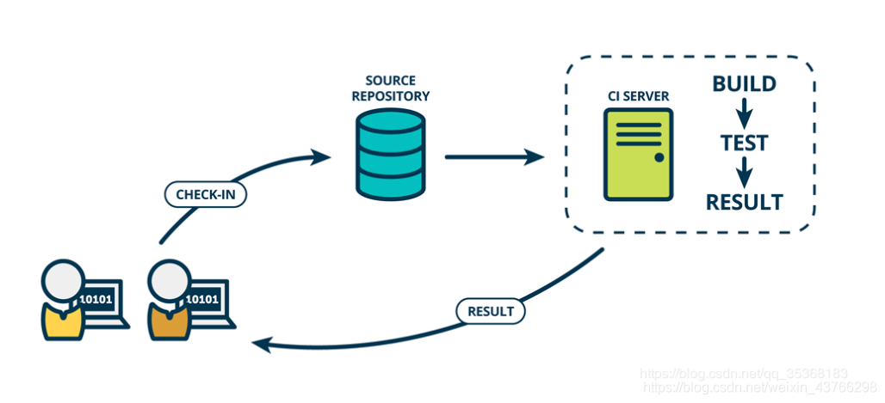

### 1.3 持续交付

持续交付Continuous Delivery：持续交付简称CD。是在CI的基础上进行了扩展，在CI环节完成了软件的构建和测试并形成了新的版本，那么接下来就要进行交付。这里交付到的环境不是指生产环境，而是类生产环境（STAGING），进而接受部分真实流量测试。如果没有问题的话就手动将项目部署到生产环境。
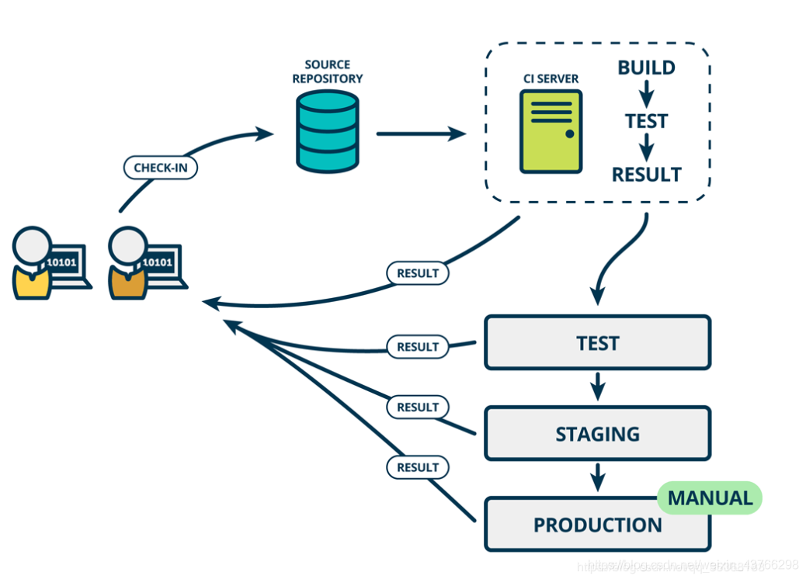

### 1.4 持续部署

持续部署Continuous Deployment：持续部署，简称CD。它是在持续交付的基础上把手动部署升级为自动部署。


### 1.4 总体目标

持续集成、持续交付和持续部署其目的是减少代码改动到投入生产的所需时间，提早发现风险、减少QA的测试时长、减少运维的人工干预。整体上是一个提效的过程。

> 1. Jenkins是什么？
> Jenkins是一个可扩展的持续集成引擎。通常与版本管理工具、构建工具结合使用。
常用的代码版本控制工具有SVN、GIT，代码构建工具有Maven、Ant、Gradle。
> 2. Jenkins有什么用？
> 持续、自动的构建和测试软件项目,监控一些定时执行的任务

**好处 1：降低风险**
一天中进行多次的集成， 并做了相应的测试，这样有利于检查缺陷，了解软件的健康状况，减少假定。

**好处 2：减少重复过程**
产生重复过程有两个方面的原因，一个是编译、测试、打包、部署等等固定操作都必须要做，无法省略任何一个环节；另一个是一个缺陷如果没有及时发现，有可能导致后续代码的开发方向是错误的，要修复问题需要重新编写受影响的所有代码。
而使用 Jenkins 等持续集成工具既可以把构建环节从手动完成转换为自动化完成，又可以通过增加集成频次尽早发现缺陷避免方向性错误。

**好处 3：任何时间、任何地点生成可部署的软件**
持续集成可以让您在任何时间发布可以部署的软件。从外界来看，这是持续集成最明显的好处，我们可以对改进软件品质和减少风险说起来滔滔不绝，但对于客户来说， 可以部署的软件产品是最实际的资产。利用持续集成，您可以经常对源代码进行一些小改动， 并将这些改动和其他的代码进行集成。如果出现问题，项目成员马上就会被通知到， 问题会第一时间被修复。不采用持续集成的情况下，这些问题有可能到交付前的集成测试的时候才发现， 有可能会导致延迟发布产品，而在急于修复这些缺陷的时候又有可能引入新的缺陷，最终可能导致项目失败。

**好处 4：增强项目的可见性**
持续集成让我们能够注意到趋势并进行有效的决策。如果没有真实或最新的数据提供支持，项目就会遇到麻烦，每个人都会提出他最好的猜测。通常，项目成员通过手工收集这些信息， 增加了负担，也很耗时。持续集成可以带来两点积极效果：

1. 有效决策：持续集成系统为项目构建状态和品质指标提供了及时的信息，有些持续集成系统可以报告功能完成度和缺陷率。
2. 注意到趋势：由于经常集成，我们可以看到一些趋势，如构建成功或失败、总体品质以及其它的项目信息。

**好处 5：建立团队对开发产品的信心**
持续集成可以建立开发团队对开发产品的信心，因为他们清楚的知道每一次构建的结果，他们知道他们对软件的改动造成了哪些影响，结果怎么样。

## 二、持续集成工具

### 2.1 Jenkins和Hudson

Jendins和Hudson是目前最流行的持续集成及自动化部署工具。

Jenkins 和 Hundson 之间的关系： 2009 年， 甲骨文收购了 Sun 并继承了 Hudson 代
码库。 在 2011 年年初， 甲骨文和开源社区之间的关系破裂， 该项目被分成两个独立的
项目：

* Jenkins：由大部分原始开发人员组成
* Hudson：由甲骨文公司继续管理

所以 Jenkins 和 Hudson 是两款非常相似的产品。

### 2.2 技术组合

Jenkins 可以整合 GitHub 或 SVN，同时利用Maven构建
Husband 也可以整合 GitHub 或 SVN，同时利用Maven构建
二者是同源的工具软件，操作和指导思想就是接近的，所以本教程学习 Jenkins

## 三、JavaEE项目部署方式对比

### 3.1 手动部署

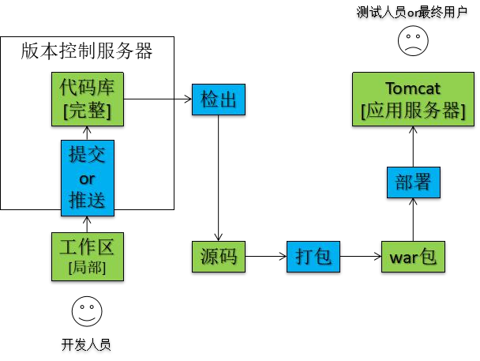

### 3.2 自动化部署

“自动化” 的具体体现： 向版本库提交新的代码后， 应用服务器上自动部署， 用户
或测试人员使用的马上就是最新的应用程序。
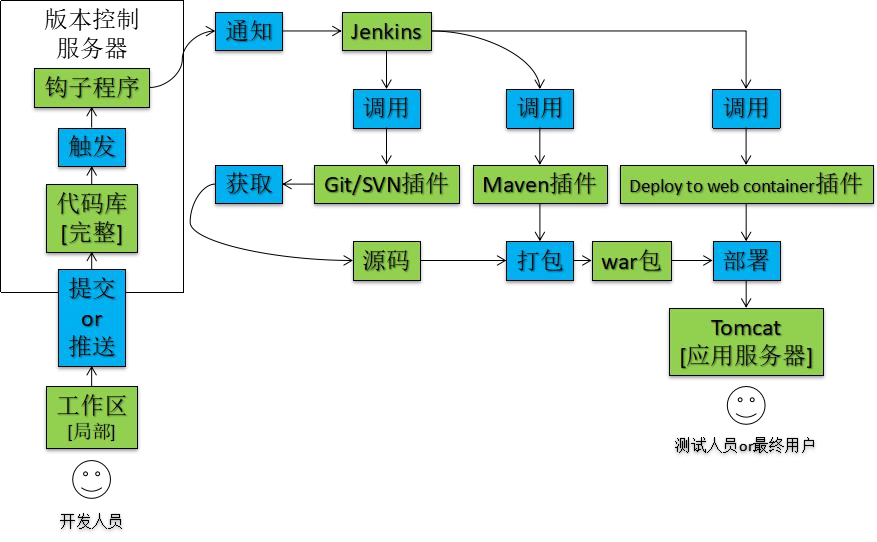

搭建上述持续集成环境可以把整个构建、 部署过程自动化， 很大程度上减轻工作量。对于程序员的日常开发来说不会造成任何额外负担——自己把代码提交上去之后， 服务器上运行的马上就是最新版本——一切都发生在无形中。

搭建整套持续集成环境， 这个操作过程需要具备以下前置知识：

1. Linux 基本操作命令和 VIM 编辑器使用
2. Maven 的项目构建管理
3. GitHub

## 四、Jenkins+GitHub+Maven搭建持续集成环境

### 4.1 Jenkins安装

Jenkins就是一个war包，把它放在servlet容器中即可

所以需要先在Linux系统中安装JDK，以及Tomcat，然后启动Tomcat服务器

Jenkins下载地址：<http://mirrors.jenkins.io/war-stable/latest/jenkins.war>

注意Tomcat服务器的字符编码集需要修改：

```xml
<Connector port="8080" protocol="HTTP/1.1" connectionTimeout="20000" redirectPort="8443" URIEncoding="UTF-8"/>
```

在把jenkins.war包放在tomcat容器中之前，先修改Jenkins默认的工作目录，默认目录是./root/.jenkins，但是这个目录在Jenkins运行时，Maven命令mvn找不到该目录，可能是没有权限
修改步骤如下：

1. 打开tomcat的bin目录，编辑catalina.sh文件。
在`# OS specific support. $var must be set to either true or false.`上面添加：`export JENKINS_HOME="/usr/local/jenkinsHome"`
2. 修改profile文件
编辑/etc/profile文件，在文件里添加一行`export JENKINS_HOME=/usr/local/jenkinsHome`
注意，PATH变量不需要附加JENKINS_HOME变量
保存后，执行`source /etc/profile`
重启tomcat生效

输入地址：`tomcat服务器ip:端口号/jenkins`,比如`192.168.79.130:8080/jenkins`
进入后，显示如下：

按照图示文件地址，查看解锁的密钥即可

安装默认插件
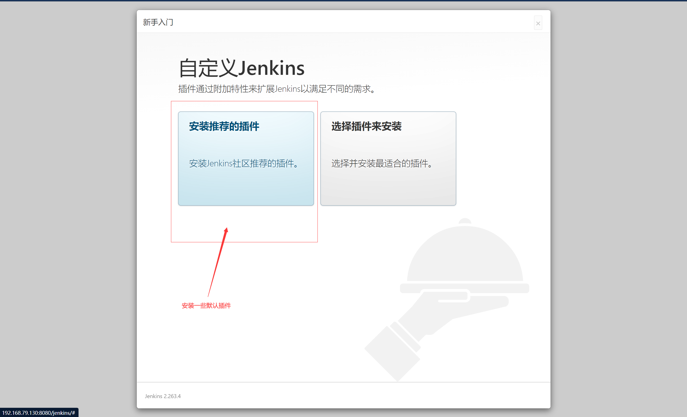


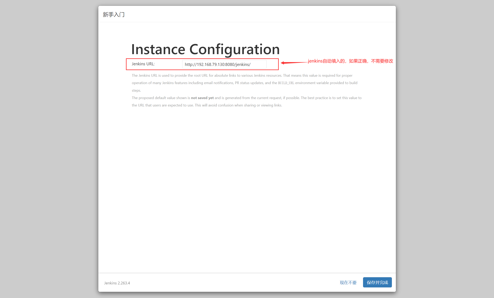

> 至此，jenkins已经安装完毕，可以进入到jenkins页面，但是在使用持续集成功能之前，需要配置maven和git，所以要先安装这几个软件在Linux系统中，才能在jenkins中配置这些

### 4.2 在Linux下安装Git

Git下载地址：<https://codeload.github.com/git/git/tar.gz/v2.30.0>
下载后，上传到`/opt`目录下
使用命令`tar -zxvf git-2.30.0.tar.gz`解压git安装包
先不要安装，还需要下载安装git的依赖包

执行命令如下命令安装依赖：
`yum install -y curl-devel expat-devel gettext-devel openssl-devel zlib-devel`
`yum install -y gcc perl-ExtUtils-MakeMaker`

删除已有的git
`yum remove git`

进入到git安装包解压目录中，进行编译安装
`cd /opt/git-2.30.0`
`make prefix=/usr/local/git all`
`make prefix=/usr/local/git install`
`echo "export PATH=$PATH:/usr/local/git/bin" >> /etc/bashrc`
`source /etc/bashrc`

上面步骤已安装完毕，查看git是否安装成功，以及git版本
`git --version`

### 4.3 在Linux下安装Maven

在/opt目录下执行命令：
`cd/opt && wget https://mirrors.tuna.tsinghua.edu.cn/apache/maven/maven-3/3.6.3/binaries/apache-maven-3.6.3-bin.tar.gz`

解压maven安装包
`tar -zxvf apache-maven-3.6.3-bin.tar.gz`

### 4.4 Jenkins集成配置

#### 4.4.1 jenkins安装deploy to container

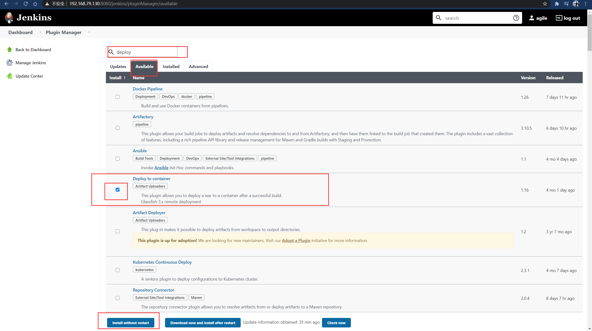
安装后重启jenkins，可以在浏览器输入`192.168.79.130:8080/jenkins/restart`即可重启

#### 4.4.2 jenkins配置jdk


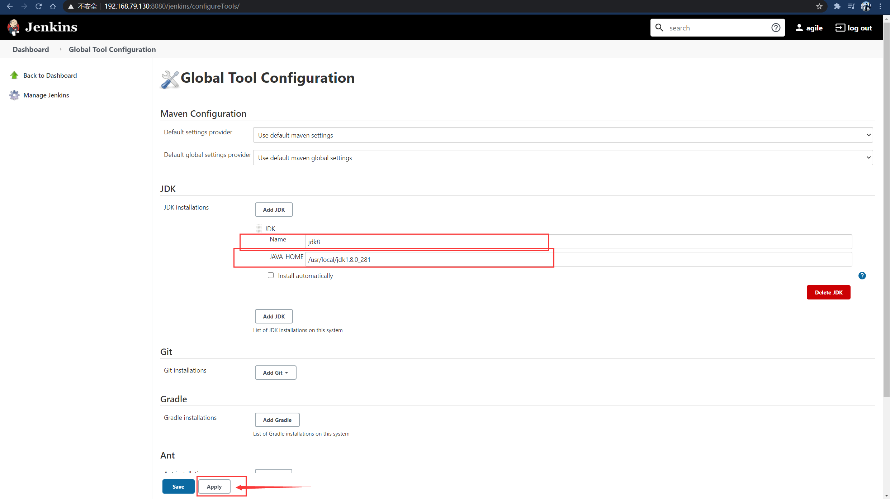

#### 4.4.3 jenkins配置maven

这里有两处需要配置,一个是配置指定maven的conf文件，二是配置指定maven的家目录

配置指定maven的conf文件
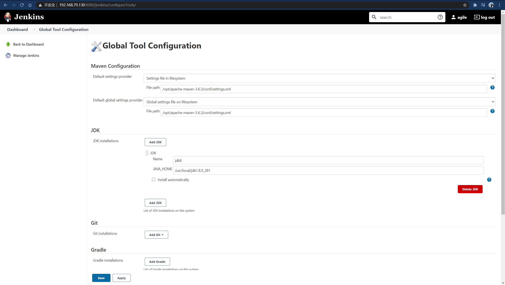

配置指定maven的家目录


#### 4.4.4 tomcat配置manager

配置tomcat服务器管理账号和密码

在`/opt/apache-tomcat-8.5.63/conf/tomcat-users.xml`配置文件中添加入一下配置：

```xml
<role rolename="manager-gui"/>
<role rolename="manager-script"/>
<role rolename="manager-jmx"/>
<role rolename="manager-status"/>
<user username="tomcat_user" password="123456" roles="manager-gui,manager-script,manager-jmx,manager-status" />
```

tomcat的manager页面，默认只有本机地址才能访问，需要远程访问，则需要修改`/opt/apache-tomcat-8.5.63/webapps/manager/META-INF/context.xml` 中的授权ip
修改context.xml文件的Value标签的allow属性值

```xml
<Valve className="org.apache.catalina.valves.RemoteAddrValve" allow="^.*$" />
```

> 生产环境下应该设置manager只能本地登录或者安全的局域网ip登录

### 4.5 在Jenkins中新建一个持续构建工作

现在远程github仓库中，有个项目jenkins-demo，是和开发者本地的一个项目关联的

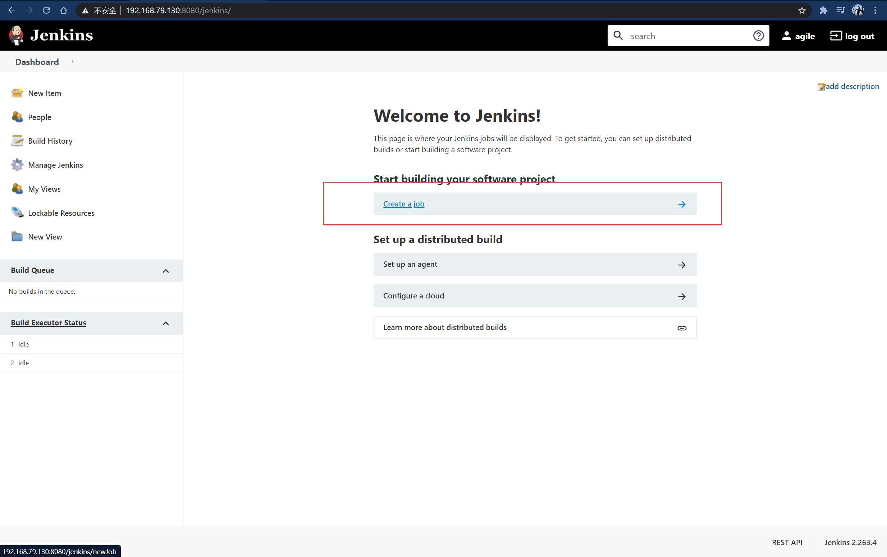


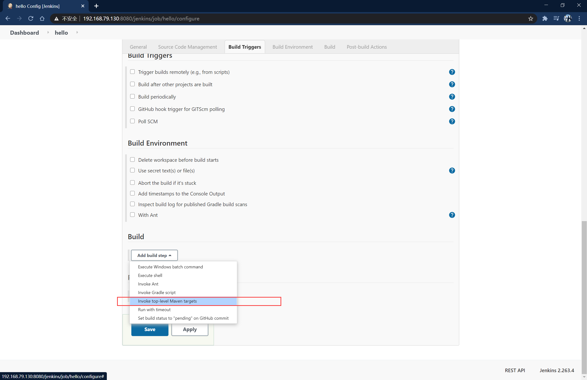

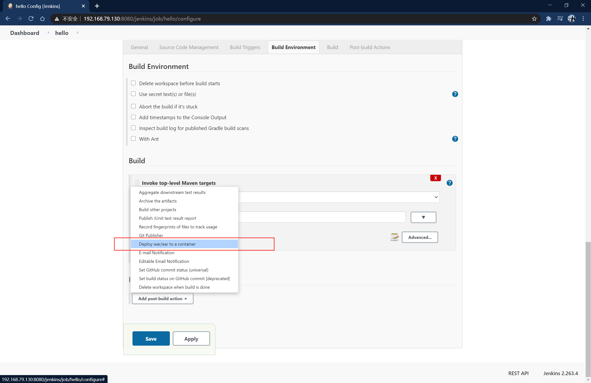
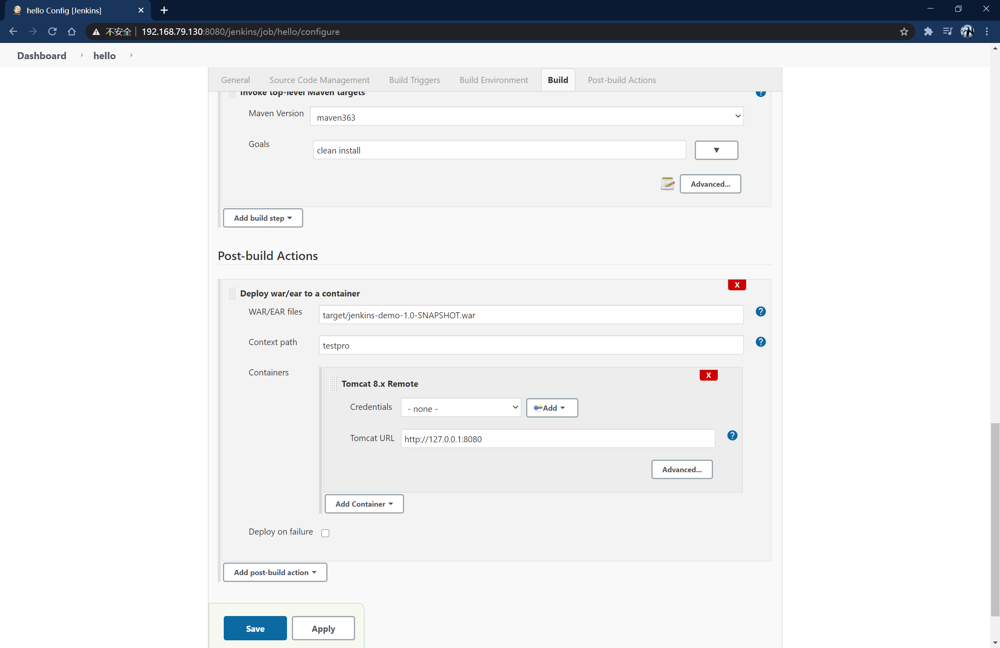


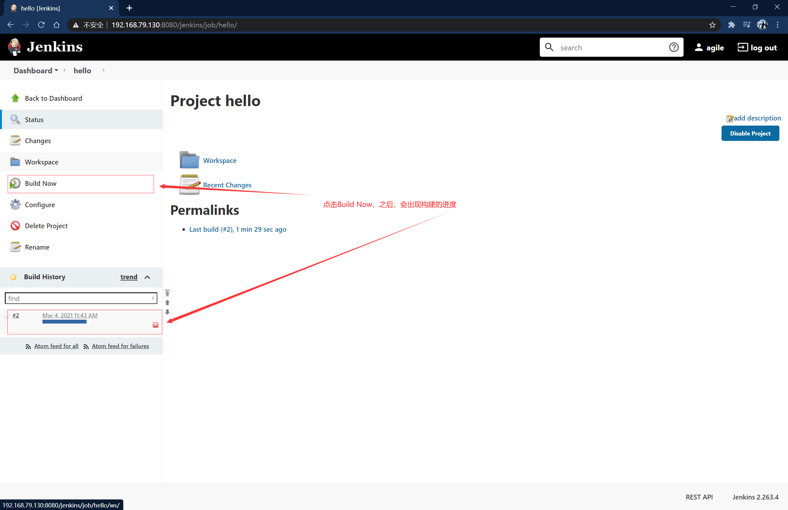
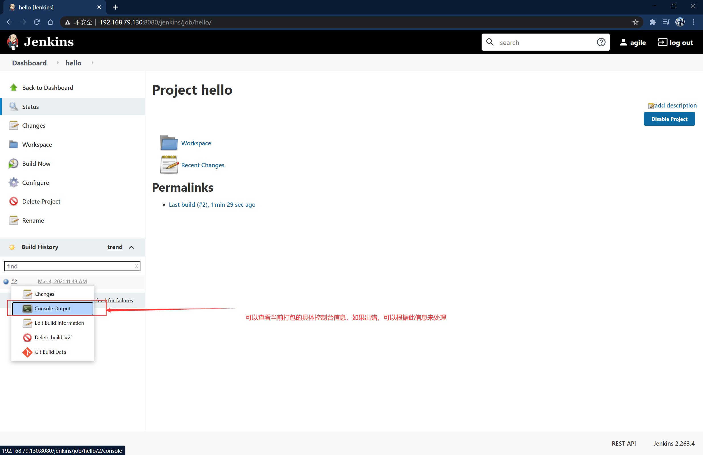
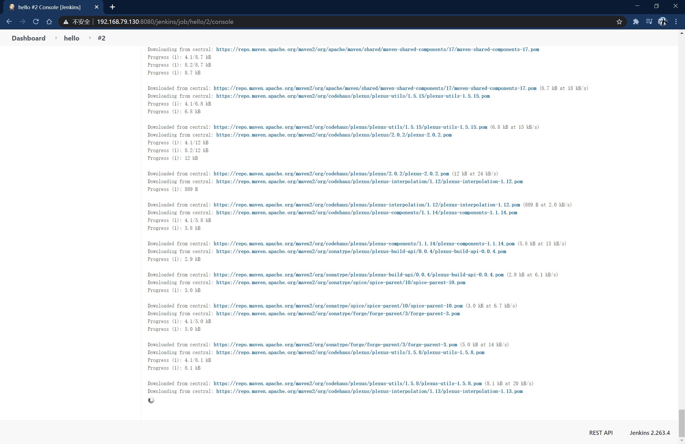

如果构建成功，在以下页面都可以看到如下信息：


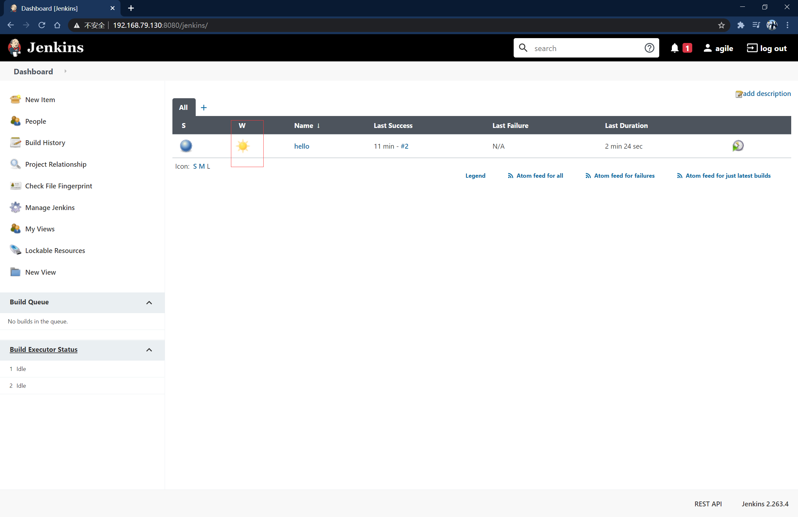

此时直接在浏览器上输入地址：`http://192.168.79.130:8080/testpro`即可访问项目

需要注意的是，因为打包是使用的Maven，所以项目的源代码中的pom.xml文件一定不能配置错误，以下的测试项目jenkins-demo的pom.xml内容：

```xml
<?xml version="1.0" encoding="UTF-8"?>

<project xmlns="http://maven.apache.org/POM/4.0.0" xmlns:xsi="http://www.w3.org/2001/XMLSchema-instance"
         xsi:schemaLocation="http://maven.apache.org/POM/4.0.0 http://maven.apache.org/xsd/maven-4.0.0.xsd">
    <modelVersion>4.0.0</modelVersion>

    <groupId>com.suftz.demo</groupId>
    <artifactId>jenkins-demo</artifactId>
    <version>1.0-SNAPSHOT</version>
    <packaging>war</packaging>

    <name>jenkins-demo Maven Webapp</name>

    <dependencies>
        <dependency>
            <groupId>junit</groupId>
            <artifactId>junit</artifactId>
            <version>4.12</version>
            <scope>test</scope>
        </dependency>

        <dependency>
            <groupId>javax.servlet</groupId>
            <artifactId>jsp-api</artifactId>
            <version>2.0</version>
            <scope>provided</scope>
        </dependency>
        <dependency>
            <groupId>javax.servlet</groupId>
            <artifactId>javax.servlet-api</artifactId>
            <version>3.1.0</version>
            <scope>provided</scope>
        </dependency>

    </dependencies>
<!--    <build>-->
<!--        <finalName>testWeb</finalName>-->
<!--        <plugins>-->
<!--            <plugin>-->
<!--                <groupId>org.codehaus.cargo</groupId>-->
<!--                <artifactId>cargo-maven2-plugin</artifactId>-->
<!--                <version>1.8.0</version>-->
<!--                <configuration>-->
<!--                    <container>-->
<!--                        <containerId>tomcat8x</containerId>-->
<!--                        <home>D:\Programs\apache-tomcat-8.5.61</home>-->
<!--                    </container>-->
<!--                    <configuration>-->
<!--                        <type>existing</type>-->
<!--                        <home>D:\Programs\apache-tomcat-8.5.61</home>-->
<!--                        &lt;!&ndash; 如果Tomcat端口为默认值8080则不必设置该属性 &ndash;&gt;-->
<!--                        <properties>-->
<!--                            <cargo.servlet.port>8989</cargo.servlet.port>-->
<!--                        </properties>-->
<!--                    </configuration>-->
<!--                </configuration>-->
<!--                <executions>-->
<!--                    <execution>-->
<!--                        <id>cargo-run</id>-->
<!--                        <phase>install</phase>-->
<!--                        <goals>-->
<!--                            <goal>run</goal>-->
<!--                        </goals>-->
<!--                    </execution>-->
<!--                </executions>-->
<!--            </plugin>-->
<!--        </plugins>-->
<!--    </build>-->
</project>

```

### 4.5 自动持续集成构建

上面的步骤，实现了将本地项目代码修改后，提交到远程仓库，然后通过使用Jenkins来构建打包项目，并部署到tomcat服务器上，但是提交代码后，Jenkins无法自动去实现构建打包，需要手动操作Jenkins。下面学习自动持续集成构建

实现原理：在GitHub上使用每个repository的WebHook方式远程触发Jenkins构建，这样就不用每次push推送代码到远程后，自己手动去Jenkins上面执行构建打包部署

需要注意的是，因为其实原理是通过github收到repository的push提交后，调用了远程Jenkins服务的指令，这个指令会触发Jenkins自动构建，所以，安装Tomcat也即部署Jenkins的Linux服务器必须是GitHub能够感知到的网络，也就是公网，否则GitHub无法远程触发这台Linux服务器上的Jenkins去构建，因为根本找不到这个ip

现将整个局域网配置Jenkins的步骤，以及手动构建打包的过程，在公网的服务器上重新做一遍
> 公网的服务器可以租用云服务器提供商(阿里云，腾讯云等)的服务才能使用，当然网上也有免费试用一个月的云服务器提供商

设置自动构建打包部署的设置步骤如下：
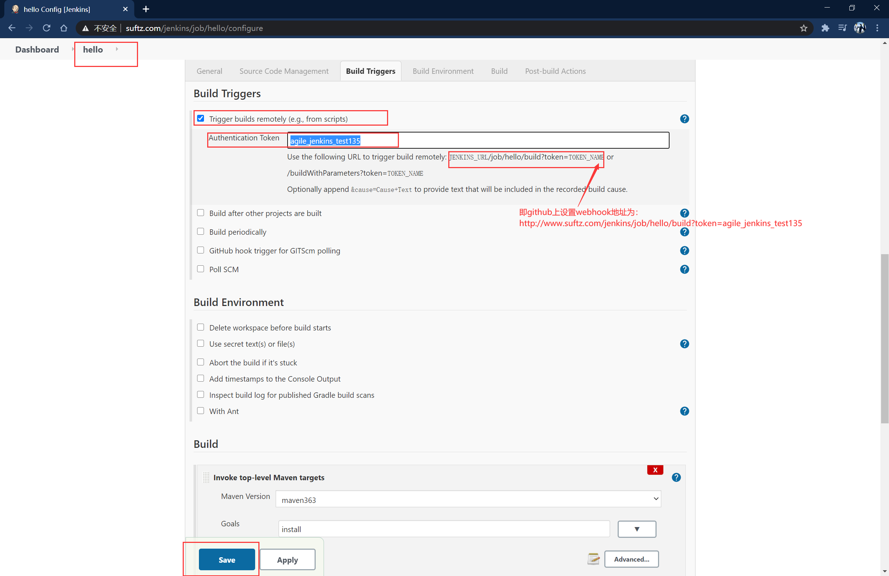
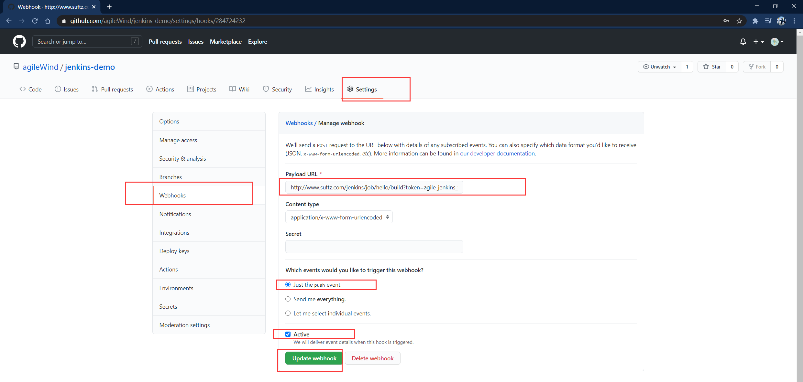

但是这里要考虑一个问题，Jenkins是否支持/允许跨域请求，要知道，有些网站为了安全考虑，禁止请求的来自其它网站（如果请求地址是来自同域网站，或者是直接从浏览器地址栏输入则不会有问题）

这里可能会有一个问题，即Jenkins版本升级导致的系统调用Jenkins时csrf问题403

Jenkins2.204.6之前，Jenkins系统安全设置有一个选项，禁用CSRF保护功能，只要使用这个功能，则能够让github调用Jenkins的地址去自动构建

Jenkins2.204.6之后，直接移除了`禁用 CSRF 保护的功能`，则github无法使用约定的地址`http://www.suftz.com/jenkins/job/hello/build?token=agile_jenkins_test135`发送post请求

解决办法：

方法一：

在Jenkins的页面上，使用命令执行功能，输入：

```java
hudson.security.csrf.GlobalCrumbIssuerConfiguration.DISABLE_CSRF_PROTECTION=true
```


注意：这种方式设置值，重启后则设置无效

或者将参数
`-Dhudson.security.csrf.GlobalCrumbIssuerConfiguration.DISABLE_CSRF_PROTECTION=true`
添加到Tomcat脚本启动的参数中，也可在jdk启动的时候加上配置参数。如果项目是以jar形式部署，也可在启动时加上该配置参数

方法二：(采用这种方式就不要使用方法一)

Jenkins安装插件`Strict Crumb Issuer`
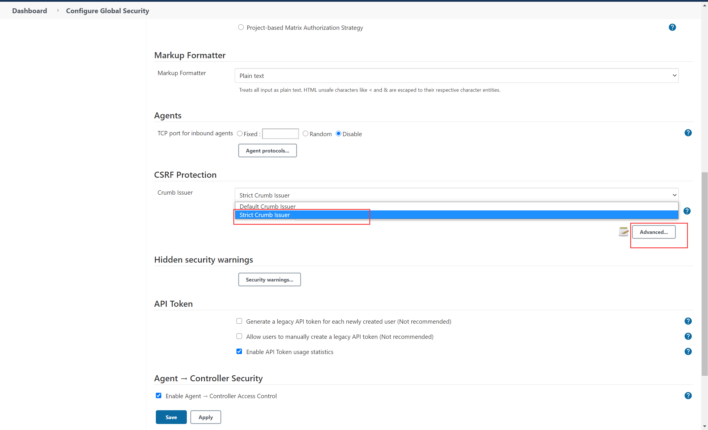

