# Linux基础

[TOC]

## 基础篇

### Linux入门

#### Linux概述

Linux学习方向

* Linux运维工程师
* Linux嵌入式工程师
* Linux下开发项目：JavaEE,大数据,Python,PHP,C/C++

Linux的应用领域

* 个人桌面领域的应用
此领域是传统linux应用最薄弱的环节，传统linux由于界面简单、操作复杂、应用软件少的缺
点，一直被windows所压制，但近些年来随着ubuntu、 fedora [fɪˈdɔ:rə] 等优秀桌面环境的兴起，同时各大硬件厂商对其支持的加大， linux在个人桌面领域的占有率在逐渐的提高。

* 服务器领域
linux在服务器领域的应用是最强的。
linux免费、稳定、高效等特点在这里得到了很好的体现，近些年来linux服务器市场得到了飞速的提升，尤其在一些高端领域尤为广泛。
* 嵌入式领域
近些年来linux在嵌入式领域的应用得到了飞速的提高
linux运行稳定、对网络的良好支持性、低成本，且可以根据需要进行软件裁剪，内核最小可以达到几百KB等特点，使其近些年来在嵌入式领域的应用得到非常大的提高
主要应用： 机顶盒、数字电视、网络电话、程控交换机、 手机、 PDA、智能家居、智能硬件等都是其应用领域。以后再物联网中应用会更加广泛。

Linux高手进阶之路

* linux是一个开源、免费的操作系统，其稳定性、安全性、处理多并发已经得到业界的认可，目前很多中型，大型甚至是集群项目都在使用linux,很多软件公司考虑到开发成本都首选linux,在中国软件公司得到广泛的使用。
* 学习linux流程为:
第1阶段： linux环境下的基本操作命令， 包括 文件操作命令(rm mkdir chmod, chown) 编辑工具使用（vi vim） linux用户管理(useradd userdel usermod)等
第2阶段： linux的各种配置（环境变量配置，网络配置，服务配置）
第3阶段： linux下如何搭建对应语言的开发环境（大数据， JavaEE, Python等）
第4阶段： 能编写shell脚本，对Linux服务器进行维护。
第5阶段： 能进行安全设置， 防止攻击，保障服务器正常运行，能对系统调优。
第6阶段： 深入理解Linux系统（对内核有研究），熟练掌握大型网站应用架构组成、并熟悉各个环节的部署和维护方法。

Linux的学习方法

1. 高效而愉快的学习
2. 先建立一个整体框架，然后细节
3. 不需要掌握所有的Linux指令，要学会查询手册和百度
4. 先know how ,再know why
5. 计算机是一门”做中学” 的学科 ,不是会了再做，而是做了才会.
6. 适当的囫囵吞枣
7. Linux不是编程，重点是实际操作，各种常用指令要玩的溜

#### Linux介绍

1. linux怎么读？
2. linux是一个开源、免费的操作系统，其稳定性、安全性、处理多并发已经得到业界的认可，目前很多企业级的项目都会部署到Linux/unix系统上。
3. 常见的操作系统(win7、 IOS、 Android、 Mac)
4. Linux 吉祥物：Tux企鹅
    
5. Linux的创始人：Linus Torvalds（林纳斯，git创始人）
6. Linux主要的发行版:
   Ubuntu(乌班图)、 RedHat(红帽)、 CentOS、 Debain[蝶变]、 Fedora、 SuSE、OpenSUSE

### Linux与UNIX的关系

unix是在贝尔实验室诞生的，由B语言，C语言之父创造，而后衍生出了许多不同版本的UNIX(增强一些功能)，但是这些UNIX只能运行在大型的计算机上

Linux是在UNIX的版本AT&T Systme V下进行了改写而成的，也就是GNU/Linux内核，GNU是一个软件开源组织


* 其中Redhat发行了CentOS与redhat这两个不同的Linux发行版，CentOS是免费的

### Linux与Windows比较

|比较|Window|Linux|
|:----|:----|:----|
|免费与收费|收费且很贵|Linux 免费或少许费用。|
|软件与支持|数量和质量的优势，不过大部分为收费软件；由微软官方提供支持和服务；|开源自由软件，用户可以修改定制和再发布，由于基本免费没有资金支持，部分软件质量和体验欠缺；有全球所有的Linux开发者和自由软件社区提供支持。|
|安全性|三天两头打补丁安装系统安全更新，还是会中病毒木马；|要说 Linux 没有安全问题，那当然是不可能的，这一点仁者见仁智者见智，相对来说肯定比Windows 平台要更加安全|
|使用习惯|普通用户基本都是纯图形界面下操作使用，依靠鼠标和键盘完成一切操作，用户上手容易入门简单；|兼具图形界面操作和完全的命令行操作，可以只用键盘完成一切操作，新手入门较困难，需要一些学习和指导，一旦熟练之后效率极高。|
|可定制性|封闭的，系统可定制性很差；|开源，可定制化非常强。|
|应用场景|桌面操作系统主要使用的是window。|支撑百度，谷歌，淘宝等应用软件和服务的，是后台成千上万的Linux服务器主机。世界上大部分软件和服务都是运行在Linux之上的|

### VMWare和Linux的安装

学习Linux需要一个环境，我们需要创建一个虚拟机，然后在虚拟机上安装一个Centos系统来学习

1. 先安装virtual machine ,vm16.0
2. 再安装Linux (CentOS 7.6)
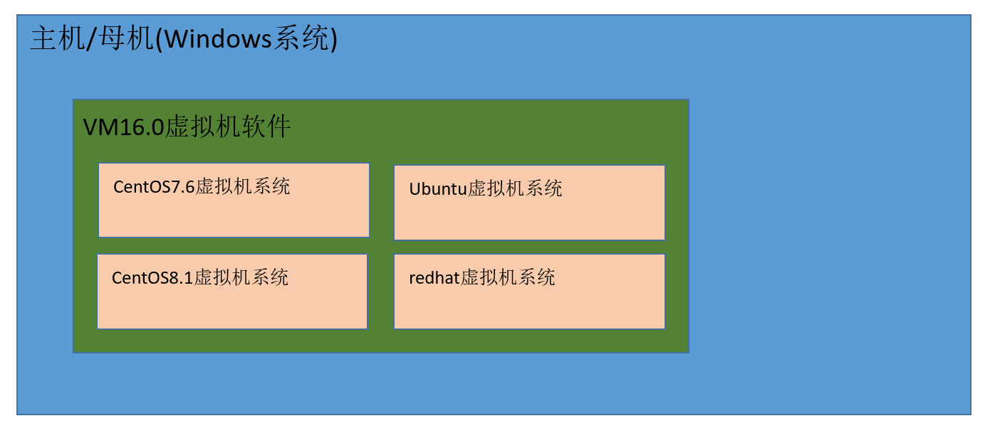

#### 安装VMWare

1. 去BIOS里修改设置，开启虚拟机设备支持
    

去官网下载vm:<https://www.vmware.com/cn.html>
密钥可以通过购买正版获取，下面是参考密钥

虚拟机产品密钥
ZF3R0-FHED2-M80TY-8QYGC-NPKYF
YF390-0HF8P-M81RQ-2DXQE-M2UT6
ZF71R-DMX85-08DQY-8YMNC-PPHV8
前面的如果已经失效，用下面的
FA1M0-89YE3-081TQ-AFNX9-NKUC0

#### 安装CentOS

阿里云镜像：<https://mirrors.aliyun.com/centos/7/isos/x86_64/CentOS-7-x86_64-DVD-2009.iso>

安装步骤截图：

稍后安装的本质就是，在配置中，cd-rom选择系统安装包，就像在真机上使用cd驱动来安装
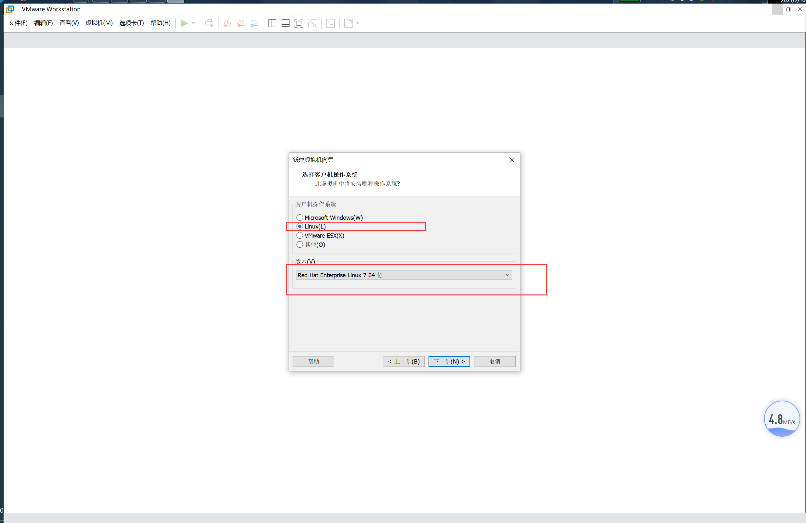


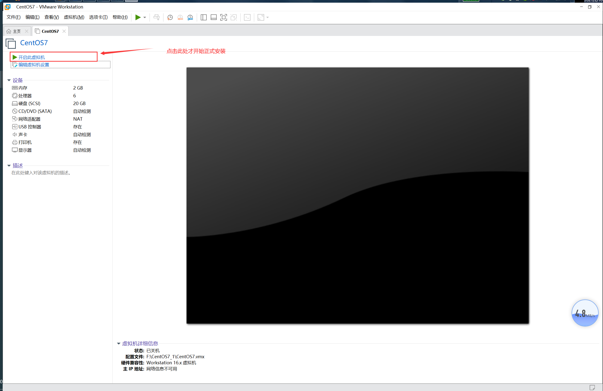
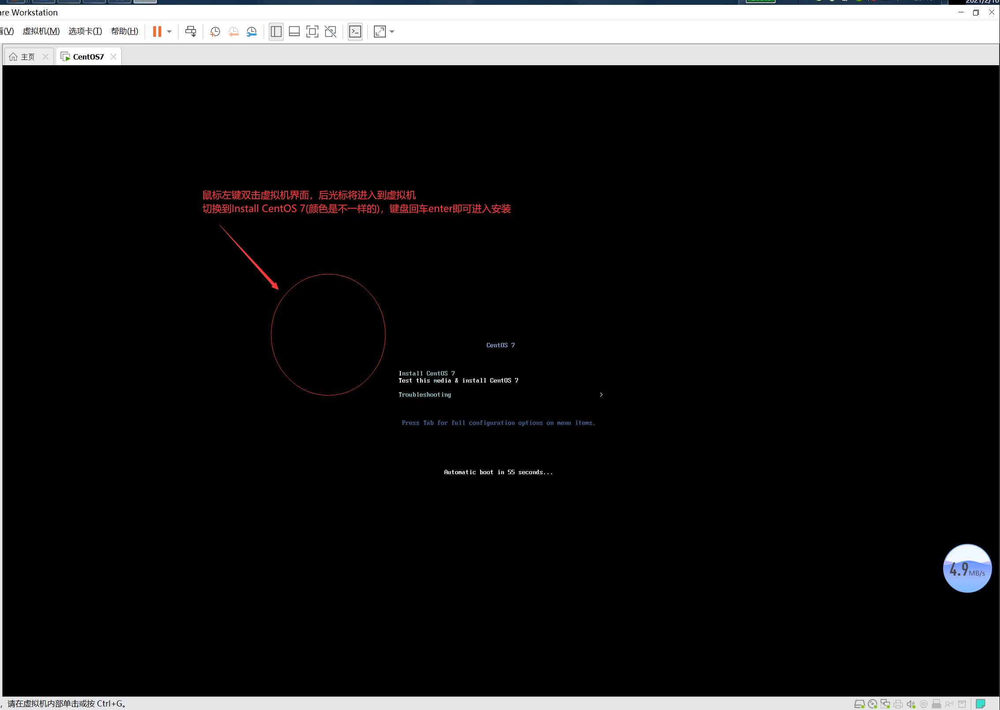

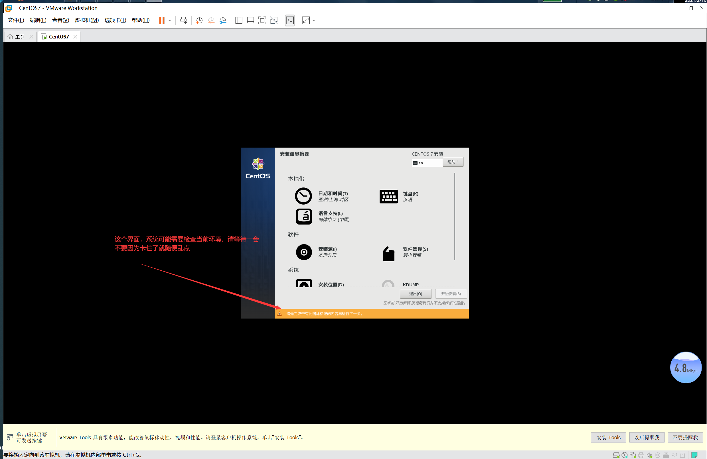
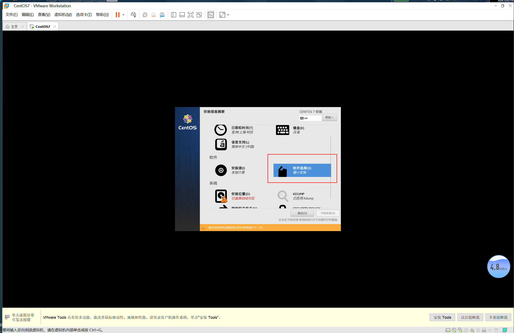


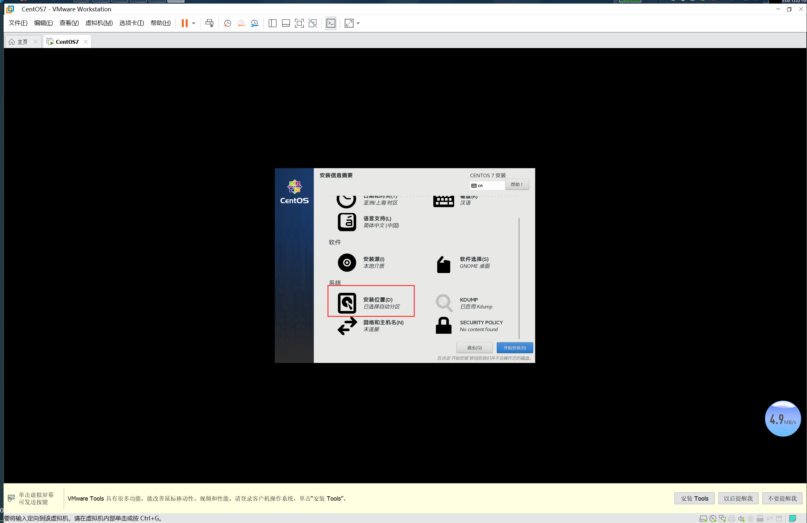
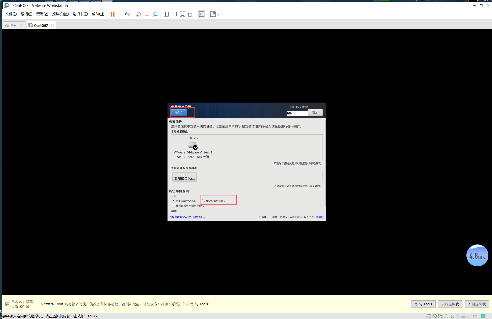
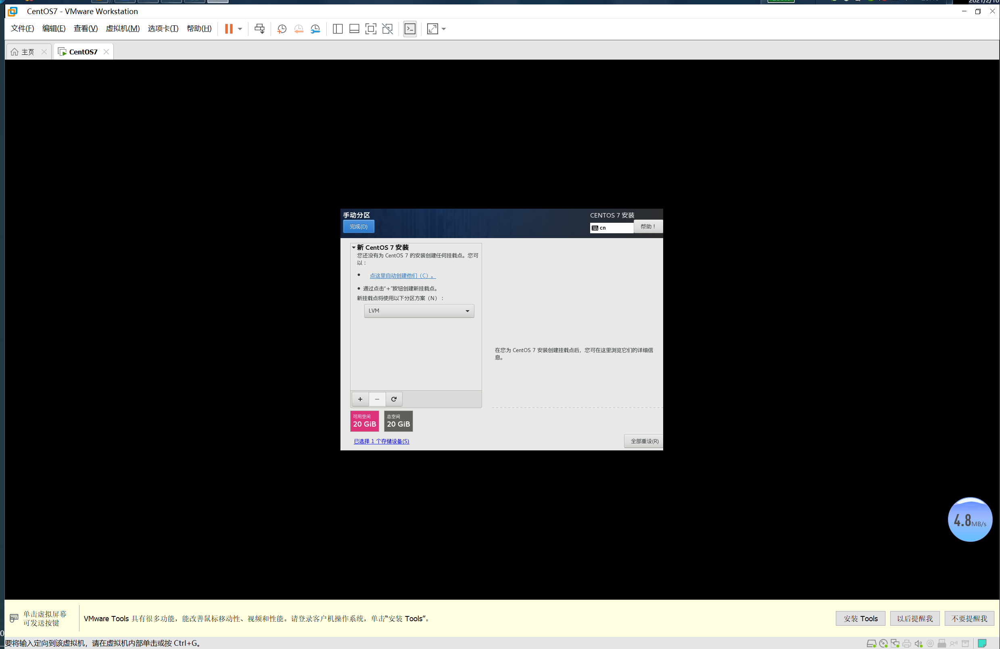

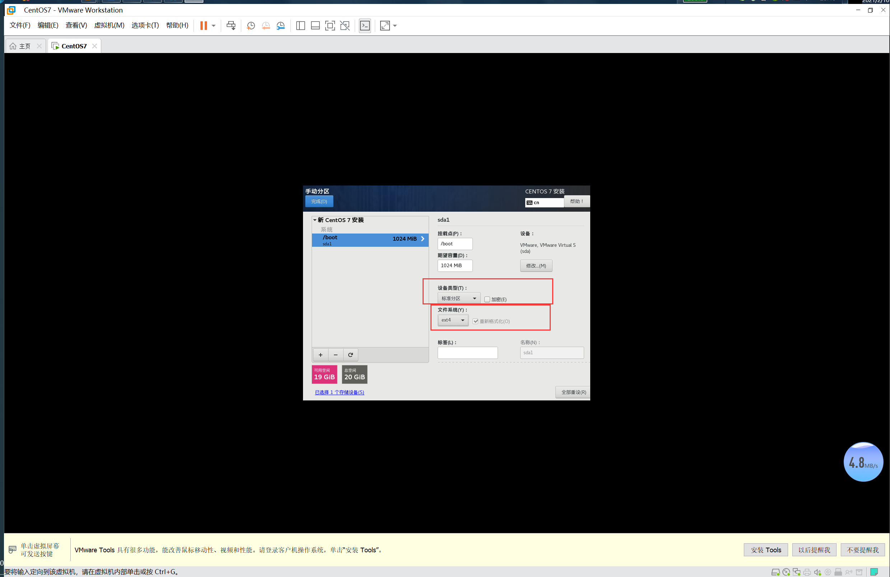

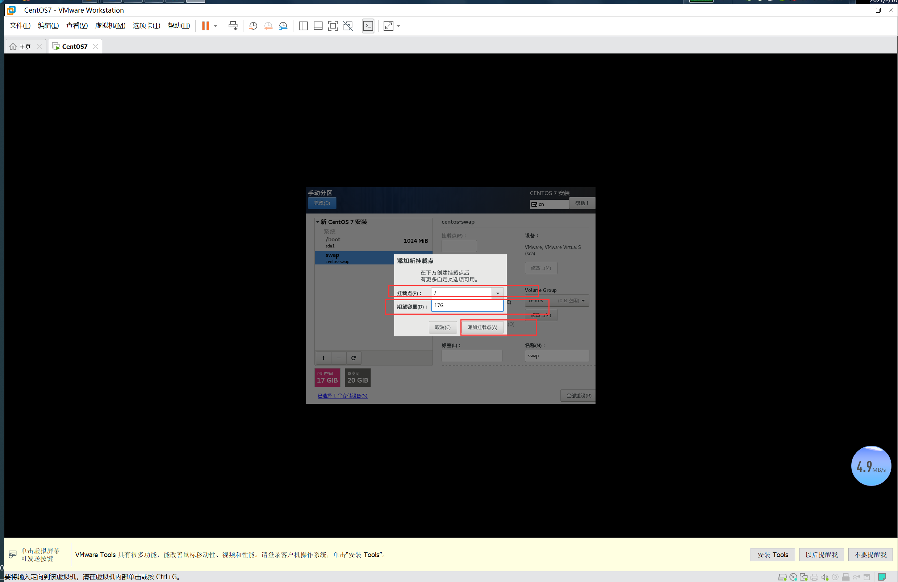
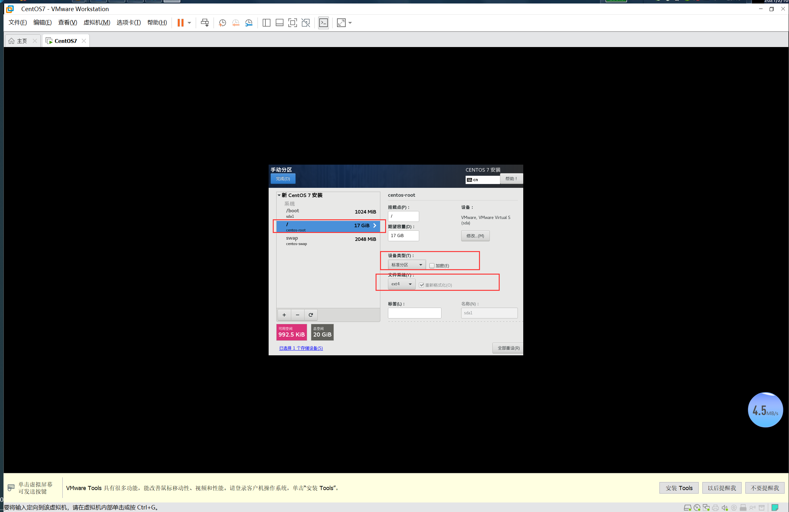


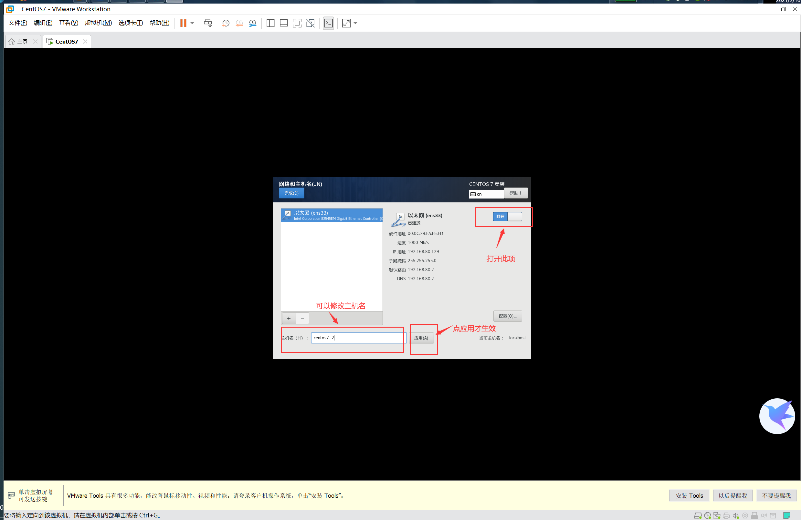

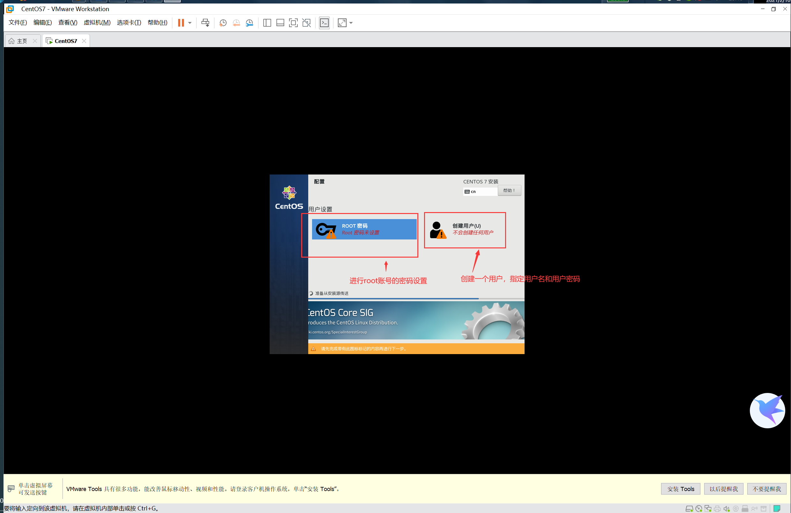
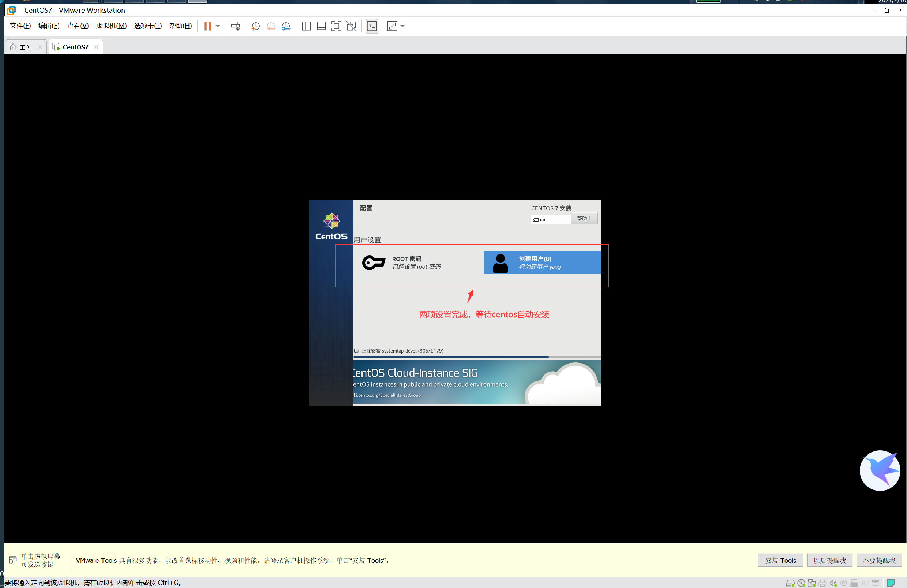
安装成功后，根据界面上的重启提示，进行重启，然后再次进入系统页面后，需要接受许可证，勾选后，即可使用root账号和密码或者普通用户的账号和密码进入到系统中

安装过程的注意：

* 选择手动分区，具体分区大小如下：
  boot分区 1G
  swap分区 2G  和内存大小相同
  `/`根分区   剩下的所有

#### 网络连接的三种模式

1. 桥接模式：虚拟机系统可以访问外部系统。虚拟机也会被分配和主机相同段的一个ip地址，虚拟系统可以和外部系统通讯，但是容易造成IP冲突
2. NAT模式：即网络地址转换模式，虚拟机系统可以与外部系统通信，不造成ip冲突。虚拟机系统Linux会被分配一个与主机不同段的ip地址，且此时主机还会被新建一个网卡，使得当前的主机也会拥有与虚拟机ip地址在相同段的一个ip地址，即当前的主机会有两个ip地址，一个ip地址用于与局域网其他主机通信，另一个ip地址用于与虚拟机系统通信
3. 主机模式：独立的系统，不与外部通信

#### 虚拟机克隆

方式一：去电脑里的资源管理器里，直接复制粘贴需要克隆的虚拟机的文件夹
方式二：在VMware中选中一个虚拟机，右键->管理->克隆，即可实现对虚拟机的克隆，注意的是，克隆虚拟机时，需要关闭当前的虚拟机才可进行克隆

克隆后的虚拟机可以直接使用VMware打开，然后进行使用，且克隆后的虚拟机的用户密码，各项设置还是和之前的虚拟机完全一致

虚拟机安装后的文件夹可以直接在其他电脑里使用vmware软件打开，使用

#### 虚拟机快照管理

如果在使用虚拟机系统的时候(比如Linux),想回到原先的某一个状态，也就是说担心可能有些误操作造成系统异常，需要回到原先某个正常运行的状态，vmware提供了这样的功能，即快照管理

具体操作：
选中需要拍摄快照的虚拟机系统，右键->快照->拍摄快照，即会创建一个快照，也可进行快照管理，或者回到某一快照

#### 虚拟机迁移和删除

虚拟系统本质就是一个文件夹，所以复制文件夹或者删除文件夹即可达到虚拟机的迁移和删除

#### 安装vmtools

* vmtools安装后，可以在windows下更好的管理vm虚拟机
* 可以设置windows和centos的共享文件夹，将windows中的一个文件放在指定的共享文件夹中，在虚拟机centos系统里，也能看到这个共享的文件夹中的文件内容，并进行使用

安装步骤：

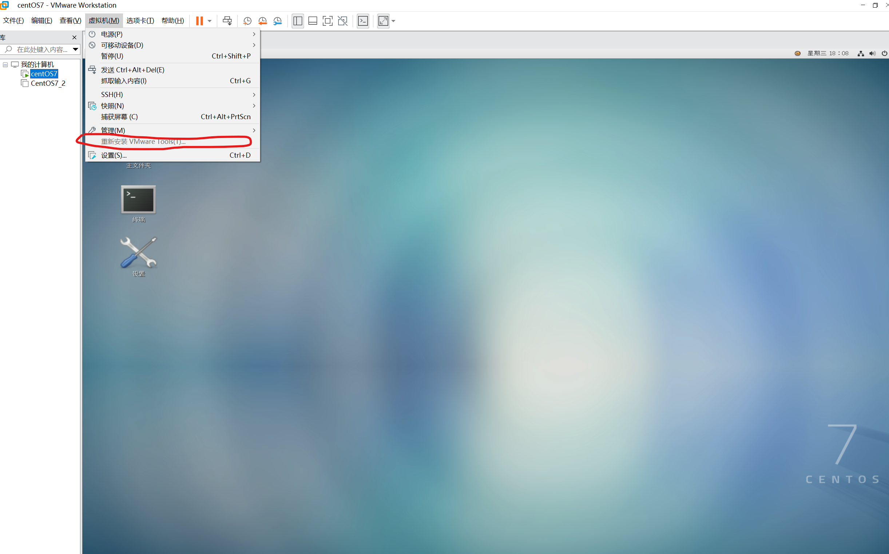
如果上面的图中，为阴影，可以尝试挂起后，再启动。如果还是行不通，按照下列操作：


此时CentOS系统的桌面会出现VMWare-tools的文件夹，点击后进入，看到了xx.tar.gz安装包，将此文件复制到`/opt`文件夹下
在`/opt`目录下解压该文件，具体操作应该是在一个命令行终端进行，即：

```shell
cd /opt
ll                                             #可以打印当前目录下的所有文件(夹)
tar -zxvf VMwareTools-10.3.22-15902021.tar.gz  #解压安装包
cd vmware-tools-distrib
ll                                             # 查看解压后的文件夹里的内容
./vmware-install.pl                            #运行该安装文件
```

此时会进入安装过程，基本上全部是默认操作，即可安装成功
>如果安装步骤过程中，最后一步询问如下：Would you like to recover the wasted disk space by uninstalling VMware Tools at this time? (yes/no) [yes] no)
输入 no 即可

进入`/mnt/hgfs`，此目录下可以看到与windows共享的文件夹

> 真实的生产环境下传输文件到Linux系统并不是通过该方式，因为生产环境下Linux系统往往安装在一个远程服务器上，此时是通过ftp工具传输文件，这种方式更常用

### Linux目录结构

linux的文件系统是采用层级式的树状目录结构，在此结构中的最上层是根目录`/`，然后在此目录下载创建其他的目录
深刻理解linux树状文件目录是非常重要的
**在Linux世界里，一切皆文件**

具体的目录结构

* `/bin` **[常用]** （`/usr/bin`、`/usr/local/bin`）
是Binary的缩写，这个目录存放着最常用的命令

* `/sbin` （`/usr/sbin`、`/usr/local/sbin`）
s就是Super User的意思，这里存放的是系统管理员使用的系统管理程序

* `/home` **[常用]**
存放普通用户的主目录，在Linux中每个用户都有一个自己的目录，一般该目录名是以用户的账号命名

* `/root` **[常用]**
该目录为系统管理员，也称作超级权限者的用户主目录

* `/lib`
系统开机所需要最基本的动态链接共享库，其作用类似于Windows里的DLL文件。几乎所有的应用程序都需要用到这些共享库

* `/lost+found`
这个目录一般情况下是空的，当系统非法关机后，这里就存放了一些文件。这个文件在系统的桌面资源管理器上不可见，可以通过终端命令查看

* `/etc` **[常用]**
所有的系统管理所需要的配置文件和子目录，比如安装mysql数据库的my.conf

* `/usr` **[常用]**
这是一个非常重要的目录，用户的很多应用程序和文件都放在这个目录下，类似于windows下的Program Files目录

* `/boot` **[常用]**
存放的是启动Linux时使用的一些核心文件，包括一些连接文件以及镜像文件

* `/proc` **[不能动]**
这个目录是一个虚拟的目录，它是系统内存的映射，访问这个目录来获取系统信息

* `/srv` **[不能动]**
service的缩写，该目录存放一些服务启动之后需要提取的数据

* `/sys` **[不能动]**
这是Linux2.6内核的一个很大的变化。该目录下安装了2.6内核中新出现的一个文件系统sysfs

* `/tmp`
这个目录是用来存放一些临时文件的

* `/dev`
类似与Windows的设备管理器，把所有的硬件用文件的形式存储

* `/media` **[常用]**
Linux系统会自动识别一些设备，如U盘，光驱等等。当Linux识别后，会把识别的设备挂在到这个目录下

* `/mnt` **[常用]**
系统提供该目录是为了让用户临时挂载别的文件系统的，我们可以将外部的存储挂载在/mnt上，然后进入该目录就可以查看里面的内容了。比如虚拟机Linux系统与母机Windows系统共享文件夹，或者主机为Liunx系统的电脑接入了一个外部的资源设备，比如硬盘等，这里就可以看到文件

* `/opt`
这是给主机额外安装软件所摆放的目录，即该文件夹是存放软件的安装包的

* `/usr/local` **[常用]**
这是另一个给主机额外安装软件所安装的目录，一般是通过编译源码方式安装的程序

* `/var` **[常用]**
这个目录中存放着不断扩充着的东西，习惯将经常被修改的目录放在这个目录下。包括各种日志文件

* `/selinux [security-enhanced linux]`
SELinux 是一种安全子系统，它能控制程序只能访问特定文件，有三种工作模式，可以自行设置

## 实操篇

### 远程登录

* 为什么需要远程登录Linux
  说明: 公司开发时候， 具体的情况是这样的
  1. linux服务器是开发小组共享的.
  2. 正式上线的项目是运行在公网的.
  3. 因此程序员需要远程登录到centos进行项目管理或者开发.
  4. 远程登录客户端有 Xshell， Xftp , 学习使用 Xshell 和 Xftp , 其它的远程工具大同小异

#### Xshell

Xshell 是目前最好的远程登录到Linux操作的软件，流畅的速度并且完美解决了中文乱码的问题， 是目前程序员首选的软件。
Xshell [1] 是一个强大的安全终端模拟软件，它支持SSH1, SSH2, 以及Microsoft Windows 平台的TELNET 协议。
Xshell可以在Windows界面下用来访问远端不同系统下的服务器，从而比较好的达到远程控制终端的目的

安装Xshell

官网地址：https://www.netsarang.com/zh/free-for-home-school/
这是免费的学生版，通过填写一些信息后，会将下载地址发送到用户的邮箱中，通过去邮箱查看下载地址，可以获取下载链接进行下载

Xshell连接Linux

1. 首先要知道Linux端的ip地址，可以通过在Linux系统的终端中输入命令`ifconfig`来查看
   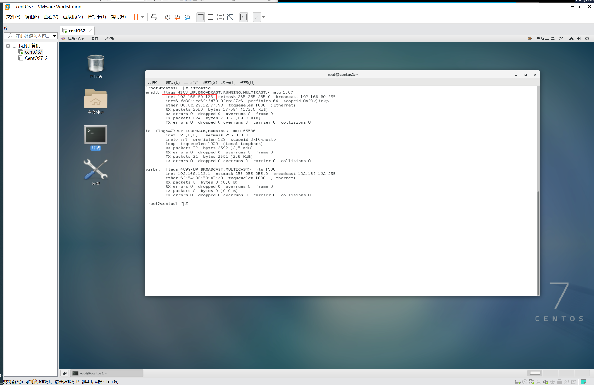

2. 打开Xshell软件，新建一个连接
   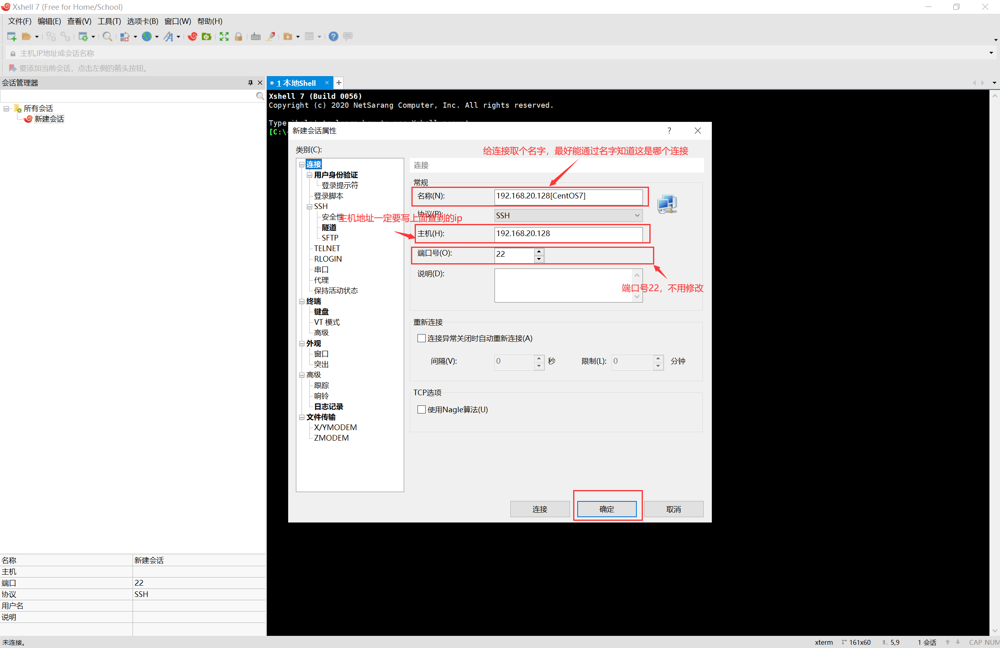
   
   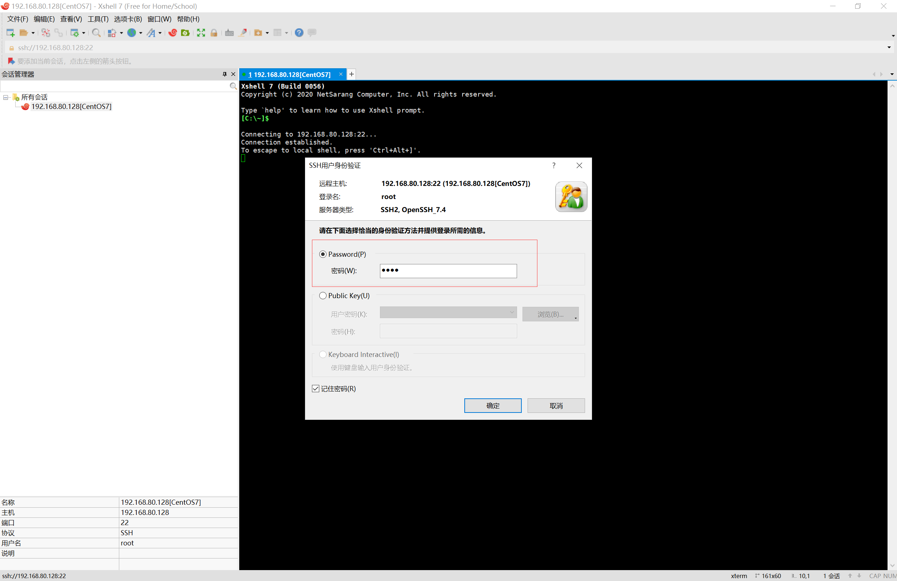
   

如果终端显示有乱码则可以设置编码:


#### Xftp

Xftp是用来给Linux系统远程传输文件资源的工具

连接步骤：


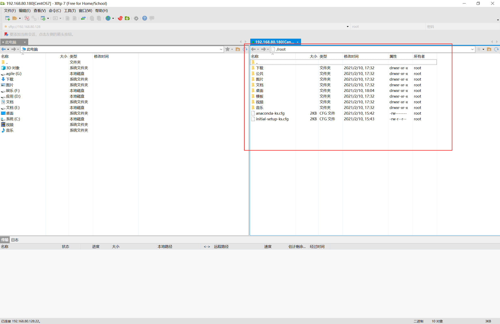
如果Xftp显示的Linux目录文件有乱码，可以来设置编码解决：
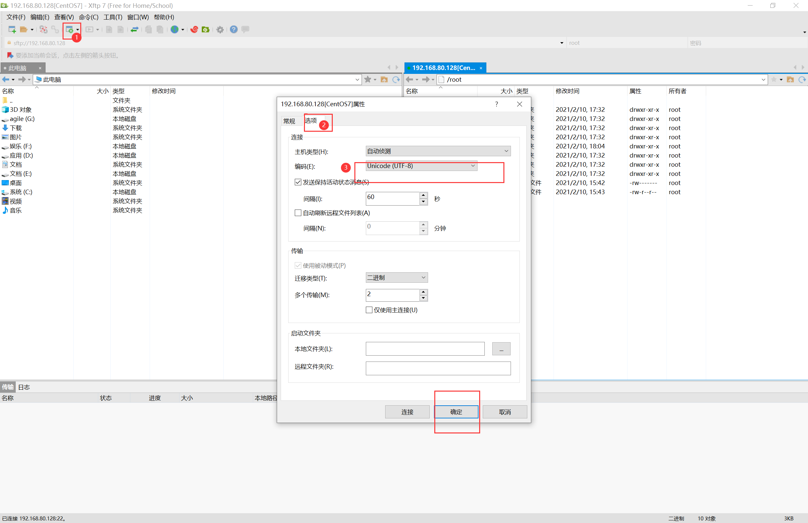

### vi和vim

所有的 Linux 系统都会内建 vi 文本编辑器。
Vim 具有程序编辑的能力，可以看做是Vi的增强版本，可以主动的以字体颜色辨别语法的正确性，方便程序设计。代码补完、编译及错误跳转等方便编程的功能特别丰富，在程序员中被广泛使用。

vi和vim常用的三种模式

1. 正常模式:
以 vim 打开一个档案就直接进入一般(正常)模式了(这是默认的模式)。在这个模式中， 你可以使用『上下左右』 按键来移动光标，你可以使用『删除字符』 或『删除整行』 来处理档案内容，也可以使用『复制、贴上』 来处理你的文件数据。这个模式有一些快捷键对文本进行操作
2. 插入模式:
按下i, I, o, O, a, A, r, R等任何一个字母之后才会进入编辑模式, 一般来说按i即可.
3. 命令行模式
在这个模式当中， 可以提供相关指令，完成读取、存盘、替换、离开 vim 、显示行号等的动作则是在此模式中达成的！

vi和vim模式的相互切换

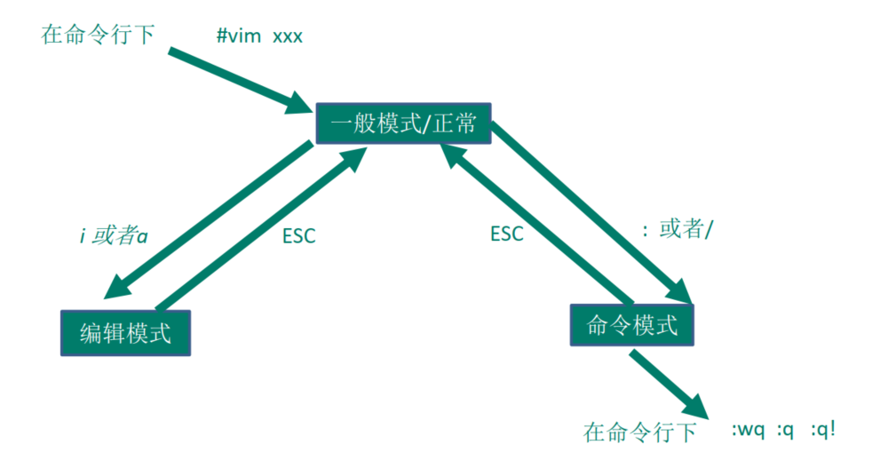

vi和vim快捷键

1. 拷贝当前行 `yy` , 拷贝当前行向下的5行 `5yy`，并粘贴`p`。
2. 删除当前行 `dd` , 删除当前行向下的5行 `5dd`
3. 在文件中查找某个单词 [命令行下 `/关键字` ， `回车enter`表示 查找 , 输入 `n`就是查找下一个。取消搜索高亮`:noh`
4. 设置文件的行号，取消文件的行号.[命令行下 `:set nu` 和 `:set nonu]`
5. 编辑 /etc/profile 文件，使用快捷键到底文档的最末行`G`和最首行`gg`
6. 在一个文件中输入 "hello" ,然后又撤销这个动作 `u`
7. 编辑 /etc/profile 文件，并将光标移动到 20行 shift+g，需要到哪一行，则键入行号，然后shift+g即可

### 开机、重启、用户登录注销

关机&重启命令
基本介绍:
|指令|作用|
|:----|:----|
|`shutdown –h now`|立该进行关机|
|`shudown -h 1`|1分钟后执行关机|
|`shutdown –r now`|现在重新启动计算机|
|`halt`|关机，作用和上面一样|
|`reboot`|现在重新启动计算机|
|`sync`|把内存的数据同步到磁盘|
注意细节:
不管是重启系统还是关闭系统，首先要运行sync命令，把内存中的数据写到磁盘中

用户登录和注销

1. 登录时尽量少用root帐号登录，因为它是系统管理员，最大的权限，避免操作失误。可以利用普通用户登录，登录后再用 `su - 用户名`命令来切换成系统管理员身份.
2. 在提示符下输入 logout 即可注销用户


> 使用细节:
   logout 注销指令在图形运行级别无效，在 `运行级别3` 下有效.

### 用户管理

#### 添加用户

* 基本语法
  `useradd 用户名`
* 应用案例
  添加一个用户Tom：`useradd Tom`
* 细节说明
  1. 当创建用户成功后，会自动的创建和用户同名的家目录
  2. 也可以通过 useradd -d 指定目录 新的用户名，给新创建的用户指定家目录
     `useradd -d /home/test Jack` 表示创建用户Jack，且该用户的家目录是/home/test

#### 指定密码/修改密码

* 基本语法
  `passwd 用户名`
* 应用案例
  给Tom 指定密码：

  ```shell
  passwd Tom
  # 弹出输入用户密码的提示：直接输入密码，然后再次输入
  ```

#### 删除用户

* 基本语法
  `userdel 用户名`
* 应用案例
  1. 删除用户Tom，但是要保留家目录：`userdel Tom`
  2. 删除用户Tom以及用户主目录：`userdel -r Tom`

#### 查询用户信息指令

* 基本语法
  `id 用户名`
* 应用实例
  请查询root 信息：`id root`
* 细节说明
  当用户不存在时，返回无此用户

#### 切换用户

* 在操作Linux中，如果当前用户的权限不够，可以通过 su - 指令，切换到高权限用户，比如root
* 基本语法
  `su – 切换用户名`
* 应用实例
  1. 创建一个用户Tom，指定密码，然后切换到Tom

     ```shell
     useradd Tom
     passwd Tom
     su - Tom
     ```

* 细节说明
  1. 从权限高的用户切换到权限低的用户，不需要输入密码，反之需要。
  2. 当需要返回到原来用户（上一级用户）时，使用exit指令(或者logout指令)

#### 查看当前用户/登录用户

`whoami` 或者 `who am i`
该命令查出的是第一次登录使用的用户，而不是经过中间切换的

#### 用户组

* 添加组
  `groupadd 组名`

* 删除组
  `groupdel 组名`

* 增加用户时直接加上组
  `useradd -g 用户组 用户名`
  >如果在添加用户的时候没有指定组，则默认会创建一个与用户名相同的一个组，并将该用户添加到这个组里面
* 修改用户所在的组
  `usermod -g 用户组 用户名`

* 用户和组的相关文件

`/etc/passwd` 文件

* 用户（user）的配置文件，记录用户的各种信息
* 每行的含义： 用户名:口令:用户标识号:组标识号:注释性描述:主目录:登录Shell

`/etc/shadow` 文件

* 口令的配置文件
* 每行的含义： 登录名:加密口令:最后一次修改时间:最小时间间隔:最大时间间隔:警告时间:不活动时间:失效时间:标志

`/etc/group` 文件

* 组(group)的配置文件，记录Linux包含的组的信息
* 每行含义： 组名:口令:组标识号:组内用户列表

> 1. 口令可能是加密的
> 2. 登录shell的意思：输入的命令是需要解析后送到linux内核去执行，而解析工具有不同的实现，比如常用的bash

查看用户信息

```shell
Xshell 7 (Build 0056)
Copyright (c) 2020 NetSarang Computer, Inc. All rights reserved.

Type help to learn how to use Xshell prompt.
[C:\~]$

Connecting to 192.168.80.128:22...
Connection established.
To escape to local shell, press 'Ctrl+Alt+]'.

Last login: Wed Feb 10 23:18:47 2021 from 192.168.80.1
[agile@centos1 ~]$ cat /etc/passwd
root:x:0:0:root:/root:/bin/bash
bin:x:1:1:bin:/bin:/sbin/nologin
daemon:x:2:2:daemon:/sbin:/sbin/nologin
adm:x:3:4:adm:/var/adm:/sbin/nologin
lp:x:4:7:lp:/var/spool/lpd:/sbin/nologin
sync:x:5:0:sync:/sbin:/bin/sync
shutdown:x:6:0:shutdown:/sbin:/sbin/shutdown
halt:x:7:0:halt:/sbin:/sbin/halt
mail:x:8:12:mail:/var/spool/mail:/sbin/nologin
operator:x:11:0:operator:/root:/sbin/nologin
games:x:12:100:games:/usr/games:/sbin/nologin
ftp:x:14:50:FTP User:/var/ftp:/sbin/nologin
nobody:x:99:99:Nobody:/:/sbin/nologin
systemd-network:x:192:192:systemd Network Management:/:/sbin/nologin
dbus:x:81:81:System message bus:/:/sbin/nologin
polkitd:x:999:998:User for polkitd:/:/sbin/nologin
libstoragemgmt:x:998:995:daemon account for libstoragemgmt:/var/run/lsm:/sbin/nologin
colord:x:997:994:User for colord:/var/lib/colord:/sbin/nologin
rpc:x:32:32:Rpcbind Daemon:/var/lib/rpcbind:/sbin/nologin
saned:x:996:993:SANE scanner daemon user:/usr/share/sane:/sbin/nologin
gluster:x:995:992:GlusterFS daemons:/run/gluster:/sbin/nologin
saslauth:x:994:76:Saslauthd user:/run/saslauthd:/sbin/nologin
abrt:x:173:173::/etc/abrt:/sbin/nologin
setroubleshoot:x:993:990::/var/lib/setroubleshoot:/sbin/nologin
rtkit:x:172:172:RealtimeKit:/proc:/sbin/nologin
pulse:x:171:171:PulseAudio System Daemon:/var/run/pulse:/sbin/nologin
radvd:x:75:75:radvd user:/:/sbin/nologin
chrony:x:992:987::/var/lib/chrony:/sbin/nologin
unbound:x:991:986:Unbound DNS resolver:/etc/unbound:/sbin/nologin
qemu:x:107:107:qemu user:/:/sbin/nologin
tss:x:59:59:Account used by the trousers package to sandbox the tcsd daemon:/dev/null:/sbin/nologin
sssd:x:990:984:User for sssd:/:/sbin/nologin
usbmuxd:x:113:113:usbmuxd user:/:/sbin/nologin
geoclue:x:989:983:User for geoclue:/var/lib/geoclue:/sbin/nologin
ntp:x:38:38::/etc/ntp:/sbin/nologin
gdm:x:42:42::/var/lib/gdm:/sbin/nologin
rpcuser:x:29:29:RPC Service User:/var/lib/nfs:/sbin/nologin
nfsnobody:x:65534:65534:Anonymous NFS User:/var/lib/nfs:/sbin/nologin
gnome-initial-setup:x:988:982::/run/gnome-initial-setup/:/sbin/nologin
sshd:x:74:74:Privilege-separated SSH:/var/empty/sshd:/sbin/nologin
avahi:x:70:70:Avahi mDNS/DNS-SD Stack:/var/run/avahi-daemon:/sbin/nologin
postfix:x:89:89::/var/spool/postfix:/sbin/nologin
tcpdump:x:72:72::/:/sbin/nologin
agile:x:1000:1000:agile:/home/agile:/bin/bash
tom:x:1001:1001::/home/tom:/bin/bash
[agile@centos1 ~]$
```

查看组信息

```shell
Xshell 7 (Build 0056)
Copyright (c) 2020 NetSarang Computer, Inc. All rights reserved.

Type help to learn how to use Xshell prompt.
[C:\~]$

Connecting to 192.168.80.128:22...
Connection established.
To escape to local shell, press 'Ctrl+Alt+]'.

Last login: Wed Feb 10 23:36:02 2021 from 192.168.80.1
[agile@centos1 ~]$ cat /etc/group
root:x:0:
bin:x:1:
daemon:x:2:
sys:x:3:
adm:x:4:
tty:x:5:
disk:x:6:
lp:x:7:
mem:x:8:
kmem:x:9:
wheel:x:10:agile
cdrom:x:11:
mail:x:12:postfix
man:x:15:
dialout:x:18:
floppy:x:19:
games:x:20:
tape:x:33:
video:x:39:
ftp:x:50:
lock:x:54:
audio:x:63:
nobody:x:99:
users:x:100:
utmp:x:22:
utempter:x:35:
stapusr:x:156:
stapsys:x:157:
stapdev:x:158:
input:x:999:
systemd-journal:x:190:
systemd-network:x:192:
dbus:x:81:
polkitd:x:998:
printadmin:x:997:
cgred:x:996:
libstoragemgmt:x:995:
colord:x:994:
rpc:x:32:
saned:x:993:
dip:x:40:
gluster:x:992:
ssh_keys:x:991:
saslauth:x:76:
abrt:x:173:
setroubleshoot:x:990:
rtkit:x:172:
pulse-access:x:989:
pulse-rt:x:988:
pulse:x:171:
radvd:x:75:
chrony:x:987:
unbound:x:986:
kvm:x:36:qemu
qemu:x:107:
tss:x:59:
libvirt:x:985:
sssd:x:984:
usbmuxd:x:113:
geoclue:x:983:
ntp:x:38:
gdm:x:42:
rpcuser:x:29:
nfsnobody:x:65534:
gnome-initial-setup:x:982:
sshd:x:74:
slocate:x:21:
avahi:x:70:
postdrop:x:90:
postfix:x:89:
tcpdump:x:72:
agile:x:1000:
tom:x:1001:
[agile@centos1 ~]$
```

### 实用指令

#### 指定运行级别

运行级别说明：
0 ：关机
1 ：单用户【找回丢失密码】
2：多用户状态没有网络服务
3：多用户状态有网络服务
4：系统未使用保留给用户
5：图形界面
6：系统重启
常用运行级别是3和5
CentOS7之前：
要修改默认的运行级别可改文件
/etc/inittab的id:5:initdefault:这一行中的数字
CentOS7之后：

```shell
systemctl set-default multi-user.target # 设置默认运行级别为运行级别3，多用户有网络服务
systemctl set-default graphical.target  # 设置默认运行级别为运行级别5，图像界面
systemctl get-default                   # 获取当前系统的默认运行级别
```

如果想切换运行级别：
`init [0-6]`
比如：`init 3`则会立即进入运行级别3

#### 找回root用户密码

找回root用户密码步骤(CentOS7)：
开机按e
找到以Linux16开头的行，在该行最后输入 `init=/bin/sh`
按Ctrl+X 执行
进入命令行后：
输入`mount -o remount,rw /`,然后回车
之后再输入`passwd`,回车
此处输入两次新密码
接着在闪烁处输入 `touch /.autorelabel`,回车
`exec /sbin/init`,回车
上面输入命令后等待一会(提示信息出来了也不要动)，等待系统自动重启即可完成
系统重启后就可使用刚刚设置的新密码进入系统

#### 帮助指令

man 获得帮助信息

* 基本语法
`man [命令或配置文件]`（功能描述：获得帮助信息）
* 应用实例
案例：查看ls命令的帮助信息
`man ls`
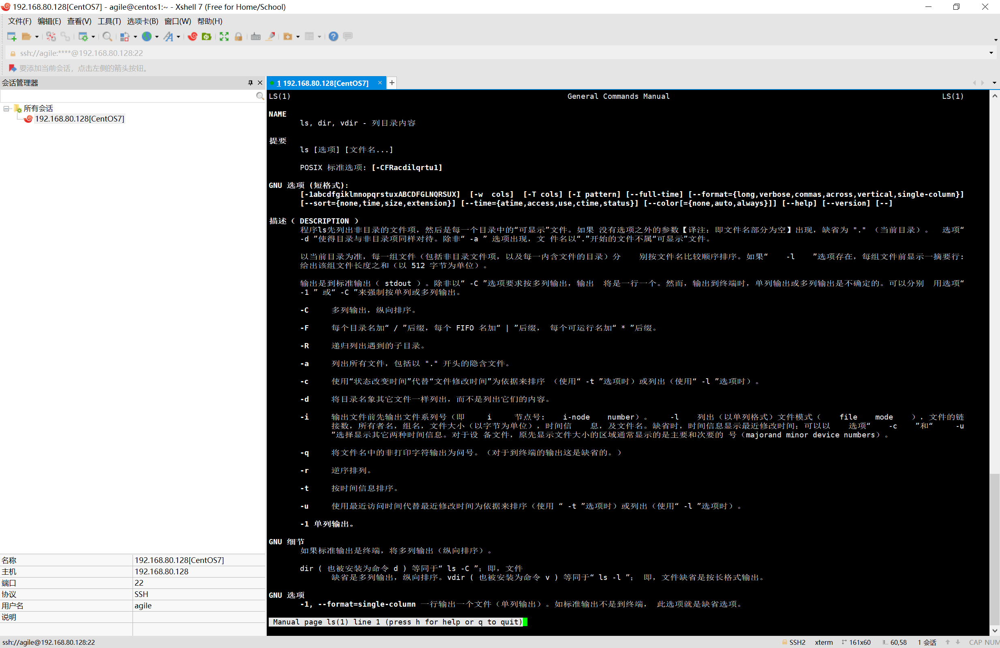
可以看到，指令`ls`的完整格式和更多的用法，比如可以指明想查看的目录，还有以何种形式列出：
`ls -la /opt`,其中`-la`是`-a`和`-l`组合的写法，-a是列出所有文件，包括隐含文件；-l是每个文件(夹)以单列打印出来

help指令

* 基本语法
help 命令 （功能描述：获得shell内置命令的帮助信息）
* 应用实例
案例：查看cd命令的帮助信息

#### 文件目录类

pwd 指令

* 基本语法
pwd (功能描述：显示当前工作目录的绝对路径)
* 应用实例
案例：显示当前工作目录的绝对路径
指令：`pwd`

ls指令

* 基本语法
ls [选项] [目录或是文件]
* 常用选项
-a ：显示当前目录所有的文件和目录，包括隐藏的。
-l ：以列表的方式显示信息
* 应用实例
案例:查看当前目录的所有内容信息
指令：`ls -la`

  > 默认显示详细信息，文件大小是以字节B为单位，可以使用`ls -lah`来显示

cd 指令

* 基本语法
cd [参数] (功能描述：切换到指定目录)
* 常用参数
绝对路径和相对路径
cd ~ 或者cd ： 回到自己的家目录
cd .. 回到当前目录的上一级目录
* 应用实例
案例1： 使用绝对路径切换到root目录
指令：`cd /root`
案例2: 使用相对路径到/root 目录(当前是root用户登录)
指令：`cd ~`
案例3： 表示回到当前目录的上一级目录
指令：`cd ..`
案例4：回到家目录(不同用户的家目录是不同的，这个指令会回到用户自己的家目录)
指令：`cd ~`

mkdir指令

* mkdir指令用于创建目录
* 基本语法
`mkdir [选项] 要创建的目录`,默认是只有当父目录存在才能创建子级目录，想同时多级目录一起创建需要使用-p
* 常用选项
-p ：创建多级目录
* 应用实例
案例1:创建一个目录 /home/dog
指令：`mkdir -p /home/dog`
案例2:创建多级目录 /home/animal/tiger
指令：`mkdir -p /home/animal/tiger`

rmdir指令

* rmdir指令删除空目录
* 基本语法
rmdir [选项] 要删除的空目录
* 应用实例
案例1:删除一个目录 /home/dog
* 使用细节
rmdir 删除的是空目录，如果目录下有内容时无法删除的。
提示：如果需要删除非空目录，需要使用 `rm -rf 要删除的目录路径`

touch指令

* touch指令创建空文件
* 基本语法
touch 文件名称
* 应用实例
案例1: 创建一个空文件 hello.txt
指令：`touch hello.txt

cp指令

* cp 指令拷贝文件到指定目录
* 基本语法
`cp [选项] source dest`
* 常用选项
-r ：递归复制整个文件夹
* 应用实例
案例1: 将 /home/aaa.txt 拷贝到 /home/bbb 目录下
指令：`cp /home/aaa.txt /home/bbb`
案例2: 递归复制整个文件夹，将 /home/aaa 目录拷贝到 /home/bbb 目录下
指令：`cp -r /home/aaa home/bbb`
* 使用细节
强制覆盖不提示的方法： `\cp`
指令：`\cp -r /home/aaa home/bbb`

rm指令

* rm 指令移除文件或目录
* 基本语法
rm [选项] 要删除的文件或目录
* 常用选项
-r ：递归删除整个文件夹
-f ： 强制删除不提示
* 应用实例
  1. 案例1: 将 /home/aaa.txt 删除
  指令：`rm /home/aaa.txt`  会有提示是否删除，输入y即可删除
  2. 案例2: 递归删除整个文件夹 /home/bbb
  指令：`rm -r /home/bbb`   每删文件夹下的一个文件，都会询问一次
* 使用细节
强制删除不提示的方法： 带上 `-f` 参数即可

mv指令

* mv 移动文件与目录或重命名
* 基本语法
`mv oldNameFile newNameFile` (功能描述：重命名)
`mv /temp/movefile /targetFolder` (功能描述：移动文件)
* 应用实例
  1. 案例1: 将 /home/aaa.txt 文件 重新命名为 pig.txt
  指令：`mv /home/aaa.txt /home/pig.txt`
  如果目前就在`/home`目录下，则直接`mv aaa.txt pig.txt`
  2. 案例2:将 /home/pig.txt 文件移动到 /root 目录下
  指令：`mv /home/pig.txt /root`
  3. 案例3：将/home/pig.txt 文件移动到/root目录下，并重命名为cat.txt
  指令：`mv /home/pig.txt /root/cat.txt`

cat指令

* cat 查看文件内容
* 基本语法
`cat [选项] 要查看的文件`
* 常用选项
-n ： 显示行号
* 应用实例
  1. 案例1: `/etc/profile` 文件内容，并显示行号
  指令：`cat -n /etc/profile`
* 使用细节
cat 只能浏览文件，而不能修改文件，为了浏览方便，一般会带上 管道命令 | more
指令：`cat -n /etc/profile |more` ，按回车可以继续查看一行，按空格查看下一行

more指令

* more指令是一个基于VI编辑器的文本过滤器，它以全屏幕的方式按页显示文本文件的内容。
* more指令中内置了若干快捷键，详见操作说明
* 基本语法
more 要查看的文件
* 操作说明

  |操作|功能说明|
  |:----|:----|
  |空白键(space)|代表向下翻一页|
  |Enter|代表向下翻一行|
  |q|代表立刻离开more,不再显示文件内容|
  |Ctrl+F|向下滚动一屏|
  |Ctrl+B|返回上一屏|
  |=|输出当前行的行号|
  |:f|输出文件名和当前行的行号|

* 应用实例
案例: 采用more查看文件/etc/profile
指令：`more /etc/profile`

less指令

* less指令用来分屏查看文件内容，它的功能与more指令类似，但是比more指令更加强大，支持各种显示终端。 less指令在显示文件内容时，并不是一次将整个文件加载之后才显示，而是根据显示需要加载内容， 对于显示大型文件具有较高的效率。
* 基本语法
`less 要查看的文件`
* 操作说明

  |操作|功能说明|
  |:----|:----|
  |空白键(space)|向下翻动一页|
  |pagedown`[`|向下翻动一页|
  |pageup`]`|向上翻动一页|
  |`/字符串`|向下搜寻字符串;n：向下查找；N：向上查找|
  |`?字符串`|向上搜寻字符串;n：向下查找；N：向上查找|
  |q|离开less指令|

* 应用实例
案例: 采用less查看一个大文件文件

`>`指令 和 `>>`指令

* `>` 输出重定向 : 会将原来的文件的内容覆盖
* `>>` 追加： 不会覆盖原来文件的内容， 而是追加到文件的尾部。
* 基本语法：
  * `ls -la > 文件` （功能描述： 列表的内容写入文件中（覆盖写） ）
  * `ls -al >> 文件` （功能描述： 列表的内容追加到文件的末尾）
  * `cat 文件1 > 文件2` （功能描述： 将文件 1 的内容覆盖到文件 2）
  * `cat 文件1 >> 文件2` （功能描述： 将文件 1 的内容追加到文件 2末尾）
  * `echo "内容" > 文件`  (将"内容" 覆盖到到文件)
  * `echo "内容" >> 文件`  (将"内容" 追加到文件末尾)

echo指令

* echo 输出内容到控制台
* 基本语法
`echo [选项] [输出内容]`
* 应用实例
  1. 案例: 使用 echo 指令输出环境变量,输出当前的环境路径。
     `echo $PATH`
  2. 案例: 使用 echo 指令输出 hello,world!
     `echo "hello,world"`

head指令

* head 用于显示文件的开头部分内容， 默认情况下 head 指令显示文件的前 10 行内容
* 基本语法
`head 文件` (功能描述： 查看文件头 10 行内容)
`head -n 5 文件` (功能描述： 查看文件头 5 行内容， 5 可以是任意行数)
* 应用实例
  1. 案例: 查看/etc/profile 的前面 5 行代码
     `head -n 5 /etc/profile`

tail指令

* tail 用于输出文件中尾部的内容， 默认情况下 tail 指令显示文件的后 10 行内容。
* 基本语法
  1. `tail 文件` （功能描述： 查看文件后 10 行内容）
  2. `tail -n 5 文件` （功能描述： 查看文件后 5 行内容， 5 可以是任意行数）
  3. `tail -f 文件` （功能描述： 实时追踪该文档的所有更新， 工作经常使用）
* 应用实例
案例 1: 查看/etc/profile 最后 5 行的代码
`tail -n 5 /etc/profile`
案例 2: 实时监控 mydate.txt , 看看到文件有变化时， 是否看到， 实时的追加日期
`tail -f mydate.txt`   （Ctrl+C退出监控）

ln指令

* 软链接也叫符号链接， 类似于 windows 里的快捷方式， 主要存放了链接其他文件的路径
* 基本语法
`ln -s [原文件或目录] [软链接名]` （功能描述： 给原文件创建一个软链接）
* 应用实例
  1. 案例 1: 在/home 目录下创建一个软连接 linkToRoot， 连接到 /root 目录

      ```shell
      cd /home
      ln -s /root linkToRoot
      pwd linkToRoot  # 输出/root
      ```

history指令

* 查看已经执行过历史命令,也可以执行历史指令
* 基本语法
history （功能描述： 查看已经执行过历史命令）
* 应用实例
案例 1: 显示所有的历史命令
`history`
案例 2: 显示最近使用过的 10 个指令。
`history 10`
案例 3： 执行历史编号为 5 的指令
`!5`

#### 时间日期类

date指令-显示时间日期

* 基本语法
  1. `date` （功能描述： 显示当前时间）
  2. `date +%Y` （功能描述： 显示当前年份）
  3. `date +%m` （功能描述： 显示当前月份）
  4. `date +%d`（功能描述： 显示当前是哪一天）
  5. `date "+%Y-%m-%d %H:%M:%S"`（功能描述： 显示年月日时分秒）
* 应用实例
  1. 案例 1: 显示当前时间信息
    `date`
  2. 案例 2: 显示当前时间年月日
    `date "+%Y-%m-%d"`
  3. 案例 3: 显示当前时间年月日时分秒
    `date "+%Y-%m-%d %H:%M:%S"`

date指令-设置日期

* 基本语法
date -s 字符串时间
* 应用实例
  1. 案例 1: 设置系统当前时间 ， 比如设置成 `2020-12-12 11:22:22`
    `date -s "2020-12-12 11:22:22"`

cal指令

* 查看日历指令
* 基本语法
  `cal [选项]`  （功能描述：不加选项，显示本月日历）
* 应用实例
  案例1：显示当前日历
  `cal`   (会显示一个月的日历)
  案例2：显示2020年日历
  `cal 2020`

#### 搜索查找类

find 指令

* find 指令将从指定目录向下递归地遍历其各个子目录， 将满足条件的文件或者目录显示在终端。
* 基本语法
`find [搜索范围] [选项]`
* 选项说明

|选项|功能|
|:----|:----|
|`-name<查询方式>`|按照指定的文件名查找默认查找文件|
|`-user<用户名>`|查找属于指定用户名所有文件|
|`-size<文件大小>`|按照指定的文件大小查找文件|

* 应用实例

1. 案例 1: 按文件名： 根据名称查找/home 目录下的 hello.txt 文件
  `find /home -name hello.txt`
2. 案例 2： 按拥有者： 查找/opt 目录下， 用户名称为 nobody 的文件
  `find /opt -user nobody`
3. 案例 3： 查找整个 linux 系统下大于 200M 的文件（+n 大于 -n 小于 n 等于;单位有K,M,G）
`find / -size +200M`

> 如果能查找到，则输出命令后，会打印查找的文件所在的位置；如果没有找到，则不会显示任何信息

locate 指令

* locaate 指令可以快速定位文件路径。 locate 指令利用事先建立的系统中所有文件名称及路径的
* locate 数据库实现快速定位给定的文件。 Locate 指令无需遍历整个文件系统， 查询速度较快。 为了保证查询结果的准确度， 管理员必须定期更新 locate 时刻。
* 基本语法
`locate 文件名`
* 特别说明
由于 locate 指令基于数据库进行查询， 所以第一次运行前， 必须使用 updatedb 指令创建 locate 数据库。
* 应用实例
  1. 案例1: 请使用 locate 指令快速定位 hello.txt 文件所在目录

     ```shell
     updatedb
     locate hello.txt
     ```

which指令

* 查看指令是存放在哪个目录下(Linux命令其实就是一个个可以运行的程序)
* 基于语法
  `which 命令名`
* 应用实例
  1. 查看ls命令所在的目录
  `which ls`

grep 指令和管道符号`|`

* grep 表示过滤查找，管道符为：`|`，表示将前一个命令的处理结果输出传递给后面的命令处理。
* 基本语法
`grep [选项] 查找内容 源文件`
* 常用选项

  |选项|功能|
  |:----|:----|
  |-n|显示匹配行及行号|
  |-i|忽略字母大小写|

* 应用实例
  1. 案例 1: 请在 hello.txt 文件中， 查找 "myname" 所在行， 并且显示行号
  `cat hello.txt | grep -n myname`  （区分大小写）
  `cat hello.txt | grep -ni myname` （不区分大小写）

> 管道命令的意思就是将前面的结果交给后面来处理

#### 压缩和解压类

gzip/gunzip 指令

* gzip 用于压缩文件， gunzip 用于解压的
* 基本语法
`gzip 文件` （功能描述： 压缩文件， 只能将文件压缩为*.gz 文件）
`gunzip 文件.gz` （功能描述： 解压缩文件命令）
* 应用实例
  1. 案例 1: gzip 压缩， 将 /home 下的 hello.txt 文件进行压缩
    `gzip hello.txt`

  2. 案例 2: gunzip 压缩， 将 /home 下的 hello.txt.gz 文件进行解压缩
     `gunzip hello.txt.gz`

> 当使用gzip对文件进行压缩后，不会保留源文件；
> 当使用gunzip对文件进行解压后，也不会保留压缩文件，只留下了解压后的文件

zip/unzip指令

* zip 用于压缩文件， unzip 用于解压的， 这个在项目打包发布中很有用的
* 基本语法
`zip [选项] XXX.zip 待被压缩的目录或文件`（功能描述： 压缩文件和目录的命令）
`unzip [选项] XXX.zip` （功能描述： 解压缩文件）
* zip 常用选项
  * `-r`： 递归压缩， 即压缩目录
* unzip 的常用选项
  * `-d 目录`： 指定解压后文件的存放目录
* 应用实例
  1. 案例 1: 将 /home 下的 所有文件进行压缩成 mypackage.zip
   `zip -r mypackage.zip /home/`
  2. 案例 2: 将 mypackge.zip 解压到 /opt/tmp 目录下
    `unzip -d /opt/temp /home/myhome.zip`

tar指令

* tar指令 是打包指令， 最后打包后的文件是 `.tar.gz` 的文件。
* 基本语法
`tar [选项] XXX.tar.gz 打包的内容` (功能描述： 打包目录， 压缩后的文件格式XXX.tar.gz)
* 选项说明

  |选项|功能|
  |:----|:----|
  |-c|产生`.tar`打包文件|
  |-v|显示详细信息|
  |-f|指定压缩后的文件名|
  |-z|打包同时压缩|
  |-x|解压`.tar`文件|

* 应用实例

1. 案例 1: 压缩多个文件， 将 /home/a1.txt 和 /home/a2.txt 压缩成 a.tar.gz
  `tar -zcvf a.tar.gz /home/a1.txt /home/a2.txt`
2. 案例 2: 将/home 的文件夹 压缩成 myhome.tar.gz
  `tar -zcvf myhome.tar.gz /home/`
3. 案例 3: 将 a.tar.gz 解压到当前目录
  `tar -zxvf a.tar.gz`
4. 案例 4: 将 myhome.tar.gz 解压到 /opt/ 目录下
  `tar -zxvf /home/myhome.tar.gz -C /opt`

> 指定解压到的那个目录，事先要存在才能成功，否则会报错

### 组管理和权限管理

#### 查看权限信息

* 在 linux 中的每个用户必须属于一个组， 不能独立于组外。 在 linux 中每个文件有所有者、 所在组、 其它组的概念。
* 文件/目录 所有者
一般为文件的创建者,谁创建了该文件， 就自然的成为该文件的所有者。

查看文件(目录)的所有者
指令：`ls -lah`
可以看到所有该目录下的文件(文件夹)的详细信息

修改文件(目录)所有者
指令：`chown 用户名 文件名`
前提是得有一定的权限，比如root用户，否则一个文件本来不属于该用户，是无法自己去分配给自己的

文件/目录 所在组
当用户创建了一个文件后，默认这个文件所在组就是该用户所在的组

查看文件/目录所在组
指令：`ls -lah`

修改文件/目录所在的组
指令：`chgrp 组名 文件名`

其他组
除文件的所有者和所在组的用户外，系统的其他用户都是文件的其他组

改变用户所在组
`usermod -g 组名 用户名`
`usermod -d 目录名 用户名`  改变该用户登录的初始目录

#### 认识资源权限

使用`ls -lh`中显示的内容如下：

```shell
-rw-rw-r--. 1 agile agile 1.2K 2月  13 09:35 a.txt
-rw-r--r--. 1 agile agile 3.9M 2月  13 08:32 eight.txt
-rw-rw-r--. 1 agile agile    0 2月  11 11:00 hello.txt
lrwxrwxrwx. 1 agile agile    4 2月  13 09:18 linkTo -> /opt
drwxr-xr-x. 2 agile agile 4.0K 2月  10 15:43 公共
drwxr-xr-x. 2 agile agile 4.0K 2月  10 15:43 模板
drwxr-xr-x. 2 agile agile 4.0K 2月  10 15:43 视频
drwxr-xr-x. 2 agile agile 4.0K 2月  10 15:43 图片
drwxr-xr-x. 2 agile agile 4.0K 2月  10 15:43 文档
drwxr-xr-x. 2 agile agile 4.0K 2月  10 15:43 下载
drwxr-xr-x. 2 agile agile 4.0K 2月  10 15:43 音乐
drwxr-xr-x. 2 agile agile 4.0K 2月  10 22:35 桌面
```

第一列：
`-rw-rw-r--` 中的每一位代表的意义如下：
0-9位说明：

1. 第 0 位确定文件类型(d文件夹, -文件 , l链接 , c字符设备，如键盘 , b块设备)
2. 第 1-3 位确定所有者（该文件的所有者） 拥有该文件的权限。 ---User，即所有者权限
3. 第 4-6 位确定所属组（同用户组的） 拥有该文件的权限， ---Group，即所属组权限
4. 第 7-9 位确定其他用户拥有该文件的权限 ---Other，即其他组权限

第二列：
数字，如果当前是文件则为1，如果是目录，则数字表示其目录下文件+文件夹的数目(只统计一级)

第三列：
第一个名字表示文件或文件夹的所有者

第四列：
第二个名字表示文件或文件夹的所在组

第五列：
表示当前文件或者文件夹的大小

第六列：
表示当前文件或文件夹的最近修改时间

第七列:
表示当前文件或文件夹的名称

#### rwx权限详解

rwx作用到文件

1. `r` 代表可读(read): 可以读取,查看
2. `w` 代表可写(write): 可以修改,但是不代表可以删除该文件,删除一个文件的前提条件是对该文件所在的目录有写权限， 才能删除该文件.
3. `x` 代表可执行(execute):可以被执行

rwx 作用到目录

1. `r`代表可读(read): 可以读取，ls 查看目录内容
2. `w`代表可写(write): 可以修改，即目录内创建文件、删除文件，以及重命名目录
3. `x`代表可执行(execute):可以进入该目录

#### 修改权限

通过chmod指令，可以修改文件或者目录的权限

第一种方式：`+`、`-`、`=`变更权限
u：拥有者者；q：所属组；o：其他人；a：所有人(u、g、o的总和)

1. `chmod u=rwx,g=rx,o=x 文件/目录名`  （表示给文件/目录的所有者赋予读写执行权限，所属组的用户有读和执行权限，其他组的用户只有执行权限）
2. `chmod o+w 文件/目录名`  （表示其他组被添加了对该文件/目录的写权限）
3. `chmod a-x 文件/目录名`  （表示所有用户都被取消了对该文件/目录的执行权限）

案例演示

1. 给 abc.txt的所有者读写执行的权限， 给所在组读执行权限， 给其它组读执行权限。
   `chmod u=rwx,g=rx,=rx abc.txt`
2. 给 abc.txt的所有者除去执行的权限， 增加组写的权限
   `chmod u-x,g+w abc.txt`
3. 给 abc.txt的所有用户添加读的权限
   `chmod a+r abc.txt`

第二种方式：通过数字变更权限

规则： `r=4` `w=2` `x=1` ,`rwx=4+2+1=7`
`chmod u=rwx,g=rx,o=x 文件/目录名` 相当于 `chmod 751 文件/目录名`
案例演示

   1. 要求： 将 /home/abc.txt 文件的权限修改成 rwxr-xr-x, 使用给数字的方式实现：
   rwx = 4+2+1 = 7
   r-x = 4+1=5
   r-x = 4+1 =5
   指令： chmod 755 /home/abc.txt

rwx组合产生的数字代表的权限：
1：x,只有执行的权限
2：w,只有写的权限
3：wx,写和执行的权限
4：r,只有读的权限
5：rx,读和执行的权限
6：rw,读和写的权限
7：rwx,读和写还有执行的权限

#### 修改文件所有者-chown

基本介绍：
`chown newowner 文件/目录`  改变文件/目录的所有者
`chown newowner:newgroup 文件/目录`  改变用户的所有者和所有组
选项说明：
`-R`：如果是目录，则使其下所有子文件或者目录递归生效
案例演示：

1. 请将 /home/abc.txt 文件的所有者修改成 tom
  `chown tom /home/abc.txt`
2. 请将 /home/kkk 目录下所有的文件和目录的所有者都修改成 tom
  `chown -R tom /home/kkk`  （请在root登录下进行）

#### 修改文件所在组-chgrp

* 基本介绍：
`chgrp newgroup 文件/目录名`   改变文件/目录所属的组
* 选项说明：
`-R`：如果是目录，则使其下所有子文件或者目录递归生效
* 案例演示
  1. 将 `/home/abc.txt` 文件的所属组修改为tom
    `chgrp tom /home/abc.txt`
  2. 将 `/home/kkk` 目录下的所有文件和目录的所在组都修改成tom
    `chgrp -R tom /home/kkk`

### 定时任务调度

#### 任务调度指令

定时的调度脚本或者代码，完成某个任务
如果只是简单的人物，可以不用写脚本，直接在crontab中加入任务即可，对于比较复杂的任务，需要些脚本(Shell编程)

任务调度： 是指系统在某个时间执行的特定的命令或程序。
任务调度分类：

  1. 系统工作： 有些重要的工作必须周而复始地执行。 如病毒扫描等
  2. 个别用户工作： 个别用户可能希望执行某些程序， 比如对 mysql 数据库的备份。

基本语法
`crontab [选项]`
常用选项

|选项|作用|
|:----|:----|
|`-e`| 编辑crontab定时任务|
|`-l`|查询crontab任务|
|`-r`|删除当前用户所有的crontab任务|
> 重启任务调度 `service crond restart`

入门示例

* 设置任务调度文件：/etc/crontab
* 设置个人任务调度，执行`crontab -e`
  接着输入任务到调度文件，如：
  `*/1 * * * * ls -lh /etc > /home/tom/to.txt`   (写完后需要按esc退到普通模式，然后输入:wq保存并退出)
  表示每小时的每一分钟执行`ls -lh /etc > /home/tom/to.txt`

参数细节说明

1. 5个占位符的说明

   |项目|含义|范围|
   |:----|:----|:----|
   |第一个`*`|一小时当中的第几分钟|0-59|
   |第二个`*`|一天当中的第几小时|0-23|
   |第三个`*`|一个月当中的第几天|1-31|
   |第四个`*`|一年当中的第几月|1-12|
   |第五个`*`|一周当中的星期几|0-7(0和7都代表星期日)|

2. 特殊符号的说明

   |特殊符号|含义|
   |:----|:----|
   |`*`|代表任何时间。比如第一个`*`就代表一小时中每分钟都执行一次的意思|
   |`,`|代表不连续的时间。比如`0 8,12,16 * * * 命令`，就代表在每天的8点0分，12点0分，16点0分都执行一次命令|
   |`-`|代表连续的时间范围。比如`0 5 * * 1-6 命令`，代表在周一到周六的凌晨5点0分执行命令|
   |`*/n`|代表每隔多久执行一次。比如`*/10 * * * * 命令`,代表每隔10分钟就执行一次命令|

3. 特定时间执行任务案例

|时间|含义|
|:----|:----|
|`45 22 * * * 命令`|在22点45分执行命令|
|`0 17 * * 1 命令`|每周1的17点0分执行命令|
|`0 5 1,15 * * 命令`|每月1号和15号的凌晨5点0分执行命令|
|`40 4 * * 1-5 命令`|每周一到周五的凌晨4点40分执行命令|
|`*/10 4 * * * 命令`|每天的凌晨4点，每隔10分钟执行一次命令|
|`0 0 1,15 * 1 命令`|每月1号和15号，每周1的0点0分都会执行命令。注意：星期几和几号最好不要同时出现，因为它们都是定义的天，容易混乱|

#### 任务调度实例

1. 每隔1分钟，就将当前日期信息，追加到/home/tom/mydate.txt文件中

   ```shell
   # 先编写一个文件 /home/tom/mytask1.sh
   vim /home/tom/mytask1.sh
   # 编辑sh文件，将指令写入到文件中
   date >> /home/tom/mydate.txt
   # 给mytask1.sh一个可以执行的权限
   chmod 744 /home/tom/mytask1.sh
   # 将sh命令添加到任务调度中定时执行
   crontab -e
   # 上面命令之后，进入到了编辑命令文件
   */1 * * * * /home/tom/mytask1.sh
   ```

2. 每隔1分钟，将当前日期和日历都追加到/home/tom/mycal.txt文件中

   ```shell
   # 先编写一个文件 /home/tom/mytask2.sh
   vim /home/tom/mytask2.sh
   # 编辑sh文件，将指令写入到文件中
   date >> /home/tom/mycal.txt
   cal >> /home/tom/mycal.txt
   # 给mytask2.sh一个可以执行的权限
   chmod 744 /home/tom/mytask2.sh
   # 将sh命令添加到任务调度中定时执行
   crontab -e
   # 上面命令之后，进入到了编辑命令文件
   */1 * * * * /home/tom/mytask2.sh
   ```

3. 每天凌晨2:00将mysql数据库testdb,备份到文件/home/tom/mybd.bak中

   ```shell
   # 先编写一个文件 /home/tom/mytask3.sh
   vim /home/tom/mytask3.sh
   # 编辑sh文件，将指令写入到文件中
   # 备份数据库指令为：mysqldump -u 用户名 -p密码 数据库名 >> 文件位置
   mysqldump -u root -psysbook123 testdb > /home/tom/mydb.bak
   # 给mytask3.sh一个可以执行的权限
   chmod 744 /home/tom/mytask3.sh
   # 将sh命令添加到任务调度中定时执行
   crontab -e
   # 上面命令之后，进入到了编辑命令文件
   0 2 * * * /home/tom/mytask3.sh
   ```

#### at定时任务

基本介绍

1. at命令是一次性定时计划任务，at的守护进程atd会以后台模式运行，检查作业队列来运行
2. 默认情况下，atd守护进程每60秒检查作业队列，有作业时，会检查作业运行时间，如果时间与当前时间匹配，则运行此作业
3. at命令时一次性定时计划任务，执行完一个任务后不再执行此任务了
4. 在使用at命令的时候，一定要保证atd进程的启动，可以使用相关指令来查看

> 即at命令可以添加一个一次性定时计划任务，这个任务不一定立刻执行，而是通过指定一个时间点来执行。而又由谁来调度这个任务进行执行呢？由atd进程，这个进程专门作为守护进程，检查作业队列中是否有作业的执行时间与当前检查时间一致，如果一致则立即执行该任务，执行完毕后，并从作业队列中移除该作业

at命令格式：
`at [选项] [时间]`
Ctrl+D 结束at命令的输入

at命令选项

|选项|含义|
|:----|:----|
|-m|当指定的任务呗完成后，将给用户发送邮件，即使没有标准输出|
|-I|atq的别名|
|-d|atrm的别名|
|-v|显示任务将被执行的时间|
|-c|打印任务的内容到标准输出|
|-V|显示版本信息|
|-q 队列|使用指定的队列|
|-f 文件|从指定文件读入任务而不是标准输入读入|
|-t 时间参数|以时间参数的形式提交要运行的任务|

at时间定义的方式：

1. 接受在当天的hh:mm（小时:分钟）式的时间指定，加入该时间已过去，那么就放在第二天执行。例如：`04:00`
2. 使用midnight（深夜）,noon（中午）,teatime（饮茶时间,一般是下午4点）等比较模糊的词语来指定时间
3. 采用12小时计时制，在时间后面加上AM或PM来说明上午还是下午，例如`12pm`
4. 指定命令执行的具体日期，指定格式为month day（月 日）或mm/dd/yy（月/日/年）或dd.mm.yy（日.月.年）,指定的日期必须跟在指定时间的后面。例如：`04:00 2020-12-31`
5. 使用相对计时法，指定格式为：now+count time-units,now就是当前时间，time-units是时间单位，这里能够是minuts（分钟），hous（小时）,days（天）,weeks（星期）。count是时间的数量。例如：`now+5 minutes`
6. 直接使用today（今天）、tomorrow（明天）来指定完成命令的时间

应用实例：

1. 2天后的下午5点执行 `/bin/ls /home`
2. atq命令来查看系统中没有执行的工作任务
3. 明天17点，输出时间到指定文件内，比如/root/date100.log
4. 2分钟后，输出时间到指定文件内，比如/root/date200.log
5. 删除已经设置的任务，语法为:`atrm 任务编号`

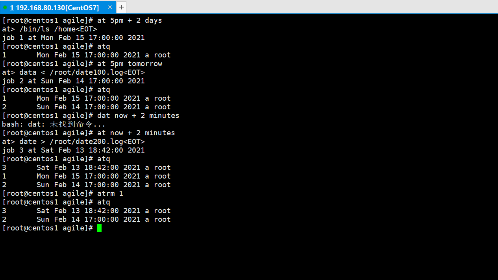

### 磁盘分区、挂载

#### 分区原理

1. 对于Linux 来说无论有几个分区， 分给哪一目录使用， 它归根结底就只有一个根目录， 一个独立且唯一的文件结构 , Linux 中每个分区都是用来组成整个文件系统的一部分。
2. Linux 采用了一种叫“载入” 的处理方法， 它的整个文件系统中包含了一整套的文件和目录，且将一个分区和一个目录联系起来。 这时要载入的一个分区将使它的存储空间在一个目录下获得。
3. 示意图


#### 硬盘说明

1. Linux 硬盘分 IDE 硬盘和 SCSI 硬盘， 目前基本上是 SCSI 硬盘
2. 对于 IDE 硬盘，驱动器标识符为`hdx~`,其中“hd”表明分区所在设备的类型，这里是指 IDE 硬盘了。 `x`为盘号（a 为基本盘，b 为基本从属盘，c 为辅助主盘，d 为辅助从属盘）,`~`代表分区，前四个分区用数字 1 到 4 表示， 它们是主分区或扩展分区， 从 5 开始就是逻辑分区。
例如， hda3 表示为第一个 IDE 硬盘上的第三个主分区或扩展分区,hdb3 表示为第二个 IDE 硬盘上的第三个主分区或扩展分区。
3. 对于 SCSI 硬盘则标识为`sdx~`， SCSI 硬盘是用`sd`来表示分区所在设备的类型的， 其余则和 IDE 硬盘的表示方法一样。
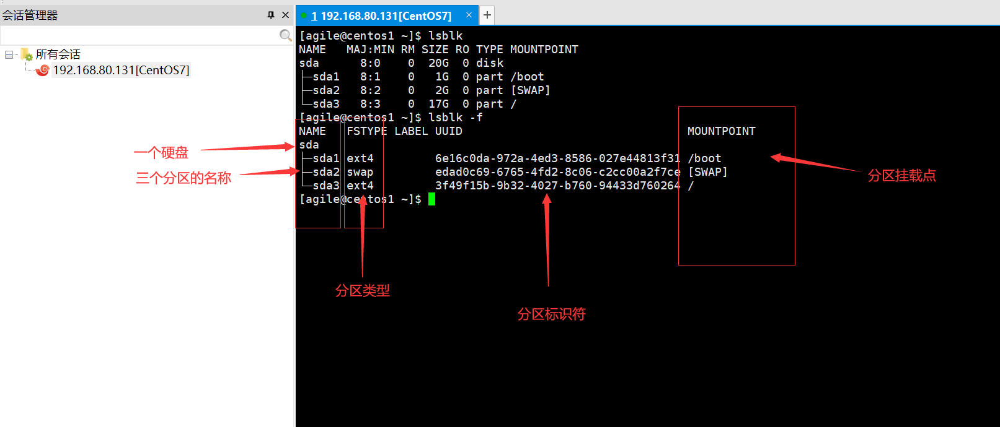

#### 挂载示例

给Linux系统增加一个新的硬盘，并且挂载到目录`/newdisk`
示例使用虚拟机模拟添加一个硬盘，但剩下的步骤，格式化，挂载，卸载的过程和真实的情况一致

步骤：

1. 添加硬盘到Linux系统
  
2. 但是添加后使用`lsblk`指令并看不到新的硬盘，因为系统需要重启`reboot`
3. 重启后，可以看到新的硬盘
   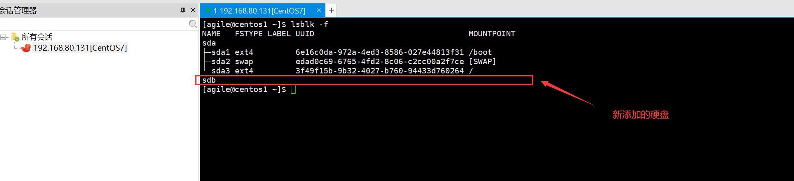
4. 从上面可以看到，这个硬盘虽然已经加入到了Linux系统中，但是没有分区，也无法使用。现在开始进行分区：
输入指令`fdisk /dev/sdb`开始进入到分区操作步骤中
然后根据提示输入`m`查看各命令操作，按照需要来输入指令

5. 通过命令`lsblk -f`可以看到当前的分区信息，可以看到此时sdb1已经出现，但是它这个分区没有分区类型，也没有UUID，也没有挂载点。
进行格式化，指定分区类型：`mkfs -t ext4 /dev/sdb1`
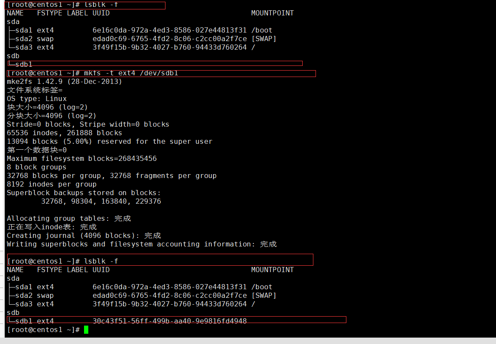
6. 从上面也可以看到，这个分区还没有挂载，现在进行挂载：`mount /dev/sdb1 /newdisk/`
  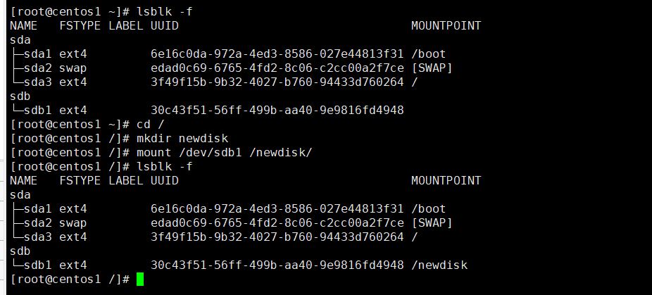

此时如果在`/newdisk`目录下建立文件，则就是存放到了新添加的硬盘中
可以把装载的分区进行卸载，然后重新装载到另一个分区下，此时硬盘中文件仍然可以访问：
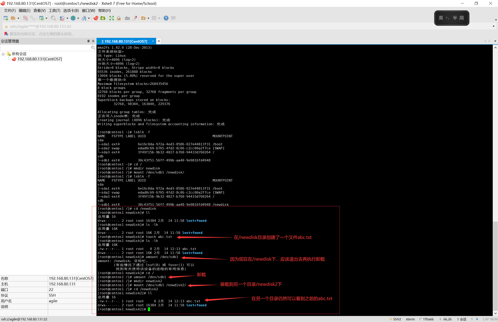

但是上面的步骤进行的磁盘分区挂载，当系统被重启后，则会失效。可以通过设置来进行自动永久挂载，即当系统重启后，之前的挂载仍然有效：

1. 修改文件`vim /etc/fstab`
2. 将新的分区信息添加到一列：

   ```vim
   #
   # /etc/fstab
   # Created by anaconda on Wed Feb 10 15:34:05 2021
   #
   # Accessible filesystems, by reference, are maintained under '/dev/disk'
   # See man pages fstab(5), findfs(8), mount(8) and/or blkid(8) for more info
   # 下列就是新添加的一个硬盘分区
   /dev/sdb1                                 /newdisk2               ext4    defaults        0 0
   UUID=3f49f15b-9b32-4027-b760-94433d760264 /                       ext4    defaults        1 1
   UUID=6e16c0da-972a-4ed3-8586-027e44813f31 /boot                   ext4    defaults        1 2
   UUID=edad0c69-6765-4fd2-8c06-c2cc00a2f7ce swap                    swap    defaults        0 0
   ```

#### 磁盘情况查询

查询系统整体磁盘使用情况

* 基本语法：`df -h`

查询指定目录的磁盘占用情况

* 基本语法：`du -h [目录]`  (如果不指定目录，默认为当前目录)
* 选项
  * -c：指定目录占用大小汇总
  * -h：带计量单位
  * -a：包含文件
  * --max-depth=1
* 示例：
  1. 查询`/opt`目录的磁盘占用情况，深度为1
    `du -ach --max-depth=1 /opt`

工作实用指令

1. 统计/opt文件夹下文件的个数
  `ls -l /opt | grep "^-" | wc -l`
2. 统计/opt文件夹下目录的个数
  `ls -l /opt | grep "^d" | wc -l`
3. 统计/opt文件夹下文件的个数，包括子文件夹里的
  `ls -lR /opt | grep "^-" | wc -l`
4. 统计/opt文件夹下目录的个数，包括子文件夹里的
  `ls -lR /opt | grep "^d" | wc -l`
5. 以树状显示目录结构tree目录，注意，如果没有tree，则使用yum install tree安装
  `tree /opt`

### 网络配置

#### 修改主机ip

设置一台Linux主机的ip地址固定，其他电脑才能更便捷地访问该系统

在设置之前，需要指定或者知道VM虚拟机它给虚拟系统分配ip的网段

从上面可以查看这些信息,也可以设置VMWare给虚拟系统设置的网段(点击更改设置按钮即可)，如下：


通过上面的信息，就可以对Linux系统的ip进行设置了
通过命令`vim /etc/sysconfig/network-scripts/ifcfg-ens33`
打开文件，进行编辑

```vim
TYPE="Ethernet"
PROXY_METHOD="none"
BROWSER_ONLY="no"
# 这里要是static
BOOTPROTO="static"
DEFROUTE="yes"
IPV4_FAILURE_FATAL="no"
IPV6INIT="yes"
IPV6_AUTOCONF="yes"
IPV6_DEFROUTE="yes"
IPV6_FAILURE_FATAL="no"
IPV6_ADDR_GEN_MODE="stable-privacy"
NAME="ens33"
UUID="da75d8f5-d0d6-4c17-b733-52f65e6a621a"
DEVICE="ens33"
# 一定要开启
ONBOOT="yes"
# 主机ip
IPADDR=192.168.79.130
# 网关
GATEWAY=192.168.79.2
# 域名解析器，设置和网关相同即可
DNS1=192.168.79.2
```

修改文件保存后，进行重启服务或者重启系统即可生效
`service network restart`或`reboot`
再次使用`ifconfig`可以看到ip地址已经修改，且是固定的，即每次系统重启都是这个ip地址

上面修改VMWare的网段，也可以在母机的网络设置中进行设置，如下：


#### 修改hostname

Windows系统修改hostname，打开`C:\Windows\System32\drivers\etc\hosts`文件，然后在文件里添加一列信息，用于一个ip与hostname映射
`192.168.79.130 centos1`

Linux系统修改hostname,在`/ect/hosts`文件指定,添加一列：
`192.168.79.1 agile`

### 进程管理

#### 基本介绍

1. 在LINUX中，每个执行的程序（代码） 都称为一个进程。每一个进程都分配一个ID号。
2. 每一个进程，都会对应一个父进程，而这个父进程可以复制多个子进程。例如www服务器。
3. 每个进程都可能以两种方式存在的。 前台与后台，所谓前台进程就是用户目前的屏幕上可以进行操作的。后台进程则是实际在操作，但由于屏幕上无法看到的进程，通常使用后台方式执行。
4. 一般系统的服务都是以后台进程的方式存在，而且都会常驻在系统中。直到关机才才结束。

#### 显示系统执行的进程

* 基本介绍
ps命令是用来查看目前系统中，有哪些正在执行，以及它们执行的状况
* 选项
  -a：显示当前终端的所有进程信息
  -u：以用户的格式显示进程信息
  -x：显示后台进程运行的参数
* 指令打印的每列信息说明(System V展示风格)：
  * USER：用户名称
  * PID：进程号
  * %CPU：进程占用CPU的百分比
  * %MEM：进程占用物理内存的百分比
  * VSZ：进程占用的虚拟内存大小（单位： KB）
  * RSS：进程占用的物理内存大小（单位： KB）
  * TTY：终端名称,缩写 .
  * STAT：进程状态，其中S-睡眠， s-表示该进程是会话的先导进程， N-表示进程拥有比普通优先级更低的优先级， R-正在运行， D-短期等待， Z-僵死进程， T-被跟踪或者被停止等等
  * START：进程的启动时间
  * TIME： CPU时间，即进程使用CPU的总时间
  * COMMAND：启动进程所用的命令和参数，如果过长会被截断显示
* 示例，查看当前进程中的sshd服务：
  `ps -aux | grep sshd`
  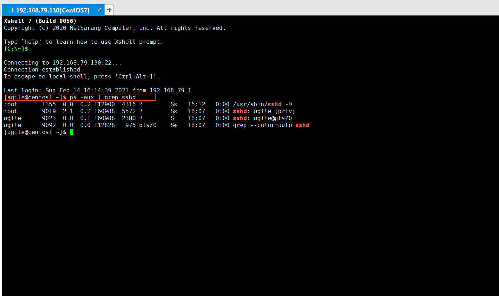

#### 显示进程的父进程

* 命令格式：`ps -ef`
* 说明：-e显示所有进程；-f全格式
* 指令打印的每列信息说明(BSD风格)：
  * UID：用户ID
  * PID：进程ID
  * PPID：父进程ID
  * C： CPU用于计算执行优先级的因子。数值越大，表明进程是CPU密集型运算，执行优先级会降低；数值越小，表明进程是I/O密集型运算，执行优先级会提高
  * STIME：进程启动的时间
  * TTY：完整的终端名称
  * TIME： CPU时间
  * CMD：启动进程所用的命令和参数
* 示例，查看当前进程中的sshd服务的父进程：
  `ps -ef | grep sshd`
  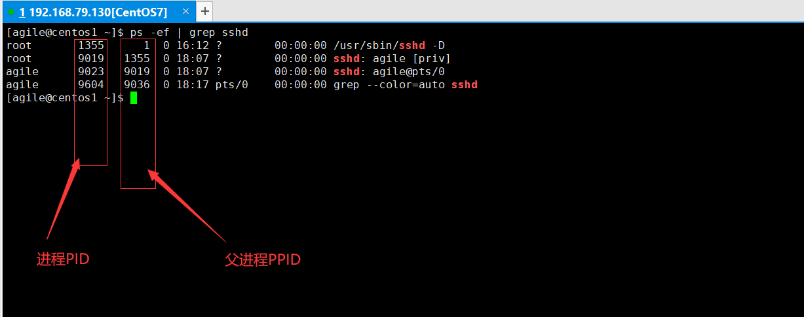

#### 终止进程kill和killall

* 若是某个进程执行一半需要停止时，或是已消了很大的系统资源时，此时可以考虑停止该进程。使用kill命令来完成此项任务。
* 基本语法：
`kill [选项] 进程号`（功能描述：通过进程号终止进程）
`killall 进程名称` （功能描述：通过进程名称终止进程，也支持通配符，这在系统因负载过大而变得很慢时很有用）
* 常用选项：
-9 :表示强迫进程立即停止
* 示例：
  1. 案例1：踢掉某个非法登录用户
  `kill 用户登录sshd的进程号`
  2. 案例2: 终止远程登录服务sshd, 在适当时候再次重启sshd服务
  终止：`kill sshd对应的进程号`
  重启：`/bin/systemctl start sshd.service`
  3. 案例3: 终止多个gedit 编辑器
   `killall gedit`
  4. 案例4：强制终止一个终端
  查询终端所有进程：`ps -aux | grep bash`
  终止指定的进程：`kill 一个bash进程号`

#### 查看进程树pstree

* 基本语法：
`pstree [选项]`,可以更加直观的来看进程信息
* 常用选项：
`-p` :显示进程的PID
`-u` :显示进程的所属用户

#### 服务管理

* 服务(service) 本质就是进程，但是是运行在后台的，通常都会监听某个端口，等待其它程
序的请求，比如(mysql , sshd 防火墙等)，因此我们又称为守护进程，是Linux中非常重要的
概念。
* service管理指令：
`service 服务名 [start | stop | restart | reload | status]`
* 在CentOS7.0后 不再使用service ,而是 systemctl
* 使用案例：
  1. 关闭网络，并重启
    `service network stop`
    `service network restart`
* 注意：
  1. 关闭或者启用防火墙后，立即生效。 [telnet 测试 某个端口即可]
  2. 这种方式只是临时生效，当重启系统后，还是回归以前对服务的设置。
  3. 如果希望设置某个服务自启动或关闭永久生效，要使用chkconfig指令

查看服务名

* 方式1：使用指令`setup`，进入到系统服务就可以看到。
  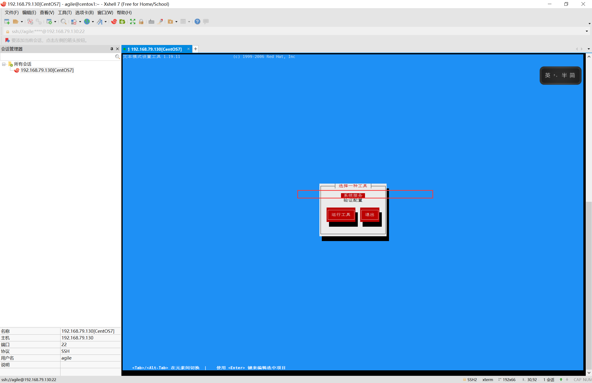
  
* 方式2:`ls -lh /etc/init.d/`

服务的运行级别(runlevel):

* Linux系统有7种运行级别(runlevel)： 常用的是级别3和5
  1. 运行级别0： 系统停机状态，系统默认运行级别不能设为0，否则不能正常启动
  2. 运行级别1： 单用户工作状态， root权限，用于系统维护，禁止远程登陆
  3. 运行级别2： 多用户状态(没有NFS)，不支持网络
  4. 运行级别3： 完全的多用户状态(有NFS)，登陆后进入控制台命令行模式
  5. 运行级别4： 系统未使用，保留
  6. 运行级别5： X11控制台，登陆后进入图形GUI模式
  7. 运行级别6： 系统正常关闭并重启，默认运行级别不能设为6，否则不能正常启动
* 开机的流程说明：

```flow
op1=>operation: 开机
op2=>operation: BIOS
op3=>operation: /boot
op4=>operation: init进程1
op5=>operation: 运行级别
op6=>operation: 运行级对应的服务

op1(right)->op2(right)->op3(right)->op4(right)->op5(right)->op6(right)
```

chkconfig指令

* 通过chkconfig 命令可以给每个服务的各个运行级别设置自启动/关闭
* 基本语法
  1. 查看服务 `chkconfig --list|grep xxx`
  2. `chkconfig 服务名 --list`  （查看指定服务名的服务）
  3. `chkconfig --level 5 服务名 on/off`  （设置服务在某个运行级别的开闭状态）
* 使用细节
  1. chkconfig重新设置服务后自启动或关闭，需要重启机器reboot才能生效

systemctl管理指令

* CentOS7之后，服务管理不再使用service,而是systemctl(虽然还有几个服务仍可以使用service)
* 基本语法：`systemctl [start|stop|restart|status] 服务名`
* systemctl指令管理的服务在`/usr/lib/systemd/system`查看
  `ls -lh /usr/lib/systemd/system`
* systemctl设置服务的自启动状态
  1. `systemctl list-unit-files [| grep 服务名]`  （查看服务开机启动状态，grep可以进行过滤）
  2. `systemctl enable 服务名`  （设置服务开机启动）
  3. `systemctl disable 服务名` （关闭服务开机启动）
  4. `systemctl is-enabled 服务名` （查询某个服务是否是自启动的）
* 示例：
  1. 查看当前防火墙的状况，关闭防火墙和重启防火墙

     ```shell
     systemctl list-unit-files | grep fire
     systemctl status firewalld
     systemctl stop firewalld
     systemctl start firewalld
     ```

* 说明：
  1. 关闭或者启动防火墙后，立即生效(telnet测试，某个端口,如`telnet 192.168.79.130 111`，测试该主机的111端口)
  2. stop,start方式只是临时生效，当重启系统后，还是回归以前对服务的设置
  3. 如果希望设置某个服务自启动或关闭永久生效，要使用`systemctl [enable|disable] 服务名`

打开或者关闭指定端口

* 在真正的生产环境下，往往需要将防火墙打开，但是如果把防火墙打开，那么外部请求数据包就不能跟服务器监听端口通讯。这时，就需要打开指定的端口
* firewall指令
  * 打开端口：`firewall-cmd --permanent --add-port=端口号/协议`
  * 关闭端口：`firewall-cmd --permanent --remove-port=端口号/协议`
  * 重新载入，才能生效：`firewall-cmd --reload`
  * 查询端口是否开放：`firewall-cmd --query-port=端口/协议`

* 示例
  1. 启用防火墙，测试111端口是否能telnet
     在母机上使用telnet命令测试(如果telnet功能没有打开，去打开)，`telnet 192.168.79.130 111`
  2. 开放111端口
     `firewall-cmd --permanent --add-port=111/tcp`
     还需要重新载入才能生效：`firewall-cmd --reload`
  3. 再次关闭111端口
     `firewall-cmd --permanent --remove-port=111/tcp`
     还需要重新载入才能生效：`firewall-cmd --reload`

动态监控进程

* top与ps命令很相似。它们都用来显示正在执行的进程。 Top与ps最大的不同之处，在于top在执行一段时间可以更新正在运行的的进程。
* 基本语法：
top [选项]
* 选项说明：

  |选项|功能|
  |:----|:----|
  |-d 秒数|指定top命令每隔几秒更新。 默认是3秒|
  |-i|使top不显示任何闲置或者僵死进程。|
  |-p|通过指定监控进程ID来仅仅监控某个进程的状态。|

* 图示如下：
  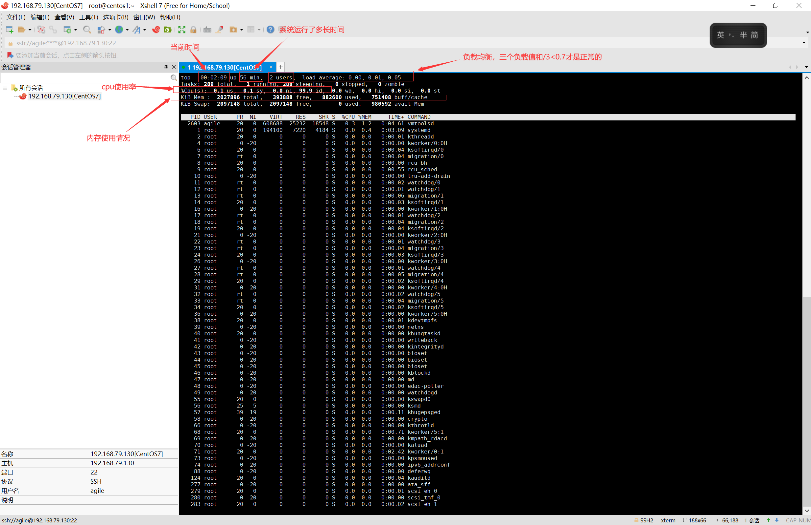

* 交互操作说明：

  |操作|功能|
  |:----|:----|
  |P|以CPU使用率排序，默认就是此项|
  |M|以内存的使用率排序|
  |N|以PID排序|
  |q|退出top|

* 实例：
  1. 案例一：监视特定用户
  top：输入此命令，按回车键，查看执行的进程。
  u：然后输入`u`回车，再输入用户名，即可
  2. 案例二：终止指定的进程。
  top：输入此命令，按回车键，查看执行的进程。
  k：然后输入`k`回车，再输入要结束的进程ID号
  3. 案例三：指定系统状态更新的时间(每隔10秒自动更新)：
    `top -d 10`

监控网络状态

* 查看系统网络情况netstat
* 基本语法
  netstat [选项]
* 选项说明
  `-an`：按一定顺序排列输出
  `-p` ：显示哪个进程在调用
* 应用案例
  请查看服务名为 sshd 的服务的信息。
  `netstat -anp | grep sshd`  （root登录下）

* 检测主机连接命令ping：
是一种网络检测检测工具，它主要是用检测远程主机是否正常，或是两部主机间的介质是否为断、网线是否脱落或网卡故障。如: ping 对方ip地址

### RPM和YUM

#### rpm包的管理

* 一种用于互联网下载包的打包及安装工具，它包含在某些Linux分发版中。它生成具有.RPM扩展名的文件。 RPM是RedHat Package Manager（RedHat软件包管理工具）的缩写，类似windows的setup.exe，这一文件格式名称虽然打上了RedHat的标志，但理念是通用的。
* Linux的分发版本都有采用（suse,redhat, centos 等等），可以算是公认的行业标准了。

rpm包的简单查询指令：

* 查询已安装的rpm列表 `rpm –qa|grep xx`
* rpm包名基本格式：
一个rpm包名： firefox-45.0.1-1.el6.centos.x86_64.rpm
名称:firefox
版本号： 45.0.1-1
适用操作系统: el6.centos.x86_64
表示centos6.x的64位系统
如果是i686、 i386表示32位系统， noarch表示通用。。

rpm包的其它查询指令：

* `rpm -qa` :查询所安装的所有rpm软件包
`rpm -qa | more`
`rpm -qa | grep firefox`
* `rpm -q 软件包名` :查询软件包是否安装
`rpm -q firefox`
* rpm -qi 软件包名 ：查询软件包信息
`rpm -qi firefox`
* `rpm -ql 软件包名`：查询软件包中的文件
  `rpm -ql firefox`
* `rpm -qf 文件全路径名`：查询文件所属的软件包
  `rpm -qf /etc/passwd`
  `rpm -qf /root/`

卸载rpm包：

* 基本语法
rpm -e RPM包的名称
* 应用案例
  1. 删除firefox 软件包
    `rpm -e firefox`
* 注意
  1. 如果其它软件包依赖于您要卸载的软件包，卸载时则会产生错误信息。
  如： $ rpm -e foo
  removing these packages would break dependencies:foo is needed by bar-1.0-1
  2. 如果我们就是要删除 foo这个rpm 包，可以增加参数 --nodeps ,就可以强制删除，但是一般不推荐这样做， 因为依赖于该软件包的程序可能无法运行
  如： $ rpm -e --nodeps foo

安装rpm包：

* 基本语法
  rpm -ivh RPM包全路径名称
* 参数说明
i=install 安装
v=verbose 提示
h=hash 进度条
* 应用实例
  1. 演示卸载和安装firefox浏览器
    `rpm -ivh firefox`

#### yum包的管理

yum 是一个Shell前端软件包管理器。基于RPM包管理，能够从指定
的服务器自动下载RPM包并且安装，可以自动处理依赖性关系， 并
且一次安装所有依赖的软件包。

yum的基本指令

* 查询yum服务器是否有需要安装的软件
`yum list|grep xx软件列表`
* 安装指定的yum包
`yum install xxx`
* yum应用实例：
  1. 案例：请使用yum的方式来安装firefox
  `yum install firefox`
  2. 查询yum服务器上共有多少软件包
  `yum list | wc -l`

## Linux之JavaEE

### JDK安装

1. 在母机上去官网下载jdk8的linux包，然后使用xftp工具上传到Linux系统的`/opt`目录下
jdk下载地址：<https://www.oracle.com/java/technologies/javase/javase-jdk8-downloads.html>

2. 解压命令

   ```shell
   cd /opt
   tar -zxvf jdk-8u281-linux-x64.tar.gz
   ```

3. 解压后，当前`/opt`目录里，会出现一个文件夹`jdk1.8.0_281/`,将该`/opt/jdk1.8.0_281/`目录移动到`/usr/local`下
命令：`mv jdk1.8.0_281/ /usr/local/`

4. 编辑环境变量的配置文件`/etc/profile`
  在文件最后，再添加以下两行内容：

   ```shell
   export JAVA_HOME=/usr/local/jdk1.8.0_281
   export PATH=$JAVA_HOME/bin:$PATH
   ```

5. 在任意目录下使用命令`javac -version`和`java -version`查看当前java的版本
6. 在家目录下，新建一个Hello.java文件，编译并运行

### Idea安装

1. 在母机上去官网下载Idea的旗舰版:
<https://download.jetbrains.8686c.com/idea/ideaIU-2020.3.2.tar.gz>

2. 使用xftp工具上传文件到`/opt`目录下
3. 将安装包解压，命令：`tar -zxvf ideaIU-2020.3.2.tar.gz`
4. 在Linux系统里(不是xshell远程连接工具)，打开终端，输入命令：

   ```shell
   cd /opt/idea-IU-203.7148.57/bin
   ./idea.sh  # 该命令启动idea
   ```

### Tomcat安装

1. 在母机上去官网下载Tomcat8版本，并将下载的包使用xftp工具上传到Linux系统的`/opt`目录下：
<https://mirrors.bfsu.edu.cn/apache/tomcat/tomcat-8/v8.5.63/bin/apache-tomcat-8.5.63.tar.gz>
2. 将tomcat包进行解压，命令：`tar -zxvf apache-tomcat-8.5.63.tar.gz`
3. 进入到tomcat目录，`cd apache-tomcat-8.5.63/`
4. 进入到bin目录，执行启动，命令：`./startup.sh`
5. tomcat虽然启动了，但是外界却无法访问tomcat服务器，因为防火墙没有打开该端口的访问

   ```shell
   firewall-cmd --permanent --add-port=8080/tcp
   firewall-cmd --reload
   ```

6. 在母机上，打开浏览器，地址栏输入`http://192.168.79.130:8080/`可以访问页面

### MySQL安装

1. 去mysql官网下载mysql5.7，地址为：<https://dev.mysql.com/downloads/mysql/5.7.html>
或者在Linux系统中使用命令：`wget https://cdn.mysql.com//Downloads/MySQL-5.7/mysql-5.7.33-1.el7.x86_64.rpm-bundle.tar`

2. 将下载的mysql包使用xftp工具，上传到Linux系统的`/opt/mysql57`目录下
3. 进入到`/opt/mysql57`目录，使用解压命令解压mysql包，命令为：`tar -xvf mysql-5.7.33-1.el7.x86_64.rpm-bundle.tar`
4. 进入到mysql57目录下，可以看到有好几个mysql相关的rpm文件

   ```vim
   [root@centos1 opt]# cd mysql57
   [root@centos1 mysql57]# ll
   总用量 1060752
   -rw-r--r--. 1 root root  543098880 2月  15 10:29 mysql-5.7.33-1.el7.x86_64.rpm-bundle.tar
   -rw-r--r--. 1 7155 31415  26468960 12月 11 13:20 mysql-community-client-5.7.33-1.el7.x86_64.rpm
   -rw-r--r--. 1 7155 31415    315280 12月 11 13:20 mysql-community-common-5.7.33-1.el7.x86_64.rpm
   -rw-r--r--. 1 7155 31415   3918736 12月 11 13:20 mysql-community-devel-5.7.33-1.el7.x86_64.rpm
   -rw-r--r--. 1 7155 31415  47513604 12月 11 13:20 mysql-community-embedded-5.7.33-1.el7.x86_64.rpm
   -rw-r--r--. 1 7155 31415  23261952 12月 11 13:20 mysql-community-embedded-compat-5.7.33-1.el7.x86_64.rpm
   -rw-r--r--. 1 7155 31415 131045776 12月 11 13:21 mysql-community-embedded-devel-5.7.33-1.el7.x86_64.rpm
   -rw-r--r--. 1 7155 31415   2458780 12月 11 13:21 mysql-community-libs-5.7.33-1.el7.x86_64.rpm
   -rw-r--r--. 1 7155 31415   1260364 12月 11 13:21 mysql-community-libs-compat-5.7.33-1.el7.x86_64.rpm
   -rw-r--r--. 1 7155 31415 181817592 12月 11 13:21 mysql-community-server-5.7.33-1.el7.x86_64.rpm
   -rw-r--r--. 1 7155 31415 125021984 12月 11 13:21 mysql-community-test-5.7.33-1.el7.x86_64.rpm
   ```

5. centos可能会自带一个数据库mariadb，这个数据库会跟mysql冲突，先删除该数据库

   ```bash
   rpm -qa | grep mari           # 查询Linux系统是否真的有mariadb
   rpm -e --nodeps mariadb-libs  # 删除mariadb-libs
   rpm -e --nodeps marisa        # 删除marisa
   ```

6. 这一步是真正开始安装mysql，依次执行下列命令：

   ```bash
   rpm -ivh mysql-community-common-5.7.33-1.el7.x86_64.rpm
   rpm -ivh mysql-community-libs-5.7.33-1.el7.x86_64.rpm
   rpm -ivh mysql-community-client-5.7.33-1.el7.x86_64.rpm
   rpm -ivh mysql-community-server-5.7.33-1.el7.x86_64.rpm
   ```

7. 启动mysql，执行命令：`systemctl start mysqld.service`
8. 输入命令`mysql -V`,可以看到mysql版本信息，则说明安装并启动成功
9. mysql会给在安装启动会设置一个初始root用户的密码，查看root用户密码方式如下：

   ```vim
   [root@centos1 mysql57]# mysql -V
   mysql  Ver 14.14 Distrib 5.7.33, for Linux (x86_64) using  EditLine wrapper
   [root@centos1 mysql57]# grep "password" /var/log/mysqld.log
   2021-02-15T03:55:59.086364Z 1 [Note] A temporary password is generated for root@localhost: nc.pl8NQ+Ew0
   2021-02-15T03:56:17.446918Z 2 [Note] Access denied for user 'root'@'localhost' (using password: NO)
   [root@centos1 mysql57]#
   ```

   从上面可知密码是：`nc.pl8NQ+Ew0`

10. 使用初始的随机密码登录到mysql
    `mysql -u root -p`

11. 设置root密码。先可以设置 提示密码设置策略
    `set global validate_password_policy=0;`
    可选值有0低，1中，2高
    最后使用修改密码的指令：`set password for 'root'@'localhost'=password('sysagile123');`

12. 登录到mysql后，剩下操作mysql数据库的命令就是mysql的命令了

母机上的navicat客户端软件连接Linux系统上的mysql数据库步骤：

1. 准备好一个可供局域网连接mysql数据库的账号，或者修改root用户的登录域，默认是localhost,如：

   ```sql
   mysql -u root -psysagile123
   mysql>use mysql;
   mysql>update user set host = '%' where user = 'root';
   mysql>select host, user from user;
   ```

2. 修改了用户的登录范围后，重启mysql服务，使用命令`systemctl restart mysqld.service`
3. 在navicat客户端软件上输入相关参数进行连接

## Linux之大数据

### Shell编程

#### 概述

为什么要学习Shell编程

1. Linux运维工程师在进行服务器集群管理时，需要编写Shell程序来进行服务器管理。
2. 对于JavaEE和Python程序员来说，工作的需要，你的老大会要求你编写一些Shell脚本进行程序或者是服务器的维护，比如编写一个定时备份数据库的脚本。
3. 对于大数据程序员来说，需要编写Shell程序来管理集群。

Shell是什么

* Shell是一个命令行解释器，它为用户提供了一个向Linux内核发送请求以便运行程序的界面系统级程序，用户可以用Shell来启动、挂起、停止甚至是编写一些程序。


#### shell脚本执行方式

脚本格式要求

1. 脚本以#!/bin/bash开头
2. 脚本需要有可执行权限

编写第一个Shell脚本

* 需求说明
创建一个Shell脚本，输出hello world!

  ```bash
  cd /root
  mkdir myshell
  cd myshell
  vim hello.sh
  ```

  hello.sh内容如下：

  ```shell
  #!/bin/bash
  echo "Hello World"
  ```

脚本的常用执行方式

1. 方式1(输入脚本的绝对路径或相对路径)
   1. 首先要赋予helloworld.sh脚本的执行权限
      `chmod u+x hello.sh`或`chmod 744 hello.sh`
   2. 执行脚本
      `./hello.sh`（相对）  或者`/root/myshell/hello.sh`（绝对）
2. 方式2(`sh 脚本`)
   该方式不用赋予脚本执行权限，直接执行即可。
    `sh ./hello.sh`（相对）  或者`sh /root/myshell/hello.sh`（绝对）

#### shell变量

Shell的变量的介绍

1. Linux Shell中的变量分为，系统变量和用户自定义变量。
2. 系统变量： `$HOME`、 `$PWD`、 `$SHELL`、 `$USER`等等
    比如： `echo $HOME` 等等..
3. 显示当前shell中所有变量： set

shell变量的定义

* 基本语法
  1. 定义变量：变量=值
  2. 撤销变量： unset 变量
  3. 声明静态变量： readonly变量，注意：不能unset
* 示例
案例1： 定义变量A
案例2： 撤销变量A
案例3： 声明静态的变量B=2，不能unset

  ```shell
  #!/bin/bash
  echo "Hello World"
  A=100
  echo "A=$A"
  readonly B=2
  # unset B 会报错的
  ```

定义变量的规则

1. 变量名称可以由字母、数字和下划线组成，但是不能以数字开头。
2. 等号两侧不能有空格
3. 变量名称一般习惯为大写

将命令的返回值赋给变量

1. A=\`ls -la\` 反引号，运行里面的命令，并把结果返回给变量A
2. `A=$(ls -la)` 等价于反引号

   ```shell
   #!/bin/bash
   echo "Hello World"
   A=100
   echo "A=$A"
   readonly B=2
   #unset B 会报错的

   C=`date`
   D=$(date)
   echo $C
   echo $D
   ```

#### 设置环境变量

基本语法

1. `export 变量名=变量值` （功能描述：将shell变量输出为环境变量）
2. `source 配置文件` （功能描述：让修改后的配置信息立即生效）
3. `echo $变量名` （功能描述：查询环境变量的值）

示例

1. 在/etc/profile文件中定义TOMCAT_HOME环境变量
  在文件/etc/profile最后添加一列：`export TOMCAT_HOME=/opt/apache-tomcat-8.5.63`
  `source /etc/profile`
2. 查看环境变量TOMCAT_HOME的值
  `echo $TOMCAT_HOME`
3. 在另外一个shell程序中使用 TOMCAT_HOME
  `A=$TOMCAT_HOME`

注意：在输出JAVA_HOME 环境变量前，需要让其生效`source /etc/profile`

shell注释

1. 单行注释：`#具体注释内容`
2. 多行注释：

   ```shell
   :<<!
   这是被注释的内容
   这也是被注释的内容
   !
   ```

#### 位置参数变量

介绍

* 当执行一个shell脚本时，如果希望获取到命令行的参数信息，就可以使用到位置参数变量
* 比如 ： `./myshell.sh 100 200` , 这个就是一个执行shell的命令行，可以在myshell 脚本中获取到参数信息

基本语法

* `$n` （功能描述： `n`为数字， `$0`代表命令本身， `$1-$9`代表第一到第九个参数，十以上的参数，十以上的参数需要用大括号包含，如`${10}`）
* `$*` （功能描述：这个变量代表命令行中所有的参数， `$*`把所有的参数看成一个整体）
* `$@`（功能描述：这个变量也代表命令行中所有的参数， 不过`$@`把每个参数区分对待）
* `$#`（功能描述：这个变量代表命令行中所有参数的个数）

应用实例
编写一个shell脚本，在脚本中获取到命令行的各个参数信息。

  ```shell
  #!/bin/bash
  echo "$0 $1 $2"
  echo $*
  echo $@
  echo $#
  ```

  在命令行输入`./myshell.sh hello Tom`

#### 预定义变量

基本介绍
就是shell设计者事先已经定义好的变量，可以直接在shell脚本中使用

基本语法
`$$` （功能描述：当前进程的进程号（PID））
`$!` （功能描述：后台运行的最后一个进程的进程号（PID））
`$？` （功能描述：最后一次执行的命令的返回状态。如果这个变量的值为0，证明上一个命令正确执行；如果这个变量的值为非0（具体是哪个数，由命令自己来决定），则证明上一个命令执行不正确了。）

应用实例
在一个shell脚本中简单使用一下预定义变量

```shell
#!/bin/bash
echo "当前执行的进程id=$$"
sh /root/myshell/myshell.sh 100 200 &
echo "最后一个后台方式运行的进程id=$!"
echo "执行结果是=$?"
```

#### 运算符

基本语法

1. `$((运算式))`或`$[运算式]`
2. `expr m + n`
   注意expr运算符间要有空格
3. `expr m - n`
4. expr `\*`, `/`, `%` ,分别表示 乘，除，取余

应用实例

1. 案例1： 计算（2+3） X4的值
2. 案例2：请求出命令行的两个参数[整数]的和

```shell
#!/bin/bash

# 案例一
RES1=$(((2+3)*4))
echo "res1=$RES1"

RES2=$[(2*3)*4]
echo "res2=$RES2"

TEMP=`expr 2 + 3`
RES4=`expr $TEMP \* 4`
echo "res4=$RES4"

# 案例二
RES=$[$1+$2]
echo "$1+$2=$RES"
```

命令行输入:`sh ./oper.sh 12 34`

#### 条件判断

* 基本语法
`[ condition ]`（注意condition前后要有空格）
非空返回true，可使用$?验证（0为true， >1为false）

* 应用实例
`[ linux123 ]` 返回true
`[ ]` 返回false（条件什么也不写，也要留空格）
`[condition语句] && echo OK || echo notok` 条件满足，执行后面的语句

常用判断条件

1. 两个整数的比较
`=` 字符串比较
`-lt` 小于
`-le` 小于等于
`-eq` 等于
`-gt` 大于
`-ge` 大于等于
`-ne` 不等于
2. 按照文件权限进行判断
`-r` 有读的权限
`-w` 有写的权限
`-x` 有执行的权限
3. 按照文件类型进行判断
`-f` 文件存在并且是一个常规的文件
`-e` 文件存在
`-d` 文件存在并是一个目录

应用实例

1. 案例1： "ok"是否等于"ok"
判断语句：`[ "ok" = "ok" ]`
2. 案例2： 23是否大于等于22
判断语句：`[23 -ge 22]`
3. 案例3： /root/myshell/abc.txt 目录中的文件是否存在
判断语句：`[ -f /root/myshell/abc.txt ]`

```shell
#!/bin/bash

# 案例一
if [ "ok" = "ok" ]
then
        echo "equal"
fi

# 案例二
if [ 23 -ge 22 ]
then
        echo "大于"
fi

# 案例三
if [ -f /root/myshell/abc.txt ]
then
        echo "存在"
fi

if [ ]
then
        echo "false"
fi

if [ Linux123 ]
then
        echo "true"
fi
```

#### 流程控制

if 判断

* 基本语法

  ```shell
  if [ 条件判断式 ];then
      程序
  fi

  #或者

  if [ 条件判断式 ]
  then
    程序
  elif [条件判断式]
  then
      程序
  fi
  ```

* 注意事项：
  1. `[ 条件判断式 ]`，中括号和条件判断式之间必须有空格
  2. 推荐使用第二种方式
* 应用实例
案例：请编写一个shell程序，如果输入的参数，大于等于60，则输出 "及格了"，如果小于60,则输出 "不及格"

  ```shell
  #!/bin/bash
  if [ $1 -ge 60 ]
  then
          echo "及格了哈哈哈"
  elif [ $1 -lt 60 ]
  then
          echo "不及格嘤嘤嘤"
  fi
  ```

case语句

* 基本语法

  ```shell
  case $变量名 in
  "值1"）
  如果变量的值等于值1，则执行程序1
  ;;
  "值2"）
  如果变量的值等于值2，则执行程序2
  ;;
  …省略其他分支…
  *）
  如果变量的值都不是以上的值，则执行此程序
  ;;
  esac
  ```

* 应用实例
案例1 ：当命令行参数是 1 时，输出 "周一", 是2 时，就输出"周二"， 其它情况输出 "other"

  ```shell
  #!/bin/bash
  case $1 in
  "1")
  echo "周一"
  ;;
  "2")
  echo "周二"
  ;;
  *)
  echo "ohter..."
  ;;
  esac
  ```

  命令行输入`sh ./week.sh 1`、`sh ./week.sh 2`、`sh ./week.sh 3`分别进行测试

for循环

* 基本语法1

  ```shell
  for 变量 in 值1 值2 值3…
  do
    程序
  done
  ```

* 应用实例
案例1 ：打印命令行输入的参数[这里可以看出$* 和 $@ 的区别]

  ```shell
  #!/bin/bash
  for i in "$*"
  do
          echo "num is $i"
  done

  for j in "$@"
  do
          echo "num is $j"
  done
  ```

* 基本语法2

  ```shell
  for (( 初始值;循环控制条件;变量变化 ))
  do
  程序
  done
  ```

* 应用实例
案例2 ： 从1加到100的值输出显示

  ```shell
  #!/bin/bash
  SUM=0
  for((i=1;i<=100;i++))
  do
          SUM=$[$SUM+$i]
  done
  echo "1+2+...+100=$SUM"
  ```

while循环

* 基本语法1

  ```shell
  while [ 条件判断式 ]
  do
      程序
  done
  ```

  > while与判断语句要有空格，条件判断里面，左右都要有空格

* 应用实例
案例1 ：从命令行输入一个数n，统计从 1+...+ n 的值是多少？

  ```shell
  #!/bin/bash
  SUM=0
  i=0
  while [ $i -le $1 ]
  do
          SUM=$[$SUM+$i]
          i=$[$i+1]
  done
  echo "1+...+$1=$SUM"
  ```

read读取控制台输入

* 基本语法
read(选项)(参数)
* 选项：
`-p`：指定读取值时的提示符；
`-t`：指定读取值时等待的时间（秒） ，如果没有在指定的时间内输入，就不再等待输入
* 参数
  变量：指定读取值的变量名
* 应用实例
案例1： 读取控制台输入一个num值
案例2： 读取控制台输入一个num值，在10秒内输入。

  ```shell
  #!/bin/bash
  read -p "请输入一个数字NUM1=" NUM1
  echo "你输入的数字NUM1=$NUM1"

  read -t 10 -p "请输入一个数字NUM2=" NUM2
  echo "你输入的数字NUM2=$NUM2"
  ```

#### 函数

shell编程和其它编程语言一样，有系统函数，也可以自定义函数。

系统函数举例

* basename基本语法
  * 功能：返回完整路径最后 / 的部分，常用于获取文件名
  `basename [pathname] [suffix]`
  `basename [string] [suffix]` （功能描述： basename命令会删掉所有的前缀包括最后一个`/`字符，然后将字符串显示出来。
  * 选项：
  suffix为后缀，如果suffix被指定了， basename会将pathname或string中的suffix去掉。
  * 应用实例
  案例1：请返回 /home/aaa/test.txt 的 "test.txt" 部分
  直接在终端命令行输入：`basename /hone/aaa/test.txt`

* dirname基本语法
  * 功能：返回完整路径最后 / 的前面的部分，常用于返回路径部分
  * dirname 文件绝对路径 （功能描述：从给定的包含绝对路径的文件名中去除文件名（非目录的部分），然后返回剩下的路径（目录的部分））
  * 应用实例
  案例1：请返回 /home/aaa/test.txt 的 /home/aaa
  直接在终端命令行输入：`dirname /home/aaa/test.txt`

自定义函数

* 基本语法

  ```shell
  [ function ] funname[()]
  {
      Action;
      [return int;]
  }
  ```

* 调用直接写函数名： funname [值]
* 应用实例
案例1： 计算输入两个参数的和， getSum

  ```shell
  #!/bin/bash
  function getSum(){
          SUM=$[$n1+$n2]
          echo "$n1+$n2=$SUM"
  }

  read -p "请输入一个数字n1=" n1
  read -p "请输入一个数字n2=" n2
  getSum $n1 $n2
  ```

#### 定时维护MySQL数据库

需求分析

1. 每天凌晨 2:30 备份 数据库 testdb 到 /data/backup/db
2. 备份开始和备份结束能够给出相应的提示信息
3. 备份后的文件要求以备份时间为文件名，并打包成 .tar.gz 的形式，比如：
2020-11-12_230201.tar.gz
4. 在备份的同时，检查是否有10天前备份的数据库文件，如果有就将其删除。

```shell
#!/bin/bash
# 备份目录
BACKUP=/data/backup/db
# 当前时间
DATETIME=$(date +%Y-%m-%d_%H%M%S)
echo $DATATIME

# 数据库的地址
HOST=localhost

# 数据库用户名
DB_USER=root

# 数据库密码
DB_PW=sysagile123

# 备份的数据库名
DATABASE=testdb

# 创建备份目录，如果不存在，就创建
[ ! -d "${BACKUP}/${DATETIME}" ] && mkdir -p "${BACKUP}/${DATETIME}"

# 备份数据库
mysqldump -u${DB_USER} -p${DB_PW} --host=${HOST} -q -R --databases ${DATABASE} | gzip > ${BACKUP}/${DATETIME}/$DATETIME.sql.gz

# 将文件处理成 tar.gz
cd ${BACKUP}
tar -zcvf $DATETIME.tar.gz ${DATETIME}

# 删除对应的备份目录
rm -rf ${BACKUP}/${DATETIME}

# 删除10天前的备份文件
find ${BACKUP} -atime +10 -name "*.tar.gz" -exec rm -rf {} \;
echo "备份数据库完成!"
```

以上就是脚本文件db_backup.sh

然后再在命令行执行命令，将该脚本添加到定时任务中进行定时执行即可：

```bash
chmod 744 /root/myshell/db_backup.sh
# 将sh命令添加到任务调度中定时执行
crontab -e
# 上面命令之后，进入到了编辑命令文件
30 2 * * * /root/myshell/db_backup.sh
```

## Linux之Python

### Ubuntu

#### Ubuntu介绍

* Ubuntu（友帮拓、优般图、乌班图）是一个以桌面应用为主的开源GNU/Linux操作系统，Ubuntu 是基于 GNU/Linux，支持x86、 amd64（即x64）和ppc架构，由全球化的专业开发团队（Canonical Ltd）打造的。
* 专业的Python开发者一般会选择 Ubuntu 这款Linux系统作为生产平台.
* Ubuntu 和 Centos 都是基于 GNU/Linux 内核的，因此基本使用和Centos是几乎一样的，它们的各种指令可以通用，学习和使用Ubuntu的过程中，各种操作指令在CentOS都使用过。只是界面和预安装的软件有所差别。
* Ubuntu下载地址： <http://cn.ubuntu.com/download/>

#### Ubuntu安装

与安装CentOS相似，也是选择稍后安装，然后在cd中添加ubuntu安装包。需要注意的是，不要选择简易快速安装，VMWare会在系统安装过程中去安装vm tools。
还需要注意的是，安装ubuntu的过程中，会询问是否安装其他程序，最好选择安装最少的选项，因为这个安装是通过美国的网络，下载很慢

#### Ubuntu的root用户

介绍
安装ubuntu成功后，都是普通用户权限，并没有最高root权限，如果需要使用root权限的时候，通常都会在命令前面加上 sudo 。有的时候感觉很麻烦。一般使用su命令来直接切换到root用户的，但是如果没有给root设置初始密码，就会抛出 su : Authentication failure 这样的问题。所以，只要给root用户设置一个初始密码就好了。

给root用户设置密码并使用

1. 输入 `sudo passwd` 命令，输入一般用户密码并设定root用户密码。
2. 设定root密码成功后，输入 su 命令，并输入刚才设定的root密码，就可以切换成root了。 提示符$代表一般用户，提示符#代表root用户。
3. 输入 exit 命令，退出root并返回一般用户
4. 以后就可以使用root用户了

#### Ubuntu下开发Python

安装好Ubuntu后，系统自带了python3的开发环境。
在命令行输入`python3`可以查看当前安装python3的版本信息

使用 vim ex.py编写一个示例python文件，如：

```python
print("hello,python!")
```

保存文件后，在命令行输入`python3 ex.py`即可编译执行该代码

### Ubuntu下的Python开发环境

### APT软件管理和远程登录

#### APT介绍

apt是Advanced Packaging Tool的简称，是一款安装包管理工具。在Ubuntu下，我们可以使用apt命令可用于软件包的安装、删除、清理等，类似于Windows中的软件管理工具。

#### Ubuntu软件操作的相关命令

**sudo apt-get update 更新源**
**sudo apt-get install package 安装包**
**sudo apt-get remove package 删除包**
sudo apt-cache search package 搜索软件包
**sudo apt-cache show package 获取包的相关信息，如说明、大小、版本等**
sudo apt-get install package --reinstall 重新安装包
sudo apt-get -f install 修复安装
sudo apt-get remove package --purge 删除包，包括配置文件等
sudo apt-get build-dep package 安装相关的编译环境
sudo apt-get upgrade 更新已安装的包
sudo apt-get dist-upgrade 升级系统
sudo apt-cache depends package 了解使用该包依赖那些包
sudo apt-cache rdepends package 查看该包被哪些包依赖
**sudo apt-get source package 下载该包的源代码**

#### 修改Ubuntu软件下载地址

默认Ubuntu下载软件是根据/etc/apt/sources.list文件中提供的地址来进行下载安装包，但是这些网址都是国外的，下载速度很慢，可以通过修改这个文件，让下载地址指向国内的镜像网址即可

修改步骤：

1. 备份Ubuntu默认的源地址
   `sudo cp /etc/apt/sources.list /etc/apt/sources.list.backup`
2. 清空sources.list文件中的内容，文件里面填为国内镜像网址的信息。
   比如国内的<https://mirrors.tuna.tsinghua.edu.cn/>。找到Ubuntu镜像的信息：
    <https://mirrors.tuna.tsinghua.edu.cn/help/ubuntu/>，将信息复制到文件中
    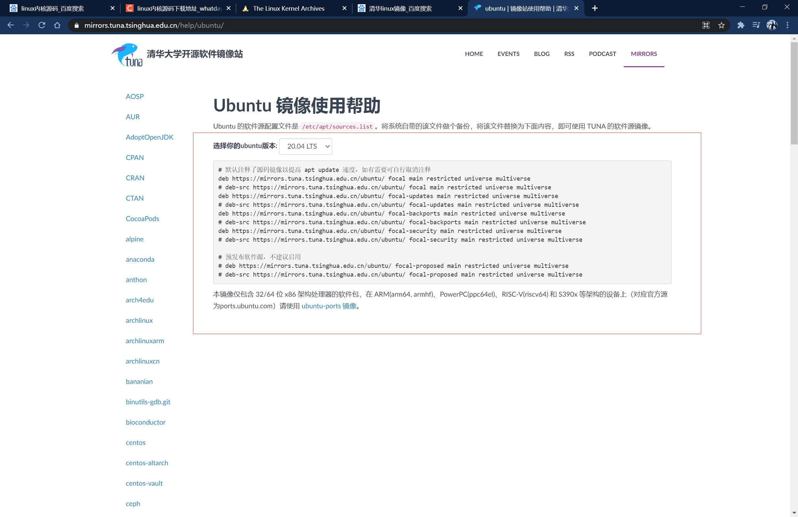

3. 修改保存了sources.list内容后，需要执行一个命令，来更新源地址：
   `sudo apt-get update`

4. 现在就完成了。以后安装软件，就是去镜像地址

#### Ubuntu安装vim

使用apt完成安装和卸载vim 软件，并查询 vim 软件的信息：

```bash
sudo apt-get remove vim
sudo apt-get install vim
sudo apt-cache show vim
```

#### 使用ssh远程登录Ubuntu

和CentOS不一样， Ubuntu默认没有安装SSHD服务，因此不能进行远程登录。要先安装ssh软件

安装SSH和启用
`sudo apt-get install openssh-server`
执行上面指令后， 在当前这台Linux上就安装了**SSH服务端和客户端**。
`service sshd restart`
执行上面的指令，就启动了 sshd 服务。会监听端口22

#### Ubuntu使用ssh远程登录Ubuntu

* 从linux系统客户机远程登陆linux系统服务机
* 基本语法：
  `ssh 服务机用户名@服务机IP`
  例如： `ssh agile@192.168.79.129`  （输入命令后，会提示输入用户的登录密码）

* 使用ssh访问，如访问出现错误。可查看是否有该文件 ～/.ssh/known_ssh 尝试删除该文件
解决。
* 登出
  登出命令： `exit`或者`logout`

> 如果Ubuntu无法使用`ifconfig`,`netstat`命令,则需要先安装net-tools

## Linux高级篇

### 安装CentOS8

安装centos8和上面安装centos7的步骤一致，需要注意的是：

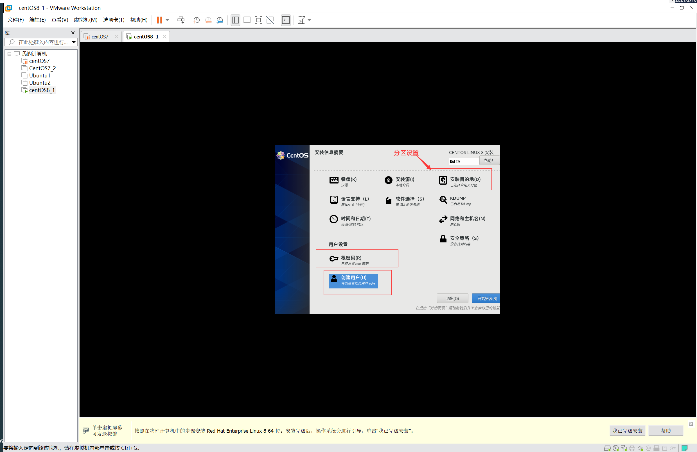
上面的设置和centos7的安装一致

centos8和centos7略有不同，主要是预安装的一些软件上，个人觉得这和centos本身并没有什么关系，根本算不上不同之处
它们的内核却有不同

### 日志管理

#### 日志基本介绍

1. 日志文件是重要的系统信息文件，其中记录了许多重要的系统事件，包括用户的登录信息，系统的启动信息，系统的安全信息，邮件相关信息，各种服务相关信息等

2. 日志对于安全来说也很重要，它记录了系统每天发生的各种事情，通过日志来检查错误发生的原因，或者受到攻击时攻击者留下的痕迹

3. 可以这样理解，日志是用来记录重大事件的工具

#### 系统常用的日志

|日志文件|说明|
|:----|:----|
|/var/log/boot.log|系统启动日志|
|/var/log/cron|记录与系统定时任务相关的日志|
|/var/log/cups|记录打印信息的日志|
|/var/log/dmesg|记录了系统在开机时内核自检的信息，也可以使用dmesg命令直接查看内核自检信息|
|/var/log/btmp|记录错误登录的日志。这个文件是二进制文件，不能直接用vim查看，而要使用`lastb`命令查看|
|/var/log/lastlog|记录系统中所有用户最后一次的登录时间的日志。这个文件也是二进制文件，要使用`lastlog`命令查看|
|/var/log/mailog|记录邮件信息的日志|
|/var/log/message|记录系统重要消息的日志，这个日志文件中会记录Linux系统的绝大多数重要信息，如果系统出现问题，首先要检查的应该就是这个日志文件|
|/var/log/secure|记录验证和授权方面的信息，只要涉及账户和密码的程序都会记录，比如系统的登录，ssh的登录，su切换用户，sudo授权，甚至添加用户的修改用户密码都会记录在这个日志文件中|
|/var/log/wtmp|永久记录所用户的登录、注销信息，同时记录系统的启动，重启，关机事件。是二进制文件，要使用`last`命令查看|
|/var/log/ulmp|记录当前已经登录的用户的信息，这个文件会随着用户的登录和注销而不断变化，只记录当前登录用户的信息。这个文件不能用vim查看，而是使用w,who,`users`等命令查看|

测试示例：
可以把/var/log/secure文件清空，然后登录到centos,故意输入错误的登录密码，可以看到此时会有新的日志信息被写入到文件中

#### 日志管理服务 rsyslogd

在系统的/etc/rsyslog.conf文件里面，记录了系统应该管理的日志信息。所以系统才会将相关信息写入到日志文件中
通过`cat /etc/rsyslog.conf`可以查看配置文件内容

查询Linux 中的 rsyslogd 服务是否启动
`ps -aux | grep "rsyslog" | grep -v "grep"`

查询 rsyslogd 服务的自启动状态
`systemctl list-unit-files | grep "rsyslog"`

CentOS7.6日志服务是rsyslogd,CentOS6.x日志服务是syslogd
rsyslogd功能更强大。rsyslogd的使用、日志文件的格式，和syslogd 服务兼容

#### 日志服务配置文件

通过`cat /etc/rsyslog.conf`可以查看配置文件内容如下:

```shell
# rsyslog configuration file

# For more information see /usr/share/doc/rsyslog-*/rsyslog_conf.html
# If you experience problems, see http://www.rsyslog.com/doc/troubleshoot.html

#### MODULES ####

# The imjournal module bellow is now used as a message source instead of imuxsock.
$ModLoad imuxsock # provides support for local system logging (e.g. via logger command)
$ModLoad imjournal # provides access to the systemd journal
#$ModLoad imklog # reads kernel messages (the same are read from journald)
#$ModLoad immark  # provides --MARK-- message capability

# Provides UDP syslog reception
#$ModLoad imudp
#$UDPServerRun 514

# Provides TCP syslog reception
#$ModLoad imtcp
#$InputTCPServerRun 514


#### GLOBAL DIRECTIVES ####

# Where to place auxiliary files
$WorkDirectory /var/lib/rsyslog

# Use default timestamp format
$ActionFileDefaultTemplate RSYSLOG_TraditionalFileFormat

# File syncing capability is disabled by default. This feature is usually not required,
# not useful and an extreme performance hit
#$ActionFileEnableSync on

# Include all config files in /etc/rsyslog.d/
$IncludeConfig /etc/rsyslog.d/*.conf

# Turn off message reception via local log socket;
# local messages are retrieved through imjournal now.
$OmitLocalLogging on

# File to store the position in the journal
$IMJournalStateFile imjournal.state


#### RULES ####

# Log all kernel messages to the console.
# Logging much else clutters up the screen.
#kern.*                                                 /dev/console

# Log anything (except mail) of level info or higher.
# Don't log private authentication messages!
*.info;mail.none;authpriv.none;cron.none                /var/log/messages

# The authpriv file has restricted access.
authpriv.*                                              /var/log/secure

# Log all the mail messages in one place.
mail.*                                                  -/var/log/maillog


# Log cron stuff
cron.*                                                  /var/log/cron
```

其中`mail.*   -/var/log/mailog`的意思就是让与mail相关的信息全部都记录到文件`/var/log/mailog`中

配置文件:/etc/rsyslog.conf
编辑文件时的格式为：`*.*` 存放日志文件
其中第一个`*`代表日志类型，第二个`*`代表日志级别

1. 日志类型分为:

   |日志类型|说明|
   |:----|:----|
   |auth|pam产生的日志|
   |authpriv|ssh,ftp等登录信息的验证信息|
   |corn|时间任务相关|
   |kern|内核|
   |lpr|打印|
   |mail|邮件|
   |mark(syslog)-rsyslog|服务内部的信息，时间标识|
   |news|新闻组|
   |user|用户程序产生的相关信息|
   |uucp|unix to unix copy 主机之间相关的通信|
   |local1-7|自定义的日志设备|

2. 日志级别分为：

   |日志级别|说明|
   |:----|:----|
   |debug|有调试信息的，日志通信最多|
   |info|一般信息日志，最常用|
   |notice|最具有重要性的普通条件的信息|
   |warning|警告级别|
   |err|错误级别，阻止某个功能或者模块不能正常工作的信息|
   |crit|严重级别，阻止整个系统或者整个软件不能正常工作的信息|
   |alert|需要立刻修改的信息|
   |emerg|内核崩溃等重要信息|
   |none|什么都不记录|
   > 从上到下，级别从低到高，记录信息越来越少

由日志服务rsyslogd 记录的日志文件，日志文件的格式包含以下4列：

* 事件产生的时间
* 产生事件的服务器的主机名
* 产生事件的服务名或程序名
* 事件的具体信息


#### 自定义日志服务

示例：
在/etc/rsyslog.conf 中添加一个日志文件/var/log/agile.log ,当有事件发送时(比如sshd服务相关事件)，该文件会接收到信息并保存

1. 编辑/etc/rsyslog.conf文件,在最后一行添加如下：

   ```conf
   # 增加自定义的日志
   *.*                                                  /var/log/agile.log
   ```

2. 重启或者进行一些事务，就会把信息写入到agile.log文件中

#### 日志轮替

基本介绍

* 日志轮替就是把旧的日志文件移动并改名，同时建立新的空日志文件，当旧日志文件超出保存的范围之后，就会进行删除
* 日志轮替文件命名
  1. centos7使用logrotate进行日志轮替管理，要想改变日志轮替文件名字，通过/etc/logrotate.conf配置文件中`dateext`参数
  2. 如果配置文件中有`dateext`参数，那么日志会用日期来作为日志文件的后缀，例如`secure-20201214`，这样日志文件名不会重叠，也就不需要日志文件的改名，只需要指定保存日志个数，删除多余的日志文件即可
  3. 如果配置文件中没有`dateext`参数，日志文件就需要进行改名，当第一次进行日志轮替时，当前的`secure`日志会自动改名为`secure.1`，然后新建`secure`日志，用来保存新的日志。当第二次进行日志轮替时，`secure.1`会自动改名为`secure.2`，当前的`secure`日志会自动改名为`secure.1`，然后也会新建`secure`日志，用来保存新的日志，以此类推

* /etc/logrotate.conf 是全局的日志轮替策略/规则，当然也可以单独给某个日志文件指定策略

logrotate配置文件

* 通过cat /etc/logrotate.conf查看内容如下：

  ```bash
  # see "man logrotate" for details
  # rotate log files weekly
  # 每周对日志文件进行以此轮替
  weekly

  # keep 4 weeks worth of backlogs
  # 共保存4份日志文件，当建立新的日志文件时，旧的将会被删除
  rotate 4

  # create new (empty) log files after rotating old ones
  # 创建新的空的日志文件，在日志轮替后
  create

  # use date as a suffix of the rotated file
  # 使用日期作为日志轮替文件的后缀
  dateext

  # uncomment this if you want your log files compressed
  # 日志文件是否压缩，如果取消该注释，则日志会在转存的同时进行压缩
  #compress

  # RPM packages drop log rotation information into this directory
  # 包含 /etc/logrotate.d 目录中所有的子配置文件。也就是说会把目录中所有的子配置文件读取进来
  include /etc/logrotate.d

  # no packages own wtmp and btmp -- we'll rotate them here
  # 下面是单独配置，优先级更高
  /var/log/wtmp {
      monthly  # 每月对日志进行以此轮替
      create 0664 root utmp # 建立的新日志文件，权限是0664，所有者是root,所属组是utmp组
      minsize 1M # 日志文件最小轮替大小是1MB,也就是日志一定要超过1MB才会轮替，否则就算时间达到一个月，也不进行日志转存
      rotate 1  # 仅保留一个日志备份。也就是只有wtmp 和wtmp.1 日志保留而已
  }

  /var/log/btmp {
      missingok  # 如果日志不存在，则忽略该日志的警告信息
      monthly
      create 0600 root utmp
      rotate 1
  }

  # system-specific logs may be also be configured here.
  ```

* logrotate配置文件参数说明

  |参数|参数说明|
  |:----|:----|
  |daily|日志的轮替周期是每天|
  |weekly|日志的轮替周期是每周|
  |monthly|日志的轮替周期是每月|
  |rotate 数字|保留的日志文件的个数，0指没有备份|
  |compress|日志轮替时，旧的日志进行压缩|
  |create mode owner group|建立新日志，同时指定新日志的权限与所有者和所属组|
  |mail address|当日志轮替时，输出内容通过邮件发送到指定的邮件地址|
  |missingok|如果日志不存在，则忽略该日志的警告信息|
  |notifempty|如果日志为空文件，则不进行日志轮替|
  |minsize 大小|日志轮替的最小值。也就是日志一定要达到这个最小值才会轮替面否则就算时间达到也不轮替|
  |size 大小|日志只有大于指定大小才进行日志轮替，而不是按照时间轮替|
  |dateext|使用日期作为日志轮替文件的后缀|
  |sharedscripts|在此关键字之后的脚本只执行一次|
  |prerotate/endscript|在日志轮替之前执行脚本命令|
  |postrotate|在日志轮替之后执行脚本命令|

自定义日志轮替

* 之前在日志管理的配置文件/etc/rsyslog.conf 中添加一个日志文件/var/log/agile.log，并设置了该日志记录哪些日志信息
* 但是还没有给它设置轮替规则，现在就在/etc/logrotate.d/文件夹下建立一个agilelog文件，在文件里面设置日志轮替规则，该文件内容如下：

  ```bash
  /var/log/agile.log
  {
          missingok
          daily
          copytruncate
          rotate 7
          notifempty
  }
  ```

日志轮替机制

* 日志轮替之所有可以在指定的时间备份日志，是依赖**系统定时任务**。在/etc/cron.daily/目录，就会发现这个目录中是有logrotate文件,logrotate通过这个文件依赖定时任务执行的


#### 内存日志

journalctl 可以查看内存日志，下列是常用命令：

```shell
journalctl # 查看全部
journalctl -n 3 # 查看最新3条
journalctl --since 19:00 --until 19:10:10  # 查看起始时间到结束时间的日志
journalctl -p err # 报错日志
journalctl -o verboe # 日志详细内容
journalctl _PID=12345 _COMM=sshd # 查看包含这个参数的日志
# 或者
journalctl | grep sshd
```

这个内存日志，系统重启则会清空

### 定制自己的Linux

通过裁剪现有的Linux系统(CentOS7.6),创建属于自己的min Linux小系统，可以加深对Linux系统的理解

Linux启动流程：

1. 首先Linux要通过自检，检查硬件设备有没有故障
2. 如果有多快启动盘的话，需要在BIOS中选择启动磁盘
3. 启动MBR中的bootloader引导程序
4. 加载内核文件
5. 执行所有进程的父进程，即systemd
6. 欢迎界面
在Linux的启动流程中，加载内核文件时关键文件：
kernel文件：vmlinuz-3.10.0.el7.x86_64.img
initrd文件：initramfs-3.10.el7.x86_64.img

定制原理：
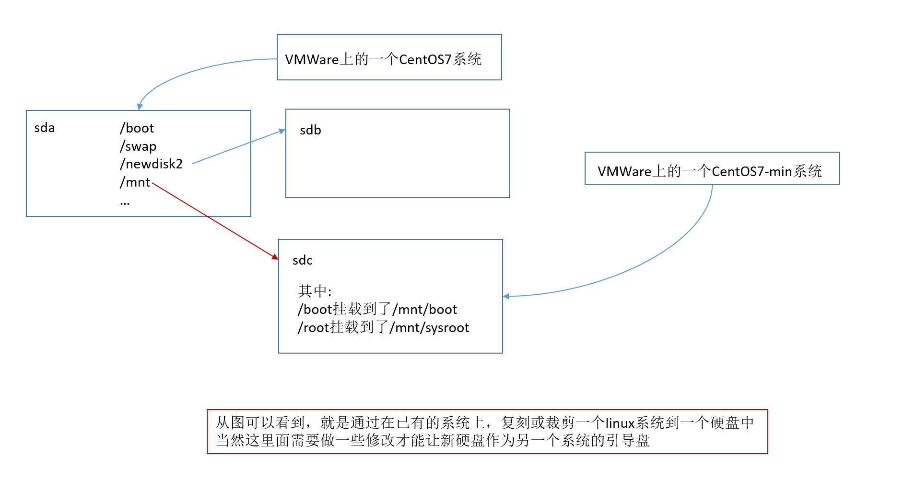

实现步骤：

1. 先增加一个硬盘，注意此时创建的硬盘选择单个文件

2. 将该硬盘挂载到现有的CentOS7系统上,即sdc硬盘有sdc1,sdc2两个分区
  sdc1为/boot分区，为500M，挂载到/mnt/boot目录上
  sdc2为/root分区，为剩下的19.5G，挂载到/mnt/sysroot目录上
3. 执行下列命令：

   ```bash
   grub2-install --root-directory=/mnt /dev/sdc
   hexdump -C -n 512 /dev/sdc

   rm -rf /mnt/boot/*
   cp -rf /boot/* /mnt/boot/
   cd /mnt/boot/grub2
   vim grub.cfg
   ```

4. 修改grub.cfg文件如下：
  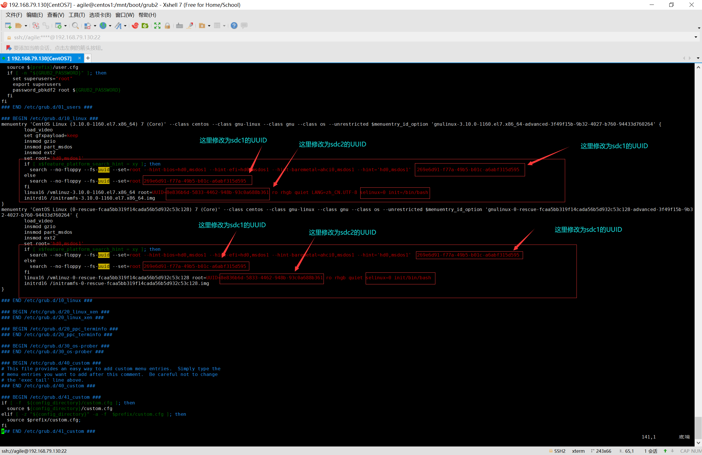

5. 给新硬盘建立一些应有的文件夹，并复制一些系统启动需要的指令

   ```bash
   mkdir -pv /mnt/sysroot/{etc/rc.d,usr,var,proc,sys,dev,lib,lib64,bin,sbin,boot,srv,mnt,media,home,root}
   cp /lib64/*.* /mnt/sysroot/lib64/
   cp /bin/bash /mnt/sysroot/bin/
   ```

6. 关掉上面centos7系统，在VMWare上新建一个Centos7系统，也是选择稍后创建虚拟机，然后删除这个虚拟机默认的硬盘，并添加一个硬盘指向，该硬盘就是上面已有的centos7新添加的sdc硬盘
7. 然后启动该新的centos-min系统，可以执行简单的命令，如果有需要添加的命令，可以去上面centos7系统中(需要先关掉centos-min)，去使用复制命令，将需要的指令复制到sdc中即可(因为这个挂载不是永久挂载，所以又需要挂载)

### Linux内核源码&内核升级

#### Linux内核源码

Linux的内核源码可以在Kernel官网上下载,Linux的代码是开源的，可以查看各版本的内核源代码，目前的Linux源代码超过700w行，可以从linux0.01内核入手，共1w行左右代码

内核地址：<https://www.kernel.org>

早期内核下载地址：<https://mirrors.edge.kernel.org/pub/linux/kernel/Historic/>

Linux0.01内核源码目录&阅读

1. linux0.01的阅读需要会C语言
2. 阅读源码前，应制定Linux内核源码的整体分布情况。现代的操作系统一般由进程管理，内存管理，文件系统，驱动程序和网络等组成。Linux内核源码的各个目录大致对应
3. 阅读上，有纵向和横向。纵向就是顺着顺序的执行顺序逐步进行；横向，就是按模块进行。它们经常结合在一起进行
4. 对于Linux启动的代码可顺着Linux的启动顺序一步步来阅读；对于内存管理部分，可以单独拿出来阅读，而且是一个反复的过程

#### 内核升级

可以去官网查看最新的内核源码的发布情况，下载并学习源代码

Linux内核升级

* 检测内核版本，显示可以升级的内核
`yum info kernel -q`

* 查看当前系统的内核版本
`uname -a`

* 升级内核
`yum update kernel`

执行该升级命令后，重新查看当前系统内核版本，仍然是之前的内核，因为升级不是直接替换当前内核，而是在每次开机时，会多一个入口，供用户来选择使用哪个内核

### Linux备份与恢复

Linux的备份和恢复很简单，有两种方式：

1. 把需要的文件(或分区)用tar打包即可，下次需要恢复的时候，再解压开覆盖
2. 使用dump和restore命令

安装dump和restore命令
`yum -y install dump`
`yum -y install restore`

#### 数据备份dump

基本介绍
dump支持分卷和增量备份(所谓增量备份就是指备份上次备份后 修改/增加过的文件，也称差异备份)

dump语法说明
`dump [-cu] [-0123456789] [-f 备份后的文件名] [-T 日期] [目录或文件系统]`

`-c`：创建新的归档文件，并将由一个或多个文件参数所指定的内容写入归档文件的开头
`-0-9`：备份的层级，0为最完整备份，会备份所有文件。若指定0以上的层级，则备份至上一次备份依赖，修改或新增的文件，到9后，可以再次轮替
`-f 备份后的文件名`：指定备份后文件名
`-j`：调用bzlib库压缩备份文件，也就是将备份后的文件压缩成bz2格式，让文件更小
`-T 日期`：指定开发备份的时间与日期
`-u`：备份完毕后，在/etc/dumpdares中记录备份的文件系统，层级，日期与时间等
`-t`：指定文件名，若该文件已存在备份文件中，则列出名称
`-W`：显示需要备份的文件及其最后一次备份的层级，时间，日期
`-w`：与-W类似，但仅显示需要备份的文件

使用示例(备份分区)：

1. 将/boot分区所有内容备份到/opt/boot.bak.bz2文件中，备份层级为0
  `dump -0uj -f /opt/boot.bak0.bz2 /boot`

2. 在/boot目录下增加一个文件，然后再来备份/boot分区，备份层级为1
  `cd /boot && touch abc123.txt`
  `dump -1uj -f /opt/boot.bak1.bz2 /boot`
  

3. dump查看备份信息
  

dump备份文件或目录

* 前面的备份是进行分区备份，可以支持增量备份。如果备份文件或者目录，不再支持增量备份，即只能0级别备份

* 使用示例：
  1. 使用dump备份/etc整个目录
  `dump -0j -f /opt/etc.bak.bz2 /etc/`
   如果再执行`dump -1j -f /opt/etc1.bak.bz2 /etc/`则会报错

> 生产环境下，只是在本服务器上进行备份还不够，如果本服务器崩溃，连备份数据也被损坏则无法恢复。应该将备份后的文件放在其他服务器上

#### 数据恢复restore

restore命令用来恢复已备份的文件，可以从dump生成的备份文件中恢复原文件

restore语法
`restore [模式选项] [选项]`

模式选项(下列四个模式，不能混用，在一次命令中，只能指定一种)：

* `-C`：使用对比模式，将备份的文件与已存在的文件互相对比
* `-i`：使用交互模式，在进行还原操作时，restore指令将依序询问用户
* `-r`：进行还原模式
* `-t`：查看模式，看备份文件有哪些文件

选项

* `-f 备份设备`：从指定的文件中读取备份数据，进行还原操作

应用实例：

1. restore命令比较模式，比较备份文件和原文件的区别
   测试过程：将上面第二次备份前新增的文件abc123.txt修改名称，然后执行restore命令比较。然后把abc123.txt文件名恢复，再次执行restore命令比较。结果如图：
  

2. restore命令查看模式，看备份文件有哪些数据/文件
  `restore -t -f boot.bak0.bz2`
  `restore -t -f boot.bak1.bz2`
  

3. restore命令还原模式。注意：如果是增量备份，需要把增量备份文件也进行恢复，有几个增量备份文件，就恢复几个，因为如果仅仅只是恢复增量备份的那个文件，它是不会去恢复其他的增量文件的

   ```bash
   mkdir /opt/boottmp && cd /opt/boottmp  # 创建一个目录，并进入到该目录，恢复文件在该目录下进行
   restore -r -f /opt/boot.bak0.bz2       # 恢复到第一次完全备份状态
   restore -r -f /opt/boot.bak1.bz2       # 恢复到第二次增量备份状态
   ```

   

4. restore 命令恢复备份的文件，或者整个目录的文件
   基本语法：`restore -r -f 备份好的文件`
   测试：

   ```bash
   cd /opt && mkdir etctmp && cdd etctmp
   restore -r -f /opt/etc.bak.bz2
   ```

   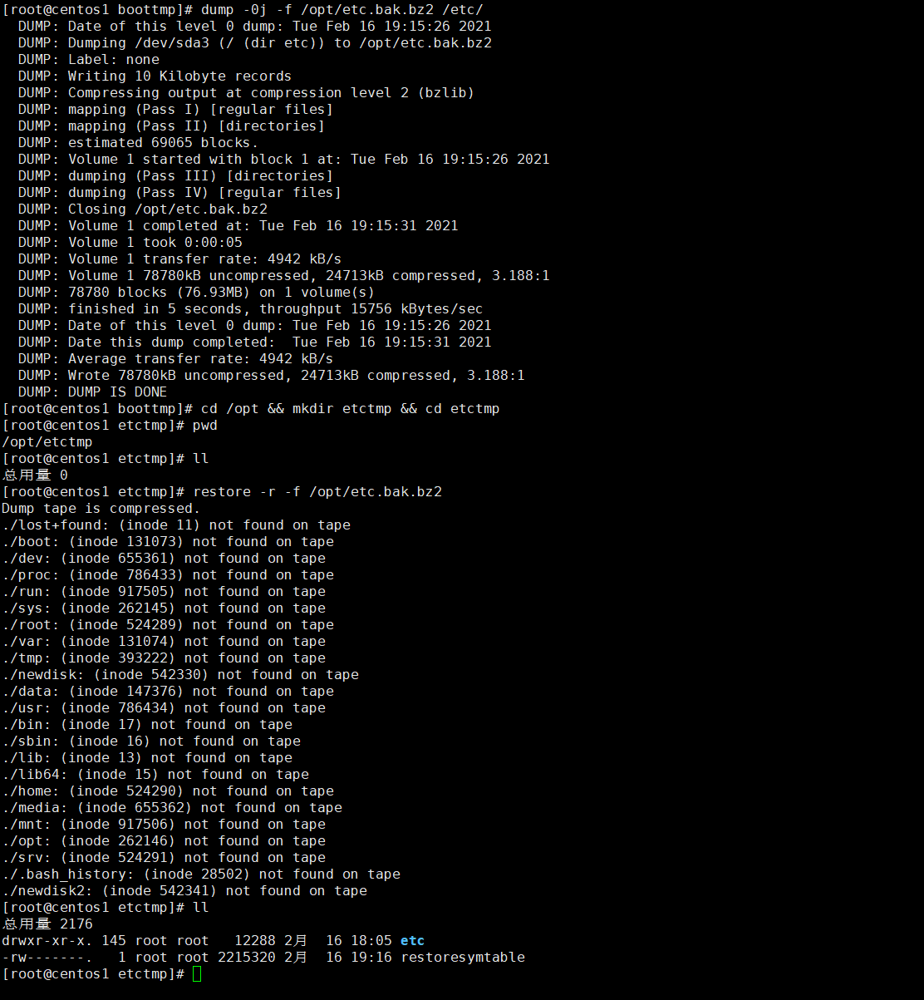

### Linux可视化管理webmin和bt运维工具

#### webmin

Webmin是功能强大的基于web的Unix/Linux系统管理工具。管理员通过浏览器访问Webmin的各种管理功能并完成相应的管理操作。除了各版本的linux以外，还可以用于：AIX,HPUX,Solaris,Unixware,Irix和FreeBSD等系统
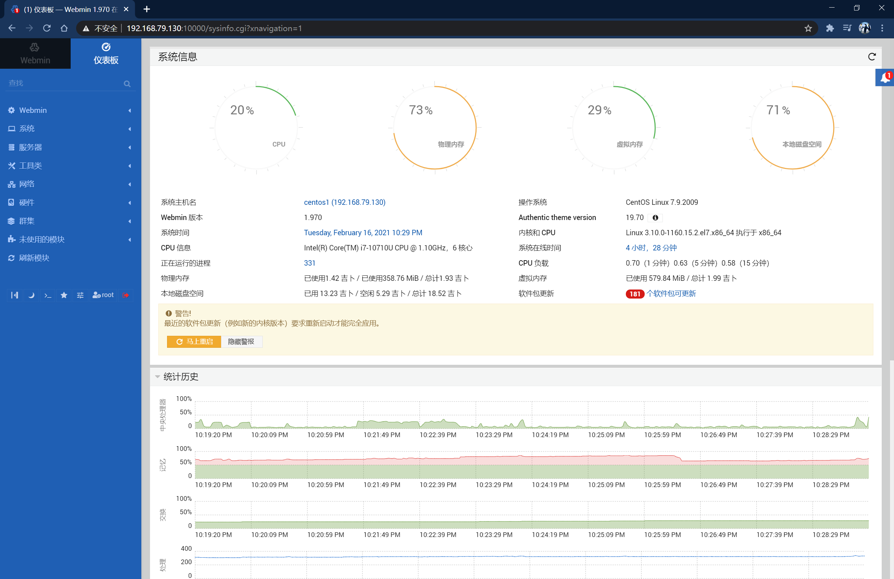

Webmin安装和配置

1. 下载地址：<https://www.webmin.com/download.html>
   从官网可以选择不同的版本进行下载安装，然后使用xftp工具上传到Linux服务器
   也可以在Linux系统里，直接使用命令`wget https://prdownloads.sourceforge.net/webadmin/webmin-1.970-1.noarch.rpm)`
   请把安装包放在`/opt`下

2. 在安装webmin之前需要安装perl语言环境支持

   ```bash
   yum install perl
   yum install cpan
   yum -y install openssl perl perl-Net-SSLeay perl-IO-Tty perl-Crypt-SSLeay
   perl -e 'use Net::SSLeay'      # 没有提示信息，说明安装正确
   yum install perl-Encode-Detect
   perl -e "use Encode::Detect"   # 没有提示信息，说明安装正确
   ```

3. 执行命令安装：`cd /opt && rpm -ivh webmin-1.970-1.noarch.rpm`
4. 重置密码指令(该指令需要当前命令所在目录为`/usr/libexec/webmin/`,否则会报第6行错误，找不到./acl/md5-lib.pl，但这个文件是存在的)：
   `cd /usr/libexec/webmin/ && /usr/libexec/webmin/changepass.pl /etc/webmin/ root test123`  (密码修改为test123)

5. 修改webmin服务的端口号(默认是10000)，注意需要先去查看自定义的端口有没有被使用，不要冲突了`netstat -anp | grep 13490`
   打开配置文件：`vim /etc/webmin/miniserv.conf`
   将port=10000修改为自定义的端口13490
   将listen=10000修改为自定义的端口13490

6. 重启webmin

   ```shell
   /etc/webmin/restart  # 重启
   /etc/webmin/start    # 启动
   /etc/webmin/stop     # 重启
   ```

7. 防火墙打开自定义的端口13490

   ```shell
   firewall-cmd --zone=public --add-port=13490/tcp --permanent
   firewall-cmd --reload
   firewall-cmd --zone=public --list-ports
   ```

8. 登录webmin
  使用地址：<https://192.168.79.130:13490/>
  账号：root
  密码：test123

9. 登录后修改语言
    

#### bt宝塔

基本介绍
bt宝塔Linux面板是提升运维效率的服务器管理软件，支持一键LAMP/LNMP/集群/监控/网站/FTP/数据库/JAVA等多项服务器管理功能

安装和使用

1. 安装：`yum install -y wget && wget -O install.sh http://download.bt.cn/install/install_6.0.sh && sh install.sh`

2. 安装功能后会在控制台打印登录地址，账号密码，使用使用这些信息即可

   外网面板地址: http://123.117.34.146:8888/da9503bb
   内网面板地址: http://192.168.79.130:8888/da9503bb
   username: x2ej6jzd
   password: a8718ac0

> 使用的时候才发现，这玩意需要绑定手机号，而且使用起来并不是想象的那么好用：
>
> 1. 本来系统已经安装了数据库，在webmin里面都识别出来了，也能登陆mysql，直接进行管理。而在bt宝塔，却识别不出来
> 2. 里面的东西都要付费，当然了可以选择不付费，那么这个软件就和webmin没有什么区别了。而且，付费的东西也看起来并没有那么好用
> 3. 里面的一键预装网站全部都是基于php的，简直就是有毒

### Linux面试题

1. 分析日志t.log（访问量）,将各个ip地址截取，并统计出现次数，并按从大到小排序

   ```text
   http://192.168.200.10/index1.html
   http://192.168.200.10/index2.html
   http://192.168.200.20/index1.html
   http://192.168.200.30/index1.html
   http://192.168.200.40/index1.html
   http://192.168.200.30/order.html
   http://192.168.200.10/order.html
   ```

    先把待分析的数据放在单独的文件1.txt中
    `cat 1.txt | cut -d '/' -f 3 | sort | uniq -c | sort -nr`

2. 统计连接到服务器的各个ip情况，并按连接数从大到小排序

    `netstat -an | grep ESTABLISHED | awk -F " " '{print $5}' | cut -d ":" -f 1 | sort | uniq -c | sort -nr`

3. 忘记了mysql5.7数据库的ROOT用户的密码，找回

   步骤说明：
   `vim /etc/my.cnf`
   在该文件最后加上`skip-grant-tables`
   重启mysql服务, `service mysqld restart`
   然后直接无密码登录到数据库，`mysql -u root -p`
   然后修改数据库mysql中user表的数据，即修改root用户的密码
   `update user set authentication_string=password("sysagile123") where user='root'`
   现在再次修改/etc/my.cnf文件，注释掉刚刚上面加的那一列`skip-grant-tables`
   重启mysql服务，`service mysqld restart`

4. 统计ip访问情况，要求分析nginx访问日志(access.log),找出访问页面数量在前2位的ip

    access.log文件中要分析的内容单独保存到一个文件如下：

   ```text
   192.168.130.21   aaa.html
   192.168.130.20   aaa.html
   192.168.130.20   aaa.html
   192.168.130.20   aaa.html
   192.168.130.23   aaa.html
   192.168.130.20   aaa.html
   192.168.130.25   aaa.html
   192.168.130.20   aaa.html
   192.168.130.20   aaa.html
   192.168.130.25   aaa.html
   192.168.130.20   aaa.html
   ```

   `cat access.log | awk -F " " '{print $1}' | sort | uniq -c | sort -nr | head -2`

5. 使用tcpdump监听本机，将来自ip为192.168.79.1 ，tcp端口为 22的数据，保存输出到tcpdump.log，用作以后的数据分析
    监听某ip和端口的数据：`tcpdump -i ens33 host 192.168.79.1 and port 22`
    `tcpdump -i ens33 host 192.168.79.1 and port 22 >> tcpdump.log`

6. 列举常用的Nginx模块，用来做什么

    rewrite模块：实现重写功能
    access模块：来源控制
    ssl模块：安全加密
    ngx_http_gzip_module：网略传输压缩模块
    ngx_http_proxy_module模块：实现代理
    ngx_http_upstream_module模块：实现定义后端服务器列表
    ngx_cache_purge：实现缓存清除功能

7. 在进行Linux系统权限划分时，应考虑哪些因素

   1. 首先要明确Linux权限的主要对象：文件的权限，目录的权限，权限的修改
      * 文件的权限：r:文件内容查看权限；w:文件内容编辑权限；x:文件的执行权限
      * 目录的权限：r:目录内文件列表查看权限(ls);w:目录内文件的增删，复制，剪切权限(touch rm cp mv)
      * 权限修改：chomod操作，以及-R权限递归
   2. 根据经验来考虑：

      * 注意权限分离，比如Linux系统权限和数据库权限不要在同一个部门
      * 权限最小原则(在满足使用的情况下最小优先)
      * 减少使用root用户，尽量用普通用户+sudo提权进行日常操作
      * 重要的系统文件，比如etc/passwd,/etc/shadow,etc/fstab,etc/sudoers等，建议使用chattr锁定，需要操作时再打开

        ```console
        [root@centos1 test]# chattr +i /etc/passwd  # 加锁，即使是root也不能直接执行被锁的命令
        [root@centos1 test]# useradd jack
        useradd：无法打开 /etc/passwd
        [root@centos1 test]# which chattr
        /bin/chattr
        [root@centos1 test]# mv /bin/chattr /opt    # 把指令移动到其他目录下
        [root@centos1 test]# chattr
        -bash: /bin/chattr: 没有那个文件或目录
        [root@centos1 test]# chattr -i /etc/passwd
        -bash: /bin/chattr: 没有那个文件或目录
        [root@centos1 test]# find / -name chattr
        /opt/chattr
        find: ‘/run/user/1000/gvfs’: 权限不够
        [root@centos1 test]# mv /opt/chattr /opt/h   # 将指令的名称修改，这就让入侵者找不到这个命令
        [root@centos1 test]# mv /opt/h /bin/chattr
        [root@centos1 test]# chattr
        Usage: chattr [-RVf] [-+=aAcCdDeijsStTu] [-v version] files...
        [root@centos1 test]# chattr -i /etc/passwd
        [root@centos1 test]# useradd jack
        [root@centos1 test]#
        ```

      * 使用SUID,SGID,Sticky设置特殊权限
      * 可以利用工具，比如chkrootkit/rootkit hunter检测rootkit脚本(rootkit是入侵者使用工具，在不察觉的建立了入侵系统途径)

        1. 下载地址：<http://www.chkrootkit.org/download/>
        2. 将下载的包在linux系统里解压，然后执行里面的文件chkrootkit即可开启扫描

      * 利用工具Tripwire检测文件系统完整性

8. CentOS7启动流程
  
   扩展：[CentOS7详细启动流程](images/CentOS7启动流程/CentOS7启动流程.html)
   扩展：[CentOS6详细启动流程](images/CentOS6启动流程/CentOS6启动流程.html)

9. 列举Linux高级命令，至少6个

   `netstat` 网络状态监控
   `top` 系统运行状态
   `lsblk` 查看硬盘分区
   `ps -aux` 查看运行进程
   `chkconfig` 查看服务启动状态
   `systemctl` 管理系统服务

10. Linux查看内存，io读写，磁盘存储，端口占用，进程查看命令是什么？

    查看内存：`top`
    io读写：`yum install iotop && iotop`
    磁盘存储：`df -h`
    端口占用：`netstat -tunlp`
    进程查看：`ps -aux`

11. 使用Linux命令计算t2.txt第二列的和并输出
    张三 40
    李四 50
    王五 60
    `cat t2.txt | awk -F " " '{sum+=$2} END {print sum}'`

12. 使用Shell脚本检查一个文件是否存在

    `if [ -f 文件名 ] then echo "存在" else echo "不存在" fi`

13. 使用shell脚本，对t3.txt中无序的一列数字排序，并将总和输出
    5
    2
    1
    6
    9
    8
    6

    `sort -nr t3.txt | awk '{sum+=$0; print $0} END {print "和=sum"}'`

14. 请用指令写出查找当前文件夹`/home`下所有的文本文件内容中包含有字符`cat`的文件名称
    `grep -r "cat" /home | cut -d ":" -f 1`

15. 写出统计/home目录下所有文件个数和所有文件总行数的指令

    ```bash
    # 下面两个是按照文件的名称特点来查找的，个人感觉不太对，有的文件名称并不一定是abc.xyz形式或.xyz形式
    find /home -name "*.*" | wc -l
    find /home -name "*.*" | xargs wc -l

    find /home -type f | wc -l
    find /home -type f | xargs wc -l
    ```

16. 列出web服务器负载架构

    nginx
    Haproxy
    Keepalived
    LVS

17. 每天晚上10点30分，打包站点目录/var/spool/mail 备份到/home目录下(每次备份按时间生成不同的备份包)

    1. 编写shell脚本文件mail.sh如下：

       ```shell
       #!/bin/bash
       cd /var/spool/ && /bin/tar zcf /home/mail-`date +%Y-%m-%d_%H%M%S`.tar.gz mail/
       ```

    2. 赋予脚本root用户执行权限，并把该脚本命令加入到定时任务调度列表中：

       ```bash
       chmod 744 /root/main.sh
       crontab -e
       30 22 * * * /root/main.sh
       ```

18. 权限扩展题
    1. 用户tom对目录/home/test有执行x和读r写w权限，/home/test/hell.java是只读文件，问tom对hello.java文件能读吗？能修改吗？能删除吗？**读ok,修改no,删除ok**
    2. 用户tom对目录/home/test只有读r写w权限，/home/test/hell.java是只读文件，问tom对hello.java文件能读吗？能修改吗？能删除吗？**读no,修改no,删除no**
    3. 用户tom对目录/home/test只有执行x权限，/home/test/hell.java是只读文件，问tom对hello.java文件能读吗？能修改吗？能删除吗？**读ok,修改no,删除no**
    4. 用户tom对目录/home/test只有执行x和写w权限，/home/test/hell.java是只读文件，问tom对hello.java文件能读吗？能修改吗？能删除吗？**读ok,修改no,删除ok**

19. Linux系统优化策略

    1. 对Linux的架构的优化
    2. 对Linux系统本身的优化
       1. 不用root,使用sudo提示权限
       2. 定时的自动更新服务时间，使用`nptdate npt1.aliyun.com` ,让cround定时更新
       3. 配置yum源，指向国内镜像
       4. 配置合理的防火墙策略，打开必要的端口，关闭不必要的端口
       5. 打开最大文件数(调整文件的描述的数量) vim /etc/profile ulimit -SHn 65535
       6. 配置合理的监控策略
       7. 配置合理的系统重要文件的备份策略
       8. 对安装的软件进行优化，如nginx,apache
       9. 内核参数进行优化/etc./sysctl.conf
       10. 锁定一些重要的系统文件`chattr` `/etc/passwd` `/etc/shadow` `/etc/initab`
       11. 禁用不必要的服务setup,ntsysv

> 可以通过在网上查找一些linux题目可以巩固知识点
