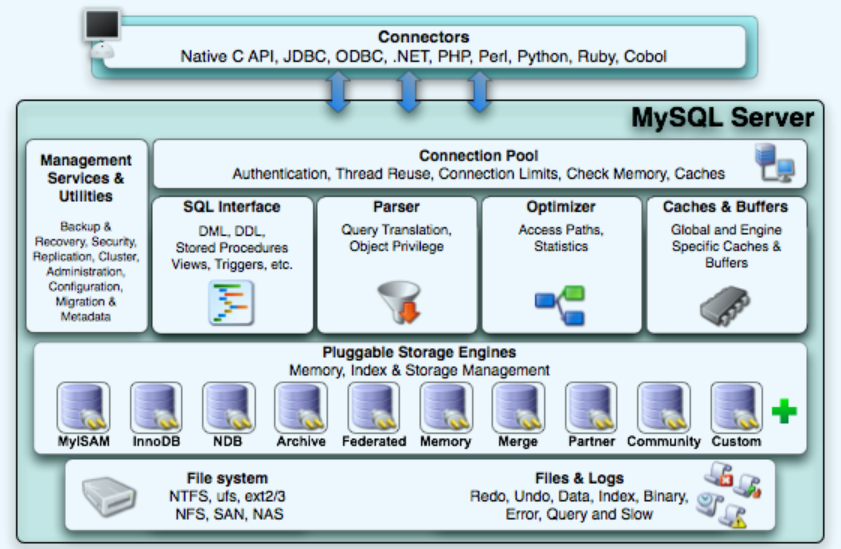
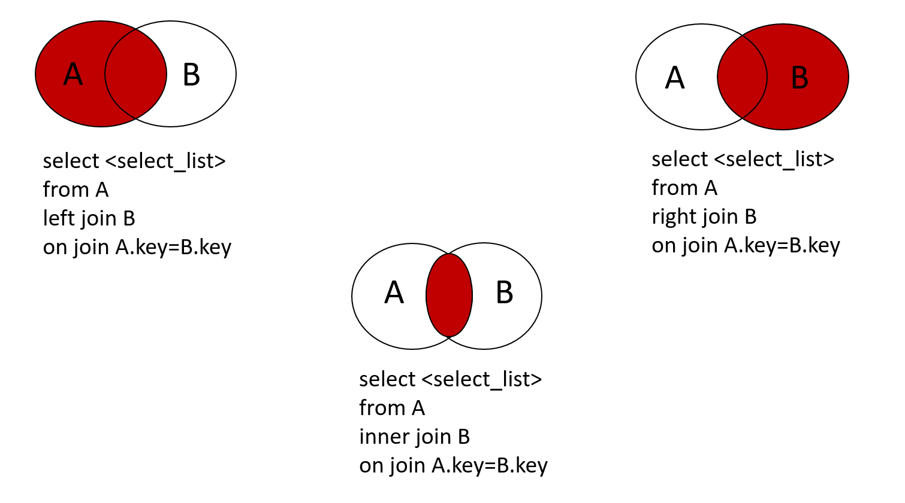
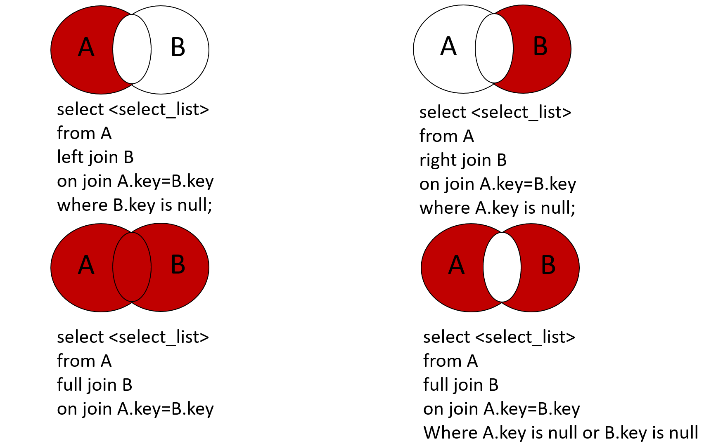
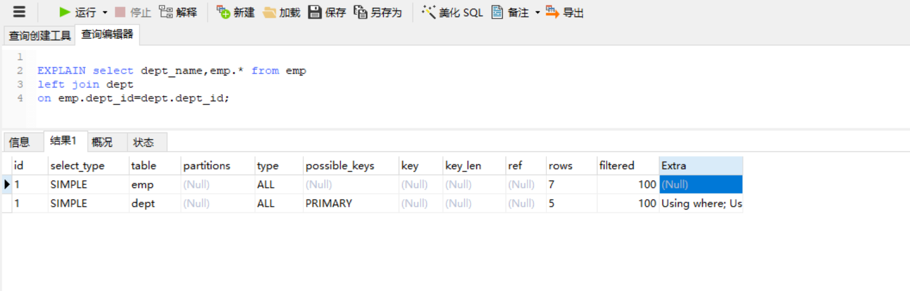
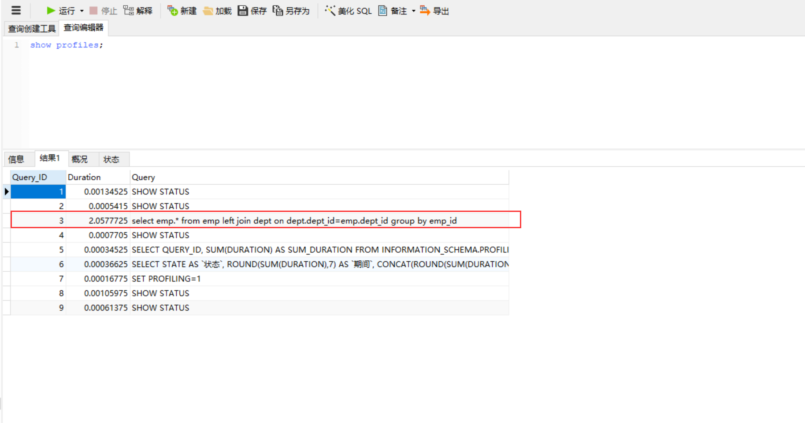
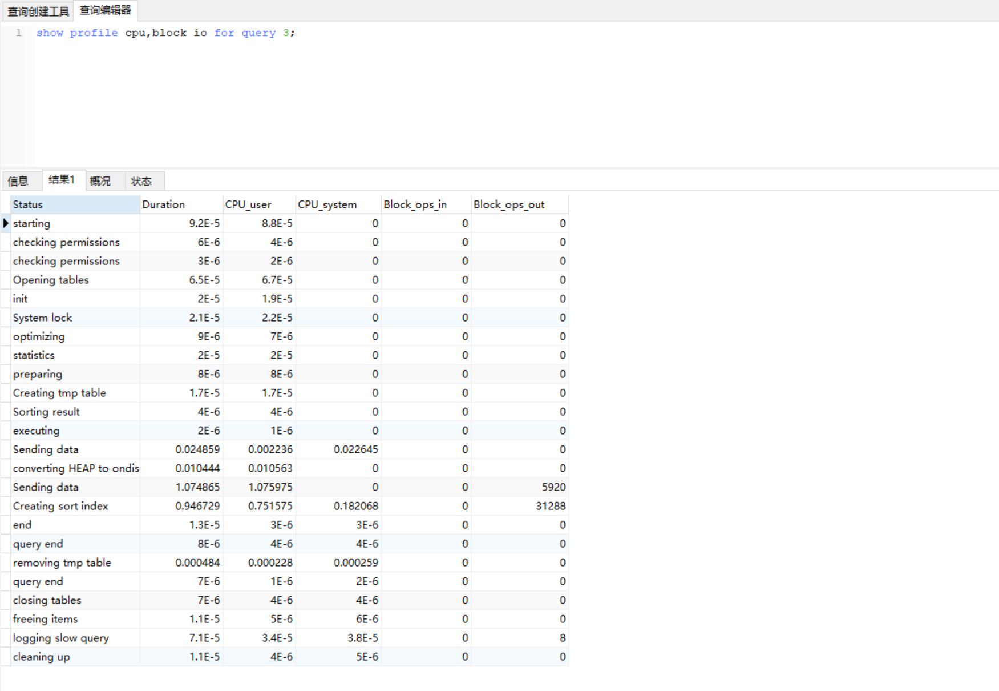

# MySQL高级

[TOC]

## 第一章 MySQL架构介绍

### 1.1 高级MySQL概述

1. mysql内核
2. sql优化
3. mysql服务器的优化
4. 各种参数常量设定
5. 查询语句优化
6. 主从复制
7. 软硬件升级
8. 容灾备份
9. sql编程

> 完整的mysql优化需要很深的功底，甚至有专门的DBA

### 1.2 MySQL安装

启动前的安装步骤

1. 去mysql官网下载mysql5.7，地址为：<https://dev.mysql.com/downloads/mysql/5.7.html>
或者在Linux系统中使用命令：`wget https://cdn.mysql.com//Downloads/MySQL-5.7/mysql-5.7.33-1.el7.x86_64.rpm-bundle.tar`

2. 将下载的mysql包使用xftp工具，上传到Linux系统的`/opt/mysql57`目录下
3. 进入到`/opt/mysql57`目录，使用解压命令解压mysql包，命令为：`tar -xvf mysql-5.7.33-1.el7.x86_64.rpm-bundle.tar`
4. 进入到mysql57目录下，可以看到有好几个mysql相关的rpm文件

   ```vim
   [root@centos1 opt]# cd mysql57
   [root@centos1 mysql57]# ll
   总用量 1060752
   -rw-r--r--. 1 root root  543098880 2月  15 10:29 mysql-5.7.33-1.el7.x86_64.rpm-bundle.tar
   -rw-r--r--. 1 7155 31415  26468960 12月 11 13:20 mysql-community-client-5.7.33-1.el7.x86_64.rpm
   -rw-r--r--. 1 7155 31415    315280 12月 11 13:20 mysql-community-common-5.7.33-1.el7.x86_64.rpm
   -rw-r--r--. 1 7155 31415   3918736 12月 11 13:20 mysql-community-devel-5.7.33-1.el7.x86_64.rpm
   -rw-r--r--. 1 7155 31415  47513604 12月 11 13:20 mysql-community-embedded-5.7.33-1.el7.x86_64.rpm
   -rw-r--r--. 1 7155 31415  23261952 12月 11 13:20 mysql-community-embedded-compat-5.7.33-1.el7.x86_64.rpm
   -rw-r--r--. 1 7155 31415 131045776 12月 11 13:21 mysql-community-embedded-devel-5.7.33-1.el7.x86_64.rpm
   -rw-r--r--. 1 7155 31415   2458780 12月 11 13:21 mysql-community-libs-5.7.33-1.el7.x86_64.rpm
   -rw-r--r--. 1 7155 31415   1260364 12月 11 13:21 mysql-community-libs-compat-5.7.33-1.el7.x86_64.rpm
   -rw-r--r--. 1 7155 31415 181817592 12月 11 13:21 mysql-community-server-5.7.33-1.el7.x86_64.rpm
   -rw-r--r--. 1 7155 31415 125021984 12月 11 13:21 mysql-community-test-5.7.33-1.el7.x86_64.rpm
   ```

5. centos可能会自带一个数据库mariadb，这个数据库会跟mysql冲突，先删除该数据库

   ```bash
   rpm -qa | grep mari           # 查询Linux系统是否真的有mariadb
   rpm -e --nodeps mariadb-libs  # 删除mariadb-libs
   rpm -e --nodeps marisa        # 删除marisa
   ```

6. 这一步是真正开始安装mysql，依次执行下列命令：

   ```bash
   rpm -ivh mysql-community-common-5.7.33-1.el7.x86_64.rpm
   rpm -ivh mysql-community-libs-5.7.33-1.el7.x86_64.rpm
   rpm -ivh mysql-community-client-5.7.33-1.el7.x86_64.rpm
   rpm -ivh mysql-community-server-5.7.33-1.el7.x86_64.rpm
   ```

> 其他的插件最好也都安装

启动
`systemctl start mysqld.service`

查看安装路径和进程是否启动
`ps -ef | grep mysql`

重启
`systemctl restart mysqld.service`

关闭
`systemctl stop mysqld.service`

查看初始密码

1. 输入命令`mysql -V`,可以看到mysql版本信息，则说明安装并启动成功
2. mysql会给在安装启动会设置一个初始root用户的密码，查看root用户密码方式如下`grep "password" /var/log/mysqld.log`：

   ```vim
   [root@centos1 mysql57]# mysql -V
   mysql  Ver 14.14 Distrib 5.7.33, for Linux (x86_64) using  EditLine wrapper
   [root@centos1 mysql57]# grep "password" /var/log/mysqld.log
   2021-02-15T03:55:59.086364Z 1 [Note] A temporary password is generated for root@localhost: nc.pl8NQ+Ew0
   2021-02-15T03:56:17.446918Z 2 [Note] Access denied for user 'root'@'localhost' (using password: NO)
   [root@centos1 mysql57]#
   ```

   从上面可知密码是：`nc.pl8NQ+Ew0`

登录客户端
`mysql -u root -p`

修改密码

1. 设置root密码。先可以设置 提示密码设置策略
    `set global validate_password_policy=0;`
    可选值有0低，1中，2高
    最后使用修改密码的指令：`set password for 'root'@'localhost'=password('sysagile123');`

添加用户和设置ip段

1. 准备好一个可供局域网连接mysql数据库的账号，或者修改root用户的登录域，默认是localhost,如：

   ```sql
   mysql -u root -psysagile123
   mysql>use mysql;
   mysql>update user set host = '%' where user = 'root';
   mysql>select host, user from user;
   ```

2. 修改了用户的登录范围后，重启mysql服务，使用命令`systemctl restart mysqld.service`

查看mysql是否自启动
`systemctl list-unit-files | grep mysql`

设置mysql自启动状态
`systemctl enable mysqld.service`

mysql数据库文件放的位置
可以通过`ps -ef | grep mysql`查询，或者直接在/var/lib/mysql中查看（一般是在这个目录）

mysql的配置文件位置
执行`which mysql`获取路径后，执行`/usr/bin/mysql --verbose --help | grep -A 1 'Default options'`
然后打印如：`/etc/my.cnf /etc/mysql/my.cnf /usr/etc/my.cnf ~/.my.cnf`
说明是按照这个顺序读配置文件

修改数据库字符集

1. 修改添加如下设置

   ```text
   [client]
   default-character-set=utf8

   [mysqld]
   character_set_server=utf8
   collation_server=utf8_general_ci

   [mysql]
   default-character-set=utf8
   ```

### 1.3 MySQL配置文件

二进制日志log-bin:用于主从复制
错误日志log-error:默认是关闭的，记录严重的警告和错误信息，每次启动和关闭的详细信息等
查询日志：默认关闭，记录查询的sql语句，如果开启会减低mysql的整体性能，因为记录日志也会需要消耗系统资源(可以设置开启，查询特别慢的sql)

数据文件

1. windows
在data目录下
2. linux
   在/var/lib/mysql

frm文件：存放表结构
myd文件：存放表数据
myi文件：存放表索引
opt文件：记录数据库的选项，数据库的字符集设置

如果采用独立表存储模式，还会产生ibd文件（存储数据信息和索引信息）
如果采用共存储模式的，数据信息和索引信息都存储在ibdata1中

### 1.4 MySQL逻辑架构介绍


第一层：JDBC
第二层：SQL Interface->Parser->Optimizer->Caches & Buffers
第三层：分层可拔插的存储引擎：MyISAM,InnoDB....
第四层：硬盘，文件最终是以文件的方式保存在硬盘上；还有日志

MySQL是架构非常优良，主要体现在存储引擎上。MySQL是插件式的存储引擎，它可以将查询处理和其他的系统任务以及数据的存储提取相分离。

* Parser：将SQL语句重组过滤，从from开始解析（ 转化为关系代数表达式）
* optimizer：优化器。找到更好的等价的关系代数表达式。仅仅优化为mysql自己认为好的，可导致索引失效；
* cache & buffer：缓存缓冲；
* 存储引擎：可插拔式的存储引擎将查询处理和其他的系统任务以及数据存储提取相隔离。常用的是MyISAM和InnoDB；

从上图可知，MySQL的逻辑框架主要分为四层：

1. 连接层
2. 服务层：主要进行sql语句相关的操作
3. 引擎层：是可拔插的
4. 存储层

通过分层和可插拔式的架构，可以根据不同的生产环境构建最优的系统。

查看引擎
`show engines;`

查看当前使用的引擎
`show variables like "%storage_engine%";`

对比MyISAM和InnoDB


阿里使用的数据库

* Percona公司提供的XtraDB,阿里的数据库是基于此
  > XtraDB 是一个MySQL的存储引擎，由 percona 公司对于innodb存储引擎进行改进加强后的产品，其设计的主要目的是用以替代现在的 InnoDB 。XtraDB兼容innodb的所有特性，并且在IO性能，锁性能，内存管理等多个方面进行了增强。

* AliSql+AliRedis

## 第二章 索引优化分析

### 2.1 SQL缓慢原因

现象：

1. 性能下降SQL慢
2. 执行时间长
3. 等待时间长

> 出现问题时，要复现问题，然后再排查问题

原因如下：

1. 查询语句的问题
2. 索引失效
3. 管理查询太多join （设计缺陷或不得已的需求）
4. 服务器调优及各个参数设置(缓冲、线程数)

> 前三个是java工程师应该掌握的

索引：

1. 单值索引，如果对查询条件中，某个字段作为条件十分频繁，应该给该字段建立索引，便于查询
   如user表的name属性，则可以使用`create index idx_user_name on user(name)`
2. 复合索引，如果查询条件中，有多个字段作为条件十分频繁，则可以建立复合的索引，如：
   `create index idx_user_nameEmail on user(name,email)`

### 2.2 SQL执行顺序

```sql
select 查询列表              #7
from 表                     #1
连接类型 join 表2            #2
on 连接条件                  #3
where 筛选条件               #4
group by 分组列表            #5
having 分组后的筛选          #6
order by 排序列表            #8
limit 偏移,条目数;           #9
```

> 手写和机读的顺序是不同的


### 2.3 Join图




> 如果当前mysql版本不支持全外连接，则可以使用`左外 union 右外`

### 2.3 索引简介

#### 2.3.1 索引介绍

索引是帮助mysql高效后去数据的数据结构

索引的目的在于提高查询效率，可以类比字典
如果要查mysql这个词，需要定位到m字母，然后继续找y字母....
如果没有索引，那么可能需要每次都从a到z遍历来查找

索引，可以简单的理解为“排好序的快速查找数据结构”
数据本身之外，数据库还维护着一个满足特定查找算法的数据结构，这些数据结构以某种方式指向数据，这样就可以在这些数据结构的基础上实现高级查找算法，这种数据结构就是索引

索引本身也很大，不可能全部存储在内存中，因此索引往往以索引文件的形式存储的磁盘上

索引，一般指的是B树(多路搜索树，并不一定是二叉树)结构组织的索引，其中聚集索引，次要索引，覆盖索引，复合索引，前缀索引，唯一索引默认都是B+树，当然还有哈希索引

#### 2.3.2 索引优势&劣势

优势

1. 类似大学图书馆建书目索引，提高数据检索的效率，降低数据库的IO成本
2. 通过索引列队数据进行排序，降低数据排序的成本，降低了CPU的消耗

劣势

1. 实际上索引也是一张表，该表保存了主键和索引字段，并指向实体表的记录，所以索引列也是要占用空间的
2. 虽然索引大大提高了查询速度，同时却会降低更新表的速度，如对表进行INSERT,UPDATE和DELETE
3. 虽然更新表时，MySQL不仅要保存数据，还要保存一个索引文件每次更新添加了索引列的字段，都会调整因为更新所带来的键值变化后的索引信息
4. 索引只是提高效率的一个因素，如果你的MySQL有大数据量的表，就需要花时间研究建立最优秀的索引，或优化查询语句

#### 2.3.3 mysql索引分类

1. 单值索引：即一个索引只包含单个列，一个表可以有多个单列索引
2. 唯一索引：索引列的值必须唯一，但允许有空值
3. 复合索引：即一个索引包含多个列

> 查询的时候，只能使用上一个索引

创建：
`create [unique] index indexName on mytable(columnName);`
`alter mytable add [unique] index [indexName] on (columnName);`

删除：
`drop index [indexName] on mytable;`

查看
`show index from table_name`

> 索引名一般是`idx_col1col2...`

#### 2.3.4 mysql索引结构

BTree索引

Hash索引

full-text全文索引

R-Tree索引

#### 2.3.5 哪些情况需要创建索引

1. 主键自动建立唯一索引
2. 频繁作为查询条件的字段应该创建索引
3. 查询中与其他表关联的字段，外键关系建立索引
4. 频繁更新的字段不适合创建索引，因为每次更新不单单是更新了记录，还会更新索引，加重了IO负担
5. where条件里用不到的字段不创建索引
6. 单键/组合索引的选择问题？ 在高并发下倾向创建组合索引
7. 查询中排序的字段，排序字段若通过索引去访问将大大提高排序速度
8. 查询中的统计或者分组字段

#### 2.3.6 哪些情况不要创建索引

1. 表记录太少(一般几十万后才有索引的优势，可以测试一下)
2. 经常增删改的表。因为提供了查询速度，但是却会降低插入，更新，删除的性能，因为表更新时，mysql不仅要保存数据，还要保存一下索引文件
3. 数据重复且分布平均的表字段，因此应该只为最经常排序的数据列建立索引。注意，如果某个数据列包含许多重复的内容，为它建立索引就没有太大的实际效果
   > 索引的选择性是指索引列中不同值的数目与表中记录数的比。如果一个表中有2000条记录，表索引列有1980个不同的值，那么这个索引的选择性就是1980/2000=0.99。一个索引的选择性越接近于1，这个索引的效率就越高

### 2.4 性能分析

#### 2.4.1 Mysql Query Optimizer

Mysql Query optimizer ：Mysql中有专门负责优化SELECT语句的优化器模块，主要功能：通过计算分析系统中收集到的统计信息，为客户端请求的Query提供他认为最有的执行计划（他认为最优的数据检索方式）

#### 2.4.2 MySQL常见瓶颈

CPU：CPU在饱和的时候一般发生在数据装入内容或磁盘上读取数据时候
IO：磁盘I/O瓶颈发生在装入数据远大于内存容量的时候
服务器硬件的性能瓶颈：top,free,iostat，vmstat来查看系统的性能状态

#### 2.4.3 Explain

##### Explain介绍

explain用来查看执行计划，使用Explain关键字可以模拟优化器执行SQL查询语句，从而知道MySQL是如何处理客户端发送的SQL语句的，分析查询语句或者是表结构的性能瓶颈

##### Explain的作用

查看一条查询语句中的下列信息：

1. 表的读取顺序
2. 数据读取操作的操作类型
3. 哪些索引可以使用
4. 哪些索引被实际引用
5. 表之间的引用
6. 每张表有多少行被优化器查询

##### Explain的使用

Explain+SQL语句


各字段解释表示的意义中可以看出sql被解析过程

##### id

select查询的序列号，包含一组数字，表示查询中执行select子句或操作表的顺序

id取值的三种情况

1. id相同，可以认为是一组，执行顺序由上至下
2. id不同，如果是子查询，id的序号会递增，id值越大优先级越高，越先被执行
3. id相同和不同的情况同时存在

> sql应遵循小表驱动大表，当sql中出现先加载大表时，就应调整sql

##### select_type

select_type取值可能有如下：

|id|select_type|
|:----|:----|
|1|SIMPLE|
|2|PRIMARY|
|3|SUBQUERY|
|4|DERIVED|
|5|UNION|
|6|UNION RESULT|
|7|DEPENDENT UNION|
|8|DEPENDENT SUBQUERY|

simple
表示简单的select,没有union和子查询，该查询最后执行

primary
查询中若包含任何复杂的子部分，最外层查询则被标记为primary

subquery
在select或where列表中包含的子查询

derived
在from列表中包含的子查询被标记为derived(衍生)，mysql会递归执行这些子查询，把结果放在临时表中
> mysql5.7中没有该取值

union
若第二个select出现在union之后，则被标记为union；若union包含在from子句的子查询中，外层select将被标记为derived

union result
从union 表 获取结果的查询

dependet union
union中的第二个或随后的select查询，依赖于外部查询的结果集

dependent subquery
子查询中的第一个select查询，依赖于外部查询的结果集

##### table

显示当前步骤的查询是关于哪个表的

##### type

type显示查询使用了何种类型，是较为重要的一个指标，结果值从最好到最坏依次是：
system > const > eq_ref > ref > fulltext > ref_or_null > index_merge > unique_subquery > index_subquery > range > index > all

常用的结果值，从最好到最差依次是：
`system` > `const` > `eq_ref` > `ref` > `range` > `index` > `all`

`system`：表只有一行记录（等于系统表），这是const类型的特例，平时不会出现，这个也可以忽略不计

`const`：表示通过索引一次就找到了，const用于比较primary key或者unique索引，因为只匹配一行数据，所以很快。如将主键置于where列表中，MySQL就能将该查询转换为一个常量
> 数据是一个常量，而且只有一条记录

`eq_ref`：唯一性索引扫描，对于每个索引键，表中只有一条记录与之匹配，常见于主键或唯一索引扫描
> 数据非常量，但是索引中只有一条数据匹配

`ref`：非唯一性索引扫描，返回匹配某个单独值的所有行。本质上也是一个索引访问，它返回所有匹配某个单独值的行，然而它可能找到多个符合条件的行，所以他应该属于查找和扫描的混合体
> 索引可能是复合索引，而sql查询可能只用到了一个字段，所以此时是ref

`range`：只检索给定范围的行，使用一个索引来选择行。key列显示使用了哪个索引。一般就是在where语句中出现了`between`、`<`、`>`、`in`等的查询，这种范围扫描索引比全表扫描要好，因为它只需要开始于索引的某一点，而结束于另一个点，不用扫描全部索引

`index`：即Full Index Scan，index与all区别在于，index类型只遍历索引树，这通常比all快，因为索引文件通常比数据文件小。(也就是说虽然all和index都是读全表，但index是从索引中读取的，而all是从硬盘中读的)

`all`：Full Table Scan，将遍历全表以找到匹配的行

> 一般来说，最少保证查询在range级别，最好是ref级别

##### possible_keys

显示可能应用在这张表此次查询的索引，一个或多个。
查询涉及到的字段上若存在索引，则该索引将被列出，**但不一定被查询实际使用**

##### key

实际使用的索引，如果为NULL，则没有使用索引
查询中若使用了覆盖索引，则该索引和查询的select字段重叠
> 如果查询中使用了索引，这个字段的值会显示出来

##### key_len

表示索引中使用的字节数，可通过该列计算查询中使用的索引的长度
在不损失精确性的情况下，长度越短越好
key_len显示的值为索引字段的最大可能长度，并非实际使用长度，即key_len是根据表定义计算而得，不是通过表内检索而出
> 当想要查询的数据的条件越多，即想要查找的数据要求越多，越精确，则可能使用到的索引长度就越多

##### ref

显示索引的哪一列被使用了，如果可能的话，是一个常数，说明哪些列或常量被用于查找所有列上的值

##### rows

根据表统计信息及索引选用情况，大致估算出找到所需的记录所需要读取的行数

##### Extra

包含不适合在其他列中显示但十分重要的额外信息

1. Using filesort

   说明mysql会对数据使用一个外部的索引排序，而不是按照表内的索引顺序进行读取。MySQL中无法利用索引完成的排序操作称为“文件排序”

2. Using temporary

   使用了临时表保存中间结果，MySQL在对查询结果排序时使用了临时表。常见于排序order by和分组查询group by

3. Using index

   表示相应的select操作中使用了覆盖索引，避免访问了表的数据行，效率很高；
   如果同时出现using where，表明索引被用来执行索引键值的查找；
   如果没有同时出现using where，表明索引用来读取数据而非执行查找动作

   **覆盖索引**(Covering Index),即索引覆盖
   就是select的数据列只用从索引中就能够取得，不必读取数据行，MySQL可以利用索引返回select列表中的字段，而不必根据索引再次读取数据文件，换句话说，查询列表要被所建的索引覆盖

4. Using index condition

   会先条件过滤索引，过滤完索引后找到所有符合索引条件的数据行，随后用 WHERE 子句中的其他条件去过滤这些数据行；

5. Using where

   表明使用了where过滤

6. Using join buffer

   使用了连接缓存

7. impossible where

   where子句的值总是false，不能用来获取任何元组
   比如`where col1='a' and col1='b'`这种无法成立的条件

8. select tables optimized away

   在没有group by子句的情况下，基于索引优化min/max操作或者对于MyISAM存储优化COUNT(*)操作，不必等到执行阶段再进行计算，查询执行计划生成的阶段即完成优化

9. distinct

   优化distince操作，在找到第一匹配的元组后即停止找到同样值的动作

### 2.5 索引优化

#### 2.5.1 索引分析

不建立索引，然后执行查询分析
建立索引，然后执行查询分析
单表，两表，三表

建立的索引，在使用过程中，字段是范围值时，则此字段后的索引失效

Join语句的优化：

1. 尽可能减少Join语句中的NestedLoop的循环总次数，用小表的结果驱动大表的结果集
2. 优先优化NestedLoop的内层循环
3. 保证Join语句中被驱动表上join条件字段已经被索引
4. 当无法保证被驱动表的Join条件字段被索引且内层资源充足的前提下，可以修改扩大JoinBuffer设置

#### 2.5.2 索引失效

1. 全值匹配最优

2. 最佳左前缀法则

   ```sql
   show index from emp;# 索引是emp_id,emp_name_emp_age

   explain select * from emp where emp_id=101

   explain select * from emp where emp_id=101 and emp_name='刘备';

   explain select * from emp where emp_name='刘备';

   explain select * from emp where emp_name='刘备' and emp_age=45;

   explain select * from emp where emp_id=101 and emp_age=45;
   ```

   如果索引是多列，要遵守最左前缀法则，即查询从索引的最左前列开始并且不跳过索引中的列

3. 不在索引列上做任何操作(计算、函数、(自动or手动)类型转换)，会导致索引失效而转向全表扫描

   ```sql
   explain select * from emp where emp_id=101 and left(emp_name,1)='刘'  and emp_age='45';
   ```

   > MySQL5.6之后，索引列使用转换或操作，不会使索引失效，Using index condition

4. 存储引擎不能使用索引中范围条件右边的列

   ```sql
   explain select * from emp where emp_id=101 and emp_name='刘备' and emp_age>20;
   ```

   > MySQL5.6之后中间断开的索引，以及`>`的条件，不会造成索引失效

5. 尽量使用覆盖索引(只访问索引的查询(索引列和查询列一致))，减少select *

   ```sql
   explain select emp_id from emp where emp_id=101 and emp_name='刘备' and emp_age='45';
   explain select * from emp where emp_id=101 and emp_name='刘备' and emp_age='45';
   ```

   只访问索引的查询(索引列和查询列一致)，减少`select *`,具体体现在explain解析的extra字段，如果是覆盖索引，会有Using index

6. mysql在使用不等于(`!=` 或 `<>`)的时候无法使用索引会导致全表扫描

   ```sql
   explain select * from emp where emp_id!=101;
   ```

   会使得索引失效而全表扫描

7. is,null,is not null也无法使用索引

   ```sql
   explain select * from emp where emp_id is null;
   ```

   >MySQL5.6 可以使用以上，索引不会失效

8. like以通配符开头`%abc..`的sql中，mysql索引失效会变成全表扫描的操作

   * 在没有给like条件的字段建立索引时，无论like怎么写`%..`，都是失效的

   * 现在`emp_email`字段建立索引

     ```sql
     EXPLAIN select emp_id from emp where emp_email like '%@suftz.com%';    #因为emp_id是主键
     EXPLAIN select emp_email from emp where emp_email like '%@suftz.com%'; #因为查询字段和索引是覆盖
     EXPLAIN select emp_id from emp where emp_email like '%@suftz.com'
     EXPLAIN select emp_id from emp where emp_email like '@suftz.com%'
     ```

   * 如果查询的字段不是当前使用的索引，则会失效

9. 字符串不加单引号索引失效

   `EXPLAIN select emp_name from emp where emp_name='2000'`
   `EXPLAIN select emp_name from emp where emp_name=2000`

   >MySQL5.6 之后，上面两种方式explain结果相同，索引不会失效。在这之前，第二种写法是会导致索引失效，而且是全表扫描，因为数据类型不匹配后，mysql进行了数据转换

10. 少用or,用来来连接时会索引失效

    `explain select emp_name from emp where emp_name='刘备' or emp_name='诸葛亮'`

总结示例1：(假设索引是index(a,b,c))

|where语句|索引是否被使用|
|:----|:----|
|where a=3|Y，使用到a|
|where a=3 and b=5|Y，使用到a，b|
|where a=3 and b=5 and c=4|Y，使用到a，b，c|
|where b=3 or where b=3 and c=4 or where c=4|N|
|where a=3 and c=5|使用到a，但是c不可以，b中间断了|
|where a=3 and b>4 and c=5|使用到a和b，c不能用在范围之后，b断了|
|where a=3 and b like 'kk%' and c=4|Y，使用到a，b，c|
|where a=3 and b like '%kk' and c=4|Y，只a能用|
|where a=3 and b like '%kk%' and c=4|Y，只a能用|
|where a=3 and b like 'k%kk%' and c=4|Y，使用到a,b,c|

总结示例2：(假设字段有c1，c2，c3，c4，c5，索引是index(c1,c2,c3,c4,c5))

|语句|索引是否被使用|
|:----|:----|
|`explain select * from tbl_test where c1='a1'`|Y,使用到c1|
|`explain select * from tbl_test where c1='a1' and c2='a2'`|Y,使用到c1,c2|
|`explain select * from tbl_test where c1='a1' and c2='a2' and c3='a3'`|Y,使用到c1,c2,c3|
|`explain select * from tbl_test where c1='a1' and c2='a2' and c3='a3' and c4='a4'`|Y,使用到c1,c2,c3,c4|
|`explain select * from tbl_test where c1='a1' and c2='a2' and c4='a4' and c3='a3'`|Y，使用到c1,c2,c3,c4。执行前经过了mysql的优化|
|`explain select * from tbl_test where c1='a1' and c2='a2' and c3>'a3' and c4='a4'`|Y,使用到c1,c2,c3。范围之后全失效|
|`explain select * from tbl_test where c1='a1' and c2='a2' and c4>'a4' and c3='a3'`|Y,使用到c1,c2,c3,c4。执行前经过了mysql的优化|
|`explain select * from tbl_test where c1='a1' and c2='a2' and c4='a4' order by c3`|Y,使用到了c1,c2,c3,c4。c3用于了排序|
|`explain select * from tbl_test where c1='a1' and c2='a2' order by c3`|Y,使用到了c1,c2,c3。c3用于了排序。该命令结果和上一行是完全相同的，即c4参与与否，不影响|
|`explain select * from tbl_test where c1='a1' and c2='a2' order by c4`|Y,使用到了c1,c2。注意产生了文件排序Using filesort,因为产生了索引中断|
|`explain select * from tbl_test where c1='a1' and c5='a5' order by c2,c3`|Y,使用到了c1索引,c2,c3用于排序。无filesort|
|`explain select * from tbl_test where c1='a1' and c5='a5' order by c3,c2`|Y,使用到了c1索引。产生了filesort，因为c3,c2这个索引顺序是反的，导致索引中断|
|`explain select * from tbl_test where c1='a1' and c2='a2' order by c2,c3`|Y,使用到了c1索引,c2,c3用于排序，而且c2是常量排序，无filesort|
|`explain select * from tbl_test where c1='a1' and c2='a2' and c5='a5' order by c2,c3`|Y,使用到了c1索引,c2,c3用于排序，而且c2是常量排序，无filesort|
|`explain select * from tbl_test where c1='a1' and c2='a2' and c5='a5' order by c3,c2`|Y,使用到了c1索引,c2,c3用于排序，而且c2是常量排序。注意，虽然c3,c2是反的，但是c2是常量，不影响排序，即无filesort|
|`explain select * from tbl_test where c1='a1' and c4='a4' group by c2,c3`|Y，使用到了c1索引，c2,c3用于分组，c4实际上没有使用|
|`explain select * from tbl_test where c1='a1' and c4='a4' group by c3,c2`|Y，只使用到了c1索引。注意：c3，c2反索引顺序，产生了filesort,还使用了临时表Using temporary|
|`explain select * from tbl_test where c1='a1' and c3='a3' group by c3,c2`|Y，只使用到了c1索引,c2,c3用于分组。c3，c2虽然反索引顺序，但是c3是常量，不影响索引|

> group by 基本上都需要进行排序，会有临时表产生

#### 2.5.3 一般性建议

1. 对于单键索引，尽量选择针对当前query过滤性更好的索引
2. 在选择组合索引的时候，当前query中过滤性最好的字段在索引字段顺序中，位置越靠前越好
3. 在选择组合索引的时候，尽量选择可以能够包含当前query中的where子句中更多字段的索引
4. 尽可能通过分析统计信息和调整query的写法来达到选择合适索引的目的

优化总结口诀：

   全值匹配我最爱，最左前缀要遵守，
   带头大哥不能死，中间兄弟不能断。
   索引列上少计算，范围之后全失效，
   LIKE百分写最右，覆盖索引不写星。
   不等控制还有or，索引失效要少用，
   VAR引号不可丢，SQL高级也不难。

## 第三章 查询截取分析

### 3.1 查询优化

分析的过程步骤：

1. 观察，至少抛一天，看看生产的慢SQL情况
2. 开启慢查询日志，设置阈值，比如超过5秒钟就是慢SQL，并将它抓取出来
3. explain+ 慢SQL分析
4. show profile
5. 运维经理 or DBA，进行SQL数据库服务器的参数调优

总结过程：

1. 慢查询的开启并捕获
2. explain+慢SQL分析
3. show profile查询SQL在MySQL服务器里面的执行细节和生命周期
4. SQL数据库服务器的参数调优

#### 3.1.1 小表驱动大表

举例：

```java
//方式一：
for(int i=0;i<5;i++>){
   for(int j=0;j<10000;j++){

   }
}
//方式二
for(int i=0;i<10000;i++>){
   for(int j=0;j<5;j++){

   }
}
```

可以类比现在有两个表，一个表有10000条数据，一个表有5条数据，如果是采用方式1，则只申请了5次表连接，每次连接查询10000次，然后释放连接。
如果是方式二，则效率不高，申请了10000次表连接，每次连接却只查询5次就释放了连接

所以，要让小表去驱动大表，让小表与大表进行连接，然后拿小表的单个数据与大表所有数据进行连接对比

```sql
select * from A where id in (select id from B)
# 等价于
for select id from B
   for select * from A where A.id=B.id
```

当B表的数据集小于A表的数据集时，用`in`优于`exists`

上面的sql可以使用exists来改写：

```sql
select * from A where exists (select 1 from B where B.id=A.id)
# 等价于
for select * from A
   for select * from B where B.id=A.id
```

当A表的数据集小于B表的数据集时，上面这种写法exists优于in

EXISTS
`select ... from table where field_value exists (subquery)`
该语法可以理解为：将主查询的数据，放到子查询中做条件验证，根据验证结果(true或false)来决定主查询的数据结果是否得以保留

> 1. exists(subquery) 只返回true或false,因此子查询中的select * 也可以是select 1，没有区别
> 2. exists子查询的实际执行过程可能经过了优化而不是理解的追条对比，可以进行实际检验确定是否有效率问题
> 3. exists子查询往往也可以用条件表达式、其他子查询或者join来替代，需要具体分析效率

#### 3.1.2 order by关键字优化

##### order by优化

order by子句，尽量使用using index方式排序，避免使用filesort方式排序

示例：(index(age,birth))

|查询|情况|
|:----|:----|
|`explain select * from tblA where age >20 order by age;`|Using where,Using index|
|`explain select * from tblA where age >20 order by age,birth;`|Using where,Using index|
|`explain select * from tblA where age >20 order by birth;`|Using where,Using index,Using filesort|
|`explain select * from tblA where age >20 order by birth,age;`|Using where,Using index,Using filesort|
|`explain * from tblA ordery by birth;`|Using index,Using filesort|
|`explain select * from tblA where birth > '20201012 00:00:00' order by birth;`|Using where;Using index;Using filesort|
|`explain select * from tblA birth > '20201012 00:00:00' order by age;`|Using where;Using index|
|`explain select * from tblA order by age ASC,birth DESC;`|Using index,Using filesort。索引排序顺序是乱的|

MySQL支持两种方式的排序，Filesort和Index,Index效率高，它指MySQL扫描索引本身完成排序。Filesort方式效率低。

order by满足两情况，会使用index方式排序：

1. order by语句使用索引最左前缀
2. 使用where子句与order by子句条件列组合满足最左前缀

尽可能在索引列上完成排序操作，遵照索引建的最佳左前缀

##### filesort算法

如果不在索引列上，filesort有两种算法，mysql就要启动双路排序和单路排序

双路排序

1. MySQL4.1 之前是使用双路排序，字面意思就是两次扫描磁盘，最终得到数据
读取行指针和orderby列，对它们进行排序，然后扫描已经排序好的列表，按照列表中的值重新从列表中读取对应的数据输出
2. 从磁盘取排序字段，在buffer进行排序，再从磁盘取出其他字段

取一批数据，要对磁盘进行了两次扫描，众所周知，I/O是很耗时的，所以再mysql4.1之后，出现了第二种改进的算法，就是单路排序

单路排序

1. 从磁盘读取查询需要的所有列，按照order by列在buffer对它们进行排序，然后扫描排序后的列表进行输出，它的效率更快一些，避免了第二次读取数据。并且把随机IO变成了顺序IO，但是它会使用更多的空间，因为它把每一行都保存在内存中了

> 单路排序可能出现的问题
> 在sort_buffer中，方法B比方法A要多占用很多空间，因为方法B是把所有字段都取出，所以有可能取出的数据的总大小超出了sort_buffer的容量，导致每次只能取sort_buffer容量大小的数据，进行排序(创建tmp文件，多路合并)，排完再取sort_buffer容量大小，再排...从而多次I/O
> 本来想省一次IO操作，反而导致了大量的IO操作

##### 优化策略

增大sort_buffer_size参数的设置

增大max_length_for_sort_data参数的设置

提高order by的速度

1. order by时`select *` 是一个非常不好的方式，应该只query需要的字段，这里影响的是：
   * 当query的字段大小总和小于max_length_for_sort_data而且排序字段不是text/blob类型时，会用改进后的算法----单路排序，否则用老算法----多路排序
   * 两种算法的数据都有可能超出sort_buffer的容量，超出之后，会创建tmp文件进行合并排序，导致多次I/O，但是用单路排序算法的风险会更大一些，所以要提高sort_buffer_size

2. 尝试提高`sort_buffer_size`
   * 不管使用哪种算法，提高这个参数都会提高效率，当然，要根据系统的能力去提高，因为这个参数是针对每个进程的

3. 尝试提高`max_length_for_sort_data`
   * 提高这个参数，会增加用改进算法的概率。但是如果设置的太高，数据总容量超出`sort_buffer_size`的概率就增大，明显症状是高的磁盘I/O活动和低的处理器使用率

##### orderby总结

为排序使用索引

1. MySQL两种排序方式：文件排序或扫描有序索引排序
2. MySQL能为排序与查询使用相同的索引

示例：(假设index(a,b,c))

1. order by能使用索引最左前缀

   ```sql
   order by a;
   order by a,b;
   order by a,b,c;
   order by a desc,b desc,c desc;
   ```

2. 如果where所使用索引的最左前缀定义为常量，则order by能使用索引

   ```sql
   where a=const order by b,c;
   where a=const and b=const order by c;
   where a=const order by b,c;
   where a=const and b>const order by b,c;
   ```

3. 不能使用索引进行排序

   ```sql
   order by a asc,d desc,c desc;  # 排序不一致
   where g=const order by b,c;    # 丢失a索引
   where a=const order by c;      # 丢失b索引
   where a=const order by a,d;    # d不是索引的一部分
   where a in(...) order by b,c;  # 对于排序来说，多个相等条件也是范围查询
   ```

#### 3.1.3 group by关键字优化

`group by` 的优化与`order by`是十分相似的操作

需要注意的是：

1. `group by`实质是先排序后进行分组，遵照索引建的最佳左前缀
2. 当无法使用索引列，增大`max_length_for_sort_data`参数的设置+增大`sort_buffer_size`参数的设置
3. where高于having,能写在where限定的条件就不要去使用having限定

### 3.2 慢查询日志

#### 3.2.1 慢查询日志介绍

MySQL的慢查询日志是MySQL提供的一种日志记录，它用来记录在MySQL中响应时间超过阈值的语法，具体指运行时间超过`long_query_time`值的SQL，则会被记录到慢查询日志中

具体指运行时间超过`long_query_time`值的SQL，则会被记录到慢查询日志中。`long_query_time`的默认值为10，意思是运行10秒以上的语句

由他来查看哪些SQL超出了我们的最大忍耐时间值，比如一条sql执行超过5秒钟，就算作是一条慢SQL，希望能收集超过5秒的sql，结合之前explain进行全面分析

#### 3.2.2 慢查询日志使用

1. 默认情况下，MySQL数据库没有开启慢查询日志，需要手动来设置这个参数
2. 当然，如果不是调优需要的话，一般不建议启动该参数，以为开启慢查询日志会或多或少带来一定的性能影响。慢查询日志支持将日志记录写入文件

查看是否开启：

```sql
show VARIABLES like '%slow_query_log%';  # 查看是否开启
set global slow_query_log=1;             # 开启慢查询日志，注意，数据库重启后失效
```


> 慢查询日志本来就需要消耗性能，一般不一直开启它，只是在排查问题的时候开启。
> 要让设置一直生效，可以去修改配置文件my.cnf：
> 在[mysqld]下增加或修改参数：
> slow_query_log=1
> slow_query_log_file=/var/lib/mysql/agile-slow.log
> 修改完毕后，重启mysql服务器，就会使用该配置

`set global long_query_time=3;`
开启慢查询日志后，根据设置的`long_query_time`值，sql查询中大于该数值的查询时间会被记录下来。注意，这里的判断条件是**大于**，而非大于等于

> 注意，修改系统变量后，需要关闭连接，然后重新连接到数据库，才可看到参数已被修改

#### 3.2.3 日志分析工具mysqldumpslow

因为生产环境可能会有很多慢查询记录，如果直接打开慢查询日志文件，则难以检索出想要的信息，使用mysqldumpslow可以对日志进行更加准确的检索

s：是表示按照何种方式排序
c：访问次数
l：锁定时间
r：返回记录
t：查询时间
al：平均锁定时间
ar：平均返回记录数
at：平均查询时间
t：即为返回前面多少条的数据
g：后边搭配一个正则匹配模式，大小写不敏感的

使用示例：

```shell
# 得到返回记录集最多的10个SQL
mysqldumpslow -s r -t 10 /var/lib/mysql/agile-slow.log

# 得到访问次数最多的10个SQL
mysqldumpslow -s c -t 10 /var/lib/mysql/agile-slow.log

# 得到按照时间排序的前10条里面含有左连接的查询语句
mysqldumpslow -s t -t 10 -g "left join" /var/lib/mysql/agile-slow.log

# 建议在使用这些命令时结合more使用，否则可能出现爆屏
mysqldumpslow -s r -t 10 /var/lib/mysql/agile-slow.log | more
```

> mysqldumpslow命令不是在mysql客户端登录后使用的，而是直接在Linux终端命令行使用

### 3.3 批量数据脚本

如果需要往数据库中插入1000w条数据，这些数据都是相似的数据，字符串字段是从字母表中随机组合的，而数字字段是直接产生随机数得到的

所以，可以写一个存储过程来完成插入数据，最好不要直接插入1000w条，而是每次插入50w条记录

创建函数报错的话：the function has none of deterministic
由于开启过慢查询日志，因为开启了bin-log,就必须为function指定一个参数。
`show variables like 'log_bin_trust_function_cerators';`
`set global log_bin_trust_function_creators=1;`

上述设置在重启mysqld后会失效，可以在my.cnf配置文件的[mysqld]中加入`log_bin_trust_function_creators=1`


```sql
delimiter $$
create function rand_string(n int) returns varchar(255)
BEGIN
   DECLARE chars_str varchar(100) default 'abcdefghijklmnopqrstuvwxyzABCDEFGHIJKLMNOPQRSTUVWXYZ';
   DECLARE return_str varchar(255) default '';
   declare i int default 0;
   while i<n DO
      set return_str=CONCAT(return_str,SUBSTRING(chars_str,FLOOR(1+rand()*52),1));
      set i=i+1;
   end while;
   return return_str;
end $$

delimiter $$
create function rand_num() returns int(5)
BEGIN
   declare i int default 0;
   set i=floor(100+rand()*10);
   return i;
end $$

delimiter $$
create PROCEDURE insert_emp(in start int(10),in max_num int(10))
BEGIN
DECLARE i int default 0;
set autocommit =0;
REPEAT
   set i=i+1;
   insert into emp values((start+i),concat('刘备'+rand_string(6)),1+rand()*100,'1990-03-03','liubei@suftz.com',1001);
   UNTIL i=max_num
end repeat;
commit;
end $$

delimiter $$
create PROCEDURE insert_dept(in start int(10),in max_num int(10))
BEGIN
DECLARE i int default 0;
set autocommit =0;
REPEAT
   set i=i+1;
   insert into dept values((start+i),rand_string(6),'1990-03-03');
   UNTIL i=max_num
end repeat;
commit;
end $$
```

> 如果sql执行过程中无论执行哪个命令总是提示：[Err] 1055 - Expression #1 of ORDER BY clause is not in GROUP BY clause and contains nonaggregated column 'information_schema.PROFILING.SEQ' which is not functionally dependent on columns in GROUP BY clause; this is incompatible with sql_mode=only_full_group_by
> 修改sql_mode参数上的only_full_group_by，删去它，注意别把其他的删去了
> 之前，groupby被使用后，select 的字段只能是分组的字段，这样设置后就没有这个限制了

`call insert_emp(1010,500000); #插入500000条数据到emp表`
`call insert dept(2000,10000); # 插入10000条数据到dept表`

### 3.4 show profile

#### 3.4.1 认识show profile

该指令是mysql提供的可以用来分析当前会话中语句执行的资源消耗情况

默认情况下，默认参数处于关闭状态，并保存最近15次的运行结果

#### 3.4.2 分析步骤

1. 是否支持，查看当前的mysql版本是否支持
   `show variables like 'profiling'`

2. 开启功能，如果查询是关闭状态，需要开启
   `set profiling=on;`

3. 运行sql:`explain select emp.* from emp left join dept on dept.dept_id=emp.dept_id group by emp_id`


4. 查看结果：`show profiles;`
   
   通过该指令，可以查询看到之前执行过的sql，所消耗的时间，而且还能查询到该sql的queryId,通过该queryId可以更加详细的诊断该sql
5. 诊断SQL：`show profile cup,block io for query queryId;`
   
   从图可知，可以看到该sql执行的生命周期，以及每个阶段所消耗的物理资源
   除了查看cpu,block io以外，还可以查看其他的资源使用情况，具体如下：

   * all:显示所有的开销信息
   * block io:显示块io相关开销
   * context switches:上下文切换相关开销
   * cpu:显示cpu相关开销信息
   * ipc:显示发送和接收相关开销信息
   * memory:显示内存相关开销信息
   * page faults:显示页面错误相关开销信息
   * source:显示和source_function,source_file,source_line相关的开销信息
   * swaps:显示交换次数相关开销信息

6. 从SQL生命周期内执行的步骤，来分析这条SQL是否有问题
   出现以下步骤之一，则问题严重：
   * converting HEAP to MyISAM:查询结果太大，内存都不够用了，往磁盘上搬了
   * Creating tmp table:创建临时表，这个临时表是数据拷贝时创建的，用完还有个删除临时表的步骤
   * Copying to tmp table on disk:把内存中临时抱复制到磁盘,十分销毁内存资源！
   * locked

### 3.5 全局查询日志

#### 3.5.1 配置启动

在mysql的my.cnf中，设置如下：

```properties
# 开启
general_log=1
# 记录日志文件的路径
general_log_file=/path/logfile
# 输出格式
log_output=FILE
```

#### 3.5.2 编码启动

```sql
set global general_log=1;
set global log_output='TABLE';# 此后所编写的sql语句，都将会记录到mysql库的general_log表，直接使用`select * from mysql.general_log`查看
```

> 不要在生产环境开启这个功能

## 第四章 MySQL锁机制

### 4.1 锁的概述

#### 4.1.1 锁的定义

锁是计算机协调多个进程或线程访问某一个资源的机制

在数据库中，除传统的计算资源(如CPU,RAM,I/O)的争用外，数据也是一种供许多用户共享的资源。如何保证数据并发访问的一致性，有效性是所有数据库必须解决的一个问题，锁冲突也是影响数据库并发访问性能的一个重要因素。从这个角度来说，锁对数据库而言显得尤其重要，也更加复杂。

比如电子商务购物网站，对一个商品，现在只有一个库存了，两个消费者同时浏览了该商品信息，做出了下单的请求，如果没有锁的机制，则可能出现两个用户同时对一件商品下单的情况

#### 4.1.2 锁的分类

从对数据操作的类型(读/写)来区分：

* 读锁(共享锁)：针对同一份数据，多个读操作可以同时进行而不会互相产生影响
* 写锁(排他锁)：当前写操作没有完成前，它会阻断其他写锁和读锁

从对数据操作的粒度区分：

* 表锁
* 行锁

### 4.2 表锁

#### 4.2.1 表锁特点

* 偏向MyISAM存储引擎，开销小，加锁快
* 无死锁
* 锁定粒度大，发生锁冲突的概率最高，并发度最低

#### 4.2.2 表锁的使用

```sql
# 手动增加表锁
lock table 表名 read|write,表名2 read|write,...;

# 查看表上加过的锁
show open tables;

# 解锁
unlock tables;
```

一个连接对一个表加读锁的影响：

1. 当前连接对表加上读锁后，自己以及其他连接，对该表进行读，没有影响。因为读锁是共享读
2. 当前连接对该表加读锁后，不能进行该表的数据修改
3. 当前连接对该表加读锁后，其他连接无法对该表立刻执行写，会进入阻塞状态，因为加锁的连接没有释放资源
4. 当前连接对该表加读锁后，当前连接无法对其他表进行读。会报错。除非当前连接解锁了该被锁的表
5. 当前连接对该表加读锁后，其他连接可以对其他表进行读，写

一个连接对一个表加写锁的影响：

1. 当前连接对表加上写锁后，当前连接可以对该表进行读，写操作
2. 当前连接对表加上写锁后，当前连接无法读，写其他表。会报错。除非当前连接解锁了该被锁的表
3. 当前连接对表加上写锁后，其他连接再对该表进行读,写时，会进入阻塞状态，因为加锁的连接没有释放资源
   > 如果其他连接可以读，可能是mysql有缓存，可以修改sql查询的条件测试

#### 4.2.3 表锁结论

MyISAM在执行查询语句SELECT前，会自动给涉及的所有表加读锁，在执行增删改操作前，会自动给涉及的表加写锁。
MySQL的表级锁有两种模式：

* 表共享读锁(Table Read Lock)
* 表独占写锁(Table Write Lock)

|锁类型|可否兼容|读锁|写锁|
|:----|:----|:----|:----|
|读锁|是|是|否|
|写锁|是|否|否|

结论，结合上表，所以对MyISAM表进行操作，会有以下情况：

1. 对MyISAM表的读操作(加读锁)，不会阻塞其他进程对同一个表的读请求，但会阻塞对同一个表的写请求，只有当读锁释放后，才会执行其他进程的写操作
2. 对MyISAM表的写操作(加写锁)，会阻塞其他进程对同一个表的读和写操作，只有当写锁释放后，才会执行其他进程的读写操作

> 简而言之，就是读锁会阻塞写，但是不会阻塞读。而读锁则会把读和写都阻塞

#### 4.2.4 表锁分析

SQL：`show status like 'table%';`

这里有两个状态变量记录MySQL内部表级锁定的情况，两个变量说明如下：

* Table_locks_immedicate：产生表级锁定的次数，表示可以立即获取锁的查询次数，每立即获取锁值加1
* Table_lock_waited：出现表级锁定争用而发生等待的次数（不能立即获取锁的次数，每等待一次锁值加1），此值高则说明存在着较严重的表级锁争用情况

此外，MyISAM的读写锁调度是写优先，这也是MyISAM不适合做写为主表的引擎，因为写锁后，其他线程不能做任何操作，大量的更新会使查询很难得到锁，从而造成永久阻塞

### 4.3 行锁

#### 4.3.1 行锁特点

* 偏向InnoDB存储引擎，开销大，加锁慢
* 会出现死锁
* 锁定粒度最小，发生锁冲突的概率最低，并发度也最高

> InnoDB与MyISAM的最大不同：一是支持事务(TRANSACTION),二是采用了行级锁

#### 4.3.2 事务

事务Transaction及其ACID属性
事务是由一组SQL语句组成的逻辑处理单元，事务具有以下4个属性，通常简称为事务的ACID属性：

* 原子性Atomicity：事务是一个原子操作单元，其对数据的修改，要么全部都执行，要么全都不执行
* 一致性Consistent：在事务开始和完成时，数据都必须保持一致状态，这意味着所有相关的数据规则都必须应用于事务的修改，以保持数据的完整性；事务结束时，所有的内部数据结构(如B树索引或双向链表)也都必须是正确的
* 隔离性Isolation：数据库系统提供一定的隔离机制，保证事务在不受外部并发操作影响的"独立"环境之下。这意味着事务处理过程中的中间状态对外部是不可见的，反之亦然
* 持久性Durable：事务完成之后，它对于数据的修改时永久性的，即使出现系统故障也能保持

数据库同时运行多个事务，当这些事务访问数据库中相同的数据时，如果没有采取必要的隔离机制，就会导致各种并发问题：

1. 更新丢失：两个事务各自不知道对方的存在，现在这两个事务都读取了同一个数据，然后打算进行写，此时会出现一个事务更新覆盖了其他事务所做的更新。解决办法，可以是：在一个事务打开后，不让另一个事务访问该资源；或者一个事务提交后，另一个事务在提交的时候，进行提示，该版本已经是旧的，请先更新后再修改提交
2. 脏读：对于两个事务T1，T2，T1读取了已经被T2更新但还没有被提交的字段，之后若T2回滚，T1读取的内容就是临时且无效的
3. 不可重复读：对于两个事务T1，T2，T1读取了一个字段，然后T2更新了该字段，之后T1再读取同一个字段，值就不同了
4. 幻读：对于两个事务T1，T2，T1从一个表中读取了一个字段，然后T2在该表中插入了一些新的行，之后如果T1再次读取同一个表，就会多出几行

#### 4.3.3 行锁使用


#### 4.3.4 行锁结论


#### 4.3.5 行锁分析


#### 4.3.6 优化建议

### 4.4 页锁


## 第五章 主从复制
