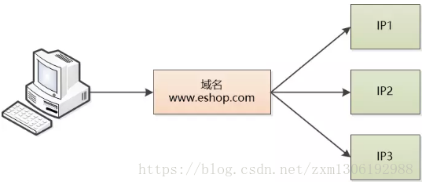
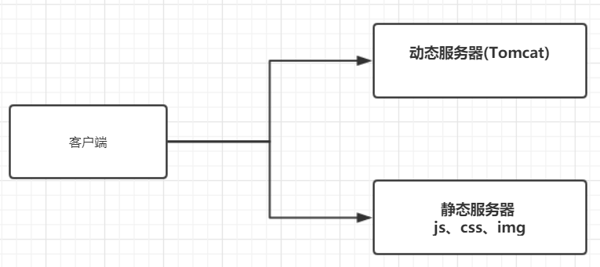
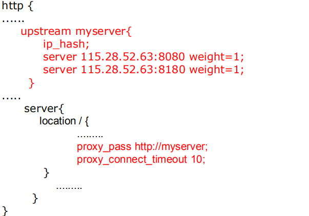
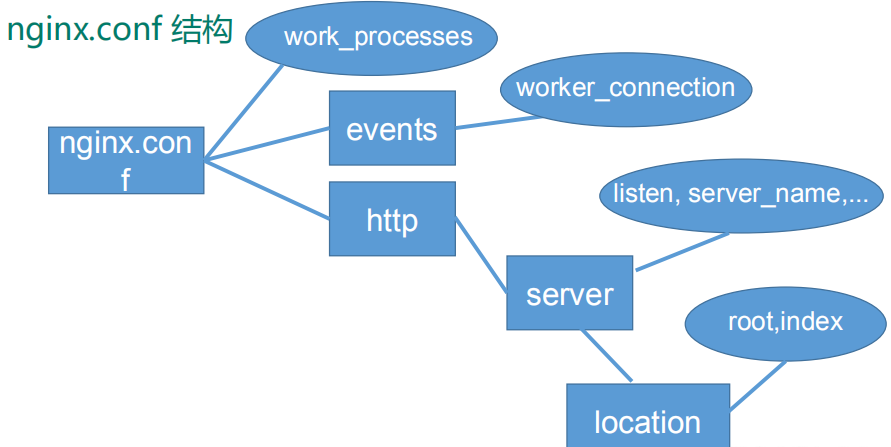
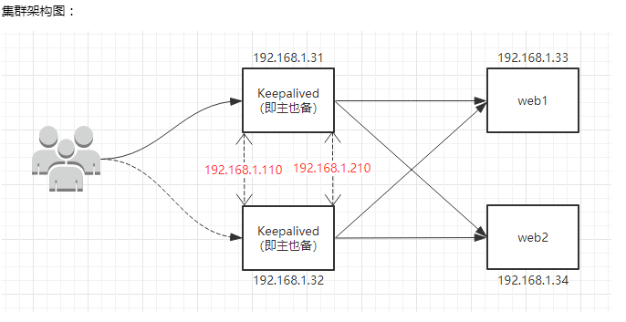

# Nginx

[TOC]

## 第一章 nginx基本概念

### 1.1 nginx介绍

#### 1.1.1 Nginx 概述

Nginx ("engine x") 是一个高性能的 HTTP 和反向代理服务器,特点是占有内存少，并发能力强，事实上 nginx 的并发能力确实在同类型的网页服务器中表现较好，中国大陆使用 nginx网站用户有：百度、京东、新浪、网易、腾讯、淘宝等

#### 1.1.2 Nginx 作为web服务器

Nginx 可以作为静态页面的 web 服务器，同时还支持 CGI 协议的动态语言，比如 perl、 php等。但是不支持 java。 Java 程序只能通过与 tomcat 配合完成。 Nginx 专为性能优化而开发，性能是其最重要的考量,实现上非常注重效率 ，能经受高负载的考验,有报告表明能支持高达 50,000 个并发连接数。

### 1.2 反向代理

#### 1.2.1 正向代理

Nginx 不仅可以做反向代理，实现负载均衡。还能用作正向代理来进行上网等功能。

正向代理：如果把局域网外的 Internet 想象成一个巨大的资源库，则局域网中的客户端要访问 Internet，则需要通过代理服务器来访问，这种代理服务就称为正向代理。

比如一个用户需要访问谷歌的相关网站查询资料，但是如果直接访问不了，则可以通过VPN作为代理，访问代理服务器，然后代理服务器代替用户去请求谷歌的资源，然后再放回给用户


正向代理的用途：

1. 访问原来无法访问的资源，如google
2. 可以做缓存，加速访问资源
3. 对客户端访问授权，上网进行认证
4. 代理可以记录用户访问记录（上网行为管理），对外隐藏用户信息

#### 1.2.2 反向代理

反向代理，其实客户端对代理是无感知的，因为客户端不需要任何配置就可以访问，我们只需要将请求发送到反向代理服务器，由反向代理服务器去选择目标服务器获取数据后，在返回给客户端，此时反向代理服务器和目标服务器对外就是一个服务器，暴露的是代理服务器地址，隐藏了真实服务器 IP 地址。


反向代理的作用：

1. 保证内网的安全，阻止web攻击，大型网站，通常将反向代理作为公网访问地址，Web服务器是内网
2. 负载均衡，通过反向代理服务器来优化网站的负载

从正向代理和反向代理的定义可以看出区别：**正向代理是在用户的客户端进行了代理，将请求转发到了其他服务器；而反向代理就是对于用户客户端是不知情的，代理发生在服务器端**

### 1.3 负载均衡

客户端发送多个请求到服务器，服务器处理请求，有一些可能要与数据库进行交互，服务器处理完毕后，再将结果返回给客户端。

这种架构模式对于早期的系统相对单一，并发请求相对较少的情况下是比较适合的，成本也低。但是随着信息数量的不断增长，访问量和数据量的飞速增长，以及系统业务的复杂度增加，这种架构会造成服务器相应客户端的请求日益缓慢，并发量特别大的时候，还容易造成服务器直接崩溃。很明显这是由于服务器性能的瓶颈造成的问题，那么如何解决这种情况呢？

首先想到的可能是升级服务器的配置，比如提高 CPU 执行频率，加大内存等提高机器的物理性能来解决此问题，但是我们知道摩尔定律的日益失效，硬件的性能提升已经不能满足日益提升的需求了。最明显的一个例子，天猫双十一当天，某个热销商品的瞬时访问量是极其庞大的，那么类似上面的系统架构，将机器都增加到现有的顶级物理配置，都是不能够满足需求的。那么怎么办呢？

上面的分析去掉了增加服务器物理配置来解决问题的办法，也就是说纵向解决问题的办法行不通了，那么横向增加服务器的数量呢？这时候集群的概念产生了，单个服务器解决不了，那么增加服务器的数量，然后将请求分发到各个服务器上，将原先请求集中到单个服务器上的情况改为将请求分发到多个服务器上，将负载分发到不同的服务器，也就是负载均衡


### 1.4 动静分离

为了加快网站的解析速度，可以把动态页面和静态页面由不同的服务器来解析，加快解析速度。降低原来单个服务器的压力。


动静分离架构模式的缺点：
比如：服务访问地址：`http://www.test.com`，静态资源存放地址：`http://static.test.com`

这样的话就会产生跨域的问题，因为域名地址不同。所以这个时候可以使用Nginx来解决跨越问题。

解决跨域问题：
当访问 `www.test.com/static`的时候 使用 nginx  拦截 转发到 `static.test.com`
当访问 `static.test.com` 的时候转发到真实的ip地址。

分布式Session的问题
产生原因：因为session是存储在服务器端的，当服务集群部署的话默认是被轮询访问的，这时候一台服务器存储的有session，另外一台服务器没有存储session就会产生分布式session的问题。
解决方案：

1. 使用Spring-session 框架
2. 使用 token 代替 session ，token 存储在redis中。
3. 让一个用户只在一个会话内访问同一个服务器


## 第二章 nginx使用

### 2.1 在Linux安装nginx

下载nginx

1. 直接去Nginx官网下载即可，地址为：<http://nginx.org/en/download.html>
2. 下载稳定版即可，比如：<http://nginx.org/download/nginx-1.18.0.tar.gz>
3. 使用xftp工具上传到`/opt`目录下
4. 在解压安装nginx之前需要安装其他组件：pcre,openssl,zlib

安装pcre

1. 下载pcre压缩包,命令：`wget http://downloads.sourceforge.net/project/pcre/pcre/8.37/pcre-8.37.tar.gz`
2. 使用`tar -xvf pcre-8.37.tar.gz`
3. 进入到解压后的文件夹内，执行`./configure`
4. 回到pcre目录下，并执行`make && make install`

安装openssl和zlib

1. 使用命令：`yum -y install make zlib zlib-devel gcc-c++ libtool openssl openssl-devel`

安装nginx

1. 解压缩 nginx-xx.tar.gz 包，命令`tar -xvf nginx-1.19.7.tar.gz`
2. 进入解压缩目录， 执行`./configure`
3. 执行命令：`make && make install`

进入目录`/usr/local/nginx/sbin/`目录，执行`./nginx`启动nginx服务器

可以通过命令`firewall-cmd --list-all`来查看当前防火墙对外开放的端口号

设置开放端口号：
`firewall-cmd --add-service=http --permanent`
`firewall-cmd --add-port=80/tcp --permanent`
`firewall-cmd --reload`

### 2.2 nginx常用命令

进入到nginx目录下
`cd /usr/local/nginx/sbin`

1. 启动命令
`./nginx -v`

2. 关闭命令
`./nginx -s stop`

3. 重新加载命令
`./nginx -s reload`

### 2.3 nginx配置文件

在目录下`/usr/local/nginx/conf`，找到配置文件`nginx.conf`,内容如下：

```properties
#user  nobody;
worker_processes  1;

#error_log  logs/error.log;
#error_log  logs/error.log  notice;
#error_log  logs/error.log  info;

#pid        logs/nginx.pid;


events {
    worker_connections  1024;
}


http {
    include       mime.types;
    default_type  application/octet-stream;

    #log_format  main  '$remote_addr - $remote_user [$time_local] "$request" '
    #                  '$status $body_bytes_sent "$http_referer" '
    #                  '"$http_user_agent" "$http_x_forwarded_for"';

    #access_log  logs/access.log  main;

    sendfile        on;
    #tcp_nopush     on;

    #keepalive_timeout  0;
    keepalive_timeout  65;

    #gzip  on;

    upstream myserver {
        server 192.168.79.130:8080;
        server 192.168.79.130:8081;
    }

    server {
        listen       80;
        server_name  192.168.79.130;

        #charset koi8-r;

        #access_log  logs/host.access.log  main;

        location / {
            proxy_pass http://myserver;
            root   html;
            index  index.html index.htm;
            #proxy_pass http://127.0.0.1:8080;
        }

    location /www/ {
            root /webdata/;
        index index.html index.htm;
    }
    location /images/ {
        root /webdata/;
        autoindex on;
        }

        #error_page  404              /404.html;

        # redirect server error pages to the static page /50x.html
        #
        error_page   500 502 503 504  /50x.html;
        location = /50x.html {
            root   html;
        }

        # proxy the PHP scripts to Apache listening on 127.0.0.1:80
        #
        #location ~ \.php$ {
        #    proxy_pass   http://127.0.0.1;
        #}

        # pass the PHP scripts to FastCGI server listening on 127.0.0.1:9000
        #
        #location ~ \.php$ {
        #    root           html;
        #    fastcgi_pass   127.0.0.1:9000;
        #    fastcgi_index  index.php;
        #    fastcgi_param  SCRIPT_FILENAME  /scripts$fastcgi_script_name;
        #    include        fastcgi_params;
        #}

        # deny access to .htaccess files, if Apache's document root
        # concurs with nginx's one
        #
        #location ~ /\.ht {
        #    deny  all;
        #}
    }


    # another virtual host using mix of IP-, name-, and port-based configuration
    #
    server {
        listen       9001;
        server_name  192.168.79.130;

        location ~ /pro1/ {
            proxy_pass http://127.0.0.1:8080;
        }
        location ~ /pro2/ {
            proxy_pass http://127.0.0.1:8081;
        }
    }


    # HTTPS server
    #
    #server {
    #    listen       443 ssl;
    #    server_name  localhost;

    #    ssl_certificate      cert.pem;
    #    ssl_certificate_key  cert.key;

    #    ssl_session_cache    shared:SSL:1m;
    #    ssl_session_timeout  5m;

    #    ssl_ciphers  HIGH:!aNULL:!MD5;
    #    ssl_prefer_server_ciphers  on;

    #    location / {
    #        root   html;
    #        index  index.html index.htm;
    #    }
    #}

}
```

> 上面有些配置是涉及到反向代理和负载均衡，以及动静分离的，这是个完整的配置文件

配置文件中的内容,包含三部分内容

1. 全局块：配置服务器整体运行的配置指令
   比如 worker_processes 1;处理并发数的配置
   从配置文件开始到 events 块之间的内容，主要会设置一些影响 nginx 服务器整体运行的配置指令，主要包括配置运行 Nginx 服务器的用户（组）、允许生成的 worker process 数， 进程 PID 存放路径、日志存放路径和类型以及配置文件的引入等。
   比如上面第一行配置这是 Nginx 服务器并发处理服务的关键配置， worker_processes 值越大，可以支持的并发处理量也越多，但是会受到硬件、软件等设备的制约

2. events 块：影响 Nginx 服务器与用户的网络连接
   比如 worker_connections 1024; 支持的最大连接数为 1024
   events 块涉及的指令主要影响 Nginx 服务器与用户的网络连接，常用的设置包括是否开启对多 work_process下的网络连接进行序列化，是否允许同时接收多个网络连接，选取哪种事件驱动模型来处理连接请求，每个 word_process 可以同时支持的最大连接数等。
  上述例子就表示每个 work_process 支持的最大连接数为 1024.
  这部分的配置对 Nginx 的性能影响较大，在实际中应该灵活配置。

3. http 块
  还包含两部分：
  http 全局块
  server 块
  这算是 Nginx 服务器配置中最频繁的部分，代理、缓存和日志定义等绝大多数功能和第三方模块的配置都在这里。
  需要注意的是： http 块也可以包括 http 全局块、 server 块。

http 全局块：

* http 全局块配置的指令包括文件引入、 MIME-TYPE 定义、日志自定义、连接超时时间、单链接请求数上限等。

server 块

* 这块和虚拟主机有密切关系，虚拟主机从用户角度看，和一台独立的硬件主机是完全一样的，该技术的产生是为了节省互联网服务器硬件成本。
* 每个 http 块可以包括多个 server 块，而每个 server 块就相当于一个虚拟主机。
* 而每个 server 块也分为全局 server 块，以及可以同时包含多个 locaton 块。

1. 全局 server 块
最常见的配置是本虚拟机主机的监听配置和本虚拟主机的名称或 IP 配置。
2. location 块
一个 server 块可以配置多个 location 块。
这块的主要作用是基于 Nginx 服务器接收到的请求字符串（例如 server_name/uri-string），对虚拟主机名称（也可以是 IP 别名）之外的字符串（例如 前面的 /uri-string）进行匹配,对特定的请求进行处理。地址定向、数据缓存和应答控制等功能，还有许多第三方模块的配置也在这里进行。

## 第三章 nginx配置实例：反向代理

### 3.1 反向代理示例1

目标：
打开浏览器，在地址栏上输入`www.123.com`，跳转到Linux系统tomcat服务器主页

步骤：

1. 安装jdk，和tomcat,并启动tomcat（步骤细节可查看Linux教程）
2. 打开tomcat默认的端口8080在防火墙中的设置
   `firewall-cmd --add-port=8080/tcp --permanent`
   `firewall-cmd –reload`
3. 在浏览器上输入Linux系统ip地址`192.168.79.130`，进行访问tomcat服务器
4. 在母机/主机上修改hosts文件的域名和ip对应关系
   文件地址：`C:\Windows\System32\drivers\etc\hosts`
   应该将该hosts文件名进行修改为其他文件名,然后在该目录下新建一个文件，名为`hosts`,在该新文件里进行设置：
   `192.168.79.130     www.123.com`

5. 在nginx配置文件中修改配置文件，将监听80端口的server块，内容修改如下：

   ```properties
   server {
       listen       80;
       server_name  192.168.79.130;

       #charset koi8-r;

       #access_log  logs/host.access.log  main;

       location / {
           proxy_pass http://127.0.0.1:8080;
           root   html;
           index  index.html index.htm;
       }
   }
   ```

6. 在页面上输入：`http://www.123.com`

### 3.2 反向代理示例2

在一个Linux系统中，启动两个tomcat服务器，一个服务器的开启端口是8080，关闭端口是8005；另一个服务器的开启端口是8081，关闭端口是8015

使用nginx反向代理，根据房屋的路径跳转到不同的端口服务中，nginx监听端口为9001,即要达到的效果是：
访问：`http://192.168.79.130:9001/pro1/hello.html` 直接跳转到Linux系统的`127.0.0.1:8080/pro1/hello.html`
访问：`http://192.168.79.130:9001/pro2/hi.html` 直接跳转到Linux系统的`127.0.0.1:8081/pro2/hi.html`

具体配置：
找到nginx配置文件，在http块中添加一个server块，内容如下：

```properties
server {
    listen       9001;
    server_name  192.168.79.130;

    location ~ /pro1/ {
        proxy_pass http://127.0.0.1:8080;
    }
    location ~ /pro2/ {
        proxy_pass http://127.0.0.1:8081;
    }
}
```

修改配置文件并保存后，重启nginx服务器，即可

location 指令说明

* 作用：该指令用于匹配 URL。
* 语法如下：

  1. `=`：用于不含正则表达式的 uri 前，要求请求字符串与 uri 严格匹配，如果匹配成功，就停止继续向下搜索并立即处理该请求。
  2. `~`：用于表示 uri 包含正则表达式，并且区分大小写。
  3. `~*`：用于表示 uri 包含正则表达式，并且不区分大小写。
  4. `^~`：用于不含正则表达式的 uri 前，要求 Nginx 服务器找到标识 uri 和请求字符串匹配度最高的 location 后，立即使用此 location 处理请求，而不再使用 location块中的正则 uri 和请求字符串做匹配。
* 注意：如果 uri 包含正则表达式，则必须要有 `~` 或者 `~*` 标识。

## 第四章 nginx配置实例：负载均衡

负载均衡就是将请求分发到该Linux系统上的多个Tomcat服务器上去处理，比如：
地址栏输入`http://192.168.79.130/pro/index.html` ,这个pro项目在该Linux系统上的两个tomcat服务器上都有部署，只不过8080端口的tomcat服务器，该页面显示数字8080，而8081端口的tomcat服务器，该页面显示数字8081。这样一来，当在地址栏输入`http://192.168.79.130/pro/index.html`,页面上可能显示8080，也可能显示8081

具体配置如下，也是修改http块中的server块(监听80端口的)

```properties
upstream myserver {
    server 192.168.79.130:8080;
    server 192.168.79.130:8081;
}
server {
    listen       80;
    server_name  192.168.79.130;

    #charset koi8-r;

    #access_log  logs/host.access.log  main;

    location / {
        proxy_pass http://myserver;
        root   html;
        index  index.html index.htm;
        #proxy_pass http://127.0.0.1:8080;
    }
}
```

配置说明：


随着互联网信息的爆炸性增长，负载均衡（load balance）已经不再是一个很陌生的话题，顾名思义，负载均衡即是将负载分摊到不同的服务单元，既保证服务的可用性，又保证响应足够快，给用户很好的体验。快速增长的访问量和数据流量催生了各式各样的负载均衡产品，很多专业的负载均衡硬件提供了很好的功能，但却价格不菲，这使得负载均衡软件大受欢迎，nginx 就是其中的一个，在 linux 下有 Nginx、 LVS、 Haproxy 等等服务可以提供负载均衡服务，而且 Nginx 提供了几种分配方式(策略)：

1. 轮询（默认）
每个请求按时间顺序逐一分配到不同的后端服务器，如果后端服务器 down 掉，能自动剔除。
2. weight
weight 代表权,重默认为 1,权重越高被分配的客户端越多
指定轮询几率， weight 和访问比率成正比，用于后端服务器性能不均的情况。 例如：

   ```properties
   upstream server_pool{
       server 192.168.5.21 weight=10;
       server 192.168.5.22 weight=10;
   }
   ```

3. ip_hash
每个请求按访问 ip 的 hash 结果分配，这样每个访客固定访问一个后端服务器，可以解决 session 的问题。 例如：

   ```properties
   upstream server_pool{
       ip_hash;
       server 192.168.5.21:80;
       server 192.168.5.22:80;
   }
   ```

4. fair（第三方）
按后端服务器的响应时间来分配请求，响应时间短的优先分配。

   ```properties
       upstream server_pool{
       server 192.168.5.21:80;
       server 192.168.5.22:80;
       fair;
   }
   ```

## 第五章 nginx配置实例：动静分离

Nginx 动静分离简单来说就是把动态跟静态请求分开，不能理解成只是单纯的把动态页面和静态页面物理分离。严格意义上说应该是动态请求跟静态请求分开，可以理解成使用 Nginx处理静态页面， Tomcat 处理动态页面。动静分离从目前实现角度来讲大致分为两种：

1. 一种是纯粹把静态文件独立成单独的域名，放在独立的服务器上，也是目前主流推崇的方案；
2. 另外一种方法就是动态跟静态文件混合在一起发布，通过 nginx 来分开。

通过 location 指定不同的后缀名实现不同的请求转发。通过 expires 参数设置，可以使浏览器缓存过期时间，减少与服务器之前的请求和流量。具体 Expires 定义：是给一个资源设定一个过期时间，也就是说无需去服务端验证，直接通过浏览器自身确认是否过期即可，所以不会产生额外的流量。此种方法非常适合不经常变动的资源。（如果经常更新的文件，不建议使用 Expires 来缓存），我这里设置 3d，表示在这 3 天之内访问这个 URL，发送一个请求，比对服务器该文件最后更新时间没有变化，则不会从服务器抓取，返回状态码304，如果有修改，则直接从服务器重新下载，返回状态码 200

nginx配置实现动静分离：

1. 在http块中修改监听80端口的server块

```properties
server {
    listen       80;
    server_name  192.168.79.130;

    location / {
        proxy_pass http://myserver;
        root   html;
        index  index.html index.htm;
    }

    location /www/ {
        root /webdata/;
        index index.html index.htm;
    }
    location /images/ {
        root /webdata/;
        autoindex on;
    }
}
```

上面修改的意思：
当浏览器地址栏输入`http://192.168.79.30/www/a.html`，则nginx会去响应Linux文件资源`/webdata/www/a.html`给该资源请求
同样的，`http://192.168.79.30/images/lyf.jpg`，则nginx会去响应Linux文件资源`/webdata/images/lyf.jpg`给该资源请求


## 第六章 nginx配置高可用集群

高可用，即不只是在使用一个Linux系统，而是多个Linux系统组成集群来搭建一个服务

Nginx配置高可用步骤：

1. 需要两台nginx服务器，即两个Linux系统，且都安装了Nginx（虚拟机直接克隆一份Linux系统即可，但是注意修改克隆后的系统的主机ip地址）

2. 两台服务器都需要安装keepalived。用来监听一个主机是否可用
3. 需要虚拟ip,作用就是客户端是使用这个虚拟ip来访问服务的，然后keepalived会根据是否可用来转发到Linux系统

4. 安装keepalived
   `yum install keepalived -y`
   安装成功之后，在etc目录下会生成一个目录keepalived,里面有个配置文件keepalived.conf

5. 修改配置文件/etc/keepalived/keepalived.conf

   ```properties
   global_defs {
       notification_email {
           acassen@firewall.loc
           failover@firewall.loc
           sysadmin@firewall.loc
       }
       notification_email_from Alexandre.Cassen@firewall.loc
       smtp_server 192.168.79.130  # 根据当前主机地址来设置
       smtp_connect_timeout 30
       router_id LVS_DEVEL
   }
   vrrp_script chk_http_port {
       script "/root/nginx_check.sh"
       interval 2 #（检测脚本执行的间隔）
       weight 2
   }
   vrrp_instance VI_1 {
       state MASTER # 备份服务器上将 MASTER 改为 BACKUP
       interface ens33 //网卡
       virtual_router_id 51 # 主、备机的 virtual_router_id 必须相同
       priority 100 # 主、备机取不同的优先级，主机值较大，备份机值较小
       advert_int 1
       authentication {
       auth_type PASS
       auth_pass 1111
       }
       virtual_ipaddress {
       192.168.79.50 // VRRP H 虚拟地址
       }
   }
   ```

6. 编写脚本文件/root/nginx_check.sh

   ```shell
   #!/bin/bash
   A=`ps -C nginx – no-header |wc -l`
   if [ $A -eq 0 ];then
       /usr/local/nginx/sbin/nginx
       sleep 2
       if [ `ps -C nginx --no-header |wc -l` -eq 0 ];then
           killall keepalived
       fi
   fi
   ```

7. 设置成功后，将tomcat启动，nginx启动，keepalived启动
   启动keepalived：`systemctl start keepalived.service`

8. 在浏览器上输入`192.168.79.50`可以看到tomcat服务器页面
9. 通过在主Linux服务器上输入命令`ip a`可以看到ens33网卡多了一个ip

## 第七章 nginx原理


**master-workers 的机制的好处**
首先，对于每个 worker 进程来说，独立的进程，不需要加锁，所以省掉了锁带来的开销，同时在编程以及问题查找时，也会方便很多。其次，采用独立的进程，可以让互相之间不会影响，一个进程退出后，其它进程还在工作，服务不会中断， master 进程则很快启动新的worker 进程。当然， worker 进程的异常退出，肯定是程序有 bug 了，异常退出，会导致当前 worker 上的所有请求失败，不过不会影响到所有请求，所以降低了风险

一个 master 和多个 woker 有好处

1. 可以使用 nginx –s reload 热部署，利用 nginx 进行热部署操作
2. 每个 woker 是独立的进程，如果有其中的一个 woker 出现问题，其他 woker 独立的，继续进行争抢，实现请求过程，不会造成服务中断

**需要设置多少个 worker**
Nginx 同 redis 类似都采用了 io 多路复用机制，每个 worker 都是一个独立的进程，但每个进程里只有一个主线程，通过异步非阻塞的方式来处理请求， 即使是千上万个请求也不在话下。每个 worker 的线程可以把一个 cpu 的性能发挥到极致。所以 worker 数和服务器的 cpu数相等是最为适宜的。设少了会浪费 cpu，设多了会造成 cpu 频繁切换上下文带来的损耗。

```text
#设置 worker 数量。
worker_processes 4
#work 绑定 cpu(4 work 绑定 4cpu)。
worker_cpu_affinity 0001 0010 0100 1000
#work 绑定 cpu (4 work 绑定 8cpu 中的 4 个) 。
worker_cpu_affinity 0000001 00000010 00000100 00001000
```

**连接数 worker_connection**
这个值是表示每个 worker 进程所能建立连接的最大值，所以，一个 nginx 能建立的最大连接数，应该是 worker_connections * worker_processes。当然，这里说的是最大连接数，对于HTTP 请 求 本 地 资 源 来 说 ， 能 够 支 持 的 最 大 并 发 数 量 是 worker_connections * worker_processes，如果是支持 http1.1 的浏览器每次访问要占两个连接，所以普通的静态访问最大并发数是： worker_connections * worker_processes /2，而如果是 HTTP 作 为反向代理来说，最大并发数量应该是 worker_connections * worker_processes/4。因为作为反向代理服务器，每个并发会建立与客户端的连接和与后端服务的连接，会占用两个连接。


设置多少个 woker 合适

* worker 数和服务器的 cpu 数相等是最为适宜的

连接数 worker_connection

* 第一个：发送请求，占用了 woker 的几个连接数？
  答案： 2 或者 4 个(静态资源，则是两个；动态资源，则是4个。静态资源，浏览器请求与worker,worker与静态资源服务器；动态资源，需要转发请求到tomcat发动态请求+静态请求页面)
* 第二个： nginx 有一个 master，有四个 woker，每个 woker 支持最大的连接数 1024，支持的最大并发数是多少？
  * 普通的静态访问最大并发数是： worker_connections * worker_processes /2，
  * 而如果是 HTTP 作 为反向代理来说，最大并发数量应该是 worker_connections *worker_processes/4。

## 第八章

### 8.1 keepalived+nginx 高可用集群(主从模式)

上面的示例即是主从模式

### 8.2 Keepalived+Nginx 高可用集群（双主模式）



在一个服务器192.168.1.31的keepalived.conf配置中这样修改：

```properties
vrrp_instance VI_1 {
    state MASTER
    interface ens33
    virtual_router_id 51
    priority 150
    advert_int 1
    authentication {
        auth_type PASS
        auth_pass 1111
    }
    virtual_ipaddress {
    192.168.1.110/24 dev ens33 label ens33:1
}
}
vrrp_instance VI_2 {
    state BACKUP
    interface ens33
    virtual_router_id 52
    priority 100
    advert_int 1
    authentication {
        auth_type PASS
        auth_pass 2222
    }
    virtual_ipaddress {
    192.168.1.210/24 dev ens33 label ens33:2
    }
}
```

在一个服务器192.168.1.32的keepalived.conf配置中这样修改：

```properties
vrrp_instance VI_1 {
    state BACKUP
    interface ens33
    virtual_router_id 51
    priority 150
    advert_int 1
    authentication {
        auth_type PASS
        auth_pass 1111
    }
    virtual_ipaddress {
    192.168.1.110/24 dev ens33 label ens33:1
}
}
vrrp_instance VI_2 {
    state MASTER
    interface ens33
    virtual_router_id 52
    priority 100
    advert_int 1
    authentication {
        auth_type PASS
        auth_pass 2222
    }
    virtual_ipaddress {
    192.168.1.210/24 dev ens33 label ens33:2
    }
}
```