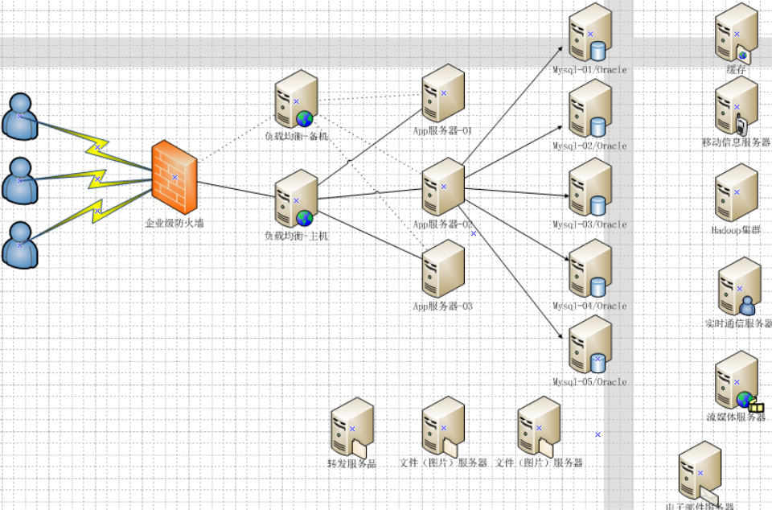
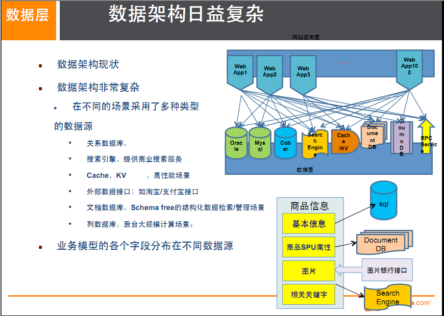
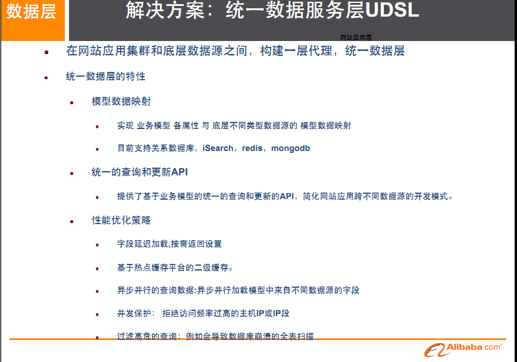
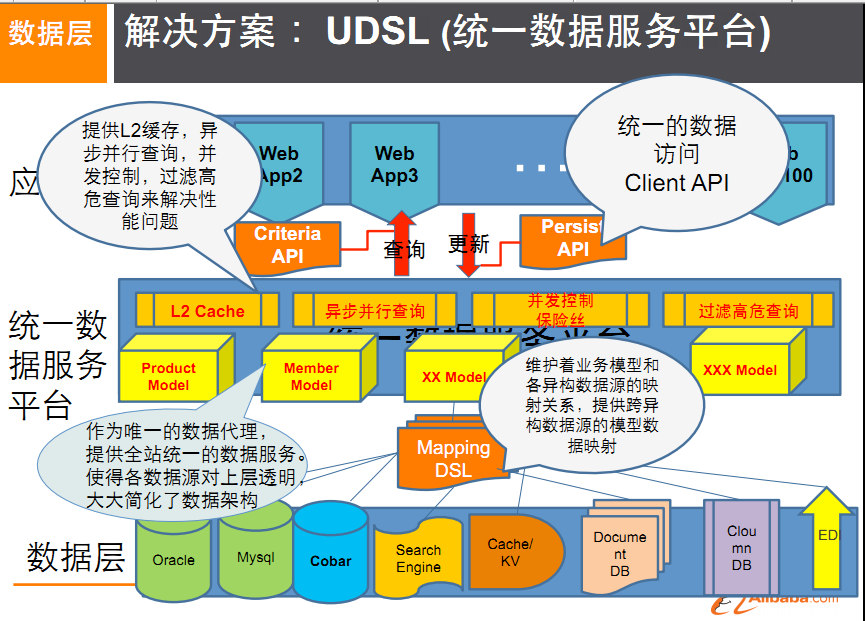
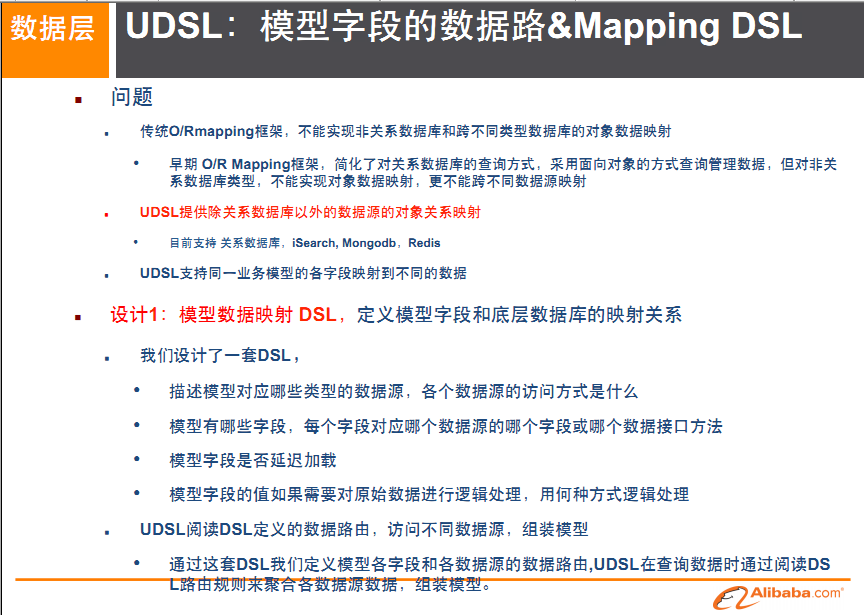
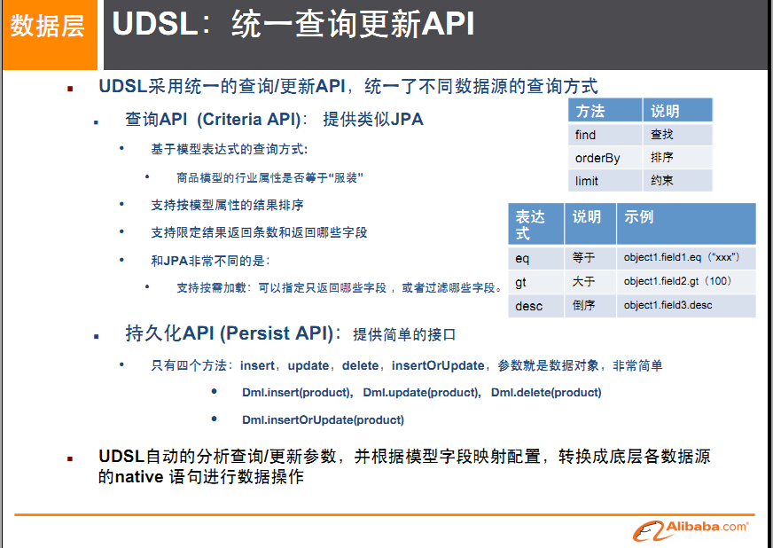
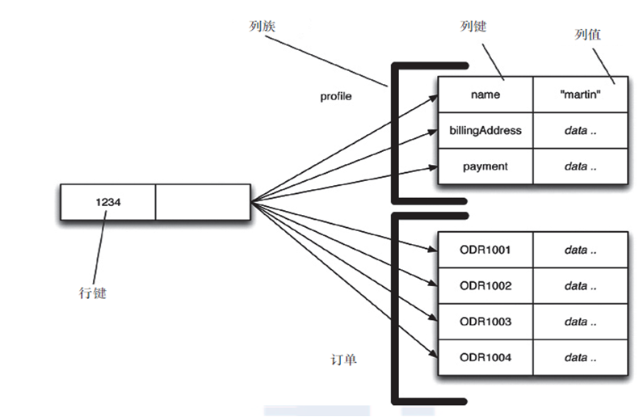
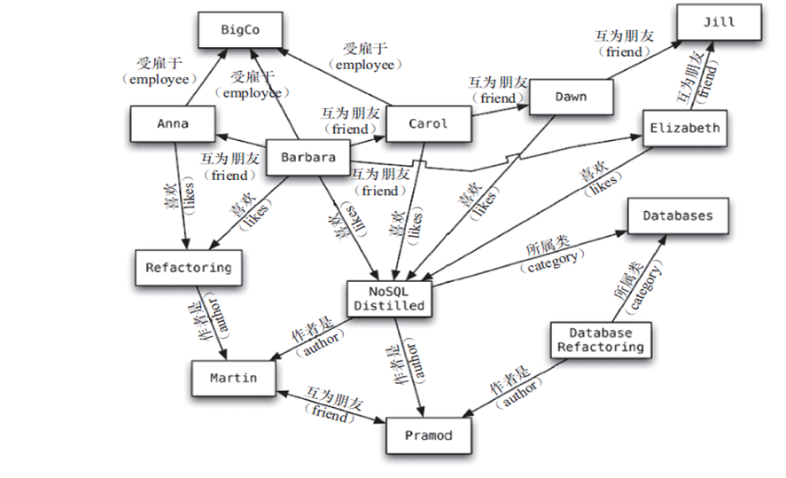
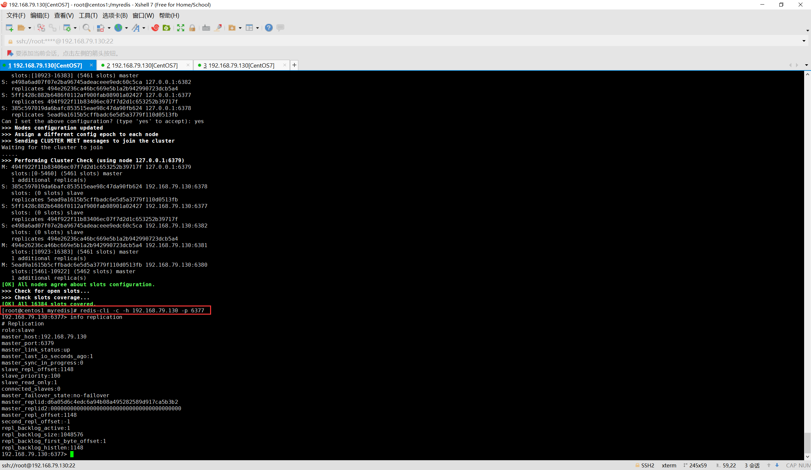
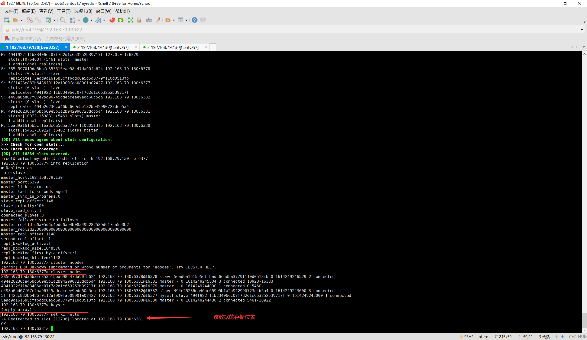

# Redis基础

[TOC]

## 第一章 NoSql入门和概述

### 1.1 入门概述

#### 1.1.1 为什么要使用NoSql

##### 单机MySQL的美好年代

在90年代，一个网站的访问量一般都不大，用单个数据库完全可以轻松应付。在那个时候，更多的都是静态网页，动态交互类型的网站不多。


上述架构下，我们来看看数据存储的瓶颈是什么？

1. 数据量的总大小 一个机器放不下时
2. 数据的索引（B+ Tree）一个机器的内存放不下时
3. 访问量(读写混合)一个实例不能承受

如果满足了上述1 or 3个，就需要更新系统设计

##### Memcached(缓存)+MySQL+垂直拆分

后来，随着访问量的上升，几乎大部分使用MySQL架构的网站在数据库上都开始出现了性能问题，web程序不再仅仅专注在功能上，同时也在追求性能。程序员们开始大量的使用缓存技术来缓解数据库的压力，优化数据库的结构和索引。开始比较流行的是通过文件缓存来缓解数据库压力，但是当访问量继续增大的时候，多台web机器通过文件缓存不能共享，大量的小文件缓存也带了了比较高的IO压力。在这个时候，Memcached就自然的成为一个非常时尚的技术产品。


Memcached作为一个独立的分布式的缓存服务器，为多个web服务器提供了一个共享的高性能缓存服务，在Memcached服务器上，又发展了根据hash算法来进行多台Memcached缓存服务的扩展，然后又出现了一致性hash来解决增加或减少缓存服务器导致重新hash带来的大量缓存失效的弊端

##### MySql主从读写分离

由于数据库的写入压力增加，Memcached只能缓解数据库的读取压力。读写集中在一个数据库上让数据库不堪重负，大部分网站开始使用主从复制技术来达到读写分离，以提高读写性能和读库的可扩展性。Mysql的master-slave模式成为这个时候的网站标配了。


##### 分表分库+水平拆分+mysql集群

在Memcached的高速缓存，MySQL的主从复制，读写分离的基础之上，这时MySQL主库的写压力开始出现瓶颈，而数据量的持续猛增，由于MyISAM使用表锁，在高并发下会出现严重的锁问题，大量的高并发MySQL应用开始使用InnoDB引擎代替MyISAM。


同时，开始流行使用分表分库来缓解写压力和数据增长的扩展问题。这个时候，分表分库成了一个热门技术，是面试的热门问题也是业界讨论的热门技术问题。也就在这个时候，MySQL推出了还不太稳定的表分区，这也给技术实力一般的公司带来了希望。虽然MySQL推出了MySQL Cluster集群，但性能也不能很好满足互联网的要求，只是在高可靠性上提供了非常大的保证。

##### MySQL的扩展性瓶颈

MySQL数据库也经常存储一些大文本字段，导致数据库表非常的大，在做数据库恢复的时候就导致非常的慢，不容易快速恢复数据库。比如1000万4KB大小的文本就接近40GB的大小，如果能把这些数据从MySQL省去，MySQL将变得非常的小。关系数据库很强大，但是它并不能很好的应付所有的应用场景。MySQL的扩展性差（需要复杂的技术来实现），大数据下IO压力大，表结构更改困难，正是当前使用MySQL的开发人员面临的问题。

##### 目前的设计



#### 1.1.2 NoSQL的定义

NoSQL(NoSQL = Not Only SQL)，意即“不仅仅是SQL”，泛指非关系型的数据库。随着互联网web2.0网站的兴起，传统的关系数据库在应付web2.0网站，特别是超大规模和高并发的SNS类型的web2.0纯动态网站已经显得力不从心，暴露了很多难以克服的问题，而非关系型的数据库则由于其本身的特点得到了非常迅速的发展。NoSQL数据库的产生就是为了解决大规模数据集合多重数据种类带来的挑战，尤其是大数据应用难题，包括超大规模数据的存储。
例如谷歌或Facebook每天为他们的用户收集万亿比特的数据。这些类型的数据存储不需要固定的模式，无需多余操作就可以横向扩展。

#### 1.1.3 NoSQL的作用

##### 易扩展

NoSQL数据库种类繁多，但是一个共同的特点都是去掉关系数据库的关系型特性。数据之间无关系，这样就非常容易扩展。也无形之间，在架构的层面上带来了可扩展的能力。

##### 大数据量高性能

NoSQL数据库都具有非常高的读写性能，尤其在大数据量下，同样表现优秀。这得益于它的无关系性，数据库的结构简单。
一般MySQL使用Query Cache，每次表的更新Cache就失效，是一种大粒度的Cache，在针对web2.0的交互频繁的应用，Cache性能不高。而NoSQL的Cache是记录级的，是一种细粒度的Cache，所以NoSQL在这个层面上来说就要性能高很多了

##### 多样灵活的数据模型

NoSQL无需事先为要存储的数据建立字段，随时可以存储自定义的数据格式。而在关系数据库里，增删字段是一件非常麻烦的事情。如果是非常大数据量的表，增加字段简直就是一个噩梦

##### 传统RDBMS VS NOSQL

RDBMS vs NoSQL

RDBMS

* 高度组织化结构化数据
* 结构化查询语言（SQL）
* 数据和关系都存储在单独的表中。
* 数据操纵语言，数据定义语言
* 严格的一致性
* 基础事务

NoSQL

* 代表着不仅仅是SQL
* 没有声明性查询语言
* 没有预定义的模式
* 键 - 值对存储，列存储，文档存储，图形数据库
* 最终一致性，而非ACID属性
* 非结构化和不可预知的数据
* CAP定理
* 高性能，高可用性和可伸缩性

#### 1.1.3 NoSQL典型数据库

##### Redis

##### Memcache

##### Mongdb

### 1.2 3V+3高

#### 1.2.1 大数据时代的3V

##### 海量Volume

##### 多样Variety

##### 实时Veloctiy

#### 1.2.2 互联网需求的3高

##### 高并发

##### 高可扩

##### 高性能

### 1.3 NoSQL经典应用

#### 1.3.1 sql和nosql结合

#### 1.3.2 阿里巴巴商品信息存储

##### 架构发展历程


##### 多数据源多数据类型存储



##### 阿里去IOE化

2008年，王坚加盟阿里巴巴成为集团首席架构师，即现在的首席技术官。这位前微软亚洲研究院常务副院长被马云定位为：将帮助阿里巴巴集团建立世界级的技术团队，并负责集团技术架构以及基础技术平台搭建。
在加入阿里后，带着技术基因和学者风范的王坚就在阿里巴巴集团提出了被称为“去IOE”（在IT建设过程中，去除IBM小型机、Oracle数据库及EMC存储设备）的想法，并开始把云计算的本质，植入阿里IT基因。
王坚这样概括“去IOE”运动和阿里云之间的关系：“去IOE”彻底改变了阿里集团IT架构的基础，是阿里拥抱云计算，产出计算服务的基础。**“去IOE”的本质是分布化**，让随处可以买到的Commodity PC架构成为可能，使云计算能够落地的首要条件。
> 淘宝内部使用的Mysql是经过自己改造过的

##### 具体信息的存储

多文字信息描述类，IO读写性能变差，文档数据库MongDB可以解决

而商品的图片，存储在分布式的文件系统中，比如：
淘宝自己的TFS,Google的GFS,Hadoop的HDFS

商品的关键字搜索，ISearch

商品的波段性的热点高频信息，使用内存数据库来保存：Tair,Redis,Memcache

##### 大型互联网应用的难点&方案

难点：

1. 数据类型多样性
2. 数据源多样性和变化重构
3. 数据源改造而数据服务平台不需要大面积重构

解决：

1. 阿里的UDSL


2. UDSL解决方案
   
3. 映射
   
4. API
    
5. 热点缓存
    

### 1.4 NoSQL数据库模型简介

#### 1.4.1 关系型数据库与非关系型数据库

传统关系型数据库

* 关系型数据库是将多组相同意义（即实体）的数据放在同一个数据库表中，每一行数据表示一个记录，关系型数据库可以抽象出实体-属性关系，衍生出1-1，1-N，N-N的关系映射，以及主外键等概念

NoSQL数据库

* BSON 是一种类json的一种二进制形式的存储格式，简称Binary JSON，
它和JSON一样，支持内嵌的文档对象和数组对象

  ```json
  {
   "customer":{
     "id":1136,
     "name":"Z3",
     "billingAddress":[{"city":"beijing"}],
     "orders":[
      {
        "id":17,
        "customerId":1136,
        "orderItems":[{"productId":27,"price":77.5,"productName":"thinking in java"}],
        "shippingAddress":[{"city":"beijing"}]
        "orderPayment":[{"ccinfo":"111-222-333","txnid":"asdfadcd334","billingAddress":{"city":"beijing"}}],
        }
      ]
    }
  }
  ```

为什么可以使用聚合模型来处理，因为高并发的操作是不太建议有关联查询的，互联网公司用冗余数据来避免关联查询。分布式事务是支持不了太多的并发的

#### 1.4.2 聚合模型

##### KV键值

##### Bson

##### 列族

顾名思义，是按列存储数据的。最大的特点是方便存储结构化和半结构化数据，方便做数据压缩，对针对某一列或者某几列的查询有非常大的IO优势。


##### 图形



### 1.5 NoSQL数据库的四大分类

#### 1.5.1 KV键值

新浪：BerkeleyDB+redis
美团：redis+tair
阿里、百度：memcache+redis

#### 1.5.2 文档型数据库

文档型数据库以bson格式比较多，如CouchDB,MongoDB

MongoDB 是一个基于分布式文件存储的数据库。由 C++ 语言编写。旨在为 WEB 应用提供可扩展的高性能数据存储解决方案。

MongoDB 是一个介于关系数据库和非关系数据库之间的产品，是非关系数据库当中功能最丰富，最像关系数据库的。

#### 1.5.3 列存储数据库

Cassandra,HBase
分布式文件系统

#### 1.5.4 图关系数据库

它不是放图片的数据库，而是表示数据之间的关系，是像数据结构中的图结构一样，比如社交网络平台中研究用户之间的联系

Neo4J,InfoGrid

### 1.6 分布式数据库的CAP原理+BASE

#### 1.6.1 传统的ACID

A (Atomicity) 原子性
C (Consistency) 一致性
I (Isolation) 独立性
D (Durability) 持久性

#### 1.6.2 CAP

C:Consistency（强一致性）
A:Availability（可用性）
P:Partition tolerance（分区容错性）

#### 1.6.3 CAP的3进2

CAP理论就是说在分布式存储系统中，最多只能实现上面的两点。
而由于当前的网络硬件肯定会出现延迟丢包等问题，所以分区容忍性是我们必须需要实现的。

所以我们只能在一致性和可用性之间进行权衡，没有NoSQL系统能同时保证这三点。

* C：强一致性
* A：高可用性
* **P：分布式容忍性**

CA：传统Oracle数据库
**AP：大多数网站架构的选择**
CP：Redis、Mongodb

注意：分布式架构的时候必须做出取舍。
一致性和可用性之间取一个平衡。多余大多数web应用，其实并不需要强一致性。
因此牺牲C换取P，这是目前分布式数据库产品的方向一致性与可用性的决择

对于web2.0网站来说，关系数据库的很多主要特性却往往无用武之地

数据库事务一致性需求
　　很多web实时系统并不要求严格的数据库事务，对读一致性的要求很低，有些场合对写一致性要求并不高。允许实现最终一致性。

数据库的写实时性和读实时性需求
　　对关系数据库来说，插入一条数据之后立刻查询，是肯定可以读出来这条数据的，但是对于很多web应用来说，并不要求这么高的实时性，比方说发一条消息之 后，过几秒乃至十几秒之后，我的订阅者才看到这条动态是完全可以接受的。

对复杂的SQL查询，特别是多表关联查询的需求
　　任何大数据量的web系统，都非常忌讳多个大表的关联查询，以及复杂的数据分析类型的报表查询，特别是SNS类型的网站，从需求以及产品设计角 度，就避免了这种情况的产生。往往更多的只是单表的主键查询，以及单表的简单条件分页查询，SQL的功能被极大的弱化了。

#### 1.6.4 经典CAP图

CAP理论的核心是：一个分布式系统不可能同时很好的满足一致性，可用性和分区容错性这三个需求，

**最多只能同时较好的满足两个**。

因此，根据 CAP 原理将 NoSQL 数据库分成了满足 CA 原则、满足 CP 原则和满足 AP 原则三 大类：

* CA - 单点集群，满足一致性，可用性的系统，通常在可扩展性上不太强大。
* CP - 满足一致性，分区容忍必的系统，通常性能不是特别高。
* AP - 满足可用性，分区容忍性的系统，通常可能对一致性要求低一些。


#### 1.6.5 BASE

BASE就是为了解决关系数据库强一致性引起的问题而引起的可用性降低而提出的解决方案。

BASE其实是下面三个术语的缩写：

* 基本可用（Basically Available）
* 软状态（Soft state）
* 最终一致（Eventually consistent）

它的思想是通过让系统放松对某一时刻数据一致性的要求来换取系统整体伸缩性和性能上改观。为什么这么说呢，缘由就在于大型系统往往由于地域分布和极高性能的要求，不可能采用分布式事务来完成这些指标，要想获得这些指标，我们必须采用另外一种方式来完成，这里BASE就是解决这个问题的办法

#### 1.6.6 分布式+集群简介

分布式系统（distributed system）
由多台计算机和通信的软件组件通过计算机网络连接（本地网络或广域网）组成。分布式系统是建立在网络之上的软件系统。正是因为软件的特性，所以分布式系统具有高度的内聚性和透明性。因此，网络和分布式系统之间的区别更多的在于高层软件（特别是操作系统），而不是硬件。分布式系统可以应用在在不同的平台上如：PC、工作站、局域网和广域网上等。

简单来讲：

1. 分布式：不同的多台服务器上面部署**不同**的服务模块（工程），他们之间通过Rpc/Rmi之间通信和调用，对外提供服务和组内协作。

2. 集群：不同的多台服务器上面部署**相同**的服务模块，通过分布式调度软件进行统一的调度，对外提供服务和访问。

## 第二章 Redis入门介绍

### 2.1 Redis入门概述

Redis:REmote DIctionary Server(远程字典服务器)，是完全开源免费的，用C语言编写的，遵守BSD协议，是一个高性能的(key/value)分布式内存数据库，基于内存运行并支持持久化的NoSQL数据库，是当前最热门的NoSql数据库之一,也被人们称为数据结构服务器

Redis 与其他 key - value 缓存产品有以下三个特点：

1. Redis支持数据的持久化，可以将内存中的数据保持在磁盘中，重启的时候可以再次加载进行使用
2. Redis不仅仅支持简单的key-value类型的数据，同时还提供list，set，zset，hash等数据结构的存储
3. Redis支持数据的备份，即master-slave模式的数据备份

Redis的作用:

1. 内存存储和持久化：redis支持异步将内存中的数据写到硬盘上，同时不影响继续服务
2. 取最新N个数据的操作，如：可以将最新的10条评论的ID放在Redis的List集合里面
3. 模拟类似于HttpSession这种需要设定过期时间的功能
4. 发布、订阅消息系统
5. 定时器、计数器

Redis需要掌握的功能：

1. 数据类型，基本操作和配置
2. 持久化和复制，RDB/AOF
3. 事务的控制
4. 复制

### 2.2 Redis安装

去官网进行下载，地址：<https://redis.io/>

最新的稳定版下载地址：<https://download.redis.io/releases/redis-6.2.0.tar.gz>

1. 将下载的安装包放在`/opt`目录下,然后使用解压命令`tar -zxvf redis-6.2.0.tar.gz`来解压
2. 解压后会出现文件夹redis-6.2.0，进入到该目录
3. 在`/opt/redis-6.2.0`目录下,执行`make && make install`进行安装
4. 如果上一步执行成功，则会在`/usr/local/bin`目录下出现redis相关启动的命令文件
5. 如果没有按照gcc，则上一步会执行失败，需要安装gcc,执行命令`yum install gcc-c++`进行安装gcc。然后进行二次make。如果此时又报错：`Jemalloc/jemalloc.h：没有那个文件或目录`，应先执行`make disclean && make && make install`
6. 启动前的准备：
   1. 将安装包解压后的目录`/opt/redis-6.2.0`里面，有个配置文件`redis.conf`,将该文件拷贝到一个自己设置的地方，作为redis启动所使用的配置文件，比如将文件放在/myredis/下，即执行`mkdir /myredis && cp /opt/redis-6.2.0/redis.conf /myredis/`
   2. 即将`/myredis/redis.conf`作为redis的启动文件
   3. 修改启动配置文件，daemonize no 改成 daemonize yes。让服务在后台启动
7. 执行`cd /usr/local/bin && redis-server /myredis/redis.conf`进行启动
8. 使用命令`ps -ef | grep redis`查看相关进程是否启动
9. 使用命令`redis-cli`连接并打开redis的一个客户端，则可进入到redis，使用redis命令操作数据
10. 连接到redis客户端后，使用命令`ping`查看是否连接顺畅。使用命令`set key1 helloworld`,即是往数据库中添加一个键值对
11. 关闭redis
    1. 关闭客户端，直接在redis客户端命令行，输入`exit`退出客户端。此时redis服务器端并没有关闭，进程没有终止
    2. 关闭服务器端，直接在redis客户端命令行，输入`shutdown`,此时redis服务器端关闭，redis服务进程终止
    3. 关闭服务器端，如果没有进入客户端，则可使用`redis-cli shutdown`
    4. 关闭多实例，指定端口关闭，`redis-cli -p 6379 shutdown`
12. 可以指定ip和端口登录到redis服务器(当然前提是那个redis服务器允许了某个网段的客户机登录)：
    `redis-cli -h 192.168.79.130 -p 6380`（如果redis服务器bind的主机ip是127.0.0.1，则只允许在本机登录）

### 2.3 Redis启动后的基础知识

1. 单进程
单进程模型来处理客户端的请求。对读写等事件的响应是通过对epoll函数的包装来做到的。Redis的实际处理速度完全依靠主进程的执行效率
Epoll是Linux内核为处理大批量文件描述符而作了改进的epoll，是Linux下多路复用IO接口select/poll的增强版本，它能显著提高程序在大量并发连接中只有少量活跃的情况下的系统CPU利用率。
2. 默认16个数据库，类似数组下表从零开始，初始默认使用零号库
3. Select命令切换数据库，`select 0`选择0号库，切换库后，使用`keys *`,查看到的数据是不一样的
4. `dbsize`可以查看当前数据库的key数量
5. `flushdb`：清空当前库
6. `flushall`：清空全部库
7. 统一密码管理，16个库都是同样密码，要么都OK，要么一个都连接不上
8. redis索引都是从0开始
9. 配置文件中配置了端口是6379，所以服务器端启动的监听端口是6379

## 第三章 Redis数据类型

### 3.1 Redis的五大数据类型

#### String

String（字符串）

string是redis最基本的类型，你可以理解成与Memcached一模一样的类型，一个key对应一个value。
string类型是二进制安全的。意思是redis的string可以包含任何数据。比如jpg图片或者序列化的对象。
string类型是Redis最基本的数据类型，一个redis中字符串value最多可以是512M

#### Hash

Hash（哈希）

Redis hash 是一个键值对集合。
Redis hash是一个string类型的field和value的映射表，hash特别适合用于存储对象。
类似Java里面的`Map<String,String>`

#### List

List（列表）

Redis 列表是简单的字符串列表，按照插入顺序排序。你可以添加一个元素导列表的头部（左边）或者尾部（右边）。
它的底层实际是个链表

#### Set

Set（集合）
Redis的Set是string类型的无序集合。它是通过HashTable实现实现的，

#### Zset

zset(sorted set：有序集合)

Redis zset 和 set 一样也是string类型元素的集合,且不允许重复的成员。
不同的是每个元素都会关联一个double类型的分数。
redis正是通过分数来为集合中的成员进行从小到大的排序。zset的成员是唯一的,但分数(score)却可以重复。

### 3.2 redis命令手册

可以去官网<https://redis.io>或者<http://redisdoc.com/>
查看所有的相关指令

### 3.3 Redis 键key

#### 3.3.1 常用的key相关命令

|序号|描述|
|:----|:----|
|DEL key|该命令用于在 key 存在时删除 key。|
|DUMP key|序列化给定 key ，并返回被序列化的值。|
|EXISTS key|检查给定 key 是否存在。|
|EXPIRE key seconds|为给定 key 设置过期时间，以秒计。|
|EXPIREAT key timestamp|EXPIREAT 的作用和 EXPIRE 类似，都用于为 key 设置过期时间。 不同在于 EXPIREAT 命令接受的时间参数是 UNIX 时间戳(unix timestamp)。|
|PEXPIRE key milliseconds|设置 key 的过期时间以毫秒计。|
|PEXPIREAT key milliseconds-timestamp|设置 key 过期时间的时间戳(unix timestamp) 以毫秒计|
|KEYS pattern|查找所有符合给定模式( pattern)的 key |
|MOVE key db|将当前数据库的 key 移动到给定的数据库 db 当中|
|PERSIST key|移除 key 的过期时间，key 将持久保持 |
|PTTL key|以毫秒为单位返回 key 的剩余的过期时间|
|TTL key|以秒为单位，返回给定 key 的剩余生存时间(TTL, time to live)|
|RANDOMKEY|从当前数据库中随机返回一个 key |
|RENAME key newkey|修改 key 的名称|
|RENAMENX key newkey|仅当 newkey 不存在时，将 key 改名为 newkey |
|SCAN cursor [MATCH pattern] [COUNT count] |迭代数据库中的数据库键 |
|TYPE key|返回 key 所储存的值的类型 |

#### 3.3.2 命令案例

`keys *`
查看当前数据库中的所有key

`exists key1`
判断key1是否存在。返回1表示存在，返回0则表示不存在

`move key1 1`
把当前数据库中的key1转移到数据库1中，当前数据库则没有该key了

`expire key1 10`
为给定的key设置过期时间为10秒钟

`ttl key1`
查看key1还有多少秒过期，-1表示永不过期，-2表示已过期

`type key1`
查看该key1的数据类型

### 3.4 Redis 字符串String

#### 3.4.1 常用命令

|命令|描述|
|:----|:----|
|SET key value|设置指定 key 的值|
|GET key|获取指定 key 的值|
|GETRANGE key start end|返回 key 中字符串值的子字符|
|GETSET key value|将给定 key 的值设为 value ，并返回 key 的旧值(old value)|
|GETBIT key offset|对 key 所储存的字符串值，获取指定偏移量上的位(bit)|
|MGET key1 [key2..]|获取所有(一个或多个)给定 key 的值|
|SETBIT key offset value|对 key 所储存的字符串值，设置或清除指定偏移量上的位(bit)|
|SETEX key seconds value|将值 value 关联到 key ，并将 key 的过期时间设为 seconds (以秒为单位)|
|SETNX key value|只有在 key 不存在时设置 key 的值|
|SETRANGE key offset value|用 value 参数覆写给定 key 所储存的字符串值，从偏移量 offset 开始|
|STRLEN key|返回 key 所储存的字符串值的长度|
|MSET key value [key value ...]|同时设置一个或多个 key-value 对|
|MSETNX key value [key value ...]|同时设置一个或多个 key-value 对，当且仅当所有给定 key 都不存在|
|PSETEX key milliseconds value|这个命令和 SETEX 命令相似，但它以毫秒为单位设置 key 的生存时间，而不是像 SETEX 命令那样，以秒为单位|
|INCR key|将 key 中储存的数字值增一|
|INCRBY key increment|将 key 所储存的值加上给定的增量值（increment）|
|INCRBYFLOAT key increment|将 key 所储存的值加上给定的浮点增量值（increment）|
|DECR key|将 key 中储存的数字值减一|
|DECRBY key decrement|key 所储存的值减去给定的减量值（decrement）|
|APPEND key value|如果 key 已经存在并且是一个字符串， APPEND 命令将指定的 value 追加到该 key 原来值（value）的末尾|

> 注意：Redis中的String类型，表示该key存储的是String,单值。而且这个String指的是字面上的字符串，而不是严格意义的字符串，即如果`set key1 123`,然后`incr key1`也是可以对key1的值进行自增1操作

#### 3.4.2 命令案例

`set key1 hello`
给存放字符串的key1设置值`hello`

`set key1 "hello hi"`
给存放字符串的key1设置值`hello hi`,如果字符串中间有空格，则在命令中可以使用引号把字符串括起来

`get key1`
获取存放字符串的key1的值

`apend key1 world`
在key1对应的字符串值的后面附加字符串world。如果之前

`strlen key1`
获取key1对应的值的长度

`incr key2`
如果key2对应的值是数值，则会自增

`decr key2`
如果key2对应的值是数值，则会自减

`incrby key2 3`
如果key2对应的值是数值，则会在原值基础上加3

`decrby key2 3`
如果key2对应的值是数值，则会在原值基础上减3

`getrange key1 0 0`
获取key1值的子串内容，子串index为[0,0],即子串只有一个字符

`getrange key1 0 1`
获取key1值的子串内容，子串index为[0,1],即子串有两个字符

`getrange key1 0 -1`
获取key1值的整个字符串的内容

`setrange key1 1 abc`
将原来的`helloworld`从index为1开始，替换成abc,即key1为`habcoworld`

`setex key1 5 abc`
设置key1值为字符串abc,且5秒后过期

`mset key1 abc1 key2 abc2`
一条指令设置多个key-value

`mget k1 k2 key1`
同时获取多个key的值，即获取k1，k2，key1对应的值

`msetnx key1 abc1 key2 abc2 key3 abc3`
同时设置多个key-value，前提是这几个key都不存在的情况下，只要有一个是存在的，则这几个key-value都会写入失败

`getset key1 abc321`
将设置key1的值为abc321,并返回此key1对应的旧值

> 为什么要强调`get key1`是获取在key1中存放字符串类型的值，因为如果key1不是存放的String数据类型，则取值的指令并不是这个
> 换句话说，如果当前的key1存放的并不是String类型，而使用get key1则会报错

### 3.5 Redis 列表List

列表List即是一个key对应的value是一个List集合，且List中的元素只能是字符串

#### 3.5.1 常用命令

|命令|描述|
|:----|:----|
|BLPOP key1 [key2 ] timeout|移出并获取列表的第一个元素， 如果列表没有元素会阻塞列表直到等待超时或发现可弹出元素为止。|
|BRPOP key1 [key2 ] timeout|移出并获取列表的最后一个元素， 如果列表没有元素会阻塞列表直到等待超时或发现可弹出元素为止。|
|BRPOPLPUSH source destination timeout|从列表中弹出一个值，将弹出的元素插入到另外一个列表中并返回它； 如果列表没有元素会阻塞列表直到等待超时或发现可弹出元素为止。|
|LINDEX key index|通过索引获取列表中的元素|
|LINSERT key BEFORE\|AFTER pivot value|在列表的元素pivot前或者后插入元素，如果pivot有多个，只在索引从小到大找到的第一个元素进行操作|
|LLEN key|获取列表长度|
|LPOP key|移出并获取列表的第一个元素|
|LPUSH key value1 [value2]|将一个或多个值插入到列表头部|
|LPUSHX key value|将一个值插入到已存在的列表头部|
|LRANGE key start stop|获取列表指定范围内的元素|
|LREM key count value|移除列表元素|
|LSET key index value|通过索引设置列表元素的值|
|LTRIM key start stop|对一个列表进行修剪(trim)，就是说，让列表只保留指定区间内的元素，不在指定区间之内的元素都将被删除。|
|RPOP key|移除列表的最后一个元素，返回值为移除的元素。|
|RPOPLPUSH source destination|移除列表的最后一个元素，并将该元素添加到另一个列表并返回|
|RPUSH key value1 [value2]|在列表中添加一个或多个值|
|RPUSHX key value|为已存在的列表添加值|

#### 3.5.2 命令案例

`lpush list1 a b c`
将key为list1，存储为List列表的值中写入分别写入字符串`a`,`b`,`c`，即当前list1对应的值为`["c","b","a"]`,即数据进入到List列表的顺序是**头插法**，如果再次执行`lpush list1 abc`,则此时list1对应的值为`["abc","c","b","a"]`

`rpush list2 a b c`
将key为list2，存储为List列表的值中分别写入字符串`a`,`b`,`c`，即当前list1对应的值为`["a","b","c"]`,即数据进入到List列表的顺序是**尾插法**，如果再次执行`rpush list2 abc`,则此时list1对应的值为`["a","b","c","abc"]`。如果执行后继续执行`lpush list2 abc`，则此时值为`["abc","a","b","c","abc"]`

`lrange list2 0 0`
获取list2对应的列表中的元素：取出的元素index范围为[0,0],即取出第一个元素

`lrange list2 0 1`
获取list2对应的列表中的元素：取出的元素index范围为[0,1],即取出第一，二个元素

`lrange list2 0 -1`
获取list2对应的列表中的所有元素

`lpop list1`
将list1对应的列表的第一个元素出栈,即左(头)出栈

`rpop list1`
将list1对应的列表的最后一个元素出栈,即右(尾)出栈

`lindex list1 1`
获取list1对应的列表中的第二个元素，注意左边即栈头部，index为0；右边即栈尾部，index为len-1

`llen list1`
获取list1对应的列表的长度

`lrem list1 -2 hello`
移除list1对应的列表中的元素，移除规则：

1. `LREM key count key` 根据参数 count 的值，移除列表中与参数 value 相等的元素。
2. count 的值可以是以下几种：
   * count > 0 : 从表头开始向表尾搜索，移除与 value 相等的元素，数量为 count 。
   * count < 0 : 从表尾开始向表头搜索，移除与 value 相等的元素，数量为 count 的绝对值。
   * count = 0 : 移除表中所有与 value 相等的值。

如果list1原来对应的值是["hello","hello","foo","hello"]，执行后则值是["hello","foo"]

`ltrim list1 0 1`
截取指定范围的值后再赋给(清空后赋值)该列表

`rpoplpush list1 list2`
将list1对应的列表的第一个元素取出，然后添加到list2对应的列表中。即右出栈list1的一个元素，将该元素左入栈到list2

`lset list1 1 abc`
如果list1对应的列表原是["a","b","c"]，则执行后列表为["a","abc","c"]

`linsert list1 before hello a`
在list1对应的列表元素中的`hello`前面插入一个元素`a`。如果原列表是["hello","hello","foo"]，则执行命令后为["a","hello","hello","foo"]

`linsert list1 after hello a`
在list1对应的列表元素中的`hello`后面插入一个元素`a`。如果原列表是["hello","hello","foo"]，则执行命令后为["hello","a","hello","foo"]

#### 3.5.3 列表性能总结

它是一个字符串链表，left、right都可以插入添加；
如果键不存在，创建新的链表；
如果键已存在，新增内容；
**如果值全移除，对应的键也就消失了**，使用`exists key_name`查看键是否存在
链表的操作无论是头和尾效率都极高，但假如是对中间元素进行操作，效率就并不高了。

### 3.6 Redis 集合Set

集合Set与List列表相似，也是一个key对应着的是多个value,但是区别不同的是：

1. List列表可以存放值相同的字符串，而Set集合只能存放一组值不同的字符串。
2. 另外一个不同的是，列表List中的元素是有序的，而set集合中的元素是无序的

#### 3.6.1 常用命令

|命令|描述|
|:----|:----|
|SADD key member1 [member2]|向集合添加一个或多个成员|
|SCARD key|获取集合的成员数|
|SDIFF key1 [key2]|返回第一个集合与其他集合之间的差异。|
|SDIFFSTORE destination key1 [key2]|返回给定所有集合的差集并存储在 destination 中|
|SINTER key1 [key2]|返回给定所有集合的交集|
|SINTERSTORE destination key1 [key2]|返回给定所有集合的交集并存储在 destination 中|
|SISMEMBER key member|判断 member 元素是否是集合 key 的成员|
|SMEMBERS key|返回集合中的所有成员|
|SMOVE source destination member|将 member 元素从 source 集合移动到 destination 集合|
|SPOP key|移除并返回集合中的一个随机元素|
|SRANDMEMBER key [count]|返回集合中一个或多个随机数|
|SREM key member1 [member2]|移除集合中一个或多个成员|
|SUNION key1 [key2]|返回所有给定集合的并集|
|SUNIONSTORE destination key1 [key2]|所有给定集合的并集存储在 destination 集合中|
|SSCAN key cursor [MATCH pattern] [COUNT count]|迭代集合中的元素|

#### 3.6.2 命令示例

`sadd set1 abc hello hi`
将key为set1所对应的set集合中添加三个元素`abc`，`hello`，`hi`。如果添加集合中已有的元素，则会返回0表示添加失败，但是不会报错

`smembers set1`
返回set1对应的集合中所有的成员

`sismember set1 abc`
判断set1对应的集合中是否有元素`abc`。如果存在则返回1，反之则返回0

`scard set1`
返回set1所对应的集合中元素的个数

`srem set1 abc hello`
移除set1对应的集合中的元素：`abc`，`hello`

`srandmember set1 2`
随机获取到set1对应的集合中的2个元素

`spop set1`
随机出栈一个元素，会将元素出栈并返回

`smove set1 set2 abc`
将set1对应的集合中的元素`abc`移动到set2对应的set集合中。注意set2对应的值的数据类型也必须是Set集合

`sdiff set1 set2`
差集：获取所有在set1对应的集合中，而不在set2对应的集合中的元素

`sinter set1 set2`
交集：获取所有在set1对应的集合中，而且也在set2对应的集合中的元素

`sunion set1 set2`
并集：获取所有在set1对应的集合的元素，以及所有在set2对应的集合中的元素，最终要进行去重

### 3.7 Redis 哈希Hash

此数据类型表示，key对应的value是一个类型java的Map对象，即value是一个键值对map,但是与之不同的是：

1. Redis的value为Hash类型时，存储的键值对的值是String类型的，而Java中的值可以是任意数据类型

#### 3.7.1 常用命令

|命令|描述|
|:----|:----|
|HDEL key field1 [field2]|删除一个或多个哈希表字段|
|HEXISTS key field|查看哈希表 key 中，指定的字段是否存在。|
|HGET key field|获取存储在哈希表中指定字段的值。|
|HGETALL key|获取在哈希表中指定 key 的所有字段和值|
|HINCRBY key field increment|为哈希表 key 中的指定字段的整数值加上增量 increment 。|
|HINCRBYFLOAT key field increment|为哈希表 key 中的指定字段的浮点数值加上增量 increment|
|HKEYS key|获取所有哈希表中的字段|
|HLEN key|获取哈希表中字段的数量|
|HMGET key field1 [field2]|获取所有给定字段的值|
|HMSET key field1 value1 [field2 value2 ]|同时将多个 field-value (域-值)对设置到哈希表 key 中|
|HSET key field value|将哈希表 key 中的字段 field 的值设为 value |
|HSETNX key field value|只有在字段 field 不存在时，设置哈希表字段的值|
|HVALS key|获取哈希表中所有值|
|HSCAN key cursor [MATCH pattern] [COUNT count]|迭代哈希表中的键值对|

#### 3.7.2 命令示例

`hset hash1 k1 abc`
给key为hash1所对应的hash集合中添加一个键值对`<k1,abc>`。如果k1在hash集合中已存在，该操作则是修改值

`hget hash1 k1`
获取到hash1所对应的hash集合中key为k1的值

`hmset hash1 k1 v1 k2 v2 k3 v3`
给key为hash1所对应的hash集合中添加三个键值对`<k1,v1>`,`<k2,v2>`,`<k3,v3>`

hmget hash1 k1 k2 k3
一次性获取到hash1所对应的hash集合中key为k1,k2,k3的值

`hgetall hash1`
获取到hash1所对应的hash集合中所有的键名和值，比如可能返回的是`k1,v1,k2,v2,k3,v3`

`hdel hash1 k1 k2`
删除hash1所对应的hash集合中的键名为k1,k2的键值对

`hlen hash1`
获取到hash1所对应的hash集合中的键值对的个数，一组`<key,value>`计数为1

`hexists hash1 k1`
判断hash1所对应的hash集合中，是否存在键名为k1的键值对。返回1表示存在，返回0表示不存在

`hkeys hash1`
返回hash1对应的hash集合中所有的key

`hvals hash1`
返回hash1对应的hash集合中所有的value

`hincrby hash1 k5 3`
给hash1对应的hash集合中键名为k5的键值加3。注意，该命令的前提是k5所对应的键值字面上是整数

`hincrbyfloat hash1 k5 2.3`
给hash1对应的hash集合中键名为k5的键值加2.3。注意，该命令的前提是k5所对应的键值字面上是浮点数

`hsetnx hash1 k1 abcd`
给key为hash1所对应的hash集合中添加一个键值对`<k1,abcd>`,前提是该hash集合中目前没有键名为k1的键值对，如果已存在，则添加失败

### 3.8 Redis有序集合Zset

Redis 有序集合和集合一样也是 string 类型元素的集合,且不允许重复的成员。

不同的是每个元素都会关联一个 double 类型的分数。redis 正是通过分数来为集合中的成员进行**从小到大**的排序。

有序集合的成员是唯一的,但分数(score)却可以重复。

集合是通过哈希表实现的，所以添加，删除，查找的复杂度都是 O(1)。 集合中最大的成员数为 232 - 1 (4294967295, 每个集合可存储40多亿个成员)。

#### 3.8.1 常用命令

|命令|描述|
|:----|:----|
|ZADD key score1 member1 [score2 member2]|向有序集合添加一个或多个成员，或者更新已存在成员的分数|
|ZCARD key|获取有序集合的成员数|
|ZCOUNT key min max|计算在有序集合中指定区间分数的成员数|
|ZINCRBY key increment member|有序集合中对指定成员的分数加上增量 increment|
|ZINTERSTORE destination numkeys key [key ...]|计算给定的一个或多个有序集的交集并将结果集存储在新的有序集合 destination 中|
|ZLEXCOUNT key min max|在有序集合中计算指定字典区间内成员数量|
|ZRANGE key start stop [WITHSCORES]|通过索引区间返回有序集合指定区间内的成员|
|ZRANGEBYLEX key min max [LIMIT offset count]|通过字典区间返回有序集合的成员|
|ZRANGEBYSCORE key min max [WITHSCORES] [LIMIT]|通过分数返回有序集合指定区间内的成员|
|ZRANK key member|返回有序集合中指定成员的索引|
|ZREM key member [member ...]|移除有序集合中的一个或多个成员|
|ZREMRANGEBYLEX key min max|移除有序集合中给定的字典区间的所有成员|
|ZREMRANGEBYRANK key start stop|移除有序集合中给定的排名区间的所有成员|
|ZREMRANGEBYSCORE key min max|移除有序集合中给定的分数区间的所有成员|
|ZREVRANGE key start stop [WITHSCORES]|返回有序集中指定区间内的成员，通过索引，分数从高到低|
|ZREVRANGEBYSCORE key max min [WITHSCORES]|返回有序集中指定分数区间内的成员，分数从高到低排序|
|ZREVRANK key member|返回有序集合中指定成员的排名，有序集成员按分数值递减(从大到小)排序|
|ZSCORE key member|返回有序集中，成员的分数值|
|ZUNIONSTORE destination numkeys key [key ...]|计算给定的一个或多个有序集的并集，并存储在新的 key 中|
|ZSCAN key cursor [MATCH pattern] [COUNT count]|迭代有序集合中的元素（包括元素成员和元素分值）|

#### 3.8.2 命令案例

`zadd zset1 12 v1 34 v2 89 v3`
给zset1对应的set集合中添加了三个元素：v1，v2，v3。并且这三个元素都分别关联了分数

`zrange zset1 0 1`
获取到zset1对应的set集合中index范围[0,1]的元素，即比如值是v1,v2

`zrange zset1 0 -1 withscores`
获取到zset1对应的set集合中所有的元素，按照分数的从小到大。获取到的数据可能为：

   ```text
   127.0.0.1:6379[1]> zrange zset1 0 -1 withscores
   1) "v1"
   2) "12"
   3) "v2"
   4) "34"
   5) "v3"
   6) "78"
   ```

`zrangebyscore zset1 10 50`
获取到zset1对应的set集合中score分数在[10,50]之间的元素

`zrem zset1 v1 v2`
删除zset1对应的set集合中的多个元素：v1，v2

`zcard zset1`
获取到zset1对应的set集合中的元素个数

`zcount zset1 10 50`
统计zset1对应的set集合中的score在范围[10,50]之间的元素的个数

`zrank zset1 v1`
返回zset1对应的有序set集合中元素v1的索引。索引是从0开始计数的

`zscore zset1 v2`
返回zset1对应的有序set集合中元素v2的分数score

`zrevrank zset1 v3`
返回zset1对应的有序set集合中元素v3的从大到小的排名。可以理解成索引的逆向，因为索引是从小到大排序的。这个排名也是从0开始计数的

`zrevrange zset1 0 1`
获取zset1对应的有序set集合中元素按照score从大到小排序后的元素中下标范围在[0,1]之间的元素

`zrevrangebyscore zset1 50 10`
获取zset1对应的有序set集合中按照分数score范围在[10,50]内，从大到小排序后的元素

## 第四章 解析配置文件redis.conf

### 4.1 redis.conf

该文件一般在redis安装包解压后的目录中，比如/opt/redis-6.2.0/redis.conf

一般将该文件复制到一个指定的文件夹下，然后对这个配置文件进行修改设置，然后让该文件作为最终redis启动的配置文件

注意，为了读取配置文件，Redis必须是以文件路径作为第一个参数开头：
`./redis-server /path/to/redis.conf`

关于单位的注释：需要内存大小时，可以指定以通常的1k 5GB 4M格式，依此类推：
1k => 1000字节
1kb => 1024 字节
1m => 1000000 字节
1mb => 1024 \* 1024 字节
1g => 1000000000 字节
1gb => 1024 \* 1024 * 1024 字节
单位不区分大小写，因此1GB 1Gb 1gB都相同

### 4.2 include

在此处包含一个或多个其他配置文件。如果您具有可用于所有Redis服务器的标准模板，但也需要
自定义一些每服务器设置。包含文件可以包括其他文件。

注意，选项`include`不会被来自admin或Redis Sentinel的命令`CONFIG REWRITE`重写。由于Redis总是将line作为配置指令的值使用最后处理的。最好将include在此文件的开头，以避免在运行时覆盖配置更改。如果想使用include覆盖配置选项，最好将include作为最后一行。

`include /path/to/local.conf`
`include /path/to/other.conf`

>1. 即如果把导入的设置放在主配置文件的最开头，则主配置文件中的配置可能会覆盖导入中的文件已有的配置
>2. 而如果想导入的设置去覆盖主配置文件，则应该将导入语句写在主配置文件的最后一行

### 4.3 general通用

1. **daemonize**

   * 默认情况下，Redis不会作为守护程序运行。如果需要，请使用“是”。请注意，Redis守护进程将在/var/run/redis.pid中写入一个pid文件。当Redis由upstart或systemd监督时，此参数不起作用。
   * 设置成 daemonize yes

2. **pidfile**

   * 如果指定了pid文件，则Redis会在启动时将其写入指定位置，然后在退出时将其删除。
   * 当服务器以非守护进程运行时，如果在配置中未指定任何pid文件，则不会创建。守护服务器时，即使未指定，也会使用pid文件，默认为“ /var/run/redis.pid”。
   * redis会尽量去创建pid文件：如果Redis无法创建它，则不会发生任何不良情况，服务器将正常启动并运行。
   * 请注意，在现代Linux系统上，`/run/redis.pid`更合规
   * 默认是`pidfile /var/run/redis_6379.pid`

3. **port**

   * 接受指定端口上的连接，默认为6379。
   * 如果指定了端口0，则Redis将不会在TCP套接字上侦听

4. **tcp-backlog**

   * TCP listen()积压。
   * 在每秒请求数很高的环境中，需要大量积压，以避免客户端连接速度慢的问题。请注意，Linux内核将默默地将其截断为`/proc/sys/net/core/somaxconn`的值，因此请确保同时提高`somaxconn`和`tcp_max_syn_backlog`的值，以获得所需的效果。
   * 模式设置是`tcp-backlog 511`

5. **timeout**

   * Unix套接字。
   * 指定用于监听传入连接的Unix套接字的路径。没有默认值，因此在未指定Redis的情况下，Redis不会在unix套接字上侦听。
   unixsocket /run/redis.sock
   unixsocketperm 700
   * 客户端闲置N秒后关闭连接(设置为 0 表示禁用)
   * 默认设置是`timeout 0`

6. **bind**

   * 默认情况下，如果未指定`bind`配置指令，则Redis侦听主机上所有可用网络接口的连接。
   * 可以使用`bind`配置指令仅侦听一个或多个所选接口，然后侦听一个或多个IP地址。
   * 每个地址都可以以`-`作为前缀，这意味着如果该地址不可用，redis将不会失败。不可用仅表示与任何网络接口都不对应的地址。已经使用的地址将始终失败，并且不支持的协议将始终被静默跳过。
   * 例子：

     ```properties
     bind 192.168.1.100 10.0.0.1 # 侦听两个特定的IPv4地址
     bind 127.0.0.1 :: 1         #侦听环回IPv4和IPv6
     bind *-:: *                 #像默认的一样，所有可用的接口
     ```

   * 如果运行Redis的计算机直接暴露于Internet，则绑定到所有接口都是危险的，并且会将实例暴露给Internet上的所有人。
   * 因此，默认情况下，我们取消注释以下bind指令，它将强制Redis仅侦听IPv4和IPv6（如果可用）的巡回地址（这意味着Redis将只能接受来自其运行所在主机的客户端连接）。
   * 如果您确定要立即侦听所有接口，只需在后续行中注明即可。

7. **tcp-keepalive**

   * 如果不为零，请在没有通信的情况下使用SO_KEEPALIVE向客户端发送TCP ACK。这很有用，有两个原因：
     1. 检测死亡的同伴。
     2. 强制中间的网络设备考虑连接是否有效。
   * 在Linux上，指定的值（以秒为单位）是用于发送ACK的时间段。
   * 请注意，关闭连接需要两倍的时间。
   * 在其他内核上，期限取决于内核配置。
   * 此选项的合理值是300秒，这是从Redis 3.2.1开始的新Redis默认值。

8. **loglevel**

   * 指定服务器详细级别，这可以是以下之一：
     * debug（很多信息，对于开发/测试很有用）
     * verbose（很多很少有用的信息，但不会像调试级别那样混乱）
     * notice（有些冗长，可能是您在生产中想要的）
     * warning（仅记录非常重要/重要的消息）

9. **logfile**

   * 指定日志文件名。空字符串也可以用于强制Redis登录标准输出。
   * 请注意，如果您使用标准输出进行日志记录但进行守护进程，则日志将发送到/dev/null
   * 默认`logfile ""`

10. **syslog-enabled**

    * 要启用登录到系统记录器的功能，只需将“ syslog-enabled”设置为yes，然后根据需要更新其他syslog参数。
    * 默认`syslog-enabled no`

11. **syslog-ident**
    * 指定系统日志身份

12. **syslog-facility**
    * 指定系统日志工具。必须是USER或LOCAL0-LOCAL7之间
    * 默认是local0

13. **databases**
    * 设置数据库数。默认数据库为DB 0,即0号数据库，可以使用`SELECT 数据库编号`在每个连接的基础上选择一个不同的数据库，其中dbid是介于0和`databases-1`之间的数字

### 4.4 snapshotting快照

#### 4.4.1 save设置

将数据库保存到磁盘。

`save <seconds> <changes>`

如果同时发生了给定的秒数和给定的针对数据库的写操作次数，则Redis将保存该数据库。

可以使用单个空字符串参数完全禁用快照，如以下示例所示：

`save ""`

除非另有说明，否则默认情况下，Redis将保存数据库：

* `save 3600 1`：3600秒（一个小时）后，如果至少更改了一个键
* `save 300 100`： 300秒（5分钟）后，如果至少更改了100个按键
* `save 60 10000`：60秒后，如果至少更改了10000个键

RDB是整个内存的压缩过的Snapshot，RDB的数据结构，可以配置复合的快照触发条件，默认
是1分钟内改了1万次，
或5分钟内改了10次，
或15分钟内改了1次。

#### 4.4.2 stop-writes-on-bgsave-error

如果配置成no，表示你不在乎数据不一致或者有其他的手段发现和控制

默认情况下，如果启用RDB快照（至少一个保存点）并且最新的后台保存失败，则Redis将停止接受写入。
这将使用户（以一种困难的方式）意识到数据无法正确地持久存储在磁盘上，否则，可能没人会注意到并且会发生一些灾难。

如果后台保存过程将再次开始工作，则Redis将自动允许再次写入。

但是，如果您设置了对Redis服务器和持久性的适当监视，则可能要禁用此功能，以便即使磁盘，权限等出现问题，Redis也将继续照常工作。

该配置默认是yes

#### 4.4.3 rdbcompression

rdbcompression：对于存储到磁盘中的快照，可以设置是否进行压缩存储。如果是的话，redis会采用LZF算法进行压缩。如果你不想消耗CPU来进行压缩的话，可以设置为关闭此功能
该设置默认是yes

#### 4.4.4 rdbchecksum

rdbchecksum：在存储快照后，还可以让redis使用CRC64算法来进行数据校验，但是这样做会增加大约10%的性能消耗，如果希望获取到最大的性能提升，可以关闭此功能

#### 4.4.5 dbfilename

转储数据库的文件名

#### 4.4.6 sanitize-dump-pyload

在加载RDB或RESTORE有效负载时，启用或禁用ziplist和listpack等的完整卫生检查。这样可以减少以后处理命令时断言或崩溃的机会。

选项：
no：切勿进行全面卫生
yes：始终进行全面清洁
clients：仅对用户连接执行完全清除操作。排除：RDB文件，从主连接接收到的RESTORE命令以及具有skip-sanitize-payload ACL标志的客户端连接。

默认值应为`clients`，但由于它当前会影响通过MIGRATE进行的群集重新分片，因此默认情况下会暂时设置为`no`。

#### 4.4.7 dir

工作目录。
数据库将被写入该目录内，文件名使用“ dbfilename”配置指令在上面指定。
也将在此目录中创建仅附加文件。
请注意，必须在此处指定目录，而不是文件名。

### 4.5 replication复制

### 4.6 设置数据库密码

使用命令`redis-cli`登录redis客户端

使用命令来查看密码`config get requirepass`

使用命令来设置密码`config set requirepass "密码字符串"`

使用命令授权`auth 密码字符串`

使用命令来取消密码`config set requirepass ""`

### 4.7 limits限制

#### 4.7.1 Maxclients

设置redis同时可以与多少个客户端进行连接。默认情况下为10000个客户端。当你无法设置进程文件句柄限制时，redis会设置为当前的文件句柄限制值减去32，因为redis会为自身内部处理逻辑留一些句柄出来。如果达到了此限制，redis则会拒绝新的连接请求，并且向这
些连接请求方发出“max number of clients reached”以作回应。

#### 4.7.2 Maxmemory

设置redis可以使用的内存量。一旦到达内存使用上限，redis将会试图移除内部数据，移除规则可以通过maxmemory-policy来指定。如果redis无法根据移除规则来移除内存中的数据，或者设置了“不允许移除”，那么redis则会针对那些需要申请内存的指令返回错误信息，比如SET、LPUSH等。

但是对于无内存申请的指令，仍然会正常响应，比如GET等。如果你的redis是主redis（说明你的redis有从redis），那么在设置内存使用上限时，需要在系统中留出一些内存空间给同步队列缓存，只有在你设置的是“不移除”的情况下，才不用考虑这个因素

#### 4.7.3 Maxmemory-policy

1. `volatile-lru`：使用LRU算法移除key，只对设置了过期时间的键
2. `allkeys-lru`：使用LRU算法移除key
3. `volatile-random`：在过期集合中移除随机的key，只对设置了过期时间的键
4. `allkeys-random`：移除随机的key
5. `volatile-ttl`：移除那些TTL值最小的key，即那些最近要过期的key
6. `noeviction`：不进行移除。针对写操作，只是返回错误信息

#### 4.7.4 Maxmemory-samples

设置样本数量，LRU算法和最小TTL算法都并非是精确的算法，而是估算值，所以你可以设置样本的大小，
redis默认会检查这么多个key并选择其中LRU的那个

### 4.8 append only mode追加

#### 4.8.1 appendonly

默认情况下，Redis异步将数据集转储到磁盘上。此模式在许多应用程序中已经足够好，但是Redis进程问题或断电可能会导致几分钟的写入丢失（取决于配置的保存点）。

仅附加文件是一种替代的持久性模式，可提供更好的持久性。例如，使用默认数据fsync策略（请参阅配置文件中的稍后内容），Redis在严重的事件（例如服务器断电）中仅会丢失一秒钟的写入，如果Redis进程本身发生问题，则可能会丢失一次写入，但是操作系统仍在正常运行。

可以同时启用AOF和RDB持久性，而不会出现问题。如果在启动时启用AOF，则Redis将加载AOF，即具有更好持久性保证的文件。

该设置可以开启aof备份，即`appendonly yes`

#### 4.8.2 appendfilename

aop备份的文件名字

#### 4.8.3 appendfsync

fsync()调用告诉操作系统实际将数据写入磁盘，而不是等待输出缓冲区中的更多数据。一些操作系统会真正刷新磁盘上的数据，一些其他操作系统会尝试尽快这么做。

Redis支持三种不同的模式:
`no`：不要fsync，让操作系统在需要的时候刷新数据即可。得更快。
`always`：在每次写入仅追加日志后进行fsync。缓慢的,安全的。
`everysec`：每秒钟只同步一次。妥协。

默认值是`everysec`，因为这通常是速度和数据安全之间的折衷。由你理解如果你能放松这个“不”字,让操作系统刷新输出缓冲区时,为了更好的表现(但是如果你可以忍受一些数据丢失的想法考虑默认快照的持久性模式),或相反,使用“总是”非常缓慢但比everysec更安全一点。
如果不确定，就用“everysec”。

Always：同步持久化 每次发生数据变更会被立即记录到磁盘  性能较差但数据完整性比较好
Everysec：出厂默认推荐，异步操作，每秒记录   如果一秒内宕机，有数据丢失

#### 4.8.4 no-appendfsync-on-rewrite

No-appendfsync-on-rewrite：重写时是否可以运用Appendfsync，用默认no即可，保证数据安全性。

#### 4.8.5 auto-aof-rewrite-min-size

Auto-aof-rewrite-min-size：设置重写的基准值

#### 4.8.6 auto-aof-rewrite-percentage

Auto-aof-rewrite-percentage：设置重写的基准值

### 4.9 常见配置redis.conf

参数说明
redis.conf 配置项说明如下：

1. Redis默认不是以守护进程的方式运行，可以通过该配置项修改，使用yes启用守护进程
   daemonize no
2. 当Redis以守护进程方式运行时，Redis默认会把pid写入/var/run/redis.pid文件，可以通过pidfile指定
   pidfile /var/run/redis.pid
3. 指定Redis监听端口，默认端口为6379，作者在自己的一篇博文中解释了为什么选用6379作为默认端口，因为6379在手机按键上MERZ对应的号码，而MERZ取自意大利歌女Alessia Merz的名字
  port 6379
4. 绑定的主机地址
   bind 127.0.0.1
5. 当客户端闲置多长时间后关闭连接，如果指定为0，表示关闭该功能
   timeout 300
6. 指定日志记录级别，Redis总共支持四个级别：debug、verbose、notice、warning，默认为verbose
   loglevel verbose
7. 日志记录方式，默认为标准输出，如果配置Redis为守护进程方式运行，而这里又配置为日志记录方式为标准输出，则日志将会发送给/dev/null
   logfile stdout
8. 设置数据库的数量，默认数据库为0，可以使用SELECT <dbid>命令在连接上指定数据库id
   databases 16
9. 指定在多长时间内，有多少次更新操作，就将数据同步到数据文件，可以多个条件配合
  `save <seconds> <changes>`
  Redis默认配置文件中提供了三个条件：
  save 900 1
  save 300 10
  save 60 10000
  分别表示900秒（15分钟）内有1个更改，300秒（5分钟）内有10个更改以及60秒内有10000个更改。

10. 指定存储至本地数据库时是否压缩数据，默认为yes，Redis采用LZF压缩，如果为了节省CPU时间，可以关闭该选项，但会导致数据库文件变的巨大
    rdbcompression yes
11. 指定本地数据库文件名，默认值为dump.rdb
    dbfilename dump.rdb
12. 指定本地数据库存放目录
    dir ./
13. 设置当本机为slav服务时，设置master服务的IP地址及端口，在Redis启动时，它会自动从master进行数据同步
  `slaveof <masterip> <masterport>`
14. 当master服务设置了密码保护时，slav服务连接master的密码
    `masterauth <master-password>`
15. 设置Redis连接密码，如果配置了连接密码，客户端在连接Redis时需要通过AUTH <password>命令提供密码，默认关闭
    `requirepass foobared`
16. 设置同一时间最大客户端连接数，默认无限制，Redis可以同时打开的客户端连接数为Redis进程可以打开的最大文件描述符数，如果设置 maxclients 0，表示不作限制。当客户端连接数到达限制时，Redis会关闭新的连接并向客户端返回max number of clients reached错误信息
    `maxclients 128`
17. 指定Redis最大内存限制，Redis在启动时会把数据加载到内存中，达到最大内存后，Redis会先尝试清除已到期或即将到期的Key，当此方法处理 后，仍然到达最大内存设置，将无法再进行写入操作，但仍然可以进行读取操作。Redis新的vm机制，会把Key存放内存，Value会存放在swap区
  `maxmemory <bytes>`
18. 指定是否在每次更新操作后进行日志记录，Redis在默认情况下是异步的把数据写入磁盘，如果不开启，可能会在断电时导致一段时间内的数据丢失。因为 redis本身同步数据文件是按上面save条件来同步的，所以有的数据会在一段时间内只存在于内存中。默认为no
    `appendonly no`
19. 指定更新日志文件名，默认为appendonly.aof
   appendfilename appendonly.aof
20. 指定更新日志条件，共有3个可选值：
    no：表示等操作系统进行数据缓存同步到磁盘（快）
    always：表示每次更新操作后手动调用fsync()将数据写到磁盘（慢，安全）
    everysec：表示每秒同步一次（折衷，默认值）
    appendfsync everysec
21. 指定是否启用虚拟内存机制，默认值为no，简单的介绍一下，VM机制将数据分页存放，由Redis将访问量较少的页即冷数据swap到磁盘上，访问多的页面由磁盘自动换出到内存中（在后面的文章我会仔细分析Redis的VM机制）
   `vm-enabled no`
22. 虚拟内存文件路径，默认值为/tmp/redis.swap，不可多个Redis实例共享
    `vm-swap-file /tmp/redis.swap`
23. 将所有大于vm-max-memory的数据存入虚拟内存,无论vm-max-memory设置多小,所有索引数据都是内存存储的(Redis的索引数据 就是keys),也就是说,当vm-max-memory设置为0的时候,其实是所有value都存在于磁盘。默认值为0
    `vm-max-memory 0`
24. Redis swap文件分成了很多的page，一个对象可以保存在多个page上面，但一个page上不能被多个对象共享，vm-page-size是要根据存储的 数据大小来设定的，作者建议如果存储很多小对象，page大小最好设置为32或者64bytes；如果存储很大大对象，则可以使用更大的page，如果不 确定，就使用默认值
    `vm-page-size 32`
25. 设置swap文件中的page数量，由于页表（一种表示页面空闲或使用的bitmap）是在放在内存中的，在磁盘上每8个pages将消耗1byte的内存。
    `vm-pages 134217728`
26. 设置访问swap文件的线程数,最好不要超过机器的核数,如果设置为0,那么所有对swap文件的操作都是串行的，可能会造成比较长时间的延迟。默认值为4
    `vm-max-threads 4`
27. 设置在向客户端应答时，是否把较小的包合并为一个包发送，默认为开启
    `glueoutputbuf yes`
28. 指定在超过一定的数量或者最大的元素超过某一临界值时，采用一种特殊的哈希算法
    `hash-max-zipmap-entries 64`
    `hash-max-zipmap-value 512`
29. 指定是否激活重置哈希，默认为开启（后面在介绍Redis的哈希算法时具体介绍）
    `activerehashing yes`
30. 指定包含其它的配置文件，可以在同一主机上多个Redis实例之间使用同一份配置文件，而同时各个实例又拥有自己的特定配置文件
    `include /path/to/local.conf`

## 第五章 Redis的持久化

### 5.1 RDB

### 5.1.1 RDB介绍

在指定的时间间隔内将内存中的数据集快照写入磁盘，也就是行话讲的Snapshot快照，它恢复时是将快照文件直接读到内存里

Redis会单独创建（fork）一个子进程来进行持久化，会先将数据写入到一个临时文件中，待持久化过程都结束了，再用这个临时文件替换上次持久化好的文件。

整个过程中，主进程是不进行任何IO操作的，这就确保了极高的性能如果需要进行大规模数据的恢复，且对于数据恢复的完整性不是非常敏感，那RDB方式要比AOF方式更加的高效。RDB的缺点是最后一次持久化后的数据可能丢失。

Fork的作用是复制一个与当前进程一样的进程。新进程的所有数据（变量、环境变量、程序计数器等）数值都和原进程一致，但是是一个全新的进程，并作为原进程的子进程

RDB保存的是dump.rdb文件

### 5.1.2 RDB使用

RDB配置

1. 要先在redis.conf文件中进行配置save

如何触发RDB快照

1. 使用命令save或者bgsave
2. Save：save时只管保存，其它不管，全部阻塞
3. BGSAVE：Redis会在后台异步进行快照操作，快照同时还可以响应客户端请求。可以通过lastsave命令获取最后一次成功执行快照的时间
4. 执行flushall命令，也会产生dump.rdb文件，但里面是空的，无意义
5. 每次关闭shutdown之前会写入dump.rdb

如何恢复

1. 将备份文件移动到redis安装目录并启动服务即可
2. 或者将备份文件放在配置的dir指定的目录下，启动服务会自动从dump.rdb文件中进行恢复

如何停止RDB

1. 动态停止RDB保存：`redis-cli config set save ""`
2. 也可以在配置文件中指定`save ""`

> 若也开启了AOF，则进行恢复的时候，优先使用AOF进行恢复

### 5.1.3 RDB总结

优势

1. 适合大规模的数据恢复
2. 对数据完整性和一致性要求不高

劣势

1. 在一定间隔时间做一次备份，所以如果redis意外down掉的话，就
会丢失最后一次快照后的所有修改
2. Fork的时候，内存中的数据被克隆了一份，大致2倍的膨胀性需要考虑


### 5.2 AOF

### 5.2.1 AOF介绍

以日志的形式来记录每个写操作，将Redis执行过的所有写指令记录下来(读操作不记录)，只许追加文件但不可以改写文件，redis启动之初会读取该文件重新构建数据，换言之，redis重启的话就根据日志文件的内容将写指令从前到后执行一次以完成数据的恢复工作

AOF保存的是appendonly.aof文件

每一个redis写入操作，都会触发AOF备份

### 5.2.2 AOF使用

正常恢复

1. 设置appendonly yes
2. 将想恢复的aof文件放在dir目录下
3. 重启redis会自动加载

异常恢复

1. 设置appendonly yes
2. 先备份写坏的AOF文件
3. 执行`redis-check-aof --fix 写坏的文件位置` 进行恢复
4. 重启redis会自动加载

Rewrite

1. AOF采用文件追加方式，文件会越来越大为避免出现此种情况，新增了重写机制,当AOF文件的大小超过所设定的阈值时，Redis就会启动AOF文件的内容压缩，只保留可以恢复数据的最小指令集.可以使用命令bgrewriteaof
2. 重写原理
AOF文件持续增长而过大时，会fork出一条新进程来将文件重写(也是先写临时文件最后再rename)，遍历新进程的内存中数据，每条记录有一条的Set语句。重写aof文件的操作，并没有读取旧的aof文件，而是将整个内存中的数据库内容用命令的方式重写了一个新的aof文件，这点和快照有点类似
3. 触发机制
Redis会记录上次重写时的AOF大小，默认配置是当AOF文件大小是上次rewrite后大小的一倍且文件大于64M时触发

### 5.2.3 AOF总结

优势

1. 每修改同步：appendfsync always   同步持久化 每次发生数据变更会被立即记录到磁盘  性能较差但数据完整性比较好
2. 每秒同步：appendfsync everysec    异步操作，每秒记录   如果一秒内宕机，有数据丢失
3. 不同步：appendfsync no   从不同步

劣势

1. 相同数据集的数据而言aof文件要远大于rdb文件，恢复速度慢于rdb
2. Aof运行效率要慢于rdb,每秒同步策略效率较好，不同步效率和rdb相同


### 5.3 持久化总结

RDB持久化方式能够在指定的时间间隔能对你的数据进行快照存储
AOF持久化方式记录每次对服务器写的操作,当服务器重启的时候会重新执行这些命令来恢复原始的数据，AOF命令以redis协议追加保存每次写的操作到文件末尾。Redis还能对AOF文件进行后台重写，使得AOF文件的体积不至于过大

只做缓存：如果你只希望你的数据在服务器运行的时候存在,你也可以不使用任何持久化方式

同时开启两种持久化方式：

1. 在这种情况下,当redis重启的时候会优先载入AOF文件来恢复原始的数据,
因为在通常情况下AOF文件保存的数据集要比RDB文件保存的数据集要完整.
2. RDB的数据不实时，同时使用两者时服务器重启也只会找AOF文件。那要不要只使用AOF呢？
3. 作者建议不要，因为RDB更适合用于备份数据库(AOF在不断变化不好备份)，快速重启，而且不会有AOF可能潜在的bug，留着作为一个万一的手段。

性能建议：

1. 因为RDB文件只用作后备用途，建议只在Slave上持久化RDB文件，而且只要15分钟备份一次就够了，只保留save 900 1这条规则。
2. 如果Enalbe AOF，好处是在最恶劣情况下也只会丢失不超过两秒数据，启动脚本较简单只load自己的AOF文件就可以了。代价一是带来了持续的IO，二是AOF rewrite的最后将rewrite过程中产生的新数据写到新文件造成的阻塞几乎是不可避免的。只要硬盘许可，应该尽量减少AOF rewrite的频率，AOF重写的基础大小默认值64M太小了，可以设到5G以上。默认超过原大小100%大小时重写可以改到适当的数值。

3. 如果不Enable AOF ，仅靠Master-Slave Replication 实现高可用性也可以。能省掉一大笔IO也减少了rewrite时带来的系统波动。代价是如果Master/Slave同时倒掉，会丢失十几分钟的数据，启动脚本也要比较两个Master/Slave中的RDB文件，载入较新的那个。新浪微博就选用了这种架构

## 第六章 Redis的事务

### 6.1 Redis事务介绍

事务可以一次执行多个命令，本质是一组命令的集合。一个事务中的所有命令都会序列化，按顺序地串行化执行而不会被其它命令插入，不许加塞

开启事务后，会将指令放在一个队列中，一次性、顺序性、排他性的执行一系列命令

Redis 事务可以一次执行多个命令， 并且带有以下三个重要的保证：

1. 批量操作在发送 EXEC 命令前被放入队列缓存。
2. 收到 EXEC 命令后进入事务执行，事务中任意命令执行失败，其余的命令依然被执行。
3. 在事务执行过程，其他客户端提交的命令请求不会插入到事务执行命令序列中。

一个事务从开始到执行会经历以下三个阶段：

1. 开始事务。
2. 命令入队。
3. 执行事务。

单个 Redis 命令的执行是原子性的，但 Redis 没有在事务上增加任何维持原子性的机制，所以 Redis 事务的执行并不是原子性的。

事务可以理解为一个打包的批量执行脚本，但批量指令并非原子化的操作，**中间某条指令的失败不会导致前面已做指令的回滚，也不会造成后续的指令不做**。

### 6.2 事务的使用

|命令|描述|
|:----|:----|
|MULTI|标记一个事务块的开始|
|DISCARD|取消事务，放弃执行事务块内的所有命令|
|EXEC|执行所有事务块内的命令|
|UNWATCH|取消 WATCH 命令对所有 key 的监视|
|WATCH key [key ...]|监视一个(或多个) key ，如果在事务执行之前这个(或这些) key 被其他命令所改动，那么事务将被打断|

1. 正常执行
    当执行`multi`开启事务后，往队列中添加语法正确，且也能正确执行的指令时，最后执行`exec`
2. 放弃事务
    当执行`multi`开启事务后，往队列中添加指令时，中途执行了discard，则会取消事务，同时放弃执行事务块内的所有指令
3. 全部不执行
    当执行`multi`开启事务后，往队列中添加了一个语法错误，肯定无法执行的指令时，如果后面继续添加的指令即使是正确的，当执行exec指令时，全部指令都不会被执行
4. 只有失败的不执行
    当执行`multi`开启事务后，往队列中添加语法正确的指令，可能其中有不能正确执行的指令时，最后执行`exec`，则只有不能正确执行的指令没有被执行，其他的指令会被正确执行

### 3阶段&3特性

3阶段：

1. 开启：以MULTI开始一个事务
2. 入队：将多个命令入队到事务中，接到这些命令并不会立即执行，而是放到等待执行的事务队列里面
3. 执行：由EXEC命令触发事务

3特性：

1. 单独的隔离操作：事务中的所有命令都会序列化、按顺序地执行。事务在执行的过程中，不会被其他客户端发送来的命令请求所打断。
2. 没有隔离级别的概念：队列中的命令没有提交之前都不会实际的被执行，因为事务提交前任何指令都不会被实际执行，
也就不存在”事务内的查询要看到事务里的更新，在事务外查询不能看到”这个让人万分头痛的问题
3. 不保证原子性：redis同一个事务中如果有一条命令执行失败，其后的命令仍然会被执行，没有回滚

## 第七章 Redis的发布订阅

### 7.1 Redis订阅概念

Redis 发布订阅
Redis 发布订阅 (pub/sub) 是一种消息通信模式：发送者 (pub) 发送消息，订阅者 (sub) 接收消息。

Redis 客户端可以订阅任意数量的频道。

下图展示了频道 channel1 ， 以及订阅这个频道的三个客户端 —— client2 、 client5 和 client1 之间的关系：


当有新消息通过 PUBLISH 命令发送给频道 channel1 时， 这个消息就会被发送给订阅它的三个客户端：


### 7.2 Redis常用命令

|命令|描述|
|:----|:----|
|PSUBSCRIBE pattern [pattern ...]|订阅一个或多个符合给定模式的频道。|
|PUBSUB subcommand [argument [argument ...]]|查看订阅与发布系统状态|
|PUBLISH channel message|将信息发送到指定的频道|
|PUNSUBSCRIBE [pattern [pattern ...]]|退订所有给定模式的频道|
|SUBSCRIBE channel [channel ...]|订阅给定的一个或多个频道的信息|
|UNSUBSCRIBE [channel [channel ...]]|指退订给定的频道|

## 第八章 Reids的复制(Master/Slave)

### 8.1 Redis复制概述

行话：也就是我们所说的主从复制，主机数据更新后根据配置和策略，自动同步到备机的master/slaver机制，Master以写为主，Slave以读为主

Redis的作用：

1. 读写分离
2. 容灾恢复

> 注意：默认情况下matser主才能写；slave只能读，slave写入会报错，无法写入

### 8.2 Redis复制的配置

1. 配从(库)不配主(库)
2. 从库配置：`slaveof 主库IP 主库端口`
   每次与master断开后，都需要重新连接，除非配置其redis.conf文件
3. 修改配置文件细节操作：
   * 拷贝多个redis.conf
   * 开启daemonize yes
   * pid文件名修改
   * 指定端口(如果是同一个主机的多个redis服务，需要更换端口)
   * log文件名字，logfile
   * dump.rdb
4. 通过`info replication`可以查看redis服务的详情

### 8.3 三种复制模式

#### 8.3.1 一主二仆

一个redis服务作为主机，正常启动后不用其他设置

需要注意，主从复制的开启，完全是在从节点发起的；不需要在主节点做任何事情。

从节点开启主从复制，有3种方式：

1. 配置文件
   在从服务器的配置文件中加入：slaveof <masterip> <masterport>
2. 启动命令
   redis-server启动命令后加入 --slaveof <masterip> <masterport>
3. 客户端命令
   Redis服务器启动后，直接通过客户端执行命令：slaveof <masterip> <masterport>，则该Redis实例成为从节点。

上述3种方式是等效的，下面以客户端命令的方式为例，看一下当执行了slaveof后，Redis主节点和从节点的变化。但是后面的两种方式，每次没master断开之后，都需要才会你敢信连接

#### 8.3.2 薪火相传

上一个Slave可以是下一个slave的Master，Slave同样可以接收其他slaves的连接和同步请求，那么该slave作为了链条中下一个的master,可以有效减轻master的写压力

中途变更转向:会清除之前的数据，重新建立拷贝最新的

#### 8.3.3 反客为主

`slaveof no noe`
使当前数据库停止与其他数据库的同步，转成主数据库

### 8.3 Redis复制原理

Slave启动成功连接到master后会发送一个sync命令

Master接到命令启动后台的存盘进程，同时收集所有接收到的用于修改数据集命令，在后台进程执行完毕之后，master将传送整个数据文件到slave,以完成一次完全同步

全量复制：而slave服务在接收到数据库文件数据后，将其存盘并加载到内存中。

增量复制：Master继续将新的所有收集到的修改命令依次传给slave,完成同步

但是只要是重新连接master,一次完全同步（全量复制)将被自动执行

### 8.4 哨兵模式

#### 8.4.1 认识哨兵模式

哨兵模式：反客为主的自动版，能够后台监控主机是否故障，如果故障了根据投票数自动将从库转换为主库

#### 8.4.2 配置哨兵模式

在redis启动的配置文件其同目录下新建一个文件sentinel.conf
在文件内填写：

```conf
sentinel monitor hostOne 192.168.79.130 6379 1
```

格式说明：
`sentinel monitor 被监控的数据库名字(自取) 被监控的redis主机ip 被监控的redis启动端口 替换票数`

上面最后一个数字1，表示主机挂掉后salve投票看让谁接替成为主机，得票数多少后成为主机

启动哨兵：

`Redis-sentinel sentinel.conf文件地址`

如果master挂掉后，一个哨兵变成了master，然后之前的master主机又回来了，那么此master会成为从节点

> 哨兵只需要配置一个即可完成主从的调度
> 可以配置多个哨兵，组成哨兵系统

### 8.5 复制的缺点

## 第九章 Redis的Java客户端Jedis

### 9.1 添加依赖

```xml
<dependency>
    <groupId>redis.clients</groupId>
    <artifactId>jedis</artifactId>
    <version>3.3.0</version>
</dependency>
```

### 9.2 Jedis测试

```java
import com.suftz.db.JedisPoolUtil;
import org.junit.Test;
import redis.clients.jedis.Jedis;
import redis.clients.jedis.JedisPool;
import redis.clients.jedis.Transaction;

import java.util.HashMap;
import java.util.Map;

public class JedisTest {

    @Test
    public void test(){
        Jedis jedis=new Jedis("192.168.79.130",6379);
        Map<String,String> map=new HashMap();
        map.put("uname","tom");
        map.put("age","12");
        map.put("email","tom@suftz.com");
        jedis.hmset("tom",map);
        System.out.println(jedis.hvals("tom"));
        System.out.println(jedis.ping());
        Transaction transaction=jedis.multi();
        transaction.set("k1","v1");
        transaction.set("k2","v2");
        transaction.set("k3","v3");
        transaction.exec();
        jedis.close();
    }

    @Test
    public void test1(){
        JedisPool jedisPool=JedisPoolUtil.getJedisPool();
        for(int i=0;i<10;i++){
            Jedis jedis=jedisPool.getResource();
            System.out.println(jedis);
            jedis.close();//该操作会使得jedis放回连接池
        }
    }
}
```

### 9.3 JedisPool

```java
import redis.clients.jedis.Jedis;
import redis.clients.jedis.JedisPool;
import redis.clients.jedis.JedisPoolConfig;

public class JedisPoolUtil {
    private  static JedisPool jedisPool;

    private JedisPoolUtil(){
    }

    public static JedisPool getJedisPool(){
        if(null==jedisPool){
            synchronized(JedisPoolUtil.class){
                if(null==jedisPool) {
                    JedisPoolConfig jedisPoolConfig=new JedisPoolConfig();
                    jedisPoolConfig.setMaxIdle(32);
                    jedisPoolConfig.setMaxWaitMillis(100000);
                    jedisPoolConfig.setMaxTotal(1000);
                    jedisPool=new JedisPool(jedisPoolConfig,"192.168.79.130",6379);
                }
            }
        }
        return jedisPool;
    }

    //public static void release(JedisPool jedisPool, Jedis jedis){
    //    if(null!=jedis){
    //        jedisPool.getResource()
    //    }
    //}
}
```

## 第十章 Redis集群

至少是三主三从，所以需要启动六个Redis服务器，修改是在哨兵的配置基础上进行的，然后修改集群设置，具体修改的配置如下：

```properties
# 文件位置：/myredis-[6377,6378,6379,6380,6381,6382].conf

bind 192.168.79.130
port 6377
daemonize yes
pidfile "/var/run/redis_6377.pid"
logfile "redis_6377.log"
dir "/myredis/"
appendonly yes
cluster-enabled yes
cluster-config-file nodes-6379.conf
cluster-node-timeout 15000
```

然后分别启动这6个redis服务，使用命令`redis-server /myredis/redis-6377.conf`
替换配置文件，再依次执行，让六个服务全部启动

然后创建集群：

`redis-cli --cluster create 127.0.0.1:6379 127.0.0.1:6380 127.0.0.1:6381 127.0.0.1:6382 127.0.0.1:6377 127.0.0.1:6378 --cluster-replicas 1`


登录集群：
`redis-cli -c -h 192.168.79.130 -p 6377`


列出节点信息
`cluster nodes`

写入数据(此时写入的数据会随机分配到集群中任一节点中保存)
`set k1 hello`


添加节点(也就是新开一个redis服务)
比如新添加的节点是192.168.79.130 6385

将新节点添加到集群中
在一个redis客户端中，使用命令`cluster meet 新redis服务的ip 新redis服务的端口`
> 注意：新加入到集群的节点是master身份的

修改新加入的节点的身份，让该节点成为一个master节点的slave节点

`redis-cli -c -h 192.168.79.130 -p 6385 cluster replicate 494f922f11b83406ec07f7d2d1c653252b39717f`
最后的一串node_id就是其中一个master的node_id
想要查看node_id，可以通过在redis客户端使用命令`cluster nodes`来查看

删除集群的一个节点
`cluster forget node_id编号`
>注意：如果在一个redis客户端中使用这个命令，那么这个node_id不可以是当前登录的redis服务，即不能删除登录节点，不能删除自己的master节点；可以删除其他slave节点，删除其他master节点