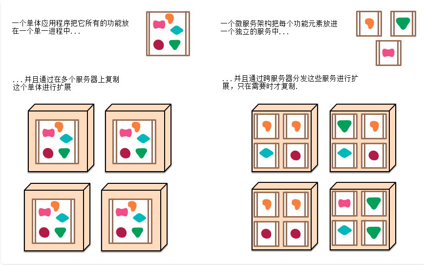

# SpringBoot

[TOC]

## SpringBoot入门

Spring Boot来简化Spring应用开发，约定大于配置，去繁从简

背景：
J2EE笨重的开发、繁多的配置、低下的开发效率、
复杂的部署流程、第三方技术集成难度大。
解决：
“Spring全家桶”时代。
Spring Boot -> J2EE一站式解决方案
Spring Cloud -> 分布式整体解决方案

优点：

1. 快速创建独立运行的Spring项目以及与主流框架集成
2. 使用嵌入式的Servlet容器，应用无需打成WAR包
3. starters自动依赖与版本控制
4. 大量的自动配置，简化开发，也可修改默认值
5. 无需配置XML，无代码生成，开箱即用
6. 准生产环境的运行时应用监控
7. 与云计算的天然集成

单体应用

微服务

* 你必须掌握以下内容：
  Spring框架的使用经验
  熟练使用Maven进行项目构建和依赖管理
  熟练使用Eclipse或者IDEA
* 环境约束
  jdk1.8
  maven3.x
  IntelliJ IDEA 2017
  Spring Boot 1.5.9.RELEASE

## SpringBoot配置

## SpringBoot日志

## SpringBoot与Web开发

## SpringBoot与Docker

## SpringBoot与数据访问

## SpringBoot与启动配置原理

## SpringBoot自定义starters

## SpringBoot与缓存

## SpringBoot与消息

## SpringBoot与检索

## SpringBoot与任务

## SpringBoot与安全

## SpringBoot与分布式

## SpringBoot与开发热部署

## SpringBoot与监控管理
